# 7주차 개념 설명: EDA 기반 서비스 분리와 조회 구조

## 주제

쿠폰 발급이 끝난 뒤 필요한 알림, 마이페이지, 통계 작업을 `CouponIssued` 이벤트를 기준으로 분리하고, 각 서비스가 자신의 목적에 맞는 데이터를 독립적으로 만든다.

이번 주차의 핵심은 다음 문장으로 요약할 수 있다.

```text
Coupon Service는 쿠폰 발급을 확정하고
"쿠폰이 발급되었다"는 사실을 이벤트로 알린다.

알림, 마이페이지, 통계는 그 사실을 각자 처리한다.

한 후속 작업의 실패가
이미 완료된 쿠폰 발급을 실패로 바꾸면 안 된다.
```

---

## 1. 6주차까지 만든 구조와 남은 문제

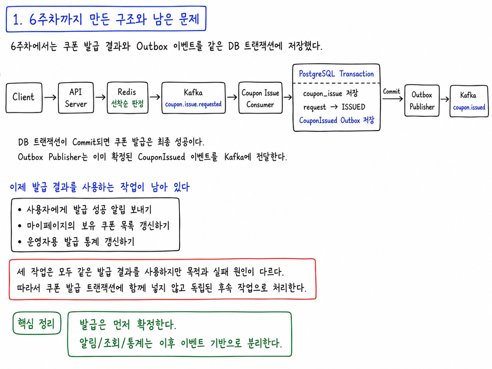

6주차에서는 쿠폰 발급 결과와 Outbox 이벤트를 같은 DB 트랜잭션에 저장했다.

```text
Client
  |
  | 쿠폰 발급 요청
  v
API Server
  |
  v
Redis 선착순 판정
  |
  v
Kafka coupon.issue.requested
  |
  v
Coupon Issue Consumer
  |
  v
+--------------------------------------+
| PostgreSQL Transaction               |
|--------------------------------------|
| coupon_issue 저장                    |
| request -> ISSUED                    |
| CouponIssued Outbox 저장             |
+--------------------------------------+
  |
  | Commit
  v
Outbox Publisher
  |
  v
Kafka coupon.issued
```

DB 트랜잭션이 Commit되면 쿠폰 발급은 최종 성공이다. Outbox Publisher는 이미 확정된 `CouponIssued` 이벤트를 Kafka에 전달한다.

이제 발급 결과를 사용하는 작업이 남아 있다.

```text
- 사용자에게 발급 성공 알림 보내기
- 마이페이지의 보유 쿠폰 목록 갱신하기
- 운영자용 발급 통계 갱신하기
```

세 작업은 모두 같은 발급 결과를 사용하지만 목적과 실패 원인이 다르다. 따라서 쿠폰 발급 트랜잭션에 함께 넣지 않고 독립된 후속 작업으로 처리한다.

---

## 2. Coupon Service가 후속 서비스를 직접 호출하면 생기는 문제

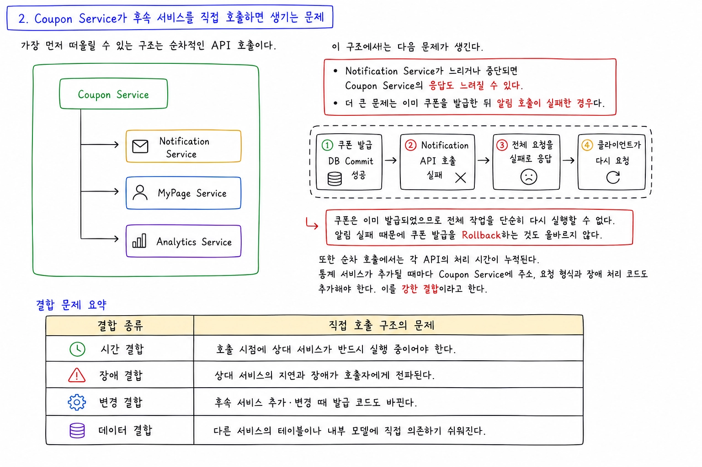

가장 먼저 떠올릴 수 있는 구조는 순차적인 API 호출이다.

```text
Coupon Service
  |
  +--> Notification Service
  |
  +--> MyPage Service
  |
  +--> Analytics Service
```

이 구조에서는 다음 문제가 생긴다.

Notification Service가 느리거나 중단되면 Coupon Service의 응답도 느려질 수 있다.

더 큰 문제는 이미 쿠폰을 발급한 뒤 알림 호출이 실패한 경우다.

```text
1. 쿠폰 발급 DB Commit 성공
2. Notification API 호출 실패
3. 전체 요청을 실패로 응답
4. 클라이언트가 다시 요청
```

쿠폰은 이미 발급되었으므로 전체 작업을 단순히 다시 실행할 수 없다. 알림 실패 때문에 쿠폰 발급을 Rollback하는 것도 올바르지 않다.

또한 순차 호출에서는 각 API의 처리 시간이 누적된다. 통계 서비스가 추가될 때마다 Coupon Service에 주소, 요청 형식과 장애 처리 코드도 추가해야 한다. 이를 **강한 결합**이라고 한다.

| 결합 종류 | 직접 호출 구조의 문제 |
| --- | --- |
| 시간 결합 | 호출 시점에 상대 서비스가 반드시 실행 중이어야 한다. |
| 장애 결합 | 상대 서비스의 지연과 장애가 호출자에게 전파된다. |
| 변경 결합 | 후속 서비스 추가·변경 때 발급 코드도 바뀐다. |
| 데이터 결합 | 다른 서비스의 테이블이나 내부 모델에 직접 의존하기 쉬워진다. |

---

## 3. EDA란 무엇인가

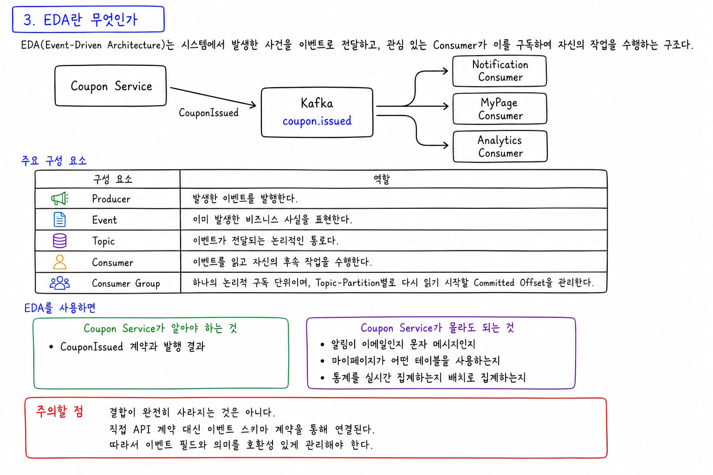

EDA(Event-Driven Architecture)는 시스템에서 발생한 사건을 **이벤트**로 전달하고, 관심 있는 Consumer가 이를 구독하여 자신의 작업을 수행하는 구조다.

```text
Coupon Service
  |
  | CouponIssued
  v
Kafka coupon.issued
  |
  +--> Notification Consumer
  |
  +--> MyPage Consumer
  |
  +--> Analytics Consumer
```

주요 구성 요소는 다음과 같다.

| 구성 요소 | 역할 |
| --- | --- |
| Producer | 발생한 이벤트를 발행한다. |
| Event | 이미 발생한 비즈니스 사실을 표현한다. |
| Topic | 이벤트가 전달되는 논리적인 통로다. |
| Consumer | 이벤트를 읽고 자신의 후속 작업을 수행한다. |
| Consumer Group | 하나의 논리적 구독 단위이며, Topic-Partition별로 다시 읽기 시작할 Committed Offset을 관리한다. |

EDA를 사용하면 Producer는 Consumer의 수와 구현을 알 필요가 없다.

```text
Coupon Service가 알아야 하는 것
-> CouponIssued 계약과 발행 결과

Coupon Service가 몰라도 되는 것
-> 알림이 이메일인지 문자 메시지인지
-> 마이페이지가 어떤 테이블을 사용하는지
-> 통계를 실시간 집계하는지 배치로 집계하는지
```

단, 결합이 완전히 사라지는 것은 아니다. 직접 API 계약 대신 **이벤트 스키마 계약**을 통해 연결된다. 따라서 이벤트 필드와 의미를 호환성 있게 관리해야 한다.

---

## 4. 이벤트는 명령이 아니라 이미 발생한 사실이다

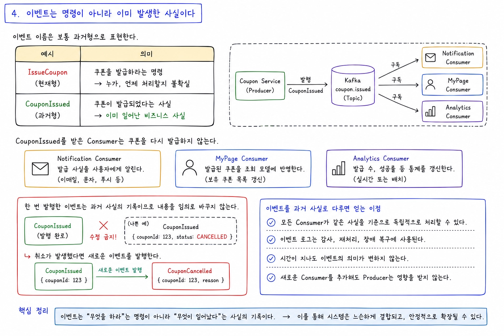

이벤트 이름은 보통 과거형으로 표현한다.

```text
IssueCoupon
-> 쿠폰을 발급하라는 명령

CouponIssued
-> 쿠폰이 발급되었다는 사실
```

`CouponIssued`를 받은 Consumer는 쿠폰을 다시 발급하지 않는다.

Notification은 발급 사실을 알리고, MyPage는 조회 모델에 반영하며, Analytics는 통계를 갱신한다.

한 번 발행한 이벤트는 과거 사실의 기록이므로 내용을 임의로 바꾸지 않는다. 취소가 발생했다면 기존 `CouponIssued`를 수정하는 대신 새로운 `CouponCancelled` 이벤트를 발행한다.

---

## 5. Consumer Group을 서비스별로 분리해야 한다

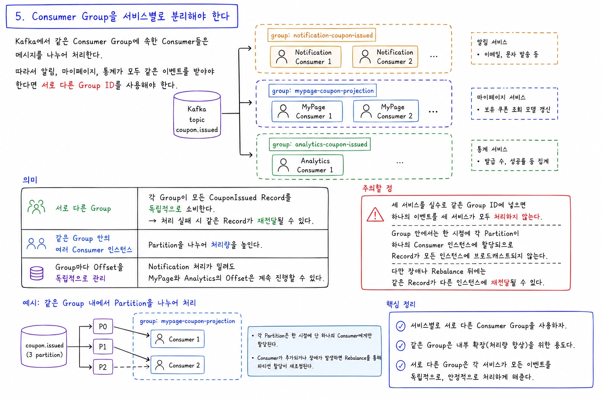

Kafka에서 같은 Consumer Group에 속한 Consumer들은 메시지를 **나누어 처리**한다.

따라서 알림, 마이페이지, 통계가 모두 같은 이벤트를 받아야 한다면 서로 다른 Group ID를 사용해야 한다.

```text
Kafka coupon.issued
  |
  +--> group: notification-coupon-issued
  |      +-- Notification Consumer 1
  |      +-- Notification Consumer 2
  |
  +--> group: mypage-coupon-projection
  |      +-- MyPage Consumer 1
  |      +-- MyPage Consumer 2
  |
  +--> group: analytics-coupon-issued
         +-- Analytics Consumer 1
```

의미는 다음과 같다.

```text
서로 다른 Group
-> 각 Group이 모든 CouponIssued Record를 독립적으로 소비한다.
   처리 실패 시 같은 Record가 재전달될 수 있다.

같은 Group 안의 여러 Consumer 인스턴스
-> Partition을 나누어 처리량을 높인다.
```

세 서비스를 실수로 같은 Group ID에 넣으면 하나의 이벤트를 세 서비스가 모두 처리하지 않는다. Group 안에서는 한 시점에 각 Partition이 하나의 Consumer 인스턴스에 할당되므로 Record가 모든 인스턴스에 브로드캐스트되지 않는다. 다만 장애나 Rebalance 뒤에는 같은 Record가 다른 인스턴스에 재전달될 수 있다.

또한 Group마다 Offset을 독립적으로 관리한다. Notification 처리가 밀려도 MyPage와 Analytics의 Offset은 계속 진행할 수 있다.

---

## 6. 서비스별 책임과 데이터 소유권

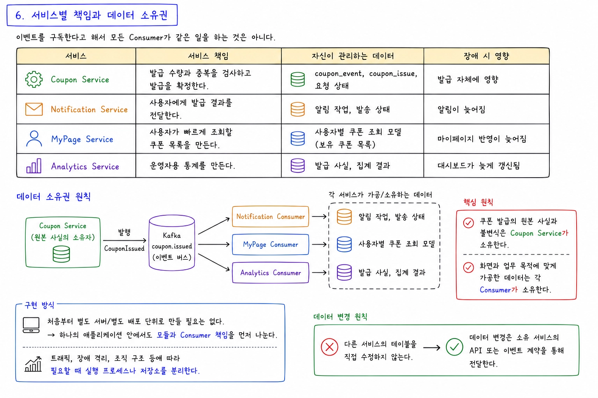

이벤트를 구독한다고 해서 모든 Consumer가 같은 일을 하는 것은 아니다.

| 서비스 | 책임 | 자신이 관리하는 데이터 | 장애 시 영향 |
| --- | --- | --- | --- |
| Coupon Service | 발급 수량과 중복을 검사하고 발급을 확정한다. | `coupon_event`, `coupon_issue`, 요청 상태 | 발급 자체에 영향 |
| Notification Service | 사용자에게 발급 결과를 전달한다. | 알림 작업, 발송 상태 | 알림이 늦어짐 |
| MyPage Service | 사용자가 빠르게 조회할 쿠폰 목록을 만든다. | 사용자별 쿠폰 조회 모델 | 마이페이지 반영이 늦어짐 |
| Analytics Service | 운영자용 통계를 만든다. | 발급 사실, 집계 결과 | 대시보드가 늦게 갱신됨 |

가장 중요한 기준은 다음과 같다.

```text
쿠폰 발급의 원본 사실과 불변식
-> Coupon Service가 소유한다.

화면과 업무 목적에 맞게 가공한 데이터
-> 각 Consumer가 소유한다.
```

서비스 분리는 처음부터 별도 서버와 별도 배포 단위로 만들어야 한다는 뜻은 아니다. 하나의 애플리케이션 안에서 모듈과 Consumer 책임을 먼저 나눈 뒤, 필요할 때 실행 프로세스나 저장소를 분리할 수도 있다.

다만 논리적으로 분리했다면 다른 서비스의 테이블을 직접 수정하지 않는다. 데이터 변경은 소유 서비스의 API 또는 이벤트 계약을 통해 전달한다.

---

## 7. CQRS와 Read Model

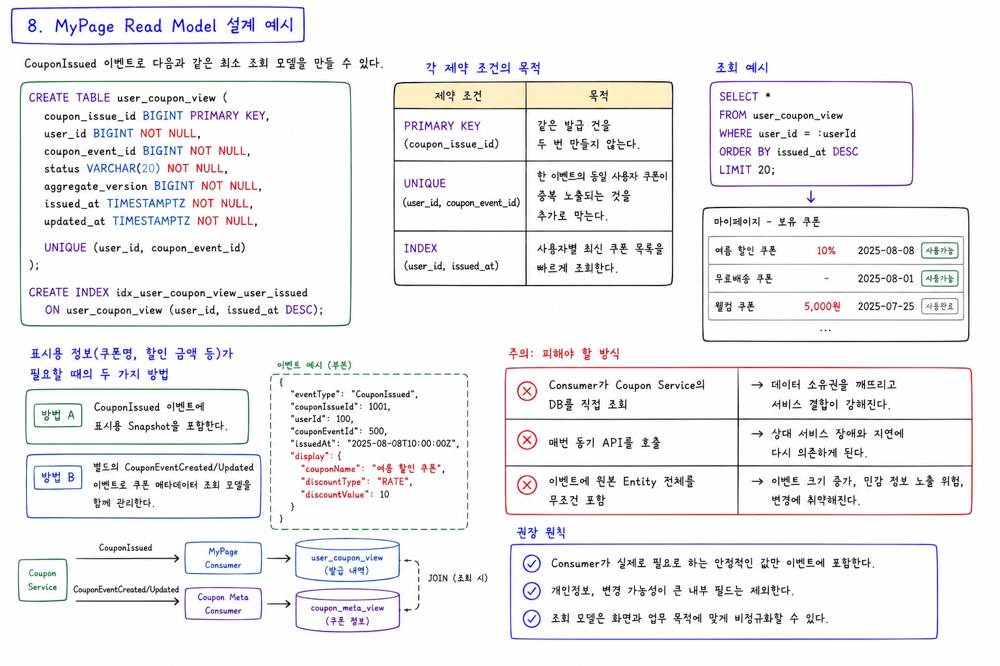

CQRS(Command Query Responsibility Segregation)는 **변경을 처리하는 모델**과 **조회를 처리하는 모델**을 분리하는 방식이다.

```text
Command / Write Model
-> 쿠폰 발급 요청 처리
-> 중복과 수량 불변식 보장
-> 명령 처리와 불변식 보장에 맞는 모델 사용

Query / Read Model
-> 마이페이지 목록 조회
-> 운영자 통계 조회
-> 화면에 필요한 형태로 빠르게 응답
```

쿠폰 발급용 테이블은 정확한 쓰기에 적합하게 설계한다. 하지만 마이페이지에서 매번 여러 테이블을 조인하거나 다른 서비스 API를 호출하면 조회가 복잡하고 느려질 수 있다.

그래서 MyPage Consumer가 `CouponIssued`를 받아 조회 전용 데이터를 만든다.

```text
CouponIssued
  |
  v
MyPage Consumer
  |
  v
user_coupon_view
  |
  v
GET /api/users/{userId}/coupons
```

Read Model은 화면에서 필요한 값을 미리 모아 둔 **비정규화된 데이터**일 수 있다. 같은 정보가 일부 중복되더라도 조회가 단순하고 빨라지는 장점이 있다.

CQRS를 적용한다고 반드시 다음이 모두 필요한 것은 아니다.

```text
- 별도 마이크로서비스
- 별도 종류의 Database
- 복잡한 Event Sourcing
```

정규화 여부와 물리적인 DB 분리는 구현 선택이다. 같은 애플리케이션과 DB에서도 Command와 Query의 처리 경로와 모델을 명확히 나누면 CQRS를 적용할 수 있다. 반대로 테이블 이름만 나눈다고 자동으로 CQRS가 되는 것은 아니다.

---

## 8. MyPage Read Model 설계 예시

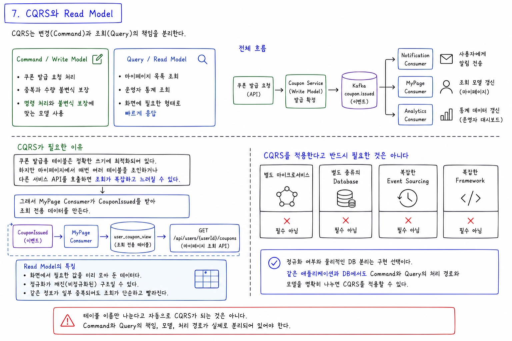

현재 `CouponIssued` 이벤트로 다음과 같은 최소 조회 모델을 만들 수 있다.

```sql
CREATE TABLE user_coupon_view (
    coupon_issue_id BIGINT PRIMARY KEY,
    user_id BIGINT NOT NULL,
    coupon_event_id BIGINT NOT NULL,
    status VARCHAR(20) NOT NULL,
    aggregate_version BIGINT NOT NULL,
    issued_at TIMESTAMPTZ NOT NULL,
    updated_at TIMESTAMPTZ NOT NULL,

    UNIQUE (user_id, coupon_event_id)
);

CREATE INDEX idx_user_coupon_view_user_issued
    ON user_coupon_view (user_id, issued_at DESC);
```

각 제약 조건의 목적은 다르다.

```text
PRIMARY KEY (coupon_issue_id)
-> 같은 발급 건을 두 번 만들지 않는다.

UNIQUE (user_id, coupon_event_id)
-> 한 이벤트의 동일 사용자 쿠폰이 중복 노출되는 것을 추가로 막는다.

INDEX (user_id, issued_at)
-> 사용자별 최신 쿠폰 목록을 빠르게 조회한다.
```

쿠폰 이름이나 할인 금액까지 화면에 즉시 보여줘야 한다면 두 가지 방법을 생각할 수 있다.

```text
방법 A. CouponIssued에 표시용 Snapshot을 포함한다.
방법 B. 별도의 CouponEventCreated/Updated 이벤트로
        쿠폰 메타데이터 조회 모델을 함께 관리한다.
```

Consumer가 이벤트를 처리할 때마다 Coupon Service의 DB를 직접 조회하는 방식은 데이터 소유권을 깨뜨린다. 매번 동기 API를 호출하는 방식도 상대 서비스 장애에 다시 의존하게 된다.

이벤트에 원본 Entity 전체를 무조건 넣는 것도 좋지 않다. Consumer가 실제로 필요로 하는 안정적인 값만 포함하고, 개인정보와 변경 가능성이 큰 내부 필드는 제외한다.

---

## 9. 중복 이벤트를 안전하게 처리하는 방법

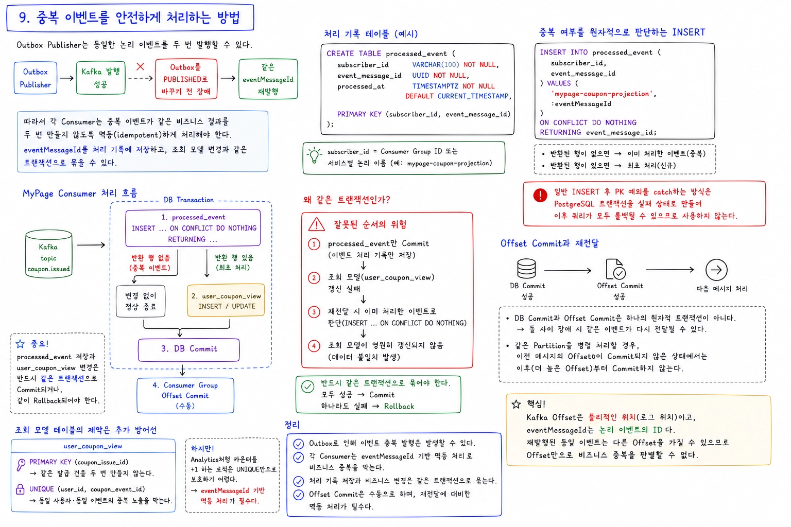

6주차의 Outbox Publisher는 같은 논리 이벤트를 두 번 발행할 수 있다.

```text
Kafka 발행 성공
  |
  X Outbox를 PUBLISHED로 바꾸기 전 장애
  |
  v
같은 eventMessageId 재발행
```

따라서 각 Consumer는 중복 이벤트가 같은 비즈니스 결과를 두 번 만들지 않도록 설계해야 한다. `eventMessageId`를 처리 기록에 저장하고, 조회 모델 변경과 같은 트랜잭션으로 묶을 수 있다.

```sql
CREATE TABLE processed_event (
    subscriber_id VARCHAR(100) NOT NULL,
    event_message_id UUID NOT NULL,
    processed_at TIMESTAMPTZ NOT NULL DEFAULT CURRENT_TIMESTAMP,

    PRIMARY KEY (subscriber_id, event_message_id)
);
```

중복 PK 예외로 트랜잭션 전체가 실패하지 않도록 원자적인 INSERT 결과로 최초 처리 여부를 판단한다.

```sql
INSERT INTO processed_event (
    subscriber_id,
    event_message_id
) VALUES (
    'mypage-coupon-projection',
    :eventMessageId
)
ON CONFLICT DO NOTHING
RETURNING event_message_id;
```

반환된 행이 없으면 이미 처리한 이벤트다. 일반적인 `INSERT`에서 PK 예외를 잡고 계속 진행하는 방식은 PostgreSQL 트랜잭션을 실패 상태로 만들 수 있으므로 사용하지 않는다.

MyPage Consumer의 처리 흐름은 다음과 같다.

```text
DB Transaction 시작
  |
  v
processed_event INSERT ... ON CONFLICT DO NOTHING
  |
  +-- 반환 행 없음 -> 중복 이벤트, 변경 없이 정상 종료
  |
  +-- 반환 행 있음 -> user_coupon_view INSERT
  |
  v
DB Commit
  |
  v
Consumer Group Offset Commit
```

`processed_event` 저장과 `user_coupon_view` 변경은 반드시 함께 Commit되거나 함께 Rollback되어야 한다.

여기서는 자동 Offset Commit을 끄고 수동으로 완료 처리한다고 가정한다. DB Commit과 Offset Commit은 하나의 원자적 트랜잭션이 아니므로 둘 사이의 장애에서는 중복 재전달이 남는다. 같은 Partition을 병렬 처리한다면 앞선 미완료 Record를 건너뛰어 더 높은 Offset부터 Commit하지 않도록 해야 한다.

```text
잘못된 순서
1. processed_event만 Commit
2. 조회 모델 갱신 실패
3. 재전달 시 이미 처리한 이벤트로 판단
4. 조회 모델이 영원히 갱신되지 않음
```

`user_coupon_view`의 PK와 UNIQUE 제약은 추가 방어선이다. 그러나 Analytics처럼 카운터를 `+1` 하는 로직은 UNIQUE만으로 보호하기 어려우므로 `eventMessageId` 기반 멱등 처리가 특히 중요하다.

Kafka Offset은 Record의 물리적인 위치이고 `eventMessageId`는 논리 이벤트의 ID다. 재발행된 같은 이벤트는 다른 Offset을 가질 수 있으므로 Offset만으로 비즈니스 중복을 판별할 수 없다.

---

## 10. Notification과 Analytics Consumer는 어떻게 다른가

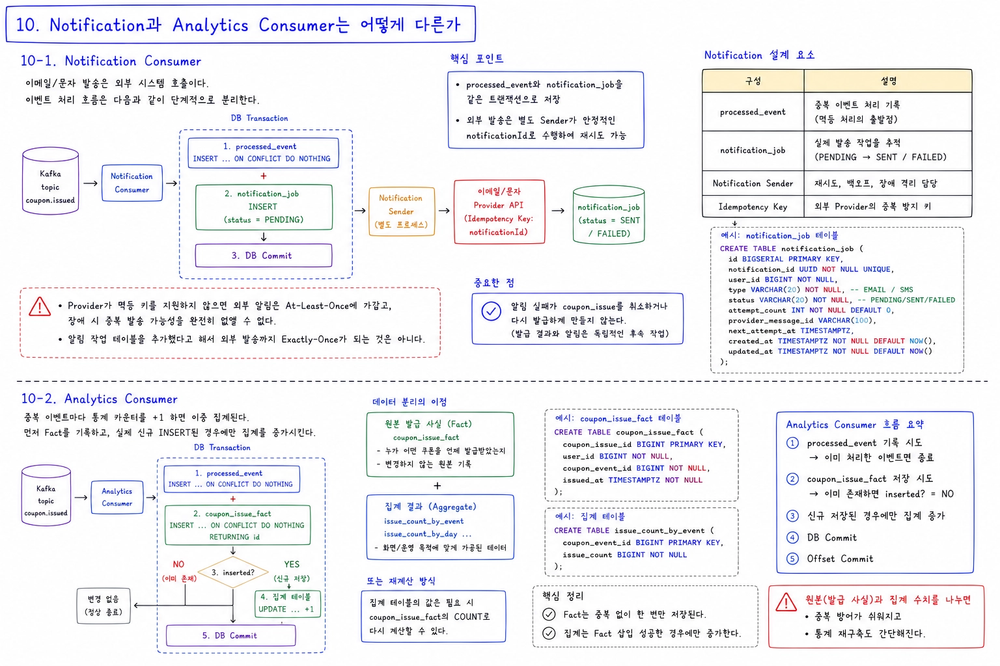

### 10-1. Notification Consumer

이메일이나 문자 발송은 외부 시스템 호출이다. 이벤트를 받자마자 외부 API를 호출하면 전송 성공 후 로컬 완료 상태 저장 전에 장애가 발생해 같은 알림이 다시 전송될 수 있다.

그래서 Notification Consumer는 `processed_event`와 `notification_job`을 같은 DB 트랜잭션으로 저장하고, 별도 Sender가 안정적인 `notificationId`를 Provider의 Idempotency Key로 사용해 재시도할 수 있다.

Provider가 멱등 키를 지원하지 않으면 외부 알림은 At-Least-Once에 가깝고, 장애 시 중복 발송 가능성을 완전히 없앨 수 없다. 알림 작업 테이블을 추가했다는 사실만으로 외부 발송까지 Exactly-Once가 되는 것은 아니다.

중요한 점은 알림 실패가 `coupon_issue`를 취소하거나 다시 발급하게 만들지 않는다는 것이다.

### 10-2. Analytics Consumer

중복 이벤트마다 통계 카운터를 `+1` 하면 이중 집계된다. 먼저 `coupon_issue_fact`를 `ON CONFLICT DO NOTHING`으로 저장하고, 실제 INSERT된 경우에만 같은 트랜잭션에서 집계를 증가시킨다.

또는 집계값을 Fact의 `COUNT`로 다시 계산할 수 있다. 원본 발급 사실과 집계 수치를 나누면 중복 방어와 통계 재구축이 쉬워진다.

---

## 11. 최종적 일관성을 사용자에게 어떻게 보여줄까

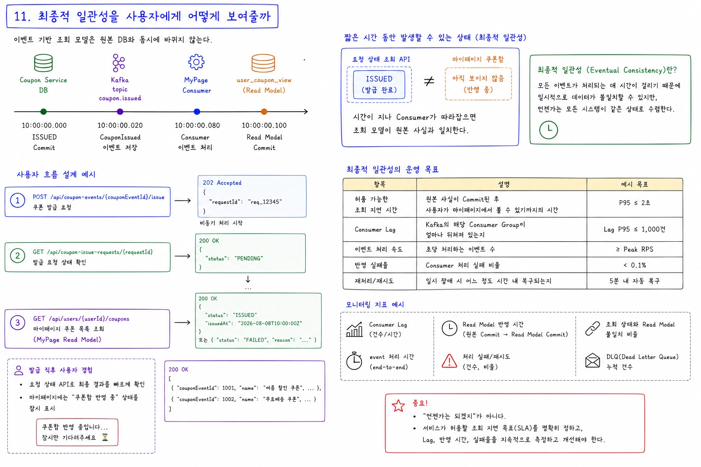

이벤트 기반 조회 모델은 원본 DB와 동시에 바뀌지 않는다.

```text
10:00:00.000  Coupon Service DB -> ISSUED Commit
10:00:00.020  CouponIssued -> Kafka 저장
10:00:00.080  MyPage Consumer 처리
10:00:00.100  user_coupon_view Commit
```

짧은 시간 동안 다음 상태가 가능하다.

```text
요청 상태 조회 API
-> ISSUED

마이페이지 쿠폰함
-> 아직 보이지 않음
```

이를 **최종적 일관성(Eventual Consistency)**이라고 한다. 시간이 지나 Consumer가 따라잡으면 조회 모델이 원본 사실과 일치한다.

사용자 흐름은 다음처럼 설계할 수 있다.

```text
POST /api/coupon-events/{couponEventId}/issue
-> 202 Accepted + requestId

GET /api/coupon-issue-requests/{requestId}
-> PENDING / ISSUED / FAILED

GET /api/users/{userId}/coupons
-> MyPage Read Model에서 쿠폰 목록 조회
```

발급 직후에는 요청 상태 API를 최종 결과 확인에 사용하고, 마이페이지에는 “쿠폰함 반영 중”과 같은 상태를 잠시 보여줄 수 있다.

최종적 일관성은 “언젠가는 되겠지”라는 뜻이 아니다. 서비스가 허용할 조회 지연 목표를 정하고 Consumer Lag과 반영 시간을 측정해야 한다.

---

## 12. 이벤트 순서와 버전

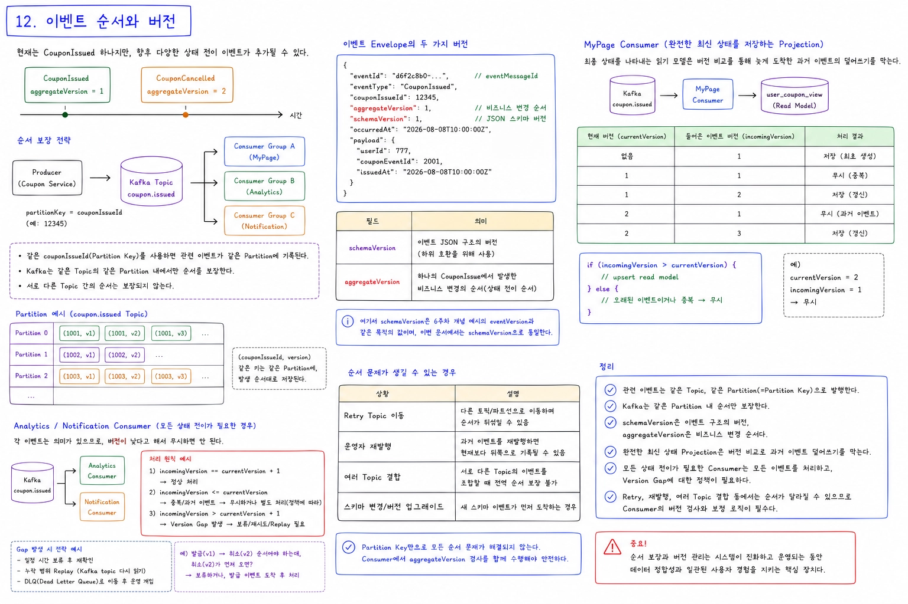

현재는 `CouponIssued`만 있지만 나중에는 다음 이벤트가 추가될 수 있다.

```text
CouponIssued      aggregateVersion = 1
CouponCancelled   aggregateVersion = 2
```

같은 쿠폰 발급 건의 순서를 지키려면 관련 이벤트를 같은 Topic에 두고 `couponIssueId`를 Partition Key로 사용한다. 안정적인 Partition 전략으로 발생 순서대로 발행하면 같은 Key의 Record가 같은 Partition에 기록된다.

```text
partitionKey = couponIssueId
```

Kafka는 모든 사용자의 전역 순서를 보장하는 것이 아니라 **같은 Topic의 같은 Partition에 기록된 순서**를 보장한다. 두 이벤트가 서로 다른 Topic에 있다면 Key가 같아도 두 Topic 사이의 순서는 보장되지 않는다.

이벤트 Envelope의 두 버전은 목적이 다르다.

| 필드 | 의미 |
| --- | --- |
| `schemaVersion` | JSON 필드 구조의 버전 |
| `aggregateVersion` | 한 `CouponIssue`에서 발생한 비즈니스 변경 순서 |

여기서 `schemaVersion`은 6주차 개념 예시의 `eventVersion`과 같은 목적의 값이다. 이번 문서에서는 6주차 과제의 필드명인 `schemaVersion`으로 통일한다.

MyPage처럼 **완전한 최신 상태를 저장하는 Projection**은 `incomingVersion > currentVersion`일 때만 갱신하여 늦게 온 과거 이벤트의 덮어쓰기를 막을 수 있다.

반면 발급과 취소를 모두 세는 Analytics나 각각 알림을 보내는 Notification은 낮은 버전이라는 이유만으로 이벤트를 버리면 안 된다. 모든 상태 전이가 필요하다면 `incomingVersion == currentVersion + 1`만 처리하고, Version Gap은 보류·재시도·Replay하는 정책이 필요하다.

Partition Key만 정했다고 모든 상황의 순서 문제가 자동으로 해결되지는 않는다. Retry Topic 이동, 운영자 재발행, 여러 Topic 결합에서는 순서가 달라질 수 있으므로 Consumer의 버전 검사도 필요하다.

---

## 13. 운영 시 추가로 고려할 내용

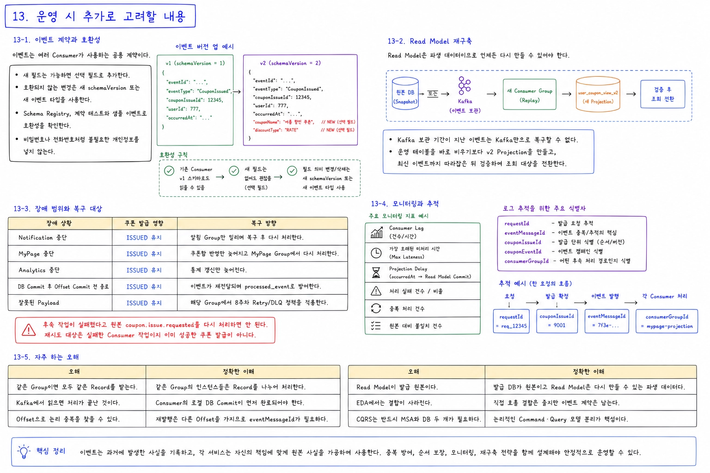

### 13-1. 이벤트 계약과 호환성

이벤트는 여러 Consumer가 사용하는 공용 계약이다. 기존 필드의 의미를 바꾸거나 갑자기 삭제하면 독립적으로 배포된 Consumer가 실패할 수 있다.

```text
- 새 필드는 가능하면 선택 필드로 추가한다.
- 호환되지 않는 변경은 새 schemaVersion 또는 새 이벤트 타입을 사용한다.
- Schema Registry, 계약 테스트와 샘플 이벤트로 호환성을 확인한다.
- 비밀번호나 전화번호처럼 불필요한 개인정보를 넣지 않는다.
```

### 13-2. Read Model 재구축

`user_coupon_view`와 통계는 파생 데이터다. 버그로 잘못된 값이 쌓이면 원본 DB Snapshot으로 Backfill하거나, 보관 중인 이벤트를 새 Consumer Group으로 Replay하여 다시 만들 수 있어야 한다.

Kafka 보관 기간이 지난 이벤트는 Kafka만으로 복구할 수 없다. 운영 테이블을 바로 비우기보다 `user_coupon_view_v2` 같은 새 Projection을 만들고, 최신 이벤트까지 따라잡은 뒤 검증하여 조회 대상을 전환하는 편이 안전하다.

### 13-3. 장애 범위와 복구 대상

| 장애 상황 | 쿠폰 발급 | 영향과 복구 방향 |
| --- | --- | --- |
| Notification 중단 | `ISSUED` 유지 | 알림 Group만 밀리며 복구 후 다시 처리한다. |
| MyPage 중단 | `ISSUED` 유지 | 쿠폰함 반영만 늦어지고 MyPage Group에서 다시 처리한다. |
| Analytics 중단 | `ISSUED` 유지 | 통계 갱신만 늦어진다. |
| DB Commit 후 Offset Commit 전 종료 | `ISSUED` 유지 | 이벤트가 재전달되며 `processed_event`로 방어한다. |
| 잘못된 Payload | `ISSUED` 유지 | 해당 Group에서 8주차 Retry/DLQ 정책을 적용한다. |

후속 작업이 실패했다고 원본 `coupon.issue.requested`를 다시 처리하면 안 된다. 재시도 대상은 실패한 Consumer 작업이지 이미 성공한 쿠폰 발급이 아니다.

### 13-4. 모니터링과 추적

Group별 Consumer Lag, 가장 오래된 미처리 시간, `occurredAt`부터 조회 모델 Commit까지의 Projection Delay, 처리 실패·중복 건수와 원본 대비 불일치 건수를 확인한다.

로그에는 `requestId`, `eventMessageId`, `couponIssueId`, `couponEventId`, `consumerGroupId`를 남겨 발급부터 각 후속 처리까지 연결해 추적한다.

### 13-5. 자주 하는 오해

| 오해 | 정확한 이해 |
| --- | --- |
| 같은 Group이면 모두 같은 Record를 받는다. | 같은 Group의 인스턴스들은 Record를 나누어 처리한다. |
| Kafka에서 읽으면 처리가 끝난 것이다. | Consumer의 로컬 DB Commit이 먼저 완료되어야 한다. |
| Offset으로 논리 중복을 찾을 수 있다. | 재발행은 다른 Offset을 가지므로 `eventMessageId`가 필요하다. |
| Read Model이 발급 원본이다. | 발급 DB가 원본이고 Read Model은 다시 만들 수 있는 파생 데이터다. |
| EDA에서는 결합이 사라진다. | 직접 호출 결합은 줄지만 이벤트 계약은 남는다. |
| CQRS는 반드시 MSA와 DB 두 개가 필요하다. | 논리적인 Command·Query 모델 분리가 핵심이다. |

---

## 14. 전체 처리 흐름

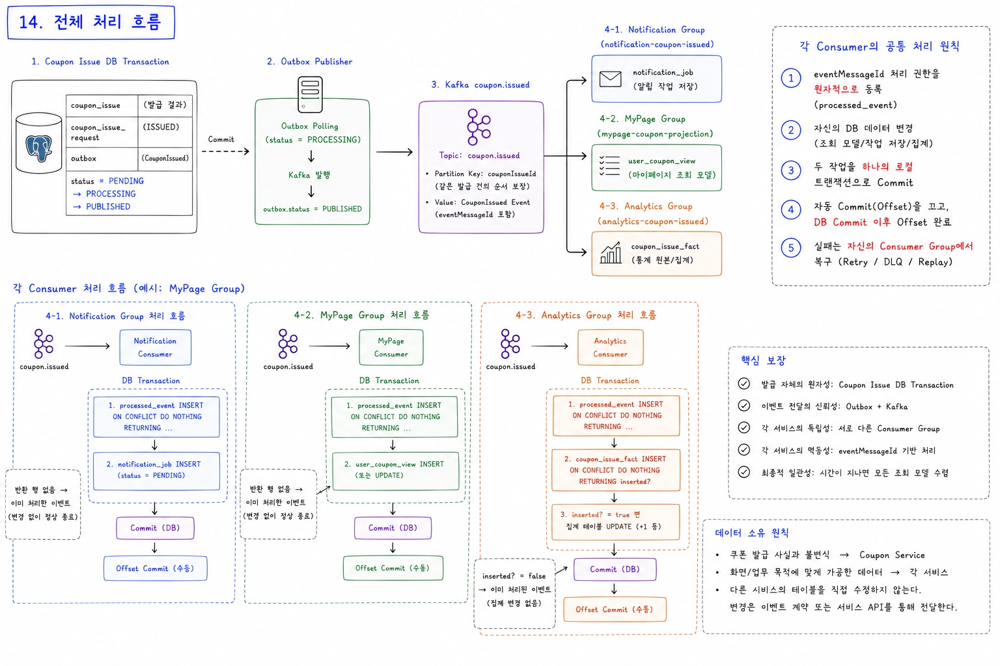

```text
Coupon Issue DB Transaction
  | coupon_issue + request ISSUED + CouponIssued Outbox
  v
Outbox Publisher
  |
  v
Kafka coupon.issued
  |
  +--> Notification Group -> notification_job
  |
  +--> MyPage Group       -> user_coupon_view
  |
  +--> Analytics Group    -> coupon_issue_fact
```

세 Group은 Kafka의 같은 `CouponIssued`를 각각 독립적으로 소비하고 자신의 데이터만 변경한다.

각 Consumer의 공통 처리 원칙은 다음과 같다.

```text
1. eventMessageId 처리 권한을 원자적으로 등록
2. 자신의 DB 데이터 변경
3. 두 작업을 하나의 로컬 트랜잭션으로 Commit
4. 자동 Commit을 끄고 DB Commit 이후 Offset 완료
5. 실패는 자신의 Consumer Group에서 복구
```
