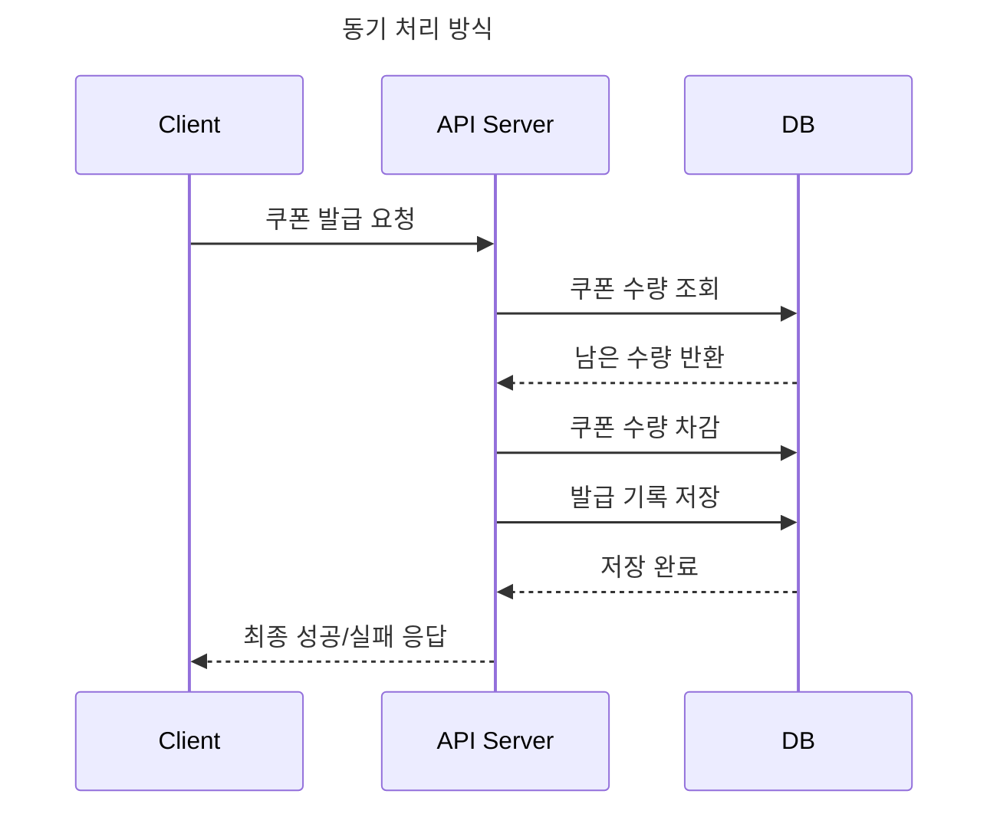
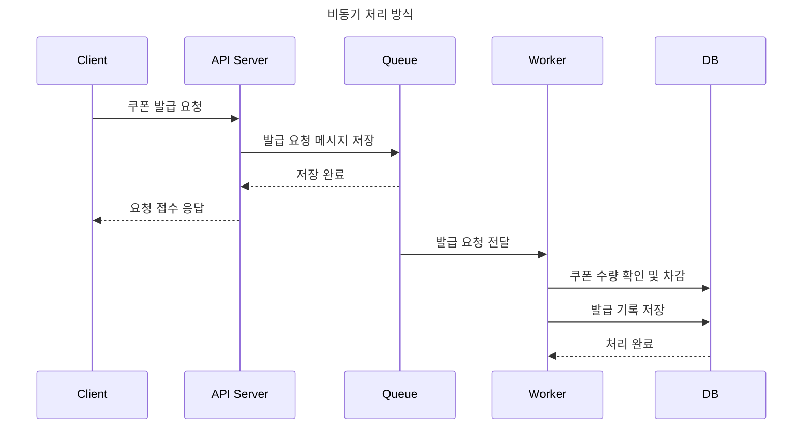
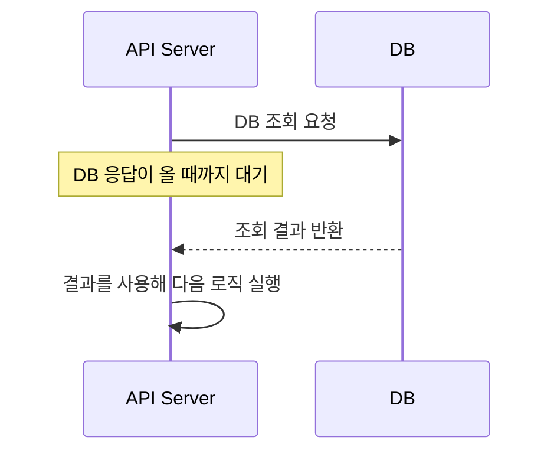
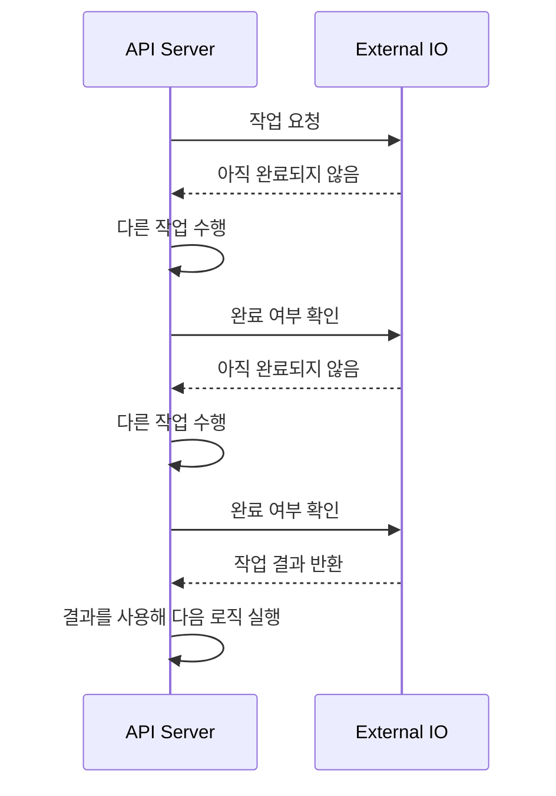
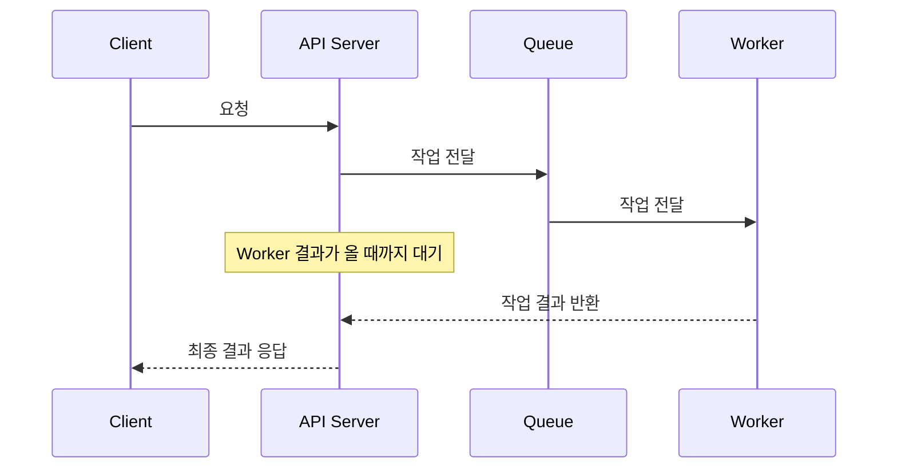
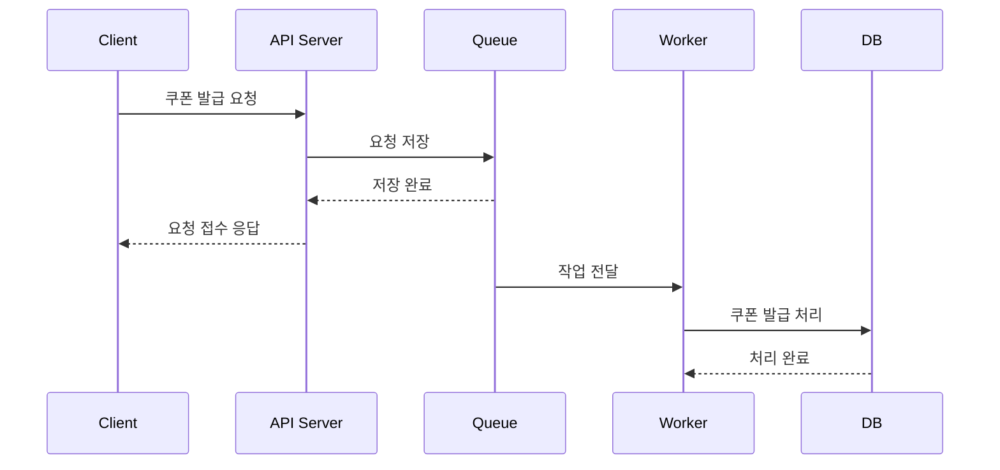

# 1주차 과제: 요청 처리 구조 설계

---

## 과제 1. 동기 처리와 비동기 처리 구조를 전체 요청 처리 순서에 맞게 다이어그램으로 그리기

쿠폰 발급 요청이 들어왔을 때 동기 처리 방식과 비동기 처리 방식이 각각 어떤 순서로 동작하는지 다이어그램으로 작성한다.

---

## 과제 2. 구조 A와 구조 B 중 더 적합한 구조 선택하기

1. 두 구조 중 선착순 쿠폰 이벤트에 더 적합한 구조는 무엇인가?

구조 B가 더 적합하다. 선착순 쿠폰 이벤트는 이벤트 시작 직후 몇 초 ~ 몇 분 동안 수많은 요청이 몰린다.
구조 A의 경우, API 서버가 모든 요청을 적재하고 대기하고 실제 처리가 진행될 때까지 대기한다.
이때 요청 처리 스레드와 커넥션이 오래 점유된다.
그 결과 응답 지연, 타임아웃, 처리량 저하가 발생할 수 있다.

구조 B는 API 서버가 쿠폰 발급 요청을 접수한 뒤 바로 사용자에게 처리 중 응답을 반환하고, 실제 쿠폰 발급은 Worker가 뒤에서 처리한다.
따라서 API 서버가 오래 대기하지 않아도 되고, 사용자는 최종 결과를 조회 API나 마이페이지를 통해 나중에 확인할 수 있다. 
이런 구조가 순간적으로 요청이 몰리는 선착순 쿠폰 이벤트에 더 적합하다.

2. 구조 A는 Queue를 사용했는데도 왜 비동기 처리의 장점이 줄어드는가?

구조 A는 Queue를 사용했으나 쿠폰 발급 처리까지 이루어지고 나서 실제 결과가 반환되기 때문에 대기 시간이 길어진다.
따라서 최종 발급까지 끝내지 않고, 요청만 먼저 접수한 뒤 실제 발급 처리는 뒤에서 수행하는 비동기 처리의 장점이 줄어든다.
또한 API 서버가 Worker 결과를 기다리는 동안 요청 처리 스레드와 커넥션이 계속 점유되므로, Queue를 사용했더라도 요청 흐름과 실제 처리 흐름이 제대로 분리되지 않는다.

3. API Server가 Worker 결과를 기다리면 어떤 문제가 생기는가?

API 서버가 Worker 결과를 기다리는 동안 요청 처리 스레드와 커넥션이 계속 점유된다.
그 결과 응답 지연, timeout, 서버 리소스 고갈, 처리량 저하가 발생할 수 있다.
또한 Worker 처리 속도가 느려지면 API Server의 응답 속도도 느려지게 된다.

4. 구조 B를 선택한다면 사용자는 최종 발급 결과를 어떻게 확인해야 하는가?

조회 API나 마이페이지에서 최종 발급 결과를 확인할 수 있다.

---

## 과제 3. 나쁜 설계의 문제점을 찾고 개선하기

1. 이 설계에서 문제가 될 수 있는 부분을 5개 이상 찾아라.
   1. 요청이 몰릴 시 API 서버와 DB 서버에 부하가 발생한다.
   2. 여러 요청이 동시에 DB에 쿠폰 발급 기록을 저장하면 중복 발급이나 초과 발급이 발생할 수 있다.
   3. Client는 실제 쿠폰이 발급되고 알림 발송 후 마이페이지 데이터가 갱신될 때까지 응답을 받을 수 없다.
   4. DB 조회 시점의 쿠폰 수량과 DB에 쿠폰 발급 기록을 저장할 때의 수량이 다를 수 있다.
   5. 쿠폰 발급과 알림 발송, 마이페이지 데이터 갱신이 하나의 흐름에 묶여 있으면 후속 작업 실패가 쿠폰 발급 응답에 영향을 줄 수 있다. 예를 들어 알림 발송이 실패했는데 쿠폰 발급까지 실패한 것처럼 처리될 수 있다.

2. API Server가 너무 많은 일을 하면 어떤 문제가 생기는가?

요청 하나를 처리하는 시간이 길어지게 되고, 그만큼 서버 자원이 오래 점유된다.
또한 쿠폰 발급과 직접 관련 없는 알림 발송이나 마이페이지 데이터 갱신까지 같은 흐름에서 처리하면, 후속 작업의 실패 쿠폰 발급 응답에 영향을 줄 수 있다.
결과적으로 API Server의 책임이 커지고 장애 지점이 늘어나며, 실패한 작업을 재처리하기도 어려워진다.

3. 알림 발송이나 마이페이지 데이터 갱신이 실패하면 쿠폰 발급 응답에 어떤 영향을 줄 수 있는가?

쿠폰 발급은 정상적으로 처리되었는데, 알림 발송이나 마이페이지 데이터 갱신에서 실패하게 되면 Client에게 실패 응답을 전달하게 되어 쿠폰 발급이 실패된 것처럼 보일 수 있다.
또한, 알림 발송이나 마이페이지 데이터 갱신의 실패한 로직만 재시도할 수 없고, 쿠폰 발급 흐름 전체를 다시 실행해야할 수 있다.
이 과정에서 중복 발급이나 데이터 불일치 문제가 생길 수 있다.

4. 요청 접수와 실제 발급 처리를 분리하는 구조로 개선하라.

---

## 과제 4. API Server가 직접 처리할 일과 비동기 처리 영역으로 넘길 일을 나누기

| 작업 | API Server에서 처리 | 비동기 처리 영역에서 처리 | 이유 |
| --- | --- | --- | --- |
| 로그인 여부 확인 | ✅ |  | 로그인되어 있지 않은 사용자는 쿠폰 발급 요청 자체가 불가능하므로 요청 접수 전에 확인해야 한다. |
| 이벤트 시간 확인 | ✅ |  | 이벤트 시간이 아니면 요청을 Queue에 넣을 필요가 없으므로 API Server에서 빠르게 거절한다. |
| 쿠폰 수량 최종 차감 |  | ✅ | 여러 요청이 동시에 들어올 수 있으므로 실제 수량 차감은 Worker가 발급 처리 흐름에서 최종적으로 수행해야 한다. |
| DB 발급 기록 저장 |  | ✅ | 발급 성공/실패 결과는 실제 발급 처리 이후 결정되므로 Worker가 DB에 발급 기록을 저장한다. |
| 사용자에게 요청 접수 응답 | ✅ |  | API Server는 요청을 Queue에 안전하게 저장한 뒤 사용자에게 처리 중 응답을 빠르게 반환해야 한다. |
| 발급 성공/실패 최종 결정 |  | ✅ | 최종 결과는 쿠폰 수량 차감과 발급 기록 저장까지 수행한 뒤 결정되므로 비동기 처리 영역에서 판단한다. |

---

## 과제 5. 요청 접수 성공 응답을 언제 반환할 수 있는지 설계하기

1. API 서버는 언제 사용자에게 요청 접수 성공 응답을 반환해야 하는가?

API 서버는 로그인 여부, 이벤트 시간 등 기본 검증을 마치고, 요청 상태를 DB에 PENDING으로 저장한 뒤 사용자에게 요청 접수 성공 응답을 반환해야 한다.

2. 요청이 메모리에만 있는 상태에서 응답하면 어떤 문제가 생기는가?

요청이 메모리에만 있는 상태에서 요청 성공 응답을 Client로 전달한 상태에서 API Server가 죽을 시 요청이 그대로 사라지게 된다.
따라서 Client는 요청 접수에 성공했다고 응답받았지만, Server에서는 Client의 요청에 관한 정보가 아무것도 남지 않게 된다.

3. 요청 상태를 PENDING으로 저장한 뒤 응답하는 방식은 어떤 장단점이 있는가?

Client의 요청에 관한 정보가 DB에 저장되므로, API Server가 다운되어도 요청에 관한 정보가 보존되고, PENDING인 요청에 대하여 쿠폰 발급을 재시도할 수 있다.
그러나 요청 상태가 PENDING으로 DB에 저장하는 것이 Queue나 Kafka에 안전하게 전달된다는 것을 보장하지는 않는다.
또한 DB 쓰기 부하가 커질 수 있다.

4. 비동기 처리 영역에 전달된 것을 확인한 뒤 응답하는 방식은 어떤 장단점이 있는가?

비동기 처리 영역에 전달된 것을 확인한 뒤 응답하면, 요청이 실제로 Worker가 처리할 수 있는 흐름에 들어갔다는 것을 보장할 수 있다. 
따라서 단순히 메모리에 올리거나 검증만 끝낸 경우보다 요청 유실 가능성이 낮다.

5. 내가 선택한 방식과 그 이유를 설명하라.

나는 API 서버가 적어도 요청 상태를 DB에 PENDING으로 저장한 뒤 요청 접수 성공 응답을 반환하는 방식을 선택한다. 이 방식은 모든 요청을 DB에 저장해야 하므로 쓰기 부하가 생길 수 있지만, 사용자가 접수 응답을 받은 뒤 API 서버가 장애로 종료되어도 요청 기록이 남는다는 장점이 있다.
또한 PENDING 상태를 기준으로 복구 로직이나 재시도 로직을 만들 수 있고, 사용자는 이후 조회 API나 마이페이지에서 PENDING, SUCCESS, FAILED 같은 상태를 확인할 수 있다.

---

## 과제 6. 항상 비동기가 성능이 좋은지 생각해보기

1. 비동기 처리가 동기 처리보다 유리한 상황은 언제인가?

비동기 처리는 요청이 짧은 시간에 많이 몰리거나, 처리 시간이 오래 걸리는 작업에서 유리하다. 
예를 들어 쿠폰 발급, 알림 발송, 이메일 전송, 이미지 처리처럼 사용자가 최종 결과를 즉시 받을 필요가 없는 작업은 요청 접수와 실제 처리를 분리할 수 있다.

2. 동기 처리가 더 단순하고 적합한 상황은 언제인가?

동기 처리는 처리 시간이 짧고, 사용자가 요청 결과를 즉시 알아야 하는 경우에 적합하다. 
예를 들어 로그인, 결제 승인 여부 확인, 게시글 단건 조회처럼 즉시 성공/실패를 응답해야 하는 기능은 동기 처리가 더 단순하고 이해하기 쉽다.

3. 비동기 처리 구조를 사용하면 어떤 추가 복잡도가 생기는가?

비동기 처리 구조를 사용하면 Queue, Worker, 상태 저장소 같은 추가 구성 요소가 필요하다. 
또한 요청 접수와 최종 성공/실패가 분리되므로 PENDING, SUCCESS, FAILED 같은 상태 관리가 필요하고, 실패한 작업에 대한 재시도, 중복 처리 방지, 순서 보장, 모니터링도 고려해야 한다.

4. 사용자가 최종 결과를 바로 알아야 하는 기능이라면 비동기 처리가 항상 적합한가?

최종 결과를 바로 알아야 하는 기능에는 동기 처리가 더 적합하다.
비동기 방식은 요청 접수 응답과 최종 처리 결과가 분리되기 때문에, 사용자는 결과를 다시 조회해야 한다.

5. 이번 선착순 쿠폰 이벤트에서는 왜 비동기 처리가 더 적합하다고 볼 수 있는가?

이번 선착순 쿠폰 이벤트는 이벤트 시작 직후 짧은 시간에 많은 요청이 몰릴 수 있다. API 서버가 모든 요청에 대해 쿠폰 수량 조회, 수량 차감, 발급 기록 저장까지 동기로 처리하면 API 서버와 DB에 부하가 집중되고 응답 지연이나 타임아웃이 발생할 수 있다.

비동기 구조를 사용하면 API 서버는 요청을 접수하고 Queue에 저장한 뒤 빠르게 응답할 수 있고, 실제 쿠폰 발급은 Worker가 뒤에서 처리할 수 있다. 따라서 순간적으로 몰리는 요청을 완충하고 API 서버의 대기 시간을 줄일 수 있어 더 적합하다.

---

## 과제 7. 동기/비동기와 블로킹/논블로킹 조합 분석하기

1. 아래 4가지 조합 각각이 무엇인지, 일반적인 작업 흐름 기준으로 다이어그램과 함께 설명하라.

### 1. 동기 / 블로킹

동기/블로킹은 요청한 작업의 결과를 같은 흐름에서 직접 기다리고, 작업이 끝날 때까지 현재 실행 흐름도 멈춰 있는 방식이다.

예를 들어 API Server가 DB에 조회 요청을 보낸 뒤, DB 응답이 올 때까지 기다리고 응답을 받은 뒤 다음 로직을 실행하는 경우이다.

### 2. 동기 / 논블로킹

동기/논블로킹은 요청한 작업의 최종 결과를 같은 흐름에서 직접 확인해야 하지만, 작업이 끝날 때까지 계속 멈춰 있지는 않는 방식이다.

예를 들어 API Server가 작업을 요청한 뒤 바로 제어권을 돌려받고, 작업이 끝났는지 반복적으로 확인하다가 최종 결과를 직접 받아 처리하는 경우이다.

### 3. 비동기 / 블로킹

비동기/블로킹은 요청한 작업의 처리 흐름은 분리되어 있지만, 결과를 받는 과정에서 현재 실행 흐름이 멈춰 있는 방식이다.

예를 들어 API Server가 Worker에게 작업을 맡겼지만, 그 결과를 받을 때까지 기다린 뒤 Client에게 응답하는 구조이다. 작업 자체는 Worker가 처리하므로 비동기처럼 보이지만, API Server가 결과를 기다리기 때문에 블로킹이 발생한다.

### 4. 비동기 / 논블로킹

비동기/논블로킹은 요청한 작업의 처리 흐름을 분리하고, 현재 실행 흐름도 작업 완료를 기다리지 않는 방식이다.

예를 들어 API Server가 요청을 Queue에 저장한 뒤 바로 Client에게 접수 응답을 반환하고, Worker가 뒤에서 실제 처리를 수행하는 경우이다. Client는 나중에 조회 API나 마이페이지에서 최종 결과를 확인한다.

2. 이 4가지 중 이번 선착순 쿠폰 발급 구조에 실제로 등장하는 조합은 무엇인지 고르고, 어디에서 등장하는지 근거를 들어 설명하라.

이번 선착순 쿠폰 발급 구조에서는 주로 비동기/논블로킹 구조가 등장한다.
API Server는 쿠폰 발급 요청을 Queue에 저장한 뒤 Worker의 최종 처리 결과를 기다리지 않고 Client에게 요청 접수 응답을 반환한다.
실제 쿠폰 발급은 Worker가 뒤에서 처리하고, 사용자는 나중에 조회 API나 마이페이지에서 최종 결과를 확인한다.

또한 내부적으로는 동기/블로킹 작업도 등장할 수 있다.
예를 들어 API Server가 Queue에 요청을 저장할 때 저장 성공 여부를 확인하기 위해 잠시 기다리거나, Worker가 DB에 쿠폰 수량 차감과 발급 기록 저장을 요청하고 DB 응답을 기다리는 경우는 동기/블로킹에 해당한다.

반면 구조 A처럼 API Server가 Queue를 사용하면서도 Worker의 최종 결과를 기다리는 구조는 비동기/블로킹에 가깝다.
실제 발급 처리는 Worker에게 분리했지만, API Server가 결과를 기다리기 때문에 요청 처리 흐름이 오래 점유된다.
