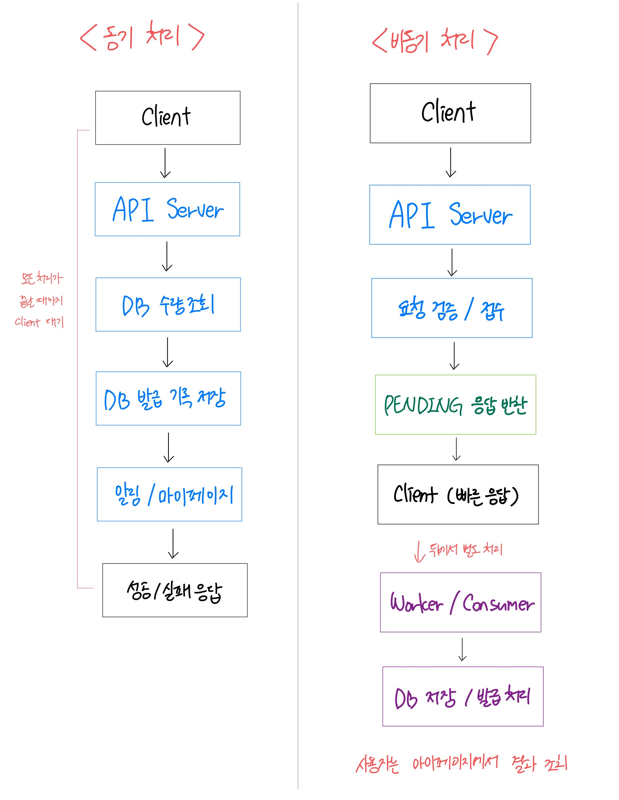
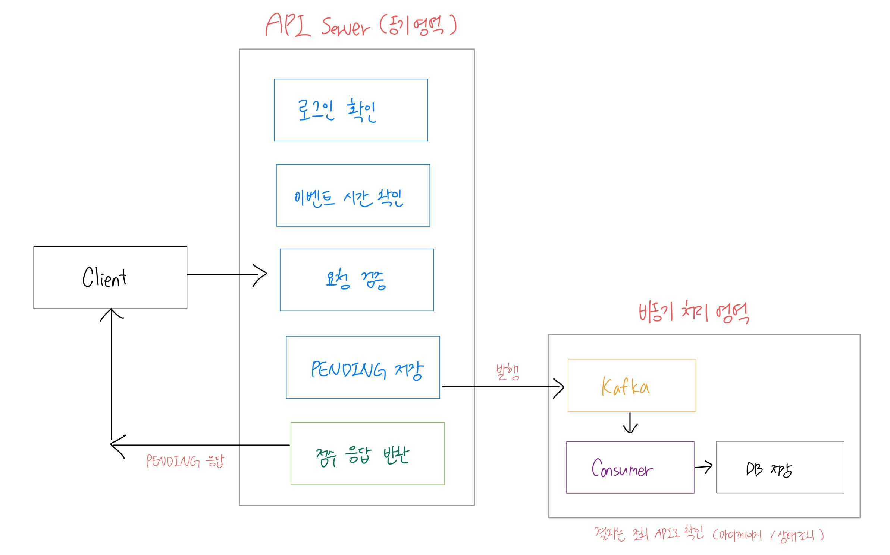
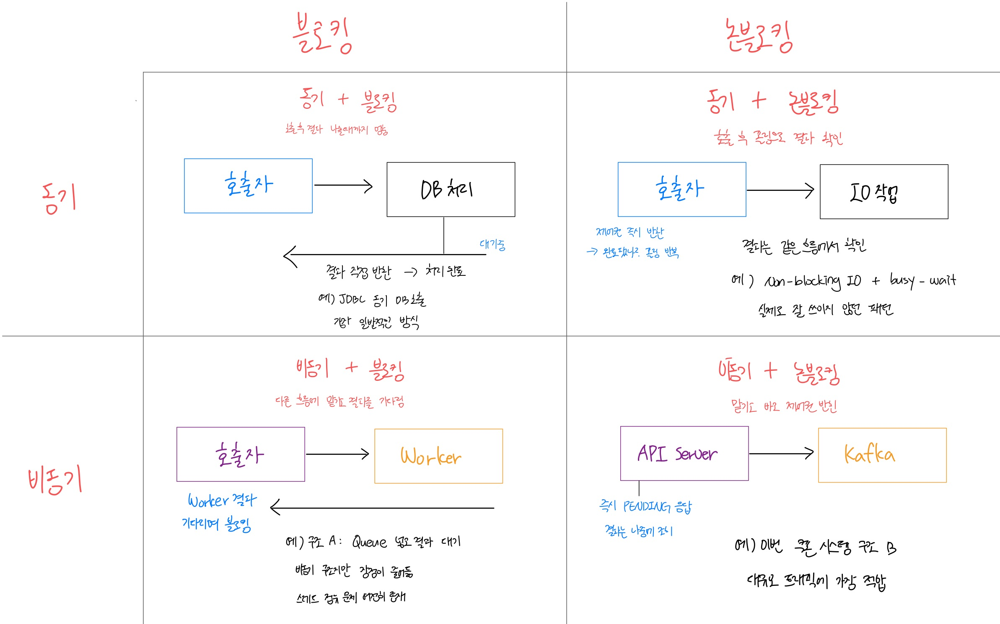

# 13기_배선아 1주차 과제

이번 주차 필수 과제는 아래 7가지다.

---

## 과제 1. 동기 처리와 비동기 처리 구조를 전체 요청 처리 순서에 맞게 다이어그램으로 그리기

쿠폰 발급 요청이 들어왔을 때 동기 처리 방식과 비동기 처리 방식이 각각 어떤 순서로 동작하는지 다이어그램으로 작성한다.



그림 아래에는 두 구조의 차이를 간단히 설명한다.

**동기 처리**는 Client가 요청을 보낸 뒤 DB 조회, 저장, 알림까지 모든 처리가 끝날 때까지 기다려야 한다. 구조가 단순하지만 요청이 몰리면 API 서버와 DB가 동시에 부하를 받는다.

**비동기 처리**는 API 서버가 요청 검증 후 즉시 `PENDING`응답을 반환하고, 실제 발급 처리는 별도의 Worker나 Consumer가 뒤에서 수행한다. Client는 결과를 나중에 마이페이지나 조회 API를 통해 확인한다.

---

## 과제 2. 구조 A와 구조 B 중 더 적합한 구조 선택하기

아래 두 구조를 비교한다.


다음 질문에 답한다.

```
1. 두 구조 중 선착순 쿠폰 이벤트에 더 적합한 구조는 무엇인가? 

 B 구조, API Server가 발급 결과를 기다리지 않고 빠르게 `PENDING` 응답을 반환하기 때문에, 순간적으로 많은 요청이 몰려도 API Server의 스레드가 오래 점유되지 않는다.

2. 구조 A는 Queue를 사용했는데도 왜 비동기 처리의 장점이 줄어드는가?

Queue를 사용해서 처리를 Worker에게 념겼지만, API Server가 Worker의 결과를 다시 기다리기 때문이다. 결국 Worker처리 시간이 전부 응답 대기 시간에 포함되고, API Server의 스레드도 점유된 채로 남아 있어 동기 처리와 사실상 같은 문제가 생긴다.

3. API Server가 Worker 결과를 기다리면 어떤 문제가 생기는가?    

이벤트 시작 순간에 각 요청이 Worker 처리가 끝날 때까지 스레드를 점유한다. Worker 처리가 1초만 걸려도 동시에 수천 개의 스레드가 대기 상태가 되고, 스레드 풀이 고갈되어 새로운 요청을 받지 못하거나 응답 시간이 늘어난다.

4. 구조 B를 선택한다면 사용자는 최종 발급 결과를 어떻게 확인해야 하는가?

API Server로부터 `PENDING`응답을 받은 뒤, 일정 시간 후 발급 상태 조회 API를 호출하거나 마이페이지에 접근해서 쿠폰 발급 결과를 확인해야 한다.

```

---

## 과제 3. 나쁜 설계의 문제점을 찾고 개선하기

다음 설계를 보고 문제가 될 수 있는 부분을 찾는다.


다음 질문에 답한다.

```
1. 이 설계에서 문제가 될 수 있는 부분을 5개 이상 찾아라.

- API Server가 DB 저장, 알림, 마이페이지 갱신, 통계까지 모두 직접 처리해야 한다.
- 알림 서비스나 마이페이지 갱신이 느리면 그 시간만큼 Client 응답이 지연된다.
- 이벤트 시작 직후 요청이 몰릴 때 DB Connection Pool이 고갈될 수 있다.
- 같은 사용자가 버튼을 여러 번 누르면 동시에 여러 요청이 DB에 접근해 중복 발급이 발생할 수 있다.
- API Server 하나에 역할이 집중되어 수평 확장(Scale Out)이 어렵다. 

2. API Server가 너무 많은 일을 하면 어떤 문제가 생기는가?

처리 시간이 길어져 스레드가 오래 점유되고, 요청이 몰리면 스레드 풀이 금방 고갈되고 새 요청을 받지 못한다.

3. 알림 발송이나 마이페이지 데이터 갱신이 실패하면 쿠폰 발급 응답에 어떤 영향을 줄 수 있는가?

API Server가 이 작업들을 동기적으로 처리하는 구조면, 알림 발송이 실패하는 순간 쿠폰 발급 자체도 실패 응답을 반환하거나 롤백 대상이 될 수 있다. 또한, 사용자는 쿠폰이 발급됐을 수 있는데 실패 응답을 받게 된다.

4. 요청 접수와 실제 발급 처리를 분리하는 구조로 개선하라.
```


---

## 과제 4. API Server가 직접 처리할 일과 비동기 처리 영역으로 넘길 일을 나누기

쿠폰 발급 요청이 들어왔을 때 API Server가 직접 처리해야 하는 일과, 비동기 처리 영역으로 넘겨야 하는 일을 구분한다.

아래 작업들을 기준으로 나누고 이유를 작성한다.

```
- 로그인 여부 확인
- 이벤트 시간 확인
- 쿠폰 수량 최종 차감
- DB 발급 기록 저장
- 사용자에게 요청 접수 응답
- 발급 성공/실패 최종 결정
```

아래 표 형식으로 작성한다.

| 작업 | API Server에서 처리 | 비동기 처리 영역에서 처리 | 이유 |
| --- | --- | --- | --- |
| 로그인 여부 확인 | ✅ |  | 인증되지 않은 요청은 초반에 차단해야 불필요한 처리를 줄일 수 있다. |
| 이벤트 시간 확인 | ✅ |  | 이벤트 시작 전 요청이나 종료 후 요청을 즉시 걸러낼 수 있다. |
| 쿠폰 수량 최종 차감 |  | ✅ | 정환한 수량 차감은 순서 보장이 필요하므로 Consumer가 순차적으로 처리해야 한다. |
| DB 발급 기록 저장 |  | ✅ | DB에 직접 쓰는 작업을 API Server에서 하면 트래픽 집중 시 DB에 부하가 몰린다. |
| 사용자에게 요청 접수 응답 | ✅ |  | 사용자가 기다리는 첫 응답은 API Server가 빠르게 반환해야 한다. |
| 발급 성공/실패 최종 결정 |  | ✅ | 수량 확인, 중복 검사, DB 저장 결과를 모두 확인한 뒤 결정해야 하므로 Consumer가 처리한다. |

---

## 과제 5. 요청 접수 성공 응답을 언제 반환할 수 있는지 설계하기

비동기 처리 구조에서는 API Server가 사용자에게 다음과 같은 응답을 반환할 수 있다.

```
쿠폰 발급 요청이 접수되었습니다.
```

하지만 이 응답을 아무 때나 반환하면 안 된다.

예를 들어 요청이 메모리에만 있는 상태에서 응답했는데 API Server가 장애로 종료되면 요청이 유실될 수 있다.

따라서 API Server가 언제 사용자에게 요청 접수 성공 응답을 반환할 수 있는지 설계해야 한다.

다음 질문에 답한다.

```
1. API 서버는 언제 사용자에게 요청 접수 성공 응답을 반환해야 하는가?

요청이 유실되지 않는다는 보장이 생긴 시점, 즉 Kafka에 안전하게 전달되거나 DB에 PENDING 상태로 저장된 이후에 반환해야 한다.

2. 요청이 메모리에만 있는 상태에서 응답하면 어떤 문제가 생기는가?

API Server가 장애로 종료되면 메모리에만 있던 요청은 완전히 유실된다. 사용자는 접수 응답을 받았지만 실제로는 아무 처리도 이루어지지 않은 상태가 되고, 쿠폰을 받지 못하지만 받은 것으로 오해할 수 있다.

3. 요청 상태를 PENDING으로 저장한 뒤 응답하는 방식은 어떤 장단점이 있는가?

- 장점: 요청이 DB에 기록되므로 서버가 재시작되어도 요청이 유실되지 않고, 사용자가 나중에 상태를 조회할 수 있다.

- 단점: DB 저장이 추가로 발생하므로 응답 속도가 약간 느려질 수 있고, 대량 요청 시 DB에 PENDING 레코드가 쌓이므로 DB 부하가 생긴다.

4. 비동기 처리 영역에 전달된 것을 확인한 뒤 응답하는 방식은 어떤 장단점이 있는가?

- 장점: 유실 가능성이 낮고, DB 저장보다 빠르게 응답할 수 있다.

- 단점: Kafka 설정이 필요하고, Kafka 클러스터 장애 시 응답을 줄 수 없다. DB와의 상태 동기화를 별도로 처리해야 한다.

5. 내가 선택한 방식과 그 이유를 설명하라.

Kafka에 안전하게 전달된 것을 확인한 뒤 응답하는 방식을 선택한다.

`asks=all`로 Kafka에 메시지가 안전하게 기록됐다면 Consumer가 반드시 처리한다는 보장이 생기므로 유실 걱정이 없다. DB PENDING 방식은 대량 요청 시 DB 부하를 유발할 수 있어 상대적으로 불리하다. 다만 Kafka 장애 시를 대비해 필요하다면 두 방식을 혼합해서 쓸 수도 있다.
```

참고로 요청 접수 성공의 기준은 다음 중 하나로 생각해볼 수 있다.

```
1. 요청을 메모리에 올린 순간
2. 요청 검증이 끝난 순간
3. 요청 상태가 DB에 PENDING으로 저장된 순간
4. Queue 또는 Kafka에 안전하게 전달된 순간
```

단순히 빠르게 응답하는 것만 생각하지 말고, 사용자가 접수 응답을 받은 뒤 요청이 유실되지 않도록 하려면 어떤 기준이 필요한지 고민한다.

---

## 과제 6. 항상 비동기가 성능이 좋은지 생각해보기

비동기 처리는 대규모 트래픽 상황에서 유리할 수 있다.

하지만 항상 비동기가 더 좋은 것은 아니다.

다음 질문에 답한다.

```
1. 비동기 처리가 동기 처리보다 유리한 상황은 언제인가?

- 요청이 한 번에 대량으로 몰릴 때
- 실제 처리 시간이 길고 사용자가 결과를 즉시 알 필요가 없을 때
- 후속 처리(알림, 통계 등)가 많아서 이를 불리해야 할 때

2. 동기 처리가 더 단순하고 적합한 상황은 언제인가?

- 요청 수가 적고 트래픽이 예측 가능한 서비스
- 사용자가 결과를 즉시 받아야 하는 기능 (로그인, 결제 완료 확인 등)
- 처리 실채 시 바로 재시도하거나 안내해야 하는 경우

3. 비동기 처리 구조를 사용하면 어떤 추가 복잡도가 생기는가?

- 메시지 유실 방지를 위한 설계 (acks 설정, Outbox 패턴 등)
- Consumer 장애 시 재처리 로직
- 상태 조회 API, 마이페이지 연동 등 결과 확인 구조

4. 사용자가 최종 결과를 바로 알아야 하는 기능이라면 비동기 처리가 항상 적합한가?

아니다. 

예를 들어 결제 완료나 비밀번호 변경처럼 사용자가 결과를 즉시 확인해야 하는 경우에는 비동기 처리가 오히려 UX를 해친다. 비동기는 결과를 나중에 조회해도 괜찮은 시나리오에서만 적합하다.

5. 이번 선착순 쿠폰 이벤트에서는 왜 비동기 처리가 더 적합하다고 볼 수 있는가?

요청이 한 번에 몰리고, 쿠폰 수량은 1,000개 뿐이며, 나머지 9만 9천 건은 어차피 빠르게 거절 처리해야 한다. 사용자도 요청 직후 반드시 발급 결과를 받을 필요 없이 나중에 조회해도 된다고 전제되어 있다. 이 조건에서 동기 처리로 모든 요청을 DB까지 처리하면 DB 부하가 발생해 버티지 못한다.

```

---

## 과제 7. 동기/비동기와 블로킹/논블로킹 조합 분석하기

동기/비동기와 블로킹/논블로킹은 비슷해 보이지만 기준이 다르다.

동기/비동기는 요청한 작업의 결과를 **같은 요청 흐름에서 직접 받아 처리하는가**, 아니면 요청 흐름과 실제 처리 흐름을 분리하는가에 대한 개념이다.

블로킹/논블로킹은 **작업이 끝날 때까지** 현재 실행 흐름이 멈추는가, 아니면 바로 제어권을 돌려받는가?에 대한 개념이다.

다음 4가지 조합을 분석한다.

```
1. 동기 / 블로킹

2. 동기 / 논블로킹

3. 비동기 / 블로킹

4. 비동기 / 논블로킹
```

다음 질문에 답한다.

```
1. 아래 4가지 조합 각각이 무엇인지, 일반적인 작업 흐름(예: 함수 호출, DB 호출, 소켓 IO 등) 기준으로 다이어그램과 함께 설명하라. (쿠폰 발급 시나리오에 한정하지 않아도 된다.)
```




```
2. 이 4가지 중 이번 선착순 쿠폰 발급 구조에 실제로 등장하는 조합은 무엇인지 고르고, 어디에서 등장하는지 근거를 들어 설명하라. (4개가 다 등장하지 않을 수 있다.)

이번 선찬순 쿠폰 발급 구조에서는 크게 두 가지 조합이 핵심적으로 등장한다.

[동기 / 블로킹]
- API Server가 Client의 요청을 최초로 받아 수행하는 [로그인 여부 검증], [이벤트 시간 검증]을 수행할 때 등장한다. 사용자가 보낸 HTTP 요청 흐름 안에서 유효성을 즉시 검증하고 결과를 판단해야 하므로 동기이며, 이 검증 함수가 실행되는 동안 API 서버의 해당 스레드가 제어권을 가지고 대기하므로 블로킹이다.

[비동기 / 논블로킹]
- API Server가 유효성 검증을 마친 후, [요청을 임시 메모리 큐/버퍼에 적재하고 사용자에게 PENDING 응답을 반환하는 시점]에 등장한다. API 서버는 요청을 큐(대기열)에 밀어 넣자마자 즉시 제어권을 돌려받아, 멈춤 없이 요청을 처리하므로 논블로킹이고, 디스크 I/O가 발생하는 무거운 작업인 'DB 조회 및 저장'을 현재 HTTP 요청-응답 흐름과 완전히 분리된 백그라운드 영역에서 나중에 처리되므로 비동기이다.

```
