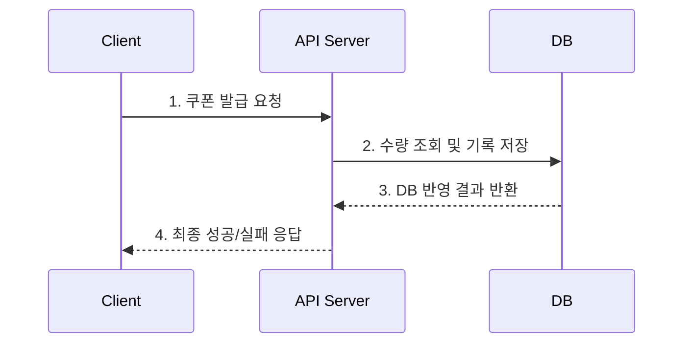
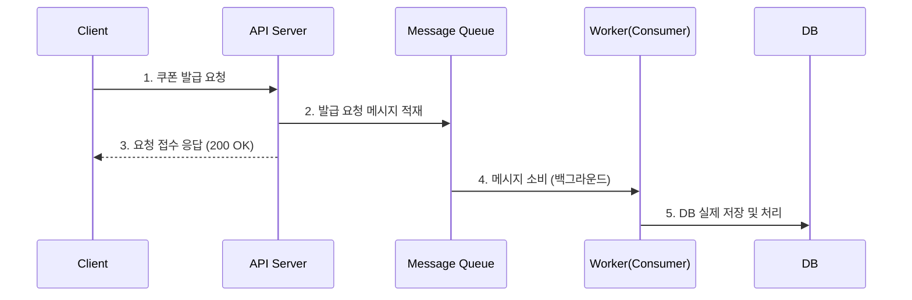
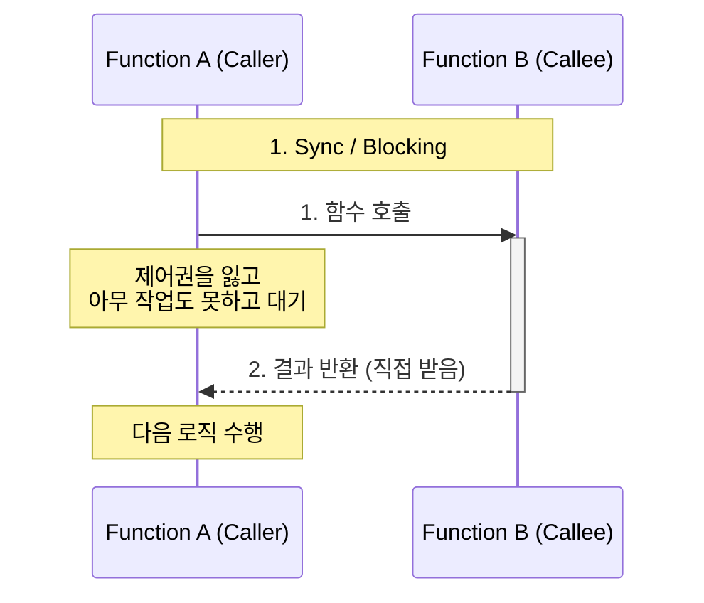
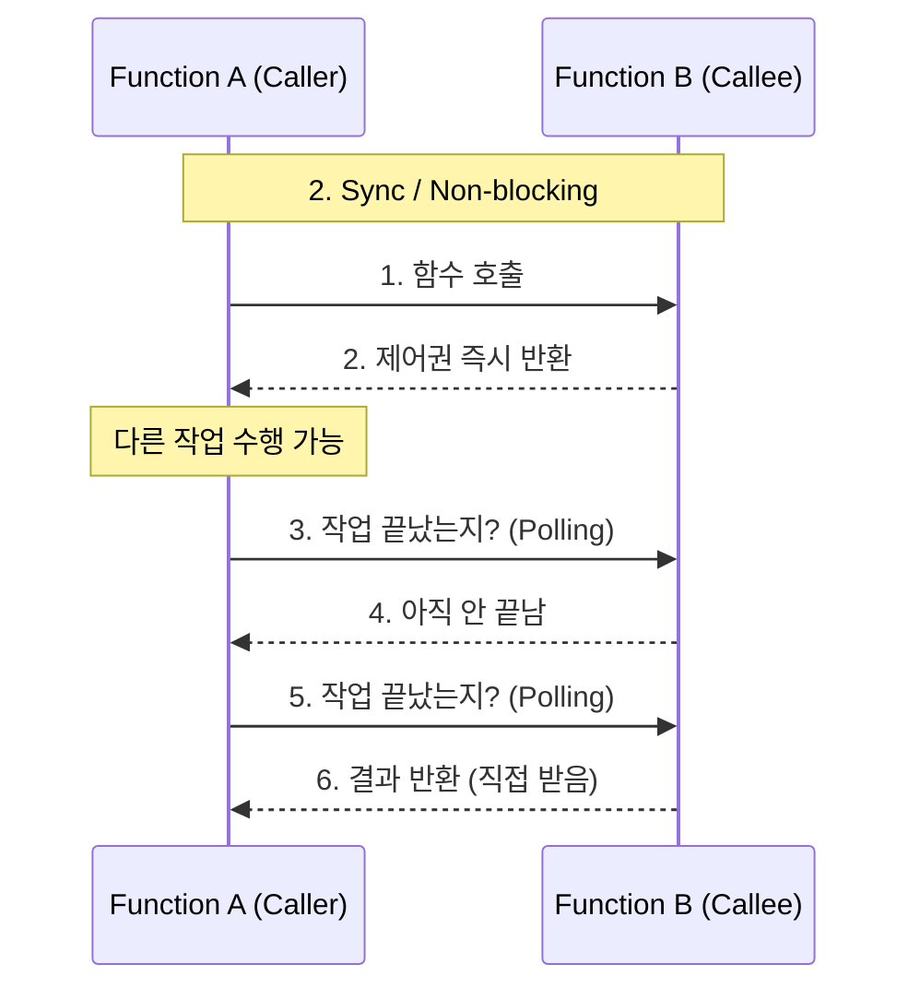
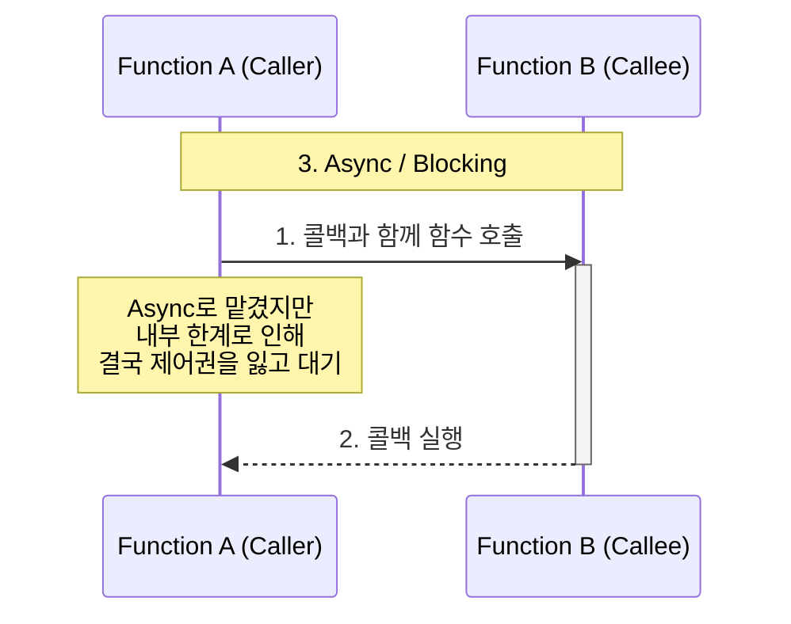
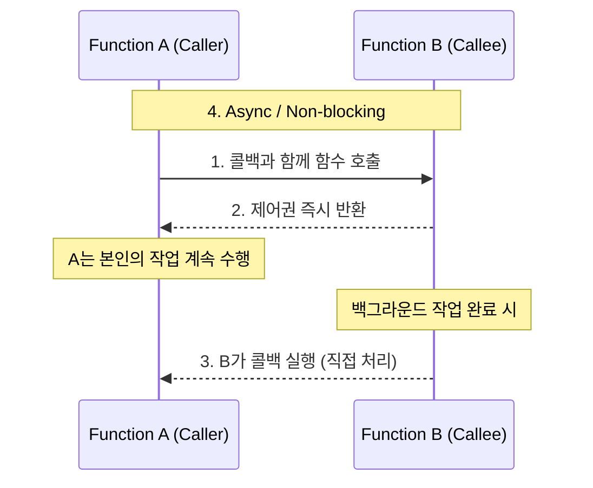

# [Week 1] 요청 처리 구조 설계 - 13기 BE 우재원

## 과제 1. 동기 처리와 비동기 처리 구조 다이어그램

**[동기 처리 구조]**

**[비동기 처리 구조]**

**[구조의 차이점]**

* **동기 처리:** 사용자의 요청 스레드가 DB 작업이 끝날 때까지 대기합니다. 즉시 결과를 알 수 있지만, 수만 건의 트래픽이 몰리면 API 서버와 DB 양쪽에 1:1로 부하가 생기고, 시스템이 마비될 수 있습니다.
* **비동기 처리:** API 서버는 큐에 메시지를 넣는 즉시 스레드를 반환합니다. 실제 발급 로직은 Worker가 백그라운드에서 감당할 수 있는 속도로 처리하므로, 대용량 트래픽에 의한 서버 다운을 방지할 수 있습니다.

---

## 과제 2. 구조 A와 구조 B 중 더 적합한 구조 선택하기

**1. 두 구조 중 선착순 쿠폰 이벤트에 더 적합한 구조는 무엇인가?**

* **구조 B**가 더 적합합니다.

**2. 구조 A는 Queue를 사용했는데도 왜 비동기 처리의 장점이 줄어드는가?**

* Queue를 도입해 DB 부하는 조절할 수 있게 되었지만, API 서버 입장에서는 Worker의 작업이 끝날 때까지 스레드를 점유한 채로 대기, Block 해야 합니다. 트래픽이 몰리면 API 서버의 스레드 풀이 먼저 고갈되어 새로운 사용자의 접속을 받을 수 없게 됩니다.

**3. API Server가 Worker 결과를 기다리면 어떤 문제가 생기는가?**

* Worker 쪽에 지연이 발생하면 그 지연 시간이 API 서버와 클라이언트에게 그대로 전파됩니다. 이는 Nginx나 Tomcat의 Timeout으로 이어져, 실제로는 쿠폰이 발급되었음에도 사용자에게는 '504 Gateway Timeout' 과 같은 에러가 노출되는 현상을 유발합니다.

**4. 구조 B를 선택한다면 사용자는 최종 발급 결과를 어떻게 확인해야 하는가?**

* 클라이언트 단에서 Short Polling이나 SSE(Server-Sent Events)를 통해 상태 조회 API를 지속해서 호출하거나, 사용자가 마이페이지의 내 쿠폰함 에 들어가 직접 결과를 확인하는 방식으로 분리해야 합니다.

---

## 과제 3. 나쁜 설계의 문제점을 찾고 개선하기

**1. 이 설계에서 문제가 될 수 있는 부분 (7가지)**

1. **DB 커넥션 풀 고갈:** 쿠폰 저장 후 알림 발송, 마이페이지 갱신 등 외부 I/O를 처리하는 동안 트랜잭션과 DB 커넥션을 반납하지 못하고 쥐고 있게 됩니다. 따라서 다른 요청들이 커넥션을 얻지 못해 타임아웃이 발생합니다.
2. **단일 장애점(SPOF) 동기화:** 알림 서버나 마이페이지 서버 중 하나라도 장애가 나면, 정상적인 쿠폰 발급 로직마저 실패로 처리되어 이벤트 전체가 마비됩니다.
3. **스레드 풀 고갈:** 무거운 작업들이 직렬로 연결되어 있어 API 서버의 응답 시간이 길어집니다. 10만 건의 트래픽이 들어올 때 스레드 반환이 늦어져 가용 스레드가 빠르게 0이 됩니다.
4. **강한 결합도(Tight Coupling):** 쿠폰, 알림, 회원(마이페이지) 도메인이 하나의 트랜잭션으로 묶여 있습니다. 알림 로직이 수정될 때 쿠폰 서버까지 다시 배포해야 하는 구조적 결함이 있습니다.
5. **데이터 정합성 훼손:** 알림 발송은 성공했는데 마이페이지 갱신 시점에 에러가 발생하여 롤백될 경우, 사용자는 발급 성공 알림을 받았지만 실제 쿠폰함에는 쿠폰이 없는 일이 발생합니다.
6. **동시성 제어 한계:** 트래픽이 몰릴 때 단순히 DB 조회를 통해 남은 수량을 확인하면, 여러 스레드가 동시에 1개의 남은 쿠폰을 확인하고 발급해버리는 초과 발급 문제, race condition 문제가 발생합니다.
7. **유연한 확장(Scale-out) 불가:** 트래픽 병목 지점(쿠폰 발급)만 따로 스케일 아웃을 해야 하는데, 무거운 로직들이 한 덩어리로 묶여 있어 비효율적인 서버 증설을 강제하게 됩니다.

**2. API Server가 너무 많은 일을 하면 어떤 문제가 생기는가?**

* 로직이 무거워질수록 처리량, throughput이 급감합니다. 이벤트 시작 직후 발생하는 트래픽 스파이크를 감당하지 못하고 병목의 주 원인이 됩니다.

**3. 알림 발송이나 마이페이지 데이터 갱신이 실패하면 쿠폰 발급 응답에 어떤 영향을 줄 수 있는가?**

* 로직이 강하게 결합되어 있기 때문에, 메인 비즈니스(ex. 쿠폰 발급)는 성공했음에도 불구하고 부가적인 비즈니스(알림 등) 실패로 인해 전체 로직이 예외를 던지며 롤백되는 현상이 발생합니다.

**4. 요청 접수와 실제 발급 처리를 분리하는 구조로 개선하라.**

* API 서버는 로그인 여부와 쿠폰 기간 등 가벼운 검증만 마친 뒤, Kafka에 `발급 요청 이벤트`만 적재하고 즉시 응답을 종료합니다.
* 쿠폰 전용 Worker가 큐에서 이벤트를 가져와 DB를 업데이트하고, 완료 시 `발급 완료 이벤트`를 다시 Kafka에 발행합니다.
* 알림, 마이페이지 서버는 각자 이 이벤트를 구독하여 독립적으로 자신의 비즈니스 로직을 수행하도록 책임을 분리(Decoupling)합니다.

---

## 과제 4. API Server가 직접 처리할 일과 비동기 처리 영역으로 넘길 일 나누기

| 작업 | API Server에서 처리 | 비동기 영역에서 처리 | 이유 |
| --- | --- | --- | --- |
| **로그인 여부 확인** | O |  | 인가(Authorization) 필터링 없이 비동기 영역까지 트래픽을 흘려보내는 것은 리소스 낭비이므로, 컨트롤러 진입 전에 차단해야 합니다. |
| **이벤트 시간 확인** | O |  | DB 접근 없이 캐시나 서버 시간만으로 확인 가능한 규칙이므로, 큐에 불필요한 메시지가 쌓이지 않도록 앞에서 차단(Fail-fast)합니다. |
| **쿠폰 수량 최종 차감** |  | O | 여러 스레드가 동시에 수량 필드에 접근하여 발생하는 데드락이나 동시성 이슈를 막기 위해, Worker 단위에서 순차적/안정적으로 처리해야 합니다. |
| **DB 발급 기록 저장** |  | O | 디스크 I/O가 동반되는 가장 무거운 작업이므로, API 서버 스레드가 이를 대기하지 않도록 백그라운드로 책임을 넘겨야 합니다. |
| **사용자 요청 접수 응답** | O |  | 비동기 설계의 핵심입니다. 이벤트를 큐에 안전하게 적재한 즉시 응답을 내려보내 API 서버의 가용 스레드를 빠르게 확보해야 합니다. |
| **발급 성공/실패 최종 결정** |  | O | DB의 Unique Key 위반 여부나 최종 수량 차감 성공 여부는 Worker가 실제 트랜잭션을 커밋해야만 정확히 알 수 있기 때문입니다. |

---

## 과제 5. 요청 접수 성공 응답을 언제 반환할 수 있는지 설계하기

**1. API 서버는 언제 사용자에게 요청 접수 성공 응답을 반환해야 하는가?**

* 해당 요청 데이터가 어떤 장애 상황(서버 다운 등)에서도 증발하지 않는, 영속성 보장 매체(DB 또는 Message Queue)에 안전하게 저장(Commit/Ack)된 직후에 반환해야 합니다.

**2. 요청이 메모리에만 있는 상태에서 응답하면 어떤 문제가 생기는가?**

* 응답은 나갔는데 처리 전 서버가 재시작되면 로컬 메모리에 있던 큐 데이터가 소실됩니다. 사용자는  접수 완료 를 봤지만 실제로는 아무 작업도 진행되지 않는 데이터 유실이 발생합니다.

**3. 요청 상태를 PENDING으로 저장한 뒤 응답하는 방식의 장단점**

* **장점:** RDBMS 트랜잭션에 의해 데이터 유실이 완벽히 방지되며, 상태 추적이 쉽습니다.
* **단점:** 결국 10만 건의 트래픽이 RDBMS 쓰기(Write) 작업을 유발하므로, DB 커넥션 풀 고갈이라는 근본적인 부하 문제를 완벽하게 회피하지 못합니다.

**4. 비동기 처리 영역(Kafka 등)에 전달된 것을 확인한 뒤 응답하는 방식의 장단점**

* **장점:** RDBMS 쓰기 부하를 0으로 만들고, 처리 속도가 매우 빠른 Kafka 디스크/메모리에 의존하므로 막대한 트래픽(Throughput)을 수용할 수 있습니다.
* **단점:** 메시지 브로커가 시스템에 추가되므로 아키텍처가 복잡해지며, Kafka 클러스터 장애 시 전체 요청이 막히는 새로운 병목점이 될 수도 있습니다.

**5. 내가 선택한 방식과 그 이유**

* **Kafka 등 분산 큐에 전달 완료(Ack)를 확인한 뒤 응답하는 방식**을 선택하겠습니다. 이벤트 특성상 짧은 시간 내에 발생하는 극단적인 쓰기 트래픽을 RDBMS가 버티는 데는 물리적 한계가 존재하기 때문입니다.

---

## 과제 6. 항상 비동기가 성능이 좋은지 생각해보기

**1. 비동기 처리가 동기 처리보다 유리한 상황은 언제인가?**

* 트래픽이 스파이크성으로 몰리거나, 로직 내부에 소요 시간이 긴 외부 API 호출, 무거운 디스크 I/O가 포함되어 있어 스레드 점유율이 높아질 위험이 있는 경우에 유리합니다.

**2. 동기 처리가 더 단순하고 적합한 상황은 언제인가?**

* 결제, 포인트 차감, 비밀번호 변경처럼 데이터의 상태 변화가 즉시 화면에 반영되어야 하며 트래픽이 예측 및 통제 가능한 시스템에서는 동기 처리가 적합합니다.

**3. 비동기 처리 구조를 사용하면 어떤 추가 복잡도가 생기는가?**

* 메시지 순서 보장, 네트워크 단절에 의한 메시지 재전송 처리(멱등성 보장), Consumer 서버 장애 모니터링, 데이터 불일치 복구 로직(보상 트랜잭션) 등 분산 환경 특유의 복잡한 운영 오버헤드가 발생합니다.

**4. 사용자가 최종 결과를 바로 알아야 하는 기능이라면 비동기 처리가 항상 적합한가?**

* 부적합합니다. 비동기를 적용하면 프론트엔드에서 주기적으로 결과를 묻는 Polling을 구현하거나, WebSocket 등 양방향 통신 인프라를 억지로 끼워 넣어야 하므로 시스템 리소스 낭비가 심해집니다.

**5. 이번 선착순 쿠폰 이벤트에서는 왜 비동기 처리가 더 적합하다고 볼 수 있는가?**

* 사용자가 즉시 성공/실패 여부를 화면에서 보는 것보다, 10만 명의 동시 접속으로 인해 서버가 터져 이벤트 자체가 중단되는 사태 를 막는 것이 비즈니스적으로 훨씬 중요하기 때문입니다.

---

## 과제 7. 동기/비동기와 블로킹/논블로킹 조합 분석하기

**1. 4가지 조합에 대한 다이어그램 및 설명**

* **Sync / Blocking:** A가 B를 호출하고 제어권을 넘깁니다. B가 끝날 때까지 A는 멈춰있고(Blocking), 결과를 직접 받아(Sync) 다음 로직을 처리합니다. (예: 일반적인 JDBC 쿼리 실행)

* **Sync / Non-blocking:** A가 B를 호출한 뒤 제어권을 바로 돌려받습니다(Non-blocking). 하지만 B의 결과가 무조건 필요하므로, A가 반복적으로 완료 여부를 찔러서 확인(Sync)합니다. (예: Future.isDone() 폴링 패턴)

* **Async / Blocking:** 결과를 콜백 등으로 위임(Async)했음에도 불구하고, 결국 로직이나 드라이버의 한계 때문에 A의 실행 흐름이 멈춰버리는(Blocking) 비효율적인 상황입니다. (예: Node.js 비동기 환경에서 Sync 함수를 잘못 호출한 경우)

* **Async / Non-blocking:** A가 B를 호출하고 제어권을 즉시 반환받아 본인의 할 일을 합니다(Non-blocking). 작업이 끝나면 B가 알아서 콜백을 실행해 결과를 처리(Async)하므로 리소스 효율이 가장 좋습니다. (예: Spring WebFlux, Node.js I/O 작업)

**2. 선착순 쿠폰 발급 구조에 실제로 등장하는 조합과 근거**

* **[Async / Non-blocking]** * **등장 위치:** API Server가 클라이언트 요청을 받아 Kafka에 메시지를 발행하고 응답하는 구간.
* **근거:** API Server는 발급 처리를 Kafka 쪽에 위임(Async)하고, Kafka 응답을 하염없이 대기하지 않고 즉시 스레드 제어권을 회수(Non-blocking)하여 클라이언트에게 응답을 내려줍니다.

* **[Sync / Blocking]**
* **등장 위치:** Consumer(Worker)가 DB에 접근해 쿠폰 발급 데이터를 Insert 하는 구간.
* **근거:** Consumer는 RDBMS에 쿼리를 날린 뒤 디스크 쓰기 작업이 끝나고 Commit 응답이 올 때까지 스레드를 대기(Blocking)해야 하며, 그 결과를 직접 확인(Sync)한 후에야 Kafka 오프셋을 커밋할 수 있기 때문입니다.