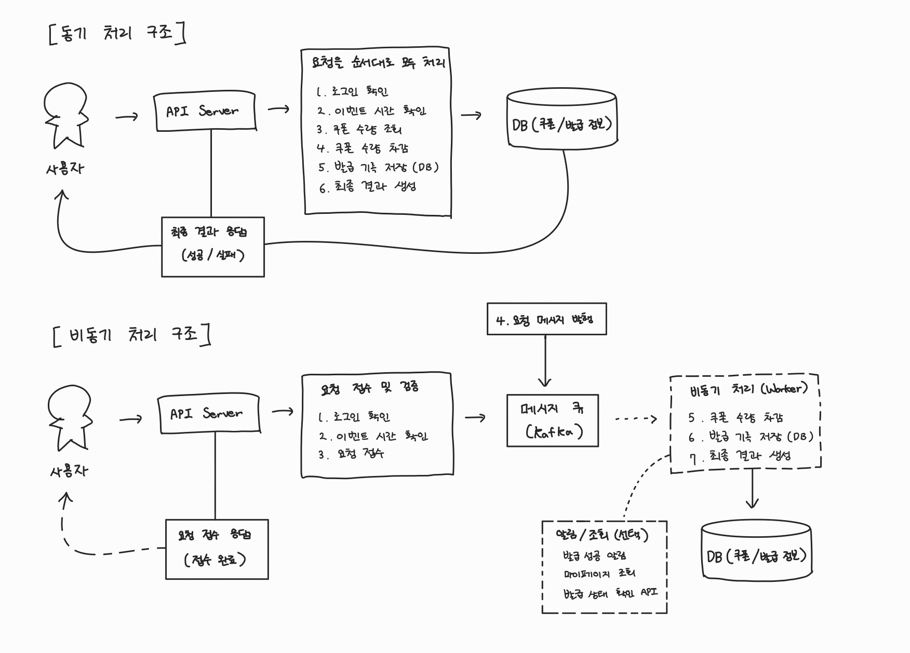
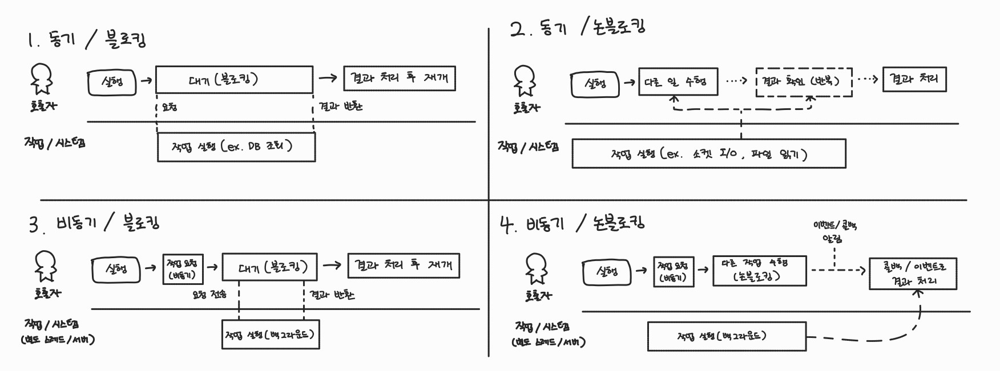

# 13기_이채영 1주차 과제

---

## 과제 1. 동기 처리와 비동기 처리 구조를 전체 요청 처리 순서에 맞게 다이어그램으로 그리기

쿠폰 발급 요청이 들어왔을 때 동기 처리 방식과 비동기 처리 방식이 각각 어떤 순서로 동작하는지 다이어그램으로 작성한다.

그림 아래에는 두 구조의 차이를 간단히 설명한다.



동기 처리 : 사용자는 모든 처리가 끝난 후 최종 결과를 응답받는다.

비동기 처리 : 사용자는 요청이 접수되면 바로 응답을 받고, 최종 결과는 알림 또는 조회를 통해 확인한다.

| 구분    | 동기 처리 구조                          | 비동기 처리 구조                              |
|-------|-----------------------------------|----------------------------------------|
| 처리 흐름 | API Server가 요청 검증부터 쿠폰 발급까지 직접 처리 | API Server는 요청만 접수하고 실제 발급은 Worker가 처리 |
| 응답 시점 | 최종 성공/실패 결과가 나온 후 응답              | 요청 접수 후 즉시 응답, 결과는 나중에 조회              |
| 장점    | 구현이 단순하고 결과를 바로 확인 가능             | 응답 속도가 빠르고 대규모 트래픽 처리에 유리              |
| 단점    | 서버와 DB 부하가 집중될 수 있음               | Queue, Worker 등 추가 설계가 필요함             |

---

## 과제 2. 구조 A와 구조 B 중 더 적합한 구조 선택하기

아래 두 구조를 비교한다.


다음 질문에 답한다.

```
1. 두 구조 중 선착순 쿠폰 이벤트에 더 적합한 구조는 무엇인가?
- 구조 B
- API Server가 요청만 빠르게 접수하고 응답한 뒤 실제 쿠폰 발급은 Worker가 처리하여 대량 트래픽을 안정적으로 처리할 수 있다.

2. 구조 A는 Queue를 사용했는데도 왜 비동기 처리의 장점이 줄어드는가?
- API Server가 Worker의 처리 결과를 기다리기 때문이다.
- 결국 사용자는 최종 결과가 나올 때까지 기다려야 하므로 응답 지연과 스레드 점유 문제가 그대로 발생한다.

3. API Server가 Worker 결과를 기다리면 어떤 문제가 생기는가?
- API Server의 스레드가 오래 점유되어 동시 처리량이 감소한다.
- 요청이 몰리면 응답 지연, 타임아웃, 서버 부하 증가가 발생할 수 있다.

4. 구조 B를 선택한다면 사용자는 최종 발급 결과를 어떻게 확인해야 하는가?
- 사용자는 조회 API 또는 마이페이지를 통해 최종 발급 결과를 확인한다.
- 아니면 알림 기능을 이용해 발급 성공/실패 결과를 전달받을 수 있다.
```

---

## 과제 3. 나쁜 설계의 문제점을 찾고 개선하기

다음 설계를 보고 문제가 될 수 있는 부분을 찾는다.


다음 질문에 답한다.

```
1. 이 설계에서 문제가 될 수 있는 부분을 5개 이상 찾아라.
- API Server가 쿠폰 발급을 끝까지 직접 처리한다.
- 요청마다 DB 조회와 저장이 발생해 DB 부하가 커진다.
- 알림 발송까지 같은 흐름에 포함되어 응답이 느려진다.
- 마이페이지 데이터 갱신까지 함께 처리해 API Server 역할이 너무 많다.
- 알림이나 마이페이지 갱신 실패가 쿠폰 발급 응답 실패로 이어질 수 있다.

2. API Server가 너무 많은 일을 하면 어떤 문제가 생기는가?
- API Server의 처리 시간이 길어지고 스레드가 오래 점유된다.
- 요청이 몰리면 서버 부하 증가, 응답 지연, 타임아웃이 발생할 수 있다.

3. 알림 발송이나 마이페이지 데이터 갱신이 실패하면 쿠폰 발급 응답에 어떤 영향을 줄 수 있는가?
- 쿠폰 발급은 성공했는데 알림이나 마이페이지 갱신 실패 때문에 전체 응답이 실패할 수 있다.

4. 요청 접수와 실제 발급 처리를 분리하는 구조로 개선하라.
- API Server는 요청만 접수하고 빠르게 응답하며, 실제 쿠폰 발급은 Worker가 비동기로 처리하도록 분리한다.
- 알림 발송과 마이페이지 갱신도 별도 서비스에서 처리하여 시스템의 안정성과 확장성을 높인다.
```

---

## 과제 4. API Server가 직접 처리할 일과 비동기 처리 영역으로 넘길 일을 나누기

쿠폰 발급 요청이 들어왔을 때 API Server가 직접 처리해야 하는 일과, 비동기 처리 영역으로 넘겨야 하는 일을 구분한다.

아래 작업들을 기준으로 나누고 이유를 작성한다.

```
- 로그인 여부 확인
- 이벤트 시간 확인
- 쿠폰 수량 최종 차감
- DB 발급 기록 저장
- 사용자에게 요청 접수 응답
- 발급 성공/실패 최종 결정
```

아래 표 형식으로 작성한다.

| 작업             | API Server에서 처리 | 비동기 처리 영역에서 처리 | 이유                                   |
|----------------|-----------------|----------------|--------------------------------------|
| 로그인 여부 확인      | O               | X              | 인증되지 않은 사용자의 요청을 즉시 차단해야 하기 때문       |
| 이벤트 시간 확인      | O               | X              | 이벤트 시작 전 또는 종료 후 요청을 빠르게 거절하기 위해     |
| 쿠폰 수량 최종 차감    | X               | O              | 실제 쿠폰 발급 과정의 핵심 로직이므로 Worker가 처리     |
| DB 발급 기록 저장    | X               | O              | 최종 발급 결과를 저장하는 작업으로 비동기 처리에 포함       |
| 사용자에게 요청 접수 응답 | O               | X              | 요청이 정상 접수되었음을 빠르게 알려주기 위해            |
| 발급 성공/실패 최종 결정 | X               | O              | 실제 발급 처리 결과를 바탕으로 Worker가 결정해야 하기 때문 |

---

## 과제 5. 요청 접수 성공 응답을 언제 반환할 수 있는지 설계하기

비동기 처리 구조에서는 API Server가 사용자에게 다음과 같은 응답을 반환할 수 있다.

```
쿠폰 발급 요청이 접수되었습니다.
```

하지만 이 응답을 아무 때나 반환하면 안 된다.

예를 들어 요청이 메모리에만 있는 상태에서 응답했는데 API Server가 장애로 종료되면 요청이 유실될 수 있다.

따라서 API Server가 언제 사용자에게 요청 접수 성공 응답을 반환할 수 있는지 설계해야 한다.

다음 질문에 답한다.

```
1. API 서버는 언제 사용자에게 요청 접수 성공 응답을 반환해야 하는가?
- API Server는 요청이 Queue(Kafka)에 안전하게 저장된 것을 확인한 뒤 접수 성공 응답을 반환해야 한다.
- 그래야 사용자가 응답을 받은 이후에도 요청이 유실되지 않는다고 볼 수 있다.

2. 요청이 메모리에만 있는 상태에서 응답하면 어떤 문제가 생기는가?
- 응답을 보낸 직후 서버가 장애로 종료되면 요청이 사라질 수 있다.
- 사용자는 접수되었다고 생각하지만 실제로는 처리되지 않는 문제가 발생한다.

3. 요청 상태를 PENDING으로 저장한 뒤 응답하는 방식은 어떤 장단점이 있는가?
- 장점
  - 요청 유실을 방지할 수 있다.
  - 요청 상태를 추적할 수 있다.
- 단점
  - 모든 요청을 DB에 저장해야 하므로 DB 부하가 증가한다.
  - 추가 저장 비용이 발생한다.

4. 비동기 처리 영역에 전달된 것을 확인한 뒤 응답하는 방식은 어떤 장단점이 있는가?
- 장점
  - 요청 유실 가능성이 낮다.
  - 비동기 구조의 장점을 유지하면서 빠르게 응답할 수 있다.
- 단점
  - Queue(Kafka) 운영이 필요하다.
  - 시스템 구조가 더 복잡해진다.

5. 내가 선택한 방식과 그 이유를 설명하라.
- Queue(Kafka)에 안전하게 전달된 순간을 요청 접수 성공 기준으로 선택하겠다.
- 이 방식은 요청 유실 가능성을 줄이면서도 API Server가 빠르게 응답할 수 있어 대규모 트래픽 환경에 적합하기 때문이다.
```

참고로 요청 접수 성공의 기준은 다음 중 하나로 생각해볼 수 있다.

```
1. 요청을 메모리에 올린 순간
2. 요청 검증이 끝난 순간
3. 요청 상태가 DB에 PENDING으로 저장된 순간
4. Queue 또는 Kafka에 안전하게 전달된 순간
```

단순히 빠르게 응답하는 것만 생각하지 말고, 사용자가 접수 응답을 받은 뒤 요청이 유실되지 않도록 하려면 어떤 기준이 필요한지 고민한다.

---

## 과제 6. 항상 비동기가 성능이 좋은지 생각해보기

비동기 처리는 대규모 트래픽 상황에서 유리할 수 있다.

하지만 항상 비동기가 더 좋은 것은 아니다.

다음 질문에 답한다.

```
1. 비동기 처리가 동기 처리보다 유리한 상황은 언제인가?
- 대량의 요청이 짧은 시간에 몰리는 상황에서 비동기 처리가 유리하다.
- 요청 접수와 실제 처리를 분리하여 서버 부하를 줄이고 처리량을 높일 수 있다.

2. 동기 처리가 더 단순하고 적합한 상황은 언제인가?
- 요청 수가 많지 않고 사용자가 결과를 즉시 확인해야 하는 경우 동기 처리가 적합하다.
- 구조가 단순하여 구현과 운영이 쉽다는 장점이 있다.

3. 비동기 처리 구조를 사용하면 어떤 추가 복잡도가 생기는가?
- Queue(Kafka) 운영, 요청 상태 관리, 장애 복구, 재시도 처리 등의 추가 설계가 필요하다.
- 사용자가 결과를 나중에 확인할 수 있는 기능도 함께 제공해야 한다.

4. 사용자가 최종 결과를 바로 알아야 하는 기능이라면 비동기 처리가 항상 적합한가?
- 아니다. 계좌이체나 결제처럼 결과를 즉시 확인해야 하는 기능은 동기 처리가 더 적합할 수 있다.

5. 이번 선착순 쿠폰 이벤트에서는 왜 비동기 처리가 더 적합하다고 볼 수 있는가?
- 이벤트 시작 직후 많은 사용자가 동시에 요청할 수 있기 때문이다.
- 비동기 처리를 사용하면 요청을 빠르게 접수하고 실제 발급은 뒤에서 처리하여 서버와 DB의 부하를 효과적으로 분산할 수 있다.
```

---

## 과제 7. 동기/비동기와 블로킹/논블로킹 조합 분석하기

동기/비동기와 블로킹/논블로킹은 비슷해 보이지만 기준이 다르다.

동기/비동기는 요청한 작업의 결과를 **같은 요청 흐름에서 직접 받아 처리하는가**, 아니면 요청 흐름과 실제 처리 흐름을 분리하는가에 대한 개념이다.

블로킹/논블로킹은 **작업이 끝날 때까지** 현재 실행 흐름이 멈추는가, 아니면 바로 제어권을 돌려받는가?에 대한 개념이다.

다음 4가지 조합을 분석한다.

```
1. 동기 / 블로킹

2. 동기 / 논블로킹

3. 비동기 / 블로킹

4. 비동기 / 논블로킹
```

다음 질문에 답한다.

```
1. 아래 4가지 조합 각각이 무엇인지, 일반적인 작업 흐름(예: 함수 호출, DB 호출, 소켓 IO 등) 기준으로 다이어그램과 함께 설명하라. (쿠폰 발급 시나리오에 한정하지 않아도 된다.)
- 동기 / 블로킹
  - 작업이 끝날 때까지 현재 실행 흐름이 멈춰 있는 방식이다.
  - DB 조회나 파일 읽기와 같이 결과가 올 때까지 기다린 후 다음 작업을 수행한다.
- 동기 / 논블로킹
  - 작업 요청 후 바로 제어권을 돌려받지만 결과는 직접 확인해야 한다.
  - 현재 흐름은 멈추지 않지만 결과를 같은 흐름에서 처리하므로 동기 방식이다.
- 비동기 / 블로킹
  - 작업 자체는 다른 흐름에서 수행되지만 결과를 기다리는 동안 현재 흐름이 멈춘다.
  - 비동기 구조를 사용하더라도 기다리면 블로킹이 발생할 수 있다.
- 비동기 / 논블로킹
  - 작업 요청 후 바로 다른 작업을 수행할 수 있다.
  - 결과는 나중에 이벤트나 콜백을 통해 전달받는 방식이다.

2. 이 4가지 중 이번 선착순 쿠폰 발급 구조에 실제로 등장하는 조합은 무엇인지 고르고, 어디에서 등장하는지 근거를 들어 설명하라. (4개가 다 등장하지 않을 수 있다.)
- 동기 / 블로킹
  - 로그인 여부 확인과 이벤트 시간 확인 과정에서 사용된다.
  - API Server는 검증 결과를 받을 때까지 기다린 후 다음 작업을 수행한다.
- 비동기 / 블로킹
  - 구조 A처럼 API Server가 Worker의 처리 결과를 기다리는 경우에 발생할 수 있다.
- 비동기 / 논블로킹
  - 쿠폰 발급 요청을 Queue(Kafka)에 전달한 뒤 사용자에게 요청 접수 응답을 반환하는 과정에서 사용된다.
  - API Server는 실제 발급 결과를 기다리지 않고 바로 응답하며, Worker가 뒤에서 쿠폰 발급을 처리한다.
```
