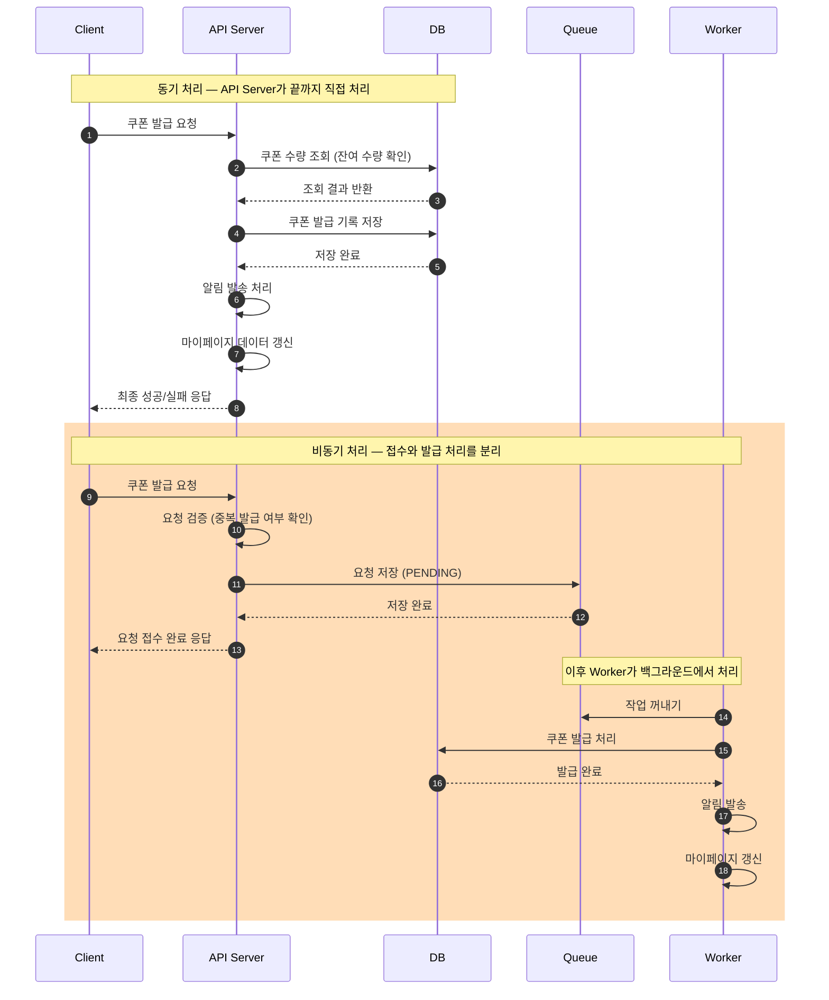
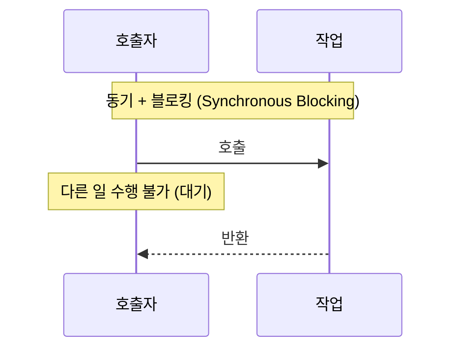
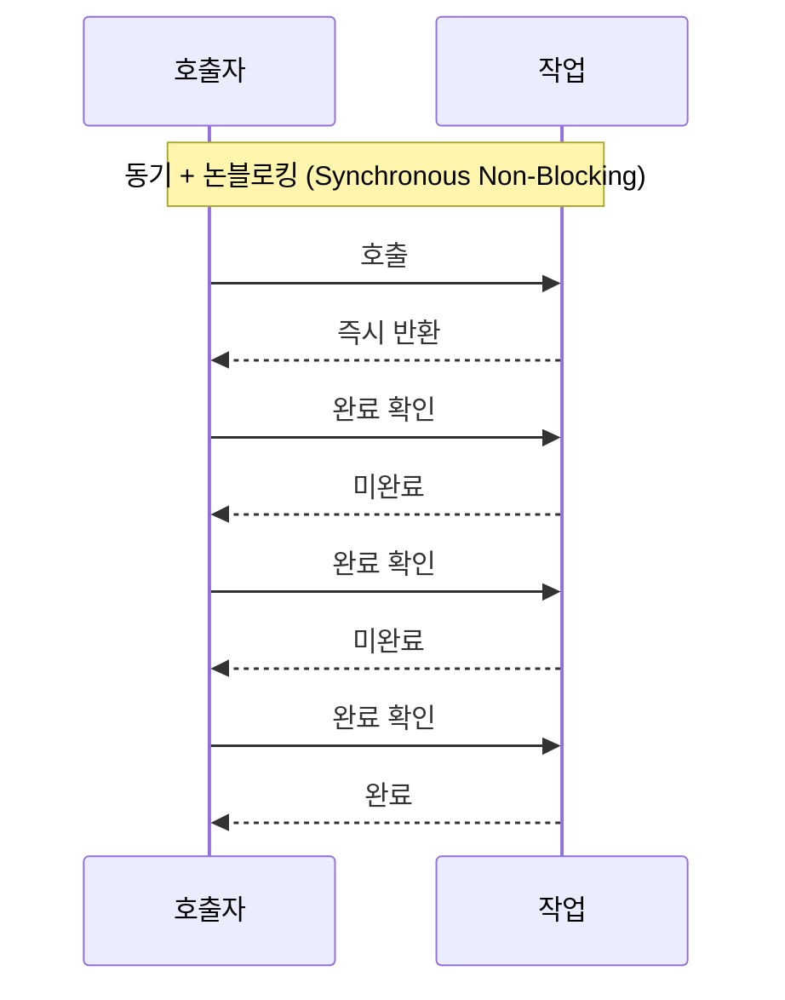
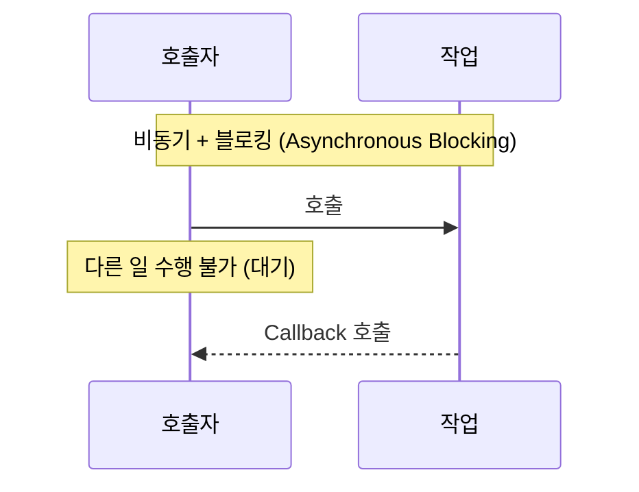
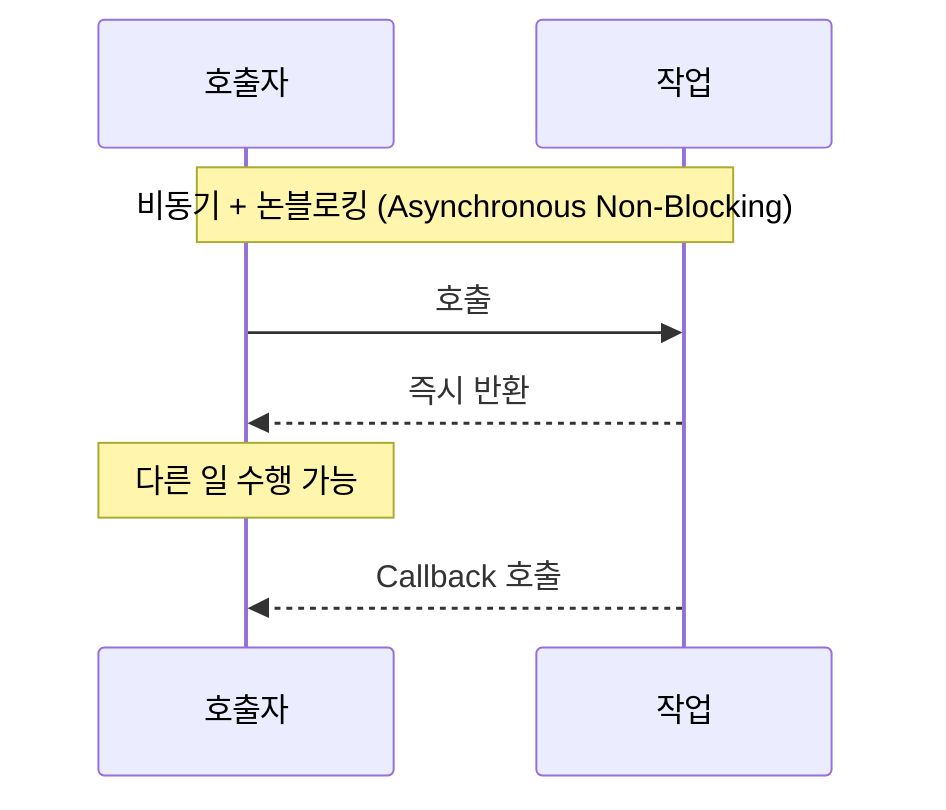

# 필수 과제

이번 주차 필수 과제는 아래 7가지다.

---

## 과제 1. 동기 처리와 비동기 처리 구조를 전체 요청 처리 순서에 맞게 다이어그램으로 그리기

쿠폰 발급 요청이 들어왔을 때 동기 처리 방식과 비동기 처리 방식이 각각 어떤 순서로 동작하는지 다이어그램으로 작성한다.

그림 아래에는 두 구조의 차이를 간단히 설명한다.



**[동기 처리 구조]**

동기 처리는 작업이 순서대로 실행되는 구조.
앞선 작업이 끝나야 다음 작업이 시작할 수 있기 때문에, 실행 흐름을 예측하기는 쉽지만 느린 작업 하나가 전체 속도를 끌어내릴 수 있다.

API Server가 요청을 받은 순간부터
DB 조회 -> 발급 기록 저장 -> 알림 처리 -> 마이페이지 갱신까지 모든 작업이 끝나야 Client에게 응답을 보낸다. 

**[비동기 처리 구조]**

비동기 처리는 여러 작업을 동시에 실행할 수 있는 구조.
특정 작업이 끝날 때까지 기다릴 필요가 없기 때문에, 느린 작업이 있어도 다른 작업이 먼저 처리될 수 있다. 

요청 접수 단계와 백그라운드 처리 단계로 분리된다.

요청 접수 단계에서는 API Server는 중복 발급 여부만 빠르게 검증하고, 작업을 DB에 기록한 뒤 즉시 Client에 응답한다.
백그라운드 처리 단계에서는 Worker가 Queue에서 작업을 꺼내서 실제 쿠폰 발급, 알림, 마이페이지 갱신을 순차적으로 처리한다. API Server와 완전히 분리되어 있다.

---

## 과제 2. 구조 A와 구조 B 중 더 적합한 구조 선택하기

아래 두 구조를 비교한다.


다음 질문에 답한다.

```
1. 두 구조 중 선착순 쿠폰 이벤트에 더 적합한 구조는 무엇인가?

  구조 B

2. 구조 A는 Queue를 사용했는데도 왜 비동기 처리의 장점이 줄어드는가?

  구조는 비동기 처리이지만, API Server가 Worker 결과를 폴링하거나 콜백으로 받을 때까지 스레드를 붙잡고 있으면 결국 동기랑 똑같이 서버 자원이 묶인다.
  비동기 처리의 장점은 요청 접수와 실제 발급 처리를 분리하여 API server가 처리 결과를 기다리지 않고 즉시 다음 요청을 받을 수 있다는 점이다.
  구조 A가 Queue를 사용했음에도 장점이 줄어드는 이유는, 분리는 했지만 API Server가 Worker의 결과를 기다리는 동안 스레드가 불필요하게 점유되기 때문이다.


3. API Server가 Worker 결과를 기다리면 어떤 문제가 생기는가?
  API Server가 Worker 결과를 기다리는 동안 API 서버 스레드가 점유되어, 새로운 요청을 받을 수 없게 된다.
  클라이언트 관점에서는 모든 처리가 끝날 때까지 응답을 받지 못한다.

4. 구조 B를 선택한다면 사용자는 최종 발급 결과를 어떻게 확인해야 하는가?
  구조 B를 선택한다면 사용자가 요청 직후 최종 결과를 바로 알 수 없다. 따라서 마이페이지에서 발급 결과를 별도로 조회하도록 설계한다.


```

---

## 과제 3. 나쁜 설계의 문제점을 찾고 개선하기

다음 설계를 보고 문제가 될 수 있는 부분을 찾는다.


다음 질문에 답한다.

```
1. 이 설계에서 문제가 될 수 있는 부분을 5개 이상 찾아라.
  a. DB 조회 요청 부하
    10만 건의 요청이 동시에 들어오면 DB 수량 조회가 집중되어 DB 커넥션이 고갈될 수 있다.
  b. DB 저장 요청 부하
    조회와 마찬가지로 발급 기록 저장 요청이 한꺼번에 몰려 DB에 과부하가 발생한다.
  c. 동시성 문제
    조회와 저장 사이에 트랜잭션 락이 없으면, 두 요청이 동시에 잔여 수량 1개를 읽고 둘 다 발급 처리를 진행할 수 있다.
  d. API 서버 스레드 고갈
    각 요청이 DB 조회 → 저장 → 알림 → 마이페이지 갱신까지 모든 처리가 끝날 때까지 스레드를 점유하기 때문에, 트래픽이 몰리면 새로운 요청을 받지 못하게 된다.
  e.  부분 실패 시 롤백 처리 어려움
    DB 저장은 성공했지만 알림 발송이나 마이페이지 갱신에서 실패하면, 어디까지 롤백해야 하는지 경계가 불명확하다.


2. API Server가 너무 많은 일을 하면 어떤 문제가 생기는가?
  API Server가 모든 요청을 바로 DB에 처리하려고 하면, 각 요청이 처리되는 동안 스레드가 점유된다. 동시에 수많은 요청이 DB에 몰리게 되면 커넥션 풀이 고갈되고 Lock 경합이 증가하여, 그 결과 DB 응답이 지연되고, 처리가 길어진 요청은 Timeout으로 실패하게 된다.

3. 알림 발송이나 마이페이지 데이터 갱신이 실패하면 쿠폰 발급 응답에 어떤 영향을 줄 수 있는가?
  쿠폰 발급 자체는 완료됐음에도 전체 요청이 실패로 처리될 수 있다. DB 저장은 성공했지만 어디까지 롤백해야 하는지 경계가 불분명하기 때문이다.

4. 요청 접수와 실제 발급 처리를 분리하는 구조로 개선하라.

  요청 접수 단계에서는 API server가 요청에 대한 중복 발급을 검증하고, 요청을 Queue에 저장한 뒤 즉시 응답을 반환한다. 
  실제 발급 처리 단계에서는 Worker가 Queue에서 작업을 꺼내 쿠폰 발급, 알림발송, 마이페이지 갱신을 순차적으로 처리한다.
```

---

## 과제 4. API Server가 직접 처리할 일과 비동기 처리 영역으로 넘길 일을 나누기

쿠폰 발급 요청이 들어왔을 때 API Server가 직접 처리해야 하는 일과, 비동기 처리 영역으로 넘겨야 하는 일을 구분한다.

아래 작업들을 기준으로 나누고 이유를 작성한다.

```
- 로그인 여부 확인
- 이벤트 시간 확인
- 쿠폰 수량 최종 차감
- DB 발급 기록 저장
- 사용자에게 요청 접수 응답
- 발급 성공/실패 최종 결정
```

아래 표 형식으로 작성한다.

| 작업 | API Server에서 처리 | 비동기 처리 영역에서 처리 | 이유 |
| --- | --- | --- | --- |
| 로그인 여부 확인 | O |  | 요청 자체가 유효한지 먼저 검증해야 하므로 접수 전에 처리한다. |
| 이벤트 시간 확인 | O |  | 이벤트 시간 외 요청은 접수 자체를 거부해야 한다. |
| 쿠폰 수량 최종 차감 |  | O | 동시 요청이 몰릴 경우 동시성 문제가 발생할 수 있으므로 Worker가 순차적으로 처리해야 한다. |
| DB 발급 기록 저장 |  | O | 수량 차감 이후에 처리 되어야 하므로 Worker 단계에서 순서대로 처리한다. |
| 사용자에게 요청 접수 응답 | O |  | Queue 저장이 완료된 직후 API server가 즉시 반환한다. |
| 발급 성공/실패 최종 결정 |  | O | 실제 수량 차감과 DB 저장이 완료된 후에 결정되므로 Worker가 담당한다. |

---

## 과제 5. 요청 접수 성공 응답을 언제 반환할 수 있는지 설계하기

비동기 처리 구조에서는 API Server가 사용자에게 다음과 같은 응답을 반환할 수 있다.

```
쿠폰 발급 요청이 접수되었습니다.
```

하지만 이 응답을 아무 때나 반환하면 안 된다.

예를 들어 요청이 메모리에만 있는 상태에서 응답했는데 API Server가 장애로 종료되면 요청이 유실될 수 있다.

따라서 API Server가 언제 사용자에게 요청 접수 성공 응답을 반환할 수 있는지 설계해야 한다.

다음 질문에 답한다.

```
1. API 서버는 언제 사용자에게 요청 접수 성공 응답을 반환해야 하는가?

  응답 기준은 요청이 유실되지 않는다고 보장할 수 있는 순간에 요청 접수 성공 응답을 반환해야 한다.
  즉, DB나 Queue에 영구 저장이 완료된 순간에 반환되어야 한다.

2. 요청이 메모리에만 있는 상태에서 응답하면 어떤 문제가 생기는가?
  API Server가 장애로 종료되면 요청 자체가 유실된다. 사용자는 접수 완료 응답을 받았지만 아무런 처리도 되지 않는 문제가 발생한다.

3. 요청 상태를 PENDING으로 저장한 뒤 응답하는 방식은 어떤 장단점이 있는가?
  장점으로는 DB에 저장된 이후 응답하기 때문에 서버 장애가 발생하더라도 요청이 유실되지 않는다는 점이 있다.
  그러나 단점으로 API Server가 DB에 직접 쓰기 때문에 트래픽이 몰릴 경우 DB 부하가 발생한다. 또한 처리 지연이 발생할 수 있다.

4. 비동기 처리 영역에 전달된 것을 확인한 뒤 응답하는 방식은 어떤 장단점이 있는가?
  장점으로는 DB를 거치지 않고 Queue에 넣는 것만으로도 요청이 보관된다. 서버 장애가 발생해도 요청이 유실되지 않는다. DB 부하가 줄어든다는 장점도 있다. 그러나 Queue 시스템을 별도로 운영해야 하기 때문에 구현 복잡도가 높아진다. 

5. 내가 선택한 방식과 그 이유를 설명하라.
  Queue 또는 Kafka에 안전하게 전달된 순간에 사용자에게 요청 접수 성공 응답을 반환한다. Queue는 서버 장애가 발생해도 데이터를 보관하므로 요청 유실을 방지할 수 있고, 선착순 쿠폰 발급 시스템에서는 대량 트래픽 규모가 예상되므로 API Server가 DB에 직접 쓰지 않아 DB 부하를 줄이는 것이 중요하기 때문이다.
```

참고로 요청 접수 성공의 기준은 다음 중 하나로 생각해볼 수 있다.

```
1. 요청을 메모리에 올린 순간
2. 요청 검증이 끝난 순간
3. 요청 상태가 DB에 PENDING으로 저장된 순간
4. Queue 또는 Kafka에 안전하게 전달된 순간
```

단순히 빠르게 응답하는 것만 생각하지 말고, 사용자가 접수 응답을 받은 뒤 요청이 유실되지 않도록 하려면 어떤 기준이 필요한지 고민한다.

---

## 과제 6. 항상 비동기가 성능이 좋은지 생각해보기

비동기 처리는 대규모 트래픽 상황에서 유리할 수 있다.

하지만 항상 비동기가 더 좋은 것은 아니다.

다음 질문에 답한다.

```
1. 비동기 처리가 동기 처리보다 유리한 상황은 언제인가?
  동시 요청이 많아 API Server와 DB에 부하가 집중되는 상황에서 유리하다. 동기 처리는 모든 작업이 끝날 때까지 스레드를 점유하기 때문에 트래픽이 몰리면 응답 지연과 서버 자원 고갈로 사용자 경험이 저하될 수 있다. 비동기 처리는 요청 접수와 실제 처리를 분리하여 이 문제를 완화한다.

2. 동기 처리가 더 단순하고 적합한 상황은 언제인가?
   처리 흐름이 단순하고 동시 요청이 많지 않다면 동기 방식이 더 효율적일 수 있다. 

3. 비동기 처리 구조를 사용하면 어떤 추가 복잡도가 생기는가?
  비동기 처리는 요청 접수와 실제 발급 처리가 분리되어 있어 흐름을 추적하기 어렵다. 콜백, Queue 로직 등이 추가되면서 코드가 복잡해진다. 그리고 Worker가 쿠폰 발급에 실패했을 때 재시도 로직, 실패 알림 등을 별도로 설계해야 한다. 

4. 사용자가 최종 결과를 바로 알아야 하는 기능이라면 비동기 처리가 항상 적합한가?
  사용자가 최종 결과를 바로 알아야 하는 기능이라면 부적합할수도 있다. 비동기 처리 구조에서는 사용자가 처리가 완료될 때까지 결과를 알 수 없다.

5. 이번 선착순 쿠폰 이벤트에서는 왜 비동기 처리가 더 적합하다고 볼 수 있는가?
  선착순 쿠폰 이벤트에서는 이벤트 시작 직후 단시간에 대량 트래픽 집중이 예상된다. 동기 처리 구조를 선택한다면 API Server가 모든 처리를 맡기 때문에 스레드가 오래 점유되고 DB에 부하가 집중된다. 반면 비동기 처리 구조에서는 요청 접수와 실제 발급 처리를 분리하여 스레드 반환도 빠르게 일어나고 DB 부하도 분산된다. 또한 사용자가 발급 결과를 즉시 알지 않아도 되고, 이후 마이페이지에서 확인할 수 있으므로 비동기 처리가 적합하다.
```

---

## 과제 7. 동기/비동기와 블로킹/논블로킹 조합 분석하기

동기/비동기와 블로킹/논블로킹은 비슷해 보이지만 기준이 다르다.

동기/비동기는 요청한 작업의 결과를 **같은 요청 흐름에서 직접 받아 처리하는가**, 아니면 요청 흐름과 실제 처리 흐름을 분리하는가에 대한 개념이다.

블로킹/논블로킹은 **작업이 끝날 때까지** 현재 실행 흐름이 멈추는가, 아니면 바로 제어권을 돌려받는가?에 대한 개념이다.

다음 4가지 조합을 분석한다.

```
1. 동기 / 블로킹

2. 동기 / 논블로킹

3. 비동기 / 블로킹

4. 비동기 / 논블로킹
```

다음 질문에 답한다.

```
1. 아래 4가지 조합 각각이 무엇인지, 일반적인 작업 흐름(예: 함수 호출, DB 호출, 소켓 IO 등) 기준으로 다이어그램과 함께 설명하라. (쿠폰 발급 시나리오에 한정하지 않아도 된다.)
```

[동기 / 블로킹]
  다른 작업이 진행되는 동안 자신의 작업을 처리하지 않고, 다른 작업의 완료 여부를 바로 받아 순차적으로 처리하는 방식. 


[동기 / 논블로킹]
  다른 작업이 진행되는 동안에 자신의 작업을 처리하고, 다른 작업의 결과를 바로 처리하지 않아 작업 순서가 지켜지지 않는 방식.



[비동기 / 블로킹]
  다른 작업이 진행되는 동안에도 자신의 작업을 처리하고, 다른 작업의 결과를 처리하여 작업을 순차대로 수행하는 방식.


[비동기 / 논블로킹]
  다른 작업이 진행되는 동안 자신의 작업을 멈추고 기다리고, 다른 작업의 결과를 바로 처리하지 않아 순서대로 작업을 수행하지 않는 방식.



```

2. 이 4가지 중 이번 선착순 쿠폰 발급 구조에 실제로 등장하는 조합은 무엇인지 고르고, 어디에서 등장하는지 근거를 들어 설명하라. (4개가 다 등장하지 않을 수 있다.)

  동기 / 블로킹 → 요청 검증 단계 (DB 중복 확인)
  비동기 / 논블로킹 → Queue 저장 후 즉시 응답, Worker 처리
  비동기 / 블로킹 → 피해야 할 구조 (future.get()으로 대기)
  동기 / 논블로킹 → 이 시스템에서 등장하지 않음
  ```
