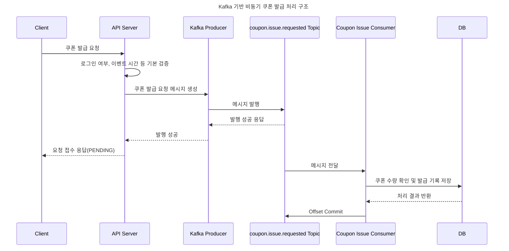

# 2주차 과제: Kafka 기반 비동기 쿠폰 발급 요청 처리 구조 설계

---

## 과제 1. Kafka 기반 비동기 처리 구조 그리기

쿠폰 발급 요청이 들어왔을 때 Kafka를 이용해 비동기적으로 처리하는 구조를 다이어그램으로 작성한다.

### 1. 전체 요청 처리 흐름 다이어그램



### 2. API Server의 역할

API Server는 쿠폰 발급 요청을 직접 끝까지 처리하지 않는다.
로그인 여부, 이벤트 시간, 요청값 같은 기본 검증을 먼저 수행하고, 문제가 없다면 Kafka에 발급 요청 메시지를 발행한다.
Kafka 발행이 성공하면 사용자에게 요청 접수 응답을 반환한다.

### 3. Kafka의 역할

Kafka는 API Server와 Consumer 사이에서 쿠폰 발급 요청 메시지를 안전하게 전달하고 저장하는 역할을 한다.
API Server가 직접 DB 저장까지 기다리지 않도록 중간에서 요청을 받아두고, Consumer가 처리할 수 있는 속도에 맞춰 메시지를 읽게 해준다.

### 4. Consumer의 역할

Consumer는 `coupon.issue.requested` Topic에서 메시지를 읽어 실제 쿠폰 발급 처리를 수행한다.
메시지에 들어있는 `requestId`, `eventId`, `userId`를 바탕으로 쿠폰 수량을 확인하고, 발급 성공 또는 실패 결과를 DB에 저장한다.

### 5. DB의 역할

DB는 최종 쿠폰 발급 결과와 요청 상태를 저장한다.
예를 들어 요청 직후에는 `PENDING`, 발급 성공 시에는 `ISSUED`, 발급 실패 시에는 `FAILED` 상태를 저장할 수 있다.

### 6. 사용자가 요청 직후 최종 발급 결과를 바로 받지 않는 이유

선착순 쿠폰 이벤트는 이벤트 시작 직후 짧은 시간에 많은 요청이 몰릴 수 있다.
API Server가 모든 요청에 대해 쿠폰 수량 확인, 수량 차감, 발급 기록 저장까지 바로 처리하면 응답 지연이나 timeout이 발생할 수 있다.
따라서 요청은 빠르게 접수하고, 실제 발급 처리는 Consumer가 뒤에서 처리하는 것이 더 적합하다.

### 7. 요청 접수 성공과 쿠폰 발급 성공의 차이

요청 접수 성공은 쿠폰 발급 요청 메시지가 Kafka에 정상적으로 들어갔다는 의미이다.
쿠폰 발급 성공은 Consumer가 메시지를 읽고 실제로 쿠폰 발급 처리와 DB 저장까지 완료했다는 의미이다.
따라서 Kafka 발행 성공만으로 쿠폰 발급이 완료되었다고 볼 수 없다.

---

## 과제 2. Topic 설계하기

### 1. Topic 이름

```
coupon.issue.requested
```

### 2. Topic에 담기는 메시지의 의미

`coupon.issue.requested` Topic에는 쿠폰 발급 요청이 들어왔다는 메시지가 담긴다.
아직 쿠폰이 발급되었다는 뜻이 아니라, Consumer가 나중에 처리해야 할 요청이 들어왔다는 의미이다.

### 3. Producer는 어떤 컴포넌트이며 언제 메시지를 발행하는가?

Producer는 API Server이다.
사용자가 쿠폰 발급 요청을 보내고, API Server가 기본 검증을 통과했다고 판단하면 Kafka에 메시지를 발행한다.

### 4. Consumer는 어떤 컴포넌트이며 어떤 처리를 수행하는가?

Consumer는 Coupon Issue Consumer이다.
이 Consumer는 Topic에서 메시지를 읽고, 해당 사용자가 어떤 이벤트의 쿠폰 발급을 요청했는지 확인한 뒤 실제 발급 처리를 수행한다.

### 5. 이 Topic이 필요한 이유

이 Topic은 API Server의 요청 접수 흐름과 실제 쿠폰 발급 처리 흐름을 분리하기 위해 필요하다.
요청이 몰려도 API Server가 모든 처리를 직접 기다리지 않고, Kafka에 요청을 쌓아둔 뒤 Consumer가 순차적으로 처리할 수 있다.

### 6. 이 Topic에 메시지가 들어갔다는 것은 어떤 의미인가?

쿠폰 발급 요청이 Kafka에 정상적으로 접수되었고, Consumer가 처리할 수 있는 대상이 생겼다는 의미이다.
사용자에게는 `PENDING` 상태로 응답할 수 있다.

### 7. 이 Topic에 메시지가 들어갔다는 것이 쿠폰 발급 완료를 의미하지 않는 이유

Topic에 메시지가 들어간 시점에는 아직 Consumer가 쿠폰 수량 확인이나 DB 저장을 수행하지 않았다.
따라서 메시지 발행 성공은 요청 접수 성공일 뿐이고, 실제 발급 성공 여부는 Consumer 처리 이후에 결정된다.

---

## 과제 3. Kafka Message 구조 설계하기

### 1. Kafka Message JSON 예시

```json
{
  "requestId": "req-20260702-001",
  "eventId": 1,
  "userId": 100,
  "requestedAt": "2026-07-02T22:10:00+09:00"
}
```

### 2. 각 필드의 의미

| 필드 | 의미 | 필요한 이유 |
| --- | --- | --- |
| requestId | 하나의 쿠폰 발급 요청을 식별하는 값 | 상태 조회와 요청 추적에 필요하다. 나중에는 멱등성 처리에도 사용할 수 있다. |
| eventId | 어떤 쿠폰 이벤트에 대한 요청인지 나타내는 값 | Consumer가 어떤 이벤트의 쿠폰 수량을 확인하고 차감해야 하는지 알아야 한다. |
| userId | 어떤 사용자가 요청했는지 나타내는 값 | 사용자별 발급 기록 저장과 1인 1개 조건 확인에 필요하다. |
| requestedAt | 사용자가 쿠폰 발급을 요청한 시간 | 요청 시점 확인, 로그 추적, 장애 분석에 사용할 수 있다. |

### 3. Consumer가 이 메시지를 보고 어떤 처리를 할 수 있는가?

Consumer는 `eventId`를 보고 어떤 쿠폰 이벤트인지 확인하고, `userId`를 보고 어떤 사용자에게 발급해야 하는지 확인할 수 있다.
그리고 `requestId`를 기준으로 요청 상태를 조회하거나 처리 결과를 저장할 수 있다.
처리가 끝나면 DB에 발급 성공 또는 실패 결과를 저장한다.

### 4. 메시지에 너무 많은 정보를 넣는 것이 왜 좋지 않을 수 있는가?

메시지에 너무 많은 정보를 넣으면 메시지 크기가 커지고, Producer와 Consumer가 불필요하게 강하게 결합될 수 있다.
또한 쿠폰 이름이나 사용자 정보처럼 변경될 수 있는 데이터를 메시지에 많이 넣으면, 실제 DB의 최신 정보와 메시지 내용이 달라질 수 있다.
따라서 Consumer가 처리에 필요한 최소한의 식별자 중심으로 메시지를 구성하는 것이 좋다.

### 5. requestId는 이번 주차에서 어떤 정도로만 이해하면 되는가?

이번 주차에서는 `requestId`를 쿠폰 발급 요청 하나를 구분하기 위한 식별자로 이해하면 된다.
상태 조회나 로그 추적에 사용할 수 있고, 구체적인 멱등성 처리와 중복 요청 방지는 이후 주차에서 더 자세히 다룬다.

---

## 과제 4. Kafka 발행 성공 / 실패에 따른 API 응답 설계하기

### 상황 A. Kafka 발행 성공

#### 1. Kafka 발행 성공 시 응답 JSON

```json
{
  "status": "PENDING",
  "message": "쿠폰 발급 요청이 접수되었습니다.",
  "requestId": "req-20260702-001"
}
```

#### 2. 이 응답이 쿠폰 발급 성공을 의미하지 않는 이유

이 응답은 Producer가 Kafka Broker로부터 발행 성공 응답을 받았다는 뜻이다.
아직 Consumer가 메시지를 읽어 쿠폰 수량을 차감하거나 발급 기록을 저장한 것은 아니므로 쿠폰 발급 성공을 의미하지 않는다.

#### 3. 요청 접수 성공과 쿠폰 발급 성공의 차이

요청 접수 성공은 쿠폰 발급 요청이 처리될 수 있도록 Kafka에 들어갔다는 의미이다.
쿠폰 발급 성공은 Consumer가 실제 발급 로직을 수행하고 DB 저장까지 완료했다는 의미이다.

#### 4. requestId를 응답에 포함하는 이유

사용자가 이후 발급 상태 조회 API나 마이페이지에서 자신의 요청 상태를 확인할 수 있어야 하기 때문이다.
또한 서버 입장에서도 장애 분석이나 로그 추적 시 특정 요청을 찾기 쉬워진다.

### 상황 B. Kafka 발행 실패

#### 1. Kafka 발행 실패 시 응답 JSON

```json
{
  "status": "FAILED",
  "message": "쿠폰 발급 요청 접수에 실패했습니다. 잠시 후 다시 시도해주세요.",
  "requestId": null
}
```

#### 2. Kafka 발행에 실패했는데 요청 접수 성공 응답을 주면 안 되는 이유

Kafka에 메시지가 들어가지 않으면 Consumer가 처리할 요청이 없다.
그런데 사용자에게 요청 접수 성공 응답을 주면 사용자는 처리 중이라고 생각하지만, 실제 시스템에는 처리할 데이터가 남아 있지 않게 된다.
따라서 Kafka 발행 실패는 요청 접수 실패로 응답해야 한다.

#### 3. 이 상황에서 API Server가 주의해야 할 점

API Server는 Kafka 발행 성공 여부를 확인한 뒤 응답해야 한다.
발행 실패 상황에서는 성공 응답을 반환하지 말고, 실패 로그를 남기거나 재시도 전략을 고려해야 한다.
이번 과제에서는 재시도 전략을 깊게 다루지 않지만, 적어도 사용자를 잘못된 `PENDING` 상태로 안내하면 안 된다.

---

## 과제 5. Partition Key 선택하기

### 1. Partition Key 후보별 장단점 비교

| Partition Key 후보 | 장점 | 단점 |
| --- | --- | --- |
| userId | 같은 사용자의 요청이 같은 Partition으로 들어가므로 사용자 기준 순서를 관리하기 쉽다. | 특정 사용자가 비정상적으로 많은 요청을 보내면 일부 Partition에 부하가 생길 수 있다. |
| eventId | 같은 이벤트 요청을 묶어서 볼 수 있다. | 인기 이벤트 하나에 요청이 몰리면 특정 Partition으로 메시지가 몰릴 수 있다. |
| requestId | 요청마다 값이 달라 메시지 분산에 유리하다. | 같은 사용자의 요청이 서로 다른 Partition으로 갈 수 있어 사용자 기준 순서 보장이 어렵다. |

### 2. 내가 선택한 Partition Key

```
userId
```

### 3. 선택한 이유

쿠폰 발급은 사용자 1명당 하나의 이벤트에서 1개만 발급 가능하다는 조건이 있으므로, 같은 사용자의 요청 흐름을 같은 Partition에서 다루는 것이 자연스럽다.

### 4. 메시지 분산에 어떤 영향을 주는가?

사용자가 많다면 `userId` 값도 다양하므로 여러 Partition에 메시지가 비교적 분산될 수 있다.
따라서 하나의 이벤트에 요청이 몰려도 `eventId`를 Key로 사용하는 것보다 쏠림 가능성이 낮다.

### 5. 순서 보장에 어떤 영향을 주는가?

Kafka는 같은 Partition 안에서만 메시지 순서를 보장한다.
`userId`를 Key로 사용하면 같은 사용자의 요청은 같은 Partition으로 들어가므로, 같은 사용자 기준의 요청 순서를 보장하기 쉽다.

### 6. 특정 Partition에 메시지가 몰릴 가능성은 없는가?

가능성이 아예 없는 것은 아니다.
특정 사용자가 비정상적으로 많은 요청을 보내거나, `userId` 분포가 고르지 않으면 특정 Partition에 메시지가 더 많이 들어갈 수 있다.
하지만 일반적인 선착순 쿠폰 이벤트에서는 많은 사용자가 한두 번씩 요청하는 형태가 많으므로 `eventId`보다 쏠림 위험이 낮다고 볼 수 있다.

### 7. 이 Key를 선택했을 때 발생할 수 있는 단점

`userId`를 Key로 사용해도 같은 사용자가 여러 이벤트에 요청하면 모두 같은 Partition으로 들어갈 수 있다.
또한 최대한의 분산만 생각하면 `requestId`보다 분산 효과가 약할 수 있다.

### 8. eventId를 Partition Key로 사용할 때 주의해야 할 점

선착순 쿠폰 이벤트에서는 대부분의 요청이 특정 이벤트 하나에 몰릴 수 있다.
이때 `eventId = 1`인 메시지가 모두 같은 Partition으로 들어가면 Partition을 여러 개 두어도 실제 처리 병렬성이 줄어든다.
따라서 `eventId`만 Key로 사용하는 경우 특정 Partition 쏠림과 Consumer Lag 증가를 주의해야 한다.

### 9. Kafka는 어떤 단위에서 메시지 순서를 보장하는가? 서로 다른 Partition에 들어간 메시지 A, B의 전체 처리 순서는 보장되는가? 그 이유는?

Kafka는 같은 Partition 안에서만 메시지 순서를 보장한다.
서로 다른 Partition에 들어간 메시지 A, B의 전체 처리 순서는 보장되지 않는다.
각 Partition은 서로 독립적으로 Consumer에게 처리될 수 있으므로, Partition 0의 메시지가 먼저 들어왔더라도 Partition 1의 메시지가 더 먼저 처리될 수 있다.

---

## 과제 6. Consumer Group과 Partition 수 설계하기

### 1. Topic 이름

```
coupon.issue.requested
```

### 2. Partition 수

```
6개
```

### 3. Consumer Group 이름

```
coupon-issue-consumer-group
```

### 4. Consumer 수

```
3개
```

### 5. Partition과 Consumer 매핑

```
Partition 0 -> Consumer 1
Partition 1 -> Consumer 1
Partition 2 -> Consumer 2
Partition 3 -> Consumer 2
Partition 4 -> Consumer 3
Partition 5 -> Consumer 3
```

### 6. 이 구조를 선택한 이유

이벤트 시작 직후 1분 안에 최대 10만 건의 요청이 들어올 수 있으므로 Partition을 1개만 두면 처리 병렬성이 부족하다.
Partition을 6개로 두면 Consumer를 늘렸을 때 최대 6개까지 병렬 처리를 확장할 수 있다.
처음에는 Consumer 3개로 시작하고, Consumer Lag이 커지면 최대 Partition 수에 맞춰 Consumer를 늘릴 수 있다.

### 7. Partition이 3개이고 Consumer가 5개라면 실제로 동시에 처리할 수 있는 Consumer는 최대 몇 개인가?

최대 3개이다.
같은 Consumer Group 안에서는 하나의 Partition을 여러 Consumer가 동시에 처리할 수 없기 때문이다.

### 8. Consumer 수가 Partition 수보다 많으면 어떤 일이 발생하는가?

일부 Consumer는 할당받을 Partition이 없어서 놀게 된다.
예를 들어 Partition이 3개인데 Consumer가 5개라면 2개의 Consumer는 메시지를 처리하지 못한다.

### 9. Consumer 수가 Partition 수보다 적으면 어떤 일이 발생하는가?

한 Consumer가 여러 Partition을 담당하게 된다.
이 경우 모든 Partition을 처리할 수는 있지만, Consumer 하나가 맡는 작업량이 많아져 처리 속도가 느려질 수 있다.

### 10. Consumer 수만 무작정 늘리면 안 되는 이유는 무엇인가?

Consumer 병렬 처리의 최대치는 Partition 수에 제한된다.
Partition 수보다 Consumer 수가 많으면 남는 Consumer가 생기므로 비용만 늘고 처리량은 증가하지 않을 수 있다.
또한 Consumer가 늘어나면 DB 부하도 함께 커질 수 있으므로, Partition 수와 DB 처리량까지 함께 고려해야 한다.

---

## 과제 7. Offset Commit 실패 상황 분석하기

### 1. Consumer가 다시 실행되면 어떤 메시지를 다시 읽을 수 있는가?

Offset Commit 전에 장애가 발생했으므로, Consumer는 마지막으로 Commit된 Offset 이후의 메시지를 다시 읽을 수 있다.
따라서 DB 저장까지 성공했던 메시지도 다시 읽힐 수 있다.

### 2. Kafka 입장에서는 왜 이 메시지가 처리 완료되었다고 판단하지 못하는가?

Kafka는 Consumer가 메시지를 읽었다는 사실만으로 처리 완료를 판단하지 않는다.
Consumer가 Offset Commit을 해야 Kafka는 해당 위치까지 처리되었다고 기록할 수 있다.
DB 저장은 성공했더라도 Offset Commit이 없으면 Kafka 입장에서는 처리 완료 기록이 없는 상태이다.

### 3. 이 상황에서 같은 메시지가 다시 처리될 수 있는가?

같은 메시지가 다시 처리될 수 있다.
Kafka를 사용하는 구조에서는 Consumer 장애나 Offset Commit 실패로 인해 같은 메시지가 한 번 이상 처리될 수 있다고 가정해야 한다.

### 4. 같은 메시지가 다시 처리되면 쿠폰 발급 시스템에서는 어떤 문제가 생길 수 있는가?

같은 사용자에게 같은 쿠폰이 중복 발급될 수 있다.
또한 쿠폰 수량이 한 번 더 차감되어 실제보다 더 많은 쿠폰이 발급된 것처럼 기록될 수 있다.
결과적으로 사용자별 발급 기록과 쿠폰 잔여 수량의 정합성이 깨질 수 있다.

### 5. 이 문제를 해결하려면 나중에 어떤 장치가 필요할 수 있는가?

DB Unique Key를 사용해 같은 이벤트에서 같은 사용자가 두 번 발급되지 않도록 막아야 한다.
또한 `requestId` 기반 멱등성 처리를 통해 같은 요청이 다시 들어와도 한 번만 처리되도록 해야 한다.
처리 상태를 저장해 이미 처리된 요청인지 확인하고, Consumer는 중복 메시지가 들어올 수 있다는 전제로 방어 로직을 가져야 한다.

---

## 과제 8. Consumer Lag이 생겼을 때 사용자 경험 설계하기

### 1. Consumer Lag이란 무엇인가?

Consumer Lag은 Kafka에 쌓인 메시지 중 Consumer가 아직 처리하지 못한 메시지의 차이를 의미한다.
Producer가 메시지를 발행하는 속도보다 Consumer가 처리하는 속도가 느리면 Lag이 증가한다.

### 2. Consumer Lag이 증가하면 사용자 경험에 어떤 영향이 있는가?

사용자는 요청 접수 응답은 빠르게 받을 수 있지만, 최종 발급 결과를 확인하기까지 시간이 길어질 수 있다.
상태 조회 API나 마이페이지에서는 `PENDING` 상태가 오래 유지될 수 있다.

### 3. 요청 직후 사용자에게 줄 응답 JSON

```json
{
  "status": "PENDING",
  "message": "쿠폰 발급 요청이 접수되었습니다.",
  "requestId": "req-20260702-001"
}
```

### 4. 결과 조회 API에서 PENDING 상태일 때 응답 JSON

```json
{
  "status": "PENDING",
  "message": "쿠폰 발급 요청이 처리 중입니다.",
  "requestId": "req-20260702-001"
}
```

### 5. 발급 성공 시 응답 JSON

```json
{
  "status": "ISSUED",
  "message": "쿠폰이 발급되었습니다.",
  "requestId": "req-20260702-001"
}
```

### 6. 발급 실패 시 응답 JSON

```json
{
  "status": "FAILED",
  "message": "쿠폰 발급에 실패했습니다.",
  "requestId": "req-20260702-001"
}
```

### 7. 운영자가 Consumer Lag을 보고 어떤 판단을 할 수 있는가?

운영자는 Consumer 처리 속도가 현재 요청량을 따라가지 못하고 있는지 판단할 수 있다.
Lag이 계속 증가하면 Consumer 수를 늘리거나, DB 병목을 확인하거나, 이벤트 트래픽을 완화하는 조치를 고려할 수 있다.

### 8. Kafka를 사용해도 최종 발급 결과가 늦어질 수 있는 이유

Kafka는 요청을 받아두는 역할을 하지만, 실제 발급 처리는 Consumer와 DB가 수행한다.
Consumer 처리 속도가 느리거나 DB 저장이 병목이 되면 Kafka에 메시지가 쌓이고, 사용자는 최종 결과를 늦게 확인하게 된다.
따라서 Kafka를 사용한다고 해서 모든 처리가 즉시 완료되는 것은 아니다.

---

## 과제 9. 나쁜 Kafka 설계의 문제점 찾기

### 문제점과 개선 방향

| 문제점 | 왜 문제인가? | 개선 방향 |
| --- | --- | --- |
| Partition이 1개이다. | Partition이 1개이면 같은 Consumer Group에서 동시에 처리할 수 있는 Consumer도 사실상 1개로 제한된다. 요청 10만 건을 처리하기에 병렬성이 부족하다. | 예상 트래픽을 고려해 Partition 수를 여러 개로 늘리고, Consumer 병렬 처리가 가능하게 설계한다. |
| Consumer가 1개이다. | Consumer 하나가 모든 메시지를 처리해야 하므로 처리 속도가 느려지고 Consumer Lag이 커질 수 있다. | Consumer Group을 구성하고 여러 Consumer가 Partition을 나누어 처리하도록 한다. |
| Partition Key를 eventId로만 사용한다. | 대부분의 요청이 `eventId = 1`이면 특정 Partition에 메시지가 몰릴 수 있다. Partition을 늘려도 쏠림이 발생하면 병렬 처리 효과가 줄어든다. | `userId`나 `requestId`처럼 더 분산될 수 있는 Key를 검토한다. |
| Kafka 발행 실패에도 요청 접수 성공 응답을 준다. | Kafka에 메시지가 없으면 Consumer가 처리할 수 없는데, 사용자는 요청이 접수되었다고 오해하게 된다. 요청 유실이 발생할 수 있다. | Kafka Broker로부터 발행 성공 응답을 받은 경우에만 `PENDING` 응답을 반환한다. |
| Offset Commit 전 장애 상황을 고려하지 않았다. | DB 저장은 성공했지만 Offset Commit이 실패하면 같은 메시지가 다시 처리될 수 있다. 중복 발급이나 수량 중복 차감이 발생할 수 있다. | DB Unique Key, requestId 기반 멱등성, 처리 상태 저장 등을 통해 중복 처리를 방어한다. |
| Consumer Lag이 증가해도 사용자가 상태를 확인할 수 없다. | 사용자는 요청이 처리 중인지, 성공했는지, 실패했는지 알 수 없다. 결과가 늦어질수록 사용자 경험이 나빠진다. | 요청 상태를 `PENDING`, `ISSUED`, `FAILED`로 저장하고 상태 조회 API나 마이페이지에서 확인할 수 있게 한다. |
| DB 병목을 고려하지 않았다. | Consumer를 늘려도 최종 저장소인 DB가 버티지 못하면 전체 처리 속도가 개선되지 않는다. | Consumer 수를 늘릴 때 DB 처리량과 락 경합도 함께 확인하고, 수량 차감 로직과 저장 구조를 안정적으로 설계한다. |
