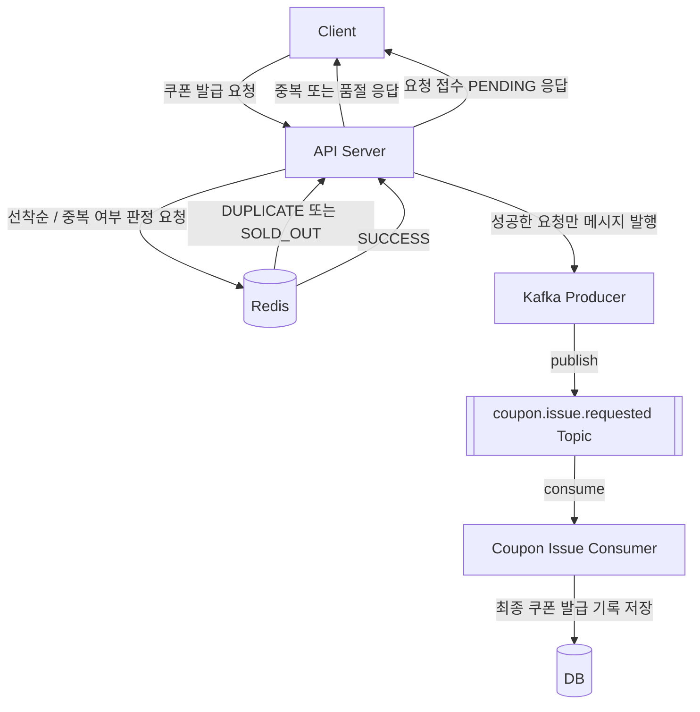
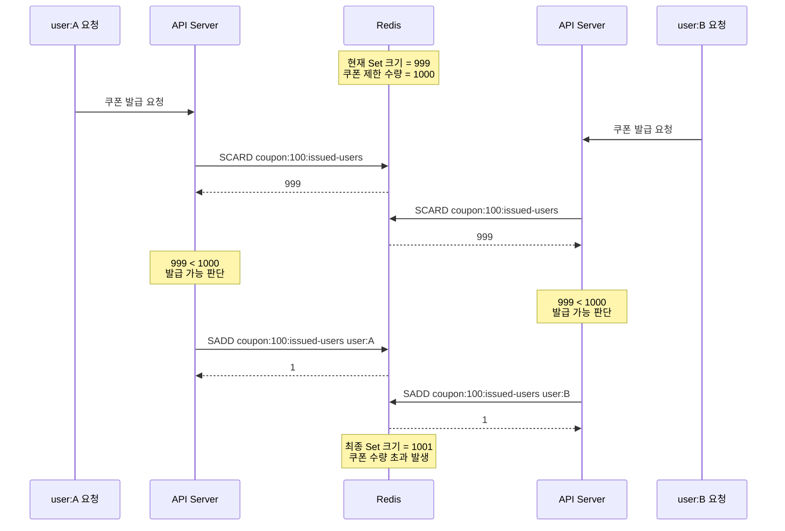
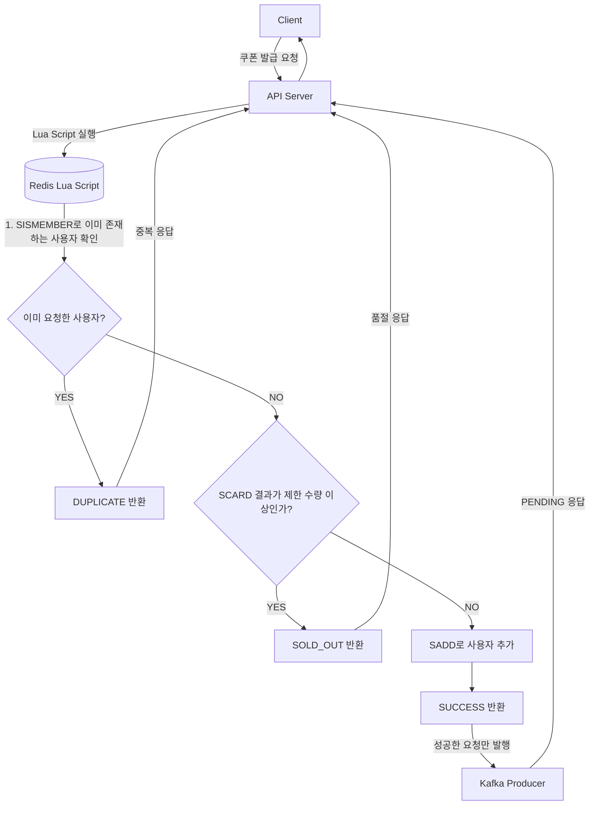
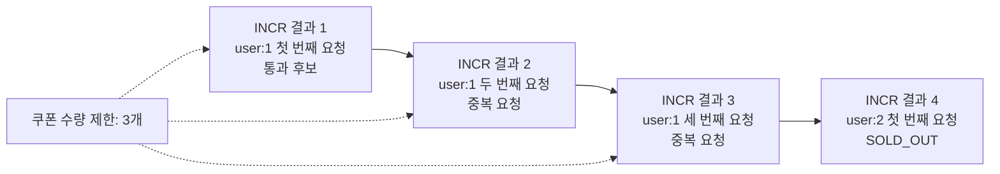
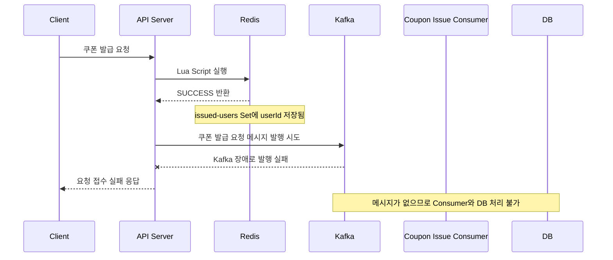
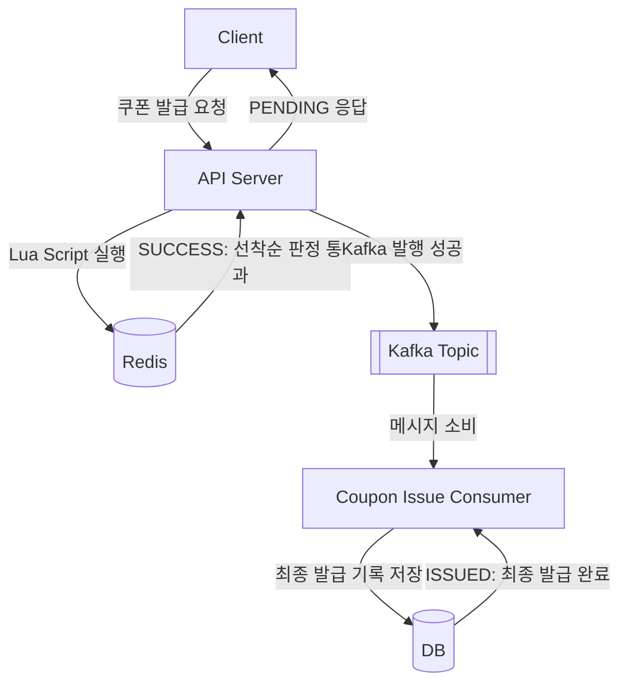

## **과제 1. Redis 기반 선착순 처리 구조 그리기**

쿠폰 발급 요청이 들어왔을 때 Redis를 이용해 선착순 여부와 중복 여부를 판정하는 구조를 다이어그램으로 작성한다.

반드시 아래 구성 요소를 포함해야 한다.

```
Client

API Server

Redis

Kafka Producer

coupon.issue.requested Topic

Coupon Issue Consumer

DB
```

### **1. 전체 요청 처리 흐름 다이어그램**



### **2. Redis의 역할**

```
Redis는 DB 앞단에서 선착순과 중복 여부 판정을 통해 실제로 Kafka에 적재할 메시지와 그렇지 않은 메시지를 빠르게 분류해준다.
```

### **3. Kafka의 역할**

```
Kafka는 메시지를 쌓아두고 consumer가 비동기로 처리한다.
```

### **4. DB의 역할**

```
DB는 최종 쿠폰 발급을 저장하는 곳이다.
```

### **5. Redis를 통과한 요청만 Kafka에 발행해야 하는 이유**

```
Redis를 통과하지 않은 요청도 Kafka에 발행한다면, 결국 실패할 요청도 DB 조회가 필요해져 병목 현상이 발생할 수 있다.
Redis를 사용해 빠른 판단을 하는 이점이 사라지게 된다.
```

---

## **과제 2. Redis가 필요한 이유 설명하기**

2주차 Kafka 기반 구조만으로는 해결하기 어려운 문제를 분석하고, Redis가 필요한 이유를 설명한다.

아래 상황을 기준으로 작성한다.

```
쿠폰 수량: 1,000개
요청 수: 100,000건
발급 조건: 사용자 1명당 1개만 발급 가능
```

### **1. Redis 없이 Kafka와 DB만 사용하는 구조의 문제점**

```
Kafka와 DB만 사용한다면 쿠폰이 수량보다 많이 발급되는 문제, 같은 사용자가 여러 번 발급받는 문제, 
품절 이후 요청까지 DB로 흘러가는 문제를 해결해주지 못한다.
```

### **2. 모든 요청이 Kafka, Consumer, DB까지 도달하면 어떤 문제가 생기는가?**

```
성공 가능성이 낮은 요청까지도 전부 DB 조회를 통해 수량 확인 / 중복 판단 / 저장 시도를 하게 된다.
이 과정에서 DB 병목 등이 발생할 수 있다.
```

### **3. 쿠폰이 이미 품절된 뒤에도 요청이 계속 처리되면 어떤 문제가 생기는가?**

```
실패할 요청까지도 DB 조회를 통해 수량 확인을 진행하게 되므로 불필요한 DB 접근이 생긴다.
```

### **4. 같은 사용자가 버튼을 여러 번 누르면 어떤 문제가 생기는가?**

```
같은 사용자의 요청은 한 번만 처리되어야 하므로, 첫 번째 요청을 제외하면 실패하게 된다.
Redis를 사용하지 않으면 실패할 요청들도 모두 DB 접근이 필요해지므로 비효율적이다.
```

### **5. Redis를 도입하면 어떤 요청을 앞단에서 차단할 수 있는가?**

```
Redis에서 선착순 / 중복 판정을 통해 성공 요청만 Kafka에 메시지를 발급하고 PENDING 응답을 전달한다.
실패 요청들은 바로 실패 응답을 전달한다.
```

---

## **과제 3. Redis Key와 자료구조 설계하기**

쿠폰 이벤트별로 Redis Key를 어떻게 설계할지 작성한다.

이번 과제에서는 아래 Key를 예시로 고려한다.

```
coupon:{eventId}:issued-users

coupon:{eventId}:request-count

coupon:{eventId}:metadata
```

단, 모든 Key를 반드시 사용해야 하는 것은 아니다.

Set + Lua Script 방식을 선택한다면 `request-count` 없이 `SCARD coupon:{eventId}:issued-users`로 통과 사용자 수를 판단할 수도 있다.

자신이 선택한 구조에 맞게 필요한 Key를 설계한다.

### **1. Redis Key 목록**

| **Redis Key**                   | **자료구조** | **저장하는 값**                 | **필요한 이유**                              |
|---------------------------------|----------|----------------------------|-----------------------------------------|
| `coupon:{eventId}:issued-users` | Set      | 선착순 판정을 통과한 사용자 ID         | 중복 요청을 막고, SCARD로 현재 통과한 인원을 확인하기 위해 필요 |
| `coupon:{eventId}:metadata`     | Hash     | 쿠폰 제한 수량, 이벤트 시작 시간, 종료 시간 | 이벤트별 설정 정보를 관리하기 위해 필요 |

### **2. 이벤트 ID가 100일 때 실제 Redis Key 예시**

```
coupon:100:issued-users
coupon:100:metadata
```

### **3. `coupon:{eventId}:issued-users`에는 어떤 값이 저장되는가?**

```
선착순 판정을 통과한 사용자 ID가 저장된다.
```

### **4. `coupon:{eventId}:request-count`를 사용한다면 어떤 역할을 하는가?**

```
요청 순번 또는 전체 요청 수를 확인할 수 있다.
```

### **5. Redis Key에 TTL이 필요한 이유는 무엇인가?**

```
이벤트가 끝난 뒤 불필요한 Redis Key가 계속 남아 있으면 메모리를 낭비하고 운영 부담이 커진다.
TTL을 설정하면 이벤트 종료 후 일정 시간이 지나 Key가 자동으로 삭제되어 Redis 메모리를 효율적으로 관리할 수 있다.
```

### **6. 이벤트가 끝난 뒤 Redis Key를 어떻게 정리할 것인가?**

```
이벤트 종료 후 일정 기간이 지나면 TTL로 자동 삭제되도록 설정한다.
최종 발급 기록은 DB에 저장되어 있어야 하며, Redis Key 삭제 전에 DB 저장이 완료되었는지 확인해야 한다.
```

---

## **과제 4. Redis Set 기반 중복 요청 방지 설계하기**

Redis Set을 이용해 같은 사용자의 중복 요청을 어떻게 막을 수 있는지 설명한다.

### **1. Redis Set을 사용하는 이유**

```
Set은 같은 값을 중복해서 저장하지 않는다.
따라서 사용자의 요청이 중복으로 처리되지 않는다.
```

### **2. `SADD` 명령어의 결과값 1과 0은 각각 무엇을 의미하는가?**

```
1: 새로 추가됨
0: 이미 존재함
```

### **3. 같은 사용자가 두 번 요청했을 때 Redis Set에서 어떤 일이 일어나는가?**

```
user:1 첫 번째 요청: 1

user:1 두 번째 요청: 0
```

### **4. Redis Set 구조를 그림으로 표현하기**

```
Redis

Key: coupon:100:issued-users
자료구조: Set

+-----------------------------+
| coupon:100:issued-users     |
+-----------------------------+
| user:1                      |
| user:2                      |
| user:5                      |
| user:10                     |
+-----------------------------+

user:1이 다시 요청해도 Set에는 이미 user:1이 존재하므로 추가되지 않는다.
따라서 같은 사용자의 중복 요청을 막을 수 있다.
```

### **5. Redis Set만 사용하면 쿠폰 수량 제한까지 자동으로 해결되는가?**

```
아니다. Redis Set은 중복 요청 방지에는 효과적이지만, 쿠폰 수량 제한을 자동으로 보장하지는 않는다.
쿠폰 수량을 제한하려면 Set에 저장된 사용자 수를 확인한 뒤, 제한 수량보다 작은 경우에만 사용자를 추가해야 한다.
```

### **6. Set에 저장된 사용자 수를 확인하기 위해 어떤 명령어를 사용할 수 있는가?**

```
SCARD 명령어를 사용할 수 있다.

ex) SCARD coupon:100:issued-users
```

---

## **과제 5. 잘못된 Redis 명령 조합의 Race Condition 분석하기**

아래 방식은 위험할 수 있다.

```
1. SCARD로 현재 통과 사용자 수를 확인한다.
2. 수량이 남아 있으면 SADD로 사용자를 추가한다.
```

아래 상황을 기준으로 Race Condition을 분석한다.

```
쿠폰 제한 수량: 1,000개
현재 통과 사용자 수: 999명
남은 쿠폰 수량: 1개

동시에 user:A와 user:B가 요청한다.
```

### **1. `SCARD 후 SADD` 방식의 처리 흐름**

```
SACRD 명령어로 현재 통과 사용자 수를 확인한다.
수량이 남아 있으면 SADD로 사용자를 추가한다.
```

### **2. user:A와 user:B가 동시에 요청했을 때 시간 순서 다이어그램**



### **3. 왜 두 사용자 모두 발급 가능하다고 판단할 수 있는가?**

```
두 사용자 모두 SCARD 명령어로 현재 통과 사용자 수를 조회했을 때는 현재 통과 사용자 수 < 쿠폰 제한 수량이므로
발급 가능하다고 판단할 수 있다.
```

### **4. 최종적으로 쿠폰이 1,001개 통과될 수 있는 이유**

```
두 사용자 모두 SADD로 사용자를 추가할 것이므로, 최종적으로 쿠폰이 1,001개가 된다.
```

### **5. 이 문제의 핵심 원인은 무엇인가?**

```
쿠폰 수량 확인과 발급 두 과정으로 나뉘어 있어서 race condition이 발생할 수 있다.
```

### **6. 이 문제를 해결하려면 어떤 작업들이 하나로 묶여야 하는가?**

```
이미 발급받았는지 확인하고, 현재 발급 수량이 제한 수량보다 적은지 확인하고, 
조건을 만족하면 사용자를 발급 성공 목록에 추가하는 작업들이 하나로 묶여야 한다. 
```

---

## **과제 6. Redis Lua Script 기반 원자적 처리 설계하기**

Redis Lua Script를 사용해 중복 확인, 수량 확인, 사용자 추가를 하나의 원자적 작업으로 처리하는 구조를 설계한다.

완벽한 Lua 문법을 작성하는 것이 목적이 아니다.

중요한 것은 아래 세 작업이 하나의 흐름으로 처리되어야 한다는 점을 설명하는 것이다.

```
SISMEMBER

SCARD

SADD
```

### **1. Lua Script로 묶어야 하는 작업 목록**

```
1. 이미 발급받았는지 확인

2. 현재 발급 수량이 제한 수량보다 적은지 확인

3. 조건을 만족하면 사용자를 발급 성공 목록에 추가
```

### **2. Lua Script 처리 흐름 다이어그램**



### **3. Lua Script 반환값 설계**

| **반환값**   | **의미**          | **API Server 처리** |
|-----------|-----------------|-------------------|
| SUCCESS   | Redis 선착순 판정 통과 | Kafka 메시지 발행 시도   |
| DUPLICATE | 이미 통과한 사용자      | 중복 요청 응답          |
| SOLD_OUT  | 쿠폰 수량 소진        | 품절 응답             |

### **4. Lua Script를 사용하면 Race Condition을 어떻게 줄일 수 있는가?**

```
Lua Script는 SISMEMBER, SCARD, SADD를 하나의 원자적 작업으로 묶어 Redis에서 순차적으로 실행한다. 
그래서 수량 확인과 사용자 추가 사이에 다른 요청이 끼어들 수 없고, 동시에 여러 요청이 들어와도 초과 발급이 발생할 가능성을 줄일 수 있다.
```

### **5. Redis Lua Script가 성공했다고 해서 최종 쿠폰 발급이 완료된 것은 아닌 이유**

```
Redis Lua Script가 성공했다는 것은 Kafka에 메시지 발급 요청을 보낸 것이고,
Kafka를 통해 DB 저장이 처리되어야 최종 쿠폰 발급이 완료된 것이다.
```

---

## **과제 7. INCR 기반 선착순 판정 방식의 장점과 한계 분석하기**

Redis에서 `INCR` 기반으로 선착순 판정을 하는 방법을 분석한다.

이 방식은 요청이 들어올 때마다 `request-count`를 증가시키고, 그 값이 제한 수량 이하이면 통과 후보로 보는 방식이다.

```
coupon:{eventId}:request-count
```

필요하다면 중복 사용자 관리를 위해 Set을 함께 사용할 수도 있다.

```
coupon:{eventId}:issued-users
```

### **1. INCR 기반 방식의 기본 흐름**

```
Client
  |
  | 쿠폰 발급 요청
  v
API Server
  |
  | 1. INCR coupon:100:request-count
  v
Redis
  |
  | requestOrder 반환
  v
API Server
  |
  | 2. requestOrder <= limit 인지 확인
  | 3. issued-users Set에서 중복 사용자 확인
  | 4. 통과 가능하면 Kafka 발행
  v
Kafka
```

### **2. `INCR` 명령어가 보장하는 것은 무엇인가?**

```
INCR 명령어는 Redis에서 원자적으로 동작한다.
따라서 많은 요청이 동시에 들어와도 각 요청은 서로 다른 순번을 받는다.
```

### **3. `INCR` 명령어가 보장하지 못하는 것은 무엇인가?**

```
중복 방지를 보장하지 못한다.
```

### **4. 아래 상황에서 어떤 문제가 생기는지 설명하기**

```
쿠폰 수량: 3개

user:1 첫 번째 요청 → INCR 결과 1
user:1 두 번째 요청 → INCR 결과 2
user:1 세 번째 요청 → INCR 결과 3
user:2 첫 번째 요청 → INCR 결과 4
```

```
답변: 한 사용자가 여러 번 요청을 하면, 모두 다른 INCR 결과를 받고, 중복 처리된다. 결과적으로 user 2는 품절 처리된다.
```

### **5. 위 상황을 다이어그램으로 표현하기**



### **6. `request-count`를 최종 발급 수량으로 보면 안 되는 이유**

```
한 사용자의 요청이 중복으로 들어와도 request-count는 증가하기 때문이다.
```

### **7. 실제 통과 사용자 수는 어떤 기준으로 판단하는 것이 더 적절한가?**

```
Redis Set의 SCARD 명령어로 판단하는 것이 더 적절하다.
```

### **8. INCR 기반 방식과 Redis Set + Lua Script 방식을 비교하기**

| **구분** | **INCR 기반 방식** | **Set + Lua Script 방식** |
| --- | --- | --- |
| 수량 판단 기준 | `request-count` 값을 기준으로 요청 순번이 제한 수량 이하인지 판단한다. | `issued-users` Set의 크기(`SCARD`)를 기준으로 실제 통과 사용자 수가 제한 수량보다 작은지 판단한다. |
| 중복 사용자 방지 | `INCR`만으로는 중복 사용자를 막을 수 없다. 별도의 Set 확인이 필요하다. | `SISMEMBER`로 중복 여부를 확인하고, `SADD`로 중복 없이 사용자를 추가한다. |
| 장점 | 구조가 단순하고 `INCR`가 원자적으로 동작하므로 요청 순번을 빠르게 부여할 수 있다. | 중복 확인, 수량 확인, 사용자 추가를 하나의 원자적 흐름으로 처리할 수 있어 더 정확하다. |
| 단점 | 같은 사용자의 중복 요청도 카운트를 증가시켜 선착순 자리를 낭비할 수 있다. `request-count`가 실제 통과 사용자 수를 의미하지 않는다. | Lua Script를 작성하고 관리해야 하므로 INCR 방식보다 구현이 조금 더 복잡하다. |
| 최종 권장 여부 | 단순한 요청 순번 계산에는 사용할 수 있지만, 중복 제거가 필요한 쿠폰 발급의 최종 방식으로는 한계가 있다. | 사용자당 1개 발급 조건과 수량 제한을 함께 처리할 수 있으므로 최종 권장 방식이다. |

---

## **과제 8. Redis 판정 결과에 따른 API 응답 설계하기**

API Server는 Redis 판정 결과에 따라 서로 다른 응답을 반환해야 한다.

이번 과제에서는 아래 세 가지 결과를 기준으로 API 응답을 설계한다.

```
SUCCESS

DUPLICATE

SOLD_OUT
```

단, `SUCCESS`인 경우에도 사용자에게 최종 발급 성공 응답을 주면 안 된다.

`SUCCESS`인 경우에는 Kafka 발행 성공까지 확인한 뒤 `PENDING` 응답을 준다고 가정한다.

HTTP Status Code는 자유롭게 정하되, 왜 그렇게 정했는지 이유를 함께 작성한다.

---

### **상황 A. Redis 결과가 SUCCESS이고 Kafka 발행도 성공한 경우**

#### **1. API 응답 JSON**

```json
{
  "status": "PENDING",
  "message": "쿠폰 발급 요청이 접수되었습니다.",
  "requestId": "req-001"
}
```

#### **2. 이 응답에 사용할 HTTP Status Code와 이유**

```
202 Accepted를 사용할 수 있다.

Redis 선착순 판정을 통과했고 Kafka 발행도 성공했지만, 아직 Consumer가 DB에 최종 쿠폰 발급 기록을 저장한 것은 아니기 때문이다.
즉, 요청은 정상적으로 접수되었지만 최종 처리는 비동기로 진행되는 상태이므로 202 Accepted가 적절하다.
```

#### **3. 이 응답이 최종 쿠폰 발급 성공을 의미하지 않는 이유**

```
PENDING 응답은 Redis 판정을 통과하고 Kafka에 발급 요청 메시지가 발행되었다는 의미이다.
하지만 실제 쿠폰 발급 기록은 Consumer가 메시지를 소비한 뒤 DB에 저장해야 완료된다.

따라서 PENDING은 최종 발급 성공이 아니라 발급 처리 대기 상태를 의미한다.
```

#### **4. 이 응답 이후 Consumer는 어떤 처리를 수행하는가?**

```
Consumer는 coupon.issue.requested Topic에서 메시지를 소비한다.
그 후 사용자 ID, 이벤트 ID 등을 확인하고 DB에 최종 쿠폰 발급 기록을 저장한다.
```

---

### **상황 B. Redis 결과가 DUPLICATE인 경우**

#### **1. API 응답 JSON**

```json
{
  "status": "DUPLICATE",
  "message": "이미 쿠폰 발급 요청이 접수되었습니다."
}
```

#### **2. 이 응답에 사용할 HTTP Status Code와 이유**

```
409 Conflict를 사용할 수 있다.

사용자가 이미 같은 이벤트에 대해 쿠폰 발급 요청을 했기 때문에, 현재 요청은 중복 요청이다.
서버 상태와 충돌하는 요청으로 볼 수 있으므로 409 Conflict가 적절하다.
```

#### **3. 이 경우 Kafka에 메시지를 발행하면 안 되는 이유**

```
이미 Redis Set에 해당 사용자가 존재한다는 것은 선착순 판정을 이미 통과했거나 요청이 이미 접수되었다는 의미이다.
중복 요청까지 Kafka에 발행하면 Consumer와 DB가 불필요한 중복 처리를 하게 된다.

또한 사용자당 1개만 발급해야 하는 조건을 지키기 위해 중복 요청은 Kafka로 보내지 않아야 한다.
```

#### **4. 같은 사용자가 여러 번 요청했을 때 사용자에게 어떤 UX를 제공할 수 있는가?**

```
사용자에게 에러처럼 보이게 하기보다는 이미 요청이 접수되었다는 안내를 제공할 수 있다.
예를 들어 "이미 쿠폰 발급 요청이 접수되었습니다. 발급 결과를 확인해 주세요."와 같은 메시지를 보여줄 수 있다.
```

---

### **상황 C. Redis 결과가 SOLD_OUT인 경우**

#### **1. API 응답 JSON**

```json
{
  "status": "SOLD_OUT",
  "message": "쿠폰이 모두 소진되었습니다."
}
```

#### **2. 이 응답에 사용할 HTTP Status Code와 이유**

```
409 Conflict를 사용할 수 있다.

요청 형식 자체는 잘못되지 않았지만, 이미 쿠폰 수량이 모두 소진되어 더 이상 발급할 수 없는 상태이기 때문이다.
즉, 현재 이벤트 상태와 요청이 맞지 않으므로 409 Conflict로 응답할 수 있다.
```

#### **3. 이 경우 Kafka에 메시지를 발행하면 안 되는 이유**

```
이미 쿠폰이 품절된 상태이므로 해당 요청은 최종적으로 실패할 요청이다.
이런 요청까지 Kafka에 발행하면 Kafka, Consumer, DB가 불필요한 실패 요청을 처리하게 된다.

따라서 SOLD_OUT인 요청은 Redis에서 차단하고 Kafka로 보내지 않는 것이 좋다.
```

#### **4. 품절 이후 요청을 Redis에서 빠르게 차단하는 것이 왜 중요한가?**

```
품절 이후에도 요청이 계속 Kafka와 DB까지 전달되면 시스템 부하가 커진다.
특히 대량 트래픽 상황에서는 실패할 요청이 Consumer와 DB 자원을 계속 사용하게 된다.

Redis에서 품절 요청을 빠르게 차단하면 불필요한 메시지 발행과 DB 접근을 줄일 수 있고, 전체 시스템을 안정적으로 유지할 수 있다.
```

---

## **과제 9. Redis SUCCESS 이후 Kafka 발행 실패 상황 분석하기**

Redis에서 `SUCCESS`가 나왔지만 Kafka 발행에 실패할 수 있다.

아래 상황을 읽고 질문에 답한다.

```
1. 사용자가 쿠폰 발급 요청을 보냈다.

2. API Server가 Redis Lua Script를 실행했다.

3. Redis가 SUCCESS를 반환했다.

4. API Server가 Kafka에 메시지를 발행하려고 했다.

5. Kafka 장애로 메시지 발행에 실패했다.
```

### **1. 이 상황의 전체 흐름 다이어그램**



### **2. Redis에는 어떤 상태가 남아 있을 수 있는가?**

```
Redis에는 해당 사용자가 선착순 판정을 통과한 것으로 남아 있을 수 있다.
예를 들어 coupon:{eventId}:issued-users Set에 userId가 추가된 상태이다.

하지만 Kafka 발행에는 실패했기 때문에 실제로 처리될 메시지는 없는 상태가 된다.
```

### **3. Kafka에는 어떤 문제가 생기는가?**

```
Kafka에는 쿠폰 발급 요청 메시지가 발행되지 않는다.
따라서 coupon.issue.requested Topic에 이 요청이 남지 않고, Consumer가 읽을 메시지도 없다.
```

### **4. Consumer는 왜 이 요청을 처리할 수 없는가?**

```
Consumer는 Kafka Topic에 들어온 메시지를 읽어서 처리한다.
그런데 Kafka 발행이 실패하면 Topic에 메시지가 없으므로 Consumer는 해당 요청이 있었다는 사실을 알 수 없다.

따라서 DB에 최종 쿠폰 발급 기록을 저장할 수도 없다.
```

### **5. 사용자에게 `PENDING` 응답을 줘도 되는가? 그 이유는?**

```
PENDING 응답을 주면 안 된다.

PENDING은 Kafka에 요청 메시지가 정상적으로 발행되어 Consumer가 처리할 수 있는 상태라는 의미이다.
하지만 이 상황에서는 Kafka 발행에 실패했기 때문에 실제로 뒤에서 처리될 요청이 없다.

따라서 사용자에게는 요청 접수 실패 응답을 주고, 다시 시도하도록 안내해야 한다.
```

### **6. 이 상황에서 가능한 보상 처리 방법을 작성하라**

예시는 다음과 같다.

```
- Redis Set에서 userId 제거
- 실패 로그 저장
- Kafka 발행 재시도
- 복구 배치에서 재처리
```

답변:

```
Kafka 발행 실패가 발생하면 먼저 실패 로그를 남겨야 한다.
그 후 Redis Set에서 해당 userId를 제거해서 선착순 통과 상태를 되돌리는 보상 처리를 시도할 수 있다.

예를 들어 coupon:{eventId}:issued-users에서 userId를 제거하면, 해당 사용자는 다시 요청할 수 있게 된다.
또한 Kafka 발행 재시도를 하거나, 실패한 요청을 별도 저장소에 남겨 복구 배치에서 재처리할 수 있다.

중요한 점은 Kafka에 메시지가 들어가지 않았으므로 사용자에게 PENDING 응답을 주면 안 된다는 것이다.
```

### **7. Redis 보상 처리도 실패할 수 있는 이유**

```
Kafka 발행 실패 이후 Redis에서 userId를 제거하려고 해도 Redis 네트워크 오류나 Redis 장애가 발생할 수 있다.
또한 API Server가 보상 처리 전에 죽으면 Redis에는 SUCCESS 상태가 남고 Kafka에는 메시지가 없는 불일치가 생길 수 있다.

따라서 보상 처리만 믿기보다는 실패 로그, 재시도, 복구 배치 같은 추가 장치가 필요하다.
```

### **8. 이 문제는 앞으로 어떤 주차 내용과 연결되는가?**

```
이 문제는 5주차 requestId 기반 멱등성, 6주차 Outbox Pattern, 8주차 Retry / DLQ / 보상 트랜잭션과 연결된다.

Kafka 발행 실패나 Redis 보상 실패가 발생해도 요청을 추적하고, 중복 처리 없이 재시도하고, 최종적으로 상태를 맞추는 방법을 이후 주차에서 다룬다.
```

---

## **과제 10. Redis, Kafka, DB 역할 구분과 이후 주차 연결하기**

Redis, Kafka, DB는 모두 쿠폰 발급 시스템에서 중요하지만 역할이 다르다.

각 구성 요소의 역할을 비교하고, 4~8주차에서 어떤 문제를 해결할지 연결해서 작성한다.

---

### **1. Redis, Kafka, DB 역할 비교표**

| **구분**        | **Redis** | **Kafka** | **DB** |
|---------------|-----------|-----------|--------|
| 주 역할          | 빠른 선착순 / 중복 판정 | 비동기 메시지 전달 | 최종 발급 기록 저장 |
| 저장하는 데이터      | 통과 사용자 Set, 이벤트별 임시 상태 | 쿠폰 발급 요청 메시지 | 쿠폰 발급 결과, 사용자별 발급 기록 |
| 강점            | 빠른 조회와 원자적 처리 | 요청 완충과 Consumer 비동기 처리 | 최종 정합성 보장 |
| 한계            | 최종 저장소로 쓰기 어렵다 | 수량 초과와 중복 발급을 자동으로 막지 못한다 | 대량 요청이 직접 몰리면 부하가 크다 |
| 실패 시 문제       | Redis 상태와 Kafka / DB 상태가 달라질 수 있다 | 메시지 유실 또는 발행 실패가 생길 수 있다 | 최종 발급 기록 저장 실패가 생길 수 있다 |
| 이번 주차에서 보는 핵심 | DB 앞단에서 빠르게 요청을 거르는 역할 | Redis 통과 요청만 비동기로 전달하는 역할 | 최종 발급 성공 여부를 결정하는 역할 |

---

### **2. Redis SUCCESS, Kafka PENDING, DB ISSUED의 차이**

```
Redis SUCCESS는 선착순 판정을 통과했다는 의미이다.
즉, Redis Set에 사용자가 추가되었고 Kafka로 발행할 수 있는 후보가 되었다는 뜻이다.

Kafka PENDING은 Kafka에 쿠폰 발급 요청 메시지가 정상적으로 들어갔고, Consumer가 처리할 수 있는 상태라는 의미이다.

DB ISSUED는 Consumer가 실제 발급 처리를 끝내고 DB에 쿠폰 발급 기록을 저장했다는 의미이다.
따라서 최종 쿠폰 발급 성공은 DB ISSUED 상태라고 볼 수 있다.
```

### **3. 세 상태의 차이를 다이어그램으로 표현하기**



### **4. Redis만 믿고 DB Unique Key를 두지 않으면 어떤 문제가 생길 수 있는가?**

```
Redis에서 중복을 막더라도 Kafka 메시지가 중복 소비되거나 Consumer가 같은 메시지를 다시 처리할 수 있다.
또한 Redis 장애, Redis 데이터 유실, 운영 중 수동 재처리처럼 Redis를 거치지 않는 흐름이 생길 수도 있다.

이때 DB에 UNIQUE(event_id, user_id)가 없으면 같은 사용자가 같은 이벤트에서 쿠폰을 여러 번 발급받는 문제가 생길 수 있다.
```

### **5. Kafka만 사용하면 수량 초과와 중복 발급을 막기 어려운 이유**

```
Kafka는 메시지를 저장하고 Consumer에게 전달하는 역할을 한다.
하지만 Kafka 자체가 쿠폰 수량이 남았는지, 같은 사용자가 이미 요청했는지를 판단해주지는 않는다.

따라서 모든 요청이 Kafka와 Consumer를 거쳐 DB까지 도달하면 DB에서 수량 확인과 중복 확인이 반복되고, 요청이 몰릴 때 초과 발급이나 중복 발급 위험이 커질 수 있다.
```

---

### **6. 4주차: DB 테이블 설계와 최종 정합성 보장**

#### **6-1. Redis를 사용해도 DB Unique Key가 필요한 이유**

```
Redis는 빠른 1차 판정을 담당하지만 최종 저장소는 아니다.
Redis 장애나 데이터 유실, Kafka 중복 소비, Consumer 재처리 상황이 생길 수 있다.

따라서 DB에서도 UNIQUE Key를 두어 같은 사용자에게 같은 이벤트 쿠폰이 중복 발급되지 않도록 마지막 방어선을 만들어야 한다.
```

#### **6-2. `UNIQUE(event_id, user_id)`가 막아주는 문제**

```
같은 사용자가 같은 쿠폰 이벤트에서 두 번 이상 발급 기록을 저장하는 문제를 막아준다.
즉, Consumer가 같은 메시지를 두 번 처리하거나 재시도 중복이 발생해도 DB가 중복 발급을 최종적으로 차단할 수 있다.
```

---

### **7. 5주차: requestId 기반 멱등성과 중복 처리**

#### **7-1. 같은 요청이 여러 번 들어올 수 있는 이유**

```
사용자가 버튼을 여러 번 누를 수 있고, 네트워크 지연으로 같은 요청을 다시 보낼 수 있다.
또한 API Server나 Consumer가 timeout 이후 재시도하면서 같은 요청이 여러 번 처리될 수도 있다.
```

#### **7-2. Redis 중복 체크와 requestId 멱등성의 차이**

```
Redis 중복 체크는 같은 이벤트에서 같은 사용자가 이미 선착순 판정을 통과했는지 확인하는 것이다.

requestId 멱등성은 같은 요청이 여러 번 들어와도 한 번만 처리되도록 요청 단위로 중복 처리를 막는 것이다.
즉, Redis는 사용자 기준 중복 방지에 가깝고 requestId는 요청 처리 재시도에 대한 중복 방지에 가깝다.
```

---

### **8. 6주차: Outbox Pattern과 이벤트 발행 정합성**

#### **8-1. DB 저장은 성공했지만 Kafka 이벤트 발행이 실패할 수 있는 이유**

```
DB 저장과 Kafka 이벤트 발행은 서로 다른 시스템에서 일어나는 작업이다.
DB 트랜잭션은 성공했지만 그 직후 Kafka 장애, 네트워크 오류, Producer 오류가 발생하면 이벤트 발행은 실패할 수 있다.
```

#### **8-2. Outbox Pattern이 필요한 이유**

```
DB 저장과 이벤트 발행을 더 안전하게 연결하기 위해 필요하다.
비즈니스 데이터와 발행해야 할 이벤트를 같은 DB 트랜잭션으로 저장한 뒤, 별도 프로세스가 Outbox에 쌓인 이벤트를 Kafka로 발행한다.

이렇게 하면 DB 저장은 성공했는데 이벤트 발행 기록이 사라지는 문제를 줄일 수 있다.
```

---

### **9. 7주차: EDA 기반 서비스 분리와 조회 구조**

#### **9-1. 쿠폰 발급 후 알림, 마이페이지, 통계를 직접 호출하면 어떤 문제가 생기는가?**

```
쿠폰 발급 흐름이 알림, 마이페이지, 통계 서비스와 강하게 연결된다.
그 결과 알림 발송이나 통계 처리 같은 후속 작업이 느리거나 실패하면 쿠폰 발급 처리에도 영향을 줄 수 있다.

또한 API Server나 Consumer가 너무 많은 책임을 가지게 된다.
```

#### **9-2. 이벤트 기반으로 분리하면 어떤 장점이 있는가?**

```
쿠폰 발급 완료 이벤트를 발행하고, 알림, 마이페이지, 통계 서비스가 각자 필요한 이벤트를 구독해 처리할 수 있다.

이렇게 하면 서비스 간 결합도를 낮출 수 있고, 후속 작업 중 일부가 실패해도 쿠폰 발급 핵심 흐름에 미치는 영향을 줄일 수 있다.
```

---

### **10. 8주차: Retry / DLQ / 장애 처리와 보상 트랜잭션**

#### **10-1. Redis SUCCESS 이후 DB 저장 실패는 어떤 문제인가?**

```
Redis에는 사용자가 선착순을 통과한 것으로 남아 있지만 DB에는 최종 발급 기록이 없는 상태가 된다.
즉, Redis 상태와 DB 상태가 불일치한다.

사용자는 요청이 접수되었다고 생각할 수 있지만 실제 쿠폰은 발급되지 않았으므로 재시도나 보상 처리가 필요하다.
```

#### **10-2. Retry Topic과 DLQ가 필요한 이유**

```
일시적인 장애라면 Retry Topic을 통해 나중에 다시 처리할 수 있다.
하지만 계속 실패하는 메시지를 무한히 재시도하면 시스템에 부담이 되므로, 일정 횟수 이상 실패한 메시지는 DLQ에 보내 따로 분석하고 처리해야 한다.
```

#### **10-3. 보상 트랜잭션이 필요한 상황 예시**

```
Redis에서는 SUCCESS가 되었지만 Kafka 발행에 실패한 경우 Redis Set에서 userId를 제거하는 보상 처리가 필요할 수 있다.

또는 Kafka 발행까지 성공했지만 Consumer가 DB 저장에 계속 실패하면 요청 상태를 FAILED로 바꾸거나, Redis 상태를 정리하거나, 운영자가 재처리할 수 있도록 실패 기록을 남겨야 한다.
```

---
