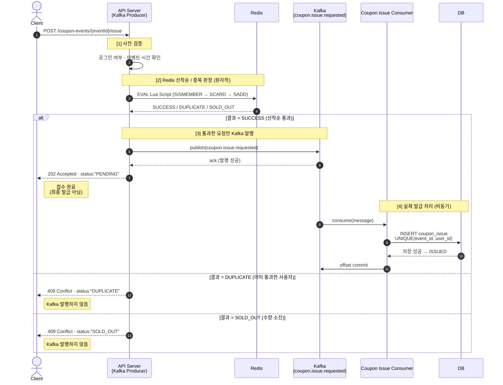

# **3주차 최종 과제 구성**

아래 구성으로 쓰면 중복은 줄이고, 3주차 핵심은 그대로 살릴 수 있어.

# **3주차 과제**

# **Redis 기반 선착순 쿠폰 판정 구조 설계**

## **1. 과제 목표**

이번 3주차 과제의 목표는 **Redis를 이용해 선착순 쿠폰 발급 요청을 빠르게 판정하는 구조를 설계하는 것**이다.

1주차에서는 API Server가 모든 쿠폰 발급 처리를 직접 수행하는 구조와, 요청 접수와 실제 처리를 분리하는 비동기 구조를 비교했다.

2주차에서는 Kafka를 이용해 쿠폰 발급 요청을 비동기적으로 전달하고, Consumer가 뒤에서 실제 쿠폰 발급 처리를 수행하는 구조를 설계했다.

이번 3주차에서는 Kafka 앞단에 Redis를 도입한다.

기본 흐름은 다음과 같다.

```
Client
  ↓
API Server
  ↓
Redis 선착순 / 중복 판정
  ↓
SUCCESS인 요청만 Kafka 발행
  ↓
coupon.issue.requested Topic
  ↓
Coupon Issue Consumer
  ↓
DB
```

이번 과제에서 중요하게 볼 내용은 다음과 같다.

```
Redis가 필요한 이유

Redis Key 설계

Redis 자료구조 선택

Set 기반 중복 요청 방지

SCARD / SADD를 분리했을 때 생기는 Race Condition

Lua Script를 이용한 원자적 처리

INCR 기반 방식의 장점과 한계

Redis SUCCESS / DUPLICATE / SOLD_OUT 결과에 따른 API 응답 설계

Redis SUCCESS 이후 Kafka 발행 실패 상황 분석

Redis SUCCESS가 최종 쿠폰 발급 성공을 의미하지 않는 이유

Redis, Kafka, DB의 역할 구분

앞으로 4~8주차에서 해결할 문제 연결하기
```

이번 과제의 핵심은 Redis 명령어를 외우는 것이 아니라, **Redis를 시스템 구조 안에서 어떤 역할로 사용할지 설계하는 것**이다.

특히 아래 내용을 반드시 구분해야 한다.

```
Redis SUCCESS
= 선착순 판정 통과

Kafka PENDING
= 발급 요청 메시지가 Kafka에 접수됨

DB ISSUED
= DB에 쿠폰 발급 기록이 최종 저장됨
```

즉, Redis에서 `SUCCESS`가 나왔다고 해서 쿠폰 발급이 최종 완료된 것은 아니다.

---

## **2. 기본 상황**

서비스에서 선착순 쿠폰 이벤트를 진행한다고 가정한다.

```
이벤트 이름: 여름맞이 5,000원 할인 쿠폰 이벤트
쿠폰 수량: 1,000개
예상 요청 수: 이벤트 시작 직후 1분 안에 최대 10만 건
발급 조건: 사용자 1명당 하나의 이벤트에서 쿠폰 1개만 발급 가능
응답 방식: 요청 직후 최종 발급 결과를 바로 받지 않아도 됨
결과 확인 방식: 발급 상태 조회 API 또는 마이페이지에서 확인
```

2주차까지의 구조에서는 API Server가 쿠폰 발급 요청을 받으면 Kafka에 메시지를 발행하고, Consumer가 해당 메시지를 읽어 실제 발급 처리를 수행했다.

하지만 이 구조에서는 모든 요청이 Kafka와 Consumer까지 도달할 수 있다.

예를 들어 쿠폰 수량은 1,000개인데 요청이 100,000건 들어온다면, 실제로는 99,000건은 실패할 가능성이 높은 요청이다.

이번 주차에서는 이 실패할 요청을 DB까지 보내지 않도록 Redis에서 먼저 판정한다.

```
요청 100,000건
  ↓
Redis 선착순 / 중복 판정
  ↓
성공 1,000건만 Kafka 발행
  ↓
실패 99,000건은 SOLD_OUT 또는 DUPLICATE 응답
```

이번 주차에서는 API Server가 쿠폰 발급 요청을 받으면 Redis에서 다음을 먼저 확인한다고 가정한다.

```
1. 이미 통과한 사용자인가?

2. 쿠폰 수량이 아직 남아 있는가?

3. 선착순 안에 들어온 요청인가?
```

Redis 판정 결과가 `SUCCESS`인 경우에만 Kafka에 메시지를 발행한다.

Redis 판정 결과가 `DUPLICATE` 또는 `SOLD_OUT`인 경우에는 Kafka에 메시지를 발행하지 않는다.

---

## **3. 이번 과제의 전제 조건**

이번 과제에서는 아래 전제를 따른다.

```
API Server는 쿠폰 발급 요청을 받으면 먼저 로그인 여부와 이벤트 시간을 확인한다.

그 다음 Redis를 이용해 선착순 / 중복 여부를 판정한다.

Redis 판정 결과가 SUCCESS인 경우에만 Kafka에 메시지를 발행한다.

Redis 판정 결과가 DUPLICATE 또는 SOLD_OUT이면 Kafka에 메시지를 발행하지 않는다.

Redis SUCCESS는 최종 쿠폰 발급 성공이 아니다.

최종 쿠폰 발급 성공은 Consumer가 DB에 쿠폰 발급 기록을 저장한 뒤 결정된다.
```

이번 주차에서 사용할 Redis 결과는 아래 세 가지로 단순화한다.

```
SUCCESS:
Redis 선착순 판정 통과

DUPLICATE:
이미 Redis에서 통과한 사용자

SOLD_OUT:
쿠폰 수량 소진
```

이번 주차에서는 Redis를 사용해 선착순 판정을 수행하지만, 아래 내용은 깊게 다루지 않는다.

```
DB Unique Key 상세 설계

requestId 기반 멱등성 상세 설계

Outbox Pattern 상세 설계

Retry Topic / DLQ 상세 설계

보상 트랜잭션 상세 설계
```

다만 이 문제들이 왜 이후 주차에서 필요한지는 간단히 연결해서 설명해야 한다.

---

## **4. 제출 형식**

제출 파일은 아래 경로에 작성해서 PR을 작성한다.

```
submissions/Week3/기수_이름.md
```

예시는 다음과 같다.

```
submissions/Week3/13기_김기민.md
```

제출 문서에는 아래 필수 과제를 모두 포함한다.

```
과제 1. Redis 기반 선착순 처리 구조 그리기

과제 2. Redis가 필요한 이유 설명하기

과제 3. Redis Key와 자료구조 설계하기

과제 4. Redis Set 기반 중복 요청 방지 설계하기

과제 5. 잘못된 Redis 명령 조합의 Race Condition 분석하기

과제 6. Redis Lua Script 기반 원자적 처리 설계하기

과제 7. INCR 기반 선착순 판정 방식의 장점과 한계 분석하기

과제 8. Redis 판정 결과에 따른 API 응답 설계하기

과제 9. Redis SUCCESS 이후 Kafka 발행 실패 상황 분석하기

과제 10. Redis, Kafka, DB 역할 구분과 이후 주차 연결하기

보너스 과제. 나쁜 Redis 설계의 문제점 찾기
```

---

# **5. 필수 과제**

---

## **과제 1. Redis 기반 선착순 처리 구조 그리기**

쿠폰 발급 요청이 들어왔을 때 Redis를 이용해 선착순 여부와 중복 여부를 판정하는 구조를 다이어그램으로 작성한다.

반드시 아래 구성 요소를 포함해야 한다.

```
Client

API Server

Redis

Kafka Producer

coupon.issue.requested Topic

Coupon Issue Consumer

DB
```

### **1. 전체 요청 처리 흐름 다이어그램**

2주차에서 선택한 **구조 B(요청 접수와 실제 발급 처리 분리)** 의 Kafka 흐름 앞단에, 이번 주차에서는 **Redis 선착순/중복 판정 단계**를 추가한다. 핵심은 **Redis 판정을 통과(SUCCESS)한 요청만 Kafka로 발행**하여, 실패할 요청이 Kafka·Consumer·DB로 흘러가지 않도록 앞단에서 걸러내는 것이다.



흐름을 세 구간으로 나누면 다음과 같다.

- **[1] 사전 검증 구간**: 로그인·이벤트 시간 등 Redis 판정 이전에 걸러낼 수 있는 조건을 먼저 확인한다.
- **[2] Redis 판정 구간**: `SISMEMBER → SCARD → SADD`를 Lua Script로 **원자적으로** 실행해 `SUCCESS / DUPLICATE / SOLD_OUT` 중 하나를 즉시 반환한다. 이 구간이 이번 주차의 핵심이다.
- **[3]·[4] 발행/발급 구간**: SUCCESS인 경우에만 Kafka로 발행(Broker ack 확인)하고 사용자에게 `PENDING`을 응답한다. 실제 발급 기록 저장(ISSUED)은 Consumer가 비동기로 처리한다.

### **2. Redis의 역할**

```
Redis = "DB 앞단의 빠른 선착순 / 중복 판정 필터"

1. 쿠폰 수량 제한
   - issued-users Set에 통과 사용자를 저장하고, SCARD로 통과 인원 수를 확인한다.
   - Set 크기가 limit 이상이면 SOLD_OUT으로 즉시 차단한다.

2. 사용자 중복 요청 차단
   - Set은 같은 값을 중복 저장하지 않으므로, 이미 있는 userId는 DUPLICATE로 차단한다.

3. "통과 여부"만 원자적으로 판정
   - 중복 확인 · 수량 확인 · 사용자 추가를 Lua Script로 한 번에 처리해 Race Condition을 막는다.
   - 판정 결과(SUCCESS / DUPLICATE / SOLD_OUT)를 API Server에 즉시 반환한다.

주의: Redis는 "빠른 판정"만 담당하는 임시 상태 저장소다.
      Redis SUCCESS는 선착순 통과일 뿐, 최종 발급 성공이 아니다.
      최종 원본(발급 기록)은 DB가 보관한다.
```

### **3. Kafka의 역할**

```
Kafka = "Redis를 통과한 요청을 Consumer에게 안정적으로 전달하는 비동기 완충 계층"
(2주차와 동일한 역할이며, 앞단에 Redis 필터가 붙은 것뿐이다.)

1. 완충(Buffer)
   - 이벤트 직후 요청이 몰려도, 통과된 요청을 Topic에 쌓아두고
     Consumer가 DB가 감당 가능한 속도로 소비하게 한다.

2. 접수와 처리의 분리
   - API Server(접수)와 Consumer(실제 발급 처리)를 시간적으로 분리해,
     발급 처리가 느려져도 사용자 응답은 빠르게 유지된다.

3. 재처리 기반 제공
   - 메시지를 보관하므로 Consumer 장애 후에도 offset부터 다시 소비할 수 있다.

한계: Kafka는 "전달"만 보장할 뿐, 수량 초과나 중복 발급을 스스로 막지 못한다.
      그래서 그 판정은 앞단의 Redis가, 최종 방어는 뒤단의 DB가 담당한다.
```

### **4. DB의 역할**

```
DB = "최종 발급 기록의 원본이자 마지막 방어선 (Single Source of Truth)"

1. 최종 발급 기록 저장
   - Consumer가 소비한 메시지를 바탕으로 coupon_issue에 발급 기록을 저장한다.
   - 이 저장이 완료되어야 비로소 최종 발급 성공(ISSUED)이다.

2. 최종 정합성 방어
   - UNIQUE(event_id, user_id) 제약으로 같은 사용자의 중복 발급을 최종 차단한다.
   - Redis 장애 / 데이터 유실 / Kafka 중복 소비 등으로 Redis 판정이 뚫려도
     DB가 마지막에서 초과·중복 발급을 막는다. (→ 4주차)

즉, Redis가 "빠르게 거른" 결과를 DB가 "최종적으로 확정"한다.
Redis 성공 ≠ DB 저장 성공. 상태가 어긋날 수 있으므로 DB를 기준 데이터로 삼는다.
```

### **5. Redis를 통과한 요청만 Kafka에 발행해야 하는 이유**

```
핵심: DUPLICATE / SOLD_OUT 요청까지 Kafka로 보내면, Redis를 앞단에 둔 의미가 사라진다.

1. 뒷단(Kafka · Consumer · DB) 부하 절감
   - 10만 건 중 실패할 99,000건까지 Kafka에 쌓으면 Consumer·DB가 무의미한 처리를 하게 된다.
   - Redis에서 SUCCESS 1,000건만 발행하면, 뒷단은 성공 가능한 요청만 처리한다.

2. 품절·중복 응답의 즉시성
   - SOLD_OUT / DUPLICATE는 Kafka·Consumer를 거칠 필요 없이 API Server가 바로 응답할 수 있다.
   - 사용자는 결과를 기다리지 않고 즉시 품절/중복 안내를 받는다.

3. 상태 의미의 일관성
   - Kafka에 올라간 메시지 = "선착순 통과가 확정된 발급 요청"이라는 의미로 통일된다.
   - 실패할 요청이 섞이지 않으므로 Consumer 로직이 단순해지고, PENDING의 의미도 명확해진다.

4. DB Lock 경합 완화
   - 실패할 요청이 DB 수량 조회 / 저장 단계까지 도달하지 않으므로, 이벤트 순간의 Lock 경합이 줄어든다.

정리: Redis는 "통과 여부를 정하는 문지기", Kafka는 "통과된 요청만 나르는 컨베이어"다.
      문지기를 통과하지 못한 요청을 컨베이어에 올리지 않는 것이 구조의 전제다.
```

---

## **과제 2. Redis가 필요한 이유 설명하기**

2주차 Kafka 기반 구조만으로는 해결하기 어려운 문제를 분석하고, Redis가 필요한 이유를 설명한다.

아래 상황을 기준으로 작성한다.

```
쿠폰 수량: 1,000개
요청 수: 100,000건
발급 조건: 사용자 1명당 1개만 발급 가능
```

### **1. Redis 없이 Kafka와 DB만 사용하는 구조의 문제점**

```
전제: 쿠폰 1,000개인데 요청 100,000건 → 실제 성공은 1,000건, 99,000건(99%)은 실패할 요청.

2주차 구조(Redis 없음)에서는 "이 요청이 성공 가능한가"를 판정하는 유일한 지점이 DB뿐이다.
즉, 수량 확인 · 중복 확인 · 저장을 전부 DB가 담당한다.

문제:
1. 판정 지점이 DB 하나뿐 → 실패할 99,000건도 DB까지 도달해야 실패임을 알 수 있다.
2. DB는 이 시스템에서 가장 느리고 가장 비싼 자원 → 이 자원을 실패할 요청에 소모한다.
3. Kafka는 "전달"만 할 뿐, 수량 초과와 중복 발급을 스스로 막지 못한다.
   → Kafka를 앞에 둬도 "DB에 부담을 주는 요청 수" 자체는 줄지 않는다. 시점만 뒤로 밀 뿐이다.
4. 결국 성공 가능성이 없는 요청을 걸러낼 "빠르고 싼 앞단 판정 계층"이 없다.
```

### **2. 모든 요청이 Kafka, Consumer, DB까지 도달하면 어떤 문제가 생기는가?**

```
1. DB Lock 경합 폭증
   - 수량 확인과 저장이 동시에 몰리면 같은 자원(재고/유니크 인덱스)에 Lock 경합이 커진다.
   - 이벤트 시작 순간 10만 건이 동시에 경합하면 처리 지연 → 전체 응답 시간 악화.

2. 무의미한 처리 비용
   - 어차피 실패할 99,000건에 대해서도 Consumer가 소비하고 DB가 조회/판정을 수행한다.
   - CPU · 커넥션 · I/O가 "실패를 확인하는 데" 소모된다.

3. Consumer Lag 증가
   - Topic에 10만 건이 쌓이면 Consumer가 다 소비할 때까지 뒤로 밀린다.
   - 정작 성공할 1,000건의 처리(사용자 쿠폰함 반영)도 함께 늦어진다.

4. 장애 전파 위험
   - DB가 경합으로 느려지면 Consumer 처리도 느려지고, 다른 서비스의 DB 사용까지 영향을 받는다.

정리: Kafka는 요청을 "완충"할 뿐 "줄이지" 못한다. 실패할 요청까지 뒷단으로 다 흘려보내면
      Kafka의 완충 효과가 무의미해지고 병목이 DB로 그대로 전달된다.
```

### **3. 쿠폰이 이미 품절된 뒤에도 요청이 계속 처리되면 어떤 문제가 생기는가?**

```
상황: 이미 1,000개가 모두 소진됨. 그런데도 남은 99,000건이 계속 들어온다.

1. 결과가 뻔한 요청에 자원 낭비
   - 품절 이후 요청은 100% SOLD_OUT인데, DB까지 가야만 "품절"임을 알 수 있다.
   - 확정된 실패를 확인하려고 Kafka·Consumer·DB 자원을 계속 쓴다.

2. 성공 요청 처리 방해
   - 품절 요청이 Topic과 DB 커넥션을 점유해, 아직 처리 중인 정상 요청까지 느려진다.

3. 사용자 응답 지연
   - "품절"이라는 답을 즉시 줄 수 있는데도, 뒷단을 다 거치느라 사용자는 오래 기다린다.

→ 품절은 "한 번 확정되면 바뀌지 않는 상태"다. 이런 요청일수록 앞단에서 O(1)로 즉시 차단하는 것이
   가장 효율적이다. 뒷단까지 보내는 것은 순수한 낭비다.
```

### **4. 같은 사용자가 버튼을 여러 번 누르면 어떤 문제가 생기는가?**

```
상황: user:1이 응답이 안 온다고 버튼을 5번 연타 → 같은 사용자의 요청 5건 발생.

1. 중복 요청이 뒷단으로 증폭
   - Redis 같은 앞단 차단이 없으면 5건 모두 Kafka·Consumer·DB까지 전달된다.
   - 트래픽 폭주 순간, 이런 연타가 모이면 실제 요청량이 몇 배로 부풀 수 있다.

2. 중복 발급 위험
   - DB Unique Key가 없다면 같은 사용자에게 쿠폰이 2개 이상 발급될 수 있다.
   - Unique Key가 있어도, 5건이 모두 DB까지 가서 "제약 위반"으로 실패 처리되는 비용이 든다.

3. 선착순 자리 훼손 (INCR 단독 방식일 때)
   - 순번 카운터만 쓰면 user:1의 5번 클릭이 선착순 자리 5개를 차지해,
     정작 뒤에 온 다른 사용자가 억울하게 품절 처리될 수 있다. (→ 과제 7)

→ 중복은 "같은 사용자인지"만 보면 즉시 판정 가능하다. 이 판정을 앞단(Redis Set)에서 하면
   DB Unique Key(4주차)에 도달하기 전에 대부분의 중복을 값싸게 걸러낼 수 있다.
```

### **5. Redis를 도입하면 어떤 요청을 앞단에서 차단할 수 있는가?**

```
Redis를 DB 앞단에 두면, "DB까지 갈 필요 없는 요청"을 O(1) 연산으로 즉시 걸러낸다.

앞단에서 차단되는 요청:
1. SOLD_OUT — 수량이 이미 소진된 뒤의 모든 요청 (SCARD >= limit)
2. DUPLICATE — 이미 통과한 사용자의 재요청 / 버튼 연타 (SISMEMBER = 1)

뒷단으로 통과되는 요청:
- SUCCESS — 선착순 안에 든 최초 요청. 이것만 Kafka로 발행된다.

효과 (10만 건 기준):
전체 요청 100,000건
  └─ Redis 판정 (원자적, 매우 빠름)
       ├─ SUCCESS   1,000건  → Kafka → Consumer → DB (성공 가능한 요청만)
       └─ 실패      99,000건 → 즉시 DUPLICATE / SOLD_OUT 응답 (뒷단 미도달)

핵심: DB가 받는 요청이 100,000건 → 1,000건으로 줄어든다.
      DB는 "모든 요청을 판정"하는 곳에서 "통과된 요청을 최종 확정"하는 곳으로 역할이 바뀐다.
      단, Redis는 1차 필터일 뿐이므로 최종 중복/정합성 방어는 여전히 DB Unique Key가 맡는다. (→ 4주차)
```

---

## **과제 3. Redis Key와 자료구조 설계하기**

쿠폰 이벤트별로 Redis Key를 어떻게 설계할지 작성한다.

이번 과제에서는 아래 Key를 예시로 고려한다.

```
coupon:{eventId}:issued-users

coupon:{eventId}:request-count

coupon:{eventId}:metadata
```

단, 모든 Key를 반드시 사용해야 하는 것은 아니다.

Set + Lua Script 방식을 선택한다면 `request-count` 없이 `SCARD coupon:{eventId}:issued-users`로 통과 사용자 수를 판단할 수도 있다.

자신이 선택한 구조에 맞게 필요한 Key를 설계한다.

### **1. Redis Key 목록**

> 나는 최종적으로 **Set + Lua Script 방식**을 선택했다. 이 방식에서는 통과 사용자 수를 `SCARD issued-users`로 직접 구하므로 `request-count`는 필수가 아니다. 따라서 아래 표는 **실제 사용 Key 2개(issued-users, metadata)** 를 중심으로 설계하고, `request-count`는 채택하지 않는 이유를 함께 밝힌다.

| **Redis Key** | **자료구조** | **저장하는 값** | **필요한 이유** |
| --- | --- | --- | --- |
| `coupon:{eventId}:issued-users` | Set | 선착순 판정을 통과한 사용자 ID 집합 (예: `user:1`, `user:5`) | **이번 설계의 핵심 Key.** 중복(SISMEMBER)·수량(SCARD)·통과 등록(SADD)을 한 Key로 동시에 처리. 이벤트별로 분리해 Key 하나가 하나의 이벤트 상태를 온전히 표현 |
| `coupon:{eventId}:metadata` | Hash | 이벤트 정보 (`startAt`, `endAt`, 그리고 캐시된 `limit`) | **애플리케이션(API 단계)이 읽는 캐시.** 이벤트 상태·기간(`startAt`/`endAt`)을 사전 검증하고, `limit` 값을 읽어 Lua 호출 시 `ARGV[2]`로 전달하기 위해 사용한다. Lua Script 자체는 metadata를 읽지 않고 `limit`을 인자(ARGV)로 받는다(과제 6). DB 원본을 캐시해 매 요청마다 DB를 조회하지 않도록 함 (원본은 DB, Redis는 빠른 참조용) |
| `coupon:{eventId}:request-count` | String Counter | 요청 순번 (몇 번째 요청인지) | **본 설계에서는 사용하지 않음.** INCR 단독 방식(과제 7)에서 쓰는 Key로, 중복 사용자를 구분하지 못해 선착순 자리를 훼손할 수 있어 채택하지 않음. 표에는 비교를 위해 명시만 함 |

### **2. 이벤트 ID가 100일 때 실제 Redis Key 예시**

```
[실제 사용하는 Key]
coupon:100:issued-users     (Set)   → 통과 사용자 집합
coupon:100:metadata         (Hash)  → limit=1000, startAt=12:00, endAt=13:00

[본 설계에서 미사용 — 참고]
coupon:100:request-count    (String) → INCR 방식에서만 사용 (과제 7에서 한계 분석)

즉, 이벤트 ID만 바꾸면(coupon:200:*, coupon:300:*) 이벤트가 몇 개로 늘어나도
Key 네임스페이스가 자연스럽게 분리되어, 한 이벤트의 상태가 다른 이벤트에 섞이지 않는다.
```

### **3. `coupon:{eventId}:issued-users`에는 어떤 값이 저장되는가?**

```
저장 값: "선착순 판정을 통과한 사용자 ID" 하나하나가 Set의 member로 저장된다.

coupon:100:issued-users (Set)
+------------------+
| user:1           |
| user:5           |
| user:20          |
| user:77          |
| ...              |
+------------------+

특징:
1. Set이므로 중복 저장 불가 → 같은 userId는 아무리 여러 번 SADD 해도 한 번만 존재.
   → "이미 통과한 사용자인가?"를 SISMEMBER로 O(1)에 판정 가능.
2. SCARD로 member 수를 세면 = 현재까지 선착순을 통과한 실제(중복 제거된) 사용자 수.
   → 이 값이 곧 "발급된 쿠폰 수"에 대응하므로 limit과 직접 비교할 수 있다.

주의: 여기 담기는 값은 "Redis 선착순 통과자"이지 "DB 발급 완료자"가 아니다.
      Kafka 발행 실패나 DB 저장 실패로, 이 Set에 있어도 최종 발급이 안 될 수 있다. (과제 9)
```

### **4. `coupon:{eventId}:request-count`를 사용한다면 어떤 역할을 하는가?**

```
역할: INCR로 1씩 증가시켜 "이 요청이 몇 번째로 도착했는지" 순번을 부여한다.
      requestOrder <= limit 이면 선착순 후보, 초과하면 SOLD_OUT으로 빠르게 거른다.

coupon:100:request-count
+------------------+
| 1, 2, 3, ...     |   ← INCR 할 때마다 원자적으로 다음 순번 반환
+------------------+

장점: INCR은 Redis에서 원자적이라, 동시 요청에도 서로 다른 순번을 안전하게 부여한다.

한계(그래서 본 설계에서 채택하지 않은 이유):
- 순번은 "요청 수"이지 "중복 제거된 사용자 수"가 아니다.
- user:1이 3번 누르면 순번 1,2,3을 모두 차지 → 선착순 자리를 중복 사용자가 소비.
- 즉 request-count는 최종 발급 수량과 일치하지 않는다. (자세한 분석은 과제 7)

따라서 나는 request-count 대신 "SCARD issued-users"를 수량 기준으로 사용한다.
이 값이 중복이 제거된 정확한 통과 사용자 수이기 때문이다.
```

### **5. Redis Key에 TTL이 필요한 이유는 무엇인가?**

```
1. 메모리 누수 방지 (가장 큰 이유)
   - Redis는 인메모리 저장소다. 이벤트가 끝나도 Key를 지우지 않으면 issued-users Set이
     메모리에 영구히 남는다. 이벤트를 계속 열수록 죽은 Key가 쌓여 메모리를 잠식한다.

2. Redis는 임시 상태 저장소라는 원칙
   - 최종 원본은 DB(coupon_issue)에 있다. Redis 데이터는 "판정용 임시 상태"이므로
     이벤트 종료 후에는 존재 이유가 사라진다. TTL로 자연 소멸시키는 것이 설계 의도에 맞다.

3. 운영 안전장치
   - 이벤트 종료 후 정리 배치가 누락되더라도, TTL이 걸려 있으면 Key가 스스로 만료된다.
   - "지우는 것을 깜빡해도 언젠가 사라진다"는 안전망 역할.

TTL 설정 시 주의:
- 이벤트가 진행 중일 때 만료되면 통과 기록이 사라져 초과 발급이 날 수 있다.
- 따라서 TTL은 반드시 "이벤트 종료 시각 + 충분한 여유(예: 종료 후 1일)"로 잡아야 한다.
```

### **6. 이벤트가 끝난 뒤 Redis Key를 어떻게 정리할 것인가?**

```
기본 전략: "TTL 자동 만료 + 명시적 정리"를 함께 사용한다. (한 가지에만 의존하지 않음)

1. TTL 기반 자동 만료 (1차)
   - 이벤트 생성 시 각 Key에 "종료 시각 + 1일" 정도의 TTL을 설정한다.
   - 이벤트가 끝나면 별도 조치 없이도 Key가 스스로 사라진다.
   - 단, 진행 중 만료를 막기 위해 여유 시간을 넉넉히 둔다.

2. 명시적 정리 배치 (2차, 보강)
   - 이벤트 종료 후, 최종 발급 기록이 DB에 안전하게 반영되었음을 확인한 뒤
     정리 배치가 coupon:{eventId}:* Key를 명시적으로 DEL 한다.
   - "DB에 정합성 있게 저장됨"을 확인하고 지우므로, 데이터 유실 없이 메모리를 즉시 회수한다.

3. 삭제 순서 · 안전 원칙
   - Redis Key를 지우기 전에 반드시 DB 저장 완료를 기준으로 삼는다. (DB가 원본)
   - 만약 Redis와 DB 상태가 다르면 DB를 기준으로 판단하고, 불일치는 로그로 남긴다. (→ 8주차 정합성 복구)

정리하면, TTL은 "깜빡해도 사라지는 안전망", 명시적 배치는 "확인하고 즉시 회수하는 정공법"이다.
둘을 겹쳐 두는 것이 운영에서 가장 안전하다.
```

---

## **과제 4. Redis Set 기반 중복 요청 방지 설계하기**

Redis Set을 이용해 같은 사용자의 중복 요청을 어떻게 막을 수 있는지 설명한다.

### **1. Redis Set을 사용하는 이유**

```
목표: "이 사용자가 이미 통과했는가?"를 매우 빠르고 정확하게 판정해야 한다.

Set을 선택한 이유:
1. 중복 불허가 자료구조 자체에 내장
   - Set은 같은 값을 두 번 담지 않는다. 즉 "중복 방지"를 애플리케이션 로직이 아니라
     자료구조 특성으로 보장한다. (SADD의 반환값만 보면 신규/중복이 구분된다)

2. O(1) 조회 성능
   - SISMEMBER(존재 여부), SADD(추가), SCARD(개수)가 모두 평균 O(1)이다.
   - 10만 건이 몰리는 순간에도 사용자당 판정 비용이 일정하다.

3. 중복 방지와 수량 확인을 한 Key로 동시 해결
   - 같은 issued-users Set에서 SISMEMBER(중복) + SCARD(수량)를 함께 볼 수 있다.
   - Key가 하나로 묶여 있어 Lua Script로 원자 처리하기에도 유리하다. (과제 6)

대안 대비:
- List: 중복 검사가 O(N)이라 부적합. Sorted Set: 순서/점수까지 필요할 때나 유리, 단순 중복+수량엔 과함.
- 단순 중복 방지 + 수량 제한이라는 이번 요구에는 Set이 가장 단순하고 정확하다.
```

### **2. `SADD` 명령어의 결과값 1과 0은 각각 무엇을 의미하는가?**

```
SADD key member 는 "새로 추가된 member의 개수"를 반환한다.

반환값 1
= 그 사용자가 Set에 없어서 새로 추가됨
= "이 사용자는 처음 통과하는 사용자"
= 선착순 신규 통과 (다음 단계로 진행 가능)

반환값 0
= 그 사용자가 이미 Set에 존재해서 추가되지 않음
= "이 사용자는 이미 통과한 적이 있음"
= 중복 요청 (DUPLICATE)

핵심: SADD의 반환값 하나만으로 "신규 통과(1)"와 "중복(0)"이 구분된다.
      별도의 조회 없이 추가 시도만으로 중복 판정이 되는 것이 Set의 강점이다.
```

### **3. 같은 사용자가 두 번 요청했을 때 Redis Set에서 어떤 일이 일어나는가?**

```
user:1 첫 번째 요청:
  - SADD coupon:100:issued-users user:1
  - Set에 user:1이 없음 → 새로 추가됨 → 반환값 1
  - 판정: 신규 통과 (선착순 안에 들었다면 SUCCESS 처리)

user:1 두 번째 요청:
  - SADD coupon:100:issued-users user:1
  - Set에 user:1이 이미 있음 → 추가되지 않음 → 반환값 0
  - 판정: 중복 요청 → DUPLICATE 응답 (Kafka 발행하지 않음)

결과: user:1이 몇 번을 더 눌러도 Set에는 user:1이 한 번만 존재한다.
      → 한 사용자는 한 이벤트에서 최대 한 번만 선착순을 통과한다. (1인 1매 보장)
```

### **4. Redis Set 구조를 그림으로 표현하기**

```
coupon:100:issued-users  (Set, limit = 1000)

        SADD user:1  → 1 (신규)      SADD user:1 (재시도) → 0 (중복)
             │                              │
             ▼                              ▼
   +-----------------------------+   ┌─────────────────────────┐
   |  coupon:100:issued-users    |   │ user:1은 이미 존재       │
   |-----------------------------|   │ → 추가 안 됨(0) → 차단    │
   |  user:1                     |   └─────────────────────────┘
   |  user:5                     |
   |  user:20                    |     SCARD = 4
   |  user:77                    | ──▶ (현재 통과 사용자 수)
   +-----------------------------+     4 < 1000 → 아직 발급 가능
             ▲
             │  Set 특성상 같은 member는 단 하나만 존재
             │  → 중복 요청은 자료구조 차원에서 자동 차단

수량 판정:  SCARD >= 1000  →  SOLD_OUT
중복 판정:  SADD 결과 == 0  →  DUPLICATE
신규 통과:  SADD 결과 == 1 and SCARD <= 1000  →  SUCCESS
```

### **5. Redis Set만 사용하면 쿠폰 수량 제한까지 자동으로 해결되는가?**

```
아니다. Set이 자동으로 보장하는 것은 "중복 방지"까지다. "수량 제한"은 별도로 판단해야 한다.

- Set이 자동으로 해주는 것:
  같은 사용자를 두 번 담지 않는다 (중복 요청 차단).

- Set이 자동으로 해주지 않는 것:
  "지금 몇 명이 통과했고, limit을 넘었는가?"는 판단해 주지 않는다.
  SADD는 Set 크기가 1000이든 100만이든 상관없이 새 사용자면 그냥 추가한다.

따라서 수량 제한은 이렇게 직접 검사해야 한다:
  현재 SCARD가 limit 미만일 때만 SADD 하도록 로직을 구성한다.

그런데 여기서 이번 주차의 핵심 함정이 생긴다:
  "SCARD로 확인 → SADD로 추가"를 별개 명령으로 나누면,
  그 사이에 다른 요청이 끼어들어 초과 발급(Race Condition)이 발생할 수 있다. (→ 과제 5)
  그래서 이 두 검사를 Lua Script로 원자적으로 묶는다. (→ 과제 6)

정리: Set = 중복 방지는 공짜, 수량 제한은 SCARD로 직접 + 원자성 보장 필요.
```

### **6. Set에 저장된 사용자 수를 확인하기 위해 어떤 명령어를 사용할 수 있는가?**

```
SCARD coupon:{eventId}:issued-users

- SCARD(Set CARDinality)는 Set에 저장된 member(고유 요소)의 개수를 반환한다.
- 평균 시간복잡도 O(1)로, member가 아무리 많아도 빠르게 개수를 얻는다.

예:
  SCARD coupon:100:issued-users
  → 999    (현재 999명 통과)
  → 999 < 1000 이므로 아직 발급 가능

이 값이 중요한 이유:
- Set은 중복을 담지 않으므로, SCARD 값 = "중복 제거된 실제 통과 사용자 수"다.
- 그래서 SCARD를 limit과 비교하는 것이 정확한 수량 판정 기준이 된다.
- 반면 INCR request-count는 중복 요청까지 세므로 수량 기준으로 부적합하다. (과제 7 대비)
```

---

## **과제 5. 잘못된 Redis 명령 조합의 Race Condition 분석하기**

아래 방식은 위험할 수 있다.

```
1. SCARD로 현재 통과 사용자 수를 확인한다.
2. 수량이 남아 있으면 SADD로 사용자를 추가한다.
```

아래 상황을 기준으로 Race Condition을 분석한다.

```
쿠폰 제한 수량: 1,000개
현재 통과 사용자 수: 999명
남은 쿠폰 수량: 1개

동시에 user:A와 user:B가 요청한다.
```

### **1. `SCARD 후 SADD` 방식의 처리 흐름**

```
애플리케이션 코드에서 두 명령을 "나누어" 실행하는 방식이다.

current = SCARD coupon:100:issued-users   // (1) 지금까지 통과한 사용자 수를 읽는다
if current < limit:                        // (2) 남은 수량이 있는지 애플리케이션이 판단한다
    SADD coupon:100:issued-users userId    // (3) 통과 사용자로 추가한다
    return SUCCESS
else:
    return SOLD_OUT

겉보기에는 문제없어 보인다. 하지만 (1)~(3)이 하나의 원자적 연산이 아니라,
서로 다른 Redis 왕복(round-trip)으로 나뉘어 있다는 점이 함정이다.

즉 "읽기(SCARD) → 판단(if) → 쓰기(SADD)"라는 확인 후 실행(check-then-act) 구조인데,
확인한 값(999)이 쓰기 시점까지 그대로라는 보장이 없다.
그 사이에 다른 요청이 끼어들어 상태를 바꿀 수 있다.
```

### **2. user:A와 user:B가 동시에 요청했을 때 시간 순서 다이어그램**

```
전제: limit = 1000, 현재 SCARD = 999 (남은 수량 1개)
      user:A와 user:B가 거의 동시에 요청 (서로 다른 사용자)

시간 →
────────────────────────────────────────────────────────────────
 t1  요청 A: SCARD → 999
 t2  요청 B: SCARD → 999          ← A가 아직 SADD 하기 전에 B가 읽음
 t3  요청 A: 999 < 1000  → 발급 가능 판단
 t4  요청 B: 999 < 1000  → 발급 가능 판단   (둘 다 같은 999를 봤다)
 t5  요청 A: SADD user:A → 1  → SUCCESS
 t6  요청 B: SADD user:B → 1  → SUCCESS    (user:B도 신규라 정상 추가됨)
────────────────────────────────────────────────────────────────
결과: SCARD = 1001  (A, B 둘 다 통과)

시퀀스로 보면:
        요청 A                          요청 B
          │  SCARD = 999                  │
          │                               │  SCARD = 999
          │  (999<1000) 발급 가능          │
          │                               │  (999<1000) 발급 가능
          │  SADD user:A → 1              │
          │                               │  SADD user:B → 1
          ▼                               ▼
      SUCCESS                         SUCCESS
                    ⇒ 통과 1001명 (쿠폰은 1000개)
```

### **3. 왜 두 사용자 모두 발급 가능하다고 판단할 수 있는가?**

```
두 요청이 모두 "SADD를 하기 전에" SCARD를 읽었기 때문이다.

- t1에 A가 999를 읽고, t2에 B가 999를 읽는다.
- 이 시점까지 아무도 SADD를 하지 않았으므로 Set 크기는 여전히 999다.
- 따라서 A와 B는 서로의 존재를 모른 채, 둘 다 "마지막 1자리는 내 것"이라고 판단한다.
- user:A와 user:B는 서로 다른 사용자라 SADD가 둘 다 성공(반환값 1)한다.
  → SADD의 중복 방지는 "같은 사용자"만 막지, "수량 초과"는 막지 못한다.

핵심: 각 요청이 본 999는 "그 요청이 읽은 순간의 과거 스냅샷"이다.
      SADD하는 시점의 최신 값이 아니다. 이 시간차(read-then-write gap)가 문제의 근원이다.
```

### **4. 최종적으로 쿠폰이 1,001개 통과될 수 있는 이유**

```
1. 남은 자리는 1개인데, 두 요청이 같은 "999"를 보고 각자 "내가 마지막"이라 판단했다.
2. SADD는 수량을 검사하지 않는다. 신규 사용자면 Set 크기와 무관하게 무조건 추가한다.
3. user:A, user:B가 서로 다른 값이므로 두 SADD가 모두 성공한다.
   → 999 + 2 = 1001. limit(1000)을 1개 초과한 상태로 Set에 남는다.

결과적으로 발생하는 문제:
- Redis 기준 통과 사용자 = 1001명 → 쿠폰 1000개보다 1명 많이 통과.
- 이 초과분이 Kafka로 발행되어 Consumer·DB까지 흘러간다.
- DB Unique Key는 "같은 사용자 중복"은 막지만, "서로 다른 사용자의 수량 초과"는 막지 못한다.
  → 재고보다 많은 쿠폰이 실제로 발급될 수 있다. (초과 발급 사고)

요청 수가 많고 동시성이 높을수록, 이 틈에 끼어드는 요청이 늘어 초과폭도 커진다.
(경계 근처에서 동시에 N개가 SCARD를 읽으면 최대 N-1개까지 초과될 수 있다.)
```

### **5. 이 문제의 핵심 원인은 무엇인가?**

```
핵심 원인: "수량 확인(SCARD)"과 "사용자 추가(SADD)"가 원자적으로 묶이지 않고 분리되어 있다.

= Check-Then-Act(확인 후 실행)가 원자적이지 않다.

- 개별 명령(SCARD, SADD) 각각은 원자적이다. Redis는 단일 명령을 중간에 쪼개지 않는다.
- 하지만 "SCARD 결과로 판단한 뒤 SADD"라는 두 명령의 조합은 원자적이지 않다.
- 그 사이(판단~추가)에 다른 클라이언트의 요청이 끼어들어 상태를 바꿀 수 있다.
- 즉 A가 읽은 값과 A가 쓰는 시점의 실제 값이 달라지는 "Time-of-check to time-of-use" 문제다.

Redis가 싱글 스레드로 명령을 처리하더라도, 명령을 "여러 번 나눠 보내면"
그 명령들 사이사이에 다른 요청의 명령이 인터리빙(끼어들기)될 수 있다는 점이 본질이다.
```

### **6. 이 문제를 해결하려면 어떤 작업들이 하나로 묶여야 하는가?**

```
아래 세 작업이 "중간에 끼어들 수 없는 하나의 원자적 단위"로 실행되어야 한다.

  1. SISMEMBER — 이미 통과한 사용자인지 확인 (중복 검사)
  2. SCARD     — 현재 통과 사용자 수가 limit 미만인지 확인 (수량 검사)
  3. SADD      — 조건을 만족하면 사용자 추가 (통과 등록)

핵심: "확인(1,2)"과 "추가(3)" 사이에 다른 요청이 절대 끼어들지 못하게 해야 한다.
      확인한 상태 그대로 추가까지 끝나야, 두 요청이 같은 자리를 동시에 차지하는 일이 사라진다.

실현 방법 → Redis Lua Script (과제 6):
- Lua Script는 Redis에서 하나의 명령처럼 원자적으로 실행된다.
- 스크립트가 도는 동안 다른 요청의 명령이 중간에 끼어들지 못한다.
- 따라서 SISMEMBER → SCARD → SADD를 한 스크립트에 담으면
  "읽고 판단하고 쓰는" 전 과정이 하나의 원자적 단위가 되어 초과 발급이 원천 차단된다.

(참고) MULTI/EXEC 트랜잭션도 있지만, 중간 결과(SCARD 값)에 따라 SADD 여부를 분기하는
       조건 로직은 Lua Script가 더 적합하다. 그래서 Lua Script를 택한다.
```

---

## **과제 6. Redis Lua Script 기반 원자적 처리 설계하기**

Redis Lua Script를 사용해 중복 확인, 수량 확인, 사용자 추가를 하나의 원자적 작업으로 처리하는 구조를 설계한다.

완벽한 Lua 문법을 작성하는 것이 목적이 아니다.

중요한 것은 아래 세 작업이 하나의 흐름으로 처리되어야 한다는 점을 설명하는 것이다.

```
SISMEMBER

SCARD

SADD
```

### **1. Lua Script로 묶어야 하는 작업 목록**

```
과제 5에서 분리 실행 시 Race Condition이 났던 "확인~추가"를 하나의 원자 단위로 묶는다.

1. SISMEMBER issued-users userId
   → 이미 통과한 사용자인지 확인 (중복 검사). 존재하면 즉시 DUPLICATE.

2. SCARD issued-users
   → 현재 통과 사용자 수가 limit 미만인지 확인 (수량 검사). limit 이상이면 SOLD_OUT.

3. SADD issued-users userId
   → 1·2를 모두 통과한 경우에만 사용자를 추가 (통과 등록). 그 후 SUCCESS 반환.

순서가 중요하다: 중복 검사(1)를 수량 검사(2)보다 먼저 한다.
이미 통과한 사용자의 재요청은 "품절이어도" SOLD_OUT이 아니라 DUPLICATE로 답해야
사용자에게 정확한 안내가 되기 때문이다. (본인은 이미 받았으므로 품절과 무관)
```

### **2. Lua Script 처리 흐름 다이어그램**

```
API Server
  |
  | EVAL script, KEYS=[coupon:100:issued-users], ARGV=[userId, limit]
  v
+=======================  Redis (원자적 실행)  =======================+
|                                                                    |
|  (1) SISMEMBER issued-users userId                                 |
|          |                                                         |
|          +-- 1 (이미 존재) ----------------------► return DUPLICATE |
|          |                                                         |
|          +-- 0 (신규)                                              |
|                 |                                                  |
|  (2) SCARD issued-users  →  currentCount                           |
|                 |                                                  |
|                 +-- currentCount >= limit --------► return SOLD_OUT |
|                 |                                                  |
|                 +-- currentCount <  limit                          |
|                        |                                           |
|  (3) SADD issued-users userId                                      |
|                        |                                           |
|                        +------------------------► return SUCCESS   |
|                                                                    |
+====================================================================+
  |
  | SUCCESS / DUPLICATE / SOLD_OUT
  v
API Server  (결과에 따라 분기: Kafka 발행 / 중복 응답 / 품절 응답)
```

의사코드(개념 전달용):

```lua
-- KEYS[1] = coupon:{eventId}:issued-users
-- ARGV[1] = userId,  ARGV[2] = limit
local key   = KEYS[1]
local user  = ARGV[1]
local limit = tonumber(ARGV[2])

if redis.call('SISMEMBER', key, user) == 1 then
    return 'DUPLICATE'          -- 1. 이미 통과한 사용자
end
if redis.call('SCARD', key) >= limit then
    return 'SOLD_OUT'           -- 2. 수량 소진
end
redis.call('SADD', key, user)   -- 3. 통과 등록
return 'SUCCESS'
```

### **3. Lua Script 반환값 설계**

| **반환값** | **의미** | **API Server 처리** |
| --- | --- | --- |
| SUCCESS | 선착순 판정 통과 (중복 아님 + 수량 여유 있음 + Set 등록 완료) | Kafka(`coupon.issue.requested`)에 발급 요청 발행 시도 → 발행 성공 시 `PENDING`(202) 응답. 발행 실패 시 Redis 보상 처리(과제 9) |
| DUPLICATE | 이미 통과(발급 요청)한 사용자의 재요청 | Kafka 발행하지 않음. `DUPLICATE`(409) 응답 — "이미 요청 완료" 안내 |
| SOLD_OUT | 쿠폰 수량 소진 (SCARD ≥ limit) | Kafka 발행하지 않음. `SOLD_OUT`(409) 응답 — "품절" 안내 |

### **4. Lua Script를 사용하면 Race Condition을 어떻게 줄일 수 있는가?**

```
원리: Redis는 Lua Script 하나를 "단일 명령처럼" 원자적으로 실행한다.
      스크립트가 도는 동안 다른 클라이언트의 명령이 중간에 끼어들 수 없다.

과제 5 문제와 비교:
[분리 실행]  A: SCARD(999) ... (B가 끼어듦) ... A: SADD  → 확인과 추가 사이에 틈이 있었다.
[Lua 실행]   A의 SISMEMBER→SCARD→SADD가 통째로 끝난 뒤에야 B의 스크립트가 시작된다.

따라서 A와 B가 동시에 와도 실제로는 이렇게 직렬화된다:
  A 스크립트 전체 실행 (SCARD=999 → SADD → 1000) 완료
  → B 스크립트 실행 시작: SCARD=1000 >= limit → SOLD_OUT
결과: 1000개 정확히 통과. 초과 발급이 원천 차단된다.

핵심: "확인한 값이 추가 시점까지 절대 안 바뀐다"가 보장된다.
      과제 5의 TOCTOU(확인~사용 시간차)가 사라진다.

단, 남는 한계:
- 이 원자성은 "단일 Redis 인스턴스" 안에서의 보장이다.
  Redis 클러스터/복제 환경에서는 관련 Key를 같은 슬롯에 두고,
  복제 지연·페일오버 시 상태 유실 가능성을 별도로 고려해야 한다.
- Lua Script는 실행 중 Redis를 블로킹하므로, 스크립트는 짧고 가볍게 유지해야 한다.
```

### **5. Redis Lua Script가 성공했다고 해서 최종 쿠폰 발급이 완료된 것은 아닌 이유**

```
Redis SUCCESS = "선착순 판정 통과"일 뿐, "최종 발급 완료"가 아니다.

SUCCESS 이후에도 남은 단계가 있고, 각 단계는 실패할 수 있다:
1. Kafka 발행이 실패할 수 있다. → Redis엔 통과로 남지만 메시지가 없어 발급이 진행되지 않음 (과제 9)
2. Consumer가 DB 저장에 실패할 수 있다. → DB 장애 시 ISSUED에 도달 못 함 (과제 10 / 8주차)
3. Redis 자체가 장애/유실될 수 있다. → 통과 기록이 사라질 수 있음

즉 상태는 다음처럼 단계별로 분리된다:
  Redis SUCCESS  = 선착순 통과        (≠ 최종 성공)
  Kafka PENDING  = 발급 요청 접수됨    (≠ 최종 성공)
  DB ISSUED      = 발급 기록 최종 저장  (= 최종 성공)

그래서 API Server는 SUCCESS가 나와도 사용자에게 "발급 완료"가 아니라
"요청 접수됨(PENDING)"까지만 응답한다. (과제 8)
최종 정합성은 DB Unique Key와 트랜잭션이 보장한다. (4주차)

정리: Redis는 "빠른 1차 판정"을 담당할 뿐, 발급의 최종 확정자는 DB다.
      Redis SUCCESS를 최종 성공으로 오해하면 상태 불일치와 초과/누락 발급을 놓치게 된다.
```

---

## **과제 7. INCR 기반 선착순 판정 방식의 장점과 한계 분석하기**

Redis에서 `INCR` 기반으로 선착순 판정을 하는 방법을 분석한다.

이 방식은 요청이 들어올 때마다 `request-count`를 증가시키고, 그 값이 제한 수량 이하이면 통과 후보로 보는 방식이다.

```
coupon:{eventId}:request-count
```

필요하다면 중복 사용자 관리를 위해 Set을 함께 사용할 수도 있다.

```
coupon:{eventId}:issued-users
```

### **1. INCR 기반 방식의 기본 흐름**

```
아이디어: 요청이 올 때마다 카운터를 1 올리고, 그 순번이 limit 이하면 통과 후보로 본다.

Client
  |
  | 쿠폰 발급 요청
  v
API Server
  |
  | (1) requestOrder = INCR coupon:100:request-count   → 요청 순번 부여
  v
Redis
  |
  | (2) requestOrder <= limit 인지 확인               → 선착순 후보 여부
  | (3) SISMEMBER issued-users userId                 → 이미 통과한 사용자인지(중복) 확인
  | (4) 통과 시 SADD issued-users userId              → 중복 관리는 결국 Set이 담당
  v
API Server
  |
  | requestOrder <= limit 이고 신규 사용자면 SUCCESS → Kafka 발행
  | requestOrder >  limit 이면 SOLD_OUT
  v
Kafka

핵심: INCR은 "순번 계산"만 담당하고, 중복 방지는 별도의 Set이 담당해야 한다.
      즉 INCR 단독으로는 선착순 판정이 완성되지 않는다.
```

### **2. `INCR` 명령어가 보장하는 것은 무엇인가?**

```
1. 원자적 순번 부여
   - INCR은 Redis에서 원자적으로 실행된다. 동시에 여러 요청이 와도
     각 요청은 서로 겹치지 않는 고유한 순번을 하나씩 받는다.
   - 요청 A→1, B→2, C→3 ... 처럼 절대 같은 숫자가 두 번 나오지 않는다.

2. "몇 번째로 도착한 요청인가"에 대한 빠르고 정확한 카운팅
   - 락 없이 O(1)로 순번을 매길 수 있어, 수량 상한 판단(requestOrder <= limit)이 단순·빠르다.

즉 INCR이 보장하는 것 = "요청마다 유일한 순번" + "그 카운팅의 원자성"이다.
```

### **3. `INCR` 명령어가 보장하지 못하는 것은 무엇인가?**

```
1. 사용자 중복 제거를 보장하지 못한다 (가장 큰 한계)
   - INCR은 "누가 요청했는지" 모른다. 그냥 숫자를 올릴 뿐이다.
   - 같은 사용자가 여러 번 요청하면, 그 요청마다 순번이 따로 발급된다.
   - 즉 한 사용자가 선착순 자리를 여러 개 차지할 수 있다.

2. "순번"과 "실제 통과 사용자 수"의 일치를 보장하지 못한다
   - request-count 값은 "요청 수"에 가깝지, "중복 제거된 사용자 수"가 아니다.
   - 품절 이후 요청도 카운터를 계속 증가시킨다. (SOLD_OUT이어도 INCR은 올라감)

정리: INCR은 "순번(요청 수)"은 정확히 세지만, "선착순에 실제로 든 사람 수"는 세지 못한다.
      중복 제거는 Set(SISMEMBER/SADD)이 따로 해줘야 한다.
```

### **4. 아래 상황에서 어떤 문제가 생기는지 설명하기**

답변:

```
상황: limit = 3.  user:1이 3번 연타, user:2가 1번 요청.
  user:1 1회차 → INCR 1 (<=3) → 통과 후보
  user:1 2회차 → INCR 2 (<=3) → 통과 후보
  user:1 3회차 → INCR 3 (<=3) → 통과 후보
  user:2 1회차 → INCR 4 (>3)  → SOLD_OUT

문제:
1. 실제로 통과해야 할 사람은 user:1, user:2 두 명뿐인데,
   user:1의 중복 요청 3건이 선착순 자리 1·2·3을 모두 차지했다.
2. 그 결과 정작 처음 요청한 user:2가 순번 4를 받아 품절 처리되었다.
   → "한 명이 자리를 독식하고, 다른 정당한 사용자가 밀려나는" 불공정이 발생한다.
3. 순번 기준으로만 보면 3자리가 다 찼지만, 중복을 제거하면 통과 사용자는 user:1 단 1명이다.
   → request-count(=3)와 실제 통과 사용자 수(=1)가 어긋난다.

원인: INCR은 "요청"마다 자리를 주지, "사용자"마다 자리를 주지 않는다.
      중복 사용자를 걸러내는 SISMEMBER 검사를 INCR과 원자적으로 묶지 않으면 이 문제가 생긴다.

보완: Set을 함께 써서 "이미 통과한 사용자면 순번을 소비하지 않도록" 해야 한다.
      즉 결국 중복 판정의 실제 주체는 INCR이 아니라 Set이다.
```

### **5. 위 상황을 다이어그램으로 표현하기**

```
limit = 3,  request-count 기준 선착순 자리

    순번1        순번2        순번3        순번4
  +---------+  +---------+  +---------+  +---------+
  | user:1  |  | user:1  |  | user:1  |  | user:2  |
  +---------+  +---------+  +---------+  +---------+
    통과         중복         중복         품절(SOLD_OUT)
     │            │            │             │
     │            └── 같은 사용자가 ──┘            │
     │                자리 3개 독식                │
     └───────────────────────────────────────────┘
                                                  │
   ▼ 실제로 통과했어야 할 사람                       ▼ 실제 결과
   user:1, user:2  (2명)             user:1만 통과 / user:2 억울하게 품절

  request-count = 3  (요청 순번)   ≠   실제 통과 사용자 수 = 1  (중복 제거 시)
```

### **6. `request-count`를 최종 발급 수량으로 보면 안 되는 이유**

```
1. request-count는 "요청 수(순번)"이지 "중복 제거된 통과 사용자 수"가 아니다.
   - 같은 사용자의 중복 요청도 카운터를 올리므로, 실제 사람 수보다 부풀려진다.

2. 품절 이후 요청도 카운터를 계속 증가시킨다.
   limit = 1000
   1001번째 요청 → INCR 1001 → SOLD_OUT (그래도 카운터는 1001)
   1002번째 요청 → INCR 1002 → SOLD_OUT
   → request-count는 발급량과 무관하게 계속 커진다. 발급 수량으로 해석하면 완전히 틀린 값이 된다.

3. Kafka 발행 실패·DB 저장 실패가 나도 request-count는 되돌아가지 않는다.
   → "통과 순번을 받은 것"과 "실제로 발급된 것"은 별개다.

결론: request-count = 최종 발급 수량으로 보면 안 된다.
      그것은 "몇 번째로 판정 대기열에 들어왔는가"를 나타내는 순번일 뿐이다.
```

### **7. 실제 통과 사용자 수는 어떤 기준으로 판단하는 것이 더 적절한가?**

```
SCARD coupon:{eventId}:issued-users 로 판단하는 것이 적절하다.

이유:
- issued-users는 Set이므로 같은 사용자를 중복 저장하지 않는다.
- 따라서 SCARD 값 = "중복이 제거된, 실제로 선착순을 통과한 사용자 수"다.
- 이 값을 limit과 비교해야 정확한 수량 판정이 된다. (SCARD >= limit → SOLD_OUT)

대비:
  request-count(INCR) → 요청 수(중복·품절 포함) → 수량 기준으로 부적합
  SCARD(Set)          → 통과 사용자 수(중복 제거) → 수량 기준으로 적합

그래서 나는 과제 6에서 SCARD를 수량 기준으로 삼는 Set + Lua Script 방식을 최종 선택했다.
(단, Redis SCARD도 최종 발급 수량은 아니다. 최종 발급 수량은 DB coupon_issue 저장 건수다.)
```

### **8. INCR 기반 방식과 Redis Set + Lua Script 방식을 비교하기**

| **구분** | **INCR 기반 방식** | **Set + Lua Script 방식** |
| --- | --- | --- |
| 수량 판단 기준 | `request-count`(요청 순번). 중복·품절 요청까지 세므로 실제 통과 수와 어긋남 | `SCARD issued-users`(중복 제거된 통과 사용자 수). 수량 기준으로 정확 |
| 중복 사용자 방지 | INCR 자체로는 불가. 별도 Set(SISMEMBER)이 있어야 하고, 그마저 원자적으로 안 묶으면 뚫림 | Set에 내장(SADD/SISMEMBER). 중복 방지가 자료구조로 보장됨 |
| 장점 | 순번 부여가 단순·빠름. "몇 번째 요청"이라는 개념을 설명하기 쉬움 | 중복 확인·수량 확인·등록을 한 스크립트로 원자 처리 → Race Condition 원천 차단 |
| 단점 | 중복 사용자가 선착순 자리 독식 가능. 여러 명령 분리 시 Race Condition. 순번≠발급수량 | 원자성은 단일 인스턴스 기준. 스크립트 블로킹 고려 필요. Kafka/DB 실패는 별도 처리 필요 |
| 최종 권장 여부 | 참고용(순번 개념 이해). 정확한 선착순 판정의 최종 선택지로는 부적합 | **최종 권장.** 중복 제거 기반 정확한 선착순 판정 + 원자성 보장 |

---

## **과제 8. Redis 판정 결과에 따른 API 응답 설계하기**

API Server는 Redis 판정 결과에 따라 서로 다른 응답을 반환해야 한다.

이번 과제에서는 아래 세 가지 결과를 기준으로 API 응답을 설계한다.

```
SUCCESS

DUPLICATE

SOLD_OUT
```

단, `SUCCESS`인 경우에도 사용자에게 최종 발급 성공 응답을 주면 안 된다.

`SUCCESS`인 경우에는 Kafka 발행 성공까지 확인한 뒤 `PENDING` 응답을 준다고 가정한다.

HTTP Status Code는 자유롭게 정하되, 왜 그렇게 정했는지 이유를 함께 작성한다.

---

### **상황 A. Redis 결과가 SUCCESS이고 Kafka 발행도 성공한 경우**

#### **1. API 응답 JSON**

```json
{
  "status": "PENDING",
  "message": "쿠폰 발급 요청이 접수되었습니다. 결과는 잠시 후 마이페이지에서 확인할 수 있습니다.",
  "requestId": "req-20260708-abc123"
}
```

#### **2. 이 응답에 사용할 HTTP Status Code와 이유**

```
HTTP 202 Accepted

이유:
- 202 Accepted = "요청을 접수했으나 처리는 아직 완료되지 않았다"는 의미로, 이 상황에 정확히 맞는다.
- 현재 확정된 사실은 "Redis 선착순 통과 + Kafka 발행 성공(접수 완료)"까지다.
  실제 발급(DB 저장)은 Consumer가 비동기로 뒤에서 처리한다.
- 200 OK를 쓰면 "발급이 완료됐다"는 오해를 준다. 아직 완료가 아니므로 부적절하다.
- 201 Created도 "리소스(쿠폰 발급 기록)가 생성됐다"는 의미인데, 생성은 아직 안 됐으므로 부적절하다.
→ "접수는 됐고 결과는 나중"이라는 상태를 가장 정직하게 표현하는 코드가 202다.
  (2주차에서 접수 성공 = Kafka 발행 성공(Broker ack)으로 정의한 것과 일관된다.)
```

#### **3. 이 응답이 최종 쿠폰 발급 성공을 의미하지 않는 이유**

```
PENDING이 보장하는 것:
= Redis 선착순 판정 통과
= Kafka에 발급 요청 메시지 전달 성공(접수 완료)
= Consumer가 이후 DB 저장을 처리할 예정

PENDING이 보장하지 않는 것:
≠ DB에 발급 기록이 저장됨(ISSUED)
≠ 사용자 쿠폰함에 쿠폰이 최종 반영됨

이유: SUCCESS 이후에도 Consumer의 DB 저장이 실패할 수 있고(DB 장애 등),
      그 경우 최종 상태는 ISSUED가 아니라 FAILED가 된다.
      따라서 접수 시점에는 "완료"가 아니라 "접수됨(PENDING)"까지만 약속해야 한다.
      최종 성공은 DB ISSUED로만 확정된다. (4주차 / 과제 10)
```

#### **4. 이 응답 이후 Consumer는 어떤 처리를 수행하는가?**

```
1. Topic(coupon.issue.requested)에서 메시지를 소비한다.
2. 메시지의 eventId, userId, requestId로 실제 발급 처리를 시작한다.
3. DB coupon_issue에 발급 기록을 INSERT 한다.
   - UNIQUE(event_id, user_id) 제약으로 최종 중복 발급을 방어한다. (4주차)
   - 성공 시 상태 ISSUED로 확정된다.
4. 처리가 정상 완료되면 offset을 commit 한다.
   - 저장 성공 후 commit 순서를 지켜, 실패 시 재처리(at-least-once)가 가능하게 한다.
5. (이후 주차) 발급 완료 이벤트 발행(Outbox, 6주차) → 알림/마이페이지 반영(EDA, 7주차).

사용자는 이 처리 완료 후, 상태 조회 API나 마이페이지에서 PENDING → ISSUED로 바뀐 결과를 확인한다.
```

---

### **상황 B. Redis 결과가 DUPLICATE인 경우**

#### **1. API 응답 JSON**

```json
{
  "status": "DUPLICATE",
  "message": "이미 쿠폰 발급 요청을 완료한 사용자입니다. 결과는 마이페이지에서 확인해 주세요."
}
```

#### **2. 이 응답에 사용할 HTTP Status Code와 이유**

```
HTTP 409 Conflict

이유:
- 409 Conflict = "현재 리소스 상태와 충돌해서 요청을 처리할 수 없다"는 의미다.
  "이미 발급 요청을 완료한 상태"와 새 요청이 충돌하는 상황이므로 409가 적절하다.
- 요청 형식 자체는 올바르므로 400(Bad Request)은 아니다. 서버 오류도 아니므로 5xx도 아니다.
- 이것은 "정상적으로 판정된, 예상 가능한 비즈니스 결과"다. 즉 서버는 정상 동작했고,
  단지 이 사용자는 이미 처리됐을 뿐이다. → 4xx(클라이언트 상태 기인) 중 409가 가장 정확하다.

(대안 여지) 팀 정책에 따라 200 OK로 내리고 body의 status로 구분하기도 한다.
  다만 나는 "이미 처리됨"이라는 상태 충돌을 HTTP 레벨에서 드러내는 409를 택한다.
```

#### **3. 이 경우 Kafka에 메시지를 발행하면 안 되는 이유**

```
1. 중복 발급 요청을 뒷단으로 흘려보내는 것이기 때문이다.
   - 이 사용자는 이미 통과(요청 접수)했다. 다시 발행하면 같은 사용자의 발급 요청이 2건이 된다.

2. 뒷단 자원 낭비 + 중복 처리 유발
   - Consumer가 중복 메시지를 소비해 DB에 저장 시도 → Unique Key 위반으로 실패 처리하는 비용 발생.
   - 어차피 실패할 요청을 Kafka·Consumer·DB까지 보내는 것은 순수 낭비다.

3. Redis 앞단 필터링의 목적 위배
   - Redis를 둔 이유가 "실패할 요청을 앞단에서 차단"인데, DUPLICATE를 발행하면 그 목적이 무너진다.

→ DUPLICATE는 API Server가 즉시 응답하고 종료해야 한다. Kafka 발행은 SUCCESS일 때만.
```

#### **4. 같은 사용자가 여러 번 요청했을 때 사용자에게 어떤 UX를 제공할 수 있는가?**

```
핵심: "이미 처리됐다"는 사실을 명확히 알리고, 결과 확인 경로로 안내한다. (에러처럼 보이지 않게)

1. 명확한 안내 문구
   - "이미 발급 요청이 완료되었습니다"처럼, 실패가 아니라 "이미 처리됨"임을 알린다.
   - 두 번째부터는 불안해서 누른 것이므로, 부정적 에러 톤보다 안심시키는 톤이 좋다.

2. 결과 확인 경로 제공
   - "마이페이지에서 발급 상태(PENDING/ISSUED)를 확인하세요" 링크/버튼을 함께 제공한다.

3. 프론트엔드 연타 방지 (근본 완화)
   - 첫 클릭 후 버튼 비활성화 / 로딩 스피너 / 짧은 디바운스로 중복 요청 자체를 줄인다.
   - 서버(Redis)가 막아주지만, 애초에 중복 요청을 덜 보내면 트래픽도 준다.

4. (5주차 연결) requestId 멱등성
   - 같은 requestId 재요청이면 "새 처리" 대신 기존 처리 결과(상태)를 그대로 돌려준다.
   - Redis 중복 차단이 "다른 요청으로 인식되는 중복"을 막는다면,
     requestId 멱등성은 "같은 요청의 재전송"을 일관되게 같은 결과로 응답하게 한다.
```

---

### **상황 C. Redis 결과가 SOLD_OUT인 경우**

#### **1. API 응답 JSON**

```json
{
  "status": "SOLD_OUT",
  "message": "쿠폰이 모두 소진되었습니다. 다음 기회를 이용해 주세요."
}
```

#### **2. 이 응답에 사용할 HTTP Status Code와 이유**

```
HTTP 409 Conflict

이유:
- 품절은 "쿠폰 재고(리소스 상태)가 소진된 상태"와 요청이 충돌하는 것이므로 409가 자연스럽다.
- DUPLICATE와 마찬가지로 서버는 정상 동작했고, 요청 형식도 올바르다. 단지 재고가 없을 뿐이다.
  → 서버 오류(5xx)나 요청 오류(400)가 아니라, 상태 충돌(409)이 정확하다.
- 품절 역시 "정상적으로 판정된, 예상 가능한 비즈니스 결과"다.

(대안 여지)
- 재고 없음을 강조해 200 OK + body status로 처리하는 팀도 있다.
- "존재하지 않는 리소스"에 가깝게 보아 404를 쓰는 사례도 있으나, 쿠폰 이벤트 자체는 존재하고
  재고만 없는 것이므로 404보다 409가 더 정확하다고 판단했다.
→ DUPLICATE와 SOLD_OUT을 같은 409로 두되, body의 status로 명확히 구분한다.
```

#### **3. 이 경우 Kafka에 메시지를 발행하면 안 되는 이유**

```
1. 100% 실패가 확정된 요청이기 때문이다.
   - 이미 수량이 소진됐으므로, 발행해봐야 최종 발급이 될 수 없다. 발행 자체가 무의미하다.

2. 뒷단 부하 유발
   - 품절 이후 요청은 대량(10만 건 중 대부분)일 수 있다. 이걸 다 Kafka에 쌓으면
     Topic·Consumer·DB가 확정된 실패를 처리하느라 자원을 소모하고, 정상 처리까지 지연된다.

3. 상태 의미 오염
   - Kafka에 올라간 메시지 = "발급될 요청"이라는 의미를 유지해야 Consumer 로직이 단순하다.
     품절 요청이 섞이면 그 전제가 깨진다.

→ SOLD_OUT은 API Server가 즉시 품절 응답하고 종료한다. Kafka 발행은 SUCCESS일 때만.
```

#### **4. 품절 이후 요청을 Redis에서 빠르게 차단하는 것이 왜 중요한가?**

```
품절은 "한 번 확정되면 바뀌지 않는 상태"라, 이후 요청은 전부 확정된 실패다.
이런 요청일수록 가장 앞단에서 O(1)로 즉시 끊어내는 것이 이득이 크다.

1. 뒷단 보호 (가장 중요)
   - 이벤트 순간 트래픽의 대부분이 품절 요청일 수 있다.
     Redis에서 SCARD >= limit 하나로 즉시 차단하면, Kafka·Consumer·DB가 이 폭주를 아예 안 받는다.
   - DB Lock 경합, Consumer Lag, 커넥션 고갈을 앞단에서 예방한다.

2. 사용자 응답 속도
   - 뒷단을 거칠 필요 없이 API Server가 즉시 "품절"을 답한다. 사용자는 기다리지 않는다.

3. 비용 효율
   - Redis 판정은 O(1)로 매우 싸고, DB 판정은 상대적으로 매우 비싸다.
     확정된 실패를 싼 곳에서 걸러야 전체 시스템이 트래픽 폭주를 버틴다.

정리: "품절 후 요청 = 확정된 실패"이므로, 가장 싸고 빠른 Redis 앞단에서 끊는 것이
      선착순 시스템이 순간 폭주를 견디는 핵심 방어선이다.
```

---

## **과제 9. Redis SUCCESS 이후 Kafka 발행 실패 상황 분석하기**

Redis에서 `SUCCESS`가 나왔지만 Kafka 발행에 실패할 수 있다.

아래 상황을 읽고 질문에 답한다.

```
1. 사용자가 쿠폰 발급 요청을 보냈다.

2. API Server가 Redis Lua Script를 실행했다.

3. Redis가 SUCCESS를 반환했다.

4. API Server가 Kafka에 메시지를 발행하려고 했다.

5. Kafka 장애로 메시지 발행에 실패했다.
```

### **1. 이 상황의 전체 흐름 다이어그램**

```
Client
  |
  | 쿠폰 발급 요청
  v
API Server
  |
  | (1) Redis Lua Script 실행
  v
Redis
  |
  | (2) SUCCESS 반환  →  issued-users Set에 userId 이미 추가됨(통과 기록 O)
  v
API Server
  |
  | (3) Kafka에 coupon.issue.requested 발행 시도
  v
Kafka  ✗ 장애 (발행 실패 / ack 없음)
  |
  | (4) 발행 실패 예외
  v
API Server
  |
  | (5) 문제 상황: Redis엔 "통과", Kafka엔 "메시지 없음" → 상태 불일치
  |     → 보상 처리(Redis userId 제거 등) + 사용자에게 접수 실패 응답
  v
Client
  |
  | "요청 접수에 실패했습니다. 잠시 후 다시 시도해 주세요." (PENDING 아님)

[핵심] Redis 통과(O)  ↔  Kafka 메시지(X)  →  Consumer가 처리할 대상이 없음
```

### **2. Redis에는 어떤 상태가 남아 있을 수 있는가?**

```
issued-users Set에 userId가 "통과한 것으로" 남아 있을 수 있다.

- Lua Script가 이미 SADD까지 마치고 SUCCESS를 반환했기 때문이다.
- 즉 Redis 입장에서 이 사용자는 "선착순을 통과해 자리를 차지한" 상태다.
- 그런데 Kafka 발행이 실패했으므로, 실제 발급은 진행되지 않는다.

문제:
1. 이 userId가 Set에 남아 있으면 SCARD가 1 늘어난 채 유지 → 선착순 자리 1개를 점유.
   → 실제로는 발급되지 않을 자리인데 남에게 돌아갈 기회를 막는다.(유령 점유)
2. 같은 사용자가 재요청하면 SISMEMBER=1이라 DUPLICATE로 막힌다.
   → 정작 이 사용자는 아직 발급을 못 받았는데 "이미 요청 완료"로 취급되는 모순.

그래서 보상 처리로 이 userId를 Set에서 제거(SREM)하는 것을 고려해야 한다. (질문 6)
```

### **3. Kafka에는 어떤 문제가 생기는가?**

```
Kafka에는 이 요청에 해당하는 메시지가 아예 없다(발행 실패).

- 정상 흐름이라면 coupon.issue.requested Topic에 발급 요청 메시지가 있어야 한다.
- 그런데 발행이 실패했으므로 Topic에는 이 요청의 메시지가 존재하지 않는다.
- 즉 "발급을 진행할 근거(메시지)"가 유실된 상태다.

결과: Redis에는 통과 기록이 있는데, 그 기록을 실제 발급으로 이어줄 메시지가 Kafka에 없다.
      → Redis와 Kafka 사이의 상태 불일치.
```

### **4. Consumer는 왜 이 요청을 처리할 수 없는가?**

```
Consumer는 오직 Kafka Topic의 메시지를 소비해서 동작하기 때문이다.

- Consumer의 트리거는 "Topic에 메시지가 도착하는 것"이다.
- 이 요청의 메시지가 Kafka에 없으므로, Consumer는 처리할 대상 자체가 없다.
- Consumer는 Redis Set을 들여다보지 않는다. "Redis에 통과 기록이 있다"는 사실을 알 방법이 없다.

결론: 메시지가 없으면 DB 저장(ISSUED)도 없다.
      사용자는 영원히 "통과했지만 발급은 안 된" 상태로 방치될 수 있다. (보상 처리 필요)
```

### **5. 사용자에게 `PENDING` 응답을 줘도 되는가? 그 이유는?**

```
안 된다. PENDING을 주면 안 된다.

이유:
- PENDING의 정의 = "Kafka 발행 성공(접수 완료) → Consumer가 곧 처리할 예정"이다. (과제 8)
- 그런데 지금은 Kafka 발행이 실패했다. 즉 접수 자체가 되지 않았다.
- 처리할 메시지가 없으므로 Consumer는 아무것도 하지 않는다.
  → PENDING을 주면 "곧 발급됩니다"라고 거짓 약속을 하는 셈이다.
- 사용자는 마이페이지에서 영원히 결과를 못 보고, 재시도도 DUPLICATE로 막혀 혼란에 빠진다.

올바른 응답: 접수 실패 응답(예: 503 Service Unavailable / status "ACCEPT_FAILED")을 주고,
            "다시 시도해 주세요"라고 안내한다.
            (2주차에서 발행 실패 = 접수 실패 = 503으로 정의한 것과 일관.)

원칙: 사용자에게 보이는 상태는 "실제로 접수된 사실"에만 근거해야 한다.
      Kafka 발행 성공을 확인하기 전에는 PENDING을 약속하지 않는다.
```

### **6. 이 상황에서 가능한 보상 처리 방법을 작성하라**

답변:

```
목표: "Redis 통과 O / Kafka 메시지 X"라는 불일치를 해소해, 자리를 되돌리거나 발급을 완주시킨다.
      크게 (A) 요청을 되돌리는 방향과 (B) 발급을 끝까지 밀어붙이는 방향이 있다.

(A) 되돌리기(롤백) 방향 — 이번 요청을 없던 일로
1. Redis Set에서 userId 제거 (SREM coupon:{eventId}:issued-users userId)
   → 유령 점유를 풀어 선착순 자리를 다른 사용자에게 돌려준다.
   → 사용자가 재요청하면 정상적으로 다시 판정받을 수 있게 된다.
2. 사용자에게 접수 실패 응답 → "다시 시도해 주세요" 안내.

(B) 완주(재시도) 방향 — 발급을 끝까지
3. Kafka 발행 재시도 (짧은 백오프로 즉시 몇 회 재시도)
   → 일시적 장애면 재시도로 발행에 성공해 정상 흐름으로 복귀.
4. 실패 로그 / 실패 상태 테이블에 기록 (eventId, userId, requestId, 실패시각)
   → 유실 없이 추적 가능하게 남긴다.
5. 복구 배치 / 아웃박스성 재처리
   → 기록된 실패 요청을 배치가 다시 발행하거나, 운영자가 재처리한다.

실무 선택 기준:
- 즉시 재시도(3)로 대부분의 일시 장애를 흡수하고,
- 그래도 실패하면 (1) 자리 롤백 + (2) 실패 응답으로 사용자를 빠르게 풀어주되,
- (4) 기록은 반드시 남겨서 (5)로 사후 정합성을 맞춘다.
- 어떤 경우에도 최종 방어선은 DB Unique Key다. 재시도가 중복을 만들어도 DB가 막는다. (4주차)
```

### **7. Redis 보상 처리도 실패할 수 있는 이유**

```
보상 처리(SREM 등)도 결국 또 하나의 네트워크/외부 호출이라, 그 자체가 실패할 수 있다.

예시 흐름:
1. Redis SUCCESS (SADD 완료)
2. Kafka 발행 실패
3. 보상으로 SREM 시도
4. 그런데 Redis 네트워크 오류 / 타임아웃 / 순간 장애로 SREM 실패
결과: userId가 Set에 그대로 남음 → 불일치가 해소되지 않고 오히려 고착.

즉, "실패를 처리하는 코드"도 실패할 수 있다는 것이 분산 시스템의 본질이다.
- 두 시스템(Redis, Kafka)에 걸친 작업을 하나의 원자적 트랜잭션으로 묶을 수 없다.
- 어느 한쪽이 실패하면 나머지를 되돌리는 보상이 필요한데, 그 보상도 실패할 수 있다.

그래서 필요한 것:
- 보상도 재시도 가능해야 한다 → 실패 기록을 남기고 배치/재처리로 다시 시도.
- 멱등하게 설계해야 한다 → SREM을 여러 번 해도 결과가 같다(이미 없으면 그만).
- 최종 정합성은 "즉시 완벽"이 아니라 "시간이 지나면 맞춰진다(eventual consistency)"로 본다.
- 궁극의 안전망은 DB Unique Key와 상태 테이블이다. (Redis만으로 정합성을 보장하지 않는다.)
```

### **8. 이 문제는 앞으로 어떤 주차 내용과 연결되는가?**

```
이 문제(여러 시스템에 걸친 상태 불일치와 그 복구)는 이후 주차의 핵심 주제로 이어진다.

- 4주차 (DB 최종 정합성): 재시도·보상 과정에서 생길 수 있는 중복을
  UNIQUE(event_id, user_id)로 최종 방어. Redis/Kafka가 흔들려도 DB가 마지막 방어선.

- 5주차 (requestId 멱등성): Kafka 발행 재시도로 같은 메시지가 여러 번 발행·소비돼도,
  requestId로 "같은 요청은 한 번만 반영"되게 보장. 재시도를 안전하게 만든다.

- 6주차 (Outbox Pattern): 비즈니스 데이터(발급 기록)와 발행할 이벤트(outbox)를
  "같은 DB 트랜잭션"으로 저장한 뒤, 별도 Publisher가 outbox를 읽어 Kafka로 발행하는 패턴.
  즉 "DB 저장 이후 결과 이벤트가 유실되는 문제(DB 커밋 ↔ 이벤트 발행의 정합성)"를 해결한다.
  주의: 본 과제의 "Redis 통과(SADD) 후 최초 Kafka 발행 실패"는 DB 저장 이전 단계라
  Outbox의 범위가 아니다. Redis(인메모리)와 최초 발행은 DB 트랜잭션에 참여하지 않기 때문이다.
  그 구간(Redis↔Kafka)의 원자성·불일치 복구는 8주차에서 다룬다.

- 8주차 (Retry / DLQ / 보상 트랜잭션): 재시도 정책, 계속 실패하는 메시지의 DLQ 격리,
  Redis-DB 불일치 복구, 보상 트랜잭션을 본격적으로 다룬다.
  이번 과제의 "보상도 실패할 수 있다"가 바로 이 주차의 출발점.

정리: 3주차는 "Redis SUCCESS ≠ 최종 성공"과 "상태 불일치가 생길 수 있다"를 인식하는 단계다.
      그 불일치를 실제로 막고 복구하는 장치는 4·5·6·8주차에서 하나씩 채워진다.
```

---

## **과제 10. Redis, Kafka, DB 역할 구분과 이후 주차 연결하기**

Redis, Kafka, DB는 모두 쿠폰 발급 시스템에서 중요하지만 역할이 다르다.

각 구성 요소의 역할을 비교하고, 4~8주차에서 어떤 문제를 해결할지 연결해서 작성한다.

---

### **1. Redis, Kafka, DB 역할 비교표**

| **구분** | **Redis** | **Kafka** | **DB** |
| --- | --- | --- | --- |
| 주 역할 | 빠른 선착순/중복 **판정** (앞단 필터) | 통과 요청의 비동기 **전달·완충** | 발급 기록의 **최종 저장·정합성 보장** |
| 저장하는 데이터 | 임시 판정 상태 (issued-users Set, 카운터, 메타) | 발급 요청 메시지 (`coupon.issue.requested`) | 최종 발급 기록 (`coupon_issue`) |
| 강점 | 인메모리 O(1), 원자 연산(Lua), 즉시 판정 | 완충으로 폭주 흡수, Consumer 병렬 처리, 재처리 기반 | 영속성, 트랜잭션, Unique 제약으로 정합성 보장 |
| 한계 | 임시 저장소(영속성·정합성 보장 부적합), 장애 시 유실 가능 | 전달만 할 뿐 수량 초과·중복을 스스로 막지 못함 | 상대적으로 느리고 비쌈 → 앞단 필터 없으면 병목 |
| 실패 시 문제 | 판정 상태 유실/불일치 → 초과·중복 판정, 유령 점유(과제 9) | 발행 실패 시 메시지 유실 → 발급 진행 불가(과제 9) | 저장 실패 시 최종 발급 누락(ISSUED 미도달) |
| 이번 주차에서 보는 핵심 | 원자적 판정으로 수량 초과·중복을 앞단에서 차단 | SUCCESS 요청만 발행받아 뒷단을 보호 | Redis가 놓친 것을 최종 방어하는 마지막 방어선 |

---

### **2. Redis SUCCESS, Kafka PENDING, DB ISSUED의 차이**

```
같은 요청이라도 "어디까지 진행됐는가"에 따라 상태의 의미가 다르다. 셋은 단계가 다르다.

Redis SUCCESS
= 선착순 판정을 통과했다 (issued-users Set에 등록됨)
≠ 최종 발급 성공.  이후 Kafka 발행/DB 저장이 실패할 수 있다.

Kafka PENDING
= 발급 요청 메시지가 Kafka에 접수됐다 (발행 성공, Consumer가 처리 예정)
≠ 최종 발급 성공.  이후 Consumer의 DB 저장이 실패할 수 있다.

DB ISSUED
= DB coupon_issue에 발급 기록이 최종 저장됐다
= 최종 발급 성공.  이 시점부터 사용자 쿠폰함에 확정 반영된다.

한 줄 요약:
  Redis SUCCESS ≠ 최종 성공
  Kafka PENDING ≠ 최종 성공
  DB ISSUED     = 최종 성공   ← 오직 이것만이 발급 완료를 의미한다.

그래서 사용자에게는 SUCCESS/PENDING 단계에서 "접수됨(PENDING)"까지만 알리고,
ISSUED가 되어야 "발급 완료"로 보여준다. (과제 8과 일관)
```

### **3. 세 상태의 차이를 다이어그램으로 표현하기**

```
Client
  |
  | 쿠폰 발급 요청
  v
API Server ──(1) Redis Lua Script──► Redis
  |                                    |
  |                                    | SADD 완료
  |◄────────── SUCCESS ────────────────┘   [상태 ①] REDIS_SUCCESS = 선착순 통과 (≠ 최종)
  |
  | (2) Kafka 발행
  v
Kafka  ──ack──► API Server
  |                 |
  |                 |── (3) 사용자에게 202 PENDING 응답   [상태 ②] KAFKA_PENDING = 접수됨 (≠ 최종)
  |
  | (4) Consumer 소비
  v
Consumer ──(5) INSERT coupon_issue (UNIQUE)──► DB
                                                 |
                                                 v
                                          [상태 ③] DB_ISSUED = 최종 발급 성공 ✅

           ①  ────────►  ②  ────────►  ③
       (통과)         (접수)         (완료)
     각 화살표(→)마다 실패 가능 → 실패 시 다음 상태로 못 넘어감:
       ① 이후 Kafka 발행 실패 → ACCEPT_FAILED (과제 9)
       ② 이후 DB 저장 실패    → FAILED / RETRY (8주차)
```

### **4. Redis만 믿고 DB Unique Key를 두지 않으면 어떤 문제가 생길 수 있는가?**

```
Redis 판정은 "1차 필터"일 뿐, 여러 이유로 뚫릴 수 있다. 최종 방어선이 없으면 중복 발급이 실제로 남는다.

Redis만으로 부족한 경우들:
1. Redis 장애/재시작로 issued-users 데이터가 유실 → 이미 받은 사용자가 다시 통과할 수 있다.
2. Kafka 메시지 중복 소비 / Consumer 재처리(at-least-once) → 같은 요청이 DB 저장을 두 번 시도.
3. Kafka 발행 재시도(과제 9)로 같은 요청이 여러 번 발행될 수 있다.
4. 애플리케이션 버그·수동 배치가 Redis를 우회해 직접 DB에 쓸 수 있다.
5. 과제 5 같은 원자성 실수로 Redis 자체가 초과 통과시킬 수도 있다.

DB Unique Key가 없으면:
→ 위 상황에서 같은 (event_id, user_id)가 두 번 저장돼 실제 중복 발급이 확정된다.
  Redis는 이미 지나간(혹은 유실된) 상태라 이를 막지 못한다.

DB Unique Key가 있으면:
→ 두 번째 INSERT가 UNIQUE 제약 위반으로 실패 → 중복 발급이 최종적으로 차단된다.
  Redis가 놓쳐도 DB가 마지막에서 잡는 "이중 방어(defense in depth)"가 완성된다. (4주차)

정리: Redis = 빠른 1차 차단(성능), DB Unique Key = 최종 정합성 보장(정확성).
      성능과 정확성은 다른 계층이 나눠 맡아야 하며, Redis만으로는 정확성을 보장할 수 없다.
```

### **5. Kafka만 사용하면 수량 초과와 중복 발급을 막기 어려운 이유**

```
Kafka의 역할은 "전달"이지 "판정"이 아니기 때문이다.

1. Kafka는 수량을 세지 않는다.
   - Topic에 1,000개든 100,000개든 들어오는 대로 다 쌓는다. limit 개념이 없다.
   - "1,000개까지만 통과"를 판단하려면 결국 Consumer가 DB에서 수량을 확인해야 한다.
     → 모든 요청이 DB까지 가야 하고, 이는 Redis를 두려던 이유(앞단 차단)와 정반대다.

2. Kafka는 중복 사용자를 구분하지 않는다.
   - 같은 사용자의 요청이 여러 건 들어와도 Kafka는 각각을 별개 메시지로 전달한다.
   - 오히려 at-least-once 특성상 같은 메시지를 중복 소비할 수도 있다. (중복을 만들 수도 있는 쪽)

3. Kafka는 "판정 지점"이 아니다.
   - 수량 초과·중복 여부는 "상태를 보고 즉시 판단"해야 하는데, Kafka는 그런 조회/판정 기능이 없다.
   - 그래서 판정은 앞단 Redis가(빠르게), 최종 방어는 뒷단 DB가(정확하게) 맡아야 한다.

결론: Kafka는 완충·전달의 강자지만, 수량 제한과 중복 방지는 그 책임이 아니다.
      이 둘을 Kafka에 기대하면 결국 DB 병목과 중복 발급으로 돌아온다.
      → Redis(판정) + Kafka(전달) + DB(정합성)의 역할 분담이 필요한 이유다.
```

---

### **6. 4주차: DB 테이블 설계와 최종 정합성 보장**

#### **6-1. Redis를 사용해도 DB Unique Key가 필요한 이유**

```
Redis는 "빠른 1차 판정"일 뿐, 여러 경로로 뚫릴 수 있어 "최종 정합성"까지 보장하지 못하기 때문이다.

- Redis 장애/데이터 유실 시 이미 받은 사용자가 다시 통과할 수 있다.
- Kafka 중복 소비 / Consumer 재처리(at-least-once) / 발행 재시도로 같은 요청이 두 번 저장 시도될 수 있다.
- 배치·버그가 Redis를 우회할 수 있다.

이 모든 경우의 마지막 방어선이 DB Unique Key다. Redis가 놓쳐도 DB가 중복 저장을 거부한다.
즉, Redis(성능) + DB Unique Key(정확성)의 이중 방어가 있어야 정합성이 완성된다. (과제 10-4와 동일 맥락)
```

#### **6-2. `UNIQUE(event_id, user_id)`가 막아주는 문제**

```
"같은 사용자가 같은 이벤트에서 쿠폰을 두 번 받는" 중복 발급을 DB 차원에서 원천 차단한다.

동작:
  Redis 통과 → Kafka 소비 → DB INSERT 시도
    - 최초 저장이면 성공 (ISSUED)
    - 이미 (event_id, user_id)가 있으면 → UNIQUE 위반으로 INSERT 실패
      → Consumer는 이를 "이미 발급됨"으로 처리하고 종료 (중복 발급 아님)

이 제약 덕분에:
- Kafka 메시지가 중복 소비돼도 실제 발급은 1건만 남는다.
- 발행 재시도(과제 9)로 메시지가 여러 번 와도 결과적으로 1인 1매가 지켜진다.

단, UNIQUE(event_id, user_id)는 "같은 사용자 중복"만 막는다.
"서로 다른 사용자의 수량 초과"(과제 5)는 못 막으므로, 수량 제한은 여전히 Redis/애플리케이션 몫이다.
```

---

### **7. 5주차: requestId 기반 멱등성과 중복 처리**

#### **7-1. 같은 요청이 여러 번 들어올 수 있는 이유**

```
1. 사용자 측: 응답이 느리면 불안해서 버튼을 여러 번 누른다(연타). 브라우저 새로고침/재시도.
2. 네트워크 측: 타임아웃 후 클라이언트가 자동 재시도 → 서버는 이미 받았는데 또 받는다.
3. 시스템 측: Kafka at-least-once로 Consumer가 같은 메시지를 다시 소비할 수 있다.
   API Server의 Kafka 발행 재시도(과제 9)로 같은 요청이 여러 번 발행될 수도 있다.

즉 "같은 요청"이 사용자·네트워크·시스템 어느 계층에서든 중복으로 들어올 수 있다.
그래서 "같은 요청은 몇 번 와도 결과가 한 번만 반영"되는 멱등성이 필요하다.
```

#### **7-2. Redis 중복 체크와 requestId 멱등성의 차이**

```
둘 다 "중복"을 다루지만, 기준과 목적이 다르다.

Redis 중복 체크 (issued-users, 3주차)
- 기준: userId (사용자 단위)
- 목적: "이 사용자가 이 이벤트에서 이미 통과했는가?" → 1인 1매 선착순 판정
- 성격: 서로 다른 요청이라도 같은 사용자면 막는다.

requestId 멱등성 (5주차)
- 기준: requestId (요청 단위)
- 목적: "이 특정 요청이 이미 처리됐는가?" → 같은 요청의 재전송을 같은 결과로 응답
- 성격: 같은 requestId면 "새 처리" 대신 기존 처리 결과(상태)를 그대로 반환한다.

핵심 차이:
- Redis 중복 체크는 "다른 요청이라도 같은 사람이면 두 번째를 거절"(DUPLICATE).
- requestId 멱등성은 "같은 요청의 재시도면 처음 결과를 재현"(에러가 아니라 동일 응답).
- 예: user:1의 최초 요청(req-001)이 처리 중인데 네트워크 재시도로 req-001이 또 오면,
  Redis는 SISMEMBER로 막을 수도 있지만 "처리 중/결과"를 일관되게 돌려주는 건 requestId 멱등성이 담당.

정리: Redis = "사람" 기준 선착순 중복 차단, requestId = "요청" 기준 재시도 안전.
      둘은 대체 관계가 아니라 상호 보완이다.
```

---

### **8. 6주차: Outbox Pattern과 이벤트 발행 정합성**

#### **8-1. DB 저장은 성공했지만 Kafka 이벤트 발행이 실패할 수 있는 이유**

```
"DB 저장"과 "Kafka 발행"은 서로 다른 시스템에 대한 별개의 작업이라, 하나의 트랜잭션으로 묶이지 않기 때문이다.

시나리오:
  Consumer가 coupon_issue를 DB에 저장(commit 성공)
    → 이어서 "발급 완료 이벤트"를 Kafka에 발행하려는 순간 Kafka 장애/네트워크 오류
    → DB에는 발급 기록이 있는데, 발급 완료 이벤트는 발행되지 않음

결과: 알림·마이페이지·통계 서비스는 "이 사용자가 발급받았다"는 사실을 모른다.
      DB(발급됨)와 다운스트림(모름) 사이에 정합성이 깨진다.
      (과제 9의 "Redis 통과 O, Kafka 메시지 X"와 같은 종류의, 발행 정합성 문제다.)
```

#### **8-2. Outbox Pattern이 필요한 이유**

```
"DB 저장"과 "이벤트 발행 의사"를 하나의 트랜잭션으로 묶어, 발행 정합성을 보장하기 위해서다.

동작:
1. Consumer가 한 트랜잭션 안에서 coupon_issue와 outbox_event를 함께 INSERT 후 commit.
   → 발급 기록이 남았다면 발행할 이벤트도 반드시 outbox에 남는다 (원자적).
2. 별도의 Outbox Publisher가 outbox_event를 폴링해 Kafka로 발행.
   → 발행에 실패하면 outbox에 남아 있으므로 재시도로 반드시 언젠가 발행된다.

효과:
- "DB엔 저장됐는데 이벤트만 유실"되는 상황이 사라진다. (적어도 한 번은 발행 보장)
- 발행 실패가 나도 데이터가 outbox에 안전하게 남아, at-least-once로 최종 정합성이 맞춰진다.

주의: Outbox는 "이벤트 발행 정합성"을 위한 패턴이지 DB 부하 감소용이 아니다.
      또한 at-least-once라 중복 발행이 가능하므로, 소비 측 멱등성(5주차)과 함께 써야 한다.
```

---

### **9. 7주차: EDA 기반 서비스 분리와 조회 구조**

#### **9-1. 쿠폰 발급 후 알림, 마이페이지, 통계를 직접 호출하면 어떤 문제가 생기는가?**

```
Coupon Service가 후속 서비스들을 직접(동기) 호출하면 결합도와 장애 전파가 커진다.

1. 강한 결합
   - Coupon Service가 알림/마이페이지/통계의 주소·API·스펙을 전부 알아야 한다.
   - 후속 서비스가 하나 늘 때마다 Coupon Service 코드를 수정해야 한다.

2. 장애 전파
   - 알림 서비스가 느려지거나 죽으면, 그 호출을 기다리는 쿠폰 발급까지 느려지거나 실패한다.
   - "알림 실패"가 "발급 실패"로 이어지는 건 잘못된 결합이다. 발급은 이미 성공했어야 한다.

3. 성능 저하
   - 여러 서비스를 순차 동기 호출하면 응답 시간이 그 합만큼 늘어난다.
```

#### **9-2. 이벤트 기반으로 분리하면 어떤 장점이 있는가?**

```
Coupon Service는 "발급 완료 이벤트"만 발행하고, 각 서비스가 그 이벤트를 구독(비동기)하는 구조다.

1. 느슨한 결합
   - Coupon Service는 누가 구독하는지 몰라도 된다. 이벤트만 발행한다.
   - 새 소비자(예: 리워드 서비스)를 추가해도 Coupon Service는 수정 불필요.

2. 장애 격리
   - 알림 서비스가 죽어도 발급과 다른 서비스는 정상 동작한다. 알림은 나중에 재처리하면 된다.
   - "알림 실패 ≠ 발급 실패"가 구조적으로 보장된다.

3. 확장성·조회 성능(Read Model)
   - 소비자별로 자기 목적에 맞는 조회 모델(마이페이지 쿠폰함 등)을 따로 구성해 조회를 최적화할 수 있다.

이 구조의 전제가 6주차 Outbox(발행 정합성)다. 발급 완료 이벤트가 반드시 발행돼야
후속 서비스들이 누락 없이 반응할 수 있기 때문이다.
```

---

### **10. 8주차: Retry / DLQ / 장애 처리와 보상 트랜잭션**

#### **10-1. Redis SUCCESS 이후 DB 저장 실패는 어떤 문제인가?**

```
"Redis엔 통과(자리 점유)로 남았는데, DB엔 발급 기록이 없는" 상태 불일치 문제다.

흐름:
  Redis SUCCESS(SADD 완료) → Kafka 발행 성공 → Consumer 소비 → DB 저장 시도 → DB 장애로 실패

결과:
- Redis 기준: 사용자는 통과했고 선착순 자리를 차지하고 있다.
- DB 기준: 발급 기록이 없다(ISSUED 아님). 최종 발급은 안 된 것.
- 사용자: PENDING 상태로 남아 결과를 못 받는다.

즉 Redis SUCCESS ≠ 최종 성공임을 보여주는 대표 사례이며,
이 실패한 요청을 "어떻게 재처리하거나 정리할 것인가"가 8주차의 과제다.
```

#### **10-2. Retry Topic과 DLQ가 필요한 이유**

```
실패를 무조건 즉시 재시도하면 무한 루프에 빠지고, 무조건 버리면 요청이 유실되기 때문이다.
그 사이에서 "실패의 성격에 맞게" 처리하려고 Retry Topic과 DLQ를 나눈다.

Retry Topic (일시적 실패용)
- DB 일시 장애·네트워크 오류처럼 "다시 하면 될" 실패.
- 백오프를 두고 재시도 → 대부분 일시 장애는 이걸로 흡수된다.
- 재시도 횟수 상한을 둬서 무한 재시도를 막는다.

DLQ (Dead Letter Queue, 영구/독성 실패용)
- 잘못된 메시지 형식처럼 "재시도해도 안 될" 실패, 또는 상한을 초과한 메시지.
- DLQ로 격리해 정상 처리 파이프라인을 막지 않게 한다(Poison Message 격리).
- 운영자가 DLQ를 보고 원인 분석 후 수동 재처리한다.

효과: 일시 실패는 자동 복구, 영구 실패는 격리·가시화 → 유실 없이, 파이프라인도 막히지 않게.
```

#### **10-3. 보상 트랜잭션이 필요한 상황 예시**

```
여러 시스템에 걸친 작업을 하나의 트랜잭션으로 묶을 수 없어, 일부만 성공했을 때
"이미 반영된 부분을 되돌리는" 보상이 필요하다. 3주차에서 이미 본 상황들이다.

예시 1) Redis SUCCESS 이후 Kafka 발행 실패 (과제 9)
- Redis엔 통과로 남고 Kafka엔 메시지 없음.
- 보상: Redis Set에서 userId 제거(SREM)로 유령 점유를 되돌린다.

예시 2) Redis SUCCESS + Kafka 발행 성공 이후 DB 저장이 끝내 실패 (재시도·DLQ로도 복구 불가)
- Redis/Kafka 기준으론 진행됐는데 최종 발급은 안 됨.
- 보상: 해당 userId의 Redis 통과 기록을 정리하고, 실패 상태로 확정해 사용자에게 정확히 안내.
  (필요 시 선착순 자리를 회수해 다른 사용자에게 돌린다.)

주의: 보상 처리 자체도 실패할 수 있다(과제 9-7). 그래서 보상은
      멱등하게 설계하고, 실패 기록을 남겨 배치/운영자가 재처리하며,
      최종 정합성은 DB(Unique Key·상태 테이블)를 기준으로 맞춘다.

정리: 3주차에서 "상태 불일치가 생길 수 있다"를 인식했고,
      8주차에서 Retry/DLQ/보상 트랜잭션으로 그것을 실제로 복구하는 장치를 완성한다.
```

---

## **보너스 과제. 나쁜 Redis 설계의 문제점 찾기**

지금까지 과제 1~10에서 다룬 위험 요소를 "나쁜 설계" 관점으로 모아, 각각 **왜 문제인가**와 **개선 방향**을 정리한다. 실제로 아래처럼 설계된 선착순 시스템을 리뷰한다고 가정한다.

```
[리뷰 대상 — 나쁜 Redis 설계 예시]
- Key:  coupon:issued-users  (이벤트 구분 없이 단일 Key)
- 판정: current = SCARD ... if current < limit: SADD  (두 명령을 애플리케이션에서 분리 실행)
- 수량: INCR request-count 값을 그대로 "발급 수량"으로 사용
- 응답: Redis SUCCESS가 나오면 사용자에게 즉시 200 OK "발급 완료"
- 발행: 판정 결과와 무관하게 모든 요청을 Kafka에 발행
- 실패: Kafka 발행 실패 시 별도 처리 없음
- 정리: Key에 TTL 없음, 이벤트 종료 후 방치
- 방어: DB Unique Key 없음, Redis 판정만 신뢰
```

### **1. 나쁜 설계 문제점 종합 표**

| # | 나쁜 설계 | 왜 문제인가 | 개선 방향 |
| --- | --- | --- | --- |
| 1 | **`SCARD` 후 `SADD`를 분리 실행** | 확인(check)과 추가(act) 사이에 다른 요청이 끼어드는 TOCTOU → 경계에서 수량 초과 발급(999→1001). 개별 명령은 원자적이나 조합은 아님 | **Lua Script로 SISMEMBER→SCARD→SADD를 원자 처리** (과제 5·6) |
| 2 | **`INCR request-count`로 수량 판정** | INCR은 순번만 부여, 중복 사용자를 못 걸러 한 명이 선착순 자리 독식 → 정당한 사용자가 밀려남 | 수량 기준을 **`SCARD issued-users`(중복 제거 수)** 로 (과제 7) |
| 3 | **`request-count`를 발급 수량으로 해석** | 중복 요청·품절 이후 요청도 카운터를 올림. 실패해도 롤백 안 됨 → 실제 발급 수와 어긋남 | 발급 수량 기준은 SCARD(임시), **최종은 DB `coupon_issue` 저장 건수** (과제 7) |
| 4 | **Redis SUCCESS를 "발급 완료"로 200 응답** | SUCCESS는 선착순 통과일 뿐. 이후 Kafka/DB 실패 가능 → 거짓 성공 통보, 상태 불일치 | **Kafka 발행 성공 확인 후 202 PENDING**, 최종 완료는 DB ISSUED (과제 6·8) |
| 5 | **판정 결과 무관하게 모두 Kafka 발행** | DUPLICATE·SOLD_OUT(실패 확정)까지 뒷단으로 → Kafka·Consumer·DB 부하, Redis 앞단 필터 의미 상실 | **SUCCESS인 요청만 발행**, 나머지는 즉시 409 응답 (과제 8) |
| 6 | **Kafka 발행 실패 시 처리 없음** | Redis엔 통과(자리 점유) O, Kafka엔 메시지 X → 유령 점유 + 사용자 방치. PENDING 주면 거짓 약속 | **보상(SREM)+재시도+실패기록, 접수 실패(503) 응답** (과제 9) |
| 7 | **이벤트 구분 없는 단일 Key** (`coupon:issued-users`) | 여러 이벤트의 통과자·수량이 한 Key에 섞임 → 이벤트 A 사용자가 B 자리를 차지, 수량 판정 오염 | **`coupon:{eventId}:issued-users`로 이벤트별 네임스페이스 분리** (과제 3) |
| 8 | **TTL 없이 Key 방치** | 인메모리 Redis에 죽은 Key가 계속 쌓임 → 메모리 잠식, 운영 리스크 | **종료+여유 시간 TTL + 명시적 정리 배치**(DB 반영 확인 후 DEL) (과제 3) |
| 9 | **`limit` 원본을 Redis에만 둠** | Redis 유실/장애 시 기준값 자체가 사라짐. 캐시가 원본 행세 | **원본은 DB, Redis는 빠른 참조용 캐시** (과제 3·10) |
| 10 | **DB Unique Key 없이 Redis만 신뢰** | Redis 장애·중복 소비·재시도·우회로 판정이 뚫리면 중복 발급이 그대로 확정됨 | **`UNIQUE(event_id, user_id)`로 최종 방어**, Redis(성능)+DB(정확성) 이중 방어 (과제 10 / 4주차) |

### **2. 종합 결론**

```
나쁜 설계의 공통 원인은 세 가지로 요약된다.

1. 원자성 착각
   - "Redis는 빠르니까 안전하다"고 여겨 여러 명령을 분리 실행 → Race Condition.
   - 개별 명령의 원자성과 "명령 조합"의 원자성은 다르다. 조합은 Lua Script로 묶어야 한다. (#1)

2. 상태 의미 혼동
   - Redis SUCCESS / Kafka PENDING / DB ISSUED를 구분하지 않고 "SUCCESS=완료"로 오해.
   - 각 단계는 실패할 수 있으므로, 최종 성공은 DB ISSUED로만 확정해야 한다. (#3·#4·#6)

3. Redis 과신 (역할 경계 붕괴)
   - Redis를 "임시 판정 필터"가 아니라 "최종 원본/최종 방어선"처럼 사용.
   - 판정=Redis, 전달=Kafka, 정합성=DB로 역할을 나눠야 한다.
     Redis는 성능(빠른 1차 차단), DB는 정확성(최종 방어)을 맡는다. (#9·#10)

핵심 문장:
  "Redis는 DB 앞단의 빠른 1차 필터일 뿐, 최종 정합성의 주체가 아니다."
  좋은 설계는 (1) 판정을 원자적으로 하고, (2) 상태 단계를 정직하게 응답하며,
  (3) Redis·Kafka·DB에 각자의 책임만 지운다.
```

---
