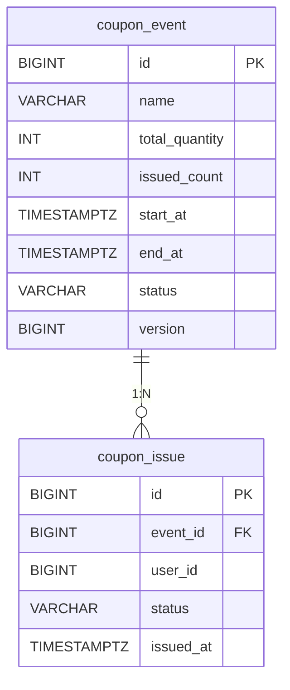
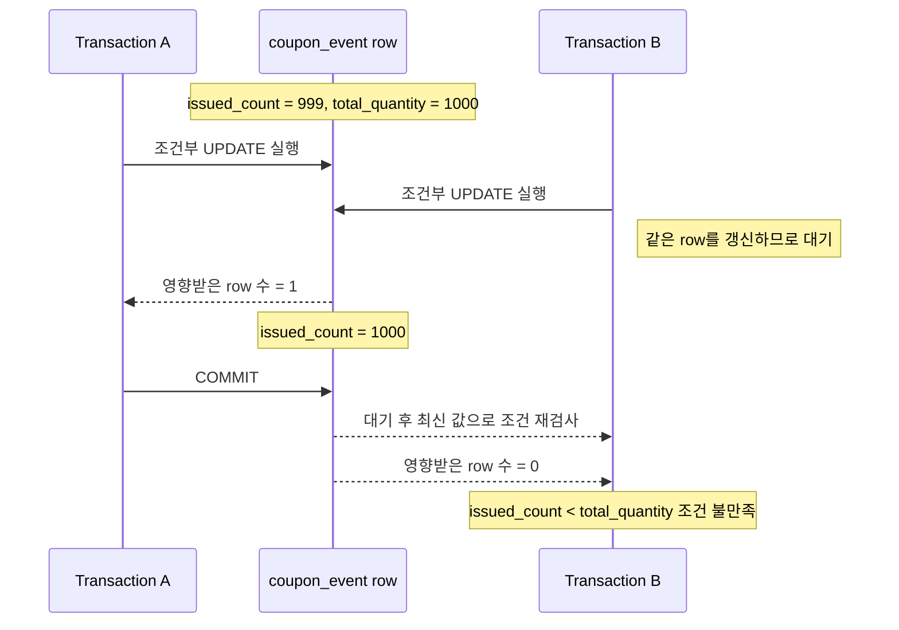
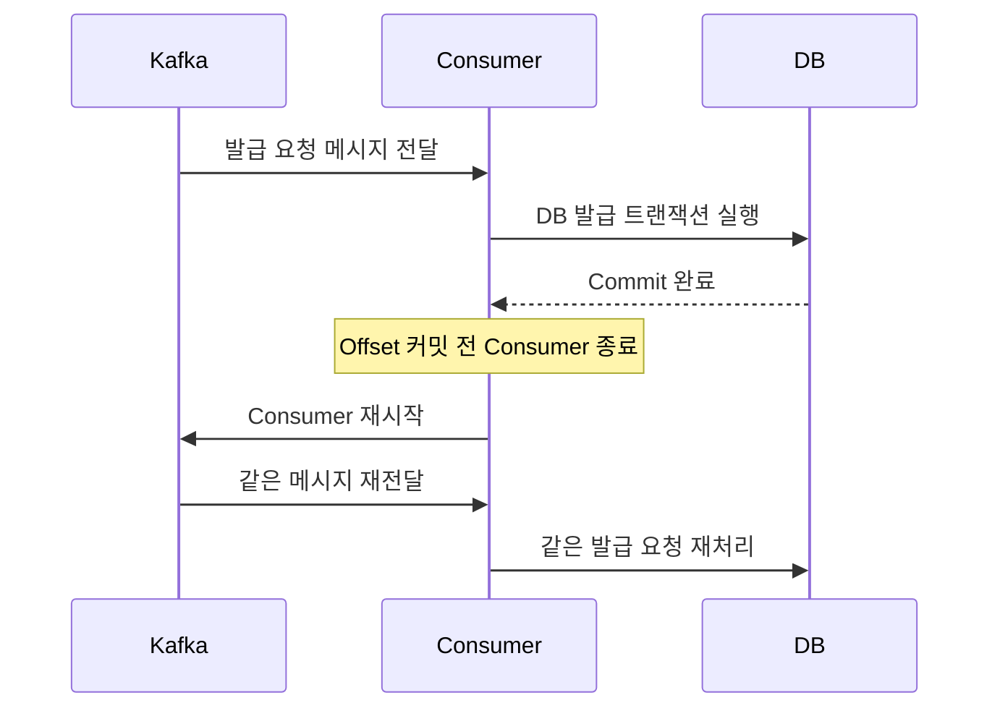

## **과제 1. DB 최종 발급 처리 구조 그리기**

Redis 판정을 통과한 요청이 Kafka를 거쳐 DB에 최종 저장되는 전체 구조를 작성한다.

반드시 아래 구성 요소를 포함해야 한다.

```
Client

API Server

Redis

Kafka

Coupon Issue Consumer

coupon_event

coupon_issue
```

### **1. 전체 요청 처리 흐름 다이어그램**

```mermaid
flowchart TD
    client["Client"]
    api["API Server"]
    redis["Redis"]
    kafka["Kafka"]
    consumer["Coupon Issue Consumer"]
    couponEvent[("coupon_event")]
    couponIssue[("coupon_issue")]

    client -->|"1. 쿠폰 발급 요청"| api
    api -->|"2. 인증 및 이벤트 기본 검증"| redis
    redis -->|"3. 중복 사용자 및 잔여 수량 원자적 판정"| api
    api -->|"4. 판정 통과 요청 발행"| kafka
    kafka -->|"5. 발급 요청 메시지 전달"| consumer
    consumer -->|"6. DB 트랜잭션으로 이벤트 수량 갱신"| couponEvent
    consumer -->|"7. DB 트랜잭션으로 발급 이력 저장"| couponIssue
```



### **2. Redis 판정 통과가 최종 발급 성공이 아닌 이유**

```text
Redis 판정 통과는 중복 사용자 및 잔여 수량 판정을 통과했다는 뜻으로, 최종 발급 성공이 아니다.
```

### **3. Kafka 메시지 발행 성공이 최종 발급 성공이 아닌 이유**

```text
Kafka 메시지 발행 성공은 Consumer가 처리할 메시지를 적재하는 데 성공했다는 뜻으로, 최종 발급 성공이 아니다.
```

### **4. 최종 발급 성공으로 판단할 수 있는 시점**

```text
DB 트랜잭션으로 이벤트 수량이 갱신되고, 발급 이력이 저장되었을 때 최종 발급 성공으로 판단할 수 있다.
```

### **5. Redis, Kafka, DB 단계의 상태 차이**

| **단계** | **의미**                   | **최종 발급 성공 여부** |
| --- |--------------------------|-----------------|
| Redis ACCEPTED | 선착순 판정을 통과했다.            | x               |
| Kafka PUBLISHED | 발급 요청 메시지가 Kafka에 저장되었다. | x               |
| DB ISSUED | 발급 기록 저장 트랜잭션이 커밋되었다.    | o               |

---

## **과제 2. DB가 보장해야 하는 불변식 정의하기**

쿠폰 발급 시스템이 장애와 동시 요청 상황에서도 지켜야 하는 조건을 불변식으로 정의한다.

이번 과제에서는 다음 세 가지 불변식을 기준으로 작성한다.

```text
불변식 1.

한 사용자는 하나의 이벤트에서
쿠폰을 최대 한 번만 발급받는다.

불변식 2.

발급 수량은 0보다 작거나
전체 수량보다 많을 수 없다.

불변식 3.

issued_count 증가와 coupon_issue 저장은
함께 성공하거나 함께 실패한다.
```

### **1. 불변식이 필요한 이유**

```text
쿠폰 발급 요청은 Redis와 Kafka를 거쳐 비동기로 처리된다.
그래서 중간 단계에서 성공했더라도 최종 발급까지 성공했다고 볼 수는 없다.

Consumer 장애, Kafka 메시지 중복 소비, Redis 데이터 유실,
애플리케이션 버그 등으로 같은 요청이 DB에 여러 번 도달하거나
동시에 여러 요청이 처리될 수 있다.

이런 상황에서도 사용자 중복 발급, 전체 수량 초과,
발급 수량과 발급 기록의 불일치가 발생하지 않도록
DB가 최종 방어선으로 불변식을 보장해야 한다.
```

### **2. 각 불변식이 깨졌을 때 발생하는 문제**

| **불변식** | **깨졌을 때 발생하는 문제** |
| --- |-------------------|
| 사용자별 최대 1회 발급 | 같은 사용자가 같은 이벤트 쿠폰을 여러 번 발급받는다. |
| 전체 수량 이하 발급 | 준비된 쿠폰 수량보다 많은 발급 기록이 생긴다. |
| 수량과 발급 기록의 동시 성공·실패 | issued_count와 coupon_issue 기록이 서로 어긋난다. |

### **3. 각 불변식을 보호하는 DB 장치**

| **불변식** | **DB 방어 장치** |
| --- | --- |
| 사용자 중복 발급 방지 | `UNIQUE(event_id, user_id)` |
| 전체 수량 초과 방지 | `issued_count < total_quantity` 조건부 `UPDATE`, 수량 `CHECK` |
| 두 테이블의 일관성 | 하나의 DB Transaction |

### **4. 애플리케이션에서 중복 여부를 먼저 조회하는 것만으로 불변식을 보장할 수 없는 이유**

```text
애플리케이션에서 먼저 중복 여부를 조회하더라도
동시에 들어온 요청까지 안전하게 막기는 어렵다.

같은 사용자의 요청 두 개가 거의 동시에 실행되면,
두 요청 모두 coupon_issue에 기존 발급 기록이 없다고 판단할 수 있다.
이후 둘 다 INSERT를 수행하면 같은 사용자에게 쿠폰이 중복 발급될 수 있다.

그래서 중복 발급 여부는 애플리케이션 조회만으로 판단하면 안 되고,
DB의 UNIQUE(event_id, user_id) 제약 조건으로 마지막에 한 번 더 막아야 한다.
```

---

## **과제 3. coupon_event와 coupon_issue 테이블 설계하기**

쿠폰 이벤트와 최종 발급 기록을 저장할 테이블을 설계한다.

완전한 운영용 스키마를 만드는 것이 목적은 아니다. 이번 주차에서 필요한 불변식을 지킬 수 있도록 핵심 컬럼과 제약 조건을 작성한다.

### **1. coupon_event 테이블의 역할**

```text
쿠폰 이벤트, 전체 수량, DB 기준 발급 수량을 저장한다.
```

### **2. coupon_issue 테이블의 역할**

```text
	어떤 사용자가 어떤 이벤트 쿠폰을 발급받았는지 저장한다.
```

### **3. 두 테이블의 관계를 다이어그램으로 표현하기**



### **4. coupon_event 테이블 DDL 작성하기**

아래 컬럼과 제약 조건을 포함한다.

```
id

name

total_quantity

issued_count

start_at

end_at

status

version (낙관적 락을 선택할 경우)

수량 CHECK 제약

이벤트 기간 CHECK 제약
```

```sql
CREATE TABLE coupon_event (
    id BIGSERIAL PRIMARY KEY,
    name VARCHAR(100) NOT NULL,
    total_quantity INT NOT NULL,
    issued_count INT NOT NULL DEFAULT 0,
    start_at TIMESTAMPTZ NOT NULL,
    end_at TIMESTAMPTZ NOT NULL,
    status VARCHAR(20) NOT NULL,
    version BIGINT NOT NULL DEFAULT 0,

    CONSTRAINT chk_coupon_event_quantity
        CHECK (
            total_quantity >= 0
            AND issued_count >= 0
            AND issued_count <= total_quantity
        ),

    CONSTRAINT chk_coupon_event_period
        CHECK (start_at < end_at),

    CONSTRAINT chk_coupon_event_status
        CHECK (status IN ('READY', 'OPEN', 'CLOSED'))
);
```

### **5. coupon_issue 테이블 DDL 작성하기**

아래 컬럼과 제약 조건을 포함한다.

```
id

event_id

user_id

status

issued_at

coupon_event를 참조하는 Foreign Key

동일 이벤트의 사용자 중복 발급을 막는 UNIQUE 제약
```

```sql
CREATE TABLE coupon_issue (
    id BIGSERIAL PRIMARY KEY,
    event_id BIGINT NOT NULL,
    user_id BIGINT NOT NULL,
    status VARCHAR(20) NOT NULL DEFAULT 'ISSUED',
    issued_at TIMESTAMPTZ NOT NULL DEFAULT CURRENT_TIMESTAMP,

    CONSTRAINT fk_coupon_issue_event
        FOREIGN KEY (event_id)
        REFERENCES coupon_event(id),

    CONSTRAINT chk_coupon_issue_status
        CHECK (status = 'ISSUED'),

    CONSTRAINT uk_coupon_issue_event_user
        UNIQUE (event_id, user_id)
);
```

### **6. issued_count를 coupon_event에 별도로 저장하는 이유와 단점**

```
coupon_issue 테이블을 매번 집계해도 발급 수량을 구할 수는 있다.
하지만 coupon_event에 issued_count를 따로 저장하면 남은 수량을 빠르게 판단할 수 있고,
DB 기준 발급 현황도 쉽게 확인할 수 있다.

또 Redis의 수량과 DB의 수량이 일시적으로 달라졌을 때
두 값을 비교해 불일치 여부를 확인하기도 좋다.
DB에서 issued_count < total_quantity 조건으로 UPDATE하면
전체 수량 초과 발급을 한 번 더 막을 수도 있다.

단점은 issued_count와 coupon_issue 기록이 서로 어긋날 수 있다는 점이다.
예를 들어 issued_count만 증가하고 coupon_issue 저장이 실패하면
수량은 줄었지만 실제 발급 기록은 없는 상태가 된다.
그래서 issued_count 증가와 coupon_issue 저장은 반드시 하나의 트랜잭션으로 묶어야 한다.
```

---

## **과제 4. UNIQUE 제약의 역할과 한계 분석하기**

`UNIQUE(event_id, user_id)`가 어떤 문제를 막고, 어떤 문제는 막지 못하는지 분석한다.

### **1. `UNIQUE(event_id, user_id)`가 의미하는 규칙**

```text
같은 사용자가 같은 이벤트 쿠폰을 한 번만 발급받을 수 있다.
```

### **2. 다음 INSERT의 성공 여부와 이유**

기존 데이터는 다음과 같다.

```
event_id = 100
user_id = 10
```

| **새로운 INSERT** | **성공 또는 실패** | **이유**                  |
| --- |--------------|-------------------------|
| event_id=100, user_id=10 | 실패           | 동일한 쿠폰 발급 기록이 존재한다.     |
| event_id=100, user_id=11 | 성공           | 동일한 쿠폰 발급 기록이 존재하지 않는다. |
| event_id=101, user_id=10 | 성공           | 동일한 쿠폰 발급 기록이 존재하지 않는다. |

### **3. 중복 여부를 SELECT한 뒤 INSERT하는 방식의 Race Condition**

아래 상황을 시간 순서로 표현한다.

```
Transaction A가 user:10의 발급 기록을 조회한다.

Transaction B도 user:10의 발급 기록을 조회한다.

두 트랜잭션 모두 아직 발급 기록이 없다고 판단한다.

두 트랜잭션이 동시에 INSERT를 시도한다.
```

답변:

```text
1. Transaction A가 user_id=10의 발급 기록을 SELECT한다.
   → 기존 발급 기록 없음

2. Transaction B가 user_id=10의 발급 기록을 SELECT한다.
   → 기존 발급 기록 없음

3. Transaction A가 coupon_issue에 INSERT한다.
   → INSERT 성공

4. Transaction B가 coupon_issue에 INSERT한다.
   → INSERT 성공

5. 같은 user_id=10에 대해 발급 기록이 2개 생긴다.
   → 중복 발급 발생
```

### **4. UNIQUE 제약이 전체 수량 초과를 막을 수 없는 이유**

아래 상황을 기준으로 설명한다.

```
전체 수량: 1,000개

서로 다른 사용자: 1,001명

모든 (event_id, user_id) 조합은 서로 다름
```

```text
모든 (event_id, user_id) 조합이 다르기 때문에 DB에 모두 저장된다.
최종적으로 전체 수량은 1,000개이지만, 발급된 수량은 1,001개가 된다.
```

### **5. 사용자 중복과 전체 수량 초과를 각각 어떤 장치로 막아야 하는가?**

| **문제** | **DB 방어 장치**                                             |
| --- |----------------------------------------------------------|
| 같은 사용자의 중복 발급 | `UNIQUE(event_id, user_id)`                              |
| 서로 다른 사용자에 의한 전체 수량 초과 | `issued_count < total_quantity` 조건부 `UPDATE`, 수량 `CHECK` |

---

## **과제 5. 조건부 UPDATE로 전체 수량 초과 방지하기**

쿠폰 수량이 남아 있을 때만 `issued_count`를 증가시키는 조건부 UPDATE를 설계한다.

### **1. 조건부 UPDATE SQL 작성하기**

다음 조건을 만족해야 한다.

```
event_id가 일치해야 한다.

issued_count가 total_quantity보다 작을 때만 증가해야 한다.

issued_count는 1 증가해야 한다.
```

```sql
UPDATE coupon_event
SET issued_count = issued_count + 1,
    updated_at = CURRENT_TIMESTAMP
WHERE id = :eventId
  AND issued_count < total_quantity;
```

### **2. 영향받은 row 수가 의미하는 것**

```text
쿠폰 발급이 성공했는지 여부를 의미한다.
```

### **3. 영향받은 row 수가 1인 경우**

```text
쿠폰 발급이 성공했다.
```

### **4. 영향받은 row 수가 0인 경우 가능한 원인**

과제 5-1의 SQL은 `event_id`와 수량 조건만 사용한다. 중복 메시지 여부는 UPDATE 결과가 0인 직접 원인이 아니라, 이후 기존 발급 기록을 조회해 구분한다.

```text
1. 쿠폰 중복 발급

2. 잔여 수량이 없거나 이벤트가 존재하지 않음
```

### **5. 다음 상황에서 UPDATE 결과를 작성하기**

과제 5-1에서 작성한 조건부 UPDATE를 사용한다고 가정한다.

| **상황** | **issued_count** | **total_quantity** | **이벤트 존재 여부** | **영향받은 row 수** | **결과** |
| --- | --- | --- | --- |----------------|--------|
| A | 999 | 1,000 | 존재 | 1              | 성공     |
| B | 1,000 | 1,000 | 존재 | 0              | 실패     |
| C | - | - | 존재하지 않음 | 0              | 실패     |

### **6. 두 트랜잭션이 동시에 마지막 수량을 증가시키는 상황 분석**

```
전체 수량: 1,000개

현재 issued_count: 999

Transaction A와 Transaction B가
동시에 조건부 UPDATE 실행
```

두 트랜잭션의 실행 결과를 시간 순서 다이어그램으로 작성한다.



### **7. issued_count가 total_quantity를 초과하지 않는 이유**

```text
조건부 UPDATE는 issued_count를 증가시키기 전에
issued_count < total_quantity 조건을 함께 검사한다.

두 트랜잭션이 동시에 마지막 수량을 발급하려고 해도
DB는 같은 coupon_event row에 대한 UPDATE를 동시에 반영하지 않고 순서대로 처리한다.

먼저 실행된 트랜잭션이 issued_count를 999에서 1000으로 증가시키면,
뒤늦게 실행되는 트랜잭션은 최신 값인 1000을 기준으로 조건을 다시 검사한다.
이때 issued_count < total_quantity 조건이 false가 되므로 UPDATE가 실패한다.

그래서 issued_count는 total_quantity를 초과하지 않는다.
```

---

## **과제 6. 발급 트랜잭션과 Rollback 설계하기**

다음 두 작업을 하나의 DB 트랜잭션으로 묶는 이유를 설명한다.

```
1. coupon_event.issued_count 증가

2. coupon_issue 발급 기록 INSERT
```

### **1. 두 작업을 서로 다른 트랜잭션으로 처리했을 때 발생할 수 있는 문제**

| **상황** | **발생하는 데이터 불일치**         |
| --- |--------------------------|
| issued_count 증가 성공, coupon_issue INSERT 실패 | 수량은 줄었지만, 발급받은 사용자가 없음   |
| coupon_issue INSERT 성공, issued_count 증가 실패 | 발급 사용자는 있지만, 수량에 반영되지 않음 |

### **2. 하나의 트랜잭션으로 처리하는 전체 흐름**

```text
Transaction 시작
  |
  v
조건부 UPDATE로 수량 확보
  |
  +-- 결과 = 0
  |     → 기존 coupon_issue 기록 조회
  |     → 중복 메시지와 실제 발급 실패 구분
  |
  +-- 결과 = 1
        |
        v
      coupon_issue INSERT
        |
        +-- 성공 → Commit
        |
        +-- 실패 → Rollback
```

### **3. 다음 SQL을 하나의 트랜잭션 흐름으로 완성하기**

```sql
BEGIN;

-- 1. 수량이 남아 있을 때만 issued_count 증가
UPDATE coupon_event
SET issued_count = issued_count + 1
WHERE id = :eventId
  AND issued_count < total_quantity;

-- UPDATE 결과가 0이면 ROLLBACK 후 종료
-- UPDATE 결과가 1이면 아래 INSERT 실행

-- 2. UPDATE 결과가 1이면 발급 기록 INSERT
INSERT INTO coupon_issue (
    event_id,
    user_id,
    status,
    issued_at
) VALUES (
    :eventId,
    :userId,
    'ISSUED',
    CURRENT_TIMESTAMP
);

-- 두 작업이 모두 성공하면 Commit
COMMIT;

-- UPDATE 결과가 0이거나 INSERT가 실패하면 Rollback
ROLLBACK;
```

### **4. UPDATE 성공 후 INSERT에서 UNIQUE 위반이 발생한 경우**

아래 항목을 모두 설명한다.

```
현재 트랜잭션은 어떻게 되는가?

앞에서 증가한 issued_count는 어떻게 되는가?

기존 발급 기록은 언제 조회해야 하는가?
```

답변:

```text
현재 트랜잭션은 ROLLBACK된다.
그에 따라 앞에서 증가한 issued_count는 기존 수량이 된다.
기존 발급 기록은 트랜잭션이 ROLLBACK된 후에 조회해야 한다.
```

### **5. PostgreSQL에서 제약 조건 위반 후 같은 트랜잭션을 계속 사용할 수 없는 이유**

```text
PostgreSQL에서는 UNIQUE 제약 위반 같은 오류가 발생하면
현재 트랜잭션이 실패 상태가 된다.

따라서 같은 트랜잭션을 계속 사용하지 않고,
먼저 Rollback한 뒤 새 트랜잭션에서 기존 발급 기록을 조회해야 한다.
```

### **6. 모든 발급 경로가 같은 트랜잭션을 사용해야 하는 이유**

```text
발급 경로마다 트랜잭션 처리 방식이 다르면
issued_count 증가와 coupon_issue 저장이 서로 어긋날 수 있다.

어떤 경로로 발급되더라도 두 작업은 함께 성공하거나 함께 실패해야 하므로
모든 발급 경로가 같은 트랜잭션 규칙을 사용해야 한다.
```

---

## **과제 7. Kafka 중복 소비와 DB 중복 발급 방지 설계하기**

Kafka Consumer는 같은 메시지를 다시 처리할 수 있다.

아래 상황을 기준으로 분석한다.

```
1. Consumer가 발급 요청 메시지를 읽는다.

2. DB 발급 트랜잭션을 Commit한다.

3. Consumer Group Offset 커밋 전에 Consumer가 종료된다.

4. Consumer가 재시작된다.

5. 같은 메시지를 다시 읽는다.
```

### **1. 중복 소비가 발생하는 전체 흐름 다이어그램**



### **2. DB에 UNIQUE 제약이 없다면 발생하는 문제**

```
같은 Kafka 메시지가 다시 처리되면
Consumer가 같은 event_id와 user_id로 coupon_issue INSERT를 다시 시도할 수 있다.

DB에 UNIQUE(event_id, user_id) 제약이 없다면
이미 발급된 사용자에게 같은 이벤트 쿠폰이 한 번 더 저장되어
중복 발급 기록이 생긴다.
```

### **3. `UNIQUE(event_id, user_id)`가 중복 소비를 방어하는 과정**

```
재처리된 메시지가 같은 event_id와 user_id로 INSERT를 시도하면
DB의 UNIQUE(event_id, user_id) 제약이 이미 존재하는 발급 기록과 충돌을 감지한다.

이때 INSERT는 실패하고, 같은 사용자가 같은 이벤트 쿠폰을
두 번 발급받는 것을 막을 수 있다.
```

### **4. UNIQUE 위반을 단순 장애가 아니라 이미 처리된 메시지로 판단하기 위한 조건**

```
UNIQUE 위반이 발생한 뒤 기존 coupon_issue 기록을 조회했을 때,
같은 event_id와 user_id를 가진 발급 기록이 이미 존재해야 한다.

이 기록이 존재하면 같은 메시지가 다시 처리된 것으로 보고
이미 처리된 메시지로 정상 처리할 수 있다.
```

### **5. 제약 위반 후 Consumer가 수행해야 하는 처리 순서**

```
1. 현재 트랜잭션을 Rollback한다.

2. 새 트랜잭션에서 같은 event_id와 user_id의 coupon_issue 기록을 조회한다.

3. 기존 기록이 있으면 이미 처리된 메시지로 판단한다.

4. 기존 기록이 없으면 수량 초과 / 이벤트 없음 등 알맞게 처리한다.

5. 이미 처리된 메시지로 확인된 경우 메시지 처리를 완료하고 Consumer Group Offset을 커밋한다.
```

### **6. DB 처리보다 Consumer Group Offset이 먼저 커밋되면 안 되는 이유**

```
Offset을 먼저 커밋하면 Kafka는 해당 메시지가 처리되었다고 판단한다.

그 뒤 DB 발급 트랜잭션이 실패하거나 Consumer가 종료되면
메시지를 다시 읽지 못해 실제 DB에는 발급 기록이 저장되지 않을 수 있다.

따라서 DB 처리 결과가 확정된 뒤 Offset을 커밋해야 한다.
```

### **7. `UNIQUE(event_id, user_id)`와 requestId 기반 멱등성의 차이**

```
UNIQUE(event_id, user_id)는 같은 사용자가 같은 이벤트 쿠폰을
두 번 발급받지 못하게 막는 DB 제약이다.

requestId 기반 멱등성은 같은 요청 자체를 식별해서
그 요청이 이미 처리되었는지, 어떤 결과로 끝났는지를 관리하는 방식이다.

즉 UNIQUE 제약은 사용자 중복 발급을 막고,
requestId는 요청 단위의 중복 처리와 처리 결과 재사용을 다룬다.
```

---

## **과제 8. 품절 후 중복 메시지 재처리 분석하기**

조건부 UPDATE를 먼저 실행하는 구조에서는 중복 메시지가 항상 INSERT까지 도달하는 것은 아니다.

아래 상황을 기준으로 분석한다.

```
이벤트 ID: 100

전체 수량: 1개

현재 issued_count: 1

coupon_issue에
(event_id=100, user_id=10) 기록이 이미 존재

user:10의 Kafka 메시지가 다시 전달됨
```

### **1. 조건부 UPDATE 결과와 그 이유**

```text
issued_count < total_quantity 조건을 충족하지 못하므로 실패한다.
```

### **2. coupon_issue INSERT까지 실행되는가?**

```text
실행되지 않는다.
```

### **3. 이 상황에서 UNIQUE 제약 위반이 발생하는가?**

```text
발생하지 않는다.
```

### **4. 영향받은 row 수가 0이라고 무조건 품절로 판단하면 안 되는 이유**

```text
이벤트가 존재하지 않을 수 있기 때문이다.
```

### **5. 기존 coupon_issue 기록을 추가로 확인해야 하는 이유**

```text
기존 coupon_issue 기록이 존재한다면 중복 발급이고,
존재하지 않는다면 품절이나 이벤트가 존재하지 않는다.
```

### **6. 다음 두 상황을 구분하는 처리 흐름 작성하기**

각 상황에서 메시지 처리 완료 여부와 Consumer Group Offset 커밋 여부도 함께 작성한다.

```
상황 A

조건부 UPDATE 결과 = 0
동일한 coupon_issue 기록 존재

상황 B

조건부 UPDATE 결과 = 0
동일한 coupon_issue 기록 없음
```

답변:

```text
상황 A:
기존 발급 기록이 있으므로 이미 처리된 중복 메시지로 본다.
메시지 처리를 완료하고 Offset을 커밋한다.

상황 B:
기존 발급 기록이 없으므로 실제 수량 소진 또는 이벤트 없음으로 본다.
실패 처리를 남기고 메시지 처리를 완료한 뒤 Offset을 커밋한다.
```

### **7. 전체 Consumer 처리 흐름 완성하기**

아래 두 경로를 모두 포함해야 한다.

```
조건부 UPDATE 결과 = 0인 경로

조건부 UPDATE 결과 = 1인 경로
```

```text
조건부 UPDATE
  |
  +-- 결과 = 0
  |     |
  |     v
  |   동일한 coupon_issue 기록 조회
  |     |
  |     +-- 기록 존재
  |     |     → 이미 처리된 메시지로 정상 처리
  |     |
  |     +-- 기록 없음
  |           → 이벤트 없음 또는 수량 소진으로 처리
  |           → 로그·메트릭을 남기고 메시지 처리 완료
  |           → 불일치 복구는 별도 절차로 수행
  |
  +-- 결과 = 1
        |
        v
      coupon_issue INSERT
        |
        +-- 성공
        |     → 트랜잭션 Commit
        |     → 메시지 처리 완료
        |
        +-- UNIQUE 위반
              → 현재 트랜잭션 Rollback
              → 새 트랜잭션에서 기존 기록 조회
              → 기록 존재 시 중복 메시지로 정상 처리
              → 기록이 없으면 예상하지 못한 오류로 처리
```

---

## **과제 9. DB 동시성 제어 방식 비교하기**

다음 세 가지 방식으로 쿠폰 수량을 제어할 수 있다.

```
조건부 UPDATE

비관적 락

낙관적 락
```

### **1. 조건부 UPDATE 방식 설명**

```
수량 확인과 issued_count 증가를 하나의 UPDATE SQL로 처리하는 방식이다.
issued_count < total_quantity 조건을 만족할 때만 증가하므로
영향받은 row 수로 수량 확보 성공 여부를 판단할 수 있다.
```

### **2. 비관적 락 방식 설명과 SQL 예시**

```sql
SELECT *
FROM coupon_event
WHERE id = :eventId
FOR UPDATE;

UPDATE coupon_event
SET issued_count = issued_count + 1
WHERE id = :eventId;
```

설명:

```
이벤트 row를 먼저 잠근 뒤 수량을 확인하고 발급하는 방식이다.
락을 얻은 트랜잭션만 해당 row를 수정할 수 있으므로 정합성을 이해하기 쉽다.

다만 요청이 몰리면 다른 트랜잭션들이 락을 기다려야 해서
대기 시간이 길어지고 처리량이 떨어질 수 있다.
```

### **3. 낙관적 락 방식 설명과 SQL 예시**

```sql
UPDATE coupon_event
SET issued_count = issued_count + 1,
    version = version + 1
WHERE id = :eventId
  AND version = :oldVersion
  AND issued_count < total_quantity;

```

설명:

```
처음부터 row를 잠그지 않고, UPDATE 시점에 version 값이 그대로인지 확인하는 방식이다.
읽었던 version과 현재 version이 다르면 다른 트랜잭션이 먼저 수정한 것이므로 UPDATE가 실패한다.

충돌이 적을 때는 락 대기를 줄일 수 있지만,
선착순 이벤트처럼 하나의 row에 요청이 몰리면 충돌과 재시도가 많아질 수 있다.
```

### **4. 세 방식 비교표**

| **구분** | **조건부 UPDATE** | **비관적 락** | **낙관적 락** |
| --- | --- | --- | --- |
| 수량을 보호하는 방법 | 조건을 만족할 때만 issued_count 증가 | row를 먼저 잠근 뒤 수량 확인 | version이 같은 경우에만 수정 |
| 충돌 시 동작 | 나중 요청은 영향받은 row 수 0 | 나중 요청은 락 대기 | version 불일치로 UPDATE 실패 |
| 재시도 필요 여부 | 보통 불필요 | 보통 불필요 | 충돌 시 재시도 필요 |
| 장점 | SQL 하나로 단순하게 처리 가능 | 처리 순서와 정합성을 이해하기 쉬움 | 충돌이 적으면 락 대기를 줄일 수 있음 |
| 단점 | 같은 row에 UPDATE가 집중됨 | 락 대기 시간이 길어질 수 있음 | 요청이 몰리면 재시도가 많아짐 |
| 선착순 이벤트 적합성 | 적합 | 가능하지만 처리량 저하 가능 | 충돌이 많아 불리할 수 있음 |

### **5. 하나의 이벤트 row에 요청이 집중될 때 발생하는 문제**

```
많은 요청이 같은 coupon_event row의 issued_count를 수정하려고 하므로
DB 내부에서 row lock 대기가 발생할 수 있다.

요청이 많아질수록 같은 row를 순서대로 갱신해야 해서
처리 지연이 생기고 DB 부하가 커질 수 있다.
```

### **6. 이번 구조에서 조건부 UPDATE를 선택하는 이유**

```
Redis에서 대부분의 중복 요청과 수량 초과 요청을 먼저 걸러내고,
DB는 최종 방어선 역할을 한다.

이 구조에서는 조건부 UPDATE만으로 남은 수량 확인과 증가를
하나의 SQL에서 처리할 수 있고,
영향받은 row 수로 성공 여부도 바로 판단할 수 있다.

따라서 UNIQUE 제약과 Transaction을 함께 사용하면
사용자 중복 발급, 전체 수량 초과, 두 테이블의 불일치를 함께 막을 수 있다.
```

### **7. 세 방식과 UNIQUE 제약의 역할이 다른 이유**

```
조건부 UPDATE, 비관적 락, 낙관적 락은 모두 전체 수량을 넘지 않도록
coupon_event의 issued_count 변경을 제어하는 방식이다.

반면 UNIQUE(event_id, user_id)는 coupon_issue에서
같은 사용자가 같은 이벤트 쿠폰을 두 번 발급받지 못하게 막는 제약이다.

즉 동시성 제어 방식은 수량 초과를 막고,
UNIQUE 제약은 사용자 중복 발급을 막는다.
```

---

## **과제 10. Redis, Kafka, DB 불일치 상황과 이후 주차 연결하기**

Redis, Kafka, DB는 서로 다른 시스템이므로 상태가 일시적으로 달라질 수 있다.

Kafka 상태는 발행된 레코드의 존재 여부와 Consumer Group Offset 커밋 여부를 구분해서 작성한다. Kafka 레코드가 존재한다는 사실만으로 처리 대기 상태라고 판단하지 않는다.

### **1. Redis 통과 후 Kafka 발행 실패 상황**

아래 세 시스템에 남는 상태를 작성한다.

| **시스템** | **남아 있는 상태** |
| --- | --- |
| Redis | 사용자가 통과 사용자 Set에 존재 |
| Kafka | 발행 실패로 레코드 없음 |
| DB | 발급 기록 없음 |

### **2. Kafka 발행 후 DB 저장 실패 상황**

| **시스템** | **남아 있는 상태** |
| --- | --- |
| Redis | 통과 기록 존재 |
| Kafka | 발행된 레코드 존재, Consumer Group Offset 미커밋 |
| DB | 발급 기록 없음 |

### **3. DB 저장 후 Redis 데이터 유실 상황**

| **시스템** | **남아 있는 상태** |
| --- | --- |
| Redis | 통과 기록 없음 |
| DB | 발급 기록 존재 |

### **4. 최종 발급 여부를 판단할 때 DB를 기준으로 해야 하는 이유**

```
Redis는 빠른 선착순 판정을 위한 상태이고,
Kafka는 발급 요청 메시지를 전달하는 역할을 한다.

최종 발급 성공은 coupon_issue 발급 기록이 DB 트랜잭션으로 커밋된 상태를 의미한다.
따라서 최종 발급 여부는 DB의 coupon_issue 기록을 기준으로 판단해야 한다.
```

### **5. Redis, Kafka, DB의 역할 비교표**

| **구분** | **Redis** | **Kafka** | **DB** |
| --- | --- | --- | --- |
| 주 역할 | 빠른 선착순 판정 | 발급 요청 메시지 전달 | 최종 발급 기록 저장 |
| 저장하는 상태 | 통과 사용자, 잔여 수량 | 발행된 레코드, Consumer Group Offset | coupon_event, coupon_issue |
| 성공이 의미하는 것 | Redis 기준 판정 통과 | 메시지가 Kafka에 저장됨 | 발급 기록 트랜잭션 Commit |
| 강점 | 빠른 처리와 원자적 판정 | 비동기 전달과 재처리 가능 | 제약 조건과 트랜잭션으로 최종 정합성 보장 |
| 한계 | 최종 발급 기록이 아님 | 레코드 존재만으로 처리 완료를 알 수 없음 | 상대적으로 느리고 부하가 집중될 수 있음 |

### **6. 5주차 requestId 기반 멱등성에서 해결할 문제**

```
UNIQUE(event_id, user_id)는 같은 사용자의 중복 발급을 막지만,
같은 요청 자체가 어떤 상태로 처리되었는지는 관리하지 못한다.

5주차의 requestId 기반 멱등성에서는 동일 요청을 식별하고,
이미 처리된 요청의 상태와 결과를 재사용하는 문제를 다룬다.
```

### **7. 6주차 Outbox Pattern에서 해결할 문제**

```
DB 저장 이후 다른 서비스로 이벤트를 발행해야 할 때,
DB Commit과 후속 이벤트 발행이 서로 어긋날 수 있다.

6주차의 Outbox Pattern에서는 DB 저장과 이벤트 발행 사이의 정합성을
안전하게 맞추는 문제를 다룬다.
```

### **8. Outbox Pattern이 Redis 판정과 최초 Kafka 발행 사이를 원자적으로 묶어주는 것은 아닌 이유**

```
Outbox Pattern은 보통 DB 트랜잭션 안에 저장된 변경 사항과
후속 이벤트 발행을 연결하기 위한 방식이다.

하지만 Redis 판정과 최초 Kafka 발행은 DB 트랜잭션 안에서 함께 커밋되는 작업이 아니다.
Redis와 Kafka는 서로 다른 시스템이므로 Outbox Pattern만으로
Redis 판정과 최초 Kafka 발행을 원자적으로 묶을 수는 없다.
```

### **9. 8주차 Retry와 DLQ에서 해결할 문제**

```
일시적인 DB 오류나 Consumer 처리 실패처럼 재시도로 해결될 수 있는 문제는
Retry 정책으로 다시 처리해야 한다.

반대로 계속 실패하는 메시지는 무한히 재시도하지 않고 DLQ로 보내
나중에 원인을 분석하고 복구할 수 있어야 한다.

8주차에서는 실패 메시지 처리와 Redis-DB 불일치 복구 문제를 다룬다.
```

---
