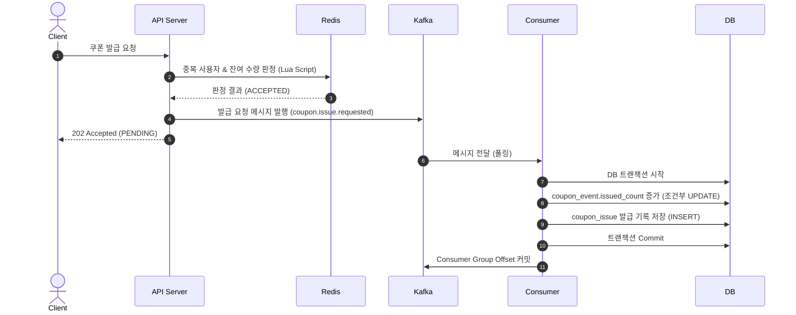
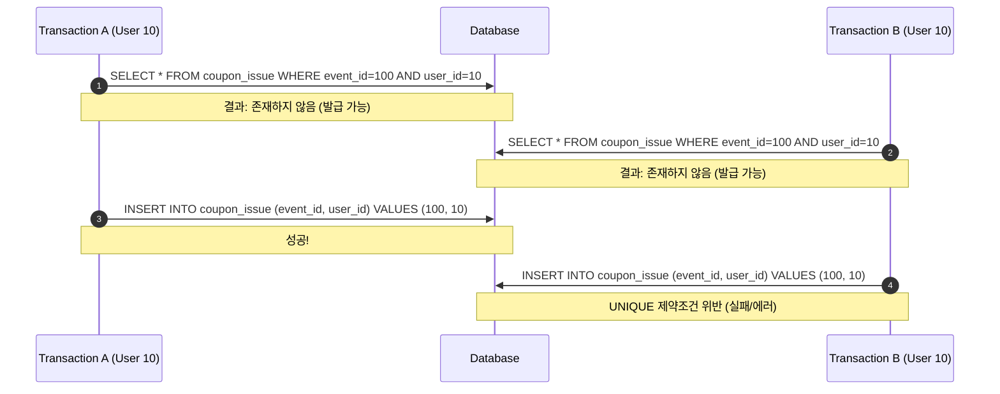
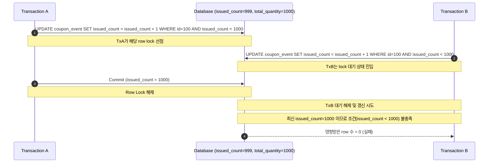
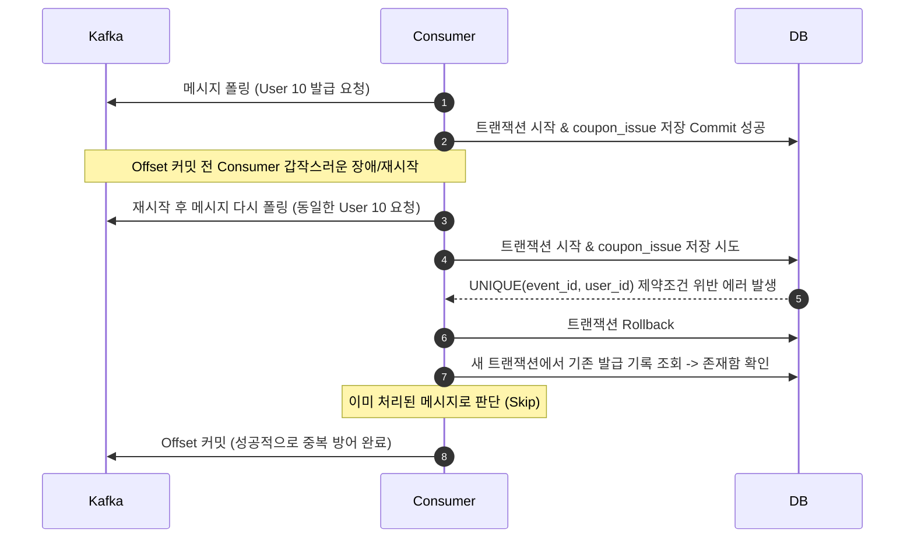

# [Week 4] DB 테이블 설계와 최종 정합성 보장 - 13기 우재원

---

## 과제 1. DB 최종 발급 처리 구조 그리기

### 1. 전체 요청 처리 흐름 다이어그램

#### [시퀀스 다이어그램]


---

### 2. Redis 판정 통과가 최종 발급 성공이 아닌 이유

Redis 판정 통과 이후에 Kafka 발행이 실패할 수 있으며, Kafka 메시지를 처리하던 Consumer가 중간에 실패하거나 데이터베이스 장애로 최종 저장이 되지 않을 위험이 항상 존재하기 때문입니다. Redis는 선착순 진입 자격 검증용 필터일 뿐, 영구적인 데이터 적재를 보장하는 최종 저장소가 아닙니다.

---

### 3. Kafka 메시지 발행 성공이 최종 발급 성공이 아닌 이유

Kafka는 발급 요청 메시지를 Consumer에게 전달하는 역할을 수행할 뿐입니다. Consumer가 메시지를 정상적으로 읽은 뒤, 실제 DB 트랜잭션을 통해 최종 데이터를 기록하고 성공적으로 커밋하는 과정에서 예외나 에러가 발생할 수 있기 때문입니다.

---

### 4. 최종 발급 성공으로 판단할 수 있는 시점

Consumer가 처리한 발급 기록 저장 트랜잭션이 DB에 최종 커밋(`Commit`)된 시점입니다.

---

### 5. Redis, Kafka, DB 단계의 상태 차이

| 단계 | 의미 | 최종 발급 성공 여부 |
| :--- | :--- | :---: |
| **Redis ACCEPTED** | Redis 기준으로 선착순 판정을 통과했다. | X (최종 성공 아님) |
| **Kafka PUBLISHED** | 발급 요청 메시지가 Kafka에 저장되었다. | X (최종 성공 아님) |
| **DB ISSUED** | 발급 기록 저장 트랜잭션이 커밋되었다. | O (최종 발급 성공) |

---

## 과제 2. DB가 보장해야 하는 불변식 정의하기

### 1. 불변식이 필요한 이유

불변식은 시스템 장애나 수많은 동시 요청 상황에서도 시스템이 반드시 지켜야 하는 핵심 비즈니스 규칙이자 무결성 조건입니다. 애플리케이션의 사전 조회나 Redis 판정만으로는 분산 시스템 특유의 데이터 유실, 중복 소비 등으로 인한 정합성 파괴를 완벽히 막을 수 없으므로 DB를 최종 방어선으로 삼아 불변식을 보호해야 합니다.

---

### 2. 각 불변식이 깨졌을 때 발생하는 문제

| 불변식 | 깨졌을 때 발생하는 문제 |
| :--- | :--- |
| **사용자별 최대 1회 발급** | 한 명의 사용자가 같은 이벤트의 쿠폰을 여러 번 중복 수령하여 이벤트의 공정성이 훼손됩니다. |
| **전체 수량 이하 발급** | 준비된 쿠폰 개수를 초과하여 초과 발급이 발생하며, 이는 기업에 예상치 못한 비용 손실을 유발합니다. |
| **수량과 발급 기록의 동시 성공·실패** | 발급 수량(issued_count)은 증가했으나 사용자 발급 기록(coupon_issue)이 없거나, 반대로 기록은 있으나 수량에 반영되지 않는 데이터 불일치가 발생합니다. |

---

### 3. 각 불변식을 보호하는 DB 장치

| 불변식 | DB 방어 장치 |
| :--- | :--- |
| **사용자 중복 발급 방지** | `UNIQUE(event_id, user_id)` 제약 조건 |
| **전체 수량 초과 방지** | 조건부 `UPDATE` 쿼리 및 수량 `CHECK` 제약 조건 |
| **두 테이블의 일관성** | DB Transaction (트랜잭션 묶음 처리) |

---

### 4. 애플리케이션에서 중복 여부를 먼저 조회하는 것만으로 불변식을 보장할 수 없는 이유

동시 요청 상황에서 여러 트랜잭션이 동시에 발급 이력을 조회(`SELECT`)하면, 모든 트랜잭션이 기존 기록이 없는 것으로 판단하여 동시에 `INSERT`를 시도하게 됩니다. 이로 인해 동일 사용자에 대해 중복 발급이 이루어지는 Race Condition이 발생하므로 DB 자체 제약조건이 필수적입니다.

---

## 과제 3. coupon_event와 coupon_issue 테이블 설계하기

### 1. coupon_event 테이블의 역할

쿠폰 이벤트 자체의 메타데이터(이름, 기간, 상태 등)와 전체 허용 수량, 그리고 DB 기준의 최종 발급 수량(`issued_count`)을 관리하고 보호하는 역할을 담당합니다.

---

### 2. coupon_issue 테이블의 역할

어떤 사용자가 어떤 이벤트 쿠폰을 성공적으로 발급받았는지, 최종 발급에 성공한 사용자별 상세 기록을 저장하는 역할을 합니다.

---

### 3. 두 테이블의 관계를 다이어그램으로 표현하기


---

### 4. coupon_event 테이블 DDL 작성하기

```sql
CREATE TABLE coupon_event (
    id BIGSERIAL PRIMARY KEY,
    name VARCHAR(100) NOT NULL,
    total_quantity INT NOT NULL,
    issued_count INT NOT NULL DEFAULT 0,
    start_at TIMESTAMPTZ NOT NULL,
    end_at TIMESTAMPTZ NOT NULL,
    status VARCHAR(20) NOT NULL,
    version BIGINT NOT NULL DEFAULT 0,
    created_at TIMESTAMPTZ NOT NULL DEFAULT CURRENT_TIMESTAMP,
    updated_at TIMESTAMPTZ NOT NULL DEFAULT CURRENT_TIMESTAMP,

    CONSTRAINT chk_coupon_event_quantity
        CHECK (
            total_quantity >= 0
            AND issued_count >= 0
            AND issued_count <= total_quantity
        ),
    CONSTRAINT chk_coupon_event_period
        CHECK (start_at < end_at),
    CONSTRAINT chk_coupon_event_status
        CHECK (status IN ('READY', 'OPEN', 'CLOSED'))
);
```

---

### 5. coupon_issue 테이블 DDL 작성하기

```sql
CREATE TABLE coupon_issue (
    id BIGSERIAL PRIMARY KEY,
    event_id BIGINT NOT NULL,
    user_id BIGINT NOT NULL,
    status VARCHAR(20) NOT NULL DEFAULT 'ISSUED',
    issued_at TIMESTAMPTZ NOT NULL DEFAULT CURRENT_TIMESTAMP,
    created_at TIMESTAMPTZ NOT NULL DEFAULT CURRENT_TIMESTAMP,
    updated_at TIMESTAMPTZ NOT NULL DEFAULT CURRENT_TIMESTAMP,

    CONSTRAINT fk_coupon_issue_event
        FOREIGN KEY (event_id)
        REFERENCES coupon_event(id),
    CONSTRAINT chk_coupon_issue_status
        CHECK (status = 'ISSUED'),
    CONSTRAINT uk_coupon_issue_event_user
        UNIQUE (event_id, user_id)
);
```

---

### 6. issued_count를 coupon_event에 별도로 저장하는 이유와 단점

* **저장 이유:**
  1. 남은 수량 및 DB 발급 현황을 파악할 때 `coupon_issue` 테이블을 매번 대량 집계(`COUNT`)하는 무거운 통계 쿼리 없이 즉시 판단할 수 있습니다.
  2. DB 단에서 조건부 업데이트를 통해 수량 초과를 손쉽게 방어할 수 있습니다.
* **단점:**
  1. `issued_count` 수량과 실제 `coupon_issue` 발급 기록 행 수가 서로 어긋나지 않도록 반드시 하나의 DB 트랜잭션으로 묶어 강한 일관성을 확보해야 합니다.
  2. 동일한 이벤트 row에 업데이트 연산이 집중되어 병목이나 락 경합이 발생할 수 있습니다.

---

## 과제 4. UNIQUE 제약의 역할과 한계 분석하기

### 1. UNIQUE(event_id, user_id)가 의미하는 규칙

특정 이벤트(`event_id`) 내에서 동일한 사용자(`user_id`)는 단 한 개의 발급 레코드만 가질 수 있도록 제한하여, 중복 발급을 차단하는 규칙입니다.

---

### 2. 다음 INSERT의 성공 여부와 이유

(기존 데이터: `event_id = 100`, `user_id = 10` 존재)

| 새로운 INSERT | 성공 또는 실패 | 이유 |
| :--- | :--- | :--- |
| `event_id=100, user_id=10` | 실패 | 이미 동일한 `(100, 10)` 조합이 존재하므로 UNIQUE 제약 조건을 위반합니다. |
| `event_id=100, user_id=11` | 성공 | 새로운 `user_id` 조합이므로 정상적으로 삽입됩니다. |
| `event_id=101, user_id=10` | 성공 | 다른 이벤트(`event_id=101`)에 대한 요청이므로 유효한 조합입니다. |

---

### 3. 중복 여부를 SELECT한 뒤 INSERT하는 방식의 Race Condition

#### [시퀀스 다이어그램]


---

### 4. UNIQUE 제약이 전체 수량 초과를 막을 수 없는 이유

전체 수량이 1,000개로 제한된 상황에서 1,001명의 각기 다른 사용자가 접근한다면, 모든 사용자의 `(event_id, user_id)` 조합이 고유하기 때문에 UNIQUE 제약을 모두 통과하게 됩니다. 즉, UNIQUE 제약은 **개별 사용자의 중복 발급**만 차단하며, **전체 수량의 상한**을 제한하는 기능은 없습니다.

---

### 5. 사용자 중복과 전체 수량 초과를 각각 어떤 장치로 막아야 하는가?

| 문제 | DB 방어 장치 |
| :--- | :--- |
| **같은 사용자의 중복 발급** | `UNIQUE(event_id, user_id)` 제약 조건 |
| **서로 다른 사용자에 의한 전체 수량 초과** | `issued_count` 조건부 `UPDATE` |

---

## 과제 5. 조건부 UPDATE로 전체 수량 초과 방지하기

### 1. 조건부 UPDATE SQL 작성하기

```sql
UPDATE coupon_event
SET issued_count = issued_count + 1,
    updated_at = CURRENT_TIMESTAMP
WHERE id = :eventId
  AND issued_count < total_quantity;
```

---

### 2. 영향받은 row 수가 의미하는 것

수량 증가 쿼리가 정상적으로 실행되어, 남은 쿠폰 수량을 최종 확보했는지 여부를 나타냅니다.

---

### 3. 영향받은 row 수가 1인 경우

조건절(`issued_count < total_quantity`)을 통과하여 정상적으로 남은 수량을 확보했음을 의미합니다. (발급 진행 가능)

---

### 4. 영향받은 row 수가 0인 경우 가능한 원인

1. 이벤트 ID에 해당하는 이벤트 자체가 데이터베이스에 존재하지 않는 경우
2. 이미 허용된 `total_quantity`에 도달하여 남은 수량이 모두 소진(품절)된 경우

---

### 5. 다음 상황에서 UPDATE 결과를 작성하기

| 상황 | issued_count | total_quantity | 이벤트 존재 여부 | 영향받은 row 수 | 결과 |
| :---: | :---: | :---: | :---: | :---: | :--- |
| **A** | 999 | 1,000 | 존재 | 1 | 수량 확보 성공 |
| **B** | 1,000 | 1,000 | 존재 | 0 | 수량 확보 실패 (소진) |
| **C** | - | - | 존재하지 않음 | 0 | 수량 확보 실패 (이벤트 없음) |

---

### 6. 두 트랜잭션이 동시에 마지막 수량을 증가시키는 상황 분석

#### [시퀀스 다이어그램]


---

### 7. issued_count가 total_quantity를 초과하지 않는 이유

DB 내부에서 동일 row에 대한 수정 요청은 순차적으로 직렬화되어 처리됩니다. 대기 중이던 후행 트랜잭션은 앞선 트랜잭션이 커밋하여 반영한 최신 `issued_count` 값을 기준으로 `WHERE` 조건을 다시 검사하기 때문입니다.

---

## 과제 6. 발급 트랜잭션과 Rollback 설계하기

### 1. 두 작업을 서로 다른 트랜잭션으로 처리했을 때 발생할 수 있는 문제

| 상황 | 발생하는 데이터 불일치 |
| :--- | :--- |
| **issued_count 증가 성공, coupon_issue INSERT 실패** | 수량은 차감되었으나 이를 수령한 발급 사용자 기록이 누락됩니다. (기업 측 손실 / 유실) |
| **coupon_issue INSERT 성공, issued_count 증가 실패** | 사용자에게 쿠폰이 정상 지급되었으나, 전체 집계 수량에 반영되지 않아 초과 발급의 원인이 됩니다. |

---

### 2. 하나의 트랜잭션으로 처리하는 전체 흐름

`Transaction 시작` ➔ `조건부 UPDATE로 수량 확보 시도` ➔ `영향받은 row 수가 1이면 coupon_issue에 INSERT 수행` ➔ `에러 없이 완료 시 DB Commit, 예외 발생 시 Rollback 처리`

---

### 3. 다음 SQL을 하나의 트랜잭션 흐름으로 완성하기

```sql
BEGIN;

UPDATE coupon_event
SET issued_count = issued_count + 1,
    updated_at = CURRENT_TIMESTAMP
WHERE id = :eventId
  AND issued_count < total_quantity;

-- 위 UPDATE의 영향받은 row 수가 1일 때만 아래 INSERT를 실행한다.
INSERT INTO coupon_issue (
    event_id,
    user_id,
    status
) VALUES (
    :eventId,
    :userId,
    'ISSUED'
);

COMMIT;
```

---

### 4. UPDATE 성공 후 INSERT에서 UNIQUE 위반이 발생한 경우

* **현재 트랜잭션은 어떻게 되는가?**
  * 에러가 발생하여 트랜잭션 전체가 롤백(`Rollback`) 상태로 진입하고 취소됩니다.
* **앞에서 증가한 issued_count는 어떻게 되는가?**
  * 롤백에 의해 함께 무효화되어 이전 값으로 원상 복구됩니다.
* **기존 발급 기록은 언제 조회해야 하는가?**
  * 롤백 처리를 완료한 후, 완전히 독립된 새로운 트랜잭션을 생성하여 기존 발급 기록 존재 여부를 조회해야 합니다.

---

### 5. PostgreSQL에서 제약 조건 위반 후 같은 트랜잭션을 계속 사용할 수 없는 이유

PostgreSQL은 트랜잭션 내에서 제약 조건 위반 등 단 하나의 에러라도 발생하면 해당 트랜잭션을 즉시 'Aborted' 상태로 전환합니다. 이후 들어오는 모든 추가 쿼리는 에러를 뱉게 되므로 무조건 롤백을 선행해야 합니다.

---

### 6. 모든 발급 경로가 같은 트랜잭션을 사용해야 하는 이유

수량 차감과 발급 기록 생성을 하나의 원자적 작업 단위(All-or-Nothing)로 보장하여, 예외 발생 시 시스템 내에 부분 성공으로 인한 불일치 데이터가 남는 것을 원천적으로 차단하기 위해서입니다.

---

## 과제 7. Kafka 중복 소비와 DB 중복 발급 방지 설계하기

### 1. 중복 소비가 발생하는 전체 흐름 다이어그램

#### [시퀀스 다이어그램]


---

### 2. DB에 UNIQUE 제약이 없다면 발생하는 문제

재처리 또는 중복 유입된 메시지가 별도의 필터링 없이 그대로 중복 저장되어, 동일한 사용자가 같은 이벤트의 쿠폰을 여러 장 소유하게 되는 비즈니스 룰 위반 사태가 발생합니다.

---

### 3. UNIQUE(event_id, user_id)가 중복 소비를 방어하는 과정

중복 소비로 동일 요청이 재차 삽입(`INSERT`)을 시도할 때, 데이터베이스 레이어에서 Unique 제약 위반 에러를 강제로 발생시켜 물리적인 중복 저장을 완벽히 차단합니다.

---

### 4. UNIQUE 위반을 단순 장애가 아니라 이미 처리된 메시지로 판단하기 위한 조건

트랜잭션 롤백 이후, 새로운 독립된 트랜잭션에서 동일한 `(event_id, user_id)` 조합을 조회했을 때 실제 커밋된 발급 기록이 명확히 존재하는 경우입니다.

---

### 5. 제약 위반 후 Consumer가 수행해야 하는 처리 순서

1. 현재 수행 중이던 트랜잭션을 롤백(`Rollback`) 처리합니다.
2. 새로운 독립된 트랜잭션을 열어 기존 발급 기록을 조회합니다.
3. 기록이 확인되면, 이를 이미 처리된 중복 메시지로 판단하여 에러 없이 정상 처리(skip)로 간주합니다.
4. Consumer Group Offset을 커밋하여 메시지를 비우고 파이프라인을 원활하게 유지합니다.

---

### 6. DB 처리보다 Consumer Group Offset이 먼저 커밋되면 안 되는 이유

오프셋이 먼저 커밋된 후 DB 트랜잭션 수행 도중 장애가 발생하여 롤백이 진행되면, 메시지는 소비 완료 처리되었으나 실제 데이터는 기록되지 않는 **요청 유실(Loss)** 현상이 발생하게 됩니다.

---

### 7. UNIQUE(event_id, user_id)와 requestId 기반 멱등성의 차이

* **`UNIQUE(event_id, user_id)`:** 한 사용자가 해당 이벤트에서 하나의 쿠폰만 소유할 수 있다는 **비즈니스적 도메인 불변식**을 검증하고 지키기 위한 장치입니다.
* **`requestId` 기반 멱등성:** 동일한 네트워크 요청 패킷(중복 재시도)에 대해 항상 일관된 응답을 보장하여 시스템 통신의 안정성을 보장하기 위한 **시스템 인프라적 멱등성** 장치입니다.

---

## 과제 8. 품절 후 중복 메시지 재처리 분석하기

### 1. 조건부 UPDATE 결과와 그 이유

* **결과:** 영향받은 row 수 = 0
* **이유:** 수량이 소진되어 `issued_count < total_quantity` 조건에 부합하지 않아 업데이트되는 행이 없기 때문입니다.

---

### 2. coupon_issue INSERT까지 실행되는가?

* **답변:** 실행되지 않습니다.
* **이유:** 선행 조건부 UPDATE의 반환 결과(영향받은 row 수)가 0이므로, 애플리케이션 로직 상 다음 단계인 INSERT 쿼리를 실행하지 않기 때문입니다.

---

### 3. 이 상황에서 UNIQUE 제약 위반이 발생하는가?

* **답변:** 발생하지 않습니다.
* **이유:** INSERT 쿼리가 시도조차 되지 않았으므로 UNIQUE 제약 조건 검증 단계에 진입하지 않기 때문입니다.

---

### 4. 영향받은 row 수가 0이라고 무조건 품절로 판단하면 안 되는 이유

단순히 쿠폰이 완판되어 실패한 것일 수도 있지만, 이미 자신이 받아갔던 중복 메시지가 재인입되어 업데이트 조건에 걸려 0이 반환되었을 가능성도 배제할 수 없기 때문입니다.

---

### 5. 기존 coupon_issue 기록을 추가로 확인해야 하는 이유

영향받은 row 수가 0일 때, 이것이 "이미 내가 이전에 받아간 중복 메시지 때문에 막힌 것(정상 스킵)"인지 아니면 "정말 수량이 꽉 차서 실패한 것(영구 품절)"인지를 명확히 판별해 그에 맞는 사후 처리와 Offset 커밋을 수행하기 위해서입니다.

---

### 6. 다음 두 상황을 구분하는 처리 흐름 작성하기

* **상황 A (조건부 UPDATE 결과 = 0, 동일한 coupon_issue 기록 존재):**
  * 이미 이전에 성공적으로 처리된 중복 메시지입니다. 메시지 처리를 완료한 것으로 간주하고 Consumer Group Offset을 커밋합니다.
* **상황 B (조건부 UPDATE 결과 = 0, 동일한 coupon_issue 기록 없음):**
  * 타인에 의해 완전히 소진된 품절 상태입니다. 실패 로그를 기록하고, 마찬가지로 큐가 막히지 않도록 Offset을 커밋(완료 처리)하되 비즈니스적 예외로 분류합니다.

---

### 7. 전체 Consumer 처리 흐름 완성하기

```
[Consumer 메시지 수신]
       │
       ▼
[조건부 UPDATE 실행]
       │
       ├─ (결과 = 1) ──► [coupon_issue INSERT 실행]
       │                        │
       │                        ├─ (성공) ──► [Commit] ──► [Offset 커밋]
       │                        │
       │                        └─ (UNIQUE 위반 에러)
       │                                  │
       │                                  ▼
       │                             [Rollback]
       │                                  │
       │                                  ▼
       │                       [새 트랜잭션으로 기록 SELECT]
       │                                  │
       │                                  ├─ (기록 존재) ──► [중복 스킵] ──► [Offset 커밋]
       │                                  │
       │                                  └─ (기록 없음) ──► [장애 예외 발생 / Offset 미커밋]
       │
       └─ (결과 = 0) ──► [기존 coupon_issue 기록 SELECT (독립 트랜잭션)]
                                │
                                ├─ (기록 존재) ──► [이미 처리됨 / 중복 스킵] ──► [Offset 커밋]
                                │
                                └─ (기록 없음) ──► [영구 품절 상태] ──► [품절 로그 기록] ──► [Offset 커밋]
```

---

## 과제 9. DB 동시성 제어 방식 비교하기

### 1. 조건부 UPDATE 방식 설명

별도의 명시적인 데이터베이스 락을 사용하지 않고, 단일 UPDATE 쿼리의 WHERE 절에 비즈니스 규칙(수량 조건)을 삽입하여 갱신과 검증을 원자적으로 수행하는 방식입니다.

---

### 2. 비관적 락 방식 설명과 SQL 예시

```sql
SELECT *
FROM coupon_event
WHERE id = :eventId
FOR UPDATE;
```

* **설명:** 데이터 수정 가능성이 매우 높다고 가정하고, 트랜잭션 시작 시점부터 해당 데이터 행에 배타 락(`FOR UPDATE`)을 걸어 다른 트랜잭션의 접근과 수정을 차단 및 대기시키는 방식입니다.

---

### 3. 낙관적 락 방식 설명과 SQL 예시

```sql
UPDATE coupon_event
SET issued_count = issued_count + 1,
    version = version + 1
WHERE id = :eventId
  AND version = :oldVersion
  AND issued_count < total_quantity;
```

* **설명:** 동시 수정 가능성이 낮다고 낙관하고 자원에 락을 거는 대신 데이터의 `version` 컬럼을 활용합니다. 업데이트 시점에 버전이 일치하는지 검증하며, 버전이 다르면 애플리케이션 레벨에서 에러를 던져 재시도를 처리하는 방식입니다.

---

### 4. 세 방식 비교표

| 구분 | 조건부 UPDATE | 비관적 락 | 낙관적 락 |
| :--- | :--- | :--- | :--- |
| **수량을 보호하는 방법** | `WHERE` 절 조건 필터링 | 행 단위 물리적 DB 잠금 | 데이터 `version` 컬럼 대조 |
| **충돌 시 동작** | DB 내부 직렬화 후 0 반환 | 이전 트랜잭션 종료 시까지 무한 대기 | 어플리케이션 충돌 에러 반환 |
| **재시도 필요 여부** | 불필요 | 불필요 (자동 대기) | 필수적으로 재시도 로직 필요 |
| **장점** | 구현이 단순하고 별도 락 대기가 없음 | 일관성을 파악하기 매우 직관적임 | 충돌이 적을 땐 락 성능 오버헤드가 없음 |
| **단점** | 갱신 집중 시 DB 내부 병목 유발 | 요청 폭주시 대기열 적체 및 처리량 하락 | 잦은 충돌 발생 시 재시도로 인한 오버헤드 큼 |
| **선착순 이벤트 적합성** | **적합** | 부적합 | 부적합 |

---

### 5. 하나의 이벤트 row에 요청이 집중될 때 발생하는 문제

단일 레코드에 동시성 요청이 과도하게 집중되면, 비관적 락의 경우 커넥션들이 락 대기 상태로 누적되어 커넥션 풀 고갈 및 타임아웃 장애로 번질 수 있습니다. 낙관적 락의 경우 극도로 잦은 충돌로 인한 반복적인 재시도 연산 루프(CPU 과점)와 성능 하락이 발생합니다.

---

### 6. 이번 구조에서 조건부 UPDATE를 선택하는 이유

애플리케이션 단의 조회나 지루한 락 대기, 복잡한 재시도 로직을 작성할 필요 없이, 가장 단순한 쿼리 하나로 데이터베이스 벤더가 보장하는 원자적 직렬화를 활용해 깔끔하고 안전하게 수량 초과를 방어할 수 있기 때문입니다.

---

### 7. 세 방식과 UNIQUE 제약의 역할이 다른 이유

세 가지 방식(조건부 UPDATE, 비관적 락, 낙관적 락)은 한정된 전체 수량(공통 자원)을 차감할 때의 동시성과 데이터 정합성을 보장하기 위함이고, UNIQUE 제약은 특정 개인 유저가 동일한 혜택을 중복으로 받지 못하도록 개별 소유권을 검증하는 제약 장치입니다.

---

## 과제 10. Redis, Kafka, DB 불일치 상황과 이후 주차 연결하기

### 1. Redis 통과 후 Kafka 발행 실패 상황

| 시스템 | 남아 있는 상태 |
| :--- | :--- |
| **Redis** | 통과 기록이 세트에 그대로 존재함 (자격 소진으로 오인) |
| **Kafka** | 발행 실패로 해당 레코드 없음 |
| **DB** | 큐에 없으므로 최종 발급 기록 없음 |

---

### 2. Kafka 발행 후 DB 저장 실패 상황

| 시스템 | 남아 있는 상태 |
| :--- | :--- |
| **Redis** | 통과 기록 존재함 |
| **Kafka** | 발행된 레코드가 존재하며, Consumer Group Offset은 미커밋 상태 |
| **DB** | 에러 롤백으로 인해 최종 발급 기록 없음 |

---

### 3. DB 저장 후 Redis 데이터 유실 상황

| 시스템 | 남아 있는 상태 |
| :--- | :--- |
| **Redis** | 재시작 등 유실로 통과 기록이 없음 |
| **DB** | 이미 정상 처리되어 발급 기록이 확정 존재함 |

---

### 4. 최종 발급 여부를 판단할 때 DB를 기준으로 해야 하는 이유

Redis나 Kafka는 비동기 처리의 유속 조절 및 초고속 선착순 필터링을 위한 상태 버퍼 저장소이므로 부분 실패와 초기화의 위험이 상존합니다. 따라서 영속성을 강하게 보장하고 트랜잭션의 ACID 무결성을 지원하는 RDBMS를 유일한 단일 원천 데이터(SSOT, Single Source of Truth)로 보아야 합니다.

---

### 5. Redis, Kafka, DB의 역할 비교표

| 구분 | Redis | Kafka | DB |
| :--- | :--- | :--- | :--- |
| **주 역할** | 초고속 선착순 필터 및 상태 판정 | 비동기 메시징 및 완충 버퍼 | 트랜잭션 기반 최종 데이터 반영 |
| **저장하는 상태** | 임시 통과 자격 현황 | 발급 요청 레코드 큐 | 불변하는 최종 발급 기록 |
| **성공이 의미하는 것** | 필터망 통과 (발급 대상 후보 진입) | 대기열 적재 완료 | 완전한 발급 완료 (종결) |
| **강점** | 인메모리 연산으로 인한 압도적 속도 | 스파이크 완화 및 병렬 확장성 | 완벽한 정합성과 무결성 보장 |
| **한계** | 휘발성과 락 부재로 최종 저장소 부적합 | 수량 초과, 비즈니스 중복 발급 논리 검증 불가 | I/O 병목 및 동시 접속 락 대기에 매우 취약 |

---

### 6. 5주차 requestId 기반 멱등성에서 해결할 문제

순수한 네트워크 지연이나 재시도로 인해 파생된, 동일한 `requestId`를 지닌 반복 요청들을 식별하고 이미 확정된 기존 응답 상태를 안전하게 돌려주는 시스템 멱등성 제어를 구현합니다.

---

### 7. 6주차 Outbox Pattern에서 해결할 문제

DB에 쿠폰이 저장되는 트랜잭션과 그 이후 파생 이벤트를 브로커에 쏘아 올리는 행위 사이에서 발생하는 정합성 훼손을, 단일 로컬 트랜잭션 테이블 기법으로 완벽히 묶어서 보장합니다.

---

### 8. Outbox Pattern이 Redis 판정과 최초 Kafka 발행 사이를 원자적으로 묶어주는 것은 아닌 이유

Outbox Pattern은 발급이 확정된 DB 저장 시점과 그 이후의 후속 이벤트 전파 사이의 트랜잭션을 일치시키는 아키텍처이지, 최초 인입부의 인메모리 필터망(Redis)과 브로커(Kafka) 사이의 네트워크 갭을 묶어주는 용도가 아니기 때문입니다.

---

### 9. 8주차 Retry와 DLQ에서 해결할 문제

네트워크 순단이나 일시적 데이터베이스 락 등의 오류로 실패한 메시지를 안전하게 재시도하고, 영구적 에러 메시지는 별도의 DLQ로 빼서 큐 막힘 현상을 복구 및 수동 처리하는 방안을 배웁니다.
