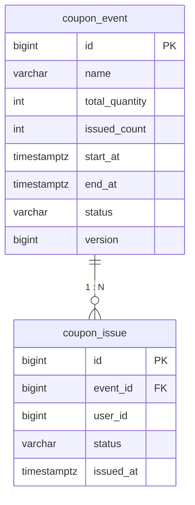
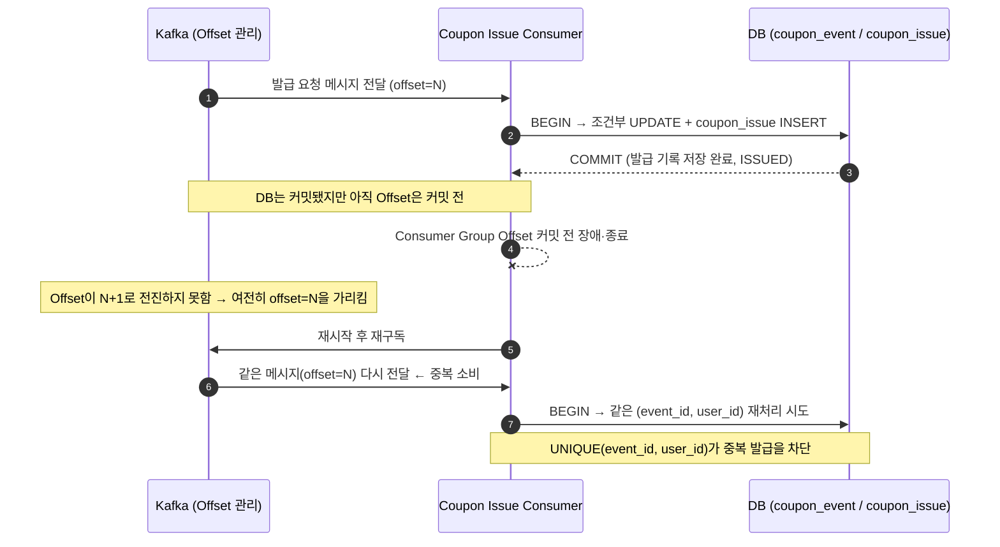
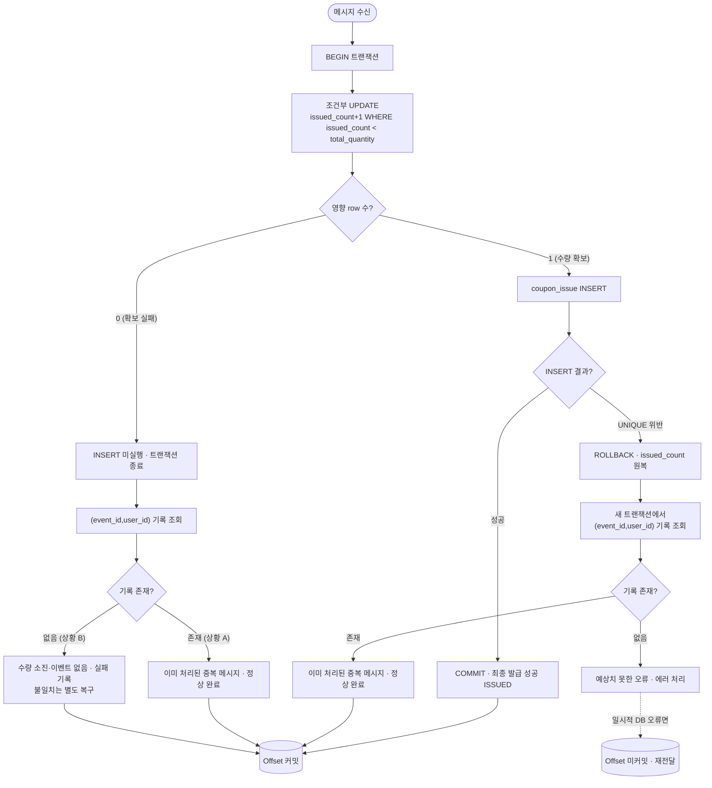

# **4주차 과제: DB 테이블과 최종 발급 정합성 보장**

## **1. 과제 목표**

이번 과제의 목표는 **Redis와 Kafka를 통과한 쿠폰 발급 요청을 DB에 정확하게 저장하고, 사용자 중복 발급과 전체 수량 초과를 방지하는 구조를 설계하는 것**이다.

1주차에서는 요청 접수와 실제 발급 처리를 분리했다.

2주차에서는 Kafka를 이용해 쿠폰 발급 요청을 비동기적으로 전달했다.

3주차에서는 Redis를 이용해 사용자 중복 요청과 수량 초과 요청을 빠르게 차단했다.

이번 4주차에서는 Consumer가 Kafka 메시지를 읽은 뒤 DB에 최종 발급 기록을 저장하는 단계를 설계한다.

기본 흐름은 다음과 같다.

```text
Client
  ↓
API Server
  ↓
Redis 선착순 / 중복 판정
  ↓
ACCEPTED인 요청만 Kafka 발행
  ↓
coupon.issue.requested Topic
  ↓
Coupon Issue Consumer
  ↓
DB Transaction
  ├─ coupon_event.issued_count 증가
  └─ coupon_issue 발급 기록 저장
```

`Redis ACCEPTED`는 3주차의 `Redis SUCCESS`와 같은 단계다. 최종 발급 성공과 구분하기 위해 이번 주차에서는 `ACCEPTED`로 표기한다.

이번 과제에서 중요하게 볼 내용은 다음과 같다.

```text
Redis 판정 통과와 DB 최종 발급 성공의 차이

DB가 보장해야 하는 불변식

coupon_event와 coupon_issue 테이블 설계

UNIQUE(event_id, user_id)의 역할과 한계

조건부 UPDATE를 이용한 수량 초과 방지

영향받은 row 수의 의미와 실패 원인 구분

issued_count 증가와 coupon_issue INSERT를
하나의 트랜잭션으로 묶는 이유

Kafka 중복 소비와 DB 중복 발급 방지

품절 후 중복 메시지가 재처리되는 경우

조건부 UPDATE, 비관적 락, 낙관적 락 비교

Redis, Kafka, DB의 역할과 데이터 불일치 상황
```

이번 과제의 핵심은 다음과 같다.

```text
Redis는 빠른 선착순 판정을 담당한다.

Kafka는 발급 요청 메시지를 전달한다.

DB는 최종 발급 기록을 저장하고 수량 정합성을 보장한다.
```

---

## **2. 기본 상황**

서비스에서 선착순 쿠폰 이벤트를 진행한다고 가정한다.

```text
이벤트 ID: 100

이벤트 이름: 여름맞이 5,000원 할인 쿠폰 이벤트

전체 쿠폰 수량: 1,000개

발급 조건:
사용자 1명당 해당 이벤트 쿠폰 1개만 발급 가능

DBMS: PostgreSQL

최종 발급 성공 기준:
coupon_issue 저장 트랜잭션 Commit
```

Redis는 정상 상황에서 최대 1,000명의 사용자만 통과시킨다.

하지만 다음과 같은 상황이 발생할 수 있다.

```text
Redis 데이터 유실 또는 초기화

Redis Replica Failover 과정에서 일부 통과 기록 유실

Kafka 메시지 재처리

DB Commit 이후 Consumer Group Offset 커밋 전 Consumer 장애

애플리케이션 버그로 같은 발급 요청이 여러 번 DB에 도달
```

따라서 Redis가 앞단에서 요청을 차단하더라도 DB에는 다음 방어 장치가 필요하다.

```text
사용자 중복 발급 방지
→ UNIQUE(event_id, user_id)

전체 수량 초과 방지
→ issued_count 조건부 UPDATE

두 작업의 일관성
→ DB Transaction
```

---

## **3. 이번 과제의 전제 조건**

이번 과제에서는 다음 전제를 따른다.

```text
coupon_issue에는 최종 발급에 성공한 기록만 저장한다.

coupon_issue의 status는 ISSUED만 사용한다.

쿠폰 발급 취소와 재발급은 다루지 않는다.

이벤트별 전체 수량은
coupon_event.total_quantity에 저장한다.

DB에서 최종 발급된 수량은
coupon_event.issued_count에 저장한다.

모든 발급 처리는 issued_count 증가와
coupon_issue INSERT를 같은 트랜잭션에서 수행한다.

이벤트 발급 자격은 Redis 판정 시점을 기준으로 한다.
Consumer는 이벤트 상태와 기간을 다시 판정하지 않고
DB의 최종 수량과 사용자 중복 발급을 방어한다.

PostgreSQL의 기본 격리 수준인
READ COMMITTED를 기준으로 설명한다.

자동 Offset 커밋은 사용하지 않는다.
Consumer가 DB 처리 결과를 확정한 후에
Consumer Group Offset을 커밋한다고 가정한다.
```

이번 주차에서는 아래 내용의 상세 구현은 다루지 않는다.

```text
requestId 기반 요청 상태 관리

Outbox Pattern

Retry Topic과 DLQ

쿠폰 발급 취소와 재발급 정책

Redis와 Kafka 사이의 원자성 보장
```

다만 이번 주차의 설계가 이후 주차의 내용과 어떻게 연결되는지는 설명해야 한다.

---

## **4. 제출 형식**

제출 파일은 아래 경로에 작성해서 PR을 생성한다.

```text
submissions/Week4/기수_이름.md
```

예시는 다음과 같다.

```text
submissions/Week4/13기_김기민.md
```

제출 문서에는 아래 필수 과제를 모두 포함한다.

```text
과제 1. DB 최종 발급 처리 구조 그리기

과제 2. DB가 보장해야 하는 불변식 정의하기

과제 3. coupon_event와 coupon_issue 테이블 설계하기

과제 4. UNIQUE 제약의 역할과 한계 분석하기

과제 5. 조건부 UPDATE로 전체 수량 초과 방지하기

과제 6. 발급 트랜잭션과 Rollback 설계하기

과제 7. Kafka 중복 소비와 DB 중복 발급 방지 설계하기

과제 8. 품절 후 중복 메시지 재처리 분석하기

과제 9. DB 동시성 제어 방식 비교하기

과제 10. Redis, Kafka, DB 불일치 상황과
이후 주차 연결하기
```

---

# **5. 필수 과제**

---

## **과제 1. DB 최종 발급 처리 구조 그리기**

Redis 판정을 통과한 요청이 Kafka를 거쳐 DB에 최종 저장되는 전체 구조를 작성한다.

반드시 아래 구성 요소를 포함해야 한다.

```text
Client

API Server

Redis

Kafka

Coupon Issue Consumer

coupon_event

coupon_issue
```

### **1. 전체 요청 처리 흐름 다이어그램**

Redis 판정을 통과(`ACCEPTED`)한 요청만 Kafka에 발행되고, Consumer가 그 메시지를 읽어 **하나의 DB 트랜잭션 안에서** `coupon_event.issued_count` 증가와 `coupon_issue` INSERT를 함께 수행한 뒤 Commit되는 시점이 최종 발급 성공이다.

```mermaid
sequenceDiagram
    autonumber
    actor C as Client
    participant API as API Server
    participant R as Redis
    participant K as Kafka (coupon.issue.requested)
    participant CW as Coupon Issue Consumer
    participant DB as DB (coupon_event / coupon_issue)

    Note over C,API: [1] 사전 검증 (인증 · 이벤트 상태/기간)
    C->>API: 쿠폰 발급 요청 (eventId=100, userId)
    API->>API: 인증 및 이벤트 기본 검증

    Note over API,R: [2] Redis 원자 판정 (중복 · 잔여 수량)
    API->>R: SISMEMBER → SCARD → SADD (Lua, 원자 실행)
    alt DUPLICATE 또는 SOLD_OUT
        R-->>API: 판정 실패
        API-->>C: 409 Conflict (발행 없음)
    else ACCEPTED (통과 사용자 Set에 추가)
        R-->>API: ACCEPTED

        Note over API,K: [3] 통과 요청만 Kafka 발행 → 접수 응답
        API->>K: publish(발급 요청 메시지)
        K-->>API: Broker ack (PUBLISHED)
        API-->>C: 202 Accepted (PENDING, requestId)

        Note over CW,DB: [4] Consumer가 하나의 트랜잭션으로 최종 발급
        K->>CW: 발급 요청 메시지 전달
        CW->>DB: BEGIN
        CW->>DB: UPDATE coupon_event SET issued_count=issued_count+1<br/>WHERE id=100 AND issued_count &lt; total_quantity
        alt 영향 row = 1 (수량 확보)
            CW->>DB: INSERT INTO coupon_issue(event_id, user_id, status) VALUES(:eventId, :userId, 'ISSUED')
            alt INSERT 성공
                CW->>DB: COMMIT
                Note over DB: DB ISSUED = 최종 발급 성공
                CW->>K: Offset 커밋
            else UNIQUE 위반 (중복 소비)
                CW->>DB: ROLLBACK (issued_count 증가도 취소)
                CW->>DB: 기존 coupon_issue 기록 조회 → 중복 메시지로 정상 처리
                CW->>K: Offset 커밋
            end
        else 영향 row = 0
            CW->>DB: 기존 coupon_issue 기록 조회
            Note over CW,DB: 기록 존재 → 중복 메시지 / 기록 없음 → 수량 소진·이벤트 없음
            CW->>K: Offset 커밋 (재시도 불필요 시)
        end
    end
```

**구간 요약**
- **[1] 사전 검증** — API가 인증·이벤트 상태/기간을 확인한다. 이후 Consumer는 이 판정을 다시 하지 않는다(발급 자격 판단 시점 = Redis 판정 시점).
- **[2] Redis 원자 판정** — 3주차의 Set + Lua로 중복·잔여 수량을 원자적으로 판정한다. 통과 시 `ACCEPTED`.
- **[3] Kafka 발행/접수 응답** — 통과 요청만 발행하고, Broker ack를 받으면 `202 PENDING`으로 접수만 응답한다.
- **[4] Consumer DB 저장** — `조건부 UPDATE + coupon_issue INSERT`를 **한 트랜잭션**으로 처리하고 Commit되어야 `ISSUED`. 그 뒤에 Offset을 커밋한다.

### **2. Redis 판정 통과가 최종 발급 성공이 아닌 이유**

```text
Redis ACCEPTED는 "Redis 기준으로 선착순 판정을 통과했다"는 의미일 뿐,
발급 기록이 DB에 저장되었다는 뜻이 아니다.

1. Redis 통과 후 Kafka 발행이 실패하면, 통과 기록만 있고 발급 요청 메시지는 없다.
2. 발행에 성공해도 Consumer의 DB 트랜잭션이 롤백되면 발급 기록은 남지 않는다.
3. Redis는 인메모리 저장소라 유실·초기화·Replica Failover로 통과 기록이 사라질 수 있다.
4. Redis는 빠른 판정을 위한 앞단 필터일 뿐, 최종 발급 결과의 원본 저장소가 아니다.

→ 그래서 Redis 통과는 접수(PENDING)의 근거일 뿐, 최종 발급 성공의 근거가 될 수 없다.
```

### **3. Kafka 메시지 발행 성공이 최종 발급 성공이 아닌 이유**

```text
Kafka PUBLISHED는 "발급 요청 메시지가 Kafka에 저장되었다"는 의미다.
아직 Consumer가 DB에 발급 기록을 저장하기 전이다.

1. 발행된 메시지는 앞으로 처리될 "요청"이지 "발급 완료"가 아니다.
2. Consumer가 메시지를 읽고 처리하다가 실패/종료될 수 있다.
3. 조건부 UPDATE 결과가 0(수량 소진)이거나 UNIQUE 위반이면 발급 기록은 저장되지 않는다.
4. Kafka는 메시지를 전달하는 브로커일 뿐, 도메인 상태(발급 여부)를 저장하는 주체가 아니다.
   별도의 요청 상태 저장소가 없다면 Kafka가 PENDING이라는 도메인 상태를 관리하는 것도 아니다.

→ 발행 성공은 "요청이 전달되었다"까지만 보장하며, 최종 발급 성공은 DB Commit에서 확정된다.
```

### **4. 최종 발급 성공으로 판단할 수 있는 시점**

```text
Consumer가 아래 두 작업을 하나의 트랜잭션으로 수행하고 Commit한 시점.

1. coupon_event.issued_count 증가 (조건부 UPDATE, 영향 row = 1)
2. coupon_issue 발급 기록 INSERT (UNIQUE 위반 없이 성공)

두 작업이 함께 Commit되어 coupon_issue에 (event_id, user_id) 행이 존재하는 것이
최종 발급 성공(DB ISSUED)의 유일한 기준이다.

즉 "최종 발급 여부"는 Redis 통과 기록이나 Kafka 레코드 존재가 아니라,
DB의 coupon_issue 기록으로만 판단한다.
```

### **5. Redis, Kafka, DB 단계의 상태 차이**

| **단계** | **의미** | **최종 발급 성공 여부** |
| --- | --- | --- |
| Redis ACCEPTED | Redis 기준 선착순·중복 판정을 통과함 (통과 사용자 Set에 추가됨). 접수(PENDING)의 근거 | ❌ 아님 (앞단 필터 통과일 뿐) |
| Kafka PUBLISHED | 발급 요청 메시지가 Kafka에 저장됨 (Broker ack). 전달만 보장 | ❌ 아님 (아직 DB 저장 전) |
| DB ISSUED | 조건부 UPDATE + coupon_issue INSERT가 한 트랜잭션으로 Commit됨 | ✅ 최종 발급 성공 (유일한 기준) |

---

## **과제 2. DB가 보장해야 하는 불변식 정의하기**

쿠폰 발급 시스템이 장애와 동시 요청 상황에서도 지켜야 하는 조건을 불변식으로 정의한다.

이번 과제에서는 다음 세 가지 불변식을 기준으로 작성한다.

```text
불변식 1.

한 사용자는 하나의 이벤트에서
쿠폰을 최대 한 번만 발급받는다.

불변식 2.

발급 수량은 0보다 작거나
전체 수량보다 많을 수 없다.

불변식 3.

issued_count 증가와 coupon_issue 저장은
함께 성공하거나 함께 실패한다.
```

### **1. 불변식이 필요한 이유**

```text
불변식은 시스템이 장애·동시 요청·재처리 등 "어떤 상황에서도" 지켜야 하는 조건이다.
개별 요청의 정상 흐름만 맞추는 것으로는 부족하고, 무엇이 깨지면 안 되는지를
먼저 못 박아야 그 조건을 지킬 방어 장치를 정확히 고를 수 있다.

1. 앞단(Redis)은 유실·Failover·초기화될 수 있고, Kafka 메시지는 재처리될 수 있으며,
   애플리케이션 버그로 같은 요청이 여러 번 DB에 도달할 수 있다.
   → 정상 흐름만 가정하면 이런 예외 상황에서 데이터가 깨진다.

2. "1인 1매", "전체 수량 이하", "수량과 발급 기록의 일치"는 이 서비스의 정확성 그 자체다.
   하나라도 깨지면 사용자는 쿠폰을 두 개 받거나, 준비된 수량보다 더 발급되거나,
   장부(issued_count)와 실제 발급 기록이 어긋난다.

3. 불변식을 명시하면 방어 지점이 분명해진다.
   앞단은 성능을 위한 1차 필터로 두고, 최종적으로 절대 깨지면 안 되는 조건은
   DB 제약·트랜잭션이라는 마지막 방어선으로 강제한다. (3주차 "이중 방어"의 연장)
```

### **2. 각 불변식이 깨졌을 때 발생하는 문제**

| **불변식** | **깨졌을 때 발생하는 문제** |
| --- | --- |
| 사용자별 최대 1회 발급 | 한 사용자가 같은 이벤트 쿠폰을 2개 이상 발급받는다. 선착순 자리를 한 명이 독식해 다른 사용자의 기회를 빼앗고, 정산·혜택 기준이 무너진다. |
| 전체 수량 이하 발급 | 준비된 1,000개를 넘겨 1,001개 이상 발급된다. 예산·재고를 초과한 초과 발급이 발생하고, 서비스가 감당할 수 없는 채무가 생긴다. |
| 수량과 발급 기록의 동시 성공·실패 | `issued_count`(장부)와 `coupon_issue`(실제 발급 기록)가 어긋난다. 수량은 줄었는데 받은 사람이 없거나(수량 손실), 받은 사람은 있는데 수량에 반영되지 않아(초과 발급 유발) 정합성이 깨진다. |

### **3. 각 불변식을 보호하는 DB 장치**

| **불변식** | **DB 방어 장치** |
| --- | --- |
| 사용자 중복 발급 방지 | `UNIQUE(event_id, user_id)` |
| 전체 수량 초과 방지 | `issued_count` 조건부 `UPDATE` (`WHERE issued_count < total_quantity`) + 수량 `CHECK` 제약 |
| 두 테이블의 일관성 | DB Transaction (issued_count 증가와 coupon_issue INSERT를 하나로 묶음) |

### **4. 애플리케이션에서 중복 여부를 먼저 조회하는 것만으로 불변식을 보장할 수 없는 이유**

```text
"SELECT로 기존 기록을 확인한 뒤 없으면 INSERT" 방식은 확인 시점과 쓰기 시점 사이에
틈이 있어 동시 요청을 막지 못한다. (3주차의 TOCTOU와 같은 구조의 문제)

- Transaction A가 user:10의 발급 기록을 조회 → "없음"
- Transaction B도 user:10의 발급 기록을 조회 → "없음"
- 두 트랜잭션 모두 기록이 없다고 판단하고 동시에 INSERT
- 결과: 같은 사용자에게 발급 기록이 2건 생겨 "1인 1매" 불변식이 깨진다.

PostgreSQL 기본 격리 수준(READ COMMITTED)에서는 아직 커밋되지 않은 상대 트랜잭션의
INSERT가 서로에게 보이지 않으므로, 조회 시점에는 둘 다 "없음"으로 판단한다.

또한 이 조회는 애플리케이션(또는 Redis)의 사전 검사일 뿐이라, Redis 유실·Kafka 재처리·
앱 버그로 같은 요청이 DB에 다시 도달하는 경로 자체를 막지는 못한다.

→ 최종 방어는 조회 로직이 아니라, 쓰기 시점에 DB가 강제하는 제약이어야 한다.
  사용자 중복은 UNIQUE(event_id, user_id)가, 수량은 조건부 UPDATE가 쓰기 순간에 직렬화해
  판정하므로 동시 요청과 재처리에도 불변식이 깨지지 않는다.
```

---

## **과제 3. coupon_event와 coupon_issue 테이블 설계하기**

쿠폰 이벤트와 최종 발급 기록을 저장할 테이블을 설계한다.

완전한 운영용 스키마를 만드는 것이 목적은 아니다. 이번 주차에서 필요한 불변식을 지킬 수 있도록 핵심 컬럼과 제약 조건을 작성한다.

### **1. coupon_event 테이블의 역할**

```text
쿠폰 이벤트 자체와 DB 기준 발급 수량을 저장하는 이벤트 단위(1) 테이블이다.

1. 이벤트 정의: 이름, 전체 발급 가능 수량(total_quantity), 시작/종료 시각, 상태(READY/OPEN/CLOSED).
2. DB 기준 발급 수량 관리: DB 트랜잭션이 완료된 발급 수를 issued_count에 누적한다.
   → 전체 수량 초과 방지는 이 값을 조건부 UPDATE(issued_count < total_quantity)로 지킨다.
3. 동시성 제어의 대상 row: 수량 확보는 이 이벤트 row 하나를 갱신·직렬화하는 것으로 이루어진다.
   (낙관적 락을 쓸 경우 version 컬럼도 여기서 관리한다.)

즉 "얼마나 준비되어 있고, 지금까지 몇 개가 확정 발급되었는가"의 기준 데이터다.
```

### **2. coupon_issue 테이블의 역할**

```text
어떤 사용자가 어떤 이벤트의 쿠폰을 발급받았는지, 최종 발급에 성공한 기록만 저장하는
발급 단위(N) 테이블이다.

1. 최종 발급의 원본 기록: (event_id, user_id) 행의 존재 = 그 사용자의 최종 발급 성공(ISSUED).
   → "최종 발급 여부"는 이 테이블을 기준으로 판단한다. (과제 1-4와 동일)
2. 사용자 중복 발급 방지: UNIQUE(event_id, user_id)로 한 사용자가 같은 이벤트에서
   두 번 발급받지 못하게 쓰기 시점에 강제한다.
3. 멱등성의 근거: Kafka 메시지가 중복 소비되어 같은 (event_id, user_id)가 다시 INSERT되면
   UNIQUE 위반으로 차단된다. (과제 7·8과 연결)

이번 주차 전제상 상태는 ISSUED만 저장하고, 취소·재발급은 다루지 않는다.
```

### **3. 두 테이블의 관계를 다이어그램으로 표현하기**

coupon_event(1)과 coupon_issue(N)는 1:N 관계다. 한 이벤트에 여러 발급 기록이 달리며, 각 발급 기록은 `event_id` FK로 이벤트를 참조한다.



```text
coupon_event (1)
   | id (PK)
   |
   | 1 : N   (coupon_issue.event_id → coupon_event.id)
   v
coupon_issue (N)
   - event_id (FK)
   - user_id
   - UNIQUE(event_id, user_id)   ← 이벤트 안에서 사용자당 1행만 허용
```

### **4. coupon_event 테이블 DDL 작성하기**

아래 컬럼과 제약 조건을 포함한다.

```text
id

name

total_quantity

issued_count

start_at

end_at

status

version (낙관적 락을 선택할 경우)

수량 CHECK 제약

이벤트 기간 CHECK 제약
```

```sql
CREATE TABLE coupon_event (
    id BIGSERIAL PRIMARY KEY,

    name VARCHAR(100) NOT NULL,

    -- 전체 발급 가능 수량
    total_quantity INT NOT NULL,

    -- DB 트랜잭션이 완료된 발급 수량
    issued_count INT NOT NULL DEFAULT 0,

    start_at TIMESTAMPTZ NOT NULL,
    end_at   TIMESTAMPTZ NOT NULL,

    -- READY, OPEN, CLOSED
    status VARCHAR(20) NOT NULL,

    -- 낙관적 락을 선택할 경우 사용한다.
    version BIGINT NOT NULL DEFAULT 0,

    created_at TIMESTAMPTZ NOT NULL DEFAULT CURRENT_TIMESTAMP,
    updated_at TIMESTAMPTZ NOT NULL DEFAULT CURRENT_TIMESTAMP,

    -- 수량 불변식: 0 이상, 그리고 발급 수가 전체 수량을 넘지 않음
    CONSTRAINT chk_coupon_event_quantity
        CHECK (
            total_quantity >= 0
            AND issued_count >= 0
            AND issued_count <= total_quantity
        ),

    -- 이벤트 기간 제약
    CONSTRAINT chk_coupon_event_period
        CHECK (start_at < end_at),

    -- 상태 값 제약
    CONSTRAINT chk_coupon_event_status
        CHECK (status IN ('READY', 'OPEN', 'CLOSED'))
);
```

`TIMESTAMPTZ`는 서버·DB의 시간대가 달라도 동일 시점을 안전하게 다루기 위해 사용한다. `chk_coupon_event_quantity`의 `issued_count <= total_quantity`는 조건부 UPDATE와 함께 전체 수량 초과를 DB 차원에서 한 번 더 막는 최종 안전장치다. (`updated_at`의 DEFAULT는 INSERT 시점에만 적용되므로 값 변경 시 갱신은 애플리케이션 코드나 트리거가 담당한다.)

### **5. coupon_issue 테이블 DDL 작성하기**

아래 컬럼과 제약 조건을 포함한다.

```text
id

event_id

user_id

status

issued_at

coupon_event를 참조하는 Foreign Key

동일 이벤트의 사용자 중복 발급을 막는 UNIQUE 제약
```

```sql
CREATE TABLE coupon_issue (
    id BIGSERIAL PRIMARY KEY,

    event_id BIGINT NOT NULL,
    user_id  BIGINT NOT NULL,

    -- 이번 주차에서는 ISSUED만 저장한다.
    status VARCHAR(20) NOT NULL DEFAULT 'ISSUED',

    issued_at  TIMESTAMPTZ NOT NULL DEFAULT CURRENT_TIMESTAMP,
    created_at TIMESTAMPTZ NOT NULL DEFAULT CURRENT_TIMESTAMP,
    updated_at TIMESTAMPTZ NOT NULL DEFAULT CURRENT_TIMESTAMP,

    -- coupon_event를 참조하는 Foreign Key
    CONSTRAINT fk_coupon_issue_event
        FOREIGN KEY (event_id)
        REFERENCES coupon_event(id),

    -- 이번 주차 전제: 상태는 ISSUED만 허용
    CONSTRAINT chk_coupon_issue_status
        CHECK (status = 'ISSUED'),

    -- 사용자 중복 발급 방지 (가장 중요한 제약)
    CONSTRAINT uk_coupon_issue_event_user
        UNIQUE (event_id, user_id)
);
```

가장 중요한 제약은 `UNIQUE(event_id, user_id)`다. 같은 사용자가 같은 이벤트 쿠폰을 두 번 발급받지 못하게 **쓰기 시점에** 막으며, 동시 요청과 Kafka 중복 소비에 대한 최종 방어선이 된다. (과제 4·7·8과 연결)

### **6. issued_count를 coupon_event에 별도로 저장하는 이유와 단점**

```text
[별도로 저장하는 이유]
issued_count는 coupon_issue를 COUNT(*)로 집계해서 구할 수도 있다.
그럼에도 이벤트 row에 별도 컬럼으로 두는 이유는 다음과 같다.

1. 남은 수량을 O(1)로 빠르게 판단할 수 있다. (매 발급마다 대량 COUNT 집계 불필요)
2. DB 기준 발급 현황을 즉시 조회할 수 있다.
3. Redis 통과 수와 DB 확정 수의 차이를 비교해 불일치 감시에 쓸 수 있다.
4. 무엇보다 "수량이 남아 있을 때만 증가"라는 조건부 UPDATE를 이 컬럼 하나에 적용해,
   전체 수량 초과를 이벤트 row 갱신의 직렬화로 원자적으로 막을 수 있다.
   (COUNT 집계 방식으로는 확인과 INSERT 사이에 틈이 생겨 TOCTOU가 발생한다.)

[단점 / 주의점]
1. 파생·중복 데이터이므로 coupon_issue 실제 기록과 어긋날 위험이 있다.
   → 반드시 issued_count 증가와 coupon_issue INSERT를 같은 트랜잭션으로 묶어야 한다. (과제 6)
2. 선착순 이벤트에서는 모든 요청이 같은 이벤트 row 하나에 몰려,
   그 row에 대한 갱신 경합(row lock 대기)이 집중된다. (과제 9의 트레이드오프)
```

---

## **과제 4. UNIQUE 제약의 역할과 한계 분석하기**

`UNIQUE(event_id, user_id)`가 어떤 문제를 막고, 어떤 문제는 막지 못하는지 분석한다.

### **1. `UNIQUE(event_id, user_id)`가 의미하는 규칙**

```text
coupon_issue 테이블에서 (event_id, user_id) 조합은 최대 1개의 행만 존재할 수 있다.
즉 "한 이벤트 안에서 한 사용자는 최대 한 번만 발급 기록을 가질 수 있다" = 1인 1매.

- 단일 컬럼이 아니라 두 컬럼의 "조합"에 대한 유일성이다.
  → user_id 하나만 보면 여러 이벤트에서 각각 발급받을 수 있다.
  → event_id 하나만 보면 여러 사용자가 발급받을 수 있다.
  → 막는 것은 오직 "같은 이벤트 + 같은 사용자"의 두 번째 행이다.

- 이 제약은 애플리케이션 조회가 아니라 DB가 INSERT(쓰기) 시점에 강제한다.
  이미 같은 조합의 행이 있으면 두 번째 INSERT는 UNIQUE 위반으로 거부된다.
  → 동시 요청·Kafka 중복 소비에도 사용자 중복 발급을 막는 최종 방어선이 된다.
```

### **2. 다음 INSERT의 성공 여부와 이유**

기존 데이터는 다음과 같다.

```text
event_id = 100
user_id = 10
```

| **새로운 INSERT** | **성공 또는 실패** | **이유** |
| --- | --- | --- |
| event_id=100, user_id=10 | ❌ 실패 (UNIQUE 위반) | 기존 행과 (event_id, user_id) 조합이 완전히 같다. 같은 이벤트에서 같은 사용자의 두 번째 발급이므로 1인 1매 위반. |
| event_id=100, user_id=11 | ✅ 성공 | 같은 이벤트(100)지만 사용자가 다르다(11). 조합 (100, 11)은 처음이므로 유일성 유지. |
| event_id=101, user_id=10 | ✅ 성공 | 같은 사용자(10)지만 이벤트가 다르다(101). 조합 (101, 10)은 처음이므로 유일성 유지. 사용자는 이벤트마다 별도로 1매씩 받을 수 있다. |

### **3. 중복 여부를 SELECT한 뒤 INSERT하는 방식의 Race Condition**

아래 상황을 시간 순서로 표현한다.

```text
Transaction A가 user:10의 발급 기록을 조회한다.

Transaction B도 user:10의 발급 기록을 조회한다.

두 트랜잭션 모두 아직 발급 기록이 없다고 판단한다.

두 트랜잭션이 동시에 INSERT를 시도한다.
```

답변:

```text
[SELECT 후 INSERT 방식의 문제 = TOCTOU]

t1  Transaction A: SELECT ... WHERE event_id=100 AND user_id=10  → 결과 없음
t2  Transaction B: SELECT ... WHERE event_id=100 AND user_id=10  → 결과 없음
        (READ COMMITTED에서 서로의 미커밋 INSERT가 보이지 않아 둘 다 "없음")
t3  Transaction A: INSERT (100, 10)  → 진행
t4  Transaction B: INSERT (100, 10)  → 진행

애플리케이션 조회만 믿으면, 확인(check) 시점에는 둘 다 "기록 없음"이므로
두 트랜잭션 모두 INSERT를 시도해 같은 사용자에게 발급 기록이 2건 생긴다. (1인 1매 위반)

[UNIQUE 제약이 있으면]
- 먼저 커밋한 트랜잭션의 (100, 10) INSERT만 성공한다.
- 나머지 트랜잭션의 INSERT는 UNIQUE 위반으로 거부되어 실패(→ Rollback)한다.
- 결과적으로 (100, 10) 행은 정확히 1개만 남는다.

핵심: 중복 방지는 "조회 로직"이 아니라 "쓰기 시점에 DB가 강제하는 UNIQUE 제약"이 담당해야 한다.
      조회는 UX용 사전 안내일 뿐, 정확성의 근거가 될 수 없다.
```

### **4. UNIQUE 제약이 전체 수량 초과를 막을 수 없는 이유**

아래 상황을 기준으로 설명한다.

```text
전체 수량: 1,000개

서로 다른 사용자: 1,001명

모든 (event_id, user_id) 조합은 서로 다름
```

```text
UNIQUE(event_id, user_id)는 "같은 조합의 중복"만 막는다.
사용자 1,001명은 user_id가 전부 다르므로 모든 (100, user_id) 조합이 서로 다르다.

(100, 1)    → 조합 최초 → UNIQUE 통과
(100, 2)    → 조합 최초 → UNIQUE 통과
...
(100, 1000) → 조합 최초 → UNIQUE 통과
(100, 1001) → 조합 최초 → UNIQUE 통과 ← 1,001번째도 막히지 않음!

UNIQUE 입장에서는 1,001개의 행이 모두 "서로 다른 정상 조합"이라 전부 허용된다.
전체 수량(1,000)이라는 "총합 상한"은 UNIQUE가 알지도, 검사하지도 않는 조건이다.

→ 사용자 중복(같은 조합)과 전체 수량 초과(서로 다른 조합의 총 개수)는
  서로 다른 종류의 문제이므로, 서로 다른 장치로 각각 막아야 한다.
  전체 수량 초과는 issued_count 조건부 UPDATE(issued_count < total_quantity)가 담당한다.
```

### **5. 사용자 중복과 전체 수량 초과를 각각 어떤 장치로 막아야 하는가?**

| **문제** | **DB 방어 장치** |
| --- | --- |
| 같은 사용자의 중복 발급 | `UNIQUE(event_id, user_id)` — 같은 조합의 두 번째 행을 쓰기 시점에 거부 |
| 서로 다른 사용자에 의한 전체 수량 초과 | `issued_count` 조건부 `UPDATE` (`WHERE issued_count < total_quantity`) + 수량 `CHECK` — 총합 상한을 이벤트 row 갱신의 직렬화로 방어 |

---

## **과제 5. 조건부 UPDATE로 전체 수량 초과 방지하기**

쿠폰 수량이 남아 있을 때만 `issued_count`를 증가시키는 조건부 UPDATE를 설계한다.

### **1. 조건부 UPDATE SQL 작성하기**

다음 조건을 만족해야 한다.

```text
event_id가 일치해야 한다.

issued_count가 total_quantity보다 작을 때만 증가해야 한다.

issued_count는 1 증가해야 한다.
```

```sql
UPDATE coupon_event
SET issued_count = issued_count + 1,
    updated_at   = CURRENT_TIMESTAMP
WHERE id = :eventId
  AND issued_count < total_quantity;
```

수량 "확인(issued_count < total_quantity)"과 "증가(+1)"를 **하나의 SQL**로 수행하는 것이 핵심이다. 별도 SELECT로 먼저 남은 수량을 확인한 뒤 UPDATE하면 그 사이에 다른 트랜잭션이 값을 바꿔 TOCTOU가 생긴다. 조건을 `WHERE` 절에 넣어 확인과 증가를 원자적으로 묶는다.

### **2. 영향받은 row 수가 의미하는 것**

```text
이 UPDATE로 실제로 갱신된 행의 개수이며, "수량 확보 성공 여부"를 뜻한다.

- 영향받은 row 수 = 1  → WHERE 조건을 만족해 issued_count가 실제로 +1 증가함 → 수량 확보 성공
- 영향받은 row 수 = 0  → WHERE 조건을 만족하는 행이 없어 아무것도 바뀌지 않음 → 수량 확보 실패

즉 반환된 row 수만 보고 "이 요청이 쿠폰 한 장을 확보했는지"를 판단할 수 있다.
별도의 SELECT나 애플리케이션 재시도 없이 이 값 하나로 성공/실패를 가른다.
```

### **3. 영향받은 row 수가 1인 경우**

```text
WHERE의 두 조건(id = :eventId, issued_count < total_quantity)을 모두 만족해
issued_count가 원자적으로 1 증가한 상태다. → 이 요청이 남은 쿠폰 한 장을 확보했다.

여러 트랜잭션이 동시에 실행해도 DB가 같은 row의 갱신을 직렬화하므로,
각 트랜잭션은 "자기 차례의 최신 issued_count"를 기준으로 조건을 다시 판단한다.
따라서 row 수 = 1은 그 시점 기준으로 정말 수량이 남아 있었음을 보장한다.

이후 같은 트랜잭션 안에서 coupon_issue INSERT를 진행한다. (과제 6)
단, row 수 = 1이라도 아직 "최종 발급 성공"은 아니다. INSERT까지 성공하고 Commit되어야 ISSUED다.
```

### **4. 영향받은 row 수가 0인 경우 가능한 원인**

과제 5-1의 SQL은 `event_id`와 수량 조건만 사용한다. 중복 메시지 여부는 UPDATE 결과가 0인 직접 원인이 아니라, 이후 기존 발급 기록을 조회해 구분한다.

```text
1. 수량 소진: 이벤트는 존재하지만 issued_count가 total_quantity에 도달해
   `issued_count < total_quantity` 조건을 만족하지 못함 → 갱신할 행 없음.

2. 이벤트 없음: 해당 :eventId 행 자체가 없어 `id = :eventId` 조건을 만족하지 못함.
```

### **5. 다음 상황에서 UPDATE 결과를 작성하기**

과제 5-1에서 작성한 조건부 UPDATE를 사용한다고 가정한다.

| **상황** | **issued_count** | **total_quantity** | **이벤트 존재 여부** | **영향받은 row 수** | **결과** |
| --- | --- | --- | --- | --- | --- |
| A | 999 | 1,000 | 존재 | 1 | 999 < 1,000 → 조건 충족, issued_count 999→1000. 수량 확보 성공 (마지막 한 장) |
| B | 1,000 | 1,000 | 존재 | 0 | 1,000 < 1,000 거짓 → 조건 불충족, 갱신 없음. 수량 소진(품절) |
| C | - | - | 존재하지 않음 | 0 | `id = :eventId` 조건을 만족하는 행 없음 → 갱신 없음. 이벤트 없음 |

### **6. 두 트랜잭션이 동시에 마지막 수량을 증가시키는 상황 분석**

```text
전체 수량: 1,000개

현재 issued_count: 999

Transaction A와 Transaction B가
동시에 조건부 UPDATE 실행
```

두 트랜잭션의 실행 결과를 시간 순서 다이어그램으로 작성한다.

```text
전제: total_quantity = 1,000, 현재 issued_count = 999
      A와 B가 거의 동시에 같은 이벤트 row에 조건부 UPDATE 실행

t1  A: UPDATE ... WHERE id=100 AND issued_count < 1000 실행
        → DB가 이벤트 row(id=100)에 대한 쓰기 락 획득
t2  B: 같은 row를 UPDATE하려 하지만, A가 락을 쥐고 있어 대기(blocked)
        (DB가 같은 row의 갱신을 직렬화)
t3  A: 999 < 1000 참 → issued_count 999→1000, 영향 row = 1
t4  A: Commit → 락 해제
t5  B: 대기 해제. B는 이제 "갱신된 최신 값" issued_count = 1000을 기준으로 조건 재평가
        → 1000 < 1000 거짓
t6  B: 조건 불충족 → 갱신 없음, 영향 row = 0 (수량 소진)

결과: A만 마지막 한 장을 확보(1), B는 실패(0). issued_count는 정확히 1000에서 멈춘다.
```

> 3주차 Redis에서는 SCARD 후 SADD가 분리되어 TOCTOU가 발생했고 이를 Lua로 원자화했다. DB에서는 조건부 UPDATE 하나가 그 원자 판정 역할을 하며, row 단위 락 직렬화가 Lua의 단일 실행과 같은 효과를 낸다.

### **7. issued_count가 total_quantity를 초과하지 않는 이유**

```text
1. 확인과 증가가 하나의 SQL이다.
   `WHERE issued_count < total_quantity`로 "확인"하고 같은 문장에서 "+1 증가"하므로,
   확인과 증가 사이에 다른 트랜잭션이 끼어들 틈(TOCTOU)이 없다.

2. DB가 같은 row의 갱신을 직렬화한다.
   동시 요청이 같은 이벤트 row에 몰려도 한 번에 하나씩 순서대로 처리된다.
   뒤 순서의 트랜잭션은 "앞 트랜잭션이 커밋한 최신 issued_count"를 기준으로 조건을 다시 평가한다.

3. 따라서 issued_count가 total_quantity에 도달하는 순간부터
   이후 모든 UPDATE는 `issued_count < total_quantity` 조건에서 걸러져 0을 반환한다.
   → issued_count는 total_quantity를 넘어설 수 없다.

4. 게다가 chk_coupon_event_quantity CHECK(issued_count <= total_quantity)가
   마지막 안전장치로 남아, 설령 잘못된 경로로 초과를 시도해도 DB가 거부한다.
```

---

## **과제 6. 발급 트랜잭션과 Rollback 설계하기**

다음 두 작업을 하나의 DB 트랜잭션으로 묶는 이유를 설명한다.

```text
1. coupon_event.issued_count 증가

2. coupon_issue 발급 기록 INSERT
```

### **1. 두 작업을 서로 다른 트랜잭션으로 처리했을 때 발생할 수 있는 문제**

| **상황** | **발생하는 데이터 불일치** |
| --- | --- |
| issued_count 증가 성공, coupon_issue INSERT 실패 | 수량은 줄었는데(장부상 1장 소비) 실제 발급받은 사용자 기록은 없다. → **수량 손실**: 남은 쿠폰을 정상 사용자에게 발급할 기회가 영영 사라진다. issued_count > 실제 발급 수. |
| coupon_issue INSERT 성공, issued_count 증가 실패 | 발급받은 사용자는 있는데 장부(issued_count)에 반영되지 않았다. → **초과 발급 유발**: 남은 수량이 실제보다 많게 보여, 전체 수량(1,000)을 넘겨 1,001장 이상이 발급될 수 있다. issued_count < 실제 발급 수. |

### **2. 하나의 트랜잭션으로 처리하는 전체 흐름**

```text
Transaction 시작 (BEGIN)
  |
  v
[1] 조건부 UPDATE로 수량 확보
    UPDATE coupon_event SET issued_count = issued_count + 1
    WHERE id = :eventId AND issued_count < total_quantity
  |
  +-- 영향 row = 0
  |     → 수량 확보 실패
  |     → 기존 coupon_issue (event_id, user_id) 기록 조회
  |         · 기록 존재 → 이미 처리된 중복 메시지 (정상 처리)
  |         · 기록 없음 → 수량 소진 또는 이벤트 없음
  |     → 어느 경우든 이 요청은 INSERT하지 않고 트랜잭션 종료
  |
  +-- 영향 row = 1
        → 수량 확보 성공
        |
        v
      [2] coupon_issue 발급 기록 INSERT (event_id, user_id, 'ISSUED')
        |
        +-- INSERT 성공 → COMMIT  → 최종 발급 성공 (DB ISSUED)
        |
        +-- UNIQUE 위반 → ROLLBACK → [1]의 issued_count 증가도 함께 취소
                          → 새 트랜잭션에서 기존 기록 조회 → 중복 메시지로 정상 처리

두 작업이 함께 성공(Commit)하거나 함께 실패(Rollback)해야 장부와 발급 기록이 절대 어긋나지 않는다.
```

### **3. 다음 SQL을 하나의 트랜잭션 흐름으로 완성하기**

INSERT는 반드시 "UPDATE가 정확히 1 row에 영향을 준 경우에만" 실행되어야 한다. UPDATE 뒤에 INSERT를 무조건 나열하면 안 되고, **영향받은 row 수로 명시적으로 분기**한다.

**(방식 1) 애플리케이션 레벨 분기** — 이번 구조의 실제 Consumer 로직

```sql
-- Transaction 시작
BEGIN;

-- 1. 수량이 남아 있을 때만 issued_count 증가
UPDATE coupon_event
SET issued_count = issued_count + 1,
    updated_at   = CURRENT_TIMESTAMP
WHERE id = :eventId
  AND issued_count < total_quantity;
-- 애플리케이션이 이 UPDATE의 영향받은 row 수(affectedRows)를 받아 아래처럼 분기한다.
```

```text
if affectedRows == 1:
    # 2. 수량을 확보한 경우에만 발급 기록 INSERT
    INSERT INTO coupon_issue (event_id, user_id, status)
           VALUES (:eventId, :userId, 'ISSUED');
    if INSERT 성공:
        COMMIT;                     # 최종 발급 성공 (ISSUED)
    else (UNIQUE 위반):
        ROLLBACK;                   # issued_count 증가도 함께 원복
        # 이후 새 트랜잭션에서 기존 기록 조회 → 중복 메시지로 정상 처리 (과제 6-4)
else:  # affectedRows == 0
    # INSERT를 실행하지 않는다. (수량 소진 또는 이벤트 없음)
    ROLLBACK;                       # 변경분 없이 트랜잭션 종료
    # 기존 coupon_issue (event_id, user_id) 조회로
    # '이미 처리된 중복 메시지' vs '실제 수량 소진/이벤트 없음' 구분 (과제 8)
```

**(방식 2) 조건부 CTE** — 하나의 SQL로 "UPDATE가 row를 바꿨을 때만 INSERT"를 강제

```sql
BEGIN;

WITH updated AS (
    UPDATE coupon_event
    SET issued_count = issued_count + 1,
        updated_at   = CURRENT_TIMESTAMP
    WHERE id = :eventId
      AND issued_count < total_quantity
    RETURNING id
)
-- updated에 row가 있을 때(=수량 확보 성공)에만 INSERT가 실행된다.
INSERT INTO coupon_issue (event_id, user_id, status)
SELECT :eventId, :userId, 'ISSUED'
FROM updated;

COMMIT;
-- INSERT에서 UNIQUE 위반이 나면 ROLLBACK되어 issued_count 증가도 원복된다.
-- updated가 비어 있으면(affectedRows=0) INSERT는 0건 실행 → 이후 기존 기록 조회로 원인 구분.
```

### **4. UPDATE 성공 후 INSERT에서 UNIQUE 위반이 발생한 경우**

아래 항목을 모두 설명한다.

```text
현재 트랜잭션은 어떻게 되는가?

앞에서 증가한 issued_count는 어떻게 되는가?

기존 발급 기록은 언제 조회해야 하는가?
```

답변:

```text
[현재 트랜잭션은 어떻게 되는가?]
INSERT에서 UNIQUE 제약 위반이 발생하면 이 트랜잭션은 오류(aborted) 상태가 된다.
PostgreSQL에서는 이 트랜잭션 안에서 더 이상 다른 쿼리를 실행할 수 없으므로 ROLLBACK해야 한다.
→ 이 요청은 새로 발급되지 않고, 이미 발급된 기록을 다시 만들려던 시도였다는 뜻이다.

[앞에서 증가한 issued_count는 어떻게 되는가?]
ROLLBACK되면 같은 트랜잭션에서 수행한 [1] 조건부 UPDATE(issued_count + 1)도 함께 취소되어
원래 값으로 복구된다. → 장부가 부풀려지지 않는다.
바로 이 "함께 취소"가 두 작업을 한 트랜잭션으로 묶는 핵심 이유다.
(따로 커밋했다면 issued_count만 증가한 채 남아 수량 손실이 발생한다.)

[기존 발급 기록은 언제 조회해야 하는가?]
ROLLBACK을 한 "뒤", 새 트랜잭션(또는 새 세션)에서 동일한 (event_id, user_id) 기록을 조회한다.
- 기록 존재 → 이미 처리된 중복 메시지 → 정상 처리로 간주하고 메시지 완료(Offset 커밋)
- 기록 없음 → 예상하지 못한 오류 → 재시도 대상으로 처리 (Offset 미커밋)
※ 위반이 난 트랜잭션 안에서는 조회조차 할 수 없으므로, 반드시 ROLLBACK이 먼저다. (과제 6-5)
```

### **5. PostgreSQL에서 제약 조건 위반 후 같은 트랜잭션을 계속 사용할 수 없는 이유**

```text
PostgreSQL은 트랜잭션 실행 중 제약 위반 등 오류가 나면 그 트랜잭션 전체를
"aborted(실패)" 상태로 표시한다. 이 상태에서는 이후 어떤 명령을 보내도
    "current transaction is aborted, commands ignored until end of transaction block"
오류로 거부되고, ROLLBACK(또는 트랜잭션 종료)만 받아들인다.

이유는 트랜잭션의 원자성(All-or-Nothing) 때문이다.
오류가 난 뒤에도 쿼리를 계속 허용하면 "일부는 반영되고 일부는 안 된" 어중간한 상태가
커밋될 수 있어, 트랜잭션이 보장해야 할 전부-아니면-전무 원칙이 깨진다.
그래서 DB는 오류 발생 시 그 트랜잭션의 이후 작업을 아예 막아버린다.

→ 따라서 UNIQUE 위반 후 "기존 기록 조회"는 반드시 ROLLBACK을 한 다음
  새 트랜잭션에서 수행해야 한다. (같은 트랜잭션 안에서 조회하려 하면 그 조회도 거부된다.)
```

### **6. 모든 발급 경로가 같은 트랜잭션을 사용해야 하는 이유**

```text
issued_count 증가와 coupon_issue INSERT가 "함께 성공하거나 함께 실패한다"는 불변식 3은,
발급이 일어나는 모든 경로가 예외 없이 이 규칙을 지켜야만 성립한다.

- 어느 한 경로라도 두 작업을 분리해서 커밋하면, 그 경로를 통해 장부와 발급 기록이 어긋난다.
  (수량 손실 또는 초과 발급 — 과제 6-1)
- 정상 Consumer 처리뿐 아니라 재처리·보정 배치·운영자 수동 발급 등 어떤 경로든 마찬가지다.
  불변식은 "정상 흐름"이 아니라 "모든 상황"에서 지켜져야 하기 때문이다. (과제 2-1)
- 트랜잭션 경계가 경로마다 제각각이면 UNIQUE 위반 시 issued_count 원복(과제 6-4)도 보장되지 않는다.

→ 그래서 발급 처리 로직을 하나의 트랜잭션 단위(예: 하나의 발급 서비스 메서드)로 통일하고,
  모든 발급 경로가 그 단위를 재사용하도록 강제해야 데이터 정합성이 일관되게 유지된다.
```

---

## **과제 7. Kafka 중복 소비와 DB 중복 발급 방지 설계하기**

Kafka Consumer는 같은 메시지를 다시 처리할 수 있다.

아래 상황을 기준으로 분석한다.

```text
1. Consumer가 발급 요청 메시지를 읽는다.

2. DB 발급 트랜잭션을 Commit한다.

3. Consumer Group Offset 커밋 전에 Consumer가 종료된다.

4. Consumer가 재시작된다.

5. 같은 메시지를 다시 읽는다.
```

### **1. 중복 소비가 발생하는 전체 흐름 다이어그램**



```text
핵심: "DB 커밋 완료"와 "Offset 커밋 완료"는 서로 다른 두 시스템의 별개 커밋이다.
그 사이에 장애가 나면 Offset이 전진하지 못해, 이미 DB에 반영된 메시지를 다시 받는다.

이 중복 소비는 "at-least-once 전달"을 택했을 때 발생하는 정상적인 상황이다. at-least-once는
Kafka가 저절로 주는 것이 아니라 다음 설정을 전제로 성립한다.
  - Producer: acks=all + min.insync.replicas로 발행 내구성 확보, 재시도(retries) 활성화
    → 발행이 유실되지 않는 대신 재시도로 인해 메시지가 중복 발행될 수 있다.
  - Consumer: 자동 Offset 커밋을 끄고, DB 처리 결과를 확정한 뒤 수동으로 Offset을 커밋
    → DB 커밋 후 Offset 커밋 전에 장애가 나면 같은 메시지를 다시 소비한다.
따라서 이 전제 위에서는 중복 소비가 "발생할 수 있는" 정상 시나리오이며, 유실을 피한 대가로
중복을 감수하고 그 중복은 DB의 UNIQUE 제약(멱등성)으로 흡수한다.
```

### **2. DB에 UNIQUE 제약이 없다면 발생하는 문제**

```text
같은 (event_id, user_id) 메시지가 재처리될 때 이를 막을 최종 장치가 없어진다.

- 재처리 시 조건부 UPDATE가 성공(수량이 남아 있으면 issued_count 또 +1)하고
  coupon_issue INSERT도 그대로 성공한다.
- 결과: 같은 사용자에게 발급 기록이 2건 이상 생기고(1인 1매 위반),
  issued_count도 실제보다 부풀려져 전체 수량까지 잠식한다(다른 사용자 기회 침해).

즉 중복 소비가 곧바로 중복 발급으로 이어진다.
애플리케이션의 사전 조회는 동시 요청·재처리를 근본적으로 막지 못하므로(TOCTOU),
DB의 UNIQUE 제약이 없으면 멱등성이 성립하지 않는다.
```

### **3. `UNIQUE(event_id, user_id)`가 중복 소비를 방어하는 과정**

```text
재처리 메시지가 같은 (event_id, user_id)로 INSERT를 시도하면,
이미 첫 처리 때 저장된 행이 있으므로 DB가 쓰기 시점에 UNIQUE 위반으로 거부한다.

[수량이 남아 있는 경우]
  조건부 UPDATE 성공(issued_count +1) → coupon_issue INSERT에서 UNIQUE 위반
  → 트랜잭션 전체 ROLLBACK → 방금 증가한 issued_count도 원복
  → 결과적으로 아무것도 바뀌지 않음 (멱등)

[수량이 이미 소진된 경우]
  조건부 UPDATE 결과 = 0 → INSERT까지 도달하지 않음 (과제 8에서 상세)
  → 기존 발급 기록 조회로 '이미 처리된 메시지'임을 확인

두 경로 모두 최종 상태는 "발급 기록 1건, issued_count 정확"으로 동일하게 수렴한다.
→ 몇 번을 재처리해도 결과가 같은 비즈니스 멱등성을 UNIQUE가 보장한다.
```

### **4. UNIQUE 위반을 단순 장애가 아니라 이미 처리된 메시지로 판단하기 위한 조건**

```text
UNIQUE 위반 자체는 "이 (event_id, user_id) 발급 기록이 이미 존재한다"는 신호일 뿐이다.
이를 '정상적인 중복 메시지'로 판단하려면 다음을 확인해야 한다.

1. 위반한 제약이 정확히 uk_coupon_issue_event_user(= UNIQUE(event_id, user_id))인지.
   (다른 제약 위반이나 일반 DB 오류를 중복으로 오인하면 안 된다.)
2. ROLLBACK 후 새 트랜잭션에서 동일한 (event_id, user_id) 기록을 실제로 조회해
   "기록이 존재함"을 확인한다.
   → 기록 존재 = 이미 처리된 메시지 → 정상 처리로 간주(멱등).
   → 기록 없음 = 예상하지 못한 오류 → 재시도/에러 처리 대상.

즉 "UNIQUE 위반 + 동일 기록 실재 확인"이 함께 성립할 때만 이미 처리된 메시지로 판단한다.
```

### **5. 제약 위반 후 Consumer가 수행해야 하는 처리 순서**

```text
1. 현재 트랜잭션을 ROLLBACK한다.
   (PostgreSQL은 aborted 트랜잭션에서 이후 쿼리를 거부하므로 조회 전에 반드시 롤백 — 과제 6-5)
   → 함께 증가했던 issued_count도 이때 원복된다.

2. 새 트랜잭션(또는 새 세션)에서 동일한 (event_id, user_id) 발급 기록을 조회한다.

3. 판단한다.
   - 기록 존재 → 이미 처리된 중복 메시지로 간주(정상 처리 완료).
   - 기록 없음 → 예상하지 못한 오류로 처리(재시도/에러 대상).

4. 처리가 확정된 경우에만 Consumer Group Offset을 커밋한다.
   (정상/중복 처리 완료 → 커밋 / 재시도 필요한 일시 오류 → 커밋하지 않음)
```

### **6. DB 처리보다 Consumer Group Offset이 먼저 커밋되면 안 되는 이유**

```text
Offset 커밋은 "이 메시지까지는 처리를 끝냈다"는 표식이다.
DB 처리보다 먼저 커밋하면, DB 저장이 실패했는데도 메시지가 처리 완료로 표시된다.

- Offset 먼저 커밋 → 그 직후 DB 트랜잭션 실패/Consumer 장애
  → Offset은 이미 N+1로 전진 → 그 메시지는 다시 전달되지 않음
  → 발급이 누락되어 영구 유실된다. (사용자는 통과했는데 쿠폰이 없음)

중복 소비(같은 메시지 재수신)는 UNIQUE 제약으로 안전하게 흡수할 수 있지만,
메시지 유실(Offset이 먼저 넘어가 재수신 자체가 없음)은 복구할 방법이 없다.
→ 그래서 "DB 처리 확정(커밋 또는 정상 실패 판정) 후 Offset 커밋" 순서를 지킨다.
  자동 커밋을 끄고 수동 커밋/acknowledgment를 쓰는 이유가 이것이다. (과제 전제)

정리: at-least-once를 택하고 중복은 멱등성으로 처리한다.
      절대 유실되면 안 되므로 Offset은 항상 DB 처리 뒤에 커밋한다.
```

### **7. `UNIQUE(event_id, user_id)`와 requestId 기반 멱등성의 차이**

```text
[UNIQUE(event_id, user_id) — 비즈니스 멱등성]
- 식별 기준: "이 사용자가 이 이벤트에서 발급받았는가" (비즈니스 규칙 = 1인 1매)
- 막는 것: 같은 사용자·같은 이벤트의 중복 발급.
- 한계: 같은 사용자의 서로 "다른 요청"을 구분하지는 못한다.
  예) 재발급이 허용되는 도메인이라면 이 기준만으로는 요청 단위 중복을 다룰 수 없다.
  또한 요청별 처리 결과(성공/실패/응답 내용)를 저장하지도 않는다.

[requestId 기반 멱등성 — 요청 멱등성] (5주차)
- 식별 기준: "이 요청 자체가 이미 처리되었는가" (요청마다 부여한 고유 requestId)
- 막는 것: 동일 요청의 재실행. 같은 requestId면 재처리하지 않고 저장해 둔 결과를 그대로 반환.
- 특징: 처리 상태·결과를 함께 관리하므로, 재시도 시 사용자에게 일관된 응답을 돌려줄 수 있다.

[차이 요약]
- UNIQUE는 "결과(중복 발급 행)"를 막는 도메인 제약, requestId는 "요청 실행 자체"를 멱등화하는 장치.
- 이번 4주차는 UNIQUE로 중복 발급이라는 결과를 방어하는 데 집중한다.
- 요청 단위 멱등성과 상태·결과 관리는 5주차 requestId에서 다룬다.
```

---

## **과제 8. 품절 후 중복 메시지 재처리 분석하기**

조건부 UPDATE를 먼저 실행하는 구조에서는 중복 메시지가 항상 INSERT까지 도달하는 것은 아니다.

아래 상황을 기준으로 분석한다.

```text
이벤트 ID: 100

전체 수량: 1개

현재 issued_count: 1

coupon_issue에
(event_id=100, user_id=10) 기록이 이미 존재

user:10의 Kafka 메시지가 다시 전달됨
```

### **1. 조건부 UPDATE 결과와 그 이유**

```text
영향받은 row 수 = 0.

조건부 UPDATE는 `WHERE id = 100 AND issued_count < total_quantity`이다.
현재 issued_count = 1, total_quantity = 1이므로 1 < 1은 거짓 → 조건 불충족.
갱신할 행이 없으므로 issued_count는 그대로 1이고, 영향받은 row 수는 0이다.
(이미 수량이 소진된 이벤트라 재처리 메시지가 와도 수량이 더 늘지 않는다.)
```

### **2. coupon_issue INSERT까지 실행되는가?**

```text
실행되지 않는다.

INSERT는 "UPDATE 결과가 1일 때만" 실행하도록 설계했다. (과제 6)
이번엔 UPDATE 결과가 0이므로 애플리케이션은 INSERT 단계로 가지 않고,
곧바로 "기존 발급 기록 조회" 분기로 넘어간다.
→ 즉 조건부 UPDATE를 먼저 두는 구조에서는, 품절 상태의 중복 메시지가
   INSERT까지 도달하지 않고 앞단(UPDATE=0)에서 걸러진다.
```

### **3. 이 상황에서 UNIQUE 제약 위반이 발생하는가?**

```text
발생하지 않는다.

UNIQUE 위반은 coupon_issue에 INSERT를 "시도"해야 발생하는데,
이번 경로에서는 UPDATE 결과가 0이라 INSERT 자체를 실행하지 않기 때문이다.

→ 중복 소비를 막는 지점이 상황에 따라 다르다는 점이 핵심이다.
  · 수량이 남아 있을 때의 중복  → INSERT까지 가서 UNIQUE 위반으로 차단 (과제 7-3)
  · 수량이 소진됐을 때의 중복    → UPDATE=0에서 먼저 걸러져 INSERT에 도달하지 않음 (이번 경우)
  두 경로를 모두 처리해야 한다.
```

### **4. 영향받은 row 수가 0이라고 무조건 품절로 판단하면 안 되는 이유**

```text
UPDATE 결과 0은 "수량을 확보하지 못했다"만 뜻하며, 원인이 하나가 아니다.

- 실제 품절: 이벤트는 있지만 issued_count가 total_quantity에 도달 (신규 발급 실패)
- 이미 처리된 중복 메시지: 이 사용자는 이미 발급받았고(품절도 그 발급의 결과), 재처리된 것
- 이벤트 없음: :eventId 행 자체가 없음

세 경우가 모두 row 수 0으로 나타나므로, 0만 보고 "품절"로 단정하면
이미 정상 발급된 사용자의 재처리 메시지를 '실패'로 잘못 기록하게 된다.
특히 이번 시나리오처럼 (100, 10)이 이미 발급된 상태라면, 이는 실패가 아니라
'정상적으로 이미 처리 완료된' 메시지다. → 원인 구분이 필요하다.
```

### **5. 기존 coupon_issue 기록을 추가로 확인해야 하는 이유**

```text
UPDATE=0의 원인을 갈라내는 유일한 방법이 (event_id, user_id) 발급 기록 조회이기 때문이다.

- 동일 기록 존재 → 이 사용자는 이미 발급받음 → '이미 처리된 중복 메시지'
  → 실패가 아니라 정상 처리로 간주하고 메시지를 완료(Offset 커밋).
- 동일 기록 없음 → 이 사용자 발급 기록은 없는데 수량 확보도 실패
  → 실제 수량 소진 또는 이벤트 없음 → 비즈니스 실패로 기록.

이 조회가 있어야 "재처리로 인한 정상 중복"과 "진짜 발급 실패"를 구분해
멱등성을 지키면서도 실패를 정확히 집계할 수 있다. (UPDATE 결과 = 0을 무조건 품절로 보면 안 됨)
```

### **6. 다음 두 상황을 구분하는 처리 흐름 작성하기**

각 상황에서 메시지 처리 완료 여부와 Consumer Group Offset 커밋 여부도 함께 작성한다.

```text
상황 A

조건부 UPDATE 결과 = 0
동일한 coupon_issue 기록 존재

상황 B

조건부 UPDATE 결과 = 0
동일한 coupon_issue 기록 없음
```

답변:

```text
[상황 A] UPDATE = 0 + 동일 coupon_issue 기록 존재
  의미: 이 사용자는 이미 발급받음. 재처리된 중복 메시지다.
  처리: 새로 발급하지 않는다. 이미 처리된 메시지로 간주(멱등).
  메시지 처리: 완료(성공적으로 처리 끝)
  Offset 커밋: 커밋한다. (재전달 불필요)

[상황 B] UPDATE = 0 + 동일 coupon_issue 기록 없음
  의미: 이 사용자 발급 기록이 없는데 수량도 확보 못 함 → 실제 수량 소진 또는 이벤트 없음.
  처리: 재시도해도 결과가 달라지지 않는 비즈니스 실패다. 실패를 로그·메트릭으로 기록한다.
        (Redis 통과 후 DB 소진이라면 Redis-DB 불일치이므로 별도 복구 대상으로 남긴다.)
  메시지 처리: 완료(재시도 대상이 아님 — 무한 재처리를 피한다)
  Offset 커밋: 커밋한다.

※ 공통: 위 두 경우는 "확정된 결과"이므로 Offset을 커밋한다.
   반면 일시적 DB 오류(커넥션 끊김 등)처럼 재시도로 해결될 수 있는 실패는
   Offset을 커밋하지 않아 메시지가 다시 전달되게 한다. (과제 7-6)
```

### **7. 전체 Consumer 처리 흐름 완성하기**

아래 두 경로를 모두 포함해야 한다.

```text
조건부 UPDATE 결과 = 0인 경로

조건부 UPDATE 결과 = 1인 경로
```



```text
요약
- 결과 = 1 → INSERT 성공 시 Commit(ISSUED) 후 Offset 커밋.
             INSERT UNIQUE 위반이면 Rollback 후 기록 조회로 중복 메시지 확인(정상 완료).
- 결과 = 0 → INSERT 미실행. 기록 조회로 A(중복 메시지)/B(수량 소진·이벤트 없음)를 구분.
             둘 다 확정 결과이므로 Offset 커밋.
- 예외: 일시적 DB 오류 등 재시도가 필요한 경우에만 Offset을 커밋하지 않는다.
```

---

## **과제 9. DB 동시성 제어 방식 비교하기**

다음 세 가지 방식으로 쿠폰 수량을 제어할 수 있다.

```text
조건부 UPDATE

비관적 락

낙관적 락
```

### **1. 조건부 UPDATE 방식 설명**

```text
수량 확인과 증가를 하나의 SQL로 원자적으로 수행하는 방식이다.

    UPDATE coupon_event
    SET issued_count = issued_count + 1
    WHERE id = :eventId
      AND issued_count < total_quantity;

- 명시적 락을 애플리케이션이 직접 잡지 않고, WHERE 조건에 수량 검사를 포함한다.
- DB가 같은 row의 갱신을 직렬화하고, 각 트랜잭션은 자기 차례의 최신 issued_count로
  조건을 재평가하므로 전체 수량을 넘지 않는다. (과제 5)
- 영향받은 row 수(1/0)로 판단할 수 있는 것은 "수량 확보의 성공/실패"다. 이 판정에는 별도 조회가 필요 없다.
  다만 결과가 0이면 이벤트 미존재·수량 소진·이미 처리된 중복 메시지를 구분하기 위해
  기존 coupon_issue 조회가 필요하다(과제 8). 애플리케이션 재시도는 일반적으로 불필요하다.
```

### **2. 비관적 락 방식 설명과 SQL 예시**

```sql
-- 트랜잭션 안에서 이벤트 row를 먼저 잠근다.
SELECT id, issued_count, total_quantity
FROM coupon_event
WHERE id = :eventId
FOR UPDATE;

-- 애플리케이션에서 issued_count < total_quantity를 확인한 뒤,
-- 남아 있으면 증가시키고 발급 기록을 INSERT한다.
UPDATE coupon_event
SET issued_count = issued_count + 1
WHERE id = :eventId;
```

설명:

```text
"충돌이 날 것"을 전제하고, 먼저 이벤트 row에 배타 락(FOR UPDATE)을 건 뒤
수량을 확인·증가하는 방식이다.

- 락을 얻은 트랜잭션만 그 row를 다룰 수 있고, 다른 트랜잭션은 락이 풀릴 때까지 대기한다.
- 처리 순서와 정합성이 직관적이라 이해하기 쉽다.
- 대신 요청이 몰리면 락 대기가 길어지고, 트랜잭션이 길수록 DB 처리량이 크게 떨어진다.
- 조건부 UPDATE도 내부적으로 row 락을 쓴다. 발급 처리에서는 UPDATE 뒤에 INSERT와 COMMIT이
  같은 트랜잭션으로 이어지므로, 두 방식 모두 획득한 row 락은 트랜잭션이 끝날 때(COMMIT)까지 유지된다.
  (UPDATE 문이 끝나는 순간 락이 풀리는 것이 아니다.)
  차이는 "락을 언제·어떻게 잡느냐"에 있다. 비관적 락은 먼저 SELECT ... FOR UPDATE로 락을 잡고
  애플리케이션이 수량을 확인하는 왕복 시간까지 락을 쥔 채 보낸다. 반면 조건부 UPDATE는 별도 SELECT와
  애플리케이션 판정 로직 없이 UPDATE 시점에 락을 잡아 확인+증가를 한 번에 끝낸다.
  → 조건부 UPDATE의 이점은 "락이 더 빨리 풀린다"가 아니라 "별도 조회와 애플리케이션 로직을 줄인다"는 데 있다.
```

### **3. 낙관적 락 방식 설명과 SQL 예시**

```sql
-- 1) 먼저 현재 값과 version을 읽는다.
SELECT issued_count, total_quantity, version
FROM coupon_event
WHERE id = :eventId;

-- 2) 읽었던 version이 그대로일 때만 증가시킨다.
UPDATE coupon_event
SET issued_count = issued_count + 1,
    version      = version + 1
WHERE id = :eventId
  AND version = :oldVersion
  AND issued_count < total_quantity;
-- 영향받은 row 수가 0이면 원인이 하나가 아니다. 재조회로 version 충돌 / 수량 소진 / 이벤트 없음을
-- 구분해, 진짜 version 충돌일 때만 재시도한다. (아래 설명 참고)
```

설명:

```text
"충돌이 드물 것"을 전제하고, 명시적 락을 잡지 않은 채 version으로 충돌을 사후 감지하는 방식이다.

- 처음 읽은 version과 UPDATE 시점의 version이 같을 때만 갱신에 성공한다(영향 row = 1).
- 영향 row = 0이면 원인을 구분해야 한다. WHERE에 version·수량·이벤트 조건이 함께 있으므로,
  UPDATE 실패 후 이벤트를 다시 읽어(재조회) 아래처럼 분류한다.
  · version이 달라짐 → 동시 수정 충돌 → 재시도(값을 다시 읽고 재실행)하면 해결될 수 있다.
  · issued_count >= total_quantity → 수량 소진(품절) → 재시도해도 소용없음. 실패로 처리한다.
  · 이벤트 row 없음 → 이벤트 없음 → 실패로 처리한다.
  즉 "row = 0 = 무조건 재시도"가 아니라, "진짜 version 충돌일 때만 재시도"해야 한다.
  (수량 소진에 재시도를 걸면 무의미한 재시도가 폭증한다.)
- 충돌이 적은 환경에서는 락 대기가 없어 유리하지만,
  선착순처럼 하나의 row에 요청이 몰리면 version 충돌과 재시도가 폭증한다.
```

### **4. 세 방식 비교표**

| **구분** | **조건부 UPDATE** | **비관적 락** | **낙관적 락** |
| --- | --- | --- | --- |
| 수량을 보호하는 방법 | `WHERE issued_count < total_quantity` 조건으로 확인+증가를 한 SQL로 원자 처리 | `SELECT ... FOR UPDATE`로 row를 잠근 뒤 확인·증가 | 읽은 `version` 일치 여부로 동시 수정 충돌 감지 |
| 충돌 시 동작 | DB가 row 갱신을 직렬화, 대기 후 최신값으로 재평가 | 락을 못 얻은 트랜잭션이 락 해제까지 대기(blocking) | version 불일치면 UPDATE 결과 0(실패) |
| 재시도 필요 여부 | 불필요 (row 수 0/1로 성공·실패 판정) | 불필요 (대기 후 순차 처리) | **필요** (실패 시 재조회 후 재시도) |
| 장점 | 구현 단순, 별도 조회·애플리케이션 판정 로직 없이 초과 방지(락은 COMMIT까지 유지) | 순서·정합성이 직관적, 이해하기 쉬움 | 충돌이 적으면 락 대기 없이 처리량 유리 |
| 단점 | 같은 row 갱신 경합은 여전히 존재, INSERT와 반드시 같은 트랜잭션 | 락 대기 길어짐, 트랜잭션 길면 처리량 급감 | 경합 심하면 충돌·재시도 폭증, 애플리케이션 재시도 로직 필요 |
| 선착순 이벤트 적합성 | **적합** (짧은 원자 연산, 단순·안전) | 보통 (안전하지만 처리량 손해) | **부적합** (단일 row 집중 → 재시도 폭증) |

### **5. 하나의 이벤트 row에 요청이 집중될 때 발생하는 문제**

```text
선착순 이벤트는 수많은 요청이 "같은 이벤트 row 하나"의 issued_count를 갱신하려 몰린다.
같은 row는 동시에 갱신될 수 없으므로, 방식과 무관하게 이 한 row가 병목(hot row)이 된다.

- 조건부 UPDATE / 비관적 락: 갱신이 직렬화되어 뒤 요청들이 row 락을 기다린다(대기 증가).
- 낙관적 락: 대기 대신 version 충돌로 실패가 쏟아지고, 그만큼 재조회·재시도가 폭증한다.

어느 방식이든 단일 row 경합 자체는 사라지지 않는다. 그래서 이번 설계는 Redis 앞단에서
대부분의 요청을 먼저 걸러(3주차) DB까지 도달하는 트래픽을 줄이고, DB에는 짧은 원자 연산만
남기는 방향으로 이 병목의 영향을 최소화한다.
```

### **6. 이번 구조에서 조건부 UPDATE를 선택하는 이유**

```text
1. 짧고 원자적이다.
   확인+증가가 한 SQL이라, 락을 UPDATE 시점에 늦게 잡고 별도 SELECT·애플리케이션 판정 왕복이 없다.
   (락 자체는 INSERT·COMMIT까지 유지되지만) 선착순처럼 같은 row에 몰리는 상황에서 트랜잭션을 짧게
   유지해 병목의 영향을 줄일 수 있다.

2. 재시도 로직이 필요 없다.
   영향받은 row 수(1/0)만으로 성공·품절을 판정한다. 낙관적 락처럼 애플리케이션이
   충돌을 감지해 재시도하는 복잡성이 없다. (선착순에선 그 재시도가 폭증한다)

3. 구현이 단순하고 안전하다.
   INSERT와 같은 트랜잭션으로 묶기만 하면 수량 초과·중복을 DB가 보장한다. (과제 6)

4. 앞단 방어와 역할이 맞물린다.
   무거운 판정은 Redis가 담당(3주차)하고, DB는 마지막 방어선으로 짧은 원자 연산만 수행한다.
   → "성능은 Redis, 정확성은 DB"라는 이중 방어 구도에 조건부 UPDATE가 가장 잘 맞는다.
```

### **7. 세 방식과 UNIQUE 제약의 역할이 다른 이유**

```text
세 방식(조건부 UPDATE·비관적 락·낙관적 락)은 모두 "전체 수량 초과"를 막는 동시성 제어다.
= issued_count라는 하나의 총량 값을 여러 트랜잭션이 안전하게 갱신하도록 조율한다.

UNIQUE(event_id, user_id)는 "사용자 중복 발급"을 막는 무결성 제약이다.
= 특정 (사용자, 이벤트) 조합이 두 번 저장되지 못하게 한다.

두 문제는 종류가 다르다. (과제 4에서 구분)
- 수량 초과: 서로 다른 사용자들의 발급 총합이 상한을 넘는 문제 → 동시성 제어가 담당.
- 사용자 중복: 같은 사용자가 두 번 받는 문제 → UNIQUE가 담당.

그래서 둘은 대체 관계가 아니라 보완 관계다.
동시성 제어로 총량을 지키고, UNIQUE로 개별 중복을 막아야 두 불변식이 함께 성립한다.
이번 구조의 최종 방어선은 "조건부 UPDATE + UNIQUE + Transaction"의 조합이다.
```

---

## **과제 10. Redis, Kafka, DB 불일치 상황과 이후 주차 연결하기**

Redis, Kafka, DB는 서로 다른 시스템이므로 상태가 일시적으로 달라질 수 있다.

Kafka 상태는 발행된 레코드의 존재 여부와 Consumer Group Offset 커밋 여부를 구분해서 작성한다. Kafka 레코드가 존재한다는 사실만으로 처리 대기 상태라고 판단하지 않는다.

### **1. Redis 통과 후 Kafka 발행 실패 상황**

아래 세 시스템에 남는 상태를 작성한다.

| **시스템** | **남아 있는 상태** |
| --- | --- |
| Redis | 통과 기록 존재 (사용자가 통과 사용자 Set에 있음, issued-users에 포함) |
| Kafka | 발행 실패 → 해당 발급 요청 레코드 없음 (Offset 논의 대상 아님) |
| DB | 발급 기록 없음 (coupon_issue에 행 없음, issued_count 미반영) |

→ Redis만 "통과"로 앞서 있고 Kafka·DB에는 흔적이 없는 상태. Redis 기준 유령 점유(phantom hold). (3주차 과제 9와 동일 상황)

### **2. Kafka 발행 후 DB 저장 실패 상황**

| **시스템** | **남아 있는 상태** |
| --- | --- |
| Redis | 통과 기록 존재 |
| Kafka | 발행된 레코드 존재, 해당 Consumer Group Offset **미커밋** (아직 처리 완료로 표시 안 됨 → 재전달 대상) |
| DB | 발급 기록 없음 (트랜잭션 실패/미처리로 coupon_issue에 행 없음) |

→ 레코드는 있으나 Offset이 미커밋이라 "처리 대기/재처리" 상태. DB에는 아직 반영 전. 재전달되면 정상 처리로 수렴할 수 있다.

### **3. DB 저장 후 Redis 데이터 유실 상황**

| **시스템** | **남아 있는 상태** |
| --- | --- |
| Redis | 통과 기록 없음 (유실·초기화·Failover로 사라짐) |
| DB | 발급 기록 존재 (coupon_issue에 행 있음, issued_count 반영됨 = 최종 발급 완료) |

→ Redis는 비었지만 DB에는 최종 발급이 이미 확정된 상태. 최종 발급 여부는 DB가 기준이므로, 이 사용자는 정상 발급된 것으로 판단한다. (Kafka 레코드는 보존 정책에 따라 남아 있을 수 있고, 처리 여부는 Offset 커밋으로 구분한다.)

### **4. 최종 발급 여부를 판단할 때 DB를 기준으로 해야 하는 이유**

```text
Redis·Kafka·DB는 서로 다른 저장소라 장애·실패·유실로 상태가 일시적으로 어긋날 수 있다.
그중 "최종 발급 성공"이라는 사실을 영속적이고 정확하게 보증하는 것은 DB뿐이다.

- Redis: 인메모리라 유실·초기화·Failover로 통과 기록이 사라질 수 있다 → 발급의 최종 근거가 될 수 없다.
- Kafka: 메시지 전달 브로커일 뿐 도메인 상태(발급 여부)를 저장하지 않는다. 레코드 존재 ≠ 처리 완료
  (처리 여부는 Offset 커밋으로 판단). 발급 성공을 표현하는 저장소가 아니다.
- DB: coupon_issue에 (event_id, user_id) 행이 커밋되어 존재하는 것이 최종 발급 성공의 정의다.
  트랜잭션·제약으로 정합성이 보장되고, 유실되지 않는 원본 기록이다.

→ 그래서 어떤 시스템이 서로 달라도, 최종 발급 여부의 단일 진실 원천(single source of truth)은
  DB의 coupon_issue 기록이다. Redis·Kafka는 이 기준을 빠르게 만들기 위한 앞단·전달 계층이다.
```

### **5. Redis, Kafka, DB의 역할 비교표**

| **구분** | **Redis** | **Kafka** | **DB** |
| --- | --- | --- | --- |
| 주 역할 | 빠른 선착순·중복 1차 판정(앞단 필터) | 발급 요청 메시지 전달(비동기 완충) | 최종 발급 기록 저장·수량 정합성 보장 |
| 저장하는 상태 | 통과 사용자 Set, 잔여/판정용 상태 (인메모리) | 발급 요청 레코드 + Consumer Group Offset | coupon_event(issued_count) / coupon_issue(발급 기록) |
| 성공이 의미하는 것 | ACCEPTED = Redis 기준 판정 통과 (≠ 최종) | PUBLISHED = 메시지 전달됨 (≠ 최종) | ISSUED = 트랜잭션 Commit = **최종 발급 성공** |
| 강점 | O(1) 초고속 판정, 대량 트래픽 앞단 차단 | 비동기 완충, 재처리(at-least-once), 서비스 분리 | 제약·트랜잭션으로 정확성 보장, 유실 없는 원본 |
| 한계 | 유실·초기화·Failover 가능, 최종 근거 아님 | 도메인 상태 미저장, 중복 소비 발생 가능 | 단일 row 경합 병목, 상대적으로 느림 |

### **6. 5주차 requestId 기반 멱등성에서 해결할 문제**

```text
4주차의 UNIQUE(event_id, user_id)는 "같은 사용자·같은 이벤트의 중복 발급"이라는
결과만 막는 비즈니스 멱등성이다. 하지만 다음은 다루지 못한다.

- "동일한 요청 자체"를 식별하고, 그 요청의 처리 상태·결과를 관리하는 일.
- 재시도·중복 소비 시 사용자에게 일관된 응답(이미 성공/처리 중 등)을 돌려주는 일.
- (재발급이 허용되는 도메인처럼) 사용자 단위 UNIQUE만으로는 요청 단위 중복을 못 가리는 경우.

5주차는 요청마다 부여한 requestId로 "이 요청이 이미 처리되었는가"를 식별하고,
처리 상태·결과를 저장해 재시도에도 같은 결과를 반환하는 요청 단위 멱등성을 다룬다.
→ UNIQUE(결과 방어) 위에 requestId(요청 실행 멱등화)를 얹는 구조. (과제 7-7과 연결)
```

### **7. 6주차 Outbox Pattern에서 해결할 문제**

```text
4주차는 "Consumer가 발급 기록을 DB에 정확히 저장하는 것"까지 다룬다.
그런데 발급이 확정된 뒤 CouponIssued 같은 후속 이벤트를 다른 서비스(알림·통계 등)에
발행해야 한다면, "DB 커밋"과 "이벤트 발행"이 서로 다른 시스템이라 원자적이지 않다.

- DB 커밋 성공 + 이벤트 발행 실패 → 발급됐는데 후속 이벤트 유실 (알림 누락 등)
- 이벤트 발행 성공 + DB 커밋 실패 → 발급 안 됐는데 후속 이벤트만 나감 (유령 이벤트)

6주차 Outbox Pattern은 후속 이벤트를 발급과 "같은 DB 트랜잭션"으로 outbox 테이블에 저장하고,
별도 프로세스가 그 outbox를 읽어 Kafka로 발행한다.
→ DB 저장과 이벤트 발행 사이의 정합성을 보장한다. (DB에 실린 것만 발행됨)
```

### **8. Outbox Pattern이 Redis 판정과 최초 Kafka 발행 사이를 원자적으로 묶어주는 것은 아닌 이유**

```text
Outbox는 "DB 트랜잭션에 참여할 수 있는" 두 작업 사이의 원자성을 보장하는 기법이다.
즉 DB 커밋 ↔ (같은 DB에 쓰는) outbox 기록을 하나의 트랜잭션으로 묶는다.

그러나 이번 구조에서 "Redis 판정 → 최초 Kafka 발행"은 그 앞단이다.
- Redis(인메모리)와 Kafka(브로커)는 DB 트랜잭션에 참여하지 않는다.
- 아직 DB에 저장하기 전 단계라, outbox에 실을 트랜잭션 자체가 없다.

따라서 Outbox는 "DB에 이미 저장된 사실"을 후속 이벤트로 안전하게 내보내는 것(DB 이후)이지,
DB 이전의 Redis 통과와 최초 발행 요청을 원자적으로 묶어주지는 못한다.
그 구간(Redis↔Kafka)의 원자성·실패 보상은 이번 주차에서도 미해결로 남겨둔 별도 설계 대상이며,
유령 점유(과제 10-1) 같은 불일치는 8주차의 불일치 복구에서 다룬다.
```

### **9. 8주차 Retry와 DLQ에서 해결할 문제**

```text
4주차는 "확정된 결과(성공·정상 중복·비즈니스 실패)"에서의 Offset 처리까지 다루고,
재시도가 필요한 실패는 "Offset을 커밋하지 않는다"까지만 규정했다.
그 실패들을 어떻게 재시도하고, 끝내 실패하면 어디에 격리할지는 미해결로 남는다.

8주차 Retry/DLQ는 다음을 다룬다.
- 일시적 실패(일시적 DB 오류 등)를 Retry Topic 등으로 정해진 횟수만큼 재시도.
- 반복 실패한 메시지를 DLQ(Dead Letter Queue)로 격리해 정상 파이프라인을 막지 않게 함.
- 무한 재처리(poison message)로 Consumer가 멈추는 것을 방지.
- Redis 통과했으나 DB에 없는 유령 점유(과제 10-1), Redis-DB 수량 불일치(과제 8-B) 등의
  복구 절차를 별도로 수행.

→ 이번 주차가 남긴 "재시도 대상 실패"와 "Redis-DB 불일치"의 처리·복구를 완성하는 단계다.
```

---
