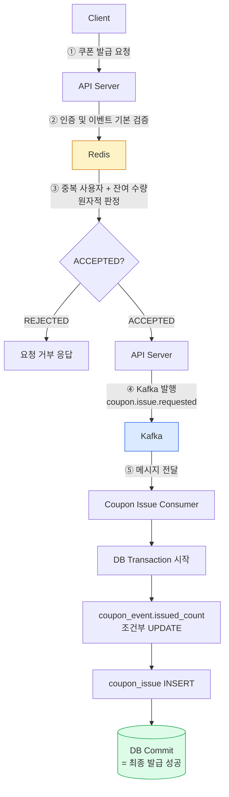
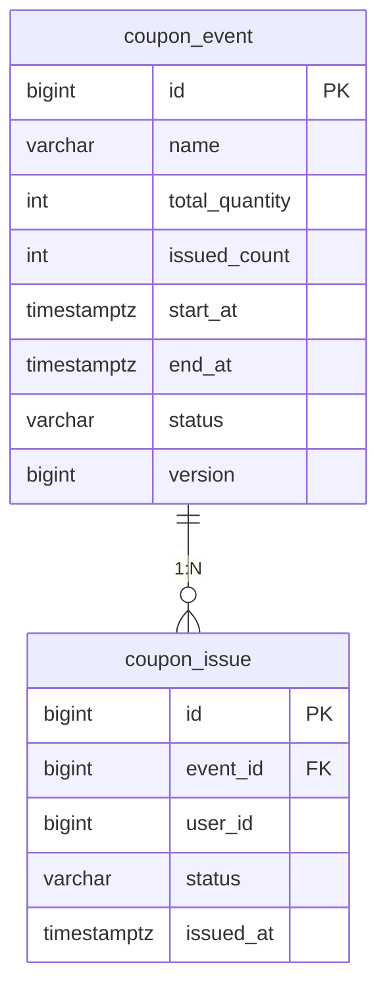

# **4주차 과제: DB 테이블과 최종 발급 정합성 보장**

## **1. 과제 목표**

이번 과제의 목표는 **Redis와 Kafka를 통과한 쿠폰 발급 요청을 DB에 정확하게 저장하고, 사용자 중복 발급과 전체 수량 초과를 방지하는 구조를 설계하는 것**이다.

1주차에서는 요청 접수와 실제 발급 처리를 분리했다.

2주차에서는 Kafka를 이용해 쿠폰 발급 요청을 비동기적으로 전달했다.

3주차에서는 Redis를 이용해 사용자 중복 요청과 수량 초과 요청을 빠르게 차단했다.

이번 4주차에서는 Consumer가 Kafka 메시지를 읽은 뒤 DB에 최종 발급 기록을 저장하는 단계를 설계한다.

기본 흐름은 다음과 같다.

```
Client
  ↓
API Server
  ↓
Redis 선착순 / 중복 판정
  ↓
ACCEPTED인 요청만 Kafka 발행
  ↓
coupon.issue.requested Topic
  ↓
Coupon Issue Consumer
  ↓
DB Transaction
  ├─ coupon_event.issued_count 증가
  └─ coupon_issue 발급 기록 저장
```

`Redis ACCEPTED`는 3주차의 `Redis SUCCESS`와 같은 단계다. 최종 발급 성공과 구분하기 위해 이번 주차에서는 `ACCEPTED`로 표기한다.

이번 과제에서 중요하게 볼 내용은 다음과 같다.

```
Redis 판정 통과와 DB 최종 발급 성공의 차이

DB가 보장해야 하는 불변식

coupon_event와 coupon_issue 테이블 설계

UNIQUE(event_id, user_id)의 역할과 한계

조건부 UPDATE를 이용한 수량 초과 방지

영향받은 row 수의 의미와 실패 원인 구분

issued_count 증가와 coupon_issue INSERT를
하나의 트랜잭션으로 묶는 이유

Kafka 중복 소비와 DB 중복 발급 방지

품절 후 중복 메시지가 재처리되는 경우

조건부 UPDATE, 비관적 락, 낙관적 락 비교

Redis, Kafka, DB의 역할과 데이터 불일치 상황
```

이번 과제의 핵심은 다음과 같다.

```
Redis는 빠른 선착순 판정을 담당한다.

Kafka는 발급 요청 메시지를 전달한다.

DB는 최종 발급 기록을 저장하고 수량 정합성을 보장한다.
```

---

## **2. 기본 상황**

서비스에서 선착순 쿠폰 이벤트를 진행한다고 가정한다.

```
이벤트 ID: 100

이벤트 이름: 여름맞이 5,000원 할인 쿠폰 이벤트

전체 쿠폰 수량: 1,000개

발급 조건:
사용자 1명당 해당 이벤트 쿠폰 1개만 발급 가능

DBMS: PostgreSQL

최종 발급 성공 기준:
coupon_issue 저장 트랜잭션 Commit
```

Redis는 정상 상황에서 최대 1,000명의 사용자만 통과시킨다.

하지만 다음과 같은 상황이 발생할 수 있다.

```
Redis 데이터 유실 또는 초기화

Redis Replica Failover 과정에서 일부 통과 기록 유실

Kafka 메시지 재처리

DB Commit 이후 Consumer Group Offset 커밋 전 Consumer 장애

애플리케이션 버그로 같은 발급 요청이 여러 번 DB에 도달
```

따라서 Redis가 앞단에서 요청을 차단하더라도 DB에는 다음 방어 장치가 필요하다.

```
사용자 중복 발급 방지
→ UNIQUE(event_id, user_id)

전체 수량 초과 방지
→ issued_count 조건부 UPDATE

두 작업의 일관성
→ DB Transaction
```

---

## **3. 이번 과제의 전제 조건**

이번 과제에서는 다음 전제를 따른다.

```
coupon_issue에는 최종 발급에 성공한 기록만 저장한다.

coupon_issue의 status는 ISSUED만 사용한다.

쿠폰 발급 취소와 재발급은 다루지 않는다.

이벤트별 전체 수량은
coupon_event.total_quantity에 저장한다.

DB에서 최종 발급된 수량은
coupon_event.issued_count에 저장한다.

모든 발급 처리는 issued_count 증가와
coupon_issue INSERT를 같은 트랜잭션에서 수행한다.

이벤트 발급 자격은 Redis 판정 시점을 기준으로 한다.
Consumer는 이벤트 상태와 기간을 다시 판정하지 않고
DB의 최종 수량과 사용자 중복 발급을 방어한다.

PostgreSQL의 기본 격리 수준인
READ COMMITTED를 기준으로 설명한다.

자동 Offset 커밋은 사용하지 않는다.
Consumer가 DB 처리 결과를 확정한 후에
Consumer Group Offset을 커밋한다고 가정한다.
```

이번 주차에서는 아래 내용의 상세 구현은 다루지 않는다.

```
requestId 기반 요청 상태 관리

Outbox Pattern

Retry Topic과 DLQ

쿠폰 발급 취소와 재발급 정책

Redis와 Kafka 사이의 원자성 보장
```

다만 이번 주차의 설계가 이후 주차의 내용과 어떻게 연결되는지는 설명해야 한다.

---

## **4. 제출 형식**

제출 파일은 아래 경로에 작성해서 PR을 생성한다.

```
submissions/Week4/기수_이름.md
```

예시는 다음과 같다.

```
submissions/Week4/13기_김기민.md
```

제출 문서에는 아래 필수 과제를 모두 포함한다.

```
과제 1. DB 최종 발급 처리 구조 그리기

과제 2. DB가 보장해야 하는 불변식 정의하기

과제 3. coupon_event와 coupon_issue 테이블 설계하기

과제 4. UNIQUE 제약의 역할과 한계 분석하기

과제 5. 조건부 UPDATE로 전체 수량 초과 방지하기

과제 6. 발급 트랜잭션과 Rollback 설계하기

과제 7. Kafka 중복 소비와 DB 중복 발급 방지 설계하기

과제 8. 품절 후 중복 메시지 재처리 분석하기

과제 9. DB 동시성 제어 방식 비교하기

과제 10. Redis, Kafka, DB 불일치 상황과
이후 주차 연결하기
```

---

# **5. 필수 과제**

---

## **과제 1. DB 최종 발급 처리 구조 그리기**

Redis 판정을 통과한 요청이 Kafka를 거쳐 DB에 최종 저장되는 전체 구조를 작성한다.

반드시 아래 구성 요소를 포함해야 한다.

```
Client

API Server

Redis

Kafka

Coupon Issue Consumer

coupon_event

coupon_issue
```

### **1. 전체 요청 처리 흐름 다이어그램**


 

### **2. Redis 판정 통과가 최종 발급 성공이 아닌 이유**

```
Redis ACCEPTED는 "이 시점 Redis 데이터 기준으로 자격이 있다"는 판정일 뿐, 실제 발급 기록이 영구 저장소에 남은 것이 아니다.
 판정 이후 Kafka 발행 실패, Consumer 처리 실패, Redis 자체의 데이터 유실(장애/Failover) 등으로 실제 DB 기록 없이 판정만 존재할 수 있다. 즉 Redis는 빠른 필터이지 영속적 발급 증명이 아니다.
```

### **3. Kafka 메시지 발행 성공이 최종 발급 성공이 아닌 이유**

```
Kafka PUBLISHED는 메시지가 브로커에 안전하게 저장됐다는 뜻일 뿐, 그 메시지가 실제로 Consumer에 의해 처리되어 DB에 반영됐는지는 보장하지 않는다. Consumer가 메시지를 소비하기 전 다운될 수도 있고, 소비 중 DB 트랜잭션이 실패해 Rollback될 수도 있다. 
즉, 발행은 "전달을 시도했다"이지 "발급이 확정됐다"가 아니다!
```

### **4. 최종 발급 성공으로 판단할 수 있는 시점**

```
DB 트랜잭션이 Commit되는 시점
```

### **5. Redis, Kafka, DB 단계의 상태 차이**

| **단계** | **의미** | **최종 발급 성공 여부** |
| --- | --- | --- |
| Redis ACCEPTED | 	Redis 기준 선착순/중복 판정 통과 | X |
| Kafka PUBLISHED | 발급 요청 메시지가 브로커에 저장됨 | X |
| DB ISSUED | 발급 기록 저장 트랜잭션이 Commit됨 | 	O  |

---

## **과제 2. DB가 보장해야 하는 불변식 정의하기**

쿠폰 발급 시스템이 장애와 동시 요청 상황에서도 지켜야 하는 조건을 불변식으로 정의한다.

이번 과제에서는 다음 세 가지 불변식을 기준으로 작성한다.

```
불변식 1.

한 사용자는 하나의 이벤트에서
쿠폰을 최대 한 번만 발급받는다.

불변식 2.

발급 수량은 0보다 작거나
전체 수량보다 많을 수 없다.

불변식 3.

issued_count 증가와 coupon_issue 저장은
함께 성공하거나 함께 실패한다.
```

### **1. 불변식이 필요한 이유**

```
Redis와 애플리케이션 로직은 정상 상황에서는 대부분의 잘못된 요청을 걸러내지만, 장애 같은 예외 상황까지 막아주지는 못한다. 이런 상황에서도 시스템이 "절대 깨져서는 안 되는 규칙"을 DB 제약 조건 수준에서 강제해야, 애플리케이션 로직의 실수나 동시성 문제와 무관하게 데이터 정합성이 보장된다.
```

### **2. 각 불변식이 깨졌을 때 발생하는 문제**

| **불변식** | **깨졌을 때 발생하는 문제** |
| --- | --- |
| 사용자별 최대 1회 발급 | 한 사용자가 쿠폰을 여러 장 받아 다른 정상 사용자의 발급 기회를 부당하게 빼앗음, 비즈니스적 손실(중복 할인) 발생 |
| 전체 수량 이하 발급 | 이벤트가 정한 예산/재고를 초과해 발급됨 → 운영팀이 약속한 수량을 지킬 수 없고 금전적 손해로 직결 |
| 수량과 발급 기록의 동시 성공·실패 | issued_count만 늘고 실제 수령자가 없는 "유령 수량 차감"이 발생하거나, 반대로 발급 기록은 있는데 수량에 반영되지 않아 실제 발급 수를 추적할 수 없게 됨 |

### **3. 각 불변식을 보호하는 DB 장치**

| **불변식** | **DB 방어 장치** |
| --- | --- |
| 사용자 중복 발급 방지 | UNIQUE(event_id, user_id) |
| 전체 수량 초과 방지 | 조건부 UPDATE ... WHERE issued_count < total_quantity + CHECK 제약 |
| 두 테이블의 일관성 | 하나의 DB Transaction으로 묶어 처리 (원자적 Commit/Rollback) |

### **4. 애플리케이션에서 중복 여부를 먼저 조회하는 것만으로 불변식을 보장할 수 없는 이유**

```
"조회 후 판단해서 INSERT"하는 방식은 조회와 INSERT 사이에 시간 간격(gap)이 존재한다. 이 간격 사이에 다른 트랜잭션이 끼어들 수 있다.
```

---

## **과제 3. coupon_event와 coupon_issue 테이블 설계하기**

쿠폰 이벤트와 최종 발급 기록을 저장할 테이블을 설계한다.

완전한 운영용 스키마를 만드는 것이 목적은 아니다. 이번 주차에서 필요한 불변식을 지킬 수 있도록 핵심 컬럼과 제약 조건을 작성한다.

### **1. coupon_event 테이블의 역할**

```
쿠폰 이벤트 자체의 메타 정보와 함께, DB 기준으로 최종 확정된 발급 수량을 관리한다. 이 테이블의 issued_count는 "지금까지 몇 장이 실제로 커밋됐는가"를 나타내는 값이다.
```

### **2. coupon_issue 테이블의 역할**

```
"어떤 사용자가 어떤 이벤트의 쿠폰을 발급받았는가"를 기록하는 발급 이력 테이블. 
```

### **3. 두 테이블의 관계를 다이어그램으로 표현하기**



### **4. coupon_event 테이블 DDL 작성하기**

아래 컬럼과 제약 조건을 포함한다.

```
id

name

total_quantity

issued_count

start_at

end_at

status

version (낙관적 락을 선택할 경우)

수량 CHECK 제약

이벤트 기간 CHECK 제약
```

```sql
  CREATE TABLE coupon_event (
      id BIGSERIAL PRIMARY KEY,

      name VARCHAR(100) NOT NULL,

      -- 전체 발급 가능 수량
      total_quantity INT NOT NULL,

      -- DB 트랜잭션이 완료된 발급 수량
      issued_count INT NOT NULL DEFAULT 0,

      start_at TIMESTAMPTZ NOT NULL,
      end_at TIMESTAMPTZ NOT NULL,

      -- READY, OPEN, CLOSED
      status VARCHAR(20) NOT NULL,

      -- 낙관적 락 선택 시 사용
      version BIGINT NOT NULL DEFAULT 0,

      created_at TIMESTAMPTZ NOT NULL DEFAULT CURRENT_TIMESTAMP,
      updated_at TIMESTAMPTZ NOT NULL DEFAULT CURRENT_TIMESTAMP,

      CONSTRAINT chk_coupon_event_quantity
          CHECK (
              total_quantity >= 0
              AND issued_count >= 0
              AND issued_count <= total_quantity
          ),

      CONSTRAINT chk_coupon_event_period
          CHECK (start_at < end_at),

      CONSTRAINT chk_coupon_event_status
          CHECK (status IN ('READY', 'OPEN', 'CLOSED'))
  );
```

### **5. coupon_issue 테이블 DDL 작성하기**

아래 컬럼과 제약 조건을 포함한다.

```
id

event_id

user_id

status

issued_at

coupon_event를 참조하는 Foreign Key

동일 이벤트의 사용자 중복 발급을 막는 UNIQUE 제약
```

```sql
  CREATE TABLE coupon_issue (
      id BIGSERIAL PRIMARY KEY,

      event_id BIGINT NOT NULL,
      user_id BIGINT NOT NULL,

      -- 이번 주차에서는 ISSUED만 사용
      status VARCHAR(20) NOT NULL DEFAULT 'ISSUED',

      issued_at TIMESTAMPTZ NOT NULL DEFAULT CURRENT_TIMESTAMP,
      created_at TIMESTAMPTZ NOT NULL DEFAULT CURRENT_TIMESTAMP,
      updated_at TIMESTAMPTZ NOT NULL DEFAULT CURRENT_TIMESTAMP,

      CONSTRAINT fk_coupon_issue_event
          FOREIGN KEY (event_id)
          REFERENCES coupon_event(id),

      CONSTRAINT chk_coupon_issue_status
          CHECK (status = 'ISSUED'),

      CONSTRAINT uk_coupon_issue_event_user
          UNIQUE (event_id, user_id)
  );
```

### **6. issued_count를 coupon_event에 별도로 저장하는 이유와 단점**

```
이유
- coupon_issue를 매번 COUNT(*)로 집계하지 않고도 남은 수량을 즉시 조회 가능
- 조건부 UPDATE의 대상이 되어 원자적으로 수량 초과를 방어할 수 있음
- Redis가 관리하는 수량과 DB의 실제 확정 수량을 비교해 불일치 여부를 모니터링 가능

단점
- 데이터 중복(정규화 위반) — 이론적으로는 coupon_issue 행 수와 항상 같아야 하는 값을 별도 컬럼으로 관리
- 한 row(coupon_event)에 UPDATE가 몰리므로 동시성이 높을 때 row lock 경합의 원인이 됨

```

---

## **과제 4. UNIQUE 제약의 역할과 한계 분석하기**

`UNIQUE(event_id, user_id)`가 어떤 문제를 막고, 어떤 문제는 막지 못하는지 분석한다.

### **1. `UNIQUE(event_id, user_id)`가 의미하는 규칙**

```
같은 event_id와 같은 user_id의 조합은 coupon_issue 테이블에 단 하나의 행만 존재할 수 있다는 규칙. 즉 "한 사용자는 한 이벤트당 발급 기록을 한 번만 가질 수 있다"를 DB 레벨에서 강제한다. event_id나 user_id 둘 중 하나만 달라도 제약 위반이 아니다.
```

### **2. 다음 INSERT의 성공 여부와 이유**

기존 데이터는 다음과 같다.

```
event_id = 100
user_id = 10
```

| **새로운 INSERT** | **성공 또는 실패** | **이유** |
| --- | --- | --- |
| event_id=100, user_id=10 | 실패 | 기존 행과 (event_id, user_id) 조합이 완전히 동일 → UNIQUE 위반 |
| event_id=100, user_id=11 | 성공 | event_id는 같지만 user_id가 다름 → 조합이 다름 |
| event_id=101, user_id=10 | 성공 | 	user_id는 같지만 event_id가 다름 → 조합이 다름 |

### **3. 중복 여부를 SELECT한 뒤 INSERT하는 방식의 Race Condition**

아래 상황을 시간 순서로 표현한다.

```
Transaction A가 user:10의 발급 기록을 조회한다.

Transaction B도 user:10의 발급 기록을 조회한다.

두 트랜잭션 모두 아직 발급 기록이 없다고 판단한다.

두 트랜잭션이 동시에 INSERT를 시도한다.
```

답변:

```
시간 ─────────────────────────────────────────▶

Transaction A: SELECT * FROM coupon_issue
                WHERE event_id=100 AND user_id=10
                → 결과 없음 (아직 발급 안 됨으로 판단)

Transaction B: SELECT * FROM coupon_issue
                WHERE event_id=100 AND user_id=10
                → 결과 없음 (A와 거의 동시에 조회, 역시 발급 안 됨으로 판단)

Transaction A: INSERT (event_id=100, user_id=10) → 성공

Transaction B: INSERT (event_id=100, user_id=10) → ??? 
                (SELECT 시점엔 "없음"으로 확인했으므로
                 애플리케이션 로직상 정상 INSERT를 시도)
```

### **4. UNIQUE 제약이 전체 수량 초과를 막을 수 없는 이유**

아래 상황을 기준으로 설명한다.

```
전체 수량: 1,000개

서로 다른 사용자: 1,001명

모든 (event_id, user_id) 조합은 서로 다름
```

```
UNIQUE(event_id, user_id)는 오직 "같은 사용자"의 중복 삽입만 감지한다. 전체 수량이 1,000개인데 서로 다른 사용자 1,001명이 요청하면 각 행의 (event_id, user_id) 조합이 모두 서로 다르기 때문에 UNIQUE 제약 관점에서는 전혀 문제가 없다. 
즉 UNIQUE는 "전체 발급 개수가 한도를 넘었는가"는 검사 대상이 아니다.
```

### **5. 사용자 중복과 전체 수량 초과를 각각 어떤 장치로 막아야 하는가?**

| **문제** | **DB 방어 장치** |
| --- | --- |
| 같은 사용자의 중복 발급 | UNIQUE(event_id, user_id) |
| 서로 다른 사용자에 의한 전체 수량 초과 | coupon_event.issued_count 조건부 UPDATE (WHERE issued_count < total_quantity) |

---

## **과제 5. 조건부 UPDATE로 전체 수량 초과 방지하기**

쿠폰 수량이 남아 있을 때만 `issued_count`를 증가시키는 조건부 UPDATE를 설계한다.

### **1. 조건부 UPDATE SQL 작성하기**

다음 조건을 만족해야 한다.

```
event_id가 일치해야 한다.

issued_count가 total_quantity보다 작을 때만 증가해야 한다.

issued_count는 1 증가해야 한다.
```

```sql
UPDATE coupon_event
SET issued_count = issued_count + 1,
    updated_at = CURRENT_TIMESTAMP
WHERE id = :eventId
  AND issued_count < total_quantity;
```

### **2. 영향받은 row 수가 의미하는 것**

```
이 UPDATE문이 "실제로 몇 개의 행을 변경했는지"를 나타내는 값. 
```

### **3. 영향받은 row 수가 1인 경우**

```
id = :eventId인 행이 존재하고, 그 시점의 issued_count < total_quantity 조건도 만족했다는 뜻. 즉 수량 확보에 성공했고, issued_count가 실제로 1 증가했다. 이 경우에만 이어서 coupon_issue INSERT를 진행하면 된다.
```

### **4. 영향받은 row 수가 0인 경우 가능한 원인**

과제 5-1의 SQL은 `event_id`와 수량 조건만 사용한다. 중복 메시지 여부는 UPDATE 결과가 0인 직접 원인이 아니라, 이후 기존 발급 기록을 조회해 구분한다.

```
1. id = :eventId에 해당하는 이벤트 행이 존재하지 않음

2. 이벤트는 존재하지만 issued_count < total_quantity 조건을 만족하지 못함 (수량 소진)
```

### **5. 다음 상황에서 UPDATE 결과를 작성하기**

과제 5-1에서 작성한 조건부 UPDATE를 사용한다고 가정한다.

| **상황** | **issued_count** | **total_quantity** | **이벤트 존재 여부** | **영향받은 row 수** | **결과** |
| --- | --- | --- | --- | --- | --- |
| A | 999 | 1,000 | 존재 | 1 | 999 → 1000으로 증가, 수량 확보 성공 |
| B | 1,000 | 1,000 | 존재 | 0 | issued_count < total_quantity 불만족 → 수량 소진 |
| C | - | - | 존재하지 않음 | 0 | WHERE id = :eventId 자체가 매칭되는 행 없음 |

### **6. 두 트랜잭션이 동시에 마지막 수량을 증가시키는 상황 분석**

```
전체 수량: 1,000개

현재 issued_count: 999

Transaction A와 Transaction B가
동시에 조건부 UPDATE 실행
```

두 트랜잭션의 실행 결과를 시간 순서 다이어그램으로 작성한다.

```
시간 ─────────────────────────────────────────▶

Transaction A: UPDATE coupon_event
                SET issued_count = issued_count + 1
                WHERE id=100 AND issued_count < 1000
                (내부적으로 해당 row에 lock 획득 시도)

Transaction B: UPDATE coupon_event
                SET issued_count = issued_count + 1
                WHERE id=100 AND issued_count < 1000
                (같은 row → A가 끝날 때까지 대기)

Transaction A: lock 획득, issued_count(999) < 1000 → 조건 만족
               issued_count = 1000으로 변경, 영향받은 row 수 = 1
               Commit → lock 해제

Transaction B: A의 Commit 이후 lock 획득
               다시 조건 평가: issued_count(1000) < 1000 → 불만족
               영향받은 row 수 = 0
```

### **7. issued_count가 total_quantity를 초과하지 않는 이유**

```
같은 row를 동시에 UPDATE하려는 트랜잭션들은 DB가 내부적으로 하나씩 순차 처리한다. 먼저 lock을 획득한 트랜잭션이 Commit(또는 Rollback)해야 다음 트랜잭션이 그 row를 갱신할 수 있고, 각 트랜잭션은 차례가 왔을 때의 최신 issued_count 값을 기준으로 조건을 재평가한다. 
그래서 항상 최신 상태를 기준으로 조건이 걸리기 때문에 issued_count가 total_quantity를 넘어설 수 없다.
```

---

## **과제 6. 발급 트랜잭션과 Rollback 설계하기**

다음 두 작업을 하나의 DB 트랜잭션으로 묶는 이유를 설명한다.

```
1. coupon_event.issued_count 증가

2. coupon_issue 발급 기록 INSERT
```

### **1. 두 작업을 서로 다른 트랜잭션으로 처리했을 때 발생할 수 있는 문제**

| **상황** | **발생하는 데이터 불일치** |
| --- | --- |
| issued_count 증가 성공, coupon_issue INSERT 실패 | 수량은 줄었는데 실제로 쿠폰을 받은 사용자 기록이 없음 |
| coupon_issue INSERT 성공, issued_count 증가 실패 | 사용자는 발급 기록을 갖고 있지만 전체 발급 수량 집계에는 반영되지 않음 → 실제보다 issued_count가 적게 잡혀 정원을 넘겨 추가 발급이 계속 허용될 수 있음 |

### **2. 하나의 트랜잭션으로 처리하는 전체 흐름**

```
Transaction 시작
  │
  ▼
조건부 UPDATE로 수량 확보
  │
  ├─ 영향받은 row 수 = 0
  │     → 기존 coupon_issue 기록 조회 (중복 메시지 여부 판단)
  │     → Commit 또는 별도 처리 후 종료
  │
  └─ 영향받은 row 수 = 1
        │
        ▼
      coupon_issue INSERT
        │
        ├─ 성공 → Commit (최종 발급 성공)
        │
        └─ UNIQUE 위반 등 실패 → Rollback
              (UPDATE로 늘렸던 issued_count도 함께 원상 복구됨)
```

### **3. 다음 SQL을 하나의 트랜잭션 흐름으로 완성하기**

```sql
-- Transaction 시작
BEGIN;

-- 1. 수량이 남아 있을 때만 issued_count 증가
UPDATE coupon_event
SET issued_count = issued_count + 1,
    updated_at = CURRENT_TIMESTAMP
WHERE id = :eventId
  AND issued_count < total_quantity;

-- 2. UPDATE 결과가 1이면 발급 기록 INSERT
INSERT INTO coupon_issue (event_id, user_id, status)
VALUES (:eventId, :userId, 'ISSUED');

-- 두 작업이 모두 성공하면 Commit
COMMIT;

```

### **4. UPDATE 성공 후 INSERT에서 UNIQUE 위반이 발생한 경우**

아래 항목을 모두 설명한다.

```
현재 트랜잭션은 어떻게 되는가?

앞에서 증가한 issued_count는 어떻게 되는가?

기존 발급 기록은 언제 조회해야 하는가?
```

답변:

```
- 현재 트랜잭션은 어떻게 되는가?
  PostgreSQL은 제약 위반이 발생한 트랜잭션을 "에러 상태"로 표시하고, 그 안에서 추가 쿼리 실행을 거부한다. 결국 해당 트랜잭션은 Rollback해야 한다.
- 앞에서 증가한 issued_count는 어떻게 되는가?
  트랜잭션 전체가 Rollback되므로, UPDATE로 증가시켰던 issued_count도 원래 값으로 자동 복구된다. 즉 "수량은 늘었는데 INSERT만 실패"하는 어중간한 상태는 발생하지 않는다.
- 기존 발급 기록은 언제 조회해야 하는가?
  현재(에러난) 트랜잭션 안에서는 조회할 수 없다. 먼저 Rollback한 뒤, 새로운 트랜잭션을 시작해서 coupon_issue에 동일한 (event_id, user_id) 기록이 있는지 조회해야 한다.
```

### **5. PostgreSQL에서 제약 조건 위반 후 같은 트랜잭션을 계속 사용할 수 없는 이유**

```
PostgreSQL은 트랜잭션 내에서 에러가 발생하면 해당 트랜잭션을 abort 상태로 전환한다. 이 상태에서는 COMMIT을 시도해도 자동으로 Rollback되며, 그 트랜잭션 안에서 추가로 어떤 쿼리를 실행해도 "current transaction is aborted" 에러만 반환한다. 
이는 트랜잭션의 원자성을 지키기 위한 설계로, 일부만 반영된 애매한 상태로 이후 쿼리가 이어지는 것을 원천 차단하기 위함이다. 그래서 반드시 명시적으로 ROLLBACK 후 새 트랜잭션을 열어야 한다.
```

### **6. 모든 발급 경로가 같은 트랜잭션을 사용해야 하는 이유**

```
발급 경로가 여러 개인데(예: 정상 신규 처리, 재시도 처리 등) 일부만 트랜잭션으로 묶고 일부는 개별 커밋으로 처리하면, 그 경로에서만 issued_count와 coupon_issue가 어긋날 수 있는 구멍이 생긴다.
```

---

## **과제 7. Kafka 중복 소비와 DB 중복 발급 방지 설계하기**

Kafka Consumer는 같은 메시지를 다시 처리할 수 있다.

아래 상황을 기준으로 분석한다.

```
1. Consumer가 발급 요청 메시지를 읽는다.

2. DB 발급 트랜잭션을 Commit한다.

3. Consumer Group Offset 커밋 전에 Consumer가 종료된다.

4. Consumer가 재시작된다.

5. 같은 메시지를 다시 읽는다.
```

### **1. 중복 소비가 발생하는 전체 흐름 다이어그램**

```
Consumer가 메시지 수신 (event_id=100, user_id=10)
  │
  ▼
DB 발급 트랜잭션 Commit
  │  (issued_count 증가 + coupon_issue INSERT 완료)
  ▼
Consumer Group Offset 커밋 시도 전, Consumer 장애 발생
  │
  ▼
Consumer 재시작 (또는 다른 인스턴스가 리밸런싱으로 파티션 이어받음)
  │
  ▼
Offset이 아직 커밋 안 된 지점부터 다시 읽음
  │
  ▼
같은 메시지 (event_id=100, user_id=10) 재수신
  │
  ▼
동일한 DB 발급 트랜잭션 재시도
```

### **2. DB에 UNIQUE 제약이 없다면 발생하는 문제**

```
재처리된 메시지가 coupon_issue에 (event_id=100, user_id=10)을 다시 INSERT하는 걸 막을 방법이 없게 된다.
```

### **3. `UNIQUE(event_id, user_id)`가 중복 소비를 방어하는 과정**

```
재처리된 메시지가 조건부 UPDATE를 통과하더라도(아직 수량이 남아있는 경우), 이어지는 coupon_issue INSERT 시점에 이미 같은 (event_id, user_id) 행이 존재하므로 DB가 제약 위반으로 INSERT를 거부한다.
```

### **4. UNIQUE 위반을 단순 장애가 아니라 이미 처리된 메시지로 판단하기 위한 조건**

```
UNIQUE 위반이 발생한 직후, 위반이 하필 지금 처리 중인 메시지와 동일한 (event_id, user_id) 조합 때문인지를 확인해야 한다.
```

### **5. 제약 위반 후 Consumer가 수행해야 하는 처리 순서**

```
1. 현재 트랜잭션을 Rollback한다 

2. 새 트랜잭션을 열어 coupon_issue에서 동일한 (event_id, user_id) 기록을 조회한다

3. 기록이 존재하면 → 이미 처리된 메시지로 간주, 정상 처리로 취급

4. Consumer Group Offset을 커밋하고 다음 메시지로 진행 (재시도 불필요)
```

### **6. DB 처리보다 Consumer Group Offset이 먼저 커밋되면 안 되는 이유**

```
Offset을 먼저 커밋해버리면, 만약 그 직후 DB 트랜잭션이 실패하거나 Consumer가 죽더라도 Kafka 입장에서는 "이미 처리 완료된 메시지"로 간주해 다시 전달하지 않는다.
```

### **7. `UNIQUE(event_id, user_id)`와 requestId 기반 멱등성의 차이**

```
- UNIQUE(event_id, user_id)
  "비즈니스 결과" 기준의 멱등성. "같은 사용자가 같은 이벤트에서 두 번 발급받을 수 없다"는 도메인 규칙 자체를 보장한다. 어떤 요청(메시지)이 원인이었는지는 구분하지 않고, 오직 최종 상태(이 사용자가 이 이벤트 쿠폰을 가졌는가)만 본다.
- requestId 기반 멱등성
  "요청 자체"를 식별 단위로 삼아, 정확히 동일한 요청(메시지)이 여러 번 들어와도 정확히 한 번만 처리된 것과 같은 결과를 보장한다. 
```

---

## **과제 8. 품절 후 중복 메시지 재처리 분석하기**

조건부 UPDATE를 먼저 실행하는 구조에서는 중복 메시지가 항상 INSERT까지 도달하는 것은 아니다.

아래 상황을 기준으로 분석한다.

```
이벤트 ID: 100

전체 수량: 1개

현재 issued_count: 1

coupon_issue에
(event_id=100, user_id=10) 기록이 이미 존재

user:10의 Kafka 메시지가 다시 전달됨
```

### **1. 조건부 UPDATE 결과와 그 이유**

```
영향받은 row 수 = 0
-> issued_count(1)이 이미 total_quantity(1)와 같아서 issued_count < total_quantity 조건을 만족하지 못하기 때문이다.
```

### **2. coupon_issue INSERT까지 실행되는가?**

```
실행되지 않는다.
```

### **3. 이 상황에서 UNIQUE 제약 위반이 발생하는가?**

```
발생하지 않는다. INSERT 자체가 실행되지 않았기 때문이다.
```

### **4. 영향받은 row 수가 0이라고 무조건 품절로 판단하면 안 되는 이유**

```
UPDATE 결과가 0인 원인은 두 가지가 섞여 있다.
- 진짜 품절 (이 요청이 처음 온 새 사용자인데 이미 수량이 다 나감)
- 이미 처리된 중복 메시지 (이 사용자는 이미 발급받았고, 재처리된 메시지가 다시 온 것)
```

### **5. 기존 coupon_issue 기록을 추가로 확인해야 하는 이유**

```
UPDATE 결과 0이 "진짜 실패(품절/이벤트 없음)"인지 "이미 성공적으로 처리된 요청의 재시도"인지는 coupon_issue에 해당 (event_id, user_id) 행이 있는지를 봐야만 구분할 수 있다. 기록이 있으면 이 사용자는 이미 정상적으로 쿠폰을 받은 것이므로, 재처리된 메시지는 실패가 아니라 중복 확인 후 정상 종료로 처리해야 한다.
```

### **6. 다음 두 상황을 구분하는 처리 흐름 작성하기**

각 상황에서 메시지 처리 완료 여부와 Consumer Group Offset 커밋 여부도 함께 작성한다.

```
상황 A

조건부 UPDATE 결과 = 0
동일한 coupon_issue 기록 존재

상황 B

조건부 UPDATE 결과 = 0
동일한 coupon_issue 기록 없음
```

답변:

```
두 경우 모두 Offset은 커밋한다. 재시도 대상은 "일시적 DB 오류" 같은 경우이지, 비즈니스적으로 이미 확정된 실패/중복은 재시도해도 결과가 바뀌지 않기 때문이다.
```

### **7. 전체 Consumer 처리 흐름 완성하기**

아래 두 경로를 모두 포함해야 한다.

```
조건부 UPDATE 결과 = 0인 경로

조건부 UPDATE 결과 = 1인 경로
```

```
메시지 수신 (event_id, user_id)
  │
  ▼
Transaction 시작
  │
  ▼
조건부 UPDATE (issued_count 증가 시도)
  │
  ├─ 결과 = 1
  │     │
  │     ▼
  │   coupon_issue INSERT
  │     │
  │     ├─ 성공 → Commit → Offset 커밋 → 처리 완료
  │     │
  │     └─ UNIQUE 위반 → Rollback
  │           → 새 트랜잭션에서 기존 기록 조회
  │           → 기록 존재 → 중복 메시지로 정상 처리 → Offset 커밋
  │           → 기록 없음 → 예상치 못한 오류 → 별도 처리(재시도/알림)
  │
  └─ 결과 = 0
        │
        ▼
      기존 coupon_issue 기록 조회 (event_id, user_id)
        │
        ├─ 기록 존재 (상황 A)
        │     → 이미 처리된 메시지 → 정상 종료 → Offset 커밋
        │
        └─ 기록 없음 (상황 B)
              → 실제 품절/이벤트 없음 → 실패 기록 → Offset 커밋
```

---

## **과제 9. DB 동시성 제어 방식 비교하기**

다음 세 가지 방식으로 쿠폰 수량을 제어할 수 있다.

```
조건부 UPDATE

비관적 락

낙관적 락
```

### **1. 조건부 UPDATE 방식 설명**

```
WHERE 절에 조건을 걸어 "조건을 만족하는 순간에만" 값을 변경하는 방식. 
```

### **2. 비관적 락 방식 설명과 SQL 예시**

```sql
BEGIN;

SELECT *
FROM coupon_event
WHERE id = :eventId
FOR UPDATE;   -- 이 row에 대한 배타적 락 획득, 다른 트랜잭션은 대기

-- 애플리케이션에서 issued_count < total_quantity 확인 후
UPDATE coupon_event
SET issued_count = issued_count + 1
WHERE id = :eventId;

COMMIT;   -- 락 해제
```

설명:

```
데이터를 읽는 시점에 "이 row는 내가 수정할 것"이라고 미리 락을 걸어, 다른 트랜잭션이 같은 row를 수정(경우에 따라 조회도)하지 못하게 막는다. 락을 획득하지 못한 트랜잭션은 락이 풀릴 때까지 대기한다. "충돌이 자주 날 것"이라 가정하고 미리 막는 접근.
```

### **3. 낙관적 락 방식 설명과 SQL 예시**

```sql
-- 1. 조회 시 현재 version도 함께 읽음
SELECT issued_count, total_quantity, version
FROM coupon_event
WHERE id = :eventId;

-- 2. UPDATE 시 조회했던 version과 같은지 확인
UPDATE coupon_event
SET issued_count = issued_count + 1,
    version = version + 1
WHERE id = :eventId
  AND version = :oldVersion
  AND issued_count < total_quantity;
-- 영향받은 row 수 = 0이면 → 그 사이 다른 트랜잭션이 먼저 갱신 → 재시도 필요
```

설명:

```
락을 미리 걸지 않고, 충돌은 드물 것이라 가정하고 진행한다. 데이터를 읽을 때 버전 값을 함께 읽어두고, UPDATE 시점에 그 버전이 아직 그대로인지 확인한다. 그 사이 누군가 먼저 수정했다면 UPDATE는 실패하고, 애플리케이션이 재시도해야 한다.
```

### **4. 세 방식 비교표**

| **구분** | **조건부 UPDATE** | **비관적 락** | **낙관적 락** |
| --- | --- | --- | --- |
| 수량을 보호하는 방법 | WHERE 조건 + 원자적 UPDATE | SELECT ... FOR UPDATE로 사전 락 | version 비교로 사후 충돌 감지 |
| 충돌 시 동작 |영향받은 row 수 0 반환, 별도 락 대기 없음  | 락 해제까지 대기 | UPDATE 실패, 재시도 필요 |
| 재시도 필요 여부 | 불필요 | 불필요 | 필요 |
| 장점 | 	구현 단순 | 처리 순서를 이해하기 쉽고 안전 | 락 경합/대기가 적은 환경에서 유리 |
| 단점 | 같은 row에 갱신 집중 시 내부 대기 발생 가능 | 요청 몰리면 대기 시간 길어지고 처리량 급감 | 충돌 많으면 재시도 폭증 |
| 선착순 이벤트 적합성 | 적합 | 부적합 | 부적합 |

### **5. 하나의 이벤트 row에 요청이 집중될 때 발생하는 문제**

```
선착순 이벤트 특성상 수천~수만 명이 정확히 같은 coupon_event 행을 동시에 UPDATE하려고 시도한다. 세 방식 모두 결국 이 단일 row에 대한 쓰기는 DB 내부적으로 직렬화될 수밖에 없어서, 순간적으로 대량의 트랜잭션이 그 row의 lock을 기다리는 핫스팟(hot row) 병목이 발생한다. 
```

### **6. 이번 구조에서 조건부 UPDATE를 선택하는 이유**

```
조건부 UPDATE는 SELECT 없이 한 번의 SQL로 조건 확인과 값 변경을 원자적으로 처리하므로 구현이 단순하고, 명시적 락 관리(FOR UPDATE의 대기, 낙관적 락의 재시도 루프)가 필요 없다.
```

### **7. 세 방식과 UNIQUE 제약의 역할이 다른 이유**

```
조건부 UPDATE, 비관적 락, 낙관적 락은 모두 "같은 row(coupon_event)에 대한 동시 수정"을 어떻게 안전하게 처리할지, 즉 수량이라는 하나의 값의 정합성을 다루는 기법이다. 
반면 UNIQUE 제약은 서로 다른 두 개의 값(event_id, user_id) 조합이 중복되지 않게 하는 문제, 즉 "동일 사용자의 중복 행 삽입"을 막는 별개의 장치다. 
전자는 수량(a single numeric value)의 동시성 제어이고, 후자는 관계형 무결성(중복 row 방지) 문제라 서로 대체할 수 없고 함께 필요하다.
```

---

## **과제 10. Redis, Kafka, DB 불일치 상황과 이후 주차 연결하기**

Redis, Kafka, DB는 서로 다른 시스템이므로 상태가 일시적으로 달라질 수 있다.

Kafka 상태는 발행된 레코드의 존재 여부와 Consumer Group Offset 커밋 여부를 구분해서 작성한다. Kafka 레코드가 존재한다는 사실만으로 처리 대기 상태라고 판단하지 않는다.

### **1. Redis 통과 후 Kafka 발행 실패 상황**

아래 세 시스템에 남는 상태를 작성한다.

| **시스템** | **남아 있는 상태** |
| --- | --- |
| Redis | 	사용자가 "통과 사용자 Set"에 존재 |
| Kafka | 	발행 실패로 레코드 없음 |
| DB | 발급 기록 없음 |

### **2. Kafka 발행 후 DB 저장 실패 상황**

| **시스템** | **남아 있는 상태** |
| --- | --- |
| Redis | 통과 기록 존재 |
| Kafka | 	발행된 레코드 존재 |
| DB | 발급 기록 없음 |

### **3. DB 저장 후 Redis 데이터 유실 상황**

| **시스템** | **남아 있는 상태** |
| --- | --- |
| Redis | 	통과 기록 없음 |
| DB | 발급 기록 존재 |

### **4. 최종 발급 여부를 판단할 때 DB를 기준으로 해야 하는 이유**

```
Redis는 빠른 판정을 위한 휘발성/캐시성 저장소로 유실·초기화될 수 있고, Kafka는 메시지 전달 경로일 뿐 "처리 완료"를 보장하지 않는다. 
반면 DB는 트랜잭션과 제약 조건으로 정합성이 보장되는 유일한 영속 저장소다. 
따라서 "이 사용자가 실제로 쿠폰을 받았는가"에 대한 신뢰 가능한 단일 진실 공급원은 DB뿐이다.
```

### **5. Redis, Kafka, DB의 역할 비교표**

| **구분** | **Redis** | **Kafka** | **DB** |
| --- | --- | --- | --- |
| 주 역할 | 빠른 선착순/중복 판정 | 발급 요청 메시지 전달 | 최종 발급 기록 저장 및 정합성 보장 |
| 저장하는 상태 | 통과 사용자 Set | 발급 요청 레코드, Consumer Group Offset | issued_count, coupon_issue 행 |
| 성공이 의미하는 것 | ACCEPTED | PUBLISHED | ISSUED, 최종 확정 |
| 강점 |  빠른 응답 | 비동기 전달 | 강한 일관성 |
| 한계 | 데이터 유실/초기화 가능 | 처리 완료를 보장하지 않음 | 처리량이 상대적으로 낮음 |

### **6. 5주차 requestId 기반 멱등성에서 해결할 문제**

```
현재 UNIQUE 제약은 "같은 사용자의 중복 발급"이라는 비즈니스 결과만 막아준다. 하지만 "그 특정 요청이 정확히 어떻게 처리되었는지(성공/실패/처리중), 클라이언트에게 무엇을 응답해야 하는지"는 추적하지 못한다. 
5주차에서는 requestId로 각 요청 자체를 식별해, 동일 요청이 여러 번 들어와도 정확히 같은 응답을 재현하고 요청 단위의 처리 상태를 관리하는 문제를 다룬다.
```

### **7. 6주차 Outbox Pattern에서 해결할 문제**

```
DB에 발급 기록을 저장한 뒤, 이 사실을 다른 서비스(알림, 통계 등)에 이벤트로 알려야 할 때, "DB 저장"과 "이벤트 발행"이 별도의 작업이라 하나만 성공하고 다른 하나는 실패하는 불일치가 생길 수 있다. 6주차 Outbox Pattern은 DB 트랜잭션 안에서 이벤트를 outbox 테이블에 함께 저장함으로써, "발급 기록 저장"과 "후속 이벤트 발행 예약"을 원자적으로 묶는 문제를 다룬다.
```

### **8. Outbox Pattern이 Redis 판정과 최초 Kafka 발행 사이를 원자적으로 묶어주는 것은 아닌 이유**

```
Outbox Pattern은 DB 트랜잭션 내부에서 "테이블 저장 + 이벤트 발행 예약"을 묶어주는 기법이다. 하지만 Redis 판정(ACCEPTED)과 최초 Kafka 발행(API Server → Kafka)은 애초에 DB 트랜잭션의 범위 밖에서 일어나는 별개의 시스템 간 상호작용이다. Redis도, 최초 발행 시점의 Kafka도 Outbox 테이블이 속한 DB 트랜잭션에 참여하지 않으므로, Outbox Pattern으로는 이 구간의 원자성을 보장할 수 없다. 이 구간(Redis 판정 ↔ Kafka 발행)의 원자성 문제는 별도 설계가 필요하다고 문서에서도 명시하고 있다.
```

### **9. 8주차 Retry와 DLQ에서 해결할 문제**

```
일시적인 DB 오류(커넥션 장애, 타임아웃 등)처럼 재시도하면 해결될 수 있는 실패를 어떻게 안전하게 재시도할지, 그리고 여러 번 재시도해도 계속 실패하는 메시지를 어떻게 별도로 격리(DLQ)해서 무한 재시도로 인한 장애 전파를 막을지를 다룬다. 
또한 4주차에서 언급된 "Redis-DB 불일치"처럼 재처리로 자동 복구되지 않는 상황을 별도 절차로 다루는 문제도 포함된다.
```

---