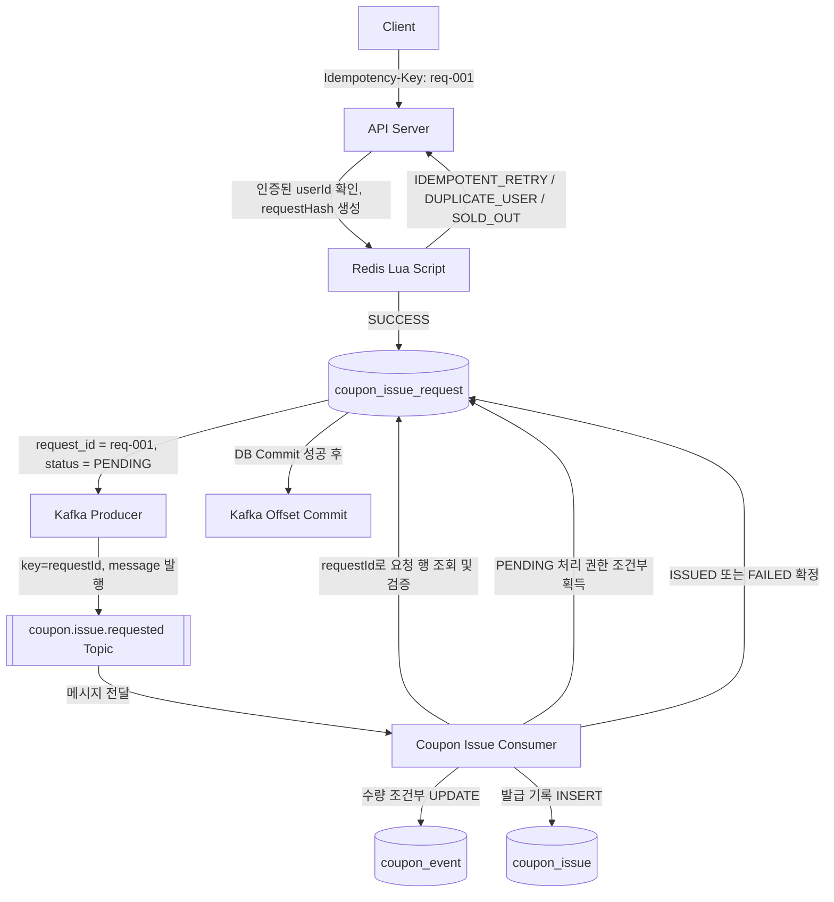
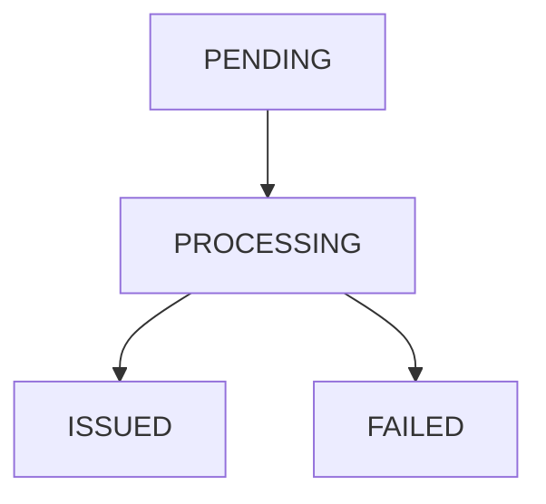
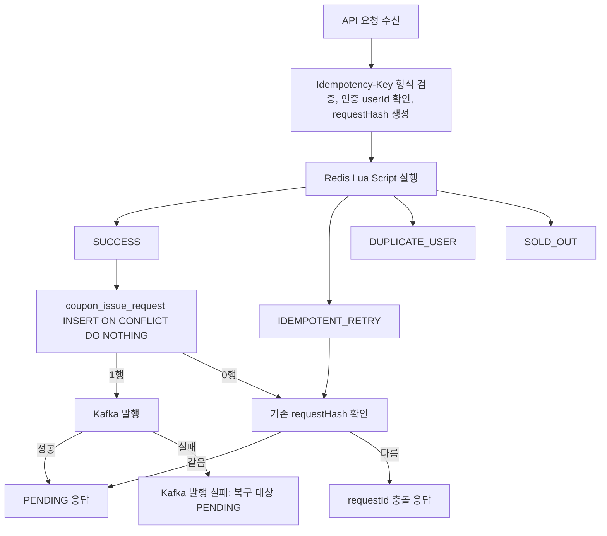
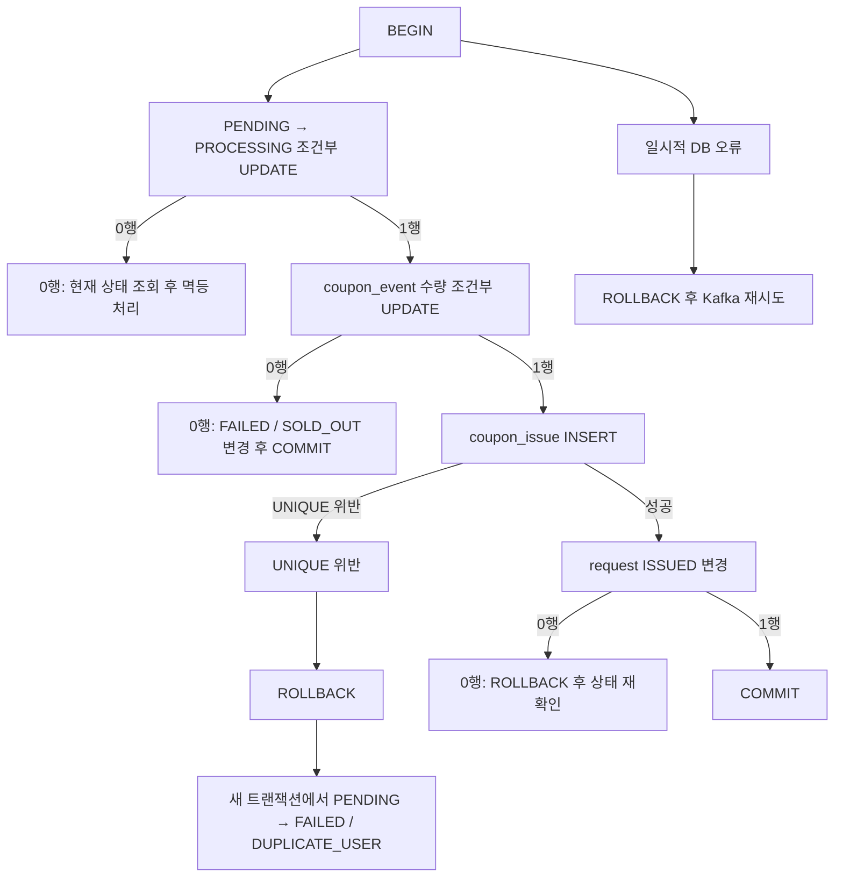

## **과제 1. requestId 기반 전체 멱등 처리 구조 그리기**

Client의 최초 요청부터 Kafka Offset Commit까지의 전체 흐름을 다이어그램으로 작성한다.

반드시 아래 구성 요소를 포함해야 한다.

```
Client

Idempotency-Key

API Server

Redis Lua Script

coupon_issue_request

Kafka Producer

coupon.issue.requested Topic

Coupon Issue Consumer

coupon_event

coupon_issue

Kafka Offset Commit
```

### **1. 전체 요청 처리 흐름 다이어그램**



### **2. 하나의 requestId가 전체 흐름에서 어떻게 전달되는지 작성하기**

아래 흐름을 완성한다.

```
HTTP Idempotency-Key
        |
        v
API Server 내부 requestId
        |
        v
coupon_issue_request.request_id
        |
        v
Kafka Message requestId
        |
        v
Consumer 멱등 처리
```

### **3. 각 구성 요소의 역할**

| **구성 요소** | **역할** |
| --- | --- |
| Redis | 선착순 수량과 동일 사용자 중복 여부를 앞단에서 빠르게 원자적으로 판정한다. |
| Kafka | API Server와 Consumer를 분리하고, 순간적인 요청 폭주를 메시지로 완충한다. |
| coupon_issue_request | requestId 기준으로 요청의 상태, 결과, 실패 사유, requestHash를 저장한다. |
| coupon_event | 쿠폰 이벤트의 전체 수량과 DB 기준 발급 수량을 저장하고 조건부 UPDATE로 수량 초과를 막는다. |
| coupon_issue | 실제 발급 성공 기록을 저장하며 `UNIQUE(event_id, user_id)`로 사용자 중복 발급을 막는다. |
| Kafka Offset | Consumer가 Kafka 메시지를 어디까지 처리했는지 나타내는 소비 위치이다. |

### **4. 각 단계의 성공이 의미하는 것**

| **단계** | **의미** | **최종 발급 성공 여부** |
| --- | --- | --- |
| Redis `SUCCESS` | Redis 기준 선착순과 사용자 중복 판정을 통과했다. | 아니오 |
| request `PENDING` | 요청 행이 생성되었지만 최종 처리는 끝나지 않았다. | 아니오 |
| request `PROCESSING` | Consumer가 처리 권한을 얻어 발급 트랜잭션을 진행 중이다. | 아니오 |
| request `ISSUED` | 수량 증가, 발급 기록 저장, 요청 상태 변경이 함께 Commit되었다. | 예 |
| request `FAILED` | 품절, 사용자 중복 등 최종 실패가 확정되었다. | 아니오 |
| Kafka Offset Commit | Kafka 소비 위치가 저장되었다. 비즈니스 성공 자체를 의미하지 않는다. | 아니오 |

### **5. 최종 쿠폰 발급 성공으로 판단할 수 있는 시점**

```
DB 트랜잭션 안에서 coupon_event.issued_count 증가, coupon_issue 발급 기록 저장,
coupon_issue_request.status = ISSUED 변경이 모두 Commit된 시점이다.
Redis SUCCESS나 Kafka 발행 성공만으로는 최종 발급 성공이라고 판단할 수 없다.
```

### **6. 요청이 여러 번 도착해도 최종 결과가 한 번만 반영되어야 한다는 의미**

```
같은 requestId의 API 재시도, Kafka 재전달, 중복 발행, 재처리가 발생해도
최종적으로 coupon_issue 발급 기록과 coupon_event 수량 증가는 한 번만 반영되어야 한다는 뜻이다.
중복 전달을 완전히 없애는 것이 아니라, 중복 전달이 와도 DB의 최종 비즈니스 결과가 한 번만 확정되게 만든다.
```

---

## **과제 2. 중복 유형과 멱등성 경계 구분하기**

같아 보이는 중복도 원인과 방어 장치가 다르다.

아래 상황을 읽고 각각 어떤 중복인지 구분한다.

### **1. 상황별 중복 유형 분석**

| **상황** | **같은 논리적 요청인가?** | **식별 기준** | **주요 방어 장치** |
| --- | --- | --- | --- |
| 응답 유실 후 같은 requestId로 API 재시도 | 예 | requestId | API 서버 멱등성, coupon_issue_request |
| 반복 클릭으로 다른 requestId가 생성됨 | 아니오 | eventId + userId | Redis 사용자 판정, `UNIQUE(event_id, user_id)` |
| 애플리케이션이 같은 requestId 메시지를 `send()` 두 번 호출 | 예 | Kafka message의 requestId | Consumer 멱등성, 조건부 상태 전이 |
| DB Commit 후 Offset Commit 전 장애로 같은 Record 재전달 | 예 | requestId, 같은 Kafka Record | Consumer 멱등성, 최종 상태 확인 |
| 원본 Topic과 Retry Topic에 같은 requestId가 존재 | 예 | requestId | Consumer 멱등성, DB 조건부 UPDATE |
| 같은 requestId가 다른 eventId에 재사용됨 | 아니오, 잘못된 키 재사용 | requestId + requestHash | requestHash 검증, 발급 금지 |

### **2. 같은 요청과 같은 사용자의 차이**

아래 두 상황의 차이를 설명한다.

```
상황 A
requestId = req-001
이 요청이 여러 번 전달됨

상황 B
requestId = req-A, req-B, req-C
모두 eventId = 100, userId = 10
```

답변:

```
상황 A는 같은 논리적 요청이 여러 번 전달된 것이다. requestId가 같으므로 기존 요청 상태를 확인하고
새로운 발급 작업을 만들지 않아야 한다.

상황 B는 같은 사용자가 같은 이벤트에 서로 다른 요청을 여러 번 만든 것이다. requestId 기준으로는
서로 다른 요청이지만, 비즈니스 규칙상 한 사용자에게 같은 이벤트 쿠폰은 한 번만 발급되어야 한다.
따라서 Redis의 eventId + userId 판정과 DB의 UNIQUE(event_id, user_id)가 막아야 한다.
```

### **3. 중복 방어 장치별 역할 비교**

| **장치** | **식별 기준** | **막는 문제** | **막지 못하는 문제** |
| --- | --- | --- | --- |
| Redis 사용자 판정 | eventId + userId, 저장된 requestId | 같은 사용자가 선착순 자리를 여러 번 차지하는 문제 | Redis 유실, Kafka 뒤쪽 중복 처리 |
| requestId | 동일한 논리적 요청 ID | 같은 API 요청 재시도, 같은 요청 메시지 중복 처리 | 다른 requestId로 들어온 같은 사용자 중복 요청 |
| requestHash | requestId + 요청 의미 | 같은 requestId를 다른 eventId/userId에 재사용하는 오류 | 정상적인 다른 requestId 중복 사용자 요청 |
| `UNIQUE(event_id, user_id)` | eventId + userId | 최종 사용자 중복 발급 | 동일 requestId의 진행 상태와 결과 반환 |
| Kafka Partition + Offset | Partition, Offset, Message Key | 순서 처리와 소비 위치 관리 | 비즈니스 기준 중복 요청 판단 |

### **4. Kafka Producer 멱등성이 막는 중복**

다음 흐름을 기준으로 설명한다.

```
애플리케이션이 send() 한 번 호출
→ Broker 저장 성공
→ ACK 유실
→ Producer 내부 재시도
```

```
Producer 멱등성은 애플리케이션이 send()를 한 번 호출한 뒤 Producer 내부에서 같은 전송 요청을
다시 보내는 경우를 막는다. 최초 전송과 내부 재시도에는 같은 Producer ID와 Sequence Number가
사용되므로 Broker는 이미 저장한 Record의 재전송으로 판단하고 중복 저장하지 않는다.
```

### **5. 애플리케이션이 send()를 두 번 호출하면 Producer 멱등성으로 막을 수 없는 이유**

```java
kafkaTemplate.send(topic, message);
kafkaTemplate.send(topic, message);
```

```
애플리케이션이 send()를 두 번 호출하면 Kafka Producer는 이를 서로 다른 두 개의 전송 요청으로 본다.
각 send()에는 서로 다른 Sequence Number가 붙기 때문에 Broker는 두 번째 호출을 내부 재시도가 아니라
정상적인 새 Record로 판단한다. 따라서 Producer 멱등성만으로는 막을 수 없고, 메시지의 requestId를
기준으로 Consumer에서 한 번 더 방어해야 한다.
```

### **6. requestId와 Kafka Partition + Offset의 차이**

```
requestId:
같은 논리적 비즈니스 요청을 식별하는 값이다. Topic이나 Offset이 달라도 같은 requestId면 같은 요청으로 본다.

Partition + Offset:
Kafka 안에서 특정 Record의 위치를 나타내는 값이다. 메시지 소비 위치를 관리할 수 있지만 비즈니스 요청의 동일성을 보장하지 않는다.
```

### **7. Consumer 멱등성의 기준을 Offset이 아니라 requestId로 두어야 하는 이유**

아래 상황을 포함해서 설명한다.

```
원본 Topic
Partition 0 / Offset 100 / req-001

Retry Topic
Partition 2 / Offset 35 / req-001
```

```
원본 Topic과 Retry Topic의 Partition과 Offset은 다르지만, 둘 다 requestId가 req-001이면 같은 비즈니스 요청이다.
Consumer가 Offset 기준으로만 판단하면 서로 다른 메시지라고 보고 같은 발급을 두 번 시도할 수 있다.
따라서 Consumer 멱등성은 Kafka 위치가 아니라 requestId와 DB 요청 상태를 기준으로 판단해야 한다.
```

---

## **과제 3. Idempotency-Key와 requestHash 설계하기**

HTTP API에서 동일한 논리적 요청의 재시도를 식별할 수 있도록 `Idempotency-Key`와 `requestHash`를 설계한다.

### **1. Idempotency-Key의 의미**

```
Idempotency-Key는 클라이언트가 동일한 요청의 재시도임을 서버에 알려주기 위해 전달하는 고유 식별자이다.
HTTP API에서는 Idempotency-Key 헤더로 전달하고, 서버 내부에서는 이 값을 requestId로 사용한다.
```

### **2. 누가 requestId를 생성해야 하는가?**

다음 두 방식을 비교하고 이번 구조에 더 적합한 방식을 선택한다.

```
방식 A
Client가 요청 전 requestId 생성

방식 B
API Server가 요청을 받은 뒤 requestId 생성
```

| **방식** | **장점** | **단점** |
| --- | --- | --- |
| Client 생성 | 응답 유실 후 같은 논리 요청을 같은 키로 재시도할 수 있다. | 클라이언트가 키 재사용 규칙을 지켜야 한다. |
| API Server 생성 | 서버가 형식과 생성 정책을 통제하기 쉽다. | 응답을 받기 전 장애가 나면 클라이언트가 기존 requestId를 알 수 없어 같은 요청 재시도가 어렵다. |

내가 선택한 방식:

```
Client가 요청 전 requestId를 생성하고 Idempotency-Key로 전달하는 방식
```

선택한 이유:

```
네트워크 Timeout이나 응답 유실 후에도 클라이언트가 최초 요청에 사용한 Idempotency-Key를 그대로
재사용할 수 있어야 서버가 같은 논리적 요청으로 판단할 수 있기 때문이다.
```

### **3. 같은 requestId를 재사용해야 하는 상황과 새로 생성해야 하는 상황**

| **상황** | **같은 requestId 재사용 또는 새 requestId 생성** | **이유** |
| --- | --- | --- |
| 네트워크 Timeout 후 동일 작업 재시도 | 같은 requestId 재사용 | 서버 처리 여부가 모호하므로 같은 요청으로 확인해야 한다. |
| 응답 유실 후 동일 작업 재시도 | 같은 requestId 재사용 | 서버가 이미 처리했을 수 있으므로 기존 상태를 반환받아야 한다. |
| 모바일 앱 재연결 후 동일 작업 전송 | 같은 requestId 재사용 | 연결만 끊겼을 뿐 같은 논리적 작업이기 때문이다. |
| 다른 쿠폰 이벤트 발급 요청 | 새 requestId 생성 | 요청 의미가 다르다. |
| 기존 요청을 취소하고 새로운 작업 시작 | 새 requestId 생성 | 이전 요청의 재시도가 아니라 새로운 작업이다. |

### **4. requestId의 형식과 검증 규칙 설계하기**

아래 항목을 포함한다.

```
허용 형식

최대 길이

빈 값 처리

허용하지 않는 문자

DB 유일성 보장 방식
```

답변:

```
허용 형식: UUID 또는 충분히 긴 랜덤 문자열
최대 길이: 128자 이하
빈 값 처리: 필수 헤더이므로 없거나 빈 문자열이면 400 Bad Request
허용하지 않는 문자: 제어 문자, 공백만 있는 값, 로그/헤더 파싱을 깨뜨릴 수 있는 문자
DB 유일성 보장 방식: coupon_issue_request.request_id를 Primary Key로 둔다.
```

### **5. requestHash를 만드는 Canonical String 작성하기**

이번 과제의 기준은 다음과 같다.

```
작업 종류: COUPON_ISSUE
이벤트 ID: 100
인증된 사용자 ID: 10
```

Canonical String:

```
COUPON_ISSUE|eventId=100|userId=10
```

SHA-256 결과를 저장할 컬럼:

```
coupon_issue_request.request_hash
```

### **6. 전체 JSON 문자열을 그대로 Hash하면 안 되는 이유**

아래 두 JSON을 기준으로 설명한다.

```json
{ "eventId": 100, "userId": 10 }
```

```json
{"userId":10,"eventId":100}
```

```
두 JSON은 의미상 같은 요청이지만 공백, 필드 순서, 직렬화 방식이 달라 문자열은 다르다.
전체 JSON 문자열을 그대로 Hash하면 같은 의미의 요청이 서로 다른 Hash가 될 수 있다.
따라서 의미 있는 필드만 정해진 순서와 형식으로 만든 Canonical String을 Hash해야 한다.
```

### **7. requestHash에 포함할 값과 포함하지 않을 값 구분하기**

| **값** | **포함 여부** | **이유** |
| --- | --- | --- |
| 작업 종류 `COUPON_ISSUE` | 포함 | 같은 ID라도 작업 종류가 다르면 다른 요청이다. |
| eventId | 포함 | 어떤 쿠폰 이벤트 발급인지 결정하는 핵심 값이다. |
| 인증된 userId | 포함 | 실제 발급 대상 사용자를 결정하는 핵심 값이다. |
| 요청 전송 시각 | 제외 | 재시도마다 달라질 수 있는 값이다. |
| Trace ID | 제외 | 관측용 값이며 요청 의미가 아니다. |
| 매번 바뀌는 nonce | 제외 | 재시도마다 달라져 멱등성을 깨뜨린다. |
| Gateway가 추가한 가변 Header | 제외 | 요청 의미가 아니고 환경에 따라 달라진다. |

### **8. Request Body의 userId를 requestHash에 그대로 사용하면 안 되는 이유**

```
Request Body의 userId는 클라이언트가 조작할 수 있다. 실제 발급 대상은 인증을 통해 확인된 userId여야 한다.
따라서 requestHash에는 Body의 userId가 아니라 인증된 사용자 ID를 포함해야 한다.
```

### **9. 같은 requestId에 다른 내용이 들어온 경우 처리 설계**

```
기존 요청
requestId = req-001
requestHash = hash(COUPON_ISSUE|100|10)

새 요청
requestId = req-001
requestHash = hash(COUPON_ISSUE|200|10)
```

아래 항목을 작성한다.

```
HTTP Status Code: 409 Conflict

에러 코드: IDEMPOTENCY_KEY_REUSED_WITH_DIFFERENT_REQUEST

Kafka 발행 여부: 발행하지 않는다.

기존 요청 상태 변경 여부: 변경하지 않는다.

사용자 응답: 같은 Idempotency-Key가 다른 요청 내용에 재사용되었음을 알린다.
```

---

## **과제 4. coupon_issue_request 테이블과 상태 전이 설계하기**

동일한 요청의 처리 상태와 최종 결과를 저장하기 위한 `coupon_issue_request` 테이블을 설계한다.

### **1. coupon_issue_request와 coupon_issue의 역할 차이**

| **테이블** | **저장하는 대상** | **표현할 수 있는 상태** |
| --- | --- | --- |
| coupon_issue_request | 요청 자체의 생명주기, 상태, 결과, 실패 사유 | PENDING, PROCESSING, ISSUED, FAILED |
| coupon_issue | 실제 발급 성공 기록 | 성공한 발급 기록만 표현 가능 |

### **2. 요청 상태 모델 설명하기**

| **상태** | **의미** | **최종 상태 여부** |
| --- | --- | --- |
| `PENDING` | 요청 행은 생성되었지만 최종 처리가 끝나지 않았다. | 아니오 |
| `PROCESSING` | Consumer가 처리 권한을 얻어 발급 처리 중이다. | 아니오 |
| `ISSUED` | 수량 변경과 발급 기록 저장이 함께 Commit된 최종 성공 상태이다. | 예 |
| `FAILED` | 재시도해도 결과가 바뀌지 않는 최종 실패 상태이다. | 예 |

### **3. 상태 전이 다이어그램 작성하기**

아래 허용 상태 전이와 금지 상태 전이를 구분해서 표현한다.

```
허용 후보
PENDING → PROCESSING
PROCESSING → ISSUED
PROCESSING → FAILED

금지 후보
ISSUED → PROCESSING
ISSUED → FAILED
FAILED → PROCESSING
FAILED → ISSUED
```



```
ISSUED와 FAILED는 최종 상태이므로 다시 PROCESSING으로 돌아가거나 서로 바뀌면 안 된다.
```

### **4. 단일 트랜잭션 구조에서 외부 조회 시 PROCESSING이 거의 보이지 않을 수 있는 이유**

```
하나의 DB 트랜잭션 안에서 PENDING → PROCESSING → ISSUED 또는 FAILED가 모두 처리되면,
커밋 전에는 외부에서 PENDING으로 보이고 커밋 후에는 ISSUED 또는 FAILED로 보인다.
PROCESSING은 트랜잭션 내부에서 처리 권한을 표시하기 위한 상태라 외부 조회에서는 거의 보이지 않을 수 있다.
```

### **5. coupon_issue_request DDL 작성하기**

아래 컬럼을 포함한다.

```sql
CREATE TABLE coupon_issue_request (
    request_id VARCHAR(128) PRIMARY KEY,
    event_id BIGINT NOT NULL,
    user_id BIGINT NOT NULL,
    request_hash CHAR(64) NOT NULL,
    status VARCHAR(20) NOT NULL,
    failure_code VARCHAR(50),
    failure_message VARCHAR(255),
    coupon_issue_id BIGINT,
    requested_at TIMESTAMPTZ NOT NULL,
    processing_started_at TIMESTAMPTZ,
    completed_at TIMESTAMPTZ,
    created_at TIMESTAMPTZ NOT NULL DEFAULT CURRENT_TIMESTAMP,
    updated_at TIMESTAMPTZ NOT NULL DEFAULT CURRENT_TIMESTAMP,

    CONSTRAINT fk_coupon_issue_request_event
        FOREIGN KEY (event_id) REFERENCES coupon_event(id),

    CONSTRAINT fk_coupon_issue_request_issue
        FOREIGN KEY (coupon_issue_id) REFERENCES coupon_issue(id),

    CONSTRAINT uq_coupon_issue_request_issue_id
        UNIQUE (coupon_issue_id),

    CONSTRAINT ck_coupon_issue_request_status
        CHECK (status IN ('PENDING', 'PROCESSING', 'ISSUED', 'FAILED')),

    CONSTRAINT ck_failed_requires_failure_code
        CHECK ((status = 'FAILED' AND failure_code IS NOT NULL) OR status <> 'FAILED'),

    CONSTRAINT ck_final_requires_completed_at
        CHECK ((status IN ('ISSUED', 'FAILED') AND completed_at IS NOT NULL)
            OR status NOT IN ('ISSUED', 'FAILED')),

    CONSTRAINT ck_issued_requires_coupon_issue_id
        CHECK ((status = 'ISSUED' AND coupon_issue_id IS NOT NULL) OR status <> 'ISSUED'),

    CONSTRAINT ck_processing_requires_started_at
        CHECK ((status = 'PROCESSING' AND processing_started_at IS NOT NULL) OR status <> 'PROCESSING')
);
```

### **6. 요청 상태 테이블에 `UNIQUE(event_id, user_id)`를 두지 않는 이유**

아래 이력이 모두 저장되어야 한다는 점을 포함해서 설명한다.

```
req-A → ISSUED
req-B → FAILED / DUPLICATE_USER
```

```
coupon_issue_request는 요청 이력을 저장하는 테이블이다. 같은 사용자가 같은 이벤트에 대해 다른 requestId로
다시 요청했다면, req-A의 성공 이력과 req-B의 실패 이력을 모두 남길 수 있어야 한다.
여기에 UNIQUE(event_id, user_id)를 두면 req-B 요청 행 자체를 저장할 수 없어서 실패 상태와 실패 사유를
사용자에게 일관되게 반환하기 어렵다. 최종 중복 발급 방어는 coupon_issue의 UNIQUE(event_id, user_id)가 담당한다.
```

### **7. 상태 변경 SQL에 출발 상태를 조건으로 포함해야 하는 이유**

잘못된 예:

```sql
UPDATE coupon_issue_request
SET status = 'ISSUED'
WHERE request_id = :requestId;
```

올바른 상태 전이 SQL을 직접 작성한다.

```sql
UPDATE coupon_issue_request
SET status = 'ISSUED',
    coupon_issue_id = :couponIssueId,
    completed_at = CURRENT_TIMESTAMP,
    updated_at = CURRENT_TIMESTAMP
WHERE request_id = :requestId
  AND status = 'PROCESSING';
```

### **8. 최종 상태 변경의 영향받은 row 수가 0인 경우**

가능한 원인을 작성한다.

```
1. 다른 Consumer가 이미 ISSUED 또는 FAILED로 최종 상태를 확정했다.

2. 요청 상태가 예상한 출발 상태가 아니다.

3. requestId가 잘못되었거나 요청 행이 존재하지 않는다.
```

### **9. 운영 복구를 위한 인덱스 설계하기**

오래된 `PENDING` 또는 `PROCESSING` 요청을 찾기 위한 인덱스를 작성한다.

```sql
CREATE INDEX idx_coupon_issue_request_status_updated_at
ON coupon_issue_request (status, updated_at);

CREATE INDEX idx_coupon_issue_request_pending_created_at
ON coupon_issue_request (created_at)
WHERE status = 'PENDING';

CREATE INDEX idx_coupon_issue_request_processing_started_at
ON coupon_issue_request (processing_started_at)
WHERE status = 'PROCESSING';
```

### **10. 요청 상태 보관 기간과 Idempotency-Key 유효 기간의 관계**

아래 식을 완성하고 이유를 설명한다.

```
Idempotency-Key 유효 기간
<=
요청 상태 보관 기간
```

이유:

```
클라이언트가 같은 Idempotency-Key를 재사용할 수 있는 기간보다 요청 상태 행을 먼저 삭제하면,
과거 요청의 재시도를 신규 요청으로 잘못 인식할 수 있다. 따라서 요청 상태는 Idempotency-Key 유효 기간보다
같거나 더 길게 보관해야 한다.
```

---

## **과제 5. API Server의 멱등 요청 접수 흐름 설계하기**

API Server가 Redis 판정, 요청 상태 등록, Kafka 발행을 어떤 순서로 처리할지 설계한다.

이번 과제에서는 Redis를 통과한 요청만 DB에 저장하는 방식을 기본으로 한다.

### **1. API Server 전체 처리 흐름 다이어그램**

다음 결과를 모두 포함한다.

```
SUCCESS
IDEMPOTENT_RETRY
DUPLICATE_USER
SOLD_OUT
requestId 충돌
Kafka 발행 실패
```



### **2. Redis 결과별 API 처리**

| **Redis 결과** | **DB 요청 상태 등록** | **Kafka 발행** | **API 응답 방향** |
| --- | --- | --- | --- |
| `SUCCESS` | PENDING INSERT 시도 | 최초 등록 성공 시 발행 | 요청 접수 PENDING 응답 |
| `IDEMPOTENT_RETRY` | 기존 요청 행 조회 | 새로 발행하지 않음 | 기존 상태와 결과 반환 |
| `DUPLICATE_USER` | 기본 방식에서는 등록하지 않음 | 발행하지 않음 | 사용자 중복 실패 응답 |
| `SOLD_OUT` | 기본 방식에서는 등록하지 않음 | 발행하지 않음 | 품절 실패 응답 |

### **3. 동일 requestId 동시 요청에서 SELECT 후 INSERT가 안전하지 않은 이유**

아래 흐름을 시간 순서로 완성한다.

```
시간       API Server A               API Server B
----------------------------------------------------------
T1         requestId 조회 → 없음
T2                                      requestId 조회 → 없음
T3         신규 요청이라고 판단
T4                                      신규 요청이라고 판단
T5         INSERT 시도
T6                                      INSERT 시도
```

문제의 이름:

```
Race Condition. 조회와 등록이 분리되어 있어 두 서버가 동시에 신규 요청이라고 판단할 수 있다.
```

### **4. DB 유일성 제약을 이용한 최초 등록자 결정 SQL 작성하기**

PostgreSQL의 `ON CONFLICT DO NOTHING`을 사용한다.

```sql
INSERT INTO coupon_issue_request (
    request_id,
    event_id,
    user_id,
    request_hash,
    status,
    requested_at,
    created_at,
    updated_at
) VALUES (
    :requestId,
    :eventId,
    :userId,
    :requestHash,
    'PENDING',
    CURRENT_TIMESTAMP,
    CURRENT_TIMESTAMP,
    CURRENT_TIMESTAMP
)
ON CONFLICT (request_id) DO NOTHING;
```

### **5. INSERT 영향받은 row 수 처리**

```
affected rows = 1
→ 이 서버가 최초 등록자이다. Kafka 메시지를 발행한다.

affected rows = 0
→ 이미 같은 requestId 요청 행이 있다. 기존 행을 조회해 requestHash와 상태를 확인한다.
```

### **6. 기존 행의 requestHash 확인 결과에 따른 처리**

| **조건** | **판단** | **처리** |
| --- | --- | --- |
| requestId 같음 + requestHash 같음 | 동일한 논리적 요청의 재시도 | 새 Kafka 발행 없이 기존 상태 반환 |
| requestId 같음 + requestHash 다름 | 잘못된 Idempotency-Key 재사용 | 409 Conflict, 발급 금지 |

### **7. Redis가 `IDEMPOTENT_RETRY`를 반환했지만 DB에 요청 행이 없는 경우**

이 상태가 발생할 수 있는 이유를 설명한다.

```
Redis Lua Script에서 사용자의 requestId는 저장되었지만, DB에 coupon_issue_request 행을 INSERT하기 전에
API Server가 장애로 종료되었을 수 있다. Redis와 DB가 하나의 트랜잭션으로 묶이지 않기 때문에 가능한 불일치이다.
```

이 상태를 무조건 정상 `PENDING`으로 응답하면 안 되는 이유:

```
DB 요청 행이 없으면 Consumer가 기준으로 삼을 요청 상태가 없고, Kafka 메시지도 발행되지 않았을 수 있다.
따라서 실제로 처리될 작업이 없는데 정상 대기 중인 것처럼 응답할 위험이 있다.
```

재조회·복구·보상 방향:

```
짧은 시간 재조회 후에도 DB 행이 없으면 복구 대상으로 기록한다.
필요하면 Redis에 저장된 requestId 소유권을 확인한 뒤 Redis 자리를 되돌리거나 DB 요청 등록과 Kafka 발행을 재시도한다.
```

### **8. Redis가 `SUCCESS`를 반환했지만 DB INSERT가 충돌한 경우**

다음 상황을 고려한다.

```
과거 요청 req-001은 DB에 존재한다.
Redis 데이터는 초기화되었다.
Client가 req-001을 다시 전송한다.
Redis는 새로운 요청으로 판단해 SUCCESS를 반환한다.
DB INSERT는 request_id 충돌로 0행이다.
```

아래 항목을 작성한다.

```
기존 requestHash 확인: 기존 DB 행의 requestHash와 현재 요청의 requestHash를 비교한다.

Kafka 발행 여부: requestHash가 같으면 새로 발행하지 않는다. 다르면 발행하지 않고 충돌로 처리한다.

Redis에서 새로 차지한 자리 처리: 현재 Redis에 저장된 requestId가 이 요청과 같은지 확인한 뒤 필요하면 보상한다.

API 응답: requestHash가 같으면 기존 요청 상태를 반환하고, 다르면 409 Conflict를 반환한다.
```

### **9. 최초 요청 접수 성공 응답 설계하기**

HTTP Status Code:

```
202 Accepted
```

응답 JSON:

```json
{
  "requestId": "req-001",
  "status": "PENDING",
  "message": "쿠폰 발급 요청이 접수되었습니다."
}
```

이 응답이 최종 발급 성공을 의미하지 않는 이유:

```
아직 Consumer가 DB 트랜잭션으로 수량 증가와 발급 기록 저장을 Commit하지 않았기 때문이다.
```

### **10. 동일 requestId 재요청의 응답 설계하기**

`PENDING`, `ISSUED`, `FAILED` 상태 각각에 대해 응답을 설계한다.

#### **PENDING**

```json
{
  "requestId": "req-001",
  "status": "PENDING",
  "message": "쿠폰 발급 요청이 처리 대기 중입니다."
}
```

#### **ISSUED**

```json
{
  "requestId": "req-001",
  "status": "ISSUED",
  "couponIssueId": 123,
  "message": "쿠폰 발급이 완료되었습니다."
}
```

#### **FAILED**

```json
{
  "requestId": "req-001",
  "status": "FAILED",
  "failureCode": "SOLD_OUT",
  "message": "쿠폰이 모두 소진되었습니다."
}
```

### **11. 같은 requestId에 다른 내용이 들어온 경우 응답 설계하기**

```json
{
  "requestId": "req-001",
  "errorCode": "IDEMPOTENCY_KEY_REUSED_WITH_DIFFERENT_REQUEST",
  "message": "동일한 Idempotency-Key가 다른 요청 내용에 재사용되었습니다."
}
```

HTTP Status Code와 이유:

```
409 Conflict. 같은 Idempotency-Key는 같은 논리적 요청에만 재사용되어야 하는데,
다른 eventId나 userId에 재사용되었으므로 기존 결과를 반환하거나 새 발급을 진행하면 안 된다.
```

### **12. 상태 조회 API의 인증 조건 작성하기**

API:

```
GET /api/coupon-issue-requests/{requestId}
```

조회 SQL:

```sql
SELECT request_id,
       event_id,
       user_id,
       status,
       failure_code,
       failure_message,
       coupon_issue_id,
       requested_at,
       completed_at
FROM coupon_issue_request
WHERE request_id = :requestId
  AND user_id = :authenticatedUserId;
```

`requestId`만으로 조회하면 안 되는 이유:

```
requestId를 아는 것만으로 다른 사용자의 쿠폰 발급 상태와 결과를 조회할 수 있게 되면 보안 문제가 생긴다.
반드시 인증된 userId를 조건에 포함해야 한다.
```

---

## **과제 6. Consumer의 조건부 상태 전이와 처리 권한 설계하기**

Kafka 메시지가 중복 전달되더라도 한 Consumer만 실제 발급 로직을 수행하도록 처리 권한 획득 방식을 설계한다.

### **1. Kafka 메시지와 요청 상태 행의 일치 검증**

다음 필드를 비교한다.

| **필드** | **Kafka Message** | **coupon_issue_request** | **불일치 시 처리** |
| --- | --- | --- | --- |
| requestId | message.requestId | request_id | 발급 금지, DLQ 또는 운영 확인 |
| eventId | message.eventId | event_id | 발급 금지, DLQ 또는 운영 확인 |
| userId | message.userId | user_id | 발급 금지, DLQ 또는 운영 확인 |

메시지 내용 불일치를 재시도 대상으로 두기 어려운 이유:

```
requestId는 같지만 eventId나 userId가 다르면 손상된 메시지이거나 잘못된 Idempotency-Key 재사용이다.
반복한다고 해결되는 일시적 장애가 아니므로 발급을 금지하고 DLQ 또는 운영 확인 대상으로 처리해야 한다.
```

### **2. SELECT 후 UPDATE 방식의 Race Condition 분석하기**

위험한 흐름은 다음과 같다.

```
1. 상태를 SELECT한다.
2. PENDING인지 애플리케이션에서 확인한다.
3. PROCESSING으로 UPDATE한다.
```

두 Consumer가 동시에 실행되는 시간 순서 다이어그램을 작성한다.

```
시간       Consumer A                  Consumer B
------------------------------------------------------------
T1         status 조회 → PENDING
T2                                     status 조회 → PENDING
T3         처리 가능 판단
T4                                     처리 가능 판단
T5         PROCESSING 저장
T6                                     PROCESSING 저장
T7         발급 처리 시작              발급 처리 시작
```

### **3. 조건부 UPDATE로 처리 권한 획득하기**

SQL을 작성한다.

```sql
UPDATE coupon_issue_request
SET status = 'PROCESSING',
    processing_started_at = CURRENT_TIMESTAMP,
    updated_at = CURRENT_TIMESTAMP
WHERE request_id = :requestId
  AND status = 'PENDING';
```

### **4. 영향받은 row 수의 의미**

```
affected rows = 1
→ 이 Consumer가 처리 권한을 획득했다. 발급 트랜잭션을 진행한다.

affected rows = 0
→ 이미 다른 Consumer가 처리했거나 상태가 PENDING이 아니다. 현재 상태를 조회해 분기한다.
```

### **5. 두 Consumer가 동시에 같은 requestId를 처리할 때 DB 내부 동작**

현재 상태는 `PENDING`이다.

```
Consumer A:
조건부 UPDATE를 먼저 성공시키고 row lock을 잡는다. status를 PROCESSING으로 변경한다.

Consumer B:
같은 행에 접근하면 A의 트랜잭션이 끝날 때까지 기다린 뒤, 변경된 최신 상태를 기준으로 WHERE 조건을 다시 확인한다.
```

`READ COMMITTED`에서 두 번째 Consumer의 `WHERE status = 'PENDING'` 조건이 어떻게 처리되는지 설명한다.

```
READ COMMITTED에서는 대기 후 커밋된 최신 행을 다시 확인한다.
이미 status가 PROCESSING 또는 최종 상태로 바뀌어 있으면 WHERE status = 'PENDING' 조건을 만족하지 않아 0행이 된다.
```

### **6. REPEATABLE READ 이상에서 달라질 수 있는 점**

```
격리 수준이 높으면 동시에 같은 행을 변경하려는 과정에서 직렬화 실패나 재시도 가능한 트랜잭션 오류가 발생할 수 있다.
이 경우 최종 FAILED로 저장하지 말고 트랜잭션을 롤백한 뒤 Kafka 재처리 정책에 맡긴다.
```

### **7. affected rows가 0일 때 상태별 처리**

| **조회 결과** | **의미** | **Consumer 처리** | **Offset 처리 방향** |
| --- | --- | --- | --- |
| 요청 행 없음 | 등록되지 않았거나 잘못된 메시지 | Retry, 복구, DLQ 정책 적용 | 정책에 따라 보류 또는 DLQ 후 Commit |
| `PENDING` | 경쟁이나 격리 수준 문제로 권한 획득 실패 | 재시도 가능 | 재처리 유도 |
| `PROCESSING` | 다른 Consumer가 처리 중 | 기다리거나 lease 정책 확인 | 보통 재시도 |
| `ISSUED` | 이미 성공한 요청의 중복 메시지 | 아무 변경 없이 정상 종료 | Commit |
| `FAILED` | 이미 최종 실패한 요청의 중복 메시지 | 기존 실패 유지 후 정상 종료 | Commit |

### **8. ISSUED 또는 FAILED 중복 메시지를 예외로 던지면 안 되는 이유**

아래 잘못된 흐름을 기준으로 설명한다.

```
ISSUED 확인
→ DuplicateMessageException
→ Retry Topic
→ 다시 ISSUED 확인
→ 다시 예외
→ DLQ
```

```
ISSUED나 FAILED는 이미 최종 결과가 확정된 정상적인 멱등 처리 결과이다.
이를 예외로 던지면 성공한 중복 메시지가 계속 Retry Topic으로 이동하고 결국 DLQ까지 가는 불필요한 장애처럼 보인다.
최종 상태를 확인했다면 새 발급 없이 정상 종료하고 Offset을 Commit해야 한다.
```

### **9. 최종 상태를 확인하고 아무 변경 없이 종료하는 것도 성공적인 처리인 이유**

```
멱등성의 목표는 같은 요청이 여러 번 와도 최종 결과가 한 번 수행한 것과 같게 유지하는 것이다.
이미 ISSUED 또는 FAILED라면 추가 변경 없이 기존 결과를 유지하는 것이 올바른 처리 성공이다.
```

---

## **과제 7. 발급 트랜잭션과 Rollback 이후 상태 확정 설계하기**

처리 권한 획득부터 최종 요청 상태 변경까지를 하나의 DB 트랜잭션으로 설계한다.

### **1. 트랜잭션에 포함할 작업과 포함하지 않을 작업 구분하기**

| **작업** | **발급 트랜잭션 포함 여부** | **이유** |
| --- | --- | --- |
| PENDING → PROCESSING | 포함 | 처리 권한 획득도 발급 결과와 함께 원자적으로 관리해야 한다. |
| coupon_event 수량 확보 | 포함 | 수량 증가와 발급 기록이 함께 성공해야 한다. |
| coupon_issue INSERT | 포함 | 최종 발급 기록이다. |
| request ISSUED / FAILED 변경 | 포함 | 요청 결과와 발급 기록이 불일치하면 안 된다. |
| 이메일 발송 | 제외 | 외부 작업은 롤백할 수 없고 트랜잭션을 길게 만든다. |
| 앱 푸시 발송 | 제외 | 외부 네트워크 호출이므로 Commit 이후 별도 처리한다. |
| 마이페이지 조회 모델 갱신 | 제외 | 파생 데이터는 Commit 이후 이벤트 기반으로 갱신할 수 있다. |
| 외부 API 호출 | 제외 | 외부 시스템 호출은 DB 트랜잭션에 포함하면 장애 범위가 커진다. |

### **2. 전체 발급 트랜잭션 흐름 다이어그램**

다음 경로를 모두 포함한다.

```
처리 권한 획득 0행

수량 UPDATE 0행

coupon_issue INSERT 성공

coupon_issue UNIQUE 위반

최종 ISSUED 변경 0행

일시적 DB 오류
```



### **3. 정상 발급 SQL 흐름 완성하기**

```sql
BEGIN;

-- 1. PENDING 요청의 처리 권한 획득
UPDATE coupon_issue_request
SET status = 'PROCESSING',
    processing_started_at = CURRENT_TIMESTAMP,
    updated_at = CURRENT_TIMESTAMP
WHERE request_id = :requestId
  AND status = 'PENDING';

-- 2. 수량이 남아 있을 때만 issued_count 증가
UPDATE coupon_event
SET issued_count = issued_count + 1
WHERE id = :eventId
  AND issued_count < total_quantity;

-- 3. 최종 발급 기록 저장
INSERT INTO coupon_issue (
    event_id,
    user_id,
    created_at
) VALUES (
    :eventId,
    :userId,
    CURRENT_TIMESTAMP
)
RETURNING id;

-- 4. 요청 상태를 ISSUED로 변경
UPDATE coupon_issue_request
SET status = 'ISSUED',
    coupon_issue_id = :couponIssueId,
    completed_at = CURRENT_TIMESTAMP,
    updated_at = CURRENT_TIMESTAMP
WHERE request_id = :requestId
  AND status = 'PROCESSING';

COMMIT;
```

### **4. 각 단계에서 반드시 확인할 영향받은 row 수**

| **단계** | **정상적으로 기대하는 row 수** | **기대값과 다를 때 처리** |
| --- | --- | --- |
| 처리 권한 획득 | 1행 | 0행이면 현재 상태 조회 후 멱등 처리 |
| 수량 UPDATE | 1행 | 0행이면 SOLD_OUT 등 원인 확정 후 FAILED 처리 |
| 최종 ISSUED 변경 | 1행 | 0행이면 Commit하지 말고 Rollback 후 상태 재확인 |

### **5. 마지막 ISSUED 상태 변경이 0행인데 발급 결과만 Commit하면 안 되는 이유**

```
coupon_issue 발급 기록은 생겼지만 coupon_issue_request 상태는 ISSUED로 확정되지 않는 불일치가 생긴다.
그러면 같은 requestId 재요청에 기존 성공 결과를 일관되게 반환할 수 없고, 복구도 어려워진다.
발급 기록 저장과 요청 상태 확정은 하나의 원자적 결과여야 한다.
```

### **6. DB 기준 수량이 소진된 경우 처리**

조건부 UPDATE가 0행이고 이벤트가 존재하며 수량이 모두 소진된 것으로 확정되었다고 가정한다.

요청 상태를 `FAILED / SOLD_OUT`으로 변경하는 SQL을 작성한다.

```sql
UPDATE coupon_issue_request
SET status = 'FAILED',
    failure_code = 'SOLD_OUT',
    failure_message = '쿠폰이 모두 소진되었습니다.',
    completed_at = CURRENT_TIMESTAMP,
    updated_at = CURRENT_TIMESTAMP
WHERE request_id = :requestId
  AND status = 'PROCESSING';
```

발급 행 생성 여부:

```
생성하지 않는다.
```

같은 메시지가 다시 들어왔을 때 처리:

```
기존 FAILED / SOLD_OUT 상태를 확인하고 새 발급 없이 정상 종료한다.
```

### **7. 서로 다른 requestId로 같은 사용자가 다시 발급을 시도한 경우**

이 시나리오는 Redis 관리자 admission 기록이 유실되거나 만료되어 req-B가 SUCCESS로 통과한 상황을 가정한다. 이때 DB의 UNIQUE(event_id, user_id)가 최종 방어선이 된다.

```
기존 요청
req-A / eventId=100 / userId=10 / ISSUED

새 요청
req-B / eventId=100 / userId=10 / PENDING
```

`req-B` 처리 중 `coupon_issue` INSERT에서 `UNIQUE(event_id, user_id)` 위반이 발생했다.

아래 항목을 설명한다.

```
첫 번째 트랜잭션의 상태:
UNIQUE 위반으로 더 이상 정상 진행할 수 없으므로 Rollback해야 한다.

PENDING → PROCESSING 전이의 결과:
Rollback되므로 취소된다. 요청 상태는 다시 PENDING으로 보인다.

앞에서 증가한 issued_count의 결과:
같은 트랜잭션 안의 증가이므로 함께 Rollback된다.

같은 트랜잭션에서 FAILED로 바꿀 수 있는가?:
PostgreSQL에서는 제약 조건 위반이 발생한 트랜잭션을 계속 사용할 수 없으므로 같은 트랜잭션에서 바꿀 수 없다.
```

### **8. UNIQUE 위반 Rollback 후 별도 트랜잭션 처리 순서**

```
1. 현재 발급 트랜잭션을 Rollback한다.

2. 새 트랜잭션을 시작한다.

3. coupon_issue에서 eventId + userId 기존 발급 기록을 확인한다.

4. 현재 requestId 요청을 FAILED / DUPLICATE_USER로 확정한다.

5. Commit한다.
```

### **9. Rollback 후 요청 상태를 어떤 출발 상태에서 FAILED로 변경해야 하는가?**

잘못된 SQL:

```sql
UPDATE coupon_issue_request
SET status = 'FAILED'
WHERE request_id = :requestId
  AND status = 'PROCESSING';
```

올바른 SQL을 작성한다.

```sql
UPDATE coupon_issue_request
SET status = 'FAILED',
    failure_code = 'DUPLICATE_USER',
    failure_message = '이미 발급받은 사용자입니다.',
    completed_at = CURRENT_TIMESTAMP,
    updated_at = CURRENT_TIMESTAMP
WHERE request_id = :requestId
  AND status = 'PENDING';
```

왜 `PROCESSING`이 아닌지 설명한다.

```
UNIQUE 위반으로 첫 번째 트랜잭션이 Rollback되면 그 안에서 수행한 PENDING → PROCESSING 전이도 취소된다.
따라서 새 트랜잭션에서 보는 요청 상태는 PROCESSING이 아니라 PENDING이다.
```

### **10. 일시적 DB 오류가 발생한 경우**

다음 항목을 작성한다.

```
요청 상태: 트랜잭션이 Rollback되므로 기존 PENDING 상태로 남는다.

issued_count: 증가하지 않은 상태로 남는다.

coupon_issue: 발급 기록이 저장되지 않는다.

FAILED 저장 여부: 저장하지 않는다.

Kafka Listener 예외 처리: 예외를 다시 던져 Kafka 재처리 정책으로 넘긴다.
```

### **11. 최종 비즈니스 실패와 일시적 시스템 오류 비교**

| **오류** | **최종 FAILED 저장 여부** | **Kafka 재시도 여부** | **이유** |
| --- | --- | --- | --- |
| DB 연결 일시 실패 | 아니오 | 예 | 잠시 후 성공할 수 있는 시스템 오류이다. |
| Deadlock | 아니오 | 예 | 재시도하면 성공할 수 있다. |
| SOLD_OUT | 예 | 아니오 | 수량 소진이라는 최종 비즈니스 결과이다. |
| DUPLICATE_USER | 예 | 아니오 | 이미 발급받은 사용자라는 최종 비즈니스 결과이다. |
| 메시지와 요청 행 불일치 | 보통 FAILED보다는 DLQ/운영 확인 | 아니오 | 반복해도 해결되지 않는 데이터 불일치이다. |

---

## **과제 8. Kafka Offset과 중복 메시지 처리 설계하기**

DB 비즈니스 결과와 Kafka 소비 위치를 안전하게 연결하도록 Offset 처리 순서를 설계한다.

### **1. 안전한 처리 순서 작성하기**

아래 흐름을 완성한다.

```
1. Kafka 메시지를 읽는다.

2. requestId로 coupon_issue_request 행을 조회하고 메시지 내용과 일치하는지 검증한다.

3. PENDING이면 조건부 UPDATE로 처리 권한을 획득한다.

4. 하나의 DB 트랜잭션 안에서 수량 증가, 발급 기록 저장, 요청 상태 확정을 처리한다.

5. DB 트랜잭션을 Commit한다.

6. 이미 ISSUED 또는 FAILED인 중복 메시지는 기존 결과를 확인하고 정상 종료한다.

7. Kafka Offset을 Commit한다.
```

### **2. DB 결과 확정과 Offset Commit의 역할 차이**

| **항목** | **의미** |
| --- | --- |
| DB Commit | 쿠폰 발급 또는 실패라는 비즈니스 결과가 확정되었다는 뜻이다. |
| Kafka Offset Commit | Consumer가 Kafka 메시지를 어디까지 읽고 처리했는지 소비 위치를 저장한다는 뜻이다. |

### **3. Offset을 먼저 Commit한 뒤 DB 처리가 실패하는 상황**

```
1. Offset Commit
2. DB 처리 시도
3. DB 장애
```

Kafka 상태:

```
Kafka는 해당 메시지가 이미 처리되었다고 보고 다시 전달하지 않을 수 있다.
```

DB 상태:

```
발급 결과가 Commit되지 않았다.
```

사용자 요청에 발생하는 문제:

```
요청은 실제로 처리되지 않았는데 메시지는 사라진 것처럼 되어 쿠폰 발급이 유실될 수 있다.
```

### **4. DB Commit 후 Offset Commit 전에 Consumer가 종료되는 상황**

```
DB Commit 성공
→ Consumer 종료
→ Offset Commit 실패
```

Consumer 재시작 후 발생하는 일:

```
Kafka는 Offset이 Commit되지 않았으므로 같은 Record를 다시 전달할 수 있다.
```

request 상태가 `ISSUED`인 경우 처리:

```
Consumer는 requestId로 기존 ISSUED 상태를 확인하고 새 발급 없이 정상 종료한 뒤 Offset을 Commit한다.
```

### **5. 같은 Kafka Record 재전달과 같은 requestId의 다른 Record 비교**

| **구분** | **Partition** | **Offset** | **requestId** |
| --- | --- | --- | --- |
| Offset 미반영으로 동일 Record 재전달 | 같음 | 같음 | 같음 |
| Producer가 같은 요청을 두 번 발행 | 같거나 다를 수 있음 | 다름 | 같음 |

두 현상을 모두 requestId로 방어해야 하는 이유:

```
Kafka 위치는 다를 수 있지만 비즈니스적으로는 같은 요청일 수 있다.
Consumer는 Offset이 아니라 requestId와 요청 상태를 기준으로 중복 처리를 해야 한다.
```

### **6. 자동 커밋 사용 시 확인해야 할 항목**

```
1. DB Commit 전에 Offset이 자동 Commit되지 않는지 확인한다.

2. Listener 예외 발생 시 Offset Commit 동작이 어떻게 되는지 확인한다.

3. Retry Topic 또는 DLQ로 이동할 때 원본 Offset 처리 정책을 확인한다.

4. 중복 메시지 정상 종료 시 Offset을 Commit하는지 확인한다.

5. 일시적 DB 오류는 Offset Commit 없이 재시도되도록 설정한다.
```

### **7. At-Least-Once와 비즈니스 결과의 차이**

아래 문장을 완성한다.

```
메시지 전달 횟수
→ 하나의 메시지가 한 번 이상 전달될 수 있다.

쿠폰 발급 결과
→ requestId와 DB 멱등 처리로 최종 발급은 한 번만 반영되어야 한다.
```

### **8. 다음 상태에서 Offset 처리 방향 작성하기**

| **request 상태 또는 처리 결과** | **Offset 처리 방향** | **이유** |
| --- | --- | --- |
| 새 `PENDING` 요청 처리 성공 | Commit | DB 결과가 확정되었기 때문이다. |
| 기존 `ISSUED` 요청 중복 메시지 | Commit | 이미 성공한 요청의 중복이므로 정상 처리이다. |
| 기존 `FAILED` 요청 중복 메시지 | Commit | 이미 최종 실패가 확정되었으므로 정상 처리이다. |
| 일시적 DB 오류로 Rollback | Commit하지 않음 | 재시도하면 성공할 수 있으므로 Kafka 재전달이 필요하다. |
| 요청 행 없음 | 정책에 따라 Retry 또는 DLQ | 등록 불일치일 수 있어 바로 성공 처리하면 안 된다. |
| 메시지 내용 불일치 | DLQ 처리 후 Commit 가능 | 반복해도 해결되지 않는 데이터 오류이다. |

---

## **과제 9. Redis, DB, Kafka 불일치와 복구 정책 설계하기**

Redis, DB, Kafka는 하나의 로컬 트랜잭션으로 묶이지 않는다.

따라서 각 경계에서 생길 수 있는 불일치를 분석하고 복구 방향을 설계한다.

### **1. 장애 시점별 상태와 복구 방향**

| **장애 상황** | **Redis 상태** | **DB 요청 상태** | **Kafka 상태** | **복구 방향** |
| --- | --- | --- | --- | --- |
| Redis SUCCESS 후 DB 요청 행 INSERT 전 장애 | 사용자 자리 차지 | 없음 | 없음 | Redis 소유권 확인 후 보상 또는 DB 등록 재시도 |
| DB에 PENDING 저장 후 Kafka 발행 전 장애 | 통과 기록 있음 | PENDING | 없음 | 오래된 PENDING 조회 후 Kafka 재발행 |
| Kafka 발행 성공 후 API 응답 유실 | 통과 기록 있음 | PENDING | 메시지 있음 | 같은 requestId 재시도 시 기존 상태 반환 |
| Consumer가 DB 처리 전 종료 | 통과 기록 있음 | PENDING | 메시지 재전달 가능 | Consumer 재시작 후 재처리 |
| DB Commit 후 Offset Commit 전 종료 | 통과 기록 있음 | ISSUED 또는 FAILED | 같은 Record 재전달 가능 | Consumer 멱등성으로 기존 최종 상태 확인 후 Commit |
| DB ISSUED 후 Redis 데이터 유실 | 없음 | ISSUED | 처리 완료 | DB를 최종 기준으로 삼고 Redis는 재구축 또는 보조 방어 |

### **2. Redis SUCCESS 후 DB 요청 행이 없는 상태**

이 상태가 발생하는 흐름을 다이어그램으로 작성한다.

```
Client
→ API Server
→ Redis Lua Script SUCCESS
→ Redis에 userId -> requestId 저장
→ DB coupon_issue_request INSERT 전 API Server 장애
→ Redis에는 통과 기록이 있지만 DB 요청 행은 없음
```

동일 requestId 재시도 시 처리 방향:

```
DB 요청 행을 재조회하고 없으면 복구 대상으로 판단한다.
필요하면 DB 요청 등록과 Kafka 발행을 다시 시도한다.
```

일정 시간 이상 지속될 때 가능한 보상:

```
Redis에서 해당 사용자의 requestId 소유권을 확인한 뒤 자리 점유를 제거하거나 수량을 되돌린다.
```

보상 시 현재 Redis 자리의 requestId 소유권을 확인해야 하는 이유:

```
그 사이 같은 사용자의 다른 요청이 정상적으로 자리를 차지했을 수 있다.
requestId 확인 없이 삭제하면 정상 요청의 Redis 기록을 지울 수 있다.
```

### **3. PENDING 저장 뒤 Kafka 발행 실패**

최종 상태를 작성한다.

```
Redis: SUCCESS 통과 기록 있음

DB: coupon_issue_request PENDING

Kafka: 메시지 없음
```

이 요청이 계속 `PENDING`에 남는 이유:

```
Kafka 메시지가 없으면 Consumer가 요청을 읽을 수 없으므로 DB 상태가 최종 상태로 전이되지 않는다.
```

복구를 위해 필요한 인덱스 또는 조회 조건:

```sql
SELECT *
FROM coupon_issue_request
WHERE status = 'PENDING'
  AND created_at < CURRENT_TIMESTAMP - INTERVAL '5 minutes'
ORDER BY created_at;
```

복구 방향:

```
오래된 PENDING 요청을 찾아 requestHash와 현재 상태를 확인한 뒤 같은 requestId로 Kafka 메시지를 재발행한다.
```

### **4. Kafka 발행 Timeout이 모호한 이유**

아래 두 상황을 설명한다.

```
상황 A
Broker가 메시지를 저장하지 못하고 Timeout

상황 B
Broker는 메시지를 저장했지만 ACK만 유실되어 Timeout
```

Producer가 두 상황을 구분하기 어려운 이유:

```
Producer는 성공 ACK를 받지 못했기 때문에 Broker가 실제로 저장했는지, 저장하지 못했는지 확실히 알 수 없다.
```

같은 requestId로 재발행했을 때 가능한 Kafka Record:

```
메시지가 없던 경우에는 새 Record 하나가 생기고, 이미 저장되었지만 ACK만 유실된 경우에는 같은 requestId의 Record가 둘 이상 생길 수 있다.
```

Consumer가 안전하게 처리할 수 있는 이유:

```
Record가 여러 개 생겨도 메시지 안의 requestId가 같으면 Consumer는 DB 요청 상태를 기준으로 한 번만 처리한다.
```

### **5. Outbox Pattern이 줄일 수 있는 불일치**

아래 두 작업을 하나의 DB 트랜잭션으로 묶는 구조를 작성한다.

```
coupon_issue_request INSERT

outbox_event INSERT
```

다이어그램:

```
API Server
→ DB Transaction
   - coupon_issue_request INSERT
   - outbox_event INSERT
→ Commit
→ Outbox Publisher가 outbox_event를 읽어 Kafka 발행
```

### **6. Outbox Pattern이 해결하지 못하는 구간**

아래 구간을 기준으로 설명한다.

```
Redis 선착순 판정
↔
DB 요청 상태 저장
```

```
Outbox는 DB 요청 저장과 Kafka 발행 사이의 불일치를 줄인다.
하지만 Redis Lua Script 결과와 DB INSERT는 서로 다른 저장소에 있으므로 하나의 로컬 트랜잭션으로 묶을 수 없다.
따라서 Redis SUCCESS 후 DB 요청 행이 없는 상태는 별도 복구나 보상 정책이 필요하다.
```

### **7. 최종 발급 결과의 기준 데이터**

다음 중 최종 발급 여부를 판단할 기준을 선택하고 이유를 설명한다.

```
Redis 통과 기록

Kafka 메시지 존재 여부

coupon_issue DB 기록

coupon_issue_request 상태
```

선택:

```
coupon_issue DB 기록과 coupon_issue_request.status = ISSUED
```

이유:

```
Redis 통과와 Kafka 메시지 존재는 최종 발급 성공이 아니다.
최종 발급 성공은 DB 트랜잭션으로 coupon_issue 기록이 저장되고 요청 상태가 ISSUED로 확정된 상태여야 한다.
```

### **8. 재실행 가능한 설계 정리하기**

| **단계** | **중복 또는 재실행 방어 기준** |
| --- | --- |
| Redis 판정 | eventId + userId + requestId |
| DB 요청 등록 | request_id Primary Key, requestHash |
| Kafka 재발행 | 같은 requestId를 유지 |
| Consumer 처리 | requestId, 요청 상태, 조건부 상태 전이 |

### **9. 운영 메트릭과 경고 항목 설계하기**

아래 항목을 포함해 최소 5개 작성한다.

| **메트릭** | **의미** | **경고가 필요한 조건** |
| --- | --- | --- |
| 오래된 PENDING 요청 수 | Kafka 발행 실패나 Consumer 미처리 가능성 | 기준 시간 이상 PENDING이 증가할 때 |
| 오래된 PROCESSING 요청 수 | Consumer 처리 중단 또는 lease 고착 가능성 | lease 만료 후에도 PROCESSING이 남을 때 |
| requestId 충돌 횟수 | 같은 키가 다른 요청에 재사용된 횟수 | 짧은 시간 급증할 때 |
| Redis SUCCESS 후 DB 행 누락 횟수 | Redis와 DB 사이 불일치 | 0보다 크거나 반복 발생할 때 |
| Kafka 발행 실패 횟수 | PENDING 고착 가능성 | 발행 실패율이 임계값을 넘을 때 |
| 멱등 중복 메시지 처리 횟수 | 중복 전달을 정상 흡수한 횟수 | 평소보다 급증할 때 |

---

## **과제 10. 나쁜 멱등 설계의 문제점 찾기**

아래 시스템은 `requestId`를 사용하고 있지만 안전한 멱등 구조라고 보기 어렵다.

```
1. API Server가 요청을 받을 때마다 새로운 requestId를 생성한다.

2. 같은 requestId가 들어오면 요청 내용은 확인하지 않고
   기존 결과를 무조건 반환한다.

3. 요청 상태는 coupon_issue에 성공 기록만 저장한다.

4. Consumer는 SELECT로 PENDING을 확인한 뒤
   조건 없이 PROCESSING으로 UPDATE한다.

5. 최종 상태 변경 SQL에 이전 상태 조건이 없다.

6. request가 ISSUED이면 DuplicateMessageException을 던진다.

7. Kafka Offset은 DB 처리 전에 자동 Commit될 수 있다.

8. DB Deadlock도 즉시 request FAILED로 저장한다.

9. coupon_issue UNIQUE 위반 후 같은 트랜잭션에서
   request를 FAILED로 변경하려고 한다.

10. UNIQUE 위반 트랜잭션이 Rollback된 뒤에도
    WHERE status = 'PROCESSING'으로 FAILED 변경을 시도한다.

11. 상태 조회 API는 requestId만 알면 누구나 조회할 수 있다.

12. Idempotency-Key 재사용 가능 기간보다 먼저
    coupon_issue_request 행을 삭제한다.
```

### **1. 문제점과 개선 방향 작성하기**

최소 10개 이상 작성한다.

| **문제점** | **왜 문제인가?** | **개선 방향** |
| --- | --- | --- |
| API Server가 매번 새 requestId 생성 | 응답 유실 후 같은 요청 재시도를 식별할 수 없다. | Client가 Idempotency-Key를 생성해 재시도 때 재사용한다. |
| requestHash 확인 없음 | 같은 requestId가 다른 요청에 재사용되어도 기존 결과를 반환할 수 있다. | requestHash를 저장하고 불일치 시 409로 거절한다. |
| 성공 기록만 coupon_issue에 저장 | PENDING, PROCESSING, FAILED 상태를 표현할 수 없다. | coupon_issue_request 요청 상태 테이블을 둔다. |
| SELECT 후 조건 없는 UPDATE | 두 Consumer가 동시에 처리할 수 있다. | `WHERE status = 'PENDING'` 조건부 UPDATE를 사용한다. |
| 최종 상태 변경에 이전 상태 조건 없음 | 이미 최종 상태인 요청을 덮어쓸 수 있다. | `WHERE status = 'PROCESSING'` 같은 출발 상태 조건을 둔다. |
| ISSUED 중복 메시지를 예외 처리 | 정상 중복 메시지가 Retry/DLQ로 흘러간다. | 기존 ISSUED를 확인하면 정상 종료하고 Offset Commit한다. |
| DB 처리 전 Offset Commit | DB 실패 시 메시지가 유실될 수 있다. | DB Commit 후 Offset Commit한다. |
| Deadlock을 즉시 FAILED 처리 | 재시도하면 성공할 수 있는 일시 오류를 최종 실패로 확정한다. | Rollback 후 Kafka 재시도 정책에 맡긴다. |
| UNIQUE 위반 후 같은 트랜잭션에서 FAILED 변경 | PostgreSQL에서는 오류 난 트랜잭션을 계속 사용할 수 없다. | Rollback 후 새 트랜잭션에서 FAILED 처리한다. |
| Rollback 후 PROCESSING 조건으로 FAILED 변경 | Rollback으로 PROCESSING 전이도 취소되어 요청은 PENDING이다. | `WHERE status = 'PENDING'`에서 FAILED로 변경한다. |
| 상태 조회 API가 requestId만 사용 | 다른 사용자의 결과를 조회할 수 있다. | 인증된 userId를 조회 조건에 포함한다. |
| Idempotency-Key 유효 기간보다 먼저 행 삭제 | 과거 재시도를 신규 요청으로 오인할 수 있다. | 요청 상태 보관 기간을 Idempotency-Key 유효 기간 이상으로 둔다. |

### **2. 다음 잘못된 SQL을 안전한 조건부 상태 전이로 수정하기**

잘못된 SQL:

```sql
UPDATE coupon_issue_request
SET status = 'PROCESSING'
WHERE request_id = :requestId;
```

수정 SQL:

```sql
UPDATE coupon_issue_request
SET status = 'PROCESSING',
    processing_started_at = CURRENT_TIMESTAMP,
    updated_at = CURRENT_TIMESTAMP
WHERE request_id = :requestId
  AND status = 'PENDING';
```

### **3. 다음 잘못된 최종 성공 SQL을 수정하기**

잘못된 SQL:

```sql
UPDATE coupon_issue_request
SET status = 'ISSUED',
    coupon_issue_id = :couponIssueId
WHERE request_id = :requestId;
```

수정 SQL:

```sql
UPDATE coupon_issue_request
SET status = 'ISSUED',
    coupon_issue_id = :couponIssueId,
    completed_at = CURRENT_TIMESTAMP,
    updated_at = CURRENT_TIMESTAMP
WHERE request_id = :requestId
  AND status = 'PROCESSING';
```

### **4. 중복 메시지를 정상적으로 종료시키는 처리 흐름 작성하기**

```
ISSUED:
requestId로 요청 행을 조회해 이미 ISSUED임을 확인한다. 발급 로직은 다시 실행하지 않고 기존 성공 결과를 유지한 뒤 Offset을 Commit한다.

FAILED:
requestId로 요청 행을 조회해 이미 FAILED임을 확인한다. 실패 결과를 그대로 유지하고 재시도 예외 없이 Offset을 Commit한다.
```

### **5. 이번 5주차 설계에서 최종적으로 지켜야 하는 불변식 정리하기**

최소 6개 작성한다.

```
1. 같은 requestId의 논리적 요청은 최종 결과가 한 번만 반영되어야 한다.

2. 같은 사용자는 같은 쿠폰 이벤트에서 최대 한 번만 발급받아야 한다.

3. coupon_event.issued_count는 total_quantity를 초과하면 안 된다.

4. issued_count 증가와 coupon_issue INSERT는 함께 성공하거나 함께 실패해야 한다.

5. coupon_issue_request의 최종 상태 ISSUED 또는 FAILED는 다시 PROCESSING으로 돌아가면 안 된다.

6. Kafka 메시지가 중복 전달되어도 Consumer는 requestId와 DB 상태를 기준으로 새 발급을 막아야 한다.

7. DB Commit 전에 Kafka Offset을 Commit하면 안 된다.

8. 같은 Idempotency-Key가 다른 요청 내용에 재사용되면 발급을 금지해야 한다.
```

---
