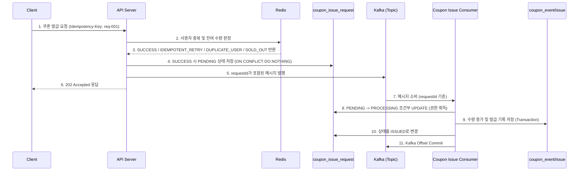
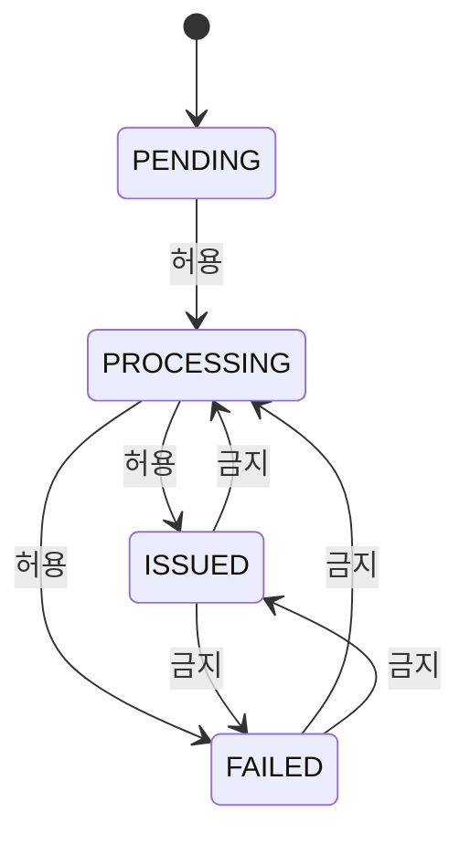
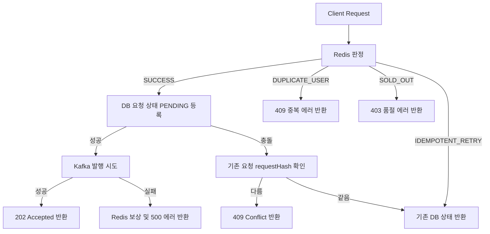
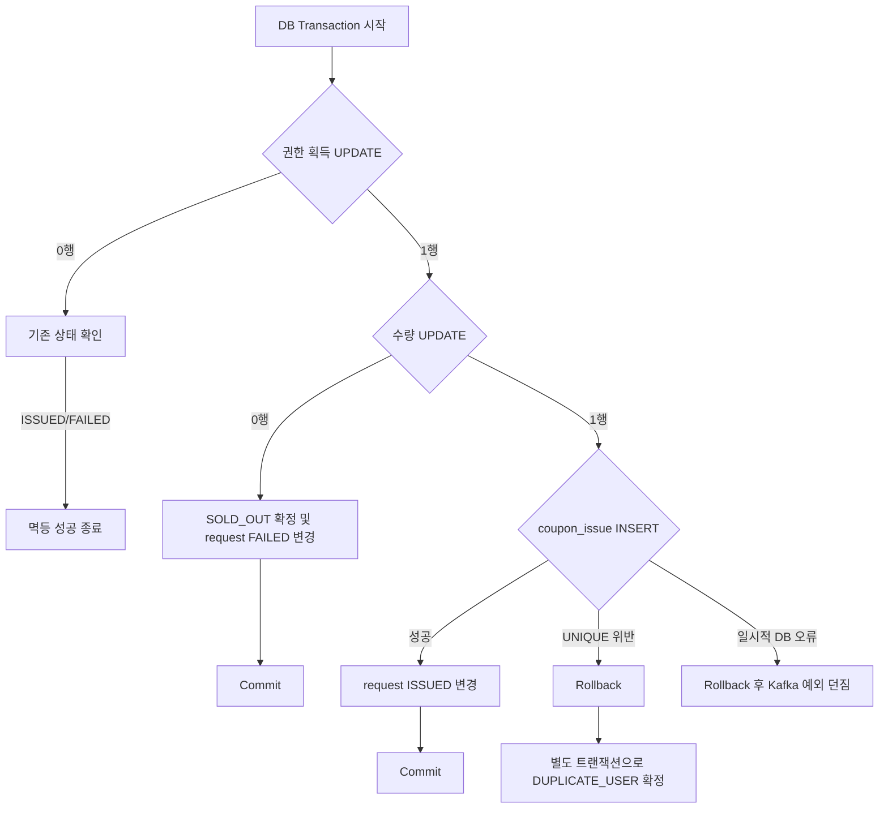
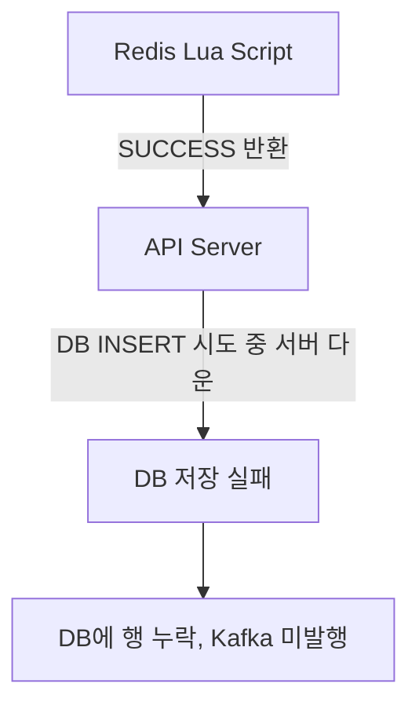
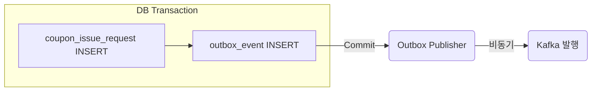

```markdown
# [Week 5] requestId 기반 멱등성과 중복 처리 구조 설계 - 13기 우재원

## 과제 1. requestId 기반 전체 멱등 처리 구조 그리기

### 1. 전체 요청 처리 흐름 다이어그램



### 2. 하나의 requestId가 전체 흐름에서 어떻게 전달되는지 작성하기

```text
HTTP Idempotency-Key
        |
        v
애플리케이션 requestId
        |
        v
coupon_issue_request.request_id
        |
        v
Kafka Message requestId
        |
        v
Consumer 멱등 처리

```

### 3. 각 구성 요소의 역할

```text
| **구성 요소** | **역할** |
| --- | --- |
| Redis | 성공 가능성이 없는 요청을 앞단에서 빠르게 차단하고, 동일 사용자가 여러 선착순 자리를 차지하지 못하게 한다. |
| Kafka | API Server와 Consumer를 분리하고 순간적인 요청 폭주를 저장하고 완충한다. |
| coupon_issue_request | 요청 자체의 생명주기(상태)와 결과를 저장하며, 동일 요청의 재시도와 결과 재현을 담당한다. |
| coupon_event | 조건부 UPDATE로 전체 수량 초과를 최종 방어한다. |
| coupon_issue | UNIQUE(event_id, user_id)로 사용자 중복 발급을 막으며 실제 발급 성공 기록만 저장한다. |
| Kafka Offset | Consumer가 파티션의 어느 위치까지 읽었는지 기록한다. |

```

### 4. 각 단계의 성공이 의미하는 것

```text
| **단계** | **의미** | **최종 발급 성공 여부** |
| --- | --- | --- |
| Redis `SUCCESS` | 새로운 사용자가 새로운 requestId로 선착순 판정을 통과함. | X |
| request `PENDING` | 요청 행이 생성되었지만 최종 처리가 끝나지 않은 상태. | X |
| request `PROCESSING` | Consumer가 처리 권한을 얻어 발급을 처리 중인 상태. | X |
| request `ISSUED` | 수량 변경·발급 기록·상태 변경이 함께 Commit된 최종 성공 상태. | O |
| request `FAILED` | 재시도해도 결과가 바뀌지 않는 최종 실패 상태. | X |
| Kafka Offset Commit | Kafka 관점의 메시지 처리 완료 표시. | X (DB 커밋이 진정한 비즈니스 완료임) |

```

### 5. 최종 쿠폰 발급 성공으로 판단할 수 있는 시점

```text
coupon_event.issued_count 증가, coupon_issue 저장, coupon_issue_request ISSUED 변경이 하나의 트랜잭션으로 Commit된 시점이다.

```

### 6. 요청이 여러 번 도착해도 최종 결과가 한 번만 반영되어야 한다는 의미

```text
요청과 메시지는 여러 번 도착할 수 있고 처리 로직도 여러 번 시작될 수 있지만, 최종 비즈니스 결과가 한 번만 반영되는 멱등적 특성을 뜻한다.

```

---

## 과제 2. 중복 유형과 멱등성 경계 구분하기

### 1. 상황별 중복 유형 분석

```text
| **상황** | **같은 논리적 요청인가?** | **식별 기준** | **주요 방어 장치** |
| --- | --- | --- | --- |
| 응답 유실 후 같은 requestId로 API 재시도 | O | requestId | API 멱등성 (요청 상태 테이블) |
| 반복 클릭으로 다른 requestId가 생성됨 | X | userId + eventId | Redis 판정 및 DB UNIQUE 제약 |
| 애플리케이션이 같은 requestId 메시지를 `send()` 두 번 호출 | O | requestId | Consumer 멱등성 (조건부 상태 전이) |
| DB Commit 후 Offset Commit 전 장애로 같은 Record 재전달 | O | requestId | Consumer 멱등성 (기존 최종 상태 확인) |
| 원본 Topic과 Retry Topic에 같은 requestId가 존재 | O | requestId | Consumer 멱등성 |
| 같은 requestId가 다른 eventId에 재사용됨 | X | requestHash | API 멱등성 (requestHash 비교) |

```

### 2. 같은 요청과 같은 사용자의 차이

```text
상황 A는 같은 논리적인 요청이 재전달된 것으로 기존 처리 결과를 재사용해야 한다. 
상황 B는 동일 사용자가 새로운 요청으로 다시 발급을 시도한 것으로 사용자 중복 발급으로 처리하여 차단해야 한다.

```

### 3. 중복 방어 장치별 역할 비교

```text
| **장치** | **식별 기준** | **막는 문제** | **막지 못하는 문제** |
| --- | --- | --- | --- |
| Redis 사용자 판정 | eventId + userId | 동일 사용자의 반복 요청과 수량 초과를 앞단 차단 | 동일 요청의 재시도 식별 |
| requestId | requestId | 동일한 논리적 요청의 재시도와 메시지 중복 처리 | 다른 requestId로 들어온 사용자 중복 요청 |
| requestHash | requestId + 요청 의미 | 같은 키를 다른 요청에 재사용하는 오류 | Offset Commit 실패로 인한 동일 메시지 재전달 |
| `UNIQUE(event_id, user_id)` | eventId + userId | 최종 사용자 중복 발급 | 동일 요청의 처리 상태 파악 및 결과 반환 |
| Kafka Partition + Offset | Partition의 소비 위치 | Consumer가 어디까지 읽었는지 기록 | Consumer가 DB 반영 후 Offset Commit 전에 장애 시 재전달 |

```

### 4. Kafka Producer 멱등성이 막는 중복

```text
애플리케이션에서 한 번 호출한 send()가 Producer 내부에서 재전송될 때, 같은 Record가 브로커에 중복 저장되는 것을 막는다.

```

### 5. 애플리케이션이 send()를 두 번 호출하면 Producer 멱등성으로 막을 수 없는 이유

```text
애플리케이션의 send() 재호출은 서로 다른 두 개의 send()로 인식되어 서로 다른 Sequence Number가 부여되므로, Producer 멱등성으로 중복 저장을 막지 못한다.

```

### 6. requestId와 Kafka Partition + Offset의 차이

```text
requestId: 어떤 쿠폰 발급 요청인지 나타내는 논리적 식별자다.
Partition + Offset: Kafka Topic 내부에서 메시지가 어디에 저장되어 있는지를 나타내는 위치 정보다.

```

### 7. Consumer 멱등성의 기준을 Offset이 아니라 requestId로 두어야 하는 이유

```text
같은 요청이 원본 Topic에서 Retry Topic으로 이동하면 Partition과 Offset은 달라지지만 같은 비즈니스 요청(requestId)이다. 따라서 Consumer 멱등성은 반드시 requestId를 기준으로 판단해야 기존 ISSUED 또는 FAILED 결과를 확인하고 발급 로직을 다시 실행하지 않게 된다.

```

---

## 과제 3. Idempotency-Key와 requestHash 설계하기

### 1. Idempotency-Key의 의미

```text
클라이언트가 동일한 요청의 재시도임을 서버에 알려주기 위해 전달하는 고유한 식별자다.

```

### 2. 누가 requestId를 생성해야 하는가?

```text
| **방식** | **장점** | **단점** |
| --- | --- | --- |
| Client 생성 | 응답 유실 시에도 클라이언트가 기존 키를 보존하여 동일 요청으로 묶을 수 있다. | 악의적인 클라이언트가 키 형식을 어기거나 조작할 수 있어 API 앞단의 검증이 필요하다. |
| API Server 생성 | 서버가 안전하고 유일한 키를 통제하여 생성할 수 있다. | 응답 유실 시 클라이언트가 기존 키를 알 수 없어 재시도 시 새로운 요청으로 처리된다. |

내가 선택한 방식: Client가 요청 전 requestId 생성.

선택한 이유: 네트워크 오류로 응답을 받지 못해 재시도할 때, 서버가 새로운 요청이 아니라 기존 요청의 재시도로 판단하게 하려면 클라이언트가 키를 보존해야 하기 때문이다.

```

### 3. 같은 requestId를 재사용해야 하는 상황과 새로 생성해야 하는 상황

```text
| **상황** | **같은 requestId 재사용 또는 새 requestId 생성** | **이유** |
| --- | --- | --- |
| 네트워크 Timeout 후 동일 작업 재시도 | 같은 requestId 재사용 | 응답이 불명확한 동일 작업의 재시도이기 때문이다. |
| 응답 유실 후 동일 작업 재시도 | 같은 requestId 재사용 | 서버의 처리 결과가 불명확한 상태에서 동일 결과를 다시 확인하기 위함이다. |
| 모바일 앱 재연결 후 동일 작업 전송 | 같은 requestId 재사용 | 동일한 논리적 작업의 연장이기 때문이다. |
| 다른 쿠폰 이벤트 발급 요청 | 새로운 requestId 사용 | 기존 요청과 의미가 전혀 다른 새로운 작업이기 때문이다. |
| 기존 요청을 취소하고 새로운 작업 시작 | 새로운 requestId 사용 | 이전 작업을 명시적으로 취소한 뒤 생성하는 새로운 논리적 작업이기 때문이다. |

```

### 4. requestId의 형식과 검증 규칙 설계하기

```text
- 허용 형식: UUID v4 (예: 550e8400-e29b-41d4-a716-446655440000).
- 최대 길이: 36자 (하이픈 포함 표준 UUID 길이).
- 빈 값 처리: Idempotency-Key 헤더가 비어있으면 400 Bad Request로 차단한다.
- 허용하지 않는 문자: 알파벳 소문자, 숫자, 하이픈 외의 모든 특수문자 및 공백.
- DB 유일성 보장 방식: coupon_issue_request 테이블의 Primary Key 제약조건으로 유일성을 강제한다.

```

### 5. requestHash를 만드는 Canonical String 작성하기

```text
Canonical String: COUPON_ISSUE|100|10
SHA-256 결과를 저장할 컬럼: request_hash

```

### 6. 전체 JSON 문자열을 그대로 Hash하면 안 되는 이유

```text
의미가 같아도 필드 순서나 공백에 따라 해시 문자열이 완전히 달라지기 때문이다.

```

### 7. requestHash에 포함할 값과 포함하지 않을 값 구분하기

```text
| **값** | **포함 여부** | **이유** |
| --- | --- | --- |
| 작업 종류 `COUPON_ISSUE` | 포함 | 어떤 종류의 비즈니스 로직인지 구별하기 위함이다. |
| eventId | 포함 | 요청의 핵심 비즈니스 식별자이기 때문이다. |
| 인증된 userId | 포함 | 권한이 확인된 요청 주체를 구별하기 위함이다. |
| 요청 전송 시각 | 미포함 | 재시도 시마다 달라질 수 있는 가변 값이기 때문이다. |
| Trace ID | 미포함 | 인프라 관점의 추적 ID로 재시도 시 달라질 수 있다. |
| 매번 바뀌는 nonce | 미포함 | 재시도를 동일 요청으로 묶는 데 방해가 된다. |
| Gateway가 추가한 가변 Header | 미포함 | 논리적 요청의 고유 의미와 무관하기 때문이다. |

```

### 8. Request Body의 userId를 requestHash에 그대로 사용하면 안 되는 이유

```text
사용자가 임의로 다른 사람의 ID를 Request Body에 넣어 요청할 위험이 있으므로, 반드시 Authorization Token을 기반으로 한 인증된 사용자 ID를 사용해야 한다.

```

### 9. 같은 requestId에 다른 내용이 들어온 경우 처리 설계

```text
HTTP Status Code: 409 Conflict
에러 코드: IDEMPOTENCY_KEY_REUSED
Kafka 발행 여부: 발행하지 않는다.
기존 요청 상태 변경 여부: 변경하지 않는다.
사용자 응답: 동일한 요청 식별자가 다른 요청에 사용되었다는 에러 메시지를 반환한다.

```

---

## 과제 4. coupon_issue_request 테이블과 상태 전이 설계하기

### 1. coupon_issue_request와 coupon_issue의 역할 차이

```text
| **테이블** | **저장하는 대상** | **표현할 수 있는 상태** |
| --- | --- | --- |
| coupon_issue_request | 요청 자체의 생명주기와 결과 | PENDING, PROCESSING, ISSUED, FAILED |
| coupon_issue | 실제 발급에 성공한 행 | ISSUED |

```

### 2. 요청 상태 모델 설명하기

```text
| **상태** | **의미** | **최종 상태 여부** |
| --- | --- | --- |
| `PENDING` | 요청 행이 생성되었지만 최종 처리가 끝나지 않은 상태. | X |
| `PROCESSING` | Consumer가 처리 권한을 얻어 발급을 처리 중인 상태. | X |
| `ISSUED` | 수량 변경·발급 기록·상태 변경이 함께 Commit된 최종 성공 상태. | O |
| `FAILED` | 재시도해도 결과가 바뀌지 않는 최종 실패 상태. | O |

```

### 3. 상태 전이 다이어그램 작성하기



### 4. 단일 트랜잭션 구조에서 외부 조회 시 PROCESSING이 거의 보이지 않을 수 있는 이유

```text
단일 트랜잭션 안에서 PENDING → PROCESSING → ISSUED 전이가 모두 처리되므로, 외부에서는 커밋 전의 PENDING이나 커밋 후의 ISSUED/FAILED만 주로 보이기 때문이다.

```

### 5. coupon_issue_request DDL 작성하기

```sql
CREATE TABLE coupon_issue_request (
    request_id UUID PRIMARY KEY,
    event_id BIGINT NOT NULL,
    user_id BIGINT NOT NULL,
    request_hash CHAR(64) NOT NULL,
    status VARCHAR(20) NOT NULL,
    failure_code VARCHAR(50),
    failure_message VARCHAR(255),
    coupon_issue_id BIGINT,
    requested_at TIMESTAMPTZ NOT NULL,
    processing_started_at TIMESTAMPTZ,
    completed_at TIMESTAMPTZ,
    created_at TIMESTAMPTZ NOT NULL DEFAULT CURRENT_TIMESTAMP,
    updated_at TIMESTAMPTZ NOT NULL DEFAULT CURRENT_TIMESTAMP,

    CONSTRAINT fk_coupon_issue_request_event
        FOREIGN KEY (event_id) REFERENCES coupon_event(id),
    CONSTRAINT fk_coupon_issue_request_issue
        FOREIGN KEY (coupon_issue_id) REFERENCES coupon_issue(id),
    CONSTRAINT uk_coupon_issue_request_issue
        UNIQUE (coupon_issue_id),
    CONSTRAINT chk_coupon_issue_request_status
        CHECK (status IN ('PENDING', 'PROCESSING', 'ISSUED', 'FAILED')),
    CONSTRAINT chk_coupon_issue_request_failure
        CHECK (
            (status = 'FAILED' AND failure_code IS NOT NULL)
            OR
            (status <> 'FAILED'
                AND failure_code IS NULL
                AND failure_message IS NULL)
        ),
    CONSTRAINT chk_coupon_issue_request_completed
        CHECK (
            (status IN ('ISSUED', 'FAILED') AND completed_at IS NOT NULL)
            OR
            (status IN ('PENDING', 'PROCESSING') AND completed_at IS NULL)
        ),
    CONSTRAINT chk_coupon_issue_request_issue_result
        CHECK (
            (status = 'ISSUED' AND coupon_issue_id IS NOT NULL)
            OR
            (status <> 'ISSUED' AND coupon_issue_id IS NULL)
        ),
    CONSTRAINT chk_coupon_issue_request_processing
        CHECK (
            (status = 'PROCESSING' AND processing_started_at IS NOT NULL)
            OR
            (status <> 'PROCESSING')
        )
);

```

### 6. 요청 상태 테이블에 `UNIQUE(event_id, user_id)`를 두지 않는 이유

```text
이 제약을 두면 같은 사용자의 실패 이력(FAILED/DUPLICATE_USER)과 성공 이력(ISSUED)을 모두 저장할 수 없어, 사용자가 두 번째 요청의 실패 이유를 조회할 수 없기 때문이다.

```

### 7. 상태 변경 SQL에 출발 상태를 조건으로 포함해야 하는 이유

```text
조건 없이 상태를 덮어쓰면 오래된 Consumer가 최신 결과를 변경하거나, 이미 FAILED/ISSUED로 확정된 상태를 비정상적으로 수정할 위험이 있기 때문이다.

```

```sql
UPDATE coupon_issue_request
SET status = 'ISSUED',
    coupon_issue_id = :couponIssueId,
    completed_at = CURRENT_TIMESTAMP,
    updated_at = CURRENT_TIMESTAMP
WHERE request_id = :requestId
  AND status = 'PROCESSING';

```

### 8. 최종 상태 변경의 영향받은 row 수가 0인 경우

```text
1. 요청 행이 아예 존재하지 않는 경우
2. 출발 상태가 일치하지 않는 경우(상태 불일치)
3. 다른 처리자가 이미 최종 상태로 변경한 경우

```

### 9. 운영 복구를 위한 인덱스 설계하기

```sql
CREATE INDEX idx_coupon_issue_request_status_updated
ON coupon_issue_request (status, updated_at);

```

### 10. 요청 상태 보관 기간과 Idempotency-Key 유효 기간의 관계

```text
Idempotency-Key 유효 기간
<=
요청 상태 보관 기간

이유: 사용자가 같은 Idempotency-Key를 재사용할 수 있는 기간보다 먼저 행을 삭제하면, 재시도된 과거 요청을 신규 요청으로 잘못 인식하기 때문이다.

```

---

## 과제 5. API Server의 멱등 요청 접수 흐름 설계하기

### 1. API Server 전체 처리 흐름 다이어그램



### 2. Redis 결과별 API 처리

```text
| **Redis 결과** | **DB 요청 상태 등록** | **Kafka 발행** | **API 응답 방향** |
| --- | --- | --- | --- |
| `SUCCESS` | PENDING 상태로 저장 시도 | 저장 성공 시 메시지 발행 | 발행 성공 시 202 Accepted |
| `IDEMPOTENT_RETRY` | DB의 기존 요청 상태를 조회 | 새 Kafka 발행 금지 | 기존 상태에 따른 결과 반환 |
| `DUPLICATE_USER` | DB 상태 등록 생략 | 새 Kafka 발행 금지 | 중복 요청 응답 (409) |
| `SOLD_OUT` | DB 상태 등록 생략 | 새 Kafka 발행 금지 | 품절 응답 (403) |

```

### 3. 동일 requestId 동시 요청에서 SELECT 후 INSERT가 안전하지 않은 이유

```text
시간       API Server A                API Server B
----------------------------------------------------------
T1         req-001 조회 → 없음
T2                                     req-001 조회 → 없음
T3         최초 요청 판단
T4                                     최초 요청 판단
T5         INSERT 시도
T6                                     INSERT 시도

문제의 이름: Check-Then-Act 경쟁

```

### 4. DB 유일성 제약을 이용한 최초 등록자 결정 SQL 작성하기

```sql
INSERT INTO coupon_issue_request (
    request_id, event_id, user_id,
    request_hash, status, requested_at
)
VALUES (
    :requestId, :eventId, :userId,
    :requestHash, 'PENDING', :requestedAt
)
ON CONFLICT (request_id) DO NOTHING;

```

### 5. INSERT 영향받은 row 수 처리

```text
affected rows = 1
→ 최초 등록자로 권한을 획득하여 Kafka 발행 진행

affected rows = 0
→ 기존 행을 조회하여 requestHash를 비교한다

```

### 6. 기존 행의 requestHash 확인 결과에 따른 처리

```text
| **조건** | **판단** | **처리** |
| --- | --- | --- |
| requestId 같음 + requestHash 같음 | 같은 요청의 재시도 | 기존 상태를 반환한다 |
| requestId 같음 + requestHash 다름 | 잘못된 Idempotency-Key 재사용 | 409 Conflict 에러를 반환한다 |

```

### 7. Redis가 `IDEMPOTENT_RETRY`를 반환했지만 DB에 요청 행이 없는 경우

```text
이 상태가 발생할 수 있는 이유: Redis 통과 후 DB 등록이 완료되지 않은 중간 실패 상태일 수 있기 때문이다.

이 상태를 무조건 정상 PENDING으로 응답하면 안 되는 이유: 실제 DB에 행이 없으므로 Consumer가 영원히 처리할 수 없어 요청이 고착될 위험이 있기 때문이다.

재조회·복구·보상 방향: 짧은 시간 후 재조회하거나 DB 등록을 재시도하고, 일정 시간 이상 지속되면 Redis 자리를 보상 처리하며 메트릭을 남긴다.

```

### 8. Redis가 `SUCCESS`를 반환했지만 DB INSERT가 충돌한 경우

```text
기존 requestHash 확인: 충돌한 기존 DB 행의 request_hash가 현재 요청과 일치하는지 비교한다.
Kafka 발행 여부: 새로운 발행을 시도하지 않는다.
Redis에서 새로 차지한 자리 처리: Redis 수량과 사용자 기록을 다시 보상(Rollback) 처리해야 한다.
API 응답: requestHash 검증 결과에 따라 기존 성공/실패 응답을 반환한다.

```

### 9. 최초 요청 접수 성공 응답 설계하기

```text
HTTP Status Code: 202 Accepted

```

```json
{
  "requestId": "req-001",
  "status": "PENDING",
  "message": "쿠폰 발급 요청이 접수되었습니다."
}

```

```text
이 응답이 최종 발급 성공을 의미하지 않는 이유: 비동기 처리 흐름에 들어갔다는 의미일 뿐, 아직 Consumer의 DB 처리가 남아 있기 때문이다.

```

### 10. 동일 requestId 재요청의 응답 설계하기

#### **PENDING**

```json
{
  "requestId": "req-001",
  "status": "PENDING",
  "message": "쿠폰 발급 요청이 접수되어 처리 대기 중입니다."
}

```

#### **ISSUED**

```json
{
  "requestId": "req-001",
  "status": "ISSUED",
  "couponIssueId": 5001,
  "message": "이미 쿠폰 발급이 완료되었습니다."
}

```

#### **FAILED**

```json
{
  "requestId": "req-001",
  "status": "FAILED",
  "failureCode": "SOLD_OUT",
  "message": "쿠폰이 모두 소진되었습니다."
}

```

### 11. 같은 requestId에 다른 내용이 들어온 경우 응답 설계하기

```json
{
  "requestId": "req-001",
  "errorCode": "IDEMPOTENCY_KEY_REUSED",
  "message": "동일한 요청 식별자가 다른 요청에 사용되었습니다."
}

```

```text
HTTP Status Code와 이유: 409 Conflict. 클라이언트가 고유해야 할 식별자 규칙을 위반하여 서버의 기존 상태와 충돌이 발생했음을 알리기 위함이다.

```

### 12. 상태 조회 API의 인증 조건 작성하기

```sql
SELECT request_id,
       event_id,
       status,
       failure_code,
       coupon_issue_id,
       requested_at,
       completed_at
FROM coupon_issue_request
WHERE request_id = :requestId
  AND user_id = :authenticatedUserId;

```

```text
`requestId`만으로 조회하면 안 되는 이유: requestId를 안다는 이유만으로 다른 사용자의 발급 결과를 무단으로 조회할 수 있는 보안 취약점이 발생하기 때문이다.

```

---

## 과제 6. Consumer의 조건부 상태 전이와 처리 권한 설계하기

### 1. Kafka 메시지와 요청 상태 행의 일치 검증

```text
| **필드** | **Kafka Message** | **coupon_issue_request** | **불일치 시 처리** |
| --- | --- | --- | --- |
| requestId | req-001 | req-001 | 일치 확인 |
| eventId | 100 | 100 | 불일치 시 발급 금지 및 DLQ 처리 |
| userId | 10 | 10 | 불일치 시 발급 금지 및 DLQ 처리 |

메시지 내용 불일치를 재시도 대상으로 두기 어려운 이유: 단순 반복한다고 해결되는 일시적 장애가 아니라 데이터 오염이나 손상된 메시지이므로, 재시도해도 실패가 자명하기 때문이다.

```

### 2. SELECT 후 UPDATE 방식의 Race Condition 분석하기

```text
시간       Consumer A                                  Consumer B
------------------------------------------------------------
T1         status 조회 → PENDING
T2                                                     status 조회 → PENDING
T3         처리 가능 판단
T4                                                     처리 가능 판단
T5         PROCESSING 저장
T6                                                     PROCESSING 저장
T7         발급 처리 시작                                발급 처리 시작

```

### 3. 조건부 UPDATE로 처리 권한 획득하기

```sql
UPDATE coupon_issue_request
SET status = 'PROCESSING',
    processing_started_at = CURRENT_TIMESTAMP,
    updated_at = CURRENT_TIMESTAMP
WHERE request_id = :requestId
  AND status = 'PENDING';

```

### 4. 영향받은 row 수의 의미

```text
affected rows = 1
→ 내가 PENDING을 PROCESSING으로 변경하여 안전하게 처리 권한을 획득했다.

affected rows = 0
→ 요청이 없거나, 다른 Consumer가 이미 선점하여 처리했거나, 최종 상태로 종료되었다.

```

### 5. 두 Consumer가 동시에 같은 requestId를 처리할 때 DB 내부 동작

```text
Consumer A: Row Lock 획득 후 PROCESSING으로 변경, affected rows = 1 반환.

Consumer B: A의 트랜잭션 종료까지 락을 대기한다.

READ COMMITTED에서 두 번째 Consumer의 조건 처리: 대기 후 락을 획득하면 최신 상태로 WHERE 조건을 재평가하며, status가 더 이상 PENDING이 아니므로 0행을 반환한다.

```

### 6. REPEATABLE READ 이상에서 달라질 수 있는 점

```text
최신 상태로 조건을 재평가하는 대신 직렬화 오류(could not serialize access)가 발생하여 애플리케이션이 트랜잭션 전체를 재시도해야 하는 불편함이 생긴다.

```

### 7. affected rows가 0일 때 상태별 처리

```text
| **조회 결과** | **의미** | **Consumer 처리** | **Offset 처리 방향** |
| --- | --- | --- | --- |
| 요청 행 없음 | DB 요청 등록과 Kafka 메시지 불일치 | 실패 로그 작성 후 종류 | 별도 복구 정책(DLQ 등) 대상 |
| `PENDING` | 상태 이상 (조회 중 다른 트랜잭션의 롤백 발생 등) | 로직 검토 또는 재시도 | Offset 미반영 / 재시도 |
| `PROCESSING` | 다른 Consumer가 처리 중 | Lease 만료 등을 확인 | 대기 또는 재시도 |
| `ISSUED` | 이미 성공한 요청의 중복 메시지 | 새 발급 없이 멱등 성공 간주 | Offset Commit |
| `FAILED` | 이미 최종 실패한 요청의 중복 메시지 | 실패 결과 유지 | Offset Commit |

```

### 8. ISSUED 또는 FAILED 중복 메시지를 예외로 던지면 안 되는 이유

```text
예외를 던지면 DuplicateMessageException 발생 후 Retry Topic으로 넘어가고 또 예외가 반복 발생하여, 정상적으로 처리된 요청이 무한 재시도 루프와 DLQ 적재로 시스템 리소스를 낭비하기 때문이다.

```

### 9. 최종 상태를 확인하고 아무 변경 없이 종료하는 것도 성공적인 처리인 이유

```text
멱등성의 핵심 원칙에 부합하기 때문이다. 이미 올바른 상태에 도달해 있으므로 상태 변경 없이 조용히 종료하고 Offset을 커밋하는 것이 안전한 중복 처리 방어다.

```

---

## 과제 7. 발급 트랜잭션과 Rollback 이후 상태 확정 설계하기

### 1. 트랜잭션에 포함할 작업과 포함하지 않을 작업 구분하기

```text
| **작업** | **발급 트랜잭션 포함 여부** | **이유** |
| --- | --- | --- |
| PENDING → PROCESSING | 포함 | 권한 획득과 상태 전이의 원자적 일관성을 보장하기 위함이다. |
| coupon_event 수량 확보 | 포함 | 수량 증감은 핵심 발급 비즈니스 로직의 일부이기 때문이다. |
| coupon_issue INSERT | 포함 | 수량 삭감과 발급 대상 기록은 묶여서 성공해야 하기 때문이다. |
| request ISSUED / FAILED 변경 | 포함 | 발급 결과와 상태 정보를 정확히 일치시키기 위함이다. |
| 이메일 발송 | 미포함 | 외부 I/O 대기 시간으로 인해 락 점유가 길어지기 때문이다. |
| 앱 푸시 발송 | 미포함 | 외부 서비스 장애가 DB 트랜잭션으로 전파되는 것을 막기 위함이다. |
| 마이페이지 조회 모델 갱신 | 미포함 | 후속 로직이므로 별도 이벤트로 비동기 분리하는 것이 적합하다. |
| 외부 API 호출 | 미포함 | 실패 시점 예측이 어렵고 트랜잭션 병목을 유발하기 때문이다. |

```

### 2. 전체 발급 트랜잭션 흐름 다이어그램



### 3. 정상 발급 SQL 흐름 완성하기

```sql
BEGIN;

-- 1. PENDING 요청의 처리 권한 획득
UPDATE coupon_issue_request
SET status = 'PROCESSING',
    processing_started_at = CURRENT_TIMESTAMP,
    updated_at = CURRENT_TIMESTAMP
WHERE request_id = :requestId
  AND status = 'PENDING';

-- 2. 수량이 남아 있을 때만 issued_count 증가
UPDATE coupon_event
SET issued_count = issued_count + 1,
    updated_at = CURRENT_TIMESTAMP
WHERE id = :eventId
  AND issued_count < total_quantity;

-- 3. 최종 발급 기록 저장
INSERT INTO coupon_issue (
    event_id, user_id, status, issued_at
)
VALUES (
    :eventId, :userId, 'ISSUED', CURRENT_TIMESTAMP
)
RETURNING id;

-- 4. 요청 상태를 ISSUED로 변경
UPDATE coupon_issue_request
SET status = 'ISSUED',
    coupon_issue_id = :couponIssueId,
    completed_at = CURRENT_TIMESTAMP,
    updated_at = CURRENT_TIMESTAMP
WHERE request_id = :requestId
  AND status = 'PROCESSING';

COMMIT;

```

### 4. 각 단계에서 반드시 확인할 영향받은 row 수

```text
| **단계** | **정상적으로 기대하는 row 수** | **기대값과 다를 때 처리** |
| --- | --- | --- |
| 처리 권한 획득 | 1행 | 0행 시 기존 상태를 조회하여 멱등 처리 등을 판단한다. |
| 수량 UPDATE | 1행 | 0행 시 SOLD_OUT으로 상태를 FAILED로 변경하고 커밋한다. |
| 최종 ISSUED 변경 | 1행 | 0행 시 데이터가 어긋났음을 의미하므로 전체 트랜잭션을 롤백한다. |

```

### 5. 마지막 ISSUED 상태 변경이 0행인데 발급 결과만 Commit하면 안 되는 이유

```text
요청 상태 테이블은 여전히 PROCESSING으로 남아있는데, 실제 쿠폰은 발급된 데이터 불일치가 발생하여 사용자가 성공 여부를 영영 조회할 수 없게 되기 때문이다.

```

### 6. DB 기준 수량이 소진된 경우 처리

```sql
UPDATE coupon_issue_request
SET status = 'FAILED',
    failure_code = 'SOLD_OUT',
    failure_message = '쿠폰이 모두 소진되었습니다.',
    completed_at = CURRENT_TIMESTAMP,
    updated_at = CURRENT_TIMESTAMP
WHERE request_id = :requestId
  AND status = 'PROCESSING';

```

```text
발급 행 생성 여부: 만들지 않는다.
같은 메시지가 다시 들어왔을 때 처리: 기존 FAILED 상태를 확인하고 조용히 처리 종료한다.

```

### 7. 서로 다른 requestId로 같은 사용자가 다시 발급을 시도한 경우

```text
첫 번째 트랜잭션의 상태: UNIQUE(event_id, user_id) 충돌 발생으로 트랜잭션이 Aborted 되어 Rollback 된다.
PENDING → PROCESSING 전이의 결과: 롤백되어 PENDING으로 되돌아간다.
앞에서 증가한 issued_count의 결과: 롤백되어 증가 전 수량으로 취소(원복)된다.
같은 트랜잭션에서 FAILED로 바꿀 수 있는가?: 불가능하다. PostgreSQL 특성상 제약 위반 후 트랜잭션을 사용할 수 없다.

```

### 8. UNIQUE 위반 Rollback 후 별도 트랜잭션 처리 순서

```text
1. 현재 발급 트랜잭션 Rollback
2. 새 트랜잭션 시작
3. 기존 coupon_issue 확인
4. 현재 요청을 FAILED / DUPLICATE_USER로 확정
5. Commit

```

### 9. Rollback 후 요청 상태를 어떤 출발 상태에서 FAILED로 변경해야 하는가?

```sql
UPDATE coupon_issue_request
SET status = 'FAILED',
    failure_code = 'DUPLICATE_USER',
    failure_message = '이미 발급받은 사용자입니다.',
    completed_at = CURRENT_TIMESTAMP,
    updated_at = CURRENT_TIMESTAMP
WHERE request_id = :requestId
  AND status = 'PENDING';

```

```text
왜 `PROCESSING`이 아닌지 설명한다: 첫 번째 트랜잭션이 롤백되면서 PENDING -> PROCESSING 변경 내역도 함께 취소되었으므로, 현재 DB 데이터는 PROCESSING이 아닌 PENDING 상태이기 때문이다.

```

### 10. 일시적 DB 오류가 발생한 경우

```text
요청 상태: PENDING 유지 (롤백됨)
issued_count: 원복 유지 (롤백됨)
coupon_issue: 생성 없음 (롤백됨)
FAILED 저장 여부: 저장하지 않는다
Kafka Listener 예외 처리: 예외를 다시 던져 Kafka 재전달로 재시도되도록 유도한다

```

### 11. 최종 비즈니스 실패와 일시적 시스템 오류 비교

```text
| **오류** | **최종 FAILED 저장 여부** | **Kafka 재시도 여부** | **이유** |
| --- | --- | --- | --- |
| DB 연결 일시 실패 | X | O | 시스템 일시적 장애로 다시 시도하면 성공 가능성이 있다. |
| Deadlock | X | O | 트랜잭션 경쟁에 의한 것이므로 재시도 시 정상 처리가 가능하다. |
| SOLD_OUT | O | X | 재시도해도 수량 부족이 번복되지 않는 영구적 비즈니스 실패다. |
| DUPLICATE_USER | O | X | 이미 쿠폰을 소유하고 있으므로 재시도해도 결과가 변하지 않는다. |
| 메시지와 요청 행 불일치 | X | X (DLQ 이동 등) | 재시도해도 해결되지 않는 손상된 메시지로 분류해야 하기 때문이다. |

```

---

## 과제 8. Kafka Offset과 중복 메시지 처리 설계하기

### 1. 안전한 처리 순서 작성하기

```text
1. Kafka 메시지를 읽는다.
2. DB 트랜잭션을 시작한다.
3. 요청 처리 권한을 얻는다.
4. 수량과 발급 기록을 처리한다.
5. 요청 상태를 최종 상태로 변경한다.
6. DB 트랜잭션을 Commit한다.
7. Kafka Offset을 Commit한다.

```

### 2. DB 결과 확정과 Offset Commit의 역할 차이

```text
| **항목** | **의미** |
| --- | --- |
| DB Commit | 비즈니스 관점에서의 처리 완료를 뜻한다. |
| Kafka Offset Commit | Kafka 큐 관점에서 해당 메시지의 물리적 소비 완료 표시를 뜻한다. |

```

### 3. Offset을 먼저 Commit한 뒤 DB 처리가 실패하는 상황

```text
Kafka 상태: 메시지가 이미 처리된 것으로 간주되고 다음 메시지를 가리킨다.
DB 상태: 처리가 실패해 롤백되어 아무 발급 결과가 없다.
사용자 요청에 발생하는 문제: 사용자 요청은 완전히 유실되며 영원히 처리되지 않는다.

```

### 4. DB Commit 후 Offset Commit 전에 Consumer가 종료되는 상황

```text
Consumer 재시작 후 발생하는 일: 커밋되지 않은 마지막 오프셋부터 메시지를 다시 불러오므로, 동일 메시지가 중복 재전달된다.
request 상태가 `ISSUED`인 경우 처리: 이미 성공적으로 DB 처리가 끝났음을 확인하고 새로운 발급 로직을 수행하지 않고 메시지 소비만 종료(멱등 성공) 처리한다.

```

### 5. 같은 Kafka Record 재전달과 같은 requestId의 다른 Record 비교

```text
| **구분** | **Partition** | **Offset** | **requestId** |
| --- | --- | --- | --- |
| Offset 미반영으로 동일 Record 재전달 | 같음 | 같음 | 같음 |
| Producer가 같은 요청을 두 번 발행 | 같음 또는 다름 | 다름 | 같음 |

두 현상을 모두 requestId로 방어해야 하는 이유: 원인은 다르지만 결국 Consumer 입장에서는 같은 비즈니스 요청이 두 번 들어온 것이므로, Offset이 다르더라도 requestId를 기준으로 멱등성 검증을 수행해야 안전하기 때문이다.

```

### 6. 자동 커밋 사용 시 확인해야 할 항목

```text
1. 자동 커밋 사용 여부
2. 수동 Acknowledgment 방식
3. Listener 예외 발생 시 Offset 처리 방향
4. DB Rollback 시 메시지 재전달 방식
5. Retry Topic 이동 시 원본 레코드 완료 처리 시점

```

### 7. At-Least-Once와 비즈니스 결과의 차이

```text
메시지 전달 횟수
→ 네트워크 환경에 의해 한 번 이상일 수 있음

쿠폰 발급 결과
→ 멱등 처리를 통해 오직 한 번만 반영됨

```

### 8. 다음 상태에서 Offset 처리 방향 작성하기

```text
| **request 상태 또는 처리 결과** | **Offset 처리 방향** | **이유** |
| --- | --- | --- |
| 새 `PENDING` 요청 처리 성공 | 커밋한다 | 비즈니스 로직과 DB 반영이 정상 완료되었기 때문이다. |
| 기존 `ISSUED` 요청 중복 메시지 | 커밋한다 | 이미 이전에 성공한 요청이므로 스킵 처리 후 정상 완료 처리해야 하기 때문이다. |
| 기존 `FAILED` 요청 중복 메시지 | 커밋한다 | 이미 최종 실패가 확정되었으므로 더 이상 재처리할 필요가 없기 때문이다. |
| 일시적 DB 오류로 Rollback | 커밋 보류 / Nack | 시스템 일시 장애로 재전달 후 재시도를 유도해야 하기 때문이다. |
| 요청 행 없음 | 커밋 또는 DLQ 보류 | 메시지 내용과 DB 상태의 영구 불일치로, DLQ 등으로 이동하고 큐를 비워야 하기 때문이다. |
| 메시지 내용 불일치 | 커밋 또는 DLQ 보류 | 복구 불가한 잘못된 메시지이므로 재시도를 방지하고 즉각 격리해야 하기 때문이다. |

```

---

## 과제 9. Redis, DB, Kafka 불일치와 복구 정책 설계하기

### 1. 장애 시점별 상태와 복구 방향

```text
| **장애 상황** | **Redis 상태** | **DB 요청 상태** | **Kafka 상태** | **복구 방향** |
| --- | --- | --- | --- | --- |
| Redis SUCCESS 후 DB 요청 행 INSERT 전 장애 | SUCCESS 존재 | 없음 | 메시지 없음 | 일정 대기 후 DB 등록 재시도 또는 Redis 자리 롤백 보상 |
| DB에 PENDING 저장 후 Kafka 발행 전 장애 | SUCCESS 존재 | PENDING | 메시지 없음 | 발행 재시도 또는 배치로 미처리 내역 색출 후 재발행 |
| Kafka 발행 성공 후 API 응답 유실 | SUCCESS 존재 | PENDING 등 | 메시지 적재됨 | Client가 동일 requestId로 재시도 시 기존 상태 조회하여 응답 |
| Consumer가 DB 처리 전 종료 | SUCCESS 존재 | PENDING | Offset 미반영 | 재시작 시 동일 메시지가 재전달되어 처리됨 |
| DB Commit 후 Offset Commit 전 종료 | SUCCESS 존재 | ISSUED | Offset 미반영 | 재전달 시 멱등성을 활용하여 중복 발급 없이 스킵 후 커밋 |
| DB ISSUED 후 Redis 데이터 유실 | 데이터 유실됨 | ISSUED | Offset 커밋됨 | DB의 최종 데이터가 원천이므로 정상 발급 상태 유지 (별도 조치 불필요) |

```

### 2. Redis SUCCESS 후 DB 요청 행이 없는 상태



```text
동일 requestId 재시도 시 처리 방향: 새 자리를 만들지 않고 DB 등록 재시도를 진행하거나 짧은 대기를 권고한다.
일정 시간 이상 지속될 때 가능한 보상: Redis에 기록된 해당 유저와 수량을 다시 삭제하여 빈자리를 복원해준다.
보상 시 현재 Redis 자리의 requestId 소유권을 확인해야 하는 이유: 다른 재시도 요청이 이미 해당 자리를 정상 선점했을 수 있으므로, 현재 등록된 requestId가 롤백하려는 대상과 일치하는지 Lua Script로 대조해야 안전하기 때문이다.

```

### 3. PENDING 저장 뒤 Kafka 발행 실패

```text
Redis: 통과 기록 존재
DB: request PENDING
Kafka: 메시지 없음

이 요청이 계속 `PENDING`에 남는 이유: 메시지 큐에 요청이 들어가지 않았으므로 Consumer가 읽을 수 없어 처리가 영원히 고착되기 때문이다.

```

```sql
CREATE INDEX idx_coupon_issue_request_status_updated
ON coupon_issue_request (status, updated_at);

```

```text
복구 방향: 일정 시간 이상 PENDING 상태인 행들을 배치로 읽어와, 에러 횟수 및 로그를 남기고 Kafka로 재발행(Retry)을 시도하거나 Outbox 패턴 기반으로 복구한다.

```

### 4. Kafka 발행 Timeout이 모호한 이유

```text
Producer가 두 상황을 구분하기 어려운 이유: Broker가 실제로 저장에 실패한 것인지(상황 A), 아니면 저장은 성공했으나 돌아오는 ACK 패킷만 유실된 것인지(상황 B) Client 단에서는 알 방도가 없기 때문이다.
같은 requestId로 재발행했을 때 가능한 Kafka Record: Offset이 다른 두 개의 동일 requestId 레코드가 브로커에 생성될 수 있다.
Consumer가 안전하게 처리할 수 있는 이유: Consumer는 Offset이 아닌 requestId를 키로 삼아 멱등성 로직(기존 상태가 ISSUED 인지 확인)을 통과시키므로 중복 발급을 차단할 수 있다.

```

### 5. Outbox Pattern이 줄일 수 있는 불일치



### 6. Outbox Pattern이 해결하지 못하는 구간

```text
Redis 선착순 판정과 DB 요청 상태 저장 사이의 갭은 Outbox가 묶어주지 못하므로, 이 구간의 실패는 여전히 타임아웃 감지 후 Redis 보상 정책 등 별도의 오류 복구 로직이 필요하다.

```

### 7. 최종 발급 결과의 기준 데이터

```text
선택: coupon_issue DB 기록

이유: Redis 데이터는 임시 판정용 휘발성 데이터이며 Kafka는 처리 대기 중이거나 유실 위험이 존재한다. 하지만 DB에 저장된 발급 성공 이력은 최종 정합성 제약과 물리적 디스크 I/O를 완벽히 마친 유일한 원천 소스(SSOT)이기 때문이다.

```

### 8. 재실행 가능한 설계 정리하기

```text
| **단계** | **중복 또는 재실행 방어 기준** |
| --- | --- |
| Redis 판정 | requestId와 사용자(userId + eventId) 기준으로 중복 확인 |
| DB 요청 등록 | Primary Key(request_id)와 requestHash로 중복 확인 |
| Kafka 재발행 | 동일 requestId의 중복 발행 허용 후 Consumer 측에서 멱등성으로 방어 |
| Consumer 처리 | 조건부 상태 전이(status='PENDING')와 DB 제약조건(UNIQUE)으로 중복 방어 |

```

### 9. 운영 메트릭과 경고 항목 설계하기

```text
| **메트릭** | **의미** | **경고가 필요한 조건** |
| --- | --- | --- |
| 오래된 PENDING 요청 수 | Kafka 발행 실패 또는 Consumer 적체 현상 지표 | 최근 10분 내 PENDING 비율이 임계치를 초과할 때 |
| 오래된 PROCESSING 요청 수 | 처리 중단(고착) 혹은 단일 로직 지연 지표 | Lease 임대 기간 초과 PROCESSING이 지속 적발될 때 |
| requestId 충돌 횟수 | 악의적 클라이언트 재사용 또는 키 발급 로직 결함 지표 | 단시간 내 409 Conflict 반환이 급증할 때 |
| Redis SUCCESS 후 DB 행 누락 횟수 | DB 부하로 인한 인서트 실패 또는 Redis와의 통신 갭 발생 지표 | 갭 발생 후 복구 배치가 일정 수치 이상 동작할 때 |
| 멱등 중복 메시지 처리 횟수 | Consumer 측 재시작 빈도 또는 Producer 무한 재시도 지표 | 동일 Offset/Key 메시지 SKIP(ISSUED/FAILED) 로그가 다수 발생할 때 |

```

---

## 과제 10. 나쁜 멱등 설계의 문제점 찾기

### 1. 문제점과 개선 방향 작성하기

```text
| **문제점** | **왜 문제인가?** | **개선 방향** |
| --- | --- | --- |
| API Server가 요청마다 새로운 requestId 생성 | 응답 유실 시 클라이언트가 기존 키로 재시도할 수 없어 멱등성을 지키지 못한다. | 클라이언트가 요청 전 requestId를 생성하여 헤더에 포함해 보낸다. |
| 같은 requestId면 무조건 기존 결과 반환 | 내용이 다른 요청에 키만 재사용된 경우 엉뚱한 결과를 덮어씌울 위험이 크다. | requestHash를 만들어 기존 내용과 달라졌다면 409 에러를 뱉도록 한다. |
| coupon_issue에 성공 기록만 상태 저장 | 실패한 요청이 왜 실패했는지(품절, 중복 등) 추적할 방법이 없다. | coupon_issue_request 테이블을 둬서 PENDING~FAILED의 요청 생명주기를 전반 관리한다. |
| Consumer가 PENDING SELECT 후 UPDATE | 다수의 Consumer가 동시에 PENDING을 읽고 처리하는 Race Condition이 발생한다. | WHERE status = 'PENDING' 조건이 붙은 조건부 UPDATE 쿼리 한 방으로 권한을 획득한다. |
| 최종 상태 변경에 이전 상태 조건 부재 | 다른 트랜잭션의 결과를 멋대로 덮어쓰거나, 이미 확정된 상태가 변조될 수 있다. | WHERE request_id = ? AND status = 'PROCESSING' 과 같이 출발 상태를 명시한다. |
| ISSUED인 경우 DuplicateMessageException 던짐 | 이미 처리된 메시지가 무한 재시도 후 DLQ로 빠지며 시스템 리소스를 낭비한다. | ISSUED나 FAILED는 이미 정상 완료된 것이므로, 에러를 던지지 말고 조용히 종료 후 Offset을 Commit 한다. |
| DB 처리 전 Kafka Offset 자동 커밋 | DB 처리 중 서버 크래시가 발생하면 요청 메시지가 영영 유실된다. | DB 트랜잭션이 성공적으로 커밋된 직후에만 수동으로 Offset을 커밋한다. |
| DB Deadlock을 즉시 request FAILED 저장 | 일시적 시스템 장애를 영구 실패로 처리하여 사용자의 기회를 박탈한다. | FAILED로 변경하지 말고 트랜잭션 롤백 후 예외를 상단에 던져 Kafka 단 재시도로 넘긴다. |
| UNIQUE 위반 트랜잭션에서 FAILED 변경 시도 | PostgreSQL 특성상 제약 위반 후 해당 트랜잭션 내에서 추가 쿼리를 수행할 수 없다. | 현재 트랜잭션을 롤백시킨 뒤, 새로운 트랜잭션을 열어 FAILED를 저장해야 한다. |
| Rollback 후 PROCESSING 조건으로 FAILED 변경 시도 | 롤백 시 상태가 PROCESSING에서 다시 PENDING으로 되돌아갔으므로 대상 행을 찾지 못한다. | WHERE status = 'PENDING' 조건을 사용하여 FAILED로 전이시킨다. |
| requestId만으로 상태 조회 API 공개 | 남의 식별자만 탈취해도 타 사용자의 민감한 쿠폰 발급 결과를 엿볼 수 있다. | 쿼리 조건에 인증된 user_id = :authenticatedUserId 조건을 반드시 포함시켜 소유자를 확인한다. |
| Idempotency-Key 유효 기간 전 행 삭제 | 과거 요청 이력이 사라져, 해당 키가 재사용되면 시스템이 신규 발급 요청으로 착각한다. | 요청 상태 데이터 보관 기간은 반드시 Idempotency-Key의 유효 만료 시점보다 길게 유지한다. |

```

### 2. 다음 잘못된 SQL을 안전한 조건부 상태 전이로 수정하기

```sql
UPDATE coupon_issue_request
SET status = 'PROCESSING',
    processing_started_at = CURRENT_TIMESTAMP,
    updated_at = CURRENT_TIMESTAMP
WHERE request_id = :requestId
  AND status = 'PENDING';

```

### 3. 다음 잘못된 최종 성공 SQL을 수정하기

```sql
UPDATE coupon_issue_request
SET status = 'ISSUED',
    coupon_issue_id = :couponIssueId,
    completed_at = CURRENT_TIMESTAMP,
    updated_at = CURRENT_TIMESTAMP
WHERE request_id = :requestId
  AND status = 'PROCESSING';

```

### 4. 중복 메시지를 정상적으로 종료시키는 처리 흐름 작성하기

```text
ISSUED: 이미 DB 처리가 성공하여 결과가 확정되었으므로, 새로운 발급 로직을 수행하지 않고 메시지를 소비 완료(SKIP) 처리한 뒤 Offset을 커밋한다.

FAILED: 이미 최종 비즈니스 실패로 결과가 확정되었으므로, 불필요한 재시도를 시도하지 않고 즉시 종료 처리한 뒤 Offset을 커밋한다.

```

### 5. 이번 5주차 설계에서 최종적으로 지켜야 하는 불변식 정리하기

```text
1. 한 사용자는 하나의 이벤트에서 쿠폰을 최대 한 번만 발급받는다 (UNIQUE 제약).
2. 쿠폰 발급 수량은 0보다 작거나 전체 수량보다 많을 수 없다 (조건부 UPDATE).
3. issued_count 증가와 coupon_issue 저장, coupon_issue_request ISSUED 상태 변경은 함께 성공하거나 실패한다 (DB 단일 트랜잭션).
4. 중복 전달이 발생하더라도 최종 비즈니스 결과(발급 내역, 상태 변경)는 반드시 한 번만 반영된다 (requestId 기반 멱등성).
5. 동일한 requestId가 각기 다른 내용의 요청에 잘못 재사용될 수 없다 (request_hash 검증).
6. 여러 Consumer가 동시에 동일 요청을 읽더라도, 단 하나의 Consumer만이 PENDING을 PROCESSING으로 전이시켜 처리 권한을 획득한다 (조건부 상태 전이).

```

```

```