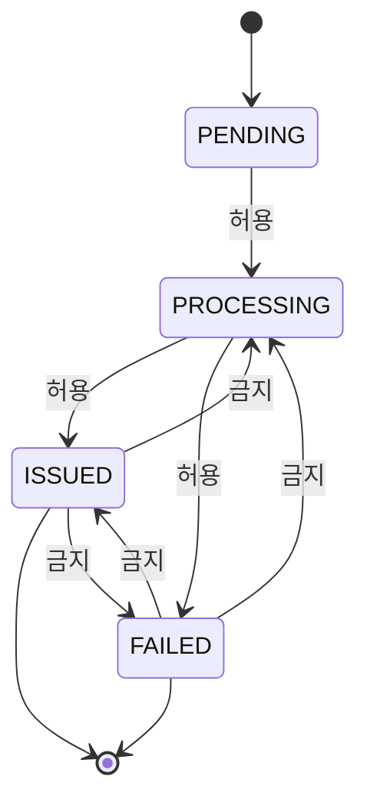
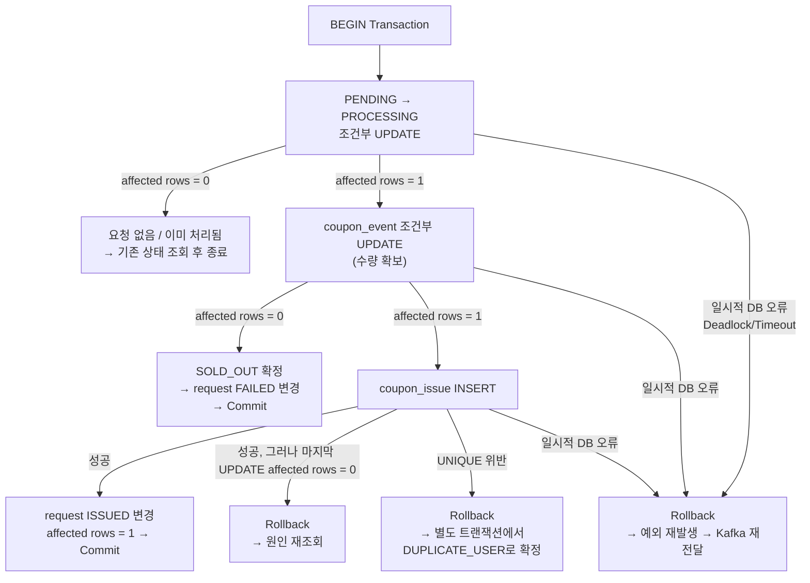
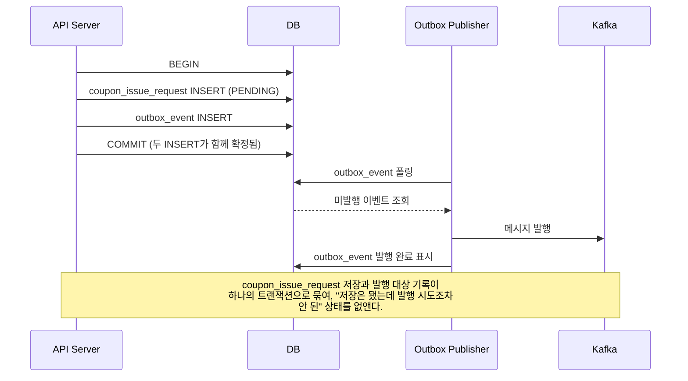

# **5주차 과제**

# **requestId 기반 멱등성과 중복 처리 구조 설계**


## **1. 과제 목표**


## **2. 기본 상황**

서비스에서 다음 선착순 쿠폰 이벤트를 진행한다고 가정한다.

```
이벤트 ID: 100

이벤트 이름: 여름맞이 5,000원 할인 쿠폰 이벤트

전체 쿠폰 수량: 1,000개

발급 조건:
사용자 1명당 해당 이벤트 쿠폰 1개만 발급 가능

DBMS: PostgreSQL

DB 격리 수준: READ COMMITTED

최종 발급 성공 기준:
coupon_event.issued_count 증가,
coupon_issue 저장,
coupon_issue_request ISSUED 변경이
하나의 트랜잭션으로 Commit된 시점
```

사용자 `userId = 10`이 다음 요청을 보낸다.

```
POST /api/coupon-events/100/issue
Authorization: Bearer ...
Idempotency-Key: 4372dbe5-8cc8-4bfa-9cdf-1cd5e9f77b31
```

서버 내부에서는 `Idempotency-Key`를 `requestId`로 사용한다.

```json
{
  "requestId": "4372dbe5-8cc8-4bfa-9cdf-1cd5e9f77b31",
  "eventId": 100,
  "userId": 10,
  "requestedAt": "2026-07-24T12:00:00+09:00"
}
```

하지만 실제 시스템에서는 다음 상황이 발생할 수 있다.

```
상황 1.
서버는 요청을 처리했지만 응답만 유실되어
Client가 같은 requestId로 재시도한다.

상황 2.
사용자가 버튼을 여러 번 눌러
서로 다른 requestId로 같은 쿠폰을 다시 요청한다.

상황 3.
애플리케이션 코드가 같은 메시지를 send()로 두 번 발행한다.

상황 4.
Consumer가 DB Commit 후 Offset Commit 전에 종료되어
같은 Kafka Record를 다시 읽는다.

상황 5.
원본 Topic의 메시지가 Retry Topic으로 이동하여
Partition과 Offset은 달라졌지만 같은 requestId가 다시 전달된다.

상황 6.
같은 requestId가 다른 eventId 또는 다른 userId 요청에 재사용된다.
```

이 모든 상황을 단순히 `UNIQUE(event_id, user_id)` 하나로만 처리할 수는 없다.

```
UNIQUE(event_id, user_id)
→ 같은 사용자의 최종 중복 발급을 막는다.

requestId
→ 같은 논리적인 요청의 재처리를 식별한다.

requestHash
→ 같은 requestId가 다른 요청에 재사용되는 것을 막는다.
```

---

## **3. 이번 과제의 전제 조건**

이번 과제에서는 다음 전제를 따른다.

```
Client는 쿠폰 발급 요청을 보내기 전에 UUID 형식의 requestId를 생성한다.

같은 논리적인 요청을 재시도할 때는
최초 요청과 동일한 requestId를 재사용한다.

새로운 논리적인 작업에는 새로운 requestId를 사용한다.

userId는 Request Body가 아니라
인증된 사용자 정보에서 가져온다.

requestHash는 다음 Canonical String을 기준으로 생성한다.

COUPON_ISSUE|eventId|authenticatedUserId

Hash 알고리즘은 SHA-256을 사용한다.
```

이번 과제에서는 3주차의 Redis 구조를 다음처럼 확장한다고 가정한다.

```
Redis 판정 기준

- eventId + userId
- 해당 사용자의 최초 requestId
```

Redis Lua Script의 반환값은 다음 네 가지로 사용한다.

| **반환값** | **의미** |
| --- | --- |
| `SUCCESS` | 새로운 사용자가 새로운 requestId로 선착순 판정을 통과함 |
| `IDEMPOTENT_RETRY` | 같은 사용자와 같은 requestId가 다시 들어옴 |
| `DUPLICATE_USER` | 같은 사용자가 다른 requestId로 다시 요청함 |
| `SOLD_OUT` | Redis 기준 제한 수량에 도달함 |

이번 과제에서는 Redis를 통과한 요청만 DB 요청 상태 테이블에 저장하는 방식을 기본으로 사용한다.

```
Redis SUCCESS
→ coupon_issue_request PENDING 저장
→ Kafka 발행

Redis DUPLICATE_USER / SOLD_OUT
→ coupon_issue_request를 만들지 않음
→ Kafka에 발행하지 않음
```

요청 상태는 다음 네 가지로 단순화한다.

```
PENDING
PROCESSING
ISSUED
FAILED
```

최종 실패 코드는 다음 예시를 사용할 수 있다.

```
SOLD_OUT
DUPLICATE_USER
INVALID_EVENT
REQUEST_MISMATCH
```

다음 오류는 최종 비즈니스 실패가 아니라 일시적 시스템 오류로 본다.

```
DB 연결 일시 실패
Deadlock
네트워크 Timeout
Connection Pool 일시 부족
Consumer 프로세스 장애
```

일시적 시스템 오류가 발생하면 요청 상태를 `FAILED`로 확정하지 않고 트랜잭션을 Rollback한 뒤 Kafka 재전달을 통해 다시 처리한다.

이번 주차의 기본 Consumer 처리는 짧은 DB 작업이므로 다음 범위를 하나의 트랜잭션으로 묶는다.

```
PENDING → PROCESSING 처리 권한 획득
coupon_event.issued_count 증가
coupon_issue INSERT
coupon_issue_request ISSUED 또는 FAILED 변경
```

이번 주차에서는 아래 내용을 상세 구현하지 않는다.

```
Outbox Publisher 상세 구현

Retry Topic과 DLQ 상세 정책

쿠폰 발급 취소와 재발급

외부 결제나 외부 API 호출이 포함된 장시간 작업

Redis와 RDB를 하나의 분산 트랜잭션으로 묶는 방법
```

다만 Redis, DB, Kafka 사이에서 어떤 불일치가 발생할 수 있는지와 복구 방향은 설명해야 한다.

- 모든 답안은 각 문항 바로 아래에 제공된 코드블록 안에 작성한다.
- 서술형 답안은 빈 코드블록 안에 작성한다.
- 비교표와 상태표는 코드블록 안의 표를 직접 채운다.
- 다이어그램은 코드블록 안에 ASCII 또는 Mermaid 형식으로 작성한다.
- SQL, JSON, HTTP 요청·응답은 제공된 언어별 코드블록 안에 작성한다.
- 코드블록 밖에는 답안을 작성하지 않는다.
```


---

# **5. 필수 과제**

---

## **과제 1. requestId 기반 전체 멱등 처리 구조 그리기**

Client의 최초 요청부터 Kafka Offset Commit까지의 전체 흐름을 다이어그램으로 작성한다.


### **1. 전체 요청 처리 흐름 다이어그램**

```
Client
  |
  | POST /api/coupon-events/100/issue
  | Idempotency-Key: req-001
  v
API Server
  |
  | 인증된 userId 추출
  | requestHash = SHA-256(COUPON_ISSUE|eventId|userId)
  v
Redis Lua Script
  |
  | eventId + userId + requestId 판정
  |
  +-- SOLD_OUT ----------------------> 품절 응답 (DB 저장 없음)
  +-- DUPLICATE_USER ----------------> 409 응답 (DB 저장 없음, Kafka 발행 없음)
  +-- IDEMPOTENT_RETRY --------------> DB 기존 상태 조회 후 응답
  +-- SUCCESS
        |
        v
   coupon_issue_request (PENDING 저장)
   INSERT ... ON CONFLICT (request_id) DO NOTHING
        |
        v
   Kafka Producer
        |
        | key = requestId
        v
   coupon.issue.requested Topic
        |
        v
   Coupon Issue Consumer
        |
        | 메시지-요청행 필드 일치 검증
        | PENDING → PROCESSING 조건부 UPDATE (처리 권한 획득)
        v
   DB Transaction
        |
        +-- coupon_event 조건부 UPDATE (issued_count 증가)
        |     +-- 0행 → FAILED/SOLD_OUT 확정 → Commit
        |
        +-- coupon_issue INSERT
        |     +-- UNIQUE 위반 → Rollback → 별도 트랜잭션 FAILED/DUPLICATE_USER
        |
        +-- coupon_issue_request ISSUED 변경
        v
   Commit 성공
        |
        v
   Kafka Offset Commit
```

### **2. 하나의 requestId가 전체 흐름에서 어떻게 전달되는지 작성하기**

아래 흐름을 완성한다.

```
HTTP Idempotency-Key
        |
        v
애플리케이션 requestId
        |
        v
coupon_issue_request.request_id
        |
        v
Kafka Message requestId
        |
        v
Consumer 멱등 처리
```

### **3. 각 구성 요소의 역할**

```
| **구성 요소** | **역할** |
| --- | --- |
| Redis | 중복 요청·수량 초과 여부를 빠르게 검증해 불필요한 DB 접근을 차단 |
| Kafka | 요청을 비동기로 전달하고, 트래픽 폭주 상황에서 메시지를 안정적으로 완충 |
| coupon_issue_request | 발급 요청 상태와 결과를 저장해 재시도 시 동일한 결과를 보장 |
| coupon_event | 발급 가능 수량을 관리하고 조건부 UPDATE로 초과 발급 방지 |
| coupon_issue | 발급 완료 기록을 저장하고 UNIQUE 제약으로 중복 발급 방지 |
| Kafka Offset | 메시지 처리 위치를 관리하며 DB 반영 후 커밋해 데이터 정합성 보장 |
```

### **4. 각 단계의 성공이 의미하는 것**

```
| **단계** | **의미** | **최종 발급 성공 여부** |
| --- | --- | --- |
| Redis `SUCCESS` | 선착순 검증 통과, 이후 DB/Kafka 처리 대상이 됨 | X |
| request `PENDING` | 발급 요청이 등록되고 Kafka 처리 대기 상태 | X |
| request `PROCESSING` | Consumer가 요청을 처리하며 발급 로직을 수행 중인 상태 | X |
| request `ISSUED` | 수량 차감·발급 기록·요청 상태 변경이 모두 Commit 완료된 상태 | O |
| request `FAILED` | 발급 실패가 확정되어 재시도해도 결과가 변경되지 않는 상태 | X |
| Kafka Offset Commit | 메시지 처리가 완료되었음을 Kafka에 기록하는 단계로, DB 발급 성공 여부와는 별개 | X |
```

### **5. 최종 쿠폰 발급 성공으로 판단할 수 있는 시점**

```
coupon_event.issued_count 증가, coupon_issue 저장, coupon_issue_request.status가 ISSUED로 변경되는 작업이 하나의 DB 트랜잭션으로 Commit 완료된 시점을 최종 발급 성공으로 판단한다.
```

### **6. 요청이 여러 번 도착해도 최종 결과가 한 번만 반영되어야 한다는 의미**

```
클라이언트 재시도, Kafka 메시지 재전달, Consumer 재시작 등으로 인해 동일 요청이 여러 번 전달되고 처리 로직이 실행되는 상황 자체는 완전히 방지할 수 없다.
따라서 requestId를 기준으로 동일한 논리적 요청을 식별하고, 이미 ISSUED 또는 FAILED로 처리 완료된 요청은 발급 로직을 재실행하지 않고 기존 결과를 반환하도록 한다.
이를 통해 실제 쿠폰 발급 데이터(coupon_issue) 저장과 발급 수량(coupon_event.issued_count) 증가가 최종적으로 한 번만 반영되도록 보장한다.
```

---

## **과제 2. 중복 유형과 멱등성 경계 구분하기**

같아 보이는 중복도 원인과 방어 장치가 다르다.

아래 상황을 읽고 각각 어떤 중복인지 구분한다.

### **1. 상황별 중복 유형 분석**

```
| **상황** | **같은 논리적 요청인가?** | **식별 기준** | **주요 방어 장치** |
| --- | --- | --- | --- |
| 응답 유실 후 같은 requestId로 API 재시도 | O | requestId | coupon_issue_request (PK + 조건부 등록) |
| 반복 클릭으로 다른 requestId가 생성됨 | X | eventId + userId | Redis 사용자 중복 판정, DB UNIQUE(event_id, user_id) |
| 애플리케이션이 같은 requestId 메시지를 `send()` 두 번 호출 | O | requestId | Consumer의 requestId 기반 조건부 상태 전이 |
| DB Commit 후 Offset Commit 전 장애로 같은 Record 재전달 | O | requestId (Offset은 식별 기준이 아님) | ISSUED/FAILED 상태 확인 후 재처리 방지 |
| 원본 Topic과 Retry Topic에 같은 requestId가 존재 | O | requestId (Partition/Offset은 다름) | Consumer의 requestId 기반 조건부 상태 전이 |
| 같은 requestId가 다른 eventId에 재사용됨 | X | requestHash | requestHash 비교 후 409 Conflict 반환 |
```

### **2. 같은 요청과 같은 사용자의 차이**

아래 두 상황의 차이를 설명한다.

```
상황 A
requestId = req-001
이 요청이 여러 번 전달됨

상황 B
requestId = req-A, req-B, req-C
모두 eventId = 100, userId = 10
```

답변:

```
[상황 A] 
requestId가 동일하므로 하나의 논리적 요청이 여러 번 전달된 경우.
이 경우 서버는 최초 처리 결과를 그대로 반환해야 하며, 발급 로직을 다시 실행해서는 안 된다. 이를 위해 requestId 기반의 요청 상태 관리(coupon_issue_request)를 통해 멱등성을 보장한다.

[상황 B] 
requestId가 다르므로 서버 입장에서는 서로 다른 요청이다.
하지만 eventId와 userId가 동일하기 때문에 같은 사용자가 동일 쿠폰에 대해 반복 발급을 시도한 상황이다. 이는 요청 재시도가 아닌 비즈니스 규칙 위반(1인 1매) 이므로, requestId 기반 멱등 처리만으로는 방어할 수 없다.

```

### **3. 중복 방어 장치별 역할 비교**

```
| **장치** | **식별 기준** | **막는 문제** | **막지 못하는 문제** |
| --- | --- | --- | --- |
| Redis 사용자 판정 | eventId + userId |  같은 사용자의 반복 요청·수량 초과를 앞단에서 빠르게 차단 | Redis 장애/유실 시 최종 정합성 보장 못함, 같은 요청의 재시도 상태(성공/실패/처리중) 구분 못함 |
| requestId | requestId | 같은 논리적 요청의 재전송/재전달을 식별해 발급 로직 재실행 방지 | 사용자가 새 requestId로 같은 쿠폰을 다시 요청하는 것은 막지 못함 |
| requestHash | requestId + 요청 의미 | 같은 requestId가 다른 요청 내용에 잘못 재사용되는 것 방지 | 서로 다른 requestId로 들어오는 정상적인 중복 요청은 막지 못함 |
| `UNIQUE(event_id, user_id)` | eventId + userId | 같은 사용자의 최종 중복 발급을 DB 레벨에서 방지 (최후 방어선) | 요청의 처리 상태(PENDING/PROCESSING)나 재시도 시 반환할 결과는 알 수 없음 |
| Kafka Partition + Offset | Partition 내 위치 | Consumer가 어디까지 읽었는지 기록, 순서/분산 처리에 도움 | 정확히 한 번의 처리를 보장하지 않음, 비즈니스 중복은 막지 못함 |
```

### **4. Kafka Producer 멱등성이 막는 중복**

다음 흐름을 기준으로 설명한다.

```
애플리케이션이 send() 한 번 호출
→ Broker 저장 성공
→ ACK 유실
→ Producer 내부 재시도
```

```
애플리케이션에서 send()를 한 번만 호출했더라도, Broker의 ACK가 네트워크 문제로 유실되면 Kafka Producer는 전송 실패로 판단하고 동일 메시지를 재전송할 수 있다.

이때 동일한 Producer ID와 Sequence Number를 사용하기 때문에, Broker는 이미 처리한 Sequence Number를 확인하고 중복 저장을 방지한다.

즉, Producer 멱등성은 하나의 send() 요청이 내부 재시도로 여러 번 전송되는 상황에서 발생하는 Broker 레벨의 중복 저장만 방어한다.
```

### **5. 애플리케이션이 send()를 두 번 호출하면 Producer 멱등성으로 막을 수 없는 이유**

```java
kafkaTemplate.send(topic, message);
kafkaTemplate.send(topic, message);
```

```
위와 같이 애플리케이션 코드에서 send()를 두 번 호출하면 Kafka Producer 입장에서는 서로 다른 두 개의 전송 요청으로 처리된다.

각 요청에는 서로 다른 Sequence Number가 부여되므로, Broker는 두 번째 메시지를 재시도가 아닌 새로운 Record로 판단하고 모두 저장한다.

즉, Producer 멱등성은 동일 전송 요청의 재시도 여부만 식별할 수 있으며, 애플리케이션 레벨에서 발생한 논리적 중복 요청은 판단할 수 없다.

이 경우 동일한 requestId를 가진 메시지가 여러 개 생성될 수 있으며, 해당 중복은 Consumer에서 requestId 기반 멱등 처리로 방어해야 한다.
```

### **6. requestId와 Kafka Partition + Offset의 차이**

```
requestId: 쿠폰 발급 요청 자체를 식별하는 비즈니스 식별자

Partition + Offset: Kafka 내부에서 메시지가 저장된 물리적 위치
```
requestId는 "어떤 요청인가"를 나타내고, 
Partition + Offset은 "Kafka 어디에 저장된 메시지인가"를 나타낸다.

### **7. Consumer 멱등성의 기준을 Offset이 아니라 requestId로 두어야 하는 이유**

아래 상황을 포함해서 설명한다.

```
원본 Topic
Partition 0 / Offset 100 / req-001

Retry Topic
Partition 2 / Offset 35 / req-001
```

```
두 Record는 Partition과 Offset은 다르지만 동일한 requestId를 가진 같은 비즈니스 요청이다.
만약 Consumer가 Offset 기준으로 중복 여부를 판단하면 두 메시지를 서로 다른 요청으로 인식하여 쿠폰 발급 로직을 중복 실행할 수 있다.
따라서 Offset은 메시지 처리 위치 관리 용도로만 사용하고, 실제 중복 판단은 비즈니스 식별자인 requestId를 기준으로 수행해야 한다.
어떤 경로로 메시지가 재전달되더라도 동일 요청이라면 requestId는 유지되므로, Consumer는 이를 기준으로 이미 처리된 요청인지 확인해야 한다.
```

---

## **과제 3. Idempotency-Key와 requestHash 설계하기**

HTTP API에서 동일한 논리적 요청의 재시도를 식별할 수 있도록 `Idempotency-Key`와 `requestHash`를 설계한다.

### **1. Idempotency-Key의 의미**

```
클라이언트가 동일한 논리적 요청의 재시도임을 서버에 전달하기 위해 요청 전에 생성하는 고유 식별자이다.
서버 내부에서는 해당 값을 requestId로 사용하며, DB 요청 기록과 Kafka 메시지 등 전체 처리 흐름에서 동일한 요청을 식별하는 기준으로 유지한다.
```

### **2. 누가 requestId를 생성해야 하는가?**

다음 두 방식을 비교하고 이번 구조에 더 적합한 방식을 선택한다.

```
방식 A
Client가 요청 전 requestId 생성

방식 B
API Server가 요청을 받은 뒤 requestId 생성
```

```
| **방식** | **장점** | **단점** |
| --- | --- | --- |
| Client 생성 | 응답 유실이나 네트워크 오류 이후에도 클라이언트가 동일한 requestId를 재사용할 수 있어 정확한 멱등 처리 가능 | 클라이언트가 UUID 형식 등을 준수해야 하며, 잘못된 값 입력을 방지하기 위한 서버 검증 필요 |
| API Server 생성 | 서버가 생성 규칙을 통제할 수 있어 값의 신뢰성이 높음 | 응답 유실 시 클라이언트가 발급된 requestId를 알 수 없어 재시도 시 새로운 요청으로 처리될 가능성이 있음 |
```

내가 선택한 방식: 

```
Client가 요청 전 requestId 생성
```

선택한 이유:

```
이번 구조에서 가장 중요한 문제는 "응답 유실 이후에도 클라이언트가 동일한 요청임을 서버에 전달할 수 있는가"이다.
Idempotency-Key는 서버가 요청을 처리하기 전에 이미 클라이언트가 보유하고 있어야 재시도 상황에서도 동일한 값을 사용할 수 있다.
따라서 API Server가 요청을 받은 이후 requestId를 생성하는 방식은 멱등성 보장 목적에 적합하지 않으며, 클라이언트 생성 방식이 필수적이다.
```

### **3. 같은 requestId를 재사용해야 하는 상황과 새로 생성해야 하는 상황**

```
| **상황** | **같은 requestId 재사용 또는 새 requestId 생성** | **이유** |
| --- | --- | --- |
| 네트워크 Timeout 후 동일 작업 재시도 | 재사용 | 결과가 불명확한 동일 작업의 재확인이므로 같은 논리적 요청임 |
| 응답 유실 후 동일 작업 재시도 | 재사용 | 서버는 처리했을 수 있으나 응답만 유실된 것이므로 동일 요청으로 취급해야 결과를 재현할 수 있음 |
| 모바일 앱 재연결 후 동일 작업 전송 | 재사용 | 연결 문제로 재전송된 것일 뿐 사용자의 새로운 의도가 아님 |
| 다른 쿠폰 이벤트 발급 요청 | 새로 생성 | eventId가 다른 완전히 별개의 논리적 작업임 |
| 기존 요청을 취소하고 새로운 작업 시작 | 새로 생성 | 사용자의 의도가 이전 요청과 달라졌으므로 새로운 논리적 작업임 |
```

### **4. requestId의 형식과 검증 규칙 설계하기**

아래 항목을 포함한다.

```
허용 형식

최대 길이

빈 값 처리

허용하지 않는 문자

DB 유일성 보장 방식
```

답변:

```
허용 형식: UUID v4 형식 (예: 550e8400-e29b-41d4-a716-446655440000)

최대 길이: 36자 (UUID 표준 길이, 하이픈 포함) — 여유를 두더라도 64자를 넘는 값은 즉시 거부

빈 값 처리: Idempotency-Key 헤더가 없거나 빈 문자열이면 400 Bad Request로 거부
            (멱등 처리 없이 요청을 진행시키지 않음)

허용하지 않는 문자: UUID 형식(16진수 문자와 하이픈)을 벗어나는 문자는 거부.
                   공백, 제어문자, SQL 인젝션에 사용될 수 있는 특수문자 등은
                   API 앞단에서 정규식으로 즉시 차단

DB 유일성 보장 방식: request_id를 coupon_issue_request의 Primary Key로 지정.
                    형식 검증은 애플리케이션 레벨에서 1차로 하되,
                    최종 유일성은 DB PK 제약이 보장 (INSERT ON CONFLICT로 처리)
```

### **5. requestHash를 만드는 Canonical String 작성하기**

이번 과제의 기준은 다음과 같다.

```
작업 종류: COUPON_ISSUE
이벤트 ID: 100
인증된 사용자 ID: 10
```

Canonical String:

```
COUPON_ISSUE|100|10
```

SHA-256 결과를 저장할 컬럼:

```
coupon_issue_request.request_hash CHAR(64)
```

### **6. 전체 JSON 문자열을 그대로 Hash하면 안 되는 이유**

아래 두 JSON을 기준으로 설명한다.

```json
{ "eventId": 100, "userId": 10 }
```

```json
{"userId":10,"eventId":100}
```

```
두 JSON은 필드 순서와 공백만 다를 뿐 의미상 완전히 동일한 요청이다.
하지만 문자열을 그대로 해시하면 바이트 단위로 다른 문자열이므로 서로 다른 해시값이 나온다. 
그러면 같은 논리적 요청임에도 서버가 requestHash 불일치로 판단해 409 Conflict를 잘못 반환할 수 있다.
따라서 필요한 필드만 정해진 순서로 정규화한 Canonical String을 만든 뒤 해시해야, 직렬화 방식이 달라도 항상 같은 결과가 나온다.
```

### **7. requestHash에 포함할 값과 포함하지 않을 값 구분하기**

```
| **값** | **포함 여부** | **이유** |
| --- | --- | --- |
| 작업 종류 `COUPON_ISSUE` | 포함 | 같은 requestId가 다른 종류의 작업에 재사용되는 것을 방지하는 최소 단위 |
| eventId | 포함 | 어떤 쿠폰 이벤트에 대한 요청인지가 요청의 의미를 결정하는 핵심 값 |
| 인증된 userId | 포함 | 어떤 사용자의 요청인지가 요청의 의미를 결정하는 핵심 값 |
| 요청 전송 시각 | 미포함 | 같은 논리적 요청의 재시도마다 달라지는 값이므로 포함하면 정상 재시도도 다른 해시가 됨 |
| Trace ID | 미포함 | 요청마다 새로 생성되는 추적용 값으로 비즈니스 의미와 무관 |
| 매번 바뀌는 nonce | 미포함 | 정의상 매번 달라지므로 재시도 식별에 사용할 수 없음 |
| Gateway가 추가한 가변 Header | 미포함 | 클라이언트의 논리적 요청 내용과 무관하게 인프라 레벨에서 달라질 수 있음 |
```

### **8. Request Body의 userId를 requestHash에 그대로 사용하면 안 되는 이유**

```
Request Body의 userId는 클라이언트가 임의로 조작할 수 있는 값이다.
사용자가 자신의 것이 아닌 다른 userId를 Body에 넣어 요청하면, 그 값 그대로 requestHash를 생성하고 검증하는 것은 인증 우회를 그대로 신뢰하는 것과 같다. 
따라서 requestHash와 이후 모든 처리는 반드시 Authorization Token에서 추출한 인증된 사용자 ID를 기준으로 해야 하며, Body의 userId는 무시하거나 인증된 값과 비교해 검증만 해야 한다.
```

### **9. 같은 requestId에 다른 내용이 들어온 경우 처리 설계**

```
기존 요청
requestId = req-001
requestHash = hash(COUPON_ISSUE|100|10)

새 요청
requestId = req-001
requestHash = hash(COUPON_ISSUE|200|10)
```

아래 항목을 작성한다.

```
HTTP Status Code: 409 Conflict

에러 코드: IDEMPOTENCY_KEY_REUSED

Kafka 발행 여부: 발행하지 않음

기존 요청 상태 변경 여부:  변경하지 않음 (기존 req-001의 요청 이력은 그대로 보존)

사용자 응답: "동일한 요청 식별자가 다른 요청에 사용되었습니다." 형태의 에러 메세지 반환
```

---

## **과제 4. coupon_issue_request 테이블과 상태 전이 설계하기**

동일한 요청의 처리 상태와 최종 결과를 저장하기 위한 `coupon_issue_request` 테이블을 설계한다.

### **1. coupon_issue_request와 coupon_issue의 역할 차이**

```
| **테이블** | **저장하는 대상** | **표현할 수 있는 상태** |
| --- | --- | --- |
| coupon_issue_request | 요청 자체의 생명주기 — 접수부터 최종 결과까지의 처리 이력 | PENDING / PROCESSING / ISSUED / FAILED |
| coupon_issue | 실제 발급에 성공한 기록만 | 성공한 발급 건만 존재 |
```

### **2. 요청 상태 모델 설명하기**

```
| **상태** | **의미** | **최종 상태 여부** |
| --- | --- | --- |
| `PENDING` | 요청 행이 생성되었지만 아직 최종 처리가 끝나지 않은 상태 | X |
| `PROCESSING` | Consumer가 처리 권한을 획득해 발급 로직을 실제로 수행 중인 상태 | X |
| `ISSUED` | 수량 증가·발급 기록·상태 변경이 하나의 트랜잭션으로 함께 Commit된 최종 성공 상태 | O |
| `FAILED` | 재시도해도 결과가 바뀌지 않는 최종 실패 상태 | O |
```

### **3. 상태 전이 다이어그램 작성하기**

아래 허용 상태 전이와 금지 상태 전이를 구분해서 표현한다.

```
허용 후보
PENDING → PROCESSING
PROCESSING → ISSUED
PROCESSING → FAILED

금지 후보
ISSUED → PROCESSING
ISSUED → FAILED
FAILED → PROCESSING
FAILED → ISSUED
```



### **4. 단일 트랜잭션 구조에서 외부 조회 시 PROCESSING이 거의 보이지 않을 수 있는 이유**

```
PENDING → PROCESSING → ISSUED(또는 FAILED) 상태 전이가 모두 하나의 DB 트랜잭션 내부에서 처리되기 때문이다.
READ COMMITTED 격리 수준에서는 다른 트랜잭션이 커밋되지 않은 변경 사항을 조회할 수 없다. 따라서 외부에서 동일 요청의 상태를 조회하게 된다면 아래의 흐름만 확인된다.

트랜잭션 커밋 전 → 기존 상태인 PENDING
트랜잭션 커밋 후 → 최종 상태인 ISSUED 또는 FAILED

즉, PROCESSING은 Consumer가 처리 권한을 획득했음을 나타내는 내부 처리 상태이며, 외부 조회에서는 대부분 노출되지 않는다.
```

### **5. coupon_issue_request DDL 작성하기**

아래 컬럼을 포함한다.

```
request_id

event_id

user_id

request_hash

status

failure_code

failure_message

coupon_issue_id

requested_at

processing_started_at

completed_at

created_at

updated_at
```

아래 제약 조건을 포함한다.

```
request_id Primary Key

coupon_event Foreign Key

coupon_issue Foreign Key

coupon_issue_id UNIQUE

status CHECK

FAILED일 때만 failure_code 필수

ISSUED 또는 FAILED일 때 completed_at 필수

ISSUED일 때만 coupon_issue_id 필수

PROCESSING일 때 processing_started_at 필수
```

```sql
CREATE TABLE coupon_issue_request (
    request_id UUID PRIMARY KEY,

    event_id BIGINT NOT NULL,
    user_id BIGINT NOT NULL,

    request_hash CHAR(64) NOT NULL,

    status VARCHAR(20) NOT NULL,

    failure_code VARCHAR(50),
    failure_message VARCHAR(255),

    coupon_issue_id BIGINT,

    requested_at TIMESTAMPTZ NOT NULL,
    processing_started_at TIMESTAMPTZ,
    completed_at TIMESTAMPTZ,

    created_at TIMESTAMPTZ NOT NULL DEFAULT CURRENT_TIMESTAMP,
    updated_at TIMESTAMPTZ NOT NULL DEFAULT CURRENT_TIMESTAMP,

    CONSTRAINT fk_coupon_issue_request_event
        FOREIGN KEY (event_id) REFERENCES coupon_event(id),

    CONSTRAINT fk_coupon_issue_request_issue
        FOREIGN KEY (coupon_issue_id) REFERENCES coupon_issue(id),

    CONSTRAINT uk_coupon_issue_request_issue
        UNIQUE (coupon_issue_id),

    CONSTRAINT chk_coupon_issue_request_status
        CHECK (status IN ('PENDING', 'PROCESSING', 'ISSUED', 'FAILED')),

    CONSTRAINT chk_coupon_issue_request_failure
        CHECK (
            (status = 'FAILED' AND failure_code IS NOT NULL)
            OR
            (status <> 'FAILED'
                AND failure_code IS NULL
                AND failure_message IS NULL)
        ),

    CONSTRAINT chk_coupon_issue_request_completed
        CHECK (
            (status IN ('ISSUED', 'FAILED') AND completed_at IS NOT NULL)
            OR
            (status IN ('PENDING', 'PROCESSING') AND completed_at IS NULL)
        ),

    CONSTRAINT chk_coupon_issue_request_issue_result
        CHECK (
            (status = 'ISSUED' AND coupon_issue_id IS NOT NULL)
            OR
            (status <> 'ISSUED' AND coupon_issue_id IS NULL)
        ),

    CONSTRAINT chk_coupon_issue_request_processing
        CHECK (
            (status = 'PROCESSING' AND processing_started_at IS NOT NULL)
            OR
            (status <> 'PROCESSING')
        )
);
```

### **6. 요청 상태 테이블에 `UNIQUE(event_id, user_id)`를 두지 않는 이유**

아래 이력이 모두 저장되어야 한다는 점을 포함해서 설명한다.

```
req-A → ISSUED
req-B → FAILED / DUPLICATE_USER
```

```
coupon_issue_request는 발급 결과가 아닌 요청 이력을 관리하는 테이블이다.
같은 사용자가 동일 이벤트에 대해 여러 번 요청한 경우, 두 요청은 각각의 처리 이력으로 저장되어야 한다.
만약 coupon_issue_request에 UNIQUE(event_id, user_id)를 적용하면 두 번째 요청(req-B)을 저장할 수 없거나 기존 요청(req-A)을 덮어써야 하는 상황이 생긴다. 
따라서 coupon_issue_request는 모든 요청 이력 관리로, coupon_issue는 실제 발급 결과 및 사용자별 중복 방지로 역할을 분리한다.

```

### **7. 상태 변경 SQL에 출발 상태를 조건으로 포함해야 하는 이유**

잘못된 예:

```sql
UPDATE coupon_issue_request
SET status = 'ISSUED'
WHERE request_id = :requestId;
```

올바른 상태 전이 SQL을 직접 작성한다.

```sql
UPDATE coupon_issue_request
SET status = 'ISSUED',
    coupon_issue_id = :couponIssueId,
    completed_at = CURRENT_TIMESTAMP,
    updated_at = CURRENT_TIMESTAMP
WHERE request_id = :requestId
  AND status = 'PROCESSING';
```
출발 상태 조건이 없으면 이미 FAILED로 확정된 요청을 오래된 Consumer나 재처리 로직이 다시 ISSUED로 변경할 수 있다.
반대로 이미 ISSUED 상태인 요청이 FAILED로 덮어써지는 문제도 발생할 수 있다.

### **8. 최종 상태 변경의 영향받은 row 수가 0인 경우**

가능한 원인을 작성한다.

```
1. 요청 데이터가 존재하지 않는 경우
  -> DB 요청 등록과 Kafka 메시지 발행 사이의 불일치 발생

2. 다른 Consumer가 이미 처리 완료한 경우
  -> 동일 요청이 먼저 ISSUED 또는 FAILED 상태로 확정됨

3. 트랜잭션 Rollback으로 상태가 변경된 경우
  -> 발급 처리 중 오류로 PROCESSING 전이가 유지되지 않고 PENDING으로 돌아간 상태에서 업데이트 시도

즉, row 수 0은 단순 실패가 아니라 이미 처리되었거나 상태가 예상과 달라진 상황을 의미하는 신호이다.
```

### **9. 운영 복구를 위한 인덱스 설계하기**

오래된 `PENDING` 또는 `PROCESSING` 요청을 찾기 위한 인덱스를 작성한다.

```sql
CREATE INDEX idx_coupon_issue_request_status_updated
ON coupon_issue_request (status, updated_at);
```

### **10. 요청 상태 보관 기간과 Idempotency-Key 유효 기간의 관계**

아래 식을 완성하고 이유를 설명한다.

```
Idempotency-Key 유효 기간 ≤ 요청 상태 보관 기간
___
요청 상태 보관 기간
```

이유:

```
클라이언트가 동일한 Idempotency-Key를 재사용할 수 있는 기간 동안 서버에는 해당 requestId에 대한 처리 기록이 반드시 남아 있어야 한다.
만약 요청 상태가 먼저 삭제되고 Idempotency-Key는 아직 유효하다면, 클라이언트 재시도 발생, 서버는 기존 요청을 찾지 못하는 문제가 발생할 수 있다.
따라서 멱등성 보장기간은 요청 상태 보관 기간을 초과할 수 없으며, 요청 기록은 최소한 Idempotency-Key 유효 기간 이상 유지해야 한다.
```

---

## **과제 5. API Server의 멱등 요청 접수 흐름 설계하기**

API Server가 Redis 판정, 요청 상태 등록, Kafka 발행을 어떤 순서로 처리할지 설계한다.

이번 과제에서는 Redis를 통과한 요청만 DB에 저장하는 방식을 기본으로 한다.

### **1. API Server 전체 처리 흐름 다이어그램**

다음 결과를 모두 포함한다.

```
SUCCESS
IDEMPOTENT_RETRY
DUPLICATE_USER
SOLD_OUT
requestId 충돌
Kafka 발행 실패
```

```
flowchart TD
    A[Client 요청 + Idempotency-Key] --> B[인증된 userId 확인 / requestHash 생성]
    B --> C[Redis Lua Script 판정]

    C -->|SOLD_OUT| D[품절 응답 반환]
    C -->|DUPLICATE_USER| E[409 응답 반환]
    C -->|IDEMPOTENT_RETRY| F[DB 기존 상태 조회]
    F --> G[기존 상태 기반 응답 반환]
    C -->|SUCCESS| H["coupon_issue_request INSERT<br/>ON CONFLICT DO NOTHING"]

    H -->|affected rows = 1| I[최초 등록 성공]
    I --> J[Kafka 발행 시도]
    J -->|발행 성공| K[202 Accepted 응답]
    J -->|발행 실패| L[발행 재시도 / PENDING으로 남김 → 복구 배치 대상]

    H -->|affected rows = 0| M[기존 행 조회]
    M -->|requestHash 같음| N[동일 요청 재시도로 판단 → 기존 상태 반환]
    M -->|requestHash 다름| O[409 Conflict: IDEMPOTENCY_KEY_REUSED]
```

### **2. Redis 결과별 API 처리**

```
| **Redis 결과** | **DB 요청 상태 등록** | **Kafka 발행** | **API 응답 방향** |
| --- | --- | --- | --- |
| `SUCCESS` | PENDING 상태로 신규 등록 | 등록 성공 후 발행 | 202 Accepted + PENDING 반환 |
| `IDEMPOTENT_RETRY` | X | 발행하지 않음 | 기존 requestId의 DB 상태 |
| `DUPLICATE_USER` | X | 발행하지 않음 | 409 Conflict 또는 이미 발급 완료 안내 |
| `SOLD_OUT` | X | 발행하지 않음 | 품절 상태 반환 |
```

### **3. 동일 requestId 동시 요청에서 SELECT 후 INSERT가 안전하지 않은 이유**

아래 흐름을 시간 순서로 완성한다.

```
시간       API Server A               API Server B
----------------------------------------------------------
T1      req-001 SELECT → 없음       
T2                                  req-001 SELECT → 없음
T3      최초 요청으로 판단
T4                                최초 요청으로 판단               
T5      INSERT 시도
T6                                     INSERT 시도
```

문제의 이름:

```
두 요청 모두 INSERT 전에 동일한 결과를 조회하기 때문에, 둘 다 자신이 최초 요청이라고 판단할 수 있다.
이 문제를 Check-Then-Act Race Condition라고 한다.
따라서 조회 후 저장하는 방식이 아니라, DB의 유일성 제약을 활용해 INSERT 자체를 최초 등록 판단 기준으로 사용해야 한다.
```

### **4. DB 유일성 제약을 이용한 최초 등록자 결정 SQL 작성하기**

PostgreSQL의 `ON CONFLICT DO NOTHING`을 사용한다.

```sql
INSERT INTO coupon_issue_request (
    request_id,
    event_id,
    user_id,
    request_hash,
    status,
    requested_at
)
VALUES (
    :requestId,
    :eventId,
    :userId,
    :requestHash,
    'PENDING',
    :requestedAt
)
ON CONFLICT (request_id) DO NOTHING;
```

### **5. INSERT 영향받은 row 수 처리**

```
affected rows = 1
→ 현재 요청이 최초 등록 요청이다.

- 요청 상태를 PENDING으로 등록 성공
- Kafka 메시지 발행 진행

affected rows = 0
→ 동일 requestId를 가진 요청이 이미 존재한다.

기존 요청 조회
requestHash 비교 후 처리 분기
```

### **6. 기존 행의 requestHash 확인 결과에 따른 처리**

```
| **조건** | **판단** | **처리** |
| --- | --- | --- |
| requestId 같음 + requestHash 같음 | 동일한 논리적 요청의 재시도 | Kafka 재발행 없이 기존 상태 반환 |
| requestId 같음 + requestHash 다름 |Idempotency-Key 재사용 오류  | 409 Conflict 반환 |
```

### **7. Redis가 `IDEMPOTENT_RETRY`를 반환했지만 DB에 요청 행이 없는 경우**

이 상태가 발생할 수 있는 이유를 설명한다.

```
Redis Lua Script는 eventId + userId + requestId 조합을 원자적으로
기록하지만, 그 이후 API Server가 coupon_issue_request를 INSERT하는
단계는 Redis 트랜잭션과 별개의 작업이다. Redis 기록은 성공했지만
그 직후 API Server가 장애로 종료되거나 DB 연결에 실패하면, Redis는
이미 이 requestId를 "통과한 요청"으로 기억하고 있는데 DB에는 그
요청의 행이 존재하지 않는 상태가 된다. 이후 같은 requestId로 재시도가
들어오면 Lua Script는 이를 IDEMPOTENT_RETRY로 판단하지만 DB에는
아무 행도 없다.
```

이 상태를 무조건 정상 `PENDING`으로 응답하면 안 되는 이유:

```
DB에 요청 행이 없다는 것은 실제로 Kafka 발행도, 요청 등록도 이루어지지
않았다는 뜻이다. 이 상태를 정상 PENDING으로 간주해 202 Accepted만
반환하고 끝내버리면, 사용자는 요청이 처리 중이라고 믿지만 실제로는
아무 처리도 진행되지 않는 요청 유실이 발생한다.
```

재조회·복구·보상 방향:

```
1. 짧은 시간 대기 후 DB를 재조회한다 (동시성 문제로 아주 짧은 지연이
   있을 수 있으므로 즉시 실패로 단정하지 않는다).
2. 그래도 행이 없다면 동일 requestId로 DB 등록(INSERT)과 Kafka 발행을
   다시 시도한다.
3. 일정 시간 이상 등록이 계속 실패하면 Redis에 기록된 해당 사용자의
   자리를 보상(삭제 또는 롤백)하여 다른 시도가 가능하게 하거나,
   운영 알림을 발생시켜 수동 개입을 요청한다.
4. 이 상황이 발생한 requestId와 시각을 로그·메트릭으로 남겨 추적한다.
```

### **8. Redis가 `SUCCESS`를 반환했지만 DB INSERT가 충돌한 경우**

다음 상황을 고려한다.

```
과거 요청 req-001은 DB에 존재한다.
Redis 데이터는 초기화되었다.
Client가 req-001을 다시 전송한다.
Redis는 새로운 요청으로 판단해 SUCCESS를 반환한다.
DB INSERT는 request_id 충돌로 0행이다.
```

아래 항목을 작성한다.

```
기존 requestHash 확인: 
DB에 이미 존재하는 req-001 행의 request_hash를 조회해 이번 요청의
requestHash와 비교한다. 같으면 동일 요청의 재시도이므로 기존 상태를
반환하고, 다르면 IDEMPOTENCY_KEY_REUSED로 409 처리한다.

Kafka 발행 여부:
발행하지 않는다. INSERT가 0행이므로 이미 존재하는 요청이며, 새로운
발급 처리를 다시 시작하면 안 된다.

Redis에서 새로 차지한 자리 처리:
Redis는 이번 요청을 새로운 사용자 판정 통과로 잘못 기록했으므로,
실제로는 중복 등록이 아니었음을 반영해 Redis의 수량·사용자 기록을
보상(정정)해야 한다. 이때도 다른 요청과의 경쟁을 피하기 위해 Lua
Script로 현재 저장된 requestId가 보상 대상과 같은지 확인한 뒤 처리한다.

API 응답:
기존 DB 상태(ISSUED 또는 FAILED 등)를 그대로 조회해 반환한다.

```

### **9. 최초 요청 접수 성공 응답 설계하기**

HTTP Status Code: 202 Accepted

```

```

응답 JSON:

```json
{
  "requestId": "4372dbe5-8cc8-4bfa-9cdf-1cd5e9f77b31",
  "status": "PENDING",
  "message": "쿠폰 발급 요청이 접수되었습니다."
}
```

이 응답이 최종 발급 성공을 의미하지 않는 이유:

```
202 Accepted는 요청이 비동기 처리 흐름(Kafka 발행)에 들어갔다는
의미일 뿐이다. 실제 수량 증가, coupon_issue 저장, 요청 상태 확정은
아직 Consumer의 DB 트랜잭션에서 처리되지 않은 상태이므로, 이 시점에
ISSUED라고 응답하면 실제 결과와 어긋날 수 있다.
```

### **10. 동일 requestId 재요청의 응답 설계하기**

`PENDING`, `ISSUED`, `FAILED` 상태 각각에 대해 응답을 설계한다.

#### **PENDING**

```json
{
  "requestId": "4372dbe5-8cc8-4bfa-9cdf-1cd5e9f77b31",
  "status": "PENDING",
  "message": "요청이 아직 처리 중입니다. 잠시 후 다시 조회해주세요."
}
```

#### **ISSUED**

```json
{
  "requestId": "4372dbe5-8cc8-4bfa-9cdf-1cd5e9f77b31",
  "status": "ISSUED",
  "couponIssueId": 5001,
  "message": "이미 쿠폰 발급이 완료되었습니다."
}
```

#### **FAILED**

```json
{
  "requestId": "4372dbe5-8cc8-4bfa-9cdf-1cd5e9f77b31",
  "status": "FAILED",
  "failureCode": "SOLD_OUT",
  "message": "쿠폰이 모두 소진되었습니다."
}
```

### **11. 같은 requestId에 다른 내용이 들어온 경우 응답 설계하기**

```json
{
  "requestId": "4372dbe5-8cc8-4bfa-9cdf-1cd5e9f77b31",
  "errorCode": "IDEMPOTENCY_KEY_REUSED",
  "message": "동일한 요청 식별자가 다른 요청에 사용되었습니다."
}
```

HTTP Status Code와 이유:

```
409 Conflict — 클라이언트가 보낸 요청이 서버가 기억하는 기존
리소스(requestId)의 상태와 충돌하기 때문이다. 새로운 요청이라면
클라이언트는 새로운 Idempotency-Key를 생성해서 재요청해야 한다.
```

### **12. 상태 조회 API의 인증 조건 작성하기**

API: 

```
GET /api/coupon-issue-requests/{requestId}
```

조회 SQL:

```sql
SELECT request_id,
       event_id,
       status,
       failure_code,
       coupon_issue_id,
       requested_at,
       completed_at
FROM coupon_issue_request
WHERE request_id = :requestId
  AND user_id = :authenticatedUserId;
```

`requestId`만으로 조회하면 안 되는 이유:

```
requestId는 클라이언트가 생성한 UUID일 뿐 비밀값이 아니며, 로그나
네트워크 상에서 노출될 가능성이 있다. requestId만으로 조회를 허용하면 그 값을 알아낸 제3자가 다른 사용자의 발급 결과를 조회할 수 있게 되므로, 반드시 인증된 사용자 ID와 요청의 소유자(user_id)가 일치하는지 함께 확인해야 한다.
```

---

## **과제 6. Consumer의 조건부 상태 전이와 처리 권한 설계하기**

Kafka 메시지가 중복 전달되더라도 한 Consumer만 실제 발급 로직을 수행하도록 처리 권한 획득 방식을 설계한다.

### **1. Kafka 메시지와 요청 상태 행의 일치 검증**

다음 필드를 비교한다.

```
| **필드** | **Kafka Message** | **coupon_issue_request** | **불일치 시 처리** |
| --- | --- | --- | --- |
| requestId | 메시지의 requestId | request_id (PK로 조회 기준) | 조회 자체가 안 되므로 요청 행 없음으로 처리 |
| eventId | 메시지의 eventId | event_id  | 발급 처리 금지, DLQ 또는 운영 확인 대상 |
| userId | 메시지의 userId | user_id | 발급 처리 금지, DLQ 또는 운영 확인 대상 |
```

메시지 내용 불일치를 재시도 대상으로 두기 어려운 이유:

```
같은 requestId인데 eventId나 userId가 다르다는 것은 일시적인 시스템
장애(Deadlock, Timeout 등)가 아니라 메시지 손상이나 requestId의
잘못된 재사용 같은 구조적 문제다. 이런 메시지는 몇 번을 다시 처리해도
결과가 달라지지 않으므로 Kafka 재전달로 자동 재시도할 대상이 아니라,
DLQ로 격리해 운영자가 원인을 확인해야 하는 대상이다.
```

### **2. SELECT 후 UPDATE 방식의 Race Condition 분석하기**

위험한 흐름은 다음과 같다.

```
1. 상태를 SELECT한다.
2. PENDING인지 애플리케이션에서 확인한다.
3. PROCESSING으로 UPDATE한다.
```

두 Consumer가 동시에 실행되는 시간 순서 다이어그램을 작성한다.

```
시간       Consumer A                  Consumer B
------------------------------------------------------------
T1
T2
T3
T4
T5
T6
T7
```

### **3. 조건부 UPDATE로 처리 권한 획득하기**

SQL을 작성한다.

```sql
UPDATE coupon_issue_request
SET status = 'PROCESSING',
    processing_started_at = CURRENT_TIMESTAMP,
    updated_at = CURRENT_TIMESTAMP
WHERE request_id = :requestId
  AND status = 'PENDING';
```

### **4. 영향받은 row 수의 의미**

```
affected rows = 1
→ 내가 PENDING을 PROCESSING으로 변경했다. 처리 권한을 획득했으므로
   발급 로직을 계속 진행한다.


affected rows = 0
→ 요청이 없거나, 다른 Consumer가 이미 처리했거나, 이미 최종 상태
   (ISSUED/FAILED)다. 발급 로직을 실행하지 않고 현재 상태를 다시
   조회해 분기한다.
```

### **5. 두 Consumer가 동시에 같은 requestId를 처리할 때 DB 내부 동작**

현재 상태는 `PENDING`이다.

```
Consumer A: 
조건부 UPDATE 실행 → Row Lock 획득 → status를 PENDING에서
PROCESSING으로 변경 → affected rows = 1 → 트랜잭션 계속 진행

Consumer B:
같은 행에 대해 조건부 UPDATE 실행 → A가 Row Lock을 보유하고 있으므로
A의 트랜잭션이 끝날 때까지 대기
```

`READ COMMITTED`에서 두 번째 Consumer의 `WHERE status = 'PENDING'` 조건이 어떻게 처리되는지 설명한다.

```
Consumer A의 트랜잭션이 Commit(또는 Rollback)되어 Lock이 풀리면,
Consumer B의 UPDATE 문은 대기를 끝내고 WHERE 조건을 최신 데이터로
다시 평가한다. 
READ COMMITTED에서는 각 문장이 실행 시점의 최신 커밋된 데이터를 기준으로 판단하므로, 이미 status가 PROCESSING(또는 ISSUED/FAILED)으로 바뀐 상태에서 WHERE status = 'PENDING' 조건은 더 이상 만족되지 않아 affected rows = 0이 되고, Consumer B는 처리 권한을 얻지 못한다.
```

### **6. REPEATABLE READ 이상에서 달라질 수 있는 점**

```
REPEATABLE READ 이상의 격리 수준에서는 Consumer B가 대기 후 조건을
재평가하는 대신, 트랜잭션 시작 시점의 스냅샷과 그 사이에 변경된
데이터 간의 충돌로 인해 직렬화 오류(could not serialize access due
to concurrent update)가 발생한다. 이 경우 Consumer B는 조용히
affected rows = 0을 받는 것이 아니라 예외를 받게 되며, 애플리케이션이 트랜잭션 전체를 처음부터 재시도해야 한다.
```

### **7. affected rows가 0일 때 상태별 처리**

```
| **조회 결과** | **의미** | **Consumer 처리** | **Offset 처리 방향** |
| --- | --- | --- | --- |
| 요청 행 없음 | DB 요청 등록과 Kafka 메시지 발행 사이의 불일치 | 발급 처리하지 않음, 운영 로그 남김, 재시도 또는 복구 대상으로 분류 | 즉시 Commit하지 않고 재시도 정책 또는 DLQ로 분기 |
| `PENDING` | 다른 조건부 UPDATE 재시도로도 여전히 PENDING이면 비정상 | 재시도 로직으로 다시 조건부 UPDATE 시도 | 재시도 후 결정 |
| `PROCESSING` | 다른 Consumer가 현재 처리 중 | 발급 처리하지 않음, 잠시 후 재확인 또는 Lease 기반 회수 대기 | 즉시 Commit하지 않음, 재시도 |
| `ISSUED` | 이미 성공적으로 완료된 요청의 중복 메시지 | 발급 처리하지 않음, 기존 결과를 그대로 정상 처리로 간주 | Commit |
| `FAILED` | 이미 최종 실패로 확정된 요청의 중복 메시지 | 발급 처리하지 않음, 기존 결과를 그대로 정상 처리로 간주 | Commit |
```

### **8. ISSUED 또는 FAILED 중복 메시지를 예외로 던지면 안 되는 이유**

아래 잘못된 흐름을 기준으로 설명한다.

```
ISSUED 확인
→ DuplicateMessageException
→ Retry Topic
→ 다시 ISSUED 확인
→ 다시 예외
→ DLQ
```

```
이미 ISSUED로 확정된 요청은 비즈니스 관점에서 완전히 정상적으로 처리가 끝난 상태다. 이를 예외로 처리하면 이미 성공한 요청이 Retry Topic으로 이동했다가 다시 같은 예외를 만나 결국 DLQ까지 흘러가는데, 이는 실제로는 아무 문제도 없는 메시지를 시스템 오류가 있는 것처럼 계속 재시도·격리시키는 불필요한 낭비다. DLQ는 원인을 파악해야 하는 비정상 메시지를 위한 것이지, 이미 정상 완료된 요청의 재전달을 위한
것이 아니다.
```

### **9. 최종 상태를 확인하고 아무 변경 없이 종료하는 것도 성공적인 처리인 이유**

```
멱등 처리의 목표는 "메시지가 도착할 때마다 무언가를 새로 하는 것"이
아니라 "최종 비즈니스 결과가 한 번만 반영되는 것"이다. 이미 ISSUED나
FAILED로 확정된 요청에 대해 발급 로직을 실행하지 않고 그대로 Offset을
Commit하는 것은, 이 메시지에 대해 해야 할 일(중복 발급 방지)을 정확히
수행한 것이므로 실패가 아니라 정상적인 성공 처리다.
```

---

## **과제 7. 발급 트랜잭션과 Rollback 이후 상태 확정 설계하기**

처리 권한 획득부터 최종 요청 상태 변경까지를 하나의 DB 트랜잭션으로 설계한다.

### **1. 트랜잭션에 포함할 작업과 포함하지 않을 작업 구분하기**

```
| **작업** | **발급 트랜잭션 포함 여부** | **이유** |
| --- | --- | --- |
| PENDING → PROCESSING | 포함 | 처리 권한 획득부터 최종 결과까지 하나의 원자적 단위로 묶어야 부분 성공을 방지할 수 있음 |
| coupon_event 수량 확보 | 포함 | 발급 기록·요청 상태와 함께 Commit되어야 수량-기록 불일치를 막을 수 있음 |
| coupon_issue INSERT | 포함 | 수량 증가, 상태 변경과 함께 원자적으로 처리되어야 하는 핵심 발급 결과 |
| request ISSUED / FAILED 변경 | 포함 | 발급 결과와 요청 상태가 어긋나면 상태 조회 API가 잘못된 정보를 반환하게 됨 |
| 이메일 발송 | 미포함 | 외부 네트워크 호출로 응답 시간이 길고 실패 시점이 불확실해 핵심 트랜잭션의 Lock 점유 시간을 늘림 |
| 앱 푸시 발송 | 미포함 | 이메일과 동일한 이유로 외부 시스템 장애가 핵심 발급 흐름에 전파되는 것을 막아야 함 |
| 마이페이지 조회 모델 갱신 | 미포함 | 별도 조회 모델 갱신은 후속 이벤트로 분리해도 핵심 발급 결과의 정합성에는 영향 없음 |
| 외부 API 호출 | 미포함 | Row Lock과 DB Connection을 오래 점유하게 되고 외부 서비스 장애가 트랜잭션 전체를 위협함 |
```

### **2. 전체 발급 트랜잭션 흐름 다이어그램**

다음 경로를 모두 포함한다.

```
처리 권한 획득 0행

수량 UPDATE 0행

coupon_issue INSERT 성공

coupon_issue UNIQUE 위반

최종 ISSUED 변경 0행

일시적 DB 오류
```



### **3. 정상 발급 SQL 흐름 완성하기**

```sql
BEGIN;

-- 1. PENDING 요청의 처리 권한 획득
UPDATE coupon_issue_request
SET status = 'PROCESSING',
    processing_started_at = CURRENT_TIMESTAMP,
    updated_at = CURRENT_TIMESTAMP
WHERE request_id = :requestId
  AND status = 'PENDING';

-- 2. 수량이 남아 있을 때만 issued_count 증가
UPDATE coupon_event
SET issued_count = issued_count + 1,
    updated_at = CURRENT_TIMESTAMP
WHERE id = :eventId
  AND issued_count < total_quantity;

-- 3. 최종 발급 기록 저장
INSERT INTO coupon_issue (
    event_id, user_id, status, issued_at
)
VALUES (
    :eventId, :userId, 'ISSUED', CURRENT_TIMESTAMP
)
RETURNING id;

-- 4. 요청 상태를 ISSUED로 변경
UPDATE coupon_issue_request
SET status = 'ISSUED',
    coupon_issue_id = :couponIssueId,
    completed_at = CURRENT_TIMESTAMP,
    updated_at = CURRENT_TIMESTAMP
WHERE request_id = :requestId
  AND status = 'PROCESSING';
  -- affected rows = 1 확인 후 Commit

COMMIT;
```

### **4. 각 단계에서 반드시 확인할 영향받은 row 수**

```
| **단계** | **정상적으로 기대하는 row 수** | **기대값과 다를 때 처리** |
| --- | --- | --- |
| 처리 권한 획득 | 1행 | 0행이면 요청 없음/이미 처리됨/다른 Consumer가 처리 중이므로 이후 SQL을 실행하지 않고 기존 상태를 조회해 분기 |
| 수량 UPDATE | 0또는 1행 | 0행이면 SOLD_OUT으로 확정, 같은 트랜잭션에서 request를 FAILED로 변경 후 Commit |
| 최종 ISSUED 변경 | 1행 | 0행이면 전체 트랜잭션을 Rollback해야 함 — 발급 결과만 커밋되고 요청 상태가 갱신되지 않는 불일치를 방지 |
```

### **5. 마지막 ISSUED 상태 변경이 0행인데 발급 결과만 Commit하면 안 되는 이유**

```
수량 증가와 coupon_issue 저장은 성공했는데 요청 상태 변경만 실패한
채로 Commit하면, 실제로는 발급이 완료되었는데 coupon_issue_request는
PROCESSING(또는 다른 상태)에 머물러 있는 불일치가 생긴다. 이 경우
상태 조회 API는 사용자에게 잘못된 처리 중 상태를 보여주게 되고,
같은 requestId 메시지가 재전달되면 PROCESSING → ISSUED 조건부 
UPDATE가 다시 실행될 수 있어 상태 전이 규칙이 흔들린다. 따라서
마지막 단계가 0행이면 전체를 Rollback해 세 작업이 함께 성공하거나
함께 실패하는 원칙을 지켜야 한다.
```

### **6. DB 기준 수량이 소진된 경우 처리**

조건부 UPDATE가 0행이고 이벤트가 존재하며 수량이 모두 소진된 것으로 확정되었다고 가정한다.

요청 상태를 `FAILED / SOLD_OUT`으로 변경하는 SQL을 작성한다.

```sql
UPDATE coupon_issue_request
SET status = 'FAILED',
    failure_code = 'SOLD_OUT',
    failure_message = '쿠폰이 모두 소진되었습니다.',
    completed_at = CURRENT_TIMESTAMP,
    updated_at = CURRENT_TIMESTAMP
WHERE request_id = :requestId
  AND status = 'PROCESSING';
```

발급 행 생성 여부:

```
생성하지 않는다. coupon_issue INSERT 단계까지 도달하지 않으므로
발급 기록은 존재하지 않는다.
```

같은 메시지가 다시 들어왔을 때 처리:

```
PENDING → PROCESSING 조건부 UPDATE에서 이미 상태가 FAILED이므로
affected rows = 0이 되고, Consumer는 기존 FAILED 상태를 확인한 뒤
발급 로직을 재실행하지 않고 정상 종료(Offset Commit)한다.
```

### **7. 서로 다른 requestId로 같은 사용자가 다시 발급을 시도한 경우**

이 시나리오는 Redis 관리자 admission 기록이 유실되거나 만료되어 req-B가 SUCCESS로 통과한 상황을 가정한다. 이때 DB의 UNIQUE(event_id, user_id)가 최종 방어선이 된다.

```
기존 요청
req-A / eventId=100 / userId=10 / ISSUED

새 요청
req-B / eventId=100 / userId=10 / PENDING
```

`req-B` 처리 중 `coupon_issue` INSERT에서 `UNIQUE(event_id, user_id)` 위반이 발생했다.

아래 항목을 설명한다.

```
첫 번째 트랜잭션의 상태:
UNIQUE 위반 예외가 발생해 트랜잭션 전체가 실패 상태가 되며,
PostgreSQL은 이 트랜잭션을 더 이상 사용할 수 없다 (반드시 Rollback해야 함).


PENDING → PROCESSING 전이의 결과:
Rollback되면서 이 전이도 함께 취소되어, req-B의 상태는 다시 PENDING으로 되돌아간다 (PROCESSING이 아니다).

앞에서 증가한 issued_count의 결과:
coupon_event.issued_count + 1도 Rollback으로 함께 취소된다. 실제 발급되지 않은 쿠폰의 수량이 영구히 소모되는 것을 막기 위한 의도된 동작이다.

같은 트랜잭션에서 FAILED로 바꿀 수 있는가?:
바꿀 수 없다. PostgreSQL은 제약 조건 위반이 발생한 트랜잭션 내에서
추가 작업을 허용하지 않으므로, 반드시 Rollback 후 새로운 트랜잭션을
시작해야 상태를 FAILED로 변경할 수 있다.

```

### **8. UNIQUE 위반 Rollback 후 별도 트랜잭션 처리 순서**

```
1. 현재 발급 트랜잭션을 Rollback한다.

2. 새 트랜잭션을 시작한다.

3. 기존 coupon_issue를 조회해 같은 사용자의 발급 기록이 이미
   존재함을 확인한다.

4. req-B의 요청 상태를 FAILED / DUPLICATE_USER로 확정한다
   (출발 상태는 PROCESSING이 아니라 PENDING).

5. 새 트랜잭션을 Commit한다.
```

### **9. Rollback 후 요청 상태를 어떤 출발 상태에서 FAILED로 변경해야 하는가?**

잘못된 SQL:

```sql
UPDATE coupon_issue_request
SET status = 'FAILED'
WHERE request_id = :requestId
  AND status = 'PROCESSING';
```

올바른 SQL을 작성한다.

```sql
UPDATE coupon_issue_request
SET status = 'FAILED',
    failure_code = 'DUPLICATE_USER',
    failure_message = '이미 발급받은 사용자입니다.',
    completed_at = CURRENT_TIMESTAMP,
    updated_at = CURRENT_TIMESTAMP
WHERE request_id = :requestId
  AND status = 'PENDING';
```

왜 `PROCESSING`이 아닌지 설명한다.

```
UNIQUE 위반으로 첫 번째 트랜잭션이 Rollback되면서 PENDING → PROCESSING 전이 자체도 취소되어, DB에 실제로 남아 있는 상태는 PROCESSING이 아니라 PENDING이다. 조건을 PROCESSING으로 걸면 실제 DB 상태와 맞지 않아 항상 affected rows = 0이 되고, 요청이 영원히 FAILED로 확정되지 못한 채 PENDING에 남아버린다.
```

### **10. 일시적 DB 오류가 발생한 경우**

다음 항목을 작성한다.

```
요청 상태: PENDING (전체 Rollback으로 PROCESSING 전이도 취소됨)

issued_count: 증가 없음

coupon_issue: 생성되지 않음

FAILED 저장 여부: 저장하지 않음 — 최종 비즈니스 실패가 아니라
                  일시적 시스템 오류이므로 상태를 확정하지 않음

Kafka Listener 예외 처리: 예외를 삼키지 않고 다시 던져 Kafka가
                         메시지를 재전달하도록 한다. 재전달된 메시지는 다시 PENDING → PROCESSING 권한 획득을 시도한다.
```

### **11. 최종 비즈니스 실패와 일시적 시스템 오류 비교**

```
| **오류** | **최종 FAILED 저장 여부** | **Kafka 재시도 여부** | **이유** |
| --- | --- | --- | --- |
| DB 연결 일시 실패 | 저장하지 않음 | 재시도함 | 일시적 장애로 다시 처리하면 성공할 수 있음 |
| Deadlock | 저장하지 않음 | 재시도함 | 동시성으로 인한 일시적 충돌이며 재시도 시 해결될 수 있음 |
| SOLD_OUT | 저장함 | 재시도 안 함 | DB 기준으로 수량이 실제로 소진된 최종 비즈니스 결과 |
| DUPLICATE_USER | 저장함 | 재시도 안 함 | UNIQUE 제약으로 확인된 최종 비즈니스 결과 |
| 메시지와 요청 행 불일치 | 상황에 따라 판단 필요 | 재시도 안 함 | 메시지 손상이나 requestId 오용 등 운영자 확인이 필요한 문제 |
```

---

## **과제 8. Kafka Offset과 중복 메시지 처리 설계하기**

DB 비즈니스 결과와 Kafka 소비 위치를 안전하게 연결하도록 Offset 처리 순서를 설계한다.

### **1. 안전한 처리 순서 작성하기**

아래 흐름을 완성한다.

```
1. Kafka 메시지를 읽는다.

2. DB 트랜잭션을 시작한다.

3. 요청 처리 권한을 얻는다. (PENDING → PROCESSING 조건부 UPDATE)

4. 수량과 발급 기록을 처리한다. (coupon_event 조건부 UPDATE, coupon_issue INSERT)

5. 요청 상태를 최종 상태로 변경한다. (ISSUED 또는 FAILED)

6. DB 트랜잭션을 Commit한다.

7. Kafka Offset을 Commit한다.
```

### **2. DB 결과 확정과 Offset Commit의 역할 차이**

```
| **항목** | **의미** |
| --- | --- |
| DB Commit | 비즈니스 관점에서 실제 발급 처리가 확정된 시점 — 수량 증가, 발급 기록, 요청 상태 변경이 함께 반영됨 |
| Kafka Offset Commit | Kafka 관점에서 이 메시지를 "다 읽었다"고 기록하는 시점 — 다음에 이 위치부터 다시 읽지 않겠다는 표시일 뿐, 비즈니스 처리 완료를 보장하지 않음 |
```

### **3. Offset을 먼저 Commit한 뒤 DB 처리가 실패하는 상황**

```
1. Offset Commit
2. DB 처리 시도
3. DB 장애
```

Kafka 상태:

```
이 메시지는 이미 소비 완료로 기록되어 있어, Consumer가 재시작해도
같은 위치부터 다시 읽지 않는다.
```

DB 상태:

```
수량 증가, 발급 기록, 요청 상태 변경이 전혀 반영되지 않았다.
요청은 PENDING(또는 이전 상태)에 그대로 남아 있다.
```

사용자 요청에 발생하는 문제:

```
Kafka는 메시지를 처리했다고 기억하지만 실제로는 아무 발급도 이뤄지지
않았으므로, 사용자 입장에서는 요청이 그냥 사라진 것과 같은 요청 유실이
발생한다. 재전달이 없으므로 자동으로 복구되지도 않는다.
```

### **4. DB Commit 후 Offset Commit 전에 Consumer가 종료되는 상황**

```
DB Commit 성공
→ Consumer 종료
→ Offset Commit 실패
```

Consumer 재시작 후 발생하는 일:

```
Kafka는 이 메시지의 Offset이 아직 커밋되지 않았으므로, 새로 시작된 Consumer(또는 재할당된 Consumer)에게 같은 Record를 다시 전달한다.
```

request 상태가 `ISSUED`인 경우 처리:

```
PENDING → PROCESSING 조건부 UPDATE가 affected rows = 0이 되고,
현재 상태를 조회하면 이미 ISSUED임을 확인한다. 새 발급 로직을 실행하지 않고 이 메시지를 정상 처리된 것으로 간주해 Offset을 Commit한다.
```

### **5. 같은 Kafka Record 재전달과 같은 requestId의 다른 Record 비교**

```
| **구분** | **Partition** | **Offset** | **requestId** |
| --- | --- | --- | --- |
| Offset 미반영으로 동일 Record 재전달 | 동일 | 동일 | 동일 |
| Producer가 같은 요청을 두 번 발행 | 동일할 수도, 다를 수도 있음 | 서로 다름 | 동일 |
```

두 현상을 모두 requestId로 방어해야 하는 이유:

```
두 현상은 발생 원인(Consumer 장애로 인한 재전달 vs Producer 재발행)이 다르지만, Consumer 입장에서 결과적으로 "같은 requestId를 다시 처리할 위험"이라는 점은 동일하다. Partition과 Offset을 기준으로 삼으면 재발행으로 생긴 새 Record(다른 Offset)를 별개의 요청으로 오인해 발급을 중복 실행할 수 있으므로, 두 경우 모두 requestId 기준의 DB 상태 확인으로만 안전하게 방어할 수 있다.
```

### **6. 자동 커밋 사용 시 확인해야 할 항목**

```
1. 자동 커밋 주기가 DB 트랜잭션 Commit 시점과 독립적으로 동작하지 않는지 

2. 수동 Acknowledgment 방식으로 전환해 DB Commit 성공 후에만 명시적으로 Offset을 커밋하도록 구성했는지

3. Listener에서 예외가 발생했을 때 Offset이 자동으로 커밋되지 않고 재전달되도록 설정되어 있는지

4. DB Rollback이 발생했을 때 해당 메시지가 실제로 재전달되는 방식으로 동작하는지 

5. Retry Topic으로 메시지를 이동시켰을 때 원본 Topic의 해당 레코드가 완료 처리
```

### **7. At-Least-Once와 비즈니스 결과의 차이**

아래 문장을 완성한다.

```
메시지 전달 횟수
→ 한 번 이상일 수 있다 (At-Least-Once, 중복 전달을 허용)

쿠폰 발급 결과
→ 한 번만 반영되어야 한다 (requestId 기준 멱등 처리로 보장)
```

### **8. 다음 상태에서 Offset 처리 방향 작성하기**

```
| **request 상태 또는 처리 결과** | **Offset 처리 방향** | **이유** |
| --- | --- | --- |
| 새 `PENDING` 요청 처리 성공 | DB Commit 이후 Offset Commit | 정상적인 최초 처리이므로 DB 결과 확정 후 소비 완료 처리  |
| 기존 `ISSUED` 요청 중복 메시지 | Offset Commit | 이미 완료된 요청이므로 아무 변경 없이 정상 처리로 간주하고 소비 완료 처리 |
| 기존 `FAILED` 요청 중복 메시지 | Offset Commit | 이미 최종 실패로 확정된 요청이므로 동일하게 정상 처리로 간주 |
| 일시적 DB 오류로 Rollback | Offset Commit | 재전달을 통해 다시 처리를 시도해야 하므로 소비 완료 처리하면 안 됨 |
| 요청 행 없음 | 상황에 따라 재시도 또는 복구 정책 후 Offset 처리 | DB 등록과 Kafka 발행 사이의 불일치일 수 있어 원인 파악 전에는 완료 처리하면 안 됨 |
| 메시지 내용 불일치 | DLQ로 이동 후 원본 메시지는 Offset Commit | 재시도로 해결되지 않는 구조적 문제이므로 격리 후 소비는 완료 처리 |
```

---

## **과제 9. Redis, DB, Kafka 불일치와 복구 정책 설계하기**

Redis, DB, Kafka는 하나의 로컬 트랜잭션으로 묶이지 않는다.

따라서 각 경계에서 생길 수 있는 불일치를 분석하고 복구 방향을 설계한다.

### **1. 장애 시점별 상태와 복구 방향**

```
| **장애 상황** | **Redis 상태** | **DB 요청 상태** | **Kafka 상태** | **복구 방향** |
| --- | --- | --- | --- | --- |
| Redis SUCCESS 후 DB 요청 행 INSERT 전 장애 | 통과 기록 존재 | 요청 행 없음 | 메시지 없음 | 동일 requestId로 DB 등록 재시도, 일정 시간 지속 시 Redis 자리 보상 |
| DB에 PENDING 저장 후 Kafka 발행 전 장애 | 통과 기록 존재 | PENDING | 메시지 없음 | Kafka 발행 재시도, 오래된 PENDING 조회용 인덱스로 복구 배치 대상 탐지 |
| Kafka 발행 성공 후 API 응답 유실 | 통과 기록 존재 | PENDING | 메시지 존재 | 클라이언트가 같은 requestId로 재시도하면 기존 PENDING 상태를 그대로 반환 |
| Consumer가 DB 처리 전 종료 | 통과 기록 존재 | PENDING | 메시지 미소비 | Kafka가 메시지를 재전달, 다시 PENDING → PROCESSING 시도 |
| DB Commit 후 Offset Commit 전 종료 | 통과 기록 존재 | ISSUED | Offset 미반영 → 재전달됨 | 재전달된 메시지는 기존 최종 상태 확인 후 발급 없이 Offset만 Commit |
| DB ISSUED 후 Redis 데이터 유실 | 기록 소실 | ISSUED | Offset 정상 반영됨 | DB의 UNIQUE(event_id, user_id)가 최종 방어선 역할을 하므로 같은 사용자의 재요청이 와도 최종 중복 발급은 막힘 |
```

### **2. Redis SUCCESS 후 DB 요청 행이 없는 상태**

이 상태가 발생하는 흐름을 다이어그램으로 작성한다.


동일 requestId 재시도 시 처리 방향:

```
Redis Lua Script는 이 requestId를 이미 통과한 요청(IDEMPOTENT_RETRY)으로
판단한다. 이때 API Server는 DB에 요청 행이 있는지 재조회하고, 없다면 정상 PENDING으로 단정하지 말고 DB 등록(INSERT)을 다시 시도한다.
```

일정 시간 이상 지속될 때 가능한 보상:

```
DB 등록 재시도가 일정 시간(예: 수 초~수십 초) 이상 계속 실패하거나
행이 계속 존재하지 않으면, Redis에 기록된 해당 사용자의 자리와 수량을 보상(삭제 또는 원복)해 다른 시도가 가능하도록 하고, 이 상황을 복구 대상 목록과 운영 메트릭으로 남긴다.
```

보상 시 현재 Redis 자리의 requestId 소유권을 확인해야 하는 이유:

```
보상을 시도하는 시점에 Redis의 해당 사용자 자리가 여전히 보상하려는
requestId(req-001)와 일치하는지 확인해야 한다. 그 사이 다른 정상적인
재시도나 새로운 요청이 자리를 다시 차지했을 수 있으므로, 확인 없이 무조건 삭제하면 엉뚱한 요청의 자리를 지워버려 다른 사용자의 판정
결과를 훼손할 수 있다.
```

### **3. PENDING 저장 뒤 Kafka 발행 실패**

최종 상태를 작성한다.

```
Redis: 통과 기록 존재 (SUCCESS)

DB: coupon_issue_request 행 존재, status = PENDING

Kafka: 해당 requestId의 메시지 없음
```

이 요청이 계속 `PENDING`에 남는 이유:

```
Kafka에 메시지가 없으므로 Consumer가 이 요청의 존재 자체를 알 수 없다. 따라서 PENDING → PROCESSING 전이를 시도할 주체가 없어 요청은 영원히 PENDING에 머무른다.
```

복구를 위해 필요한 인덱스 또는 조회 조건:

```sql
SELECT request_id, event_id, user_id, requested_at
FROM coupon_issue_request
WHERE status = 'PENDING'
  AND updated_at < CURRENT_TIMESTAMP - INTERVAL '1 minute'
ORDER BY updated_at
LIMIT 100;
-- idx_coupon_issue_request_status_updated (status, updated_at) 인덱스 활용
```

복구 방향:

```
복구 배치가 오래된 PENDING 요청을 주기적으로 조회해, 해당 requestId로 Kafka 발행을 재시도한다. 발행이 확인되면 정상 흐름으로 계속 진행되고, 일정 횟수 이상 실패하면 요청을 FAILED(예: PUBLISH_FAILED)로 확정하거나 운영 알림을 발생시켜 수동 개입을 요청한다.
```

### **4. Kafka 발행 Timeout이 모호한 이유**

아래 두 상황을 설명한다.

```
상황 A
Broker가 메시지를 저장하지 못하고 Timeout

상황 B
Broker는 메시지를 저장했지만 ACK만 유실되어 Timeout
```

Producer가 두 상황을 구분하기 어려운 이유:

```
Producer는 Broker로부터 ACK 응답을 받지 못했다는 사실만 알 뿐, 그
원인이 저장 자체의 실패인지 저장은 성공했으나 응답 전달 과정의
네트워크 문제인지는 알 수 없다. 두 상황 모두 Producer 입장에서는
동일하게 Timeout 예외로 관측된다.
```

같은 requestId로 재발행했을 때 가능한 Kafka Record:

```
상황 A였다면 재발행으로 Offset 100에 req-001 하나만 저장된다.
상황 B였다면 이미 저장된 Offset 100의 req-001에 더해, 재발행으로 Offset 101에도 같은 req-001이 저장되어 두 개의 Record가 생길 수 있다.
```

Consumer가 안전하게 처리할 수 있는 이유:

```
Consumer는 Offset이 아니라 requestId를 기준으로 요청 상태를 확인하므로,
두 Record 중 먼저 처리되는 것만 실제 발급을 수행하고 나머지는 이미
ISSUED/FAILED로 확정된 상태를 확인한 뒤 아무 변경 없이 정상 종료한다.
즉 중복 발행 자체를 막지 않고 Consumer 멱등성으로 흡수한다.
```

### **5. Outbox Pattern이 줄일 수 있는 불일치**

아래 두 작업을 하나의 DB 트랜잭션으로 묶는 구조를 작성한다.

```
coupon_issue_request INSERT

outbox_event INSERT
```

다이어그램:



### **6. Outbox Pattern이 해결하지 못하는 구간**

아래 구간을 기준으로 설명한다.

```
Redis 선착순 판정
↔
DB 요청 상태 저장
```

```
Outbox Pattern은 coupon_issue_request INSERT와 Kafka 발행 대상 기록
사이의 원자성만 보장할 뿐, 그 이전 단계인 Redis 판정(Lua Script SUCCESS)과 DB 요청 상태 저장(INSERT) 사이는 여전히 서로 다른 저장소 간의 별개 작업이다. Redis와 DB를 하나의 로컬 트랜잭션으로 묶을 수 없으므로, Redis SUCCESS 후 DB INSERT가 실패하는 불일치는 Outbox로 해결되지 않으며 별도의 재시도·보상 정책이 필요하다.
```

### **7. 최종 발급 결과의 기준 데이터**

다음 중 최종 발급 여부를 판단할 기준을 선택하고 이유를 설명한다.

```
Redis 통과 기록

Kafka 메시지 존재 여부

coupon_issue DB 기록

coupon_issue_request 상태
```

선택:

```
coupon_issue_request 상태 (특히 status = ISSUED이고 coupon_issue_id가 채워진 시점)
```

이유:

```
Redis 통과 기록은 선착순 판정 통과일 뿐 최종 발급 성공을 의미하지
않으며, Kafka 메시지 존재도 아직 처리되지 않았을 수 있어 발급 여부를
보장하지 못한다. coupon_issue 자체도 발급 성공 기록이지만 요청의 전체 생명주기(대기·처리중·실패 포함)를 표현하지 못해 상태 조회 API의 기준으로 쓰기에는 부족하다. coupon_issue_request의 상태는 수량 증가·발급 기록·요청 상태 변경이 하나의 트랜잭션으로 Commit된 결과를 그대로 반영하므로, 이 값이 곧 최종 발급 여부를 판단하는 가장 신뢰할 수 있는 기준이다.
```

### **8. 재실행 가능한 설계 정리하기**

```
| **단계** | **중복 또는 재실행 방어 기준** |
| --- | --- |
| Redis 판정 | eventId + userId + requestId |
| DB 요청 등록 | request_id Primary Key + request_hash |
| Kafka 재발행 | requestId 동일 유지 허용 |
| Consumer 처리 | requestId 기준 조건부 상태 전이 |
```

### **9. 운영 메트릭과 경고 항목 설계하기**

아래 항목을 포함해 최소 5개 작성한다.

```
오래된 PENDING 요청 수

오래된 PROCESSING 요청 수

requestId 충돌 횟수

Redis SUCCESS 후 DB 행 누락 횟수

Kafka 발행 실패 횟수

멱등 중복 메시지 처리 횟수
```

```
| **메트릭** | **의미** | **경고가 필요한 조건** |
| --- | --- | --- |
| 오래된 PENDING 요청 수 | Kafka 발행이 안 됐거나 Consumer가 처리하지 못한 요청 수 | N분 이상 PENDING 상태인 요청이 임계치 이상 누적될 때 |
| 오래된 PROCESSING 요청 수 | Consumer가 처리 중 멈췄거나 Lease 회수가 안 된 요청 수 | Lease 만료 시간을 초과했는데도 PROCESSING 상태가 유지될 때 |
| requestId 충돌 횟수 | 같은 requestId로 다른 requestHash가 들어온 횟수 | 특정 클라이언트/시간대에 충돌 빈도가 급증할 때 |
| Redis SUCCESS 후 DB 행 누락 횟수 | Redis 판정 통과 후 DB INSERT까지 도달하지 못한 요청 수 | 반복 발생 시 API Server 장애 또는 DB 연결 문제 의심 |
| Kafka 발행 실패 횟수 | PENDING 저장 후 Kafka 발행이 실패한 횟수 | 짧은 시간 내 반복 실패 시 Kafka 클러스터 상태 점검 필요 |
```

---

## **과제 10. 나쁜 멱등 설계의 문제점 찾기**

아래 시스템은 `requestId`를 사용하고 있지만 안전한 멱등 구조라고 보기 어렵다.

```
1. API Server가 요청을 받을 때마다 새로운 requestId를 생성한다.

2. 같은 requestId가 들어오면 요청 내용은 확인하지 않고
   기존 결과를 무조건 반환한다.

3. 요청 상태는 coupon_issue에 성공 기록만 저장한다.

4. Consumer는 SELECT로 PENDING을 확인한 뒤
   조건 없이 PROCESSING으로 UPDATE한다.

5. 최종 상태 변경 SQL에 이전 상태 조건이 없다.

6. request가 ISSUED이면 DuplicateMessageException을 던진다.

7. Kafka Offset은 DB 처리 전에 자동 Commit될 수 있다.

8. DB Deadlock도 즉시 request FAILED로 저장한다.

9. coupon_issue UNIQUE 위반 후 같은 트랜잭션에서
   request를 FAILED로 변경하려고 한다.

10. UNIQUE 위반 트랜잭션이 Rollback된 뒤에도
    WHERE status = 'PROCESSING'으로 FAILED 변경을 시도한다.

11. 상태 조회 API는 requestId만 알면 누구나 조회할 수 있다.

12. Idempotency-Key 재사용 가능 기간보다 먼저
    coupon_issue_request 행을 삭제한다.
```

### **1. 문제점과 개선 방향 작성하기**

최소 10개 이상 작성한다.

```
| **문제점** | **왜 문제인가?** | **개선 방향** |
| --- | --- | --- |
| 1. 요청마다 새로운 requestId 생성 | 클라이언트가 같은 요청을 재시도해도 서버는 항상 새 요청으로 인식해 멱등 처리가 원천적으로 불가능함 | 클라이언트가 요청 전 requestId를 생성하고, 재시도 시 동일한 값을 재사용하도록 변경 |
| 2. requestHash 확인 없이 무조건 기존 결과 반환 | 같은 requestId가 다른 요청 내용(eventId 등)에 재사용되면 엉뚱한 사용자·이벤트의 결과가 잘못 노출됨 | requestHash를 비교해 같으면 재시도로 처리, 다르면 409 Conflict 반환 |
| 3. 요청 상태를 coupon_issue에만 성공 기록으로 저장 | PENDING/PROCESSING/FAILED 같은 대기·처리중·실패 상태를 표현할 수 없어 재시도 시 적절한 응답을 줄 수 없음 | 별도의 coupon_issue_request 테이블을 두어 요청 생명주기 전체를 저장 |
| 4. SELECT 후 조건 없는 UPDATE로 PROCESSING 전이 | Check-Then-Act 경쟁 상태로 두 Consumer가 동시에 처리 권한을 얻어 중복 발급 위험 | WHERE status = 'PENDING' 조건을 포함한 조건부 UPDATE로 원자적으로 권한 획득 |
| 5. 최종 상태 변경 SQL에 이전 상태 조건 없음 | 이미 확정된 ISSUED/FAILED를 오래된 처리자나 다른 Consumer가 덮어쓸 수 있음 | WHERE status = 'PROCESSING' 같은 출발 상태 조건을 반드시 포함 |
| 6. ISSUED에 DuplicateMessageException 발생 | 이미 정상 완료된 요청이 불필요하게 Retry Topic → DLQ로 흘러가며 낭비됨 | 최종 상태를 확인하고 발급 로직 실행 없이 정상 종료(Offset Commit)로 처리 |
| 7. Offset이 DB 처리 전에 자동 Commit 가능 | DB 처리가 실패해도 Kafka는 이미 소비 완료로 기록해 요청이 그대로 유실됨 | 수동 Acknowledgment로 전환해 DB Commit 성공 후에만 Offset Commit |
| 8. Deadlock도 즉시 request FAILED로 저장 | Deadlock은 재시도하면 성공할 수 있는 일시적 오류인데 최종 실패로 확정해버려 정상 처리 기회를 영구히 없앰 | 일시적 시스템 오류는 FAILED로 확정하지 않고 Rollback 후 Kafka 재전달로 재시도 |
| 9. UNIQUE 위반 후 같은 트랜잭션에서 FAILED 시도 | PostgreSQL은 제약 위반이 발생한 트랜잭션 내 추가 작업을 허용하지 않아 이 SQL 자체가 실행되지 않음 | 먼저 Rollback한 뒤 새 트랜잭션을 시작해 FAILED로 확정 |
| 10. Rollback 후에도 WHERE status = 'PROCESSING'으로 FAILED 시도 | Rollback으로 상태가 PENDING으로 되돌아갔으므로 이 조건은 항상 0행이 되어 요청이 영원히 PENDING에 고착됨 | 실제 롤백 결과에 맞춰 WHERE status = 'PENDING'을 조건으로 사용 |
| 11. 상태 조회 API가 requestId만으로 조회 허용 | requestId를 알아낸 제3자가 다른 사용자의 발급 결과를 조회할 수 있는 정보 노출 위험 | 조회 조건에 인증된 userId를 반드시 포함해 소유자 검증 |
| 12. Idempotency-Key 유효 기간보다 먼저 행 삭제 | 유효 기간 내 정상 재시도를 서버가 새 요청으로 잘못 인식해 발급 로직을 다시 실행할 위험 | 요청 상태 보관 기간이 Idempotency-Key 유효 기간 이상이 되도록 정책 조정 |
```

### **2. 다음 잘못된 SQL을 안전한 조건부 상태 전이로 수정하기**

잘못된 SQL:

```sql
UPDATE coupon_issue_request
SET status = 'PROCESSING'
WHERE request_id = :requestId;
```

수정 SQL:

```sql
UPDATE coupon_issue_request
SET status = 'PROCESSING',
    processing_started_at = CURRENT_TIMESTAMP,
    updated_at = CURRENT_TIMESTAMP
WHERE request_id = :requestId
  AND status = 'PENDING';
```

### **3. 다음 잘못된 최종 성공 SQL을 수정하기**

잘못된 SQL:

```sql
UPDATE coupon_issue_request
SET status = 'ISSUED',
    coupon_issue_id = :couponIssueId
WHERE request_id = :requestId;
```

수정 SQL:

```sql
UPDATE coupon_issue_request
SET status = 'ISSUED',
    coupon_issue_id = :couponIssueId,
    completed_at = CURRENT_TIMESTAMP,
    updated_at = CURRENT_TIMESTAMP
WHERE request_id = :requestId
  AND status = 'PROCESSING';
```

### **4. 중복 메시지를 정상적으로 종료시키는 처리 흐름 작성하기**

```
ISSUED:
PENDING → PROCESSING 조건부 UPDATE가 affected rows = 0을 반환하면
현재 상태를 조회한다. 상태가 ISSUED임을 확인하면 발급 로직을 실행하지 않고, 예외를 던지지 않은 채 정상 처리로 간주해 Kafka Offset을 Commit한다.

FAILED:
동일하게 affected rows = 0에서 상태를 조회해 FAILED임을 확인하면, 발급 로직을 실행하지 않고 기존 실패 결과를 그대로 둔 채 정상 처리로 간주해 Kafka Offset을 Commit한다.
```

### **5. 이번 5주차 설계에서 최종적으로 지켜야 하는 불변식 정리하기**

최소 6개 작성한다.

```
1. 같은 requestId의 재전달은 몇 번이 도착하더라도 발급 로직을 다시 실행하지 않고 항상 같은 최종 결과를 반환해야 한다.

2. 같은 requestId가 다른 요청 내용(eventId, userId)에 재사용되면 반드시 거절해야 하며, 기존 결과를 절대 반환해서는 안 된다.

3. coupon_event.issued_count 증가, coupon_issue 저장,coupon_issue_request의 ISSUED 변경은 항상 함께 Commit되거나 함께 Rollback되어야 한다.

4. 상태 전이는 항상 출발 상태를 WHERE 조건에 포함한 조건부 UPDATE로 수행해야 하며, ISSUED/FAILED 같은 최종 상태는 어떤 경로로도 다른 상태로 덮어써질 수 없다.

5. 같은 사용자의 최종 발급은 이벤트당 1건을 초과할 수 없으며, 이는 requestId 판단과 무관하게 UNIQUE(event_id, user_id)로 항상 보장되어야 한다.

6. Kafka Offset Commit은 반드시 DB 결과가 확정(Commit)된 이후에만 이루어져야 하며, 그 반대 순서는 허용되지 않는다.
```

---