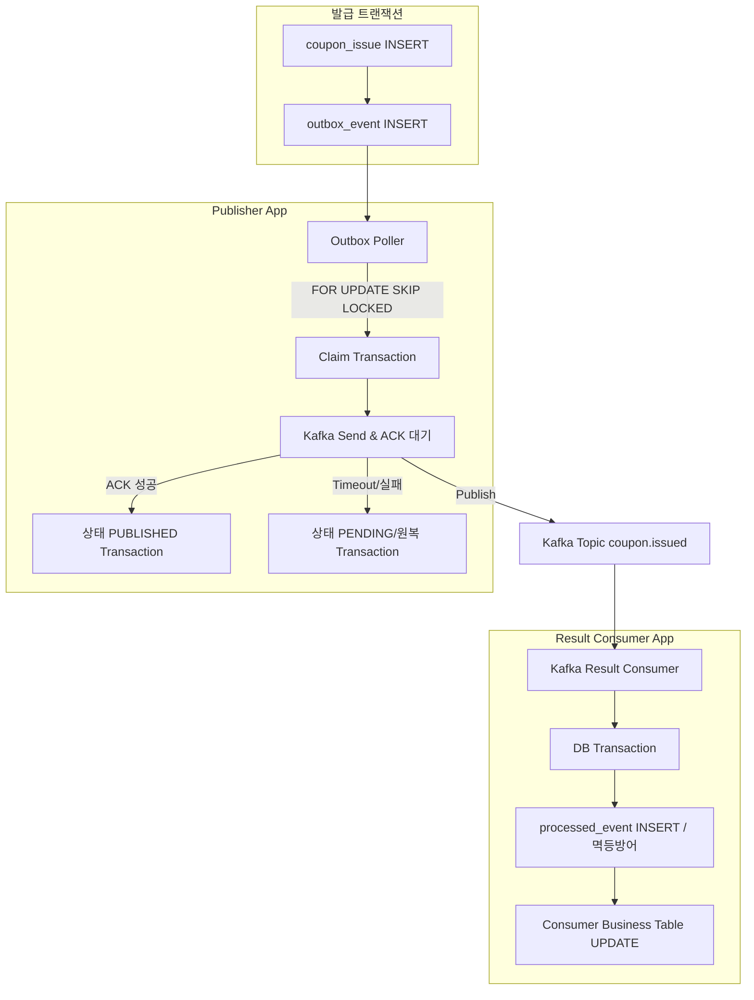

# 🚀 [Week 6] Transactional Outbox Pattern과 이벤트 발행 정합성 - 13기 우재원

---

## 과제 1. Dual Write 문제와 Outbox 적용 범위 분석하기

### 1. 위 코드가 사용하는 저장소 두 개를 작성한다

1. PostgreSQL (RDBMS)
2. Kafka (Message Broker)

### 2. @Transactional만으로 두 저장소가 원자적으로 묶이지 않는 이유를 설명한다

Spring의 `@Transactional`은 단일 로컬 데이터베이스(PostgreSQL)의 트랜잭션 경계와 커밋/롤백만을 관리할 뿐이다. 외부 메시지 브로커인 Kafka로의 네트워크 I/O 전송 성공 여부나 장애 상황은 DB 트랜잭션 매니저의 통제 범위(XA 분산 트랜잭션 등 미적용 시)를 벗어나므로, 두 이기종 시스템 간의 작업은 원자적으로 묶일 수 없다.

### 3. DB를 먼저 Commit한 뒤 Kafka에 발행하는 흐름의 장애 구간을 작성한다

```text
DB Commit
    ↓
[장애 지점: 서버 크래시, OOM, 일시적 네트워크 단절 등]
    ↓
Kafka 발행
```

- **최종 DB 상태**: 쿠폰 발급 레코드가 확정(Commit)됨.
- **최종 Kafka 상태**: CouponIssued 이벤트가 브로커에 전송되지 않음 (영구 누락).
- **후속 서비스에 미치는 영향**: 발급 처리는 완료되었으나 알림, 통계 등 후속 컨슈머가 이를 인지하지 못해 시스템 간 심각한 데이터 격리(Data Silo)가 발생함.
- **복구에 필요한 정보**: 발행해야 할 이벤트 Payload 데이터가 메모리 상에만 존재하다 증발했으므로, 재시작 후 무엇을 발행해야 하는지 추적 및 복구가 불가능함.

### 4. Kafka를 먼저 발행한 뒤 DB에 저장하는 흐름의 장애 구간을 작성한다

```text
Kafka 발행
    ↓
[장애 지점: DB Connection Timeout, Deadlock, 제약조건 위반 등]
    ↓
DB Commit
```

- **최종 DB 상태**: 트랜잭션 예외 발생으로 발급 기록이 Rollback 되어 존재하지 않음.
- **최종 Kafka 상태**: CouponIssued 이벤트가 이미 브로커에 정상 적재됨.
- **후속 서비스에 미치는 영향**: 실제로는 발급되지 않은 허위(Phantom) 발급 이벤트가 전파되어, 유저에게 발급 성공 알림이 발송되는 등 도메인 정합성이 파괴됨.

### 5. AFTER_COMMIT Listener만으로 이벤트 유실을 해결할 수 없는 이유를 설명한다

1. **DB Commit 후 Listener 실행 전 프로세스 종료**: 트랜잭션이 성공적으로 커밋되었더라도, 스프링 컨텍스트의 이벤트 리스너가 호출되어 발행 로직을 수행하기 직전 프로세스가 종료되면 발행 의도가 메모리에서 소멸하여 유실된다.
2. **KafkaTemplate.send() 호출 후 Broker ACK 확인 전 프로세스 종료**: 리스너가 호출되어 비동기 전송 스레드에 메시지를 위임했더라도, 브로커로부터 확실한 ACK를 받기 전에 장애가 나면 재시도할 근거 데이터가 없어 이벤트가 유실된다.

### 6. 이번 과제에서 Outbox가 해결하는 범위와 해결하지 않는 범위를 구분한다

| 구간 | 이번 Outbox로 해결되는가? | 이유 |
| --- | --- | --- |
| coupon_issue 저장 ↔︎ CouponIssued 발행 의도 저장 | O | 두 비즈니스 작업을 단일 PostgreSQL 트랜잭션 내에 묶어 ACID 원자성을 보장하기 때문이다. |
| Redis SUCCESS ↔︎ 최초 요청 Kafka 발행 | X | 인메모리 구조인 Redis와 디스크 기반의 PostgreSQL은 서로 다른 저장소이므로 하나의 로컬 트랜잭션으로 제어할 수 없기 때문이다. |
| 원본 Kafka 소비 ↔︎ 발급 DB Commit | X | 발급 DB Commit 후 Offset Commit 전 장애가 나면 메시지가 재전달되며, 이는 Outbox가 아닌 Consumer 단의 requestId 기반 멱등성으로 방어해야 한다. |
| Consumer DB 저장 ↔︎ 외부 SMS API 호출 | X | 외부 시스템(Provider)으로의 API 호출은 로컬 트랜잭션의 통제를 벗어나므로, Notification 관점의 별도 처리 매커니즘이 요구된다. |

### 7. 다음 문장을 완성한다

- **Transactional Outbox가 직접 보장하는 것**: DB 쿠폰 발급 결과가 Commit되면, 그에 파생되는 결과 이벤트의 발행 의도(Snapshot) 역시 유실 없이 같은 DB에 반드시 저장됨을 보장한다.
- **Transactional Outbox가 직접 보장하지 않는 것**: Kafka Record가 브로커에 물리적으로 '정확히 한 번(Exactly-Once)' 생성되는 것과, 도메인 이벤트가 비즈니스 발생 순서대로 정확히 후속 서비스에 도착하는 것은 보장하지 않는다.

---

## 과제 2. CouponIssued 이벤트와 Outbox 테이블 설계하기

### 1. CouponIssued가 명령이 아니라 이미 발생한 사실을 나타내야 하는 이유를 설명한다

이벤트 주도 아키텍처(EDA)에서 이벤트는 이미 성공적으로 완료되어 되돌릴 수 없는 '과거의 불변 사실(Fact)'을 후속 시스템에 통지하는 목적을 갖는다. 'IssueCoupon'(명령)은 실패할 가능성을 내포하여 강한 결합도를 유발하나, 'CouponIssued'(사실)는 이미 확정된 결과이므로 컨슈머는 발급 여부를 재평가하지 않고 각자의 책임(알림, 통계 등)만 수행하면 되어 시스템 간 결합도를 느슨하게 유지할 수 있다.

### 2. CouponIssued 이벤트 JSON을 완성한다

```json
{
  "eventMessageId": "8a78e94b-5c3d-46a7-a364-538cd1f856c9",
  "eventType": "COUPON_ISSUED",
  "schemaVersion": 1,
  "aggregateVersion": 1,
  "occurredAt": "2026-07-26T03:00:01Z",
  "requestId": "4372dbe5-8cc8-4bfa-9cdf-1cd5e9f77b31",
  "data": {
    "couponIssueId": 5001,
    "couponEventId": 100,
    "userId": 10,
    "issuedAt": "2026-07-26T03:00:01Z"
  }
}
```

### 3. 다음 ID의 역할을 비교한다

| 값 | 식별 대상 | 재발행 시 값이 바뀌는가? | Consumer 멱등성 Key로 적절한가? |
| --- | --- | --- | --- |
| couponEventId | 쿠폰 프로모션 행사 자체 | X | X (다수 유저가 공유하므로 부적절) |
| couponIssueId | 단일 쿠폰 발급 기록 (Aggregate) | X | X (발급 후 취소 등 상태 변경 이벤트가 다수 발생 시 식별 불가) |
| eventMessageId | 단일 비즈니스 결과 메시지 | X | O (정확히 해당 메시지의 고유 식별자이므로 멱등 검증에 최적화됨) |
| Kafka Partition + Offset | 브로커 내 레코드의 물리적 위치 | O | X (Retry Topic 이동이나 재발행 시 위치가 변동되므로 부적절) |

### 4. occurredAt과 publishedAt의 차이를 설명한다

- **occurredAt**: 도메인 트랜잭션이 성공하여 쿠폰 발급이라는 비즈니스 결과가 논리적으로 발생한 사실 시각.
- **publishedAt**: Outbox Publisher가 브로커로부터 이벤트 전송 ACK를 확인하고 DB 상태를 완료(PUBLISHED) 처리한 물리적 시각.
- **Publisher 재시도 시 변경하면 안 되는 값**: occurredAt (도메인 팩트이므로 불변의 스냅샷으로 보존되어야 함)

### 5. Publisher가 발행 시점에 현재 비즈니스 테이블을 다시 조회해 Payload를 만들면 안 되는 이유를 설명한다

이벤트를 늦게 발행하는 지연 시간 동안 원본 도메인 데이터가 추가로 변경(예: 발급 직후 어드민에 의한 즉시 취소)되었을 가능성이 존재한다. 이 경우 발행 시점의 최신 데이터를 읽어오면, 과거 특정 시점에 발생했던 비즈니스 결과의 불변 스냅샷으로서의 정합성이 훼손되어 후속 시스템에 잘못된 상태를 전파하게 된다.

### 6. 다음 Outbox 테이블 DDL을 완성한다

```sql
CREATE TABLE outbox_event (
    event_id UUID PRIMARY KEY,
    request_id UUID,
    deduplication_key VARCHAR(200) NOT NULL UNIQUE,
    aggregate_type VARCHAR(50) NOT NULL,
    aggregate_id VARCHAR(100) NOT NULL,
    event_type VARCHAR(100) NOT NULL,
    schema_version INT NOT NULL DEFAULT 1,
    aggregate_version BIGINT NOT NULL,
    topic VARCHAR(200) NOT NULL,
    partition_key VARCHAR(200) NOT NULL,
    payload JSONB NOT NULL,
    status VARCHAR(20) NOT NULL DEFAULT 'PENDING',
    attempt_count INT NOT NULL DEFAULT 0,
    next_attempt_at TIMESTAMPTZ NOT NULL DEFAULT CURRENT_TIMESTAMP,
    claim_token UUID,
    lease_until TIMESTAMPTZ,
    last_error VARCHAR(1000),
    occurred_at TIMESTAMPTZ NOT NULL,
    published_at TIMESTAMPTZ,
    created_at TIMESTAMPTZ NOT NULL DEFAULT CURRENT_TIMESTAMP,
    updated_at TIMESTAMPTZ NOT NULL DEFAULT CURRENT_TIMESTAMP,

    CONSTRAINT chk_outbox_status CHECK (status IN ('PENDING', 'PROCESSING', 'PUBLISHED')),
    CONSTRAINT chk_outbox_schema_version CHECK (schema_version >= 1),
    CONSTRAINT chk_outbox_aggregate_version CHECK (aggregate_version >= 1),
    CONSTRAINT chk_outbox_attempt_count CHECK (attempt_count >= 0),
    CONSTRAINT chk_outbox_state_fields CHECK (
        (status = 'PENDING' AND claim_token IS NULL AND lease_until IS NULL AND published_at IS NULL) OR
        (status = 'PROCESSING' AND claim_token IS NOT NULL AND lease_until IS NOT NULL AND published_at IS NULL) OR
        (status = 'PUBLISHED' AND claim_token IS NULL AND lease_until IS NULL AND published_at IS NOT NULL)
    )
);
```

### 7. 다음 불변조건을 애플리케이션 또는 DB에서 어떻게 검증할지 작성한다

애플리케이션 계층에서 OutboxEvent 엔티티 객체를 생성하는 시점 또는 Repository 저장 전(Validation Phase)에, DB 컬럼으로 매핑될 event_id 필드의 값과 payload 필드로 직렬화될 내부 객체의 eventMessageId 값이 완전히 동일한지 Assert(단언)하여 강제한다.

### 8. deduplication_key를 설계한다

- **Key 형식**: `{eventType}:{aggregateType}:{aggregateId}`
- **예시**: `COUPON_ISSUED:COUPON_ISSUE:5001`
- **같은 Aggregate에서 같은 이벤트 유형이 여러 번 발생할 수 있다면 어떤 값을 추가해야 하는지도 작성한다**: 발생 순서를 명확히 식별할 수 있는 `aggregateVersion`이나 발생 시점(Timestamp) 등을 조합하여 `{eventType}:{aggregateType}:{aggregateId}:{aggregateVersion}` 형태로 식별성을 확보해야 한다.

### 9. 일반 INSERT에서 deduplication_key UNIQUE 위반이 발생한 뒤 기존 행을 확인하려면 어떤 트랜잭션 처리가 필요한지 설명한다

전체 Rollback 후 새 트랜잭션에서 조회 방식을 사용해야 한다. PostgreSQL은 에러가 발생한 트랜잭션을 즉시 Aborted 처리하므로, 현재 트랜잭션을 전면 롤백한 후 새로운 트랜잭션을 열어 충돌 난 기존 Outbox 레코드를 조회 및 대조해야 한다. ON CONFLICT DO NOTHING을 사용하면 설계 가정이 깨진 버그나 데이터 불일치(payload 내용 다름 등)를 은폐하게 되므로 회피한다.

---

## 과제 3. 발급 결과와 Outbox를 하나의 트랜잭션으로 저장하기

### 1. 전체 SQL 트랜잭션을 완성한다

```sql
BEGIN;

-- 1. PENDING 요청에 대한 처리 권한 획득
UPDATE coupon_issue_request
SET status = 'PROCESSING',
    processing_started_at = CURRENT_TIMESTAMP,
    updated_at = CURRENT_TIMESTAMP
WHERE request_id = :requestId
  AND status = 'PENDING';
-- affected rows가 몇 행이어야 하는가? (반드시 1행이어야 한다)

-- 2. 수량이 남아 있을 때만 issued_count 증가
UPDATE coupon_event
SET issued_count = issued_count + 1,
    updated_at = CURRENT_TIMESTAMP
WHERE id = :couponEventId
  AND issued_count < total_quantity;
-- affected rows가 0일 때 가능한 원인은 무엇인가? (전체 수량이 모두 소진되었거나, 조건에 맞는 이벤트 레코드가 존재하지 않는 경우다)

-- 3. coupon_issue 저장 후 id와 issued_at 획득
INSERT INTO coupon_issue (
    event_id, user_id, status, issued_at
) VALUES (
    :couponEventId, :userId, 'ISSUED', CURRENT_TIMESTAMP
)
RETURNING id, issued_at;

-- 4. request를 ISSUED로 변경
UPDATE coupon_issue_request
SET status = 'ISSUED',
    coupon_issue_id = :couponIssueId,
    completed_at = :issuedAt,
    updated_at = CURRENT_TIMESTAMP
WHERE request_id = :requestId
  AND status = 'PROCESSING';

-- 5. 동일한 트랜잭션에서 CouponIssued Outbox 저장
INSERT INTO outbox_event (
    event_id, request_id, deduplication_key, aggregate_type, aggregate_id,
    event_type, schema_version, aggregate_version, topic, partition_key,
    payload, occurred_at
) VALUES (
    :eventMessageId, :requestId, :deduplicationKey, 'COUPON_ISSUE', CAST(:couponIssueId AS VARCHAR),
    'COUPON_ISSUED', 1, 1, 'coupon.issued', CAST(:couponIssueId AS VARCHAR),
    CAST(:payload AS JSONB), :issuedAt
);

COMMIT;
```

### 2. 각 단계에서 확인해야 하는 영향받은 행 수를 작성한다

| 작업 | 성공 경로의 영향받은 행 수 | 예상과 다를 때 처리 |
| --- | --- | --- |
| PENDING → PROCESSING | 1행 | 0행 시 기존 상태(ISSUED/FAILED 등) 확인 후 멱등 처리 또는 로직 스킵 |
| issued_count 조건부 증가 | 1행 | 0행 시 SOLD_OUT으로 상태를 확정(FAILED 갱신) 후 Commit |
| coupon_issue INSERT | 1행 | UNIQUE 위반 시 트랜잭션 롤백 및 DUPLICATE_USER 확정 |
| PROCESSING → ISSUED | 1행 | 0행 시 데이터가 어긋났음을 의미하므로 전체 트랜잭션 Rollback |
| outbox_event INSERT | 1행 | deduplication_key 위반 등 발생 시 전체 트랜잭션 Rollback 및 알람 |

### 3. Outbox INSERT가 실패한 경우 최종 상태를 작성한다

- **트랜잭션 결과**: 예외 발생으로 인한 전체 트랜잭션 Rollback.
- **coupon_event.issued_count**: 롤백에 의해 증가 전 수량으로 원복 유지됨.
- **coupon_issue**: 생성되지 않음.
- **coupon_issue_request**: PENDING 상태로 원복됨.
- **outbox_event**: 생성되지 않음.

### 4. Outbox 저장 실패를 무시하고 발급 결과만 Commit하면 안 되는 이유를 설명한다

쿠폰 발급이라는 비즈니스 상태는 완료되었는데 결과 이벤트의 Outbox 레코드가 없다면, Kafka로 이벤트가 영구적으로 발행되지 않기 때문이다. 이는 마이페이지나 알림 컨슈머가 발급 사실을 인지하지 못하게 만들어 치명적인 시스템 간 데이터 격리(Data Silo)를 초래한다.

### 5. 원본 메시지가 재전달되었지만 request가 이미 ISSUED인 경우의 처리를 작성한다

- **issued_count를 다시 증가시키는가?**: 증가시키지 않는다.
- **coupon_issue를 다시 생성하는가?**: 생성하지 않는다.
- **Outbox를 다시 INSERT하는가?**: INSERT하지 않는다.
- **Consumer 처리는 성공으로 종료할 수 있는가?**: 로직 재수행 없이 오프셋을 커밋하여 멱등적으로 성공 종료한다.

### 6. 발급 DB Commit 후 원본 Kafka Offset Commit 전에 Consumer가 종료되는 상황을 분석한다

- **DB 상태**: ISSUED 및 coupon_issue, outbox_event 모두 성공적으로 반영(Commit)됨.
- **Outbox 상태**: PENDING 혹은 이미 PUBLISHED로 폴링되어 전진했을 수 있음.
- **Kafka 원본 메시지**: Offset 미커밋 상태로 대기열(Unacknowledged)에 잔류.
- **재시작 후 필요한 멱등성 기준**: Consumer가 메시지를 다시 수신했을 때, DB의 coupon_issue_request 상태를 requestId로 조회하여 이미 ISSUED 처리되었음을 확인하고 로직을 멱등 스킵해야 한다.

### 7. 원본 Consumer의 Offset Commit 설정에서 확인해야 할 항목을 작성한다

1. `enable.auto.commit` 설정이 `false`로 비활성화되어 있는지 확인한다.
2. Spring Kafka `AckMode`가 `MANUAL`(또는 `MANUAL_IMMEDIATE`)로 설정되어 있는지 확인한다.
3. Listener 예외 발생 시 프레임워크가 오프셋을 임의로 전진시키지 않는지 확인한다.
4. Error Handler 정책이 심각한 예외(DB 통신 오류 등)를 단순히 삼키고(Swallow) 정상 처리로 위장 커밋하지 않는지 점검한다.

---

## 과제 4. Polling Publisher의 Claim, Lease, Claim Token 설계하기

### 1. 단순 SELECT 후 UPDATE 방식의 Race Condition을 작성한다

```text
Publisher A                                Publisher B
--------------------------------------------------------------------------------
status = PENDING 레코드 다건 SELECT          status = PENDING 레코드 다건 SELECT
선택된 행을 PROCESSING으로 UPDATE 시도       선택된 동일 행을 PROCESSING으로 UPDATE (덮어쓰기)
동일 이벤트를 Kafka로 발행 시도              동일 이벤트를 Kafka로 발행 시도 (중복 발행 발생)
```

### 2. FOR UPDATE SKIP LOCKED를 이용한 Claim SQL을 완성한다

```sql
BEGIN;

WITH candidates AS (
    SELECT event_id
    FROM outbox_event
    WHERE status = 'PENDING'
      AND next_attempt_at <= CURRENT_TIMESTAMP
    ORDER BY
        next_attempt_at,
        created_at,
        event_id
    LIMIT :batchSize
    FOR UPDATE SKIP LOCKED
)
UPDATE outbox_event AS outbox
SET status = 'PROCESSING',
    claim_token = :claimToken,
    lease_until = CURRENT_TIMESTAMP + (:leaseSeconds * INTERVAL '1 second'),
    attempt_count = attempt_count + 1,
    updated_at = CURRENT_TIMESTAMP
FROM candidates
WHERE outbox.event_id = candidates.event_id
RETURNING outbox.*;

COMMIT;
```

### 3. Claim 트랜잭션을 짧게 Commit한 뒤 Kafka를 호출해야 하는 이유를 설명한다

1. **DB Row Lock 장기 점유**: 트랜잭션 내에서 Kafka 네트워크 I/O를 대기하면, 해당 레코드와 DB 커넥션 풀을 과도하게 오래 붙잡아 시스템 병목을 유발한다.
2. **Kafka 장애의 DB 전파**: Kafka 통신 타임아웃 발생 시 DB 트랜잭션 전체가 롤백되어, 해당 행을 PROCESSING 및 시도 횟수(attempt_count) 갱신 등 추적 가능 상태로 남기지 못한다.
3. **데드락 위험 증가**: 다중 스레드 환경에서 분산 락/트랜잭션 지연 시 테이블 교착 상태 발생 확률이 극도로 높아진다.

### 4. 단일 Publisher만 있어도 Lease 또는 stale PROCESSING 복구가 필요한 이유를 설명한다

서버 인스턴스가 1대뿐이라 하더라도, Claim 트랜잭션을 통해 PROCESSING 상태로 변경을 커밋한 직후 Kafka로 전송하기 전에 해당 프로세스가 크래시(OOM, 강제 종료 등)될 수 있기 때문이다. 복구 정책(Lease)이 없으면 해당 이벤트는 영원히 PROCESSING에 갇히게 된다.

### 5. 만료된 PROCESSING 행을 PENDING으로 복구하는 SQL을 작성한다

```sql
UPDATE outbox_event
SET status = 'PENDING',
    claim_token = NULL,
    lease_until = NULL,
    next_attempt_at = CURRENT_TIMESTAMP,
    updated_at = CURRENT_TIMESTAMP
WHERE status = 'PROCESSING'
  AND lease_until <= CURRENT_TIMESTAMP;
```

### 6. 다음 경쟁 상황에서 Claim Token이 없을 때 발생하는 문제를 설명한다

Publisher A가 지연 처리 끝에 뒤늦게 Kafka 결과를 수신하여 상태를 UPDATE(성공/실패)해버리면, 이미 합당하게 권한을 회수하여 새로 작업 중인 Publisher B의 최신 락 상태를 덮어쓰게 되어 권한 무효화 및 데이터 정합성 침해가 발생한다.

### 7. 성공과 실패 UPDATE에 들어가야 하는 공통 WHERE 조건을 작성한다

```sql
WHERE event_id = :eventId
  AND status = 'PROCESSING'
  AND claim_token = :claimToken;
```

### 8. 동기 순차 발행 모델에서 Lease 시간을 계산할 때 고려할 항목을 작성한다

```text
Lease 시간
> (batchSize × 건당 최대 대기 시간(timeout))
+ 시스템 지연 및 GC 포즈 등을 고려한 안전 여유 시간(Buffer)
```

---

## 과제 5. Kafka ACK, Timeout, 재시도 상태 전이 설계하기

### 1. 다음 네 상태의 의미 차이를 설명한다

- **KafkaTemplate.send() 호출 완료**: 이벤트를 애플리케이션의 로컬 전송 버퍼(Sender Thread)에 넘겼을 뿐, 브로커 도달 및 실제 I/O 수행 여부는 보장되지 않음.
- **CompletableFuture 정상 완료**: Kafka 브로커가 메시지를 수신하여 디스크(또는 최소 In-Sync Replica)에 적재한 뒤 명시적인 ACK 응답을 반환함.
- **outbox = PUBLISHED**: Kafka ACK를 수신한 Publisher가 권한(claim_token)을 입증하여 DB Outbox 테이블의 상태를 완료 처리로 커밋함.
- **모든 후속 Consumer 처리 완료**: PUBLISHED 상태와 무관하게, 브로커에 담긴 이벤트를 구독한 모든 하위 컨슈머 그룹이 각각 소비를 마치고 비즈니스 모델을 갱신함.

### 2. Kafka ACK 성공 후 PUBLISHED로 변경하는 SQL을 작성한다

```sql
UPDATE outbox_event
SET status = 'PUBLISHED',
    published_at = CURRENT_TIMESTAMP,
    claim_token = NULL,
    lease_until = NULL,
    last_error = NULL,
    updated_at = CURRENT_TIMESTAMP
WHERE event_id = :eventId
  AND status = 'PROCESSING'
  AND claim_token = :claimToken;
```

### 3. 발행 실패 후 PENDING으로 되돌리는 SQL을 작성한다

```sql
UPDATE outbox_event
SET status = 'PENDING',
    next_attempt_at = :nextAttemptAt,
    claim_token = NULL,
    lease_until = NULL,
    last_error = :lastError,
    updated_at = CURRENT_TIMESTAMP
WHERE event_id = :eventId
  AND status = 'PROCESSING'
  AND claim_token = :claimToken;
```

### 4. Timeout을 받았다고 Kafka에 Record가 없다고 단정할 수 없는 이유를 설명한다

- **상황 A**: 통신 장애 등으로 실제로 Broker에 데이터가 전달·저장되지 못하고 Timeout이 발생했을 수 있다.
- **상황 B**: Broker가 성공적으로 메시지를 디스크에 저장했음에도 불구하고, 애플리케이션으로 되돌아오는 네트워크 상의 ACK 패킷만이 유실되어 Timeout이 발생했을 수 있다.

애플리케이션(Publisher) 입장에서는 이 두 가지 상황을 물리적으로 구분할 수 있는 단서가 없기 때문이다.

### 5. Timeout 이후 재시도 정책을 작성한다

- **Outbox 상태**: 미완료(PENDING)로 원복시키고 `next_attempt_at`을 백오프 연기한다.
- **재시도 여부**: 지정된 `next_attempt_at` 도달 후 재시도를 반드시 수행한다.
- **Kafka 중복 가능성**: 브로커에 이미 적재되었을 수 있으므로 중복 발생 가능성을 전제한다.
- **Consumer에게 필요한 방어**: `eventMessageId`를 활용한 식별 기반의 엄격한 멱등성 처리.

### 6. Exponential Backoff와 Jitter를 사용하는 이유를 설명한다

- **Exponential Backoff**: 실패가 반복될 때 재시도 간격을 지수 함수적으로 늘려, 일시적 장애를 겪는 브로커 및 시스템이 회복할 시간을 확보하고 부하 폭주를 예방한다.
- **Jitter**: 다수의 Publisher 인스턴스가 정확히 동일한 시점에 일제히 재시도하여 스파이크 트래픽을 유발하는 Thundering Herd(천둥 치는 소떼) 현상을 무작위 분산시킨다.

### 7. Producer Idempotence가 해결하는 중복과 해결하지 못하는 중복을 구분한다

| 중복 발생 원인 | Producer Idempotence로 방어 가능한가? | 이유 |
| --- | --- | --- |
| Producer 내부 네트워크 재시도 | O | 동일한 Sequence Number가 브로커로 전달되어 중복 저장이 억제된다. |
| Kafka 발행 성공 후 PUBLISHED 변경 전 프로세스 종료 | X | 새 Publisher 인스턴스는 다른 Producer ID를 사용하므로 새로운 레코드로 취급된다. |
| 운영자가 같은 Outbox를 다시 PENDING으로 변경 | X | 어플리케이션이 다시 send()를 호출하면 새로운 Sequence Number가 부여된다. |

### 8. 비동기 발행으로 확장할 때 whenComplete 안에서 DB 작업을 직접 수행하는 것이 위험한 이유를 설명한다

whenComplete의 콜백 로직은 기본적으로 Kafka Producer의 I/O를 관장하는 내부 Sender 스레드 풀에서 실행될 가능성이 크다. 콜백 내에서 DB 커넥션 획득 등 블로킹 작업을 수행하면 Sender 스레드가 병목에 빠져, 해당 프로듀서의 모든 비동기 메시지 전송 기능이 연쇄적으로 마비(블로킹)되는 심각한 장애를 초래한다. 따라서 DB 업데이트를 위한 별도의 전용 ThreadPool(Executor)을 할당하여 비동기 처리해야 한다.

---

## 과제 6. Outbox 장애 시나리오 분석하기

### 1. 발급 트랜잭션 Commit 전 장애

| 항목 | 결과 |
| --- | --- |
| coupon_issue | 롤백되어 레코드 없음 |
| request | 롤백되어 PENDING 상태 유지 |
| outbox_event | 롤백되어 존재하지 않음 |
| 복구 방법 | Kafka 원본 coupon.issue.requested 메시지가 미커밋 재전달되므로 정상적으로 로직 재수행 |

### 2. 발급 DB Commit 후 원본 Offset Commit 전 장애

| 항목 | 결과 |
| --- | --- |
| coupon_issue | 정상 커밋됨 |
| request | ISSUED 상태 커밋됨 |
| outbox_event | PENDING 혹은 PUBLISHED 상태 커밋됨 |
| 원본 Kafka 메시지 | Offset 미반영으로 인해 재전달됨 |
| 복구 방법 | 재전달 시 DB의 request 상태를 조회 후 이미 ISSUED임을 인지하고 발급 로직 멱등 스킵 |

### 3. Outbox Claim Commit 후 Kafka 발행 전 Publisher 종료

| 항목 | 결과 |
| --- | --- |
| outbox status | PROCESSING 상태에 머물러 있음 |
| Kafka Record | 발행 전이므로 브로커에 존재하지 않음 |
| 복구 조건 | 할당된 lease_until 시각이 만료되어야 함 |
| 복구 주체 | Scheduler 혹은 타 Publisher가 만료된 행을 PENDING으로 원복시킨 후 재폴링 |

### 4. Kafka 발행 성공 후 PUBLISHED 변경 전 Publisher 종료

| 항목 | 결과 |
| --- | --- |
| outbox status | PROCESSING 상태에 머물러 있음 (PUBLISHED 갱신 누락) |
| Kafka Record | 브로커에 정상 적재됨 |
| 재발행 가능성 | Lease 만료 후 회수되어 PENDING 상태를 거치므로 중복 레코드 발행 100% 가능 |
| 필요한 Consumer 방어 | 동일한 eventMessageId가 유입되므로 DB에서 처리 이력을 조회하여 멱등적 업데이트 스킵 |

### 5. Publisher A의 Lease 만료 후 Publisher B가 회수한 상황

- **Publisher A가 늦게 성공 UPDATE**: `claim_token` 불일치로 0행 업데이트 (무시됨).
- **Publisher A가 늦게 실패 UPDATE**: `claim_token` 불일치로 0행 업데이트 (무시됨).
- **두 UPDATE에서 affected rows가 0이어야 하는 조건**: `WHERE` 절에 반드시 `claim_token = :claimToken` 조건이 포함되어 방어되어야 한다.

### 6. Kafka 장애가 30분 동안 지속되는 상황

- **PENDING 수의 변화**: Outbox 테이블 내에 지속적으로 누적되어 큐가 폭증한다.
- **가장 오래된 PENDING 대기 시간**: 지속 증가하여 30분을 초과하게 된다.
- **attempt_count**: Backoff 정책에 따라 점진적으로 증가한다.
- **Kafka 복구 후 처리**: 적체된 PENDING 행들이 배치 폴링에 의해 브로커로 대량/순차 발송된다.
- **운영 알람**: PENDING 대기열 길이(Queue Size)나 체류 시간(Age) 초과 시 알람을 구성하여 탐지한다.

### 7. 다음 두 재시도 대상을 구분한다

- **발급 DB 트랜잭션 실패**: 원본 요청인 `coupon.issue.requested` 메시지를 컨슈머가 재처리하도록 넘긴다.
- **발급 DB Commit 성공 후 CouponIssued 발행 실패**: 발급 자체는 성공했으므로 재발급을 수행해선 안 되며, Outbox 이벤트 데이터만을 대상으로 Publish를 재시도해야 한다.
- **결과 이벤트 발행 실패를 이유로 쿠폰을 다시 발급하면 안 되는 이유**: 도메인 상태(쿠폰 수량 차감 및 발급 완료)는 이미 DB에 확정된 팩트인데, 단순히 외부 시스템에 알림(이벤트)을 보내지 못했다는 이유로 발급 트랜잭션을 재수행하는 것은 비즈니스 인과 관계가 역전된 치명적 데이터 파괴 행위이기 때문이다.

---

## 과제 7. Consumer 멱등 처리 설계하기

### 1. Kafka Offset을 Consumer 멱등성 Key로 사용하면 안 되는 이유를 설명한다

동일한 논리적 비즈니스 이벤트(`evt-001`)가 Publisher의 타임아웃 재시도나 수동 재발행에 의해 브로커로 중복 유입될 경우 각기 다른 물리적 Offset을 할당받게 되므로, Offset만으로는 비즈니스 도메인 관점의 중복 여부를 식별할 수 없다.

### 2. processed_event 테이블 DDL을 작성한다

```sql
CREATE TABLE processed_event (
    subscriber_id VARCHAR(100) NOT NULL,
    event_id UUID NOT NULL,
    processed_at TIMESTAMPTZ NOT NULL DEFAULT CURRENT_TIMESTAMP,

    PRIMARY KEY (
        subscriber_id,
        event_id
    )
);
```

### 3. subscriber_id에 프로세스 인스턴스 ID를 사용하면 안 되는 이유를 설명한다

- **선택**: `mypage-coupon-projection`
- **이유**: `pod-7f8c9d`나 `server-10.0.0.12` 같은 휘발성 물리적 식별자를 사용하면, 컨테이너 재시작이나 스케일 아웃 시 값이 변경되어 동일한 비즈니스 로직(MyPage 갱신)에 대한 과거 멱등 처리 이력을 추적할 수 없게 되기 때문이다. 논리적인 구독자(컨슈머 그룹) 역할을 명시해야 한다.

### 4. processed_event 저장과 MyPage 조회 모델 변경을 하나의 트랜잭션으로 작성한다

```sql
BEGIN;

-- 1. eventMessageId 중복 확인
INSERT INTO processed_event (
    subscriber_id,
    event_id
) VALUES (
    'mypage-coupon-projection',
    :eventMessageId
)
ON CONFLICT DO NOTHING
RETURNING event_id;

-- 2. 최초 이벤트인 경우에만 조회 모델 변경 (반환된 행이 있을 때 애플리케이션 진입 가정)
INSERT INTO user_coupon_view (
    user_id,
    coupon_issue_id,
    coupon_event_id,
    issued_at
) VALUES (
    :userId,
    :couponIssueId,
    :couponEventId,
    :issuedAt
);

COMMIT;
```

### 5. Consumer DB Commit 후 Offset Commit 전에 종료되는 상황을 분석한다

- **Consumer DB 상태**: `processed_event`와 도메인 뷰 갱신이 모두 정상 커밋된 상태.
- **Consumer Group Offset**: 아직 반영되지 않은 미완료 대기 상태.
- **재시작 후 Kafka 전달**: Offset 미커밋으로 인해 동일 이벤트(`evt-001`)가 재수신된다.
- **재전달된 이벤트 처리**: `processed_event` INSERT 과정에서 Primary Key 위반(`ON CONFLICT DO NOTHING`)이 발생하여 중복 이벤트로 간주하고, 비즈니스 변경 없이 멱등 성공으로 간주하여 오프셋을 커밋한다.

### 6. processed_event만으로 외부 SMS가 정확히 한 번 전송된다고 보장할 수 없는 이유를 설명한다

`processed_event` 저장 트랜잭션과 외부 SMS API 네트워크 호출은 단일 로컬 트랜잭션으로 묶을 수 없다. DB 저장 후 API 호출 직전에 장애가 나면 SMS는 전송되지 않으며, 반대로 API 전송 직후 DB가 롤백되면 추후 재전송 시 SMS가 중복 전송될 수 있다.

### 7. Notification Service에서 추가로 적용할 수 있는 방법을 두 가지 이상 작성한다

1. 외부 API 연동 내역 관리를 위한 별도의 Notification 내부 Outbox 및 작업 테이블 운영.
2. 외부 SMS Provider 측에서 지원하는 Idempotency Key 헤더에 `eventMessageId`를 그대로 매핑하여 중복 위임.
3. 알림 발송 고유 번호(`notificationId`) 기반 단건 외부 조회 로직을 선행 수행.

### 8. processed_event 보관 기간을 정할 때 고려할 중복 재등장 경로를 작성한다

Kafka Topic의 Retention(데이터 보관) 기간, Consumer 장애 시의 복구/오프셋 되감기 운영 시간, Outbox Publisher의 지연 재발행 최대 시간, 운영자 수동 리플레이(Re-play) 지연 시간 등을 포괄하여 Kafka 보관 기간보다 반드시 충분히 길게 설정해야 한다.

---

## 과제 8. Partition Key와 이벤트 순서 문제 분석하기

### 1. 같은 Partition Key를 사용하는 이유를 작성한다

동일한 Aggregate(예: 특정 `couponIssueId`)에서 발생한 이벤트들을 하나의 논리적 Partition에 응집시켜 Consumer가 병렬 스케일링 환경에서도 데이터 충돌 없이 그룹화하여 처리하도록 유도하고, 향후 순서 보장이 필요할 때를 대비한 분산 기준을 확립하기 위함이다.

### 2. 같은 Key를 사용한다고 비즈니스 발생 순서까지 보장되는 것은 아닌 이유를 설명한다

다수의 Publisher 인스턴스가 병렬 동작하고, 폴링 시 `FOR UPDATE SKIP LOCKED`에 의해 행 잠금 획득 순서가 뒤틀리며, 특정 발행 실패 행위가 Backoff 정책에 의해 후행 이벤트보다 지연 적재되는 현상이 겹치면 Producer의 `send()` 호출 순서(브로커 적재 순서)가 원본 DB 발생 순서와 완벽히 어긋날 수 있기 때문이다.

### 3. 다음 순서 역전 시나리오를 완성한다

```text
DB 발생 순서
CouponIssued aggregateVersion = 1
CouponCancelled aggregateVersion = 2

Publisher 처리
Publisher A: CouponIssued를 Claim 했으나 Kafka 발행 실패/타임아웃으로 Backoff 연기.
Publisher B: CouponCancelled를 정상 Claim 후 Kafka 즉시 발행 성공.

Kafka 저장 순서:
Offset 200: CouponCancelled (version=2)
Offset 201: CouponIssued (version=1)
```

### 4. occurredAt만으로 이벤트 순서를 판단하면 안 되는 이유를 두 가지 이상 작성한다

1. 단일 노드 또는 분산 노드 간 시스템의 시간 정밀도 한계로 동일한 밀리초(ms) 타임스탬프를 가질 확률이 존재한다.
2. 각 서버 인스턴스와 데이터베이스 컴포넌트 간의 시간 동기화(NTP 오차 등)가 완벽히 일치하지 않아 타임스탬프 역전이 발생할 수 있다.
3. 조회 행이 없을 경우(초기화 등), 시간 조건만으로는 순서 역전인지 진짜 최초 이벤트인지 파악하기 모호하다.

### 5. MyPage처럼 최신 상태만 필요한 Projection의 순서 역전 방어 SQL을 작성한다

```sql
INSERT INTO user_coupon_view (
    coupon_issue_id,
    user_id,
    coupon_event_id,
    status,
    last_aggregate_version,
    last_event_at
) VALUES (
    :couponIssueId,
    :userId,
    :couponEventId,
    :newStatus,
    :aggregateVersion,
    :occurredAt
)
ON CONFLICT (coupon_issue_id)
DO UPDATE
SET status = EXCLUDED.status,
    last_aggregate_version = EXCLUDED.last_aggregate_version,
    last_event_at = EXCLUDED.last_event_at
WHERE user_coupon_view.last_aggregate_version < EXCLUDED.last_aggregate_version;
```

### 6. aggregateVersion이 더 큰 이벤트가 먼저 도착한 경우의 결과를 작성한다

- **최종 MyPage 상태**: 취소(Cancelled) 상태 유지 (`version=2` 반영 상태).
- **version=1 처리 결과**: `affected rows = 0`을 반환하며, 하위 버전의 오래된 이벤트이므로 상태를 갱신하지 않고 스킵(무시)된다.

### 7. 모든 Consumer가 낮은 aggregateVersion 이벤트를 버려도 되는지 판단한다

| Consumer | 낮은 Version 이벤트 생략 가능 여부 | 이유 또는 추가로 필요한 설계 |
| --- | --- | --- |
| 최신 상태만 저장하는 MyPage Projection | O | 중간 상태 전이를 건너뛰더라도 결과적인 최종 스냅샷만 유지하면 무결하기 때문이다. |
| 모든 발급·취소 건수를 집계하는 Analytics | X | 증감(delta) 기반 통계를 위해 모든 이력이 정확히 누적/집계되어야 하므로 이벤트 재정렬이나 보정 로직이 필요하다. |
| 발급과 취소 알림을 각각 보내는 Notification | X | 유저에게 발송되는 알림이 순서대로 도착해야 하므로 상태 기반의 지연 버퍼 또는 이력 재정렬 매커니즘이 필요하다. |

### 8. aggregateVersion의 역할을 정확히 정의한다

- `aggregateVersion`은 이벤트 순서 역전을 자동으로 정렬해주는 값이 아니다.
- `aggregateVersion`은 같은 Aggregate에서 발생한 상태 변경의 논리적 순서를 식별하기 위한 값이다.
- 최신 상태 Projection에서는 낮은 버전이 최신 상태를 덮어쓰는(Overwriting) 것을 방지할 수 있다.
- 모든 상태 전이를 순서대로 처리해야 하는 Consumer는 추가로 지연 버퍼나 이력 재정렬 매커니즘이 필요하다.

---

## 과제 9. Outbox 운영 지표와 보관 정책 설계하기

### 1. 다음 운영 지표의 의미와 장애 판단 기준을 작성한다

| 지표 | 무엇을 의미하는가? | 어떤 상태가 장애 신호인가? |
| --- | --- | --- |
| PENDING 이벤트 수 | 현재 발행을 기다리는 아웃박스 대기열의 크기 | 평시 대비 처리량 이상의 큐 사이즈가 지속 우상향 증가할 때 |
| 가장 오래된 PENDING 대기 시간 | 가장 심각한 수준의 이벤트 지연 체공 시간 | 허용된 임계시간(예: 30초 이상)을 초과하여 장기 적체될 때 |
| PROCESSING 이벤트 수 | Publisher가 락을 선점하여 처리 중인 활성 건수 | Publisher 수 * Batch Size 보다 비정상적으로 높게 유지될 때 |
| 만료된 PROCESSING 수 | 크래시로 인해 처리 권한을 소실한 고립 레코드 수 | 지속적으로 0이 아닌 상태로 발견되거나 회수되지 않을 때 |
| attempt_count | 개별 이벤트의 발행 시도 횟수 | 특정 이벤트의 백오프 카운트가 한계치(예: 5회 이상)를 초과할 때 |
| Outbox 생성 처리량 | 트랜잭션을 통해 인입되는 초당 신규 이벤트 수 | Publisher 처리 한계를 크게 초과하는 유입량이 지속될 때 |
| Kafka 발행 처리량 | Publisher가 소화하는 초당 실제 성공적 발행 수 | 평소보다 현저히 낮아지거나 타임아웃 오류가 속출할 때 |
| DB 발생부터 Kafka ACK까지의 시간 | 이벤트의 엔드투엔드(E2E) 발행 응답 지연율 | 지연율(Latency) 그래프가 갑작스러운 스파이크를 그릴 때 |

### 2. Outbox 생성 속도가 초당 2,000건이고 Publisher 처리 속도가 초당 1,500건인 상황을 분석한다

- **1분 후 예상 적체 증가량**: 30,000건 (초당 500건 잉여 적체 * 60초)
- **10분 후 예상 적체 증가량**: 300,000건
- **가장 먼저 확인할 지표**: PENDING 대기열 길이(Size) 및 가장 오래된 PENDING 대기 시간(Latency)
- **가능한 대응**: Publisher 인스턴스의 스케일 아웃(Scale-out), Batch Size 튜닝, 비동기 발행 로직 전환 고려

### 3. 즉시 알람이 필요한 설계 가정 위반을 세 가지 이상 작성한다

1. `deduplication_key` 제약조건 위반(UNIQUE 충돌) 에러 집중 탐지 시
2. 단일 트랜잭션 외부에서 `request = PROCESSING` 상태가 조회(관측)될 시
3. Lease 만료를 초과하는 장기 PROCESSING 레코드가 지속 검출될 시
4. 처리 중인 요청을 제외하고도 Redis 통과 수량과 DB 발급 완료 수량의 갭이 비수렴 상태로 유지될 시

### 4. PUBLISHED 행만 정리해야 하는 이유를 설명한다

- **PENDING을 삭제하면**: 발행되어야 할 데이터가 전송되기도 전에 영구 유실되어 시스템 격리가 발생한다.
- **PROCESSING을 삭제하면**: 현재 Publisher가 권한을 획득해 작업 중인 프로세스가 무산되어 메시지 유실 및 트랜잭션 고착을 야기한다.
- **PUBLISHED를 보관하는 목적**: 발행 이력 확인, 장애 발생 시 원인 분석 및 재발송을 위한 추적 자료 등 감사(Audit) 목적으로 활용된다.

### 5. PUBLISHED 행을 한 번에 대량 삭제하면 안 되는 이유를 설명한다

수만 건 이상의 행을 단일 트랜잭션(긴 트랜잭션)으로 삭제하면 광범위한 Row Lock 점유로 인한 심각한 DB 부하를 초래하며, PostgreSQL의 MVCC 구조 특성상 삭제된 튜플이 정리되지 못하고 공간 낭비(Table Bloat)가 폭발적으로 발생하기 때문이다.

### 6. 작은 Batch로 정리하는 운영 흐름을 작성한다

스케줄러를 통해 보관 기한이 지난 PUBLISHED 레코드를 LIMIT 1,000건 단위로 조회하여 DELETE를 수행한 후 트랜잭션을 짧게 커밋하며, 잠시 슬립(Delay)을 주어 DB I/O 리소스 호흡을 확보한 뒤 반복 정리한다.

### 7. 다음 세 보관 기간의 목적을 비교한다

| 보관 대상 | 목적 | 너무 짧을 때 발생하는 문제 |
| --- | --- | --- |
| Outbox PUBLISHED 행 | 발행 이력 추적 및 장애 복구 로깅 | 장애 발생 시 원인 분석 및 수동 재발송을 위한 원본 분실 |
| Kafka Topic Record | Consumer의 안전한 소비 보장 및 재처리 룸 | 장애 복구 시 Consumer가 미처 읽지 못한 데이터의 영구 증발 |
| Consumer processed_event | 멱등성을 위한 이전 메시지 처리 내역 증명 | 만료 후 브로커 재전달 시 신규 처리로 오인해 중복 파괴 발생 |

### 8. last_error에 전체 Stack Trace나 민감 정보를 저장하면 안 되는 이유를 설명한다

에러가 다발할 경우 방대한 스택 트레이스 텍스트가 테이블 용량을 극단적으로 부풀려 Table Bloat를 야기하고, 유저 정보 등 민감 데이터(PII)가 비암호화된 채 데이터베이스 컬럼에 직접 노출될 강력한 보안 위험이 존재하기 때문이다.

---

## 과제 10. 잘못된 Outbox 구현 리뷰하기

### 1. 위 코드에서 문제를 최소 10개 찾는다

| **문제점** | **왜 문제인가?** | **개선 방향** |
| --- | --- | --- |
| 1. `@Transactional` 내 `kafkaTemplate.send()` 직접 호출 | 외부 네트워크 통신 지연이 DB 트랜잭션 및 커넥션 풀 장기 점유를 유발함 | DB 트랜잭션과 Kafka 발행 로직을 구조적으로 분리(Outbox 저장)함 |
| 2. DB 저장과 Outbox 발행 의도의 원자성 결여 | Kafka 전송 장애 시 쿠폰은 발급되나 이벤트가 유실되어 정합성이 깨짐 | 비즈니스 로직과 Outbox 저장을 한 로컬 트랜잭션에 포함시킴 |
| 3. Outbox 폴링 쿼리에 `SKIP LOCKED` 미사용 | 여러 스케줄러가 동시에 동일한 PENDING 행을 읽어가 중복 발행 유발 | `FOR UPDATE SKIP LOCKED` 구문을 사용하여 배타적 락 점유 적용 |
| 4. Outbox 상태를 `PROCESSING`으로 전이시키지 않음 | 타 노드가 현재 작업 권한을 인지하지 못해 덮어쓰기 및 중복 발생 | 폴링 트랜잭션 내에서 상태를 PENDING에서 PROCESSING으로 업데이트 |
| 5. 비동기 `send()` 직후 즉각 `markPublished()` 호출 | 브로커 ACK를 확인하지 않고 성공으로 간주하여 발송 영구 유실 위험 | Future의 콜백(또는 동기 Get)에서 ACK 획득 후 퍼블리시 업데이트 |
| 6. Claim Token과 Lease 만료 기한 부재 | 스케줄러 노드 크래시 시 해당 이벤트를 타 노드가 인계/복구할 근거 부재 | 레코드에 고유 Claim Token과 Lease 만료 시간(`lease_until`) 부여 |
| 7. 무조건적인 `updateAllProcessingToPending()` | 정상 작업 중인 타 노드의 활성 권한을 무력화하여 데이터 덮어쓰기 유발 | `lease_until` 시간을 명확히 초과한 레코드만 선별적으로 원복 적용 |
| 8. Payload를 비즈니스 테이블에서 재조회하여 생성 | 폴링 간격 동안 도메인 상태가 변경되면 과거의 팩트(Snapshot)가 훼손됨 | Outbox 레코드 생성(INSERT) 시점에 JSONB로 직렬화하여 영구 박제 |
| 9. Consumer 단 멱등성 Key로 Kafka Offset 적용 | Topic 변경, 재발행 시 Offset이 변동되므로 논리적 멱등 검증 불가능 | 비즈니스 식별자인 `eventMessageId`를 복합 기본 키로 사용 |
| 10. 비즈니스 뷰 저장과 processedEvent를 별도 수행 | 두 로직 중 하나만 실패 시 멱등성이 파괴되거나 비즈니스 데이터 누락 | 두 Save 로직을 묶어 단일 `@Transactional` 로 선언 |

### 2. 반드시 찾아야 하는 문제

| 검토 항목 | 문제가 발생하는 코드 | 수정 방향 |
| --- | --- | --- |
| 발급 트랜잭션에서 Kafka 직접 호출 | `issueCoupon` 내의 `kafkaTemplate.send(...)` | Outbox 테이블 데이터 저장(INSERT)으로 대체하여 의도를 남긴다. |
| 발급 결과와 Outbox의 원자적 저장 없음 | `issueCoupon` 내 Outbox 엔티티 저장 구문 부재 | 트랜잭션 묶음 안에서 OutboxEvent를 생성하여 `save`를 강제한다. |
| 여러 Publisher의 동시 Claim 방어 없음 | `findTop100ByStatus("PENDING")` | 리포지토리 쿼리에 데이터베이스 락킹(`FOR UPDATE SKIP LOCKED`)을 적용한다. |
| DB 트랜잭션 안에서 Kafka ACK 대기 또는 발행 수행 | `@Transactional`이 선언된 `publishOutbox` 내부 `send()` 루프 | 루프 실행 전 Claim 상태 변경 트랜잭션을 짧게 종료(분리)한다. |
| ACK 확인 전에 PUBLISHED 변경 | `send()` 아래 줄에 위치한 `event.markPublished()` | `send().get()`이나 Async Callback 내에서 ACK 확인 후 별도 갱신한다. |
| Claim Token 없음 | `findTop100ByStatus` 조회 로직 및 도메인 구조 | 토큰 발급 로직과 상태 업데이트 시의 소유권 검증 조건을 추가한다. |
| Lease 만료 조건 없이 모든 PROCESSING 회수 | `outboxRepository.updateAllProcessingToPending()` | Lease 만료 시간이 지났는지 검사하는 WHERE 절을 강제한다. |
| 현재 비즈니스 테이블에서 Payload 재생성 | `createPayloadFromCurrentCouponIssue(event)` | 이벤트 발생 당시의 스냅샷 데이터를 DB에 저장하고 그대로 빼 쓴다. |
| Kafka Offset을 멱등성 Key로 사용 | `ProcessedEvent(..., event.getKafkaOffset())` | 파라미터를 식별 불변값인 `event.getEventMessageId()`로 수정한다. |
| processed_event와 비즈니스 변경의 트랜잭션 순서·원자성 부족 | `onResult` 내부의 분리된 두 개의 `save` 호출 | 메서드에 `@Transactional`을 적용하여 실패 시 함께 롤백되도록 보호한다. |

### 3. 수정된 전체 구조를 다이어그램으로 작성한다



### 4. 수정된 구조의 발행 보장 수준을 작성한다

| 항목 | 수준 | 이유 |
| --- | --- | --- |
| DB 발급 결과와 Outbox 기록의 원자성 | 보장 | 양자 간의 저장이 동일 로컬 트랜잭션 기반 Commit으로 제어되기 때문이다. |
| Kafka Record의 물리적인 Exactly-Once 생성 | 보장하지 않음 | ACK 유실에 의한 Timeout 후 재시도로 인해 물리적 중복 레코드가 발생할 수 있기 때문이다. |
| Publisher 복구 후 재발행 | 보장 | Outbox PENDING 상태 기록 추적 및 Lease 만료 감지로 폴링 복구되기 때문이다. |
| 비즈니스 발생 순서대로 전달 | 보장하지 않음 | SKIP LOCKED 병렬 처리 및 백오프 재시도에 의해 큐 적재 순서가 뒤섞이기 때문이다. |
| Consumer의 중복 비즈니스 반영 방지 | 보장 | eventMessageId 기반 processed_event 등록과 aggregateVersion 비교로 멱등 처리되기 때문이다. |
| 모든 Consumer Group의 처리 완료 | 보장하지 않음 | 개별 그룹의 에러 여부, 컨슈머 오프셋 데드록 등은 각 인프라가 독립적으로 책임지며 Outbox가 강제하지 않는다. |
| 외부 SMS의 정확히 한 번 전송 | 보장하지 않음 | 네트워크 외부 API 호출은 로컬 트랜잭션으로 완벽한 원자적 제어가 불가능하기 때문이다. |