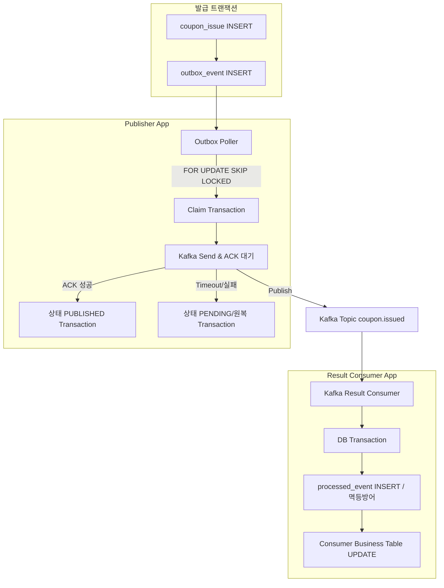

# [Week 6] Transactional Outbox Pattern과 이벤트 발행 정합성 - 13기 우재원

---

## 과제 1. Dual Write 문제와 Outbox 적용 범위 분석하기

### 1. 위 코드가 사용하는 저장소 두 개를 작성한다

1. PostgreSQL (RDBMS)
2. Kafka (Message Broker)

### 2. @Transactional만으로 두 저장소가 원자적으로 묶이지 않는 이유를 설명한다

Spring의 `@Transactional`은 단일 데이터베이스(PostgreSQL)의 트랜잭션 경계와 커밋/롤백만을 제어한다. 외부 메시지 브로커인 Kafka로의 네트워크 I/O 전송 성공 여부는 DB 트랜잭션 매니저의 통제 범위를 벗어나므로, 분산 트랜잭션(XA 등)을 적용하지 않는 한 두 저장소 간 작업의 원자성을 보장할 수 없다.

### 3. DB를 먼저 Commit한 뒤 Kafka에 발행하는 흐름의 장애 구간을 작성한다

```text
DB Commit
    ↓
[장애 지점: 서버 프로세스 다운, OOM, 네트워크 단절]
    ↓
Kafka 발행
```

- **최종 DB 상태**: 쿠폰 발급 레코드가 커밋되어 확정됨.
- **최종 Kafka 상태**: CouponIssued 이벤트가 브로커로 전송되지 않고 영구 누락됨.
- **후속 서비스에 미치는 영향**: 쿠폰 발급은 완료되었으나 알림, 마이페이지, 통계 컨슈머가 이를 수신하지 못해 서비스 간 데이터 불일치가 발생함.
- **복구에 필요한 정보**: 발행해야 할 이벤트 데이터가 메모리에만 존재하다 소멸했으므로, 서버 재시작 후 발행 대상 이벤트를 추적하거나 복구할 수 없음.

### 4. Kafka를 먼저 발행한 뒤 DB에 저장하는 흐름의 장애 구간을 작성한다

```text
Kafka 발행
    ↓
[장애 지점: DB 커넥션 타임아웃, 데드락, 유니크 제약조건 위반]
    ↓
DB Commit
```

- **최종 DB 상태**: 트랜잭션 예외 발생으로 발급 기록이 롤백되어 존재하지 않음.
- **최종 Kafka 상태**: CouponIssued 이벤트가 이미 브로커에 정상 적재됨.
- **후속 서비스에 미치는 영향**: 실제로는 발급되지 않은 유령 발급 이벤트가 전파되어, 유저에게 허위 발급 완료 알림이 전송되는 등 비즈니스 정합성이 파괴됨.

### 5. AFTER_COMMIT Listener만으로 이벤트 유실을 해결할 수 없는 이유를 설명한다

1. **DB 커밋 후 리스너 실행 전 프로세스 종료**: DB 트랜잭션이 성공적으로 커밋되었더라도, Spring의 이벤트 리스너가 호출되기 직전 프로세스가 다운되면 메모리 상의 발행 요청 데이터가 소멸하여 이벤트가 유실된다.
2. **Kafka전송 호출 후 브로커 ACK 수신 전 프로세스 종료**: 리스너가 비동기 전송 스레드에 메시지를 전달했더라도, 브로커로부터 확정 ACK를 수신하기 전에 장애가 발생하면 재시도 근거 데이터가 없어 이벤트가 유실된다.

### 6. 이번 과제에서 Outbox가 해결하는 범위와 해결하지 않는 범위를 구분한다

| 구간 | 이번 Outbox로 해결되는가? | 이유 |
| --- | --- | --- |
| coupon_issue 저장 ↔︎ CouponIssued 발행 의도 저장 | O | 두 비즈니스 작업을 단일 PostgreSQL 트랜잭션 내에 묶어 ACID 원자성을 보장하기 때문이다. |
| Redis SUCCESS ↔︎ 최초 요청 Kafka 발행 | X | 인메모리 저장소인 Redis와 DB인 PostgreSQL은 별도 시스템이므로 하나의 로컬 트랜잭션으로 제어할 수 없기 때문이다. |
| 원본 Kafka 소비 ↔︎ 발급 DB Commit | X | 발급 DB 커밋 후 오프셋 커밋 전에 장애가 나면 메시지가 재전달되며, 이는 Consumer 단의 requestId 기반 멱등성으로 방어해야 한다. |
| Consumer DB 저장 ↔︎ 외부 SMS API 호출 | X | 외부 시스템으로의 HTTP API 호출은 로컬 트랜잭션 범위를 벗어나므로 별도 처리 메커니즘이 필요하다. |

### 7. 다음 문장을 완성한다

- **Transactional Outbox가 직접 보장하는 것**: DB 쿠폰 발급 결과가 커밋되면, 그에 따른 결과 이벤트 발행 의도 역시 유실 없이 동일한 DB에 반드시 저장됨을 보장한다.
- **Transactional Outbox가 직접 보장하지 않는 것**: Kafka 레코드가 브로커에 물리적으로 정확히 한 번 생성되는 것과, 도메인 이벤트가 비즈니스 발생 순서대로 후속 서비스에 전달되는 것은 보장하지 않는다.

---

## 과제 2. CouponIssued 이벤트와 Outbox 테이블 설계하기

### 1. CouponIssued가 명령이 아니라 이미 발생한 사실을 나타내야 하는 이유를 설명한다

이벤트 주도 아키텍처에서 이벤트는 이미 완료된 과거의 불변 사실을 외부 시스템에 알리는 용도로 사용된다. IssueCoupon 형태의 명령 표현은 실패 가능성을 포함하여 시스템 간 강한 결합을 만들지만, CouponIssued 형태의 사실 표현은 이미 확정된 결과를 의미하므로 컨슈머는 발급 여부를 재검증할 필요 없이 각자의 비즈니스 로직만 수행하여 결합도를 낮출 수 있다.

### 2. CouponIssued 이벤트 JSON을 완성한다

```json
{
  "eventMessageId": "8a78e94b-5c3d-46a7-a364-538cd1f856c9",
  "eventType": "COUPON_ISSUED",
  "schemaVersion": 1,
  "aggregateVersion": 1,
  "occurredAt": "2026-07-26T03:00:01Z",
  "requestId": "4372dbe5-8cc8-4bfa-9cdf-1cd5e9f77b31",
  "data": {
    "couponIssueId": 5001,
    "couponEventId": 100,
    "userId": 10,
    "issuedAt": "2026-07-26T03:00:01Z"
  }
}
```

### 3. 다음 ID의 역할을 비교한다

| 값 | 식별 대상 | 재발행 시 값이 바뀌는가? | Consumer 멱등성 Key로 적절한가? |
| --- | --- | --- | --- |
| couponEventId | 쿠폰 프로모션 행사 자체 | X | X (다수 유저가 공유하므로 부적절) |
| couponIssueId | 단일 쿠폰 발급 기록 (Aggregate) | X | X (발급 후 취소 등 상태 변경 이벤트가 다수 발생 시 식별 불가) |
| eventMessageId | 단일 비즈니스 결과 메시지 | X | O (해당 메시지의 불변 고유 식별자이므로 멱등 검증에 적합) |
| Kafka Partition + Offset | 브로커 내 레코드의 물리적 위치 | O | X (재발행이나 토픽 이동 시 위치가 변경되므로 부적절) |

### 4. occurredAt과 publishedAt의 차이를 설명한다

- **occurredAt**: 도메인 트랜잭션이 완료되어 비즈니스 결과가 발생한 시각.
- **publishedAt**: Publisher가 브로커로부터 전송 ACK를 확인하고 Outbox 상태를 PUBLISHED로 변경한 시각.
- **Publisher 재시도 시 변경하면 안 되는 값**: occurredAt (비즈니스 발생 시점을 나타내는 불변 데이터이므로 변경 금지)

### 5. Publisher가 발행 시점에 현재 비즈니스 테이블을 다시 조회해 Payload를 만들면 안 되는 이유를 설명한다

이벤트 발행이 지연되는 동안 원본 도메인 데이터가 변경(예: 발급 직후 어드민에 의한 취소)될 수 있다. 발행 시점에 비즈니스 테이블을 재조회하면 과거 특정 시점에 발생했던 이벤트의 스냅샷 데이터가 훼손되어 후속 시스템에 잘못된 상태가 전달된다.

### 6. 다음 Outbox 테이블 DDL을 완성한다

```sql
CREATE TABLE outbox_event (
    event_id UUID PRIMARY KEY,
    request_id UUID,
    deduplication_key VARCHAR(200) NOT NULL UNIQUE,
    aggregate_type VARCHAR(50) NOT NULL,
    aggregate_id VARCHAR(100) NOT NULL,
    event_type VARCHAR(100) NOT NULL,
    schema_version INT NOT NULL DEFAULT 1,
    aggregate_version BIGINT NOT NULL,
    topic VARCHAR(200) NOT NULL,
    partition_key VARCHAR(200) NOT NULL,
    payload JSONB NOT NULL,
    status VARCHAR(20) NOT NULL DEFAULT 'PENDING',
    attempt_count INT NOT NULL DEFAULT 0,
    next_attempt_at TIMESTAMPTZ NOT NULL DEFAULT CURRENT_TIMESTAMP,
    claim_token UUID,
    lease_until TIMESTAMPTZ,
    last_error VARCHAR(1000),
    occurred_at TIMESTAMPTZ NOT NULL,
    published_at TIMESTAMPTZ,
    created_at TIMESTAMPTZ NOT NULL DEFAULT CURRENT_TIMESTAMP,
    updated_at TIMESTAMPTZ NOT NULL DEFAULT CURRENT_TIMESTAMP,

    CONSTRAINT chk_outbox_status CHECK (status IN ('PENDING', 'PROCESSING', 'PUBLISHED')),
    CONSTRAINT chk_outbox_schema_version CHECK (schema_version >= 1),
    CONSTRAINT chk_outbox_aggregate_version CHECK (aggregate_version >= 1),
    CONSTRAINT chk_outbox_attempt_count CHECK (attempt_count >= 0),
    CONSTRAINT chk_outbox_state_fields CHECK (
        (status = 'PENDING' AND claim_token IS NULL AND lease_until IS NULL AND published_at IS NULL) OR
        (status = 'PROCESSING' AND claim_token IS NOT NULL AND lease_until IS NOT NULL AND published_at IS NULL) OR
        (status = 'PUBLISHED' AND claim_token IS NULL AND lease_until IS NULL AND published_at IS NOT NULL)
    )
);
```

### 7. 다음 불변조건을 애플리케이션 또는 DB에서 어떻게 검증할지 작성한다

애플리케이션 계층에서 OutboxEvent 엔티티를 생성하거나 저장하기 전 검증 단계에서, DB 컬럼 `event_id` 값과 `payload` 내부의 `eventMessageId` 값이 일치하는지 검증(Assert)하여 데이터 정합성을 강제한다.

### 8. deduplication_key를 설계한다

- **Key 형식**: `{eventType}:{aggregateType}:{aggregateId}`
- **예시**: `COUPON_ISSUED:COUPON_ISSUE:5001`
- **같은 Aggregate에서 같은 이벤트 유형이 여러 번 발생할 수 있다면 어떤 값을 추가해야 하는지도 작성한다**: 동일 이벤트 유형이 수차례 발생할 수 있다면 `aggregateVersion`을 조합하여 `{eventType}:{aggregateType}:{aggregateId}:{aggregateVersion}` 형태로 고유 식별성을 확보한다.

### 9. 일반 INSERT에서 deduplication_key UNIQUE 위반이 발생한 뒤 기존 행을 확인하려면 어떤 트랜잭션 처리가 필요한지 설명한다

전체 롤백 후 새로운 트랜잭션에서 조회를 수행해야 한다. PostgreSQL은 예외가 발생하면 해당 트랜잭션을 즉시 중단(Aborted) 처리하므로, 현재 트랜잭션을 롤백한 뒤 새 트랜잭션을 열어 충돌된 기존 행을 확인해야 한다. `ON CONFLICT DO NOTHING`을 남발하면 데이터 불일치 버그를 은폐할 위험이 있으므로 지양한다.

---

## 과제 3. 발급 결과와 Outbox를 하나의 트랜잭션으로 저장하기

### 1. 전체 SQL 트랜잭션을 완성한다

```sql
BEGIN;

-- 1. PENDING 요청에 대한 처리 권한 획득
UPDATE coupon_issue_request
SET status = 'PROCESSING',
    processing_started_at = CURRENT_TIMESTAMP,
    updated_at = CURRENT_TIMESTAMP
WHERE request_id = :requestId
  AND status = 'PENDING';
-- affected rows가 몇 행이어야 하는가? (반드시 1행이어야 한다)

-- 2. 수량이 남아 있을 때만 issued_count 증가
UPDATE coupon_event
SET issued_count = issued_count + 1,
    updated_at = CURRENT_TIMESTAMP
WHERE id = :couponEventId
  AND issued_count < total_quantity;
-- affected rows가 0일 때 가능한 원인은 무엇인가? (수량이 소진되었거나 조건에 맞는 이벤트 레코드가 없는 경우다)

-- 3. coupon_issue 저장 후 id와 issued_at 획득
INSERT INTO coupon_issue (
    event_id, user_id, status, issued_at
) VALUES (
    :couponEventId, :userId, 'ISSUED', CURRENT_TIMESTAMP
)
RETURNING id, issued_at;

-- 4. request를 ISSUED로 변경
UPDATE coupon_issue_request
SET status = 'ISSUED',
    coupon_issue_id = :couponIssueId,
    completed_at = :issuedAt,
    updated_at = CURRENT_TIMESTAMP
WHERE request_id = :requestId
  AND status = 'PROCESSING';

-- 5. 동일한 트랜잭션에서 CouponIssued Outbox 저장
INSERT INTO outbox_event (
    event_id, request_id, deduplication_key, aggregate_type, aggregate_id,
    event_type, schema_version, aggregate_version, topic, partition_key,
    payload, occurred_at
) VALUES (
    :eventMessageId, :requestId, :deduplicationKey, 'COUPON_ISSUE', CAST(:couponIssueId AS VARCHAR),
    'COUPON_ISSUED', 1, 1, 'coupon.issued', CAST(:couponIssueId AS VARCHAR),
    CAST(:payload AS JSONB), :issuedAt
);

COMMIT;
```

### 2. 각 단계에서 확인해야 하는 영향받은 행 수를 작성한다

| 작업 | 성공 경로의 영향받은 행 수 | 예상과 다를 때 처리 |
| --- | --- | --- |
| PENDING → PROCESSING | 1행 | 0행 시 기존 상태 확인 후 멱등 처리 또는 로직 스킵 |
| issued_count 조건부 증가 | 1행 | 0행 시 수량 소진 처리 후 커밋 |
| coupon_issue INSERT | 1행 | 유니크 위반 시 트랜잭션 롤백 및 중복 발급 응답 |
| PROCESSING → ISSUED | 1행 | 0행 시 데이터 어긋남으로 간주하고 전체 트랜잭션 롤백 |
| outbox_event INSERT | 1행 | 중복 키 위반 발생 시 전체 트랜잭션 롤백 및 알람 |

### 3. Outbox INSERT가 실패한 경우 최종 상태를 작성한다

- **트랜잭션 결과**: 예외 발생으로 인한 전체 트랜잭션 롤백.
- **coupon_event.issued_count**: 롤백되어 증가 전 수량으로 원복.
- **coupon_issue**: 레코드 생성되지 않음.
- **coupon_issue_request**: PENDING 상태 유지.
- **outbox_event**: 레코드 생성되지 않음.

### 4. Outbox 저장 실패를 무시하고 발급 결과만 Commit하면 안 되는 이유를 설명한다

쿠폰 발급 상태는 확정되었으나 Outbox 레코드가 저장되지 않으면 Kafka 이벤트가 발행되지 않는다. 이로 인해 알림이나 마이페이지 컨슈머가 발급 사실을 전달받지 못해 서비스 간 데이터 불일치가 발생한다.

### 5. 원본 메시지가 재전달되었지만 request가 이미 ISSUED인 경우의 처리를 작성한다

- **issued_count를 다시 증가시키는가?**: 증가시키지 않는다.
- **coupon_issue를 다시 생성하는가?**: 생성하지 않는다.
- **Outbox를 다시 INSERT하는가?**: INSERT하지 않는다.
- **Consumer 처리는 성공으로 종료할 수 있는가?**: 추가 처리 없이 오프셋을 커밋하고 정상 종료한다.

### 6. 발급 DB Commit 후 원본 Kafka Offset Commit 전에 Consumer가 종료되는 상황을 분석한다

- **DB 상태**: coupon_issue 및 outbox_event 모두 정상 커밋됨.
- **Outbox 상태**: PENDING 상태이거나 이미 폴링에 의해 처리되었을 수 있음.
- **Kafka 원본 메시지**: 오프셋 미커밋 상태로 대기열에 잔류.
- **재시작 후 필요한 멱등성 기준**: 메시지 재수신 시 DB의 request 상태를 조회하여 이미 ISSUED임을 확인하고 처리 로직을 스킵해야 한다.

### 7. 원본 Consumer의 Offset Commit 설정에서 확인해야 할 항목을 작성한다

1. `enable.auto.commit` 설정이 `false`로 비활성화되어 있는지 확인한다.
2. Spring Kafka `AckMode`가 `MANUAL` 또는 `MANUAL_IMMEDIATE`로 설정되어 있는지 확인한다.
3. 리스너 예외 발생 시 오프셋이 임의로 전진하지 않는지 확인한다.
4. Error Handler가 DB 통신 예외 등을 감추고(Swallow) 무시하거나 정상 커밋 처리하지 않는지 점검한다.

---

## 과제 4. Polling Publisher의 Claim, Lease, Claim Token 설계하기

### 1. 단순 SELECT 후 UPDATE 방식의 Race Condition을 작성한다

```text
Publisher A                                Publisher B
--------------------------------------------------------------------------------
status = PENDING 레코드 조회                 status = PENDING 레코드 조회
선택된 행을 PROCESSING으로 UPDATE 시도       동일 행을 PROCESSING으로 UPDATE (덮어쓰기)
동일 이벤트를 Kafka로 발행 시도              동일 이벤트를 Kafka로 발행 시도 (중복 발행 발생)
```

### 2. FOR UPDATE SKIP LOCKED를 이용한 Claim SQL을 완성한다

```sql
BEGIN;

WITH candidates AS (
    SELECT event_id
    FROM outbox_event
    WHERE status = 'PENDING'
      AND next_attempt_at <= CURRENT_TIMESTAMP
    ORDER BY
        next_attempt_at,
        created_at,
        event_id
    LIMIT :batchSize
    FOR UPDATE SKIP LOCKED
)
UPDATE outbox_event AS outbox
SET status = 'PROCESSING',
    claim_token = :claimToken,
    lease_until = CURRENT_TIMESTAMP + (:leaseSeconds * INTERVAL '1 second'),
    attempt_count = attempt_count + 1,
    updated_at = CURRENT_TIMESTAMP
FROM candidates
WHERE outbox.event_id = candidates.event_id
RETURNING outbox.*;

COMMIT;
```

### 3. Claim 트랜잭션을 짧게 Commit한 뒤 Kafka를 호출해야 하는 이유를 설명한다

1. **DB Row Lock 장기 점유 방지**: 트랜잭션 내에서 외부 네트워크 I/O를 대기하면 DB 커넥션과 행 잠금을 오랜 시간 점유하여 병목이 발생한다.
2. **Kafka 장애의 DB 전파 차단**: Kafka 전송 타임아웃 발생 시 DB 트랜잭션 전체가 롤백되면, 시도 횟수나 PROCESSING 상태 변경 이력을 추적할 수 없게 된다.
3. **데드락 위험 감소**: 다중 스레드 환경에서 외부 네트워크 지연으로 인한 트랜잭션 장기화 시 DB 데드락 가능성이 높아진다.

### 4. 단일 Publisher만 있어도 Lease 또는 stale PROCESSING 복구가 필요한 이유를 설명한다

단일 인스턴스 환경이라도 Claim 트랜잭션을 커밋한 직후 프로세스가 다운(OOM, 강제 종료 등)되면 해당 이벤트는 PROCESSING 상태에 갇히게 된다. 만료된 임계 시간(Lease)을 기준으로 PENDING으로 복구하는 메커니즘이 필수적이다.

### 5. 만료된 PROCESSING 행을 PENDING으로 복구하는 SQL을 작성한다

```sql
UPDATE outbox_event
SET status = 'PENDING',
    claim_token = NULL,
    lease_until = NULL,
    next_attempt_at = CURRENT_TIMESTAMP,
    updated_at = CURRENT_TIMESTAMP
WHERE status = 'PROCESSING'
  AND lease_until <= CURRENT_TIMESTAMP;
```

### 6. 다음 경쟁 상황에서 Claim Token이 없을 때 발생하는 문제를 설명한다

Publisher A가 지연 처리 후 뒤늦게 Kafka 전송 결과를 반영할 때, 이미 Lease가 만료되어 Publisher B가 권한을 회수한 상태라면 Publisher A의 지연 업데이트가 Publisher B의 진행 상태를 덮어씌워 소유권 무효화 및 데이터 정합성 오류가 발생한다.

### 7. 성공과 실패 UPDATE에 들어가야 하는 공통 WHERE 조건을 작성한다

```sql
WHERE event_id = :eventId
  AND status = 'PROCESSING'
  AND claim_token = :claimToken;
```

### 8. 동기 순차 발행 모델에서 Lease 시간을 계산할 때 고려할 항목을 작성한다

```text
Lease 시간
> (batchSize × 건당 최대 타임아웃)
+ 네트워크 지연 및 GC 멈춤 현상을 고려한 안전 여유 시간
```

---

## 과제 5. Kafka ACK, Timeout, 재시도 상태 전이 설계하기

### 1. 다음 네 상태의 의미 차이를 설명한다

- **KafkaTemplate.send() 호출 완료**: 메시지를 애플리케이션의 로컬 전송 버퍼에 전달했을 뿐, 브로커 전송 및 저장 여부는 보장되지 않음.
- **CompletableFuture 정상 완료**: Kafka 브로커가 메시지를 수신하여 디스크(또는 복제본)에 적재한 뒤 ACK 응답을 반환함.
- **outbox = PUBLISHED**: Kafka ACK를 수신한 Publisher가 권한(claim_token)을 확인한 후 DB Outbox 상태를 완료로 커밋함.
- **모든 후속 Consumer 처리 완료**: 브로커에 저장된 이벤트를 구독하는 컨슈머들이 처리를 마치고 각자의 비즈니스 상태를 갱신함.

### 2. Kafka ACK 성공 후 PUBLISHED로 변경하는 SQL을 작성한다

```sql
UPDATE outbox_event
SET status = 'PUBLISHED',
    published_at = CURRENT_TIMESTAMP,
    claim_token = NULL,
    lease_until = NULL,
    last_error = NULL,
    updated_at = CURRENT_TIMESTAMP
WHERE event_id = :eventId
  AND status = 'PROCESSING'
  AND claim_token = :claimToken;
```

### 3. 발행 실패 후 PENDING으로 되돌리는 SQL을 작성한다

```sql
UPDATE outbox_event
SET status = 'PENDING',
    next_attempt_at = :nextAttemptAt,
    claim_token = NULL,
    lease_until = NULL,
    last_error = :lastError,
    updated_at = CURRENT_TIMESTAMP
WHERE event_id = :eventId
  AND status = 'PROCESSING'
  AND claim_token = :claimToken;
```

### 4. Timeout을 받았다고 Kafka에 Record가 없다고 단정할 수 없는 이유를 설명한다

- **상황 A**: 실제로 네트워크 장애 등으로 브로커에 메시지가 도달하지 못하고 타임아웃이 발생한 경우.
- **상황 B**: 브로커에 메시지가 정상 저장되었으나 응답 ACK 패킷이 네트워크 지연/유실되어 타임아웃이 발생한 경우.

Publisher 입장에서는 두 상황을 명확히 구분할 수 없다.

### 5. Timeout 이후 재시도 정책을 작성한다

- **Outbox 상태**: PENDING으로 변경하고 `next_attempt_at`을 백오프 간격만큼 연기한다.
- **재시도 여부**: `next_attempt_at` 도달 시 재발행을 수행한다.
- **Kafka 중복 가능성**: 브로커에 메시지가 이미 저장되었을 수 있으므로 중복 발생 가능성을 전제한다.
- **Consumer에게 필요한 방어**: `eventMessageId` 기반의 멱등성 처리 메커니즘 구축.

### 6. Exponential Backoff와 Jitter를 사용하는 이유를 설명한다

- **Exponential Backoff**: 실패 지속 시 재시도 간격을 지수적으로 늘려 브로커 및 시스템 부하를 줄이고 회복 시간을 확보한다.
- **Jitter**: 다수의 Publisher가 동시에 재시도할 때 발생하는 동시 재시도에 따른 트래픽 스파이크(Thundering Herd) 현상을 무작위 분산을 통해 방지한다.

### 7. Producer Idempotence가 해결하는 중복과 해결하지 못하는 중복을 구분한다

| 중복 발생 원인 | Producer Idempotence로 방어 가능한가? | 이유 |
| --- | --- | --- |
| Producer 내부 네트워크 재시도 | O | 동일한 시퀀스 번호가 전달되어 브로커 단에서 중복 저장이 방어된다. |
| Kafka 발행 성공 후 PUBLISHED 변경 전 프로세스 종료 | X | 새 Publisher 프로세스는 다른 Producer ID를 사용하므로 새로운 메시지로 처리된다. |
| 운영자가 Outbox 상태를 수동으로 PENDING 원복 | X | 새롭게 send()가 호출되면 새로운 시퀀스 번호가 할당된다. |

### 8. 비동기 발행으로 확장할 때 whenComplete 안에서 DB 작업을 직접 수행하는 것이 위험한 이유를 설명한다

`whenComplete` 콜백은 Kafka Producer의 I/O를 담당하는 Sender 스레드에서 실행될 수 있다. 콜백 내에서 DB 커넥션 획득 등 블로킹 작업을 수행하면 Sender 스레드가 마비되어 프로듀서 전체의 메시지 전송 성능이 저하된다. 별도의 전용 스레드 풀(Executor)을 할당하여 처리해야 한다.

---

## 과제 6. Outbox 장애 시나리오 분석하기

### 1. 발급 트랜잭션 Commit 전 장애

| 항목 | 결과 |
| --- | --- |
| coupon_issue | 롤백되어 레코드 없음 |
| request | 롤백되어 PENDING 상태 유지 |
| outbox_event | 롤백되어 레코드 없음 |
| 복구 방법 | 원본 coupon.issue.requested 메시지가 재전달되어 비즈니스 로직 재수행 |

### 2. 발급 DB Commit 후 원본 Offset Commit 전 장애

| 항목 | 결과 |
| --- | --- |
| coupon_issue | 정상 커밋됨 |
| request | ISSUED 상태 커밋됨 |
| outbox_event | PENDING 또는 PUBLISHED 커밋됨 |
| 원본 Kafka 메시지 | 오프셋 미반영으로 재전달됨 |
| 복구 방법 | 재전달 시 DB의 request 상태를 확인하여 이미 처리되었음을 인지하고 스킵 |

### 3. Outbox Claim Commit 후 Kafka 발행 전 Publisher 종료

| 항목 | 결과 |
| --- | --- |
| outbox status | PROCESSING 상태 유지 |
| Kafka Record | 브로커에 전송되지 않음 |
| 복구 조건 | `lease_until` 시각 만료 |
| 복구 주체 | 스케줄러가 만료된 행을 PENDING으로 복구 후 재처리 |

### 4. Kafka 발행 성공 후 PUBLISHED 변경 전 Publisher 종료

| 항목 | 결과 |
| --- | --- |
| outbox status | PROCESSING 상태 유지 |
| Kafka Record | 브로커에 정상 적재됨 |
| 재발행 가능성 | Lease 만료 후 PENDING으로 복구되어 중복 발행 발생 |
| 필요한 Consumer 방어 | 동일한 `eventMessageId` 수신 시 DB 처리 이력을 조회하여 멱등 스킵 |

### 5. Publisher A의 Lease 만료 후 Publisher B가 회수한 상황

- **Publisher A가 늦게 성공 UPDATE**: `claim_token` 불일치로 0행 업데이트 (무시됨).
- **Publisher A가 늦게 실패 UPDATE**: `claim_token` 불일치로 0행 업데이트 (무시됨).
- **두 UPDATE에서 affected rows가 0이어야 하는 조건**: `WHERE` 절에 `claim_token = :claimToken` 조건이 포함되어야 한다.

### 6. Kafka 장애가 30분 동안 지속되는 상황

- **PENDING 수의 변화**: Outbox 테이블에 대기열이 계속 쌓임.
- **가장 오래된 PENDING 대기 시간**: 30분 이상 지속 증가.
- **attempt_count**: 백오프 정책에 따라 점진적 증가.
- **Kafka 복구 후 처리**: 적체된 PENDING 행들이 순차 배치로 발행 처리됨.
- **운영 알람**: 대기열 수치 및 체류 시간 초과 시 알람 발생하도록 설정.

### 7. 다음 두 재시도 대상을 구분한다

- **발급 DB 트랜잭션 실패**: 원본 요청 메시지(`coupon.issue.requested`)를 컨슈머가 재처리하도록 전달한다.
- **발급 DB Commit 성공 후 CouponIssued 발행 실패**: 발급 자체는 완료되었으므로 쿠폰을 재발급해선 안 되며, Outbox 레코드만을 대상으로 재발행을 시도해야 한다.
- **결과 이벤트 발행 실패를 이유로 쿠폰을 다시 발급하면 안 되는 이유**: 도메인 상태(쿠폰 발급 및 수량 차감)는 이미 DB에 반영된 사실이다. 외부 시스템 알림 실패를 이유로 발급 로직을 재수행하면 동일 사용자 중복 발급 등 치명적인 데이터 오류가 발생한다.

---

## 과제 7. Consumer 멱등 처리 설계하기

### 1. Kafka Offset을 Consumer 멱등성 Key로 사용하면 안 되는 이유를 설명한다

동일한 논리적 이벤트(`evt-001`)가 타임아웃 재시도나 수동 재발행으로 브로커에 중복 저장될 경우 서로 다른 물리적 Offset을 할당받는다. 따라서 Offset만으로는 도메인 관점의 메시지 중복 여부를 식별할 수 없다.

### 2. processed_event 테이블 DDL을 작성한다

```sql
CREATE TABLE processed_event (
    subscriber_id VARCHAR(100) NOT NULL,
    event_id UUID NOT NULL,
    processed_at TIMESTAMPTZ NOT NULL DEFAULT CURRENT_TIMESTAMP,

    PRIMARY KEY (
        subscriber_id,
        event_id
    )
);
```

### 3. subscriber_id에 프로세스 인스턴스 ID를 사용하면 안 되는 이유를 설명한다

- **선택**: `mypage-coupon-projection`
- **이유**: `pod-7f8c9d`나 `server-10.0.0.12` 같은 휘발성 물리 인스턴스 식별자를 사용하면, 컨테이너 재시작이나 스케일 아웃 시 값이 변경되어 기존 멱등 처리 이력을 추적할 수 없다. 논리적인 컨슈머 그룹명을 사용해야 한다.

### 4. processed_event 저장과 MyPage 조회 모델 변경을 하나의 트랜잭션으로 작성한다

```sql
BEGIN;

-- 1. eventMessageId 중복 확인 및 처리 이력 저장
INSERT INTO processed_event (
    subscriber_id,
    event_id
) VALUES (
    'mypage-coupon-projection',
    :eventMessageId
)
ON CONFLICT DO NOTHING
RETURNING event_id;

-- 2. 최초 이벤트인 경우에만 조회 모델 변경 (반환된 행이 있을 때 수행)
INSERT INTO user_coupon_view (
    user_id,
    coupon_issue_id,
    coupon_event_id,
    issued_at
) VALUES (
    :userId,
    :couponIssueId,
    :couponEventId,
    :issuedAt
);

COMMIT;
```

### 5. Consumer DB Commit 후 Offset Commit 전에 종료되는 상황을 분석한다

- **Consumer DB 상태**: `processed_event` 및 비즈니스 뷰 변경이 모두 정상 커밋됨.
- **Consumer Group Offset**: 미커밋 상태 유지.
- **재시작 후 Kafka 전달**: 동일 메시지가 재수신됨.
- **재전달된 이벤트 처리**: `processed_event` INSERT 시 기본키 충돌(`ON CONFLICT DO NOTHING`)이 발생하여 중복 메시지로 판단, 비즈니스 로직을 수행하지 않고 오프셋만 커밋한다.

### 6. processed_event만으로 외부 SMS가 정확히 한 번 전송된다고 보장할 수 없는 이유를 설명한다

`processed_event` 저장 트랜잭션과 외부 SMS API 호출은 단일 트랜잭션으로 제어할 수 없다. DB 커밋 후 API 호출 전 장애 발생 시 SMS가 전송되지 않으며, 반대로 API 호출 성공 후 DB 롤백 발생 시 재전송에 따른 중복 발송이 일어날 수 있다.

### 7. Notification Service에서 추가로 적용할 수 있는 방법을 두 가지 이상 작성한다

1. 알림 전송용 전용 내부 Outbox 테이블 및 전송 작업 상태 관리 메커니즘 도입.
2. 외부 SMS Provider의 Idempotency Key 헤더에 `eventMessageId`를 전달하여 중복 전송 방지 위임.
3. 알림 식별자(`notificationId`) 기반 사전 발송 이력 조회를 수행.

### 8. processed_event 보관 기간을 정할 때 고려할 중복 재등장 경로를 작성한다

Kafka 토픽의 Retention 기간, 컨슈머 오프셋 되감기 운영 가능 시간, Outbox Publisher의 최대 지연 재발행 시간, 수동 리플레이 운영 지연 시간 등을 종합하여 Kafka 보관 기간보다 충분히 길게 설정해야 한다.

---

## 과제 8. Partition Key와 이벤트 순서 문제 분석하기

### 1. 같은 Partition Key를 사용하는 이유를 작성한다

동일한 Aggregate(예: 특정 `couponIssueId`)에 대한 이벤트들을 단일 파티션에 할당하여, 컨슈머가 메시지를 순서대로 소비할 수 있는 기반을 마련하기 위함이다.

### 2. 같은 Key를 사용한다고 비즈니스 발생 순서까지 보장되는 것은 아닌 이유를 설명한다

다수의 Publisher 인스턴스 동작, `FOR UPDATE SKIP LOCKED`에 의한 행 잠금 획득 순서 변경, 전송 실패 후 백오프 재시도로 인한 처리 지연 등이 발생하면, Producer의 브로커 전송 순서가 DB 비즈니스 발생 순서와 달라질 수 있기 때문이다.

### 3. 다음 순서 역전 시나리오를 완성한다

```text
DB 발생 순서
1. CouponIssued (aggregateVersion = 1)
2. CouponCancelled (aggregateVersion = 2)

Publisher 처리
Publisher A: CouponIssued를 Claim 했으나 전송 타임아웃 발생으로 백오프 지연.
Publisher B: CouponCancelled를 Claim 하여 브로커 전송 성공.

Kafka 저장 순서:
Offset 200: CouponCancelled (version=2)
Offset 201: CouponIssued (version=1)
```

### 4. occurredAt만으로 이벤트 순서를 판단하면 안 되는 이유를 두 가지 이상 작성한다

1. 분산 서버 간 시각 정밀도 한계로 동일한 타임스탬프를 가질 수 있다.
2. 서버 간 NTP 시각 동기화 오차로 인해 타임스탬프 역전 현상이 발생할 수 있다.
3. 기존 기록이 없는 경우 타임스탬프만으로는 순서 역전 여부를 명확히 구분하기 어렵다.

### 5. MyPage처럼 최신 상태만 필요한 Projection의 순서 역전 방어 SQL을 작성한다

```sql
INSERT INTO user_coupon_view (
    coupon_issue_id,
    user_id,
    coupon_event_id,
    status,
    last_aggregate_version,
    last_event_at
) VALUES (
    :couponIssueId,
    :userId,
    :couponEventId,
    :newStatus,
    :aggregateVersion,
    :occurredAt
)
ON CONFLICT (coupon_issue_id)
DO UPDATE
SET status = EXCLUDED.status,
    last_aggregate_version = EXCLUDED.last_aggregate_version,
    last_event_at = EXCLUDED.last_event_at
WHERE user_coupon_view.last_aggregate_version < EXCLUDED.last_aggregate_version;
```

### 6. aggregateVersion이 더 큰 이벤트가 먼저 도착한 경우의 결과를 작성한다

- **최종 MyPage 상태**: 취소(Cancelled) 상태 유지 (`version=2` 반영).
- **version=1 처리 결과**: UPDATE의 `WHERE` 조건 미충족으로 `affected rows = 0` 반환, 이전 버전 메시지이므로 변경 없이 스킵.

### 7. 모든 Consumer가 낮은 aggregateVersion 이벤트를 버려도 되는지 판단한다

| Consumer | 낮은 Version 이벤트 생략 가능 여부 | 이유 또는 추가로 필요한 설계 |
| --- | --- | --- |
| 최신 상태만 저장하는 MyPage Projection | O | 최종 상태 스냅샷만 유지하면 무결성이 보장되기 때문이다. |
| 모든 발급·취소 건수를 집계하는 Analytics | X | 카운트 집계를 위해 모든 이력이 누적되어야 하므로 이벤트 재정렬 로직이 필요하다. |
| 발급과 취소 알림을 각각 보내는 Notification | X | 알림 순서가 중요하므로 지연 버퍼 또는 순서 재정렬 처리 메커니즘이 필요하다. |

### 8. aggregateVersion의 역할을 정확히 정의한다

- `aggregateVersion`은 이벤트 순서 역전을 자동으로 정렬해주는 값이 아니다.
- `aggregateVersion`은 동일 Aggregate에서 발생한 상태 변경의 논리적 순서를 식별하는 값이다.
- 최신 상태 Projection에서 이전 버전 이벤트가 최신 상태를 덮어쓰는 것을 방지한다.
- 모든 상태 전이를 순서대로 처리해야 하는 컨슈머는 별도의 순서 보정 버퍼가 필요하다.

---

## 과제 9. Outbox 운영 지표와 보관 정책 설계하기

### 1. 다음 운영 지표의 의미와 장애 판단 기준을 작성한다

| 지표 | 무엇을 의미하는가? | 어떤 상태가 장애 신호인가? |
| --- | --- | --- |
| PENDING 이벤트 수 | 발행 대기 중인 아웃박스 대기열 크기 | 대기열 크기가 지속적으로 우상향 증가할 때 |
| 가장 오래된 PENDING 대기 시간 | 가장 오래 지연된 이벤트의 대기 시간 | 임계 시간(예: 30초)을 초과하여 적체될 때 |
| PROCESSING 이벤트 수 | 현재 처리 중인 이벤트 수 | Publisher 수 × Batch Size 대비 비정상적으로 높을 때 |
| 만료된 PROCESSING 수 | 프로세스 다운으로 고립된 레코드 수 | 0 초과 상태로 계속 관측될 때 |
| attempt_count | 개별 이벤트 발행 시도 횟수 | 시도 횟수가 제한치(예: 5회)를 초과할 때 |
| Outbox 생성 처리량 | 초당 신규 인입 이벤트 수 | Publisher 처리 용량을 지속 초과할 때 |
| Kafka 발행 처리량 | 초당 성공적인 브로커 발행 수 | 발행량이 급감하거나 전송 에러가 급증할 때 |
| DB 발생부터 Kafka ACK까지의 시간 | 엔드투엔드 발행 지연 시간 | 지연 시간 그래프가 급격히 상승할 때 |

### 2. Outbox 생성 속도가 초당 2,000건이고 Publisher 처리 속도가 초당 1,500건인 상황을 분석한다

- **1분 후 예상 적체 증가량**: 30,000건 (초당 500건 적체 × 60초)
- **10분 후 예상 적체 증가량**: 300,000건
- **가장 먼저 확인할 지표**: PENDING 대기열 수치 및 가장 오래된 PENDING 대기 시간
- **가능한 대응**: Publisher 인스턴스 스케일 아웃, 배치 크기 조정, 비동기 전송 구조 도입 검토

### 3. 즉시 알람이 필요한 설계 가정 위반을 세 가지 이상 작성한다

1. `deduplication_key` 유니크 제약조건 위반 에러가 지속 발생할 때
2. 단일 트랜잭션 외부에서 `request = PROCESSING` 상태가 관측될 때
3. Lease 만료 시간을 초과한 PROCESSING 레코드가 지속 검출될 때
4. 처리 중인 요청을 제외하고 Redis 승인 수량과 DB 발급 완료 수량의 차이가 수렴하지 않을 때

### 4. PUBLISHED 행만 정리해야 하는 이유를 설명한다

- **PENDING 삭제 시**: 전송되어야 할 이벤트가 유실되어 서비스 간 데이터 불일치가 발생한다.
- **PROCESSING 삭제 시**: 현재 작업 중인 프로세스가 무산되어 메시지 유실 및 트랜잭션 고착이 일어난다.
- **PUBLISHED 보관 목적**: 발행 이력 조회, 장애 시 원인 분석 및 재발송을 위한 데이터로 활용된다.

### 5. PUBLISHED 행을 한 번에 대량 삭제하면 안 되는 이유를 설명한다

수만 건 이상의 레코드를 단일 트랜잭션으로 대량 삭제하면 광범위한 Row Lock 점유로 DB 부하가 발생하며, PostgreSQL MVCC 특성상 테이블 팽창(Table Bloat) 현상이 유발된다.

### 6. 작은 Batch로 정리하는 운영 흐름을 작성한다

스케줄러를 통해 보관 기간이 지난 PUBLISHED 레코드를 1,000건 단위로 DELETE한 뒤 트랜잭션을 짧게 커밋하고, 일정 시간 대기(Delay)를 두어 DB I/O 부하를 분산시키며 반복 삭제한다.

### 7. 다음 세 보관 기간의 목적을 비교한다

| 보관 대상 | 목적 | 너무 짧을 때 발생하는 문제 |
| --- | --- | --- |
| Outbox PUBLISHED 행 | 발행 이력 추적 및 장애 복구 로깅 | 장애 분석 및 수동 재발송을 위한 원본 데이터 분실 |
| Kafka Topic Record | Consumer의 안전한 소비 및 재처리 보장 | 장애 복구 시 Consumer가 미처 읽지 못한 데이터 유실 |
| Consumer processed_event | 멱등 처리를 위한 이력 증명 | 만료 후 브로커 재전달 시 중복 처리 발생 |

### 8. last_error에 전체 Stack Trace나 민감 정보를 저장하면 안 되는 이유를 설명한다

방대한 스택 트레이스 텍스트는 DB 컬럼 용량을 부풀려 테이블 팽창을 유발하며, 유저 개인정보 등 민감 정보가 암호화 없이 저장될 경우 보안 위험이 발생한다.

---

## 과제 10. 잘못된 Outbox 구현 리뷰하기

### 1. 위 코드에서 문제를 최소 10개 찾는다

| **문제점** | **왜 문제인가?** | **개선 방향** |
| --- | --- | --- |
| 1. `@Transactional` 내 `kafkaTemplate.send()` 직접 호출 | 외부 네트워크 통신 지연이 DB 트랜잭션 및 커넥션 풀 장기 점유를 유발함 | DB 트랜잭션과 Kafka 발행 로직을 구조적으로 분리(Outbox 저장)함 |
| 2. DB 저장과 Outbox 발행 의도의 원자성 결여 | Kafka 전송 장애 시 쿠폰은 발급되나 이벤트가 유실되어 정합성이 깨짐 | 비즈니스 로직과 Outbox 저장을 한 로컬 트랜잭션에 포함시킴 |
| 3. Outbox 폴링 쿼리에 `SKIP LOCKED` 미사용 | 여러 스케줄러가 동시에 동일한 PENDING 행을 읽어가 중복 발행 유발 | `FOR UPDATE SKIP LOCKED` 구문을 사용하여 배타적 락 점유 적용 |
| 4. Outbox 상태를 `PROCESSING`으로 전이시키지 않음 | 타 노드가 현재 작업 권한을 인지하지 못해 덮어쓰기 및 중복 발생 | 폴링 트랜잭션 내에서 상태를 PENDING에서 PROCESSING으로 업데이트 |
| 5. 폴링 메서드 전체에 `@Transactional` 선언 | 100건 루프 전송 전체 동안 단일 DB 트랜잭션이 유지되어 긴 트랜잭션과 커넥션 점유 유발 | 상태 점유(Claim) 트랜잭션만 짧게 묶고, Kafka 전송은 트랜잭션 밖에서 수행 |
| 6. 비동기 `send()` 직후 즉각 `markPublished()` 호출 | 브로커 ACK를 확인하지 않고 성공으로 간주하여 발송 영구 유실 위험 | Future의 콜백(또는 동기 Get)에서 ACK 획득 후 퍼블리시 업데이트 |
| 7. Claim Token과 Lease 만료 기한 부재 | 스케줄러 노드 크래시 시 해당 이벤트를 타 노드가 인계/복구할 근거 부재 | 레코드에 고유 Claim Token과 Lease 만료 시간(`lease_until`) 부여 |
| 8. 무조건적인 `updateAllProcessingToPending()` | 정상 작업 중인 타 노드의 활성 권한을 무력화하여 데이터 덮어쓰기 유발 | `lease_until` 시간을 명확히 초과한 레코드만 선별적으로 원복 적용 |
| 9. Payload를 비즈니스 테이블에서 재조회하여 생성 | 폴링 간격 동안 도메인 상태가 변경되면 과거의 스냅샷 데이터가 훼손됨 | Outbox 레코드 생성(INSERT) 시점에 JSONB로 직렬화하여 영구 박제 |
| 10. Consumer 단 멱등성 Key로 Kafka Offset 적용 | Topic 변경, 재발행 시 Offset이 변동되므로 논리적 멱등 검증 불가능 | 비즈니스 식별자인 `eventMessageId`를 복합 기본 키로 사용 |
| 11. Consumer 비즈니스 뷰 저장과 processedEvent 저정 간 트랜잭션 분리 | 두 로직 간 원자성이 없어 한쪽만 성공 시 멱등성 상태 불일치 발생 | 두 저장 로직을 하나의 `@Transactional`로 묶어 함께 롤백되도록 보호 |
| 12. 루프 내부 예외 처리 부재로 인한 배치 전체 중단 | 1건 전송 실패 시 루프 전체가 중단되고 이전 성공 건의 상태 변경도 롤백되어 중복 전송 발생 | 개별 건 단위로 try-catch 예외 처리를 분리하고 독립적으로 상태 전이 |
| 13. 스케줄러 고정 주기 폴링 및 지수 백오프/지터 부재 | `@Scheduled(fixedDelay = 1000)`으로 무조건 1초 간격 폴링하여 장애 시 DB 및 브로커 부하가 급증함 | 실패 건에 대해 Exponential Backoff 및 Jitter 정책을 적용하여 재시도 간격 조정 |
| 14. 배치 건수 및 폴링 제한 설정 하드코딩 | `findTop100ByStatus`처럼 배치 크기가 하드코딩되어 환경별 트래픽 가변성에 유연하게 대응 불가 | 외부 설정 파일(properties/yaml)을 통해 배치 크기 및 폴링 옵션을 튜닝 가능하도록 분리 |

### 2. 반드시 찾아야 하는 문제

| 검토 항목 | 문제가 발생하는 코드 | 수정 방향 |
| --- | --- | --- |
| 발급 트랜잭션에서 Kafka 직접 호출 | `issueCoupon` 내의 `kafkaTemplate.send(...)` | Outbox 테이블 데이터 저장(INSERT)으로 대체하여 의도를 남긴다. |
| 발급 결과와 Outbox의 원자적 저장 없음 | `issueCoupon` 내 Outbox 엔티티 저장 구문 부재 | 트랜잭션 묶음 안에서 OutboxEvent를 생성하여 `save`를 강제한다. |
| 여러 Publisher의 동시 Claim 방어 없음 | `findTop100ByStatus("PENDING")` | 리포지토리 쿼리에 데이터베이스 락킹(`FOR UPDATE SKIP LOCKED`)을 적용한다. |
| DB 트랜잭션 안에서 Kafka ACK 대기 또는 발행 수행 | `@Transactional`이 선언된 `publishOutbox` 내부 `send()` 루프 | 루프 실행 전 Claim 상태 변경 트랜잭션을 짧게 종료(분리)한다. |
| ACK 확인 전에 PUBLISHED 변경 | `send()` 아래 줄에 위치한 `event.markPublished()` | `send().get()`이나 Async Callback 내에서 ACK 확인 후 별도 갱신한다. |
| Claim Token 없음 | `findTop100ByStatus` 조회 로직 및 도메인 구조 | 토큰 발급 로직과 상태 업데이트 시의 소유권 검증 조건을 추가한다. |
| Lease 만료 조건 없이 모든 PROCESSING 회수 | `outboxRepository.updateAllProcessingToPending()` | Lease 만료 시간이 지났는지 검사하는 WHERE 절을 강제한다. |
| 현재 비즈니스 테이블에서 Payload 재생성 | `createPayloadFromCurrentCouponIssue(event)` | 이벤트 발생 당시의 스냅샷 데이터를 DB에 저장하고 그대로 빼 쓴다. |
| Kafka Offset을 멱등성 Key로 사용 | `ProcessedEvent(..., event.getKafkaOffset())` | 파라미터를 식별 불변값인 `event.getEventMessageId()`로 수정한다. |
| processed_event와 비즈니스 변경의 트랜잭션 순서·원자성 부족 | `onResult` 내부의 분리된 두 개의 `save` 호출 | 메서드에 `@Transactional`을 적용하여 실패 시 함께 롤백되도록 보호한다. |

### 3. 수정된 전체 구조를 다이어그램으로 작성한다



### 4. 수정된 구조의 발행 보장 수준을 작성한다

| 항목 | 수준 | 이유 |
| --- | --- | --- |
| DB 발급 결과와 Outbox 기록의 원자성 | 보장 | 양자 간의 저장이 동일 로컬 트랜잭션 기반 커밋으로 제어되기 때문이다. |
| Kafka Record의 물리적인 Exactly-Once 생성 | 보장하지 않음 | ACK 유실에 의한 타임아웃 후 재시도로 인해 물리적 중복 레코드가 발생할 수 있기 때문이다. |
| Publisher 복구 후 재발행 | 보장 | Outbox PENDING 상태 기록 추적 및 Lease 만료 감지로 폴링 복구되기 때문이다. |
| 비즈니스 발생 순서대로 전달 | 보장하지 않음 | SKIP LOCKED 병렬 처리 및 백오프 재시도에 의해 큐 적재 순서가 뒤섞이기 때문이다. |
| Consumer의 중복 비즈니스 반영 방지 | 보장 | eventMessageId 기반 processed_event 등록과 aggregateVersion 비교로 멱등 처리되기 때문이다. |
| 모든 Consumer Group의 처리 완료 | 보장하지 않음 | 개별 그룹의 에러 여부, 컨슈머 오프셋 데드록 등은 각 인프라가 독립적으로 책임지며 Outbox가 강제하지 않는다. |
| 외부 SMS의 정확히 한 번 전송 | 보장하지 않음 | 네트워크 외부 API 호출은 로컬 트랜잭션으로 완벽한 원자적 제어가 불가능하기 때문이다. |