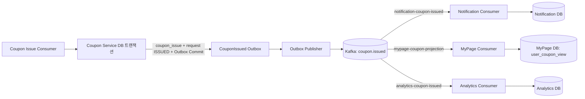
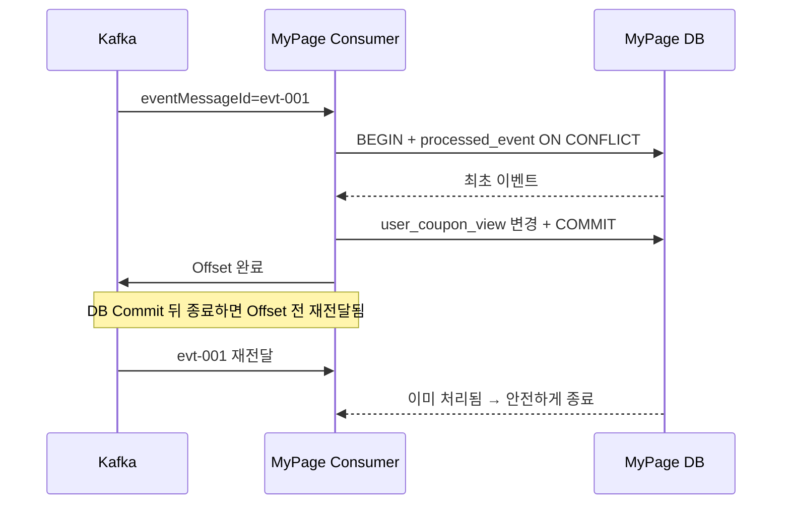
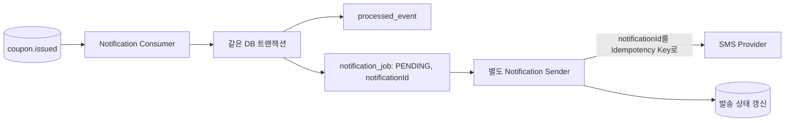
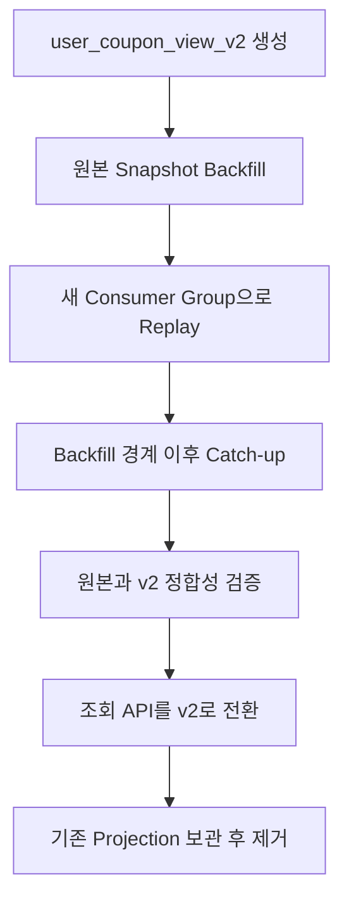

# Week 7 — EDA 기반 서비스 분리와 조회 구조

> 기준: 쿠폰 발급의 원본은 Coupon Service이며, 후속 작업의 실패는 발급 성공을 되돌리지 않는다.

## 1. 직접 호출과 EDA

| 결합 종류 | 직접 호출의 문제 | EDA 적용 후 |
| --- | --- | --- |
| 시간 결합 | 세 서비스가 요청 순간 모두 살아 있어야 한다. | Consumer는 자기 속도로 처리한다. |
| 장애 결합 | 알림 지연·장애가 발급 응답까지 전파된다. | 실패는 해당 Consumer Group에 격리된다. |
| 변경 결합 | 서비스 추가·API 변경마다 Coupon Service를 수정한다. | 새 Consumer가 이벤트를 구독하면 된다. |
| 데이터 결합 | 다른 서비스 테이블을 직접 만지기 쉽다. | 각 서비스가 자기 DB만 변경한다. |

알림 호출이 실패해도 `coupon_issue`는 이미 **ISSUED**다. DB Commit된 사실을 Rollback할 수 없고, 그렇게 하면 사용자에게 발급된 쿠폰과 DB 기록이 어긋난다. 재시도할 대상은 **Notification 작업**이며, 쿠폰 발급 명령 자체는 다시 실행하면 안 된다.



| 이름 | 종류 | 의미 | Consumer가 다시 발급하는가? |
| --- | --- | --- | --- |
| `IssueCoupon` | 명령 | 쿠폰을 발급해 달라는 요청 | 아니오. 명령을 처리하는 Coupon Service만 발급한다. |
| `CouponIssued` | 이벤트 | 쿠폰 발급이 이미 확정된 과거 사실 | 아니오. 알림·조회·통계만 갱신한다. |

EDA에도 **이벤트 스키마 계약**은 남는다. 여러 Consumer가 필드 이름·의미·버전을 믿고 처리하므로, 기존 필드를 함부로 삭제·변경하면 안 된다. EDA는 통신 방식을 바꾸는 설계이며, 한 애플리케이션 안의 모듈로 먼저 분리해도 되므로 반드시 MSA를 뜻하지는 않는다.

## 2. Consumer Group, 책임, 장애 격리

| 서비스 | Group ID | 작업 |
| --- | --- | --- |
| Notification | `notification-coupon-issued` | `notification_job` 생성 및 발송 |
| MyPage | `mypage-coupon-projection` | `user_coupon_view` 갱신 |
| Analytics | `analytics-coupon-issued` | 발급 Fact·집계 갱신 |

같은 Group의 Consumer는 같은 Record를 **각자 모두 받는 것이 아니라 나누어 처리**한다. 세 서비스가 `coupon-result` Group을 공유하면 한 쿠폰 이벤트는 셋 중 하나에만 할당될 수 있어 다른 작업이 누락된다.

| Group | Partition 6개에서 동시에 일할 수 있는 최대 Consumer | 유휴 자원 | 다른 Group 지연 영향 |
| --- | ---: | --- | --- |
| Notification (2개) | 2 | 유휴 Consumer 없음; 각 Consumer가 여러 Partition을 맡음 | 없음 |
| MyPage (4개) | 4 | 유휴 Consumer 없음; 6개 Partition을 4개 Consumer가 나눔 | 없음 |
| Analytics (1개) | 1 | 유휴 Consumer 없음; 한 Consumer가 6개 Partition을 모두 맡음 | 없음 |

Committed Offset은 “이 Group이 어디까지 완료했다고 기록했는가”를 뜻한다. 하지만 DB 변경까지 정말 정확히 됐는지, 같은 논리 이벤트가 재발행되지 않았는지는 증명하지 못한다. Group별 Offset은 독립적이므로 Notification의 지연은 MyPage Offset에 영향을 주지 않는다.

| 서비스 | 소유 데이터 | 책임 | 타 서비스 DB 직접 수정 |
| --- | --- | --- | --- |
| Coupon | `coupon_event`, `coupon_issue`, 요청, outbox | 수량·중복 검증과 발급 원장 | 불가 |
| Notification | `notification_job`, 발송 상태 | 알림을 안정적으로 요청·재시도 | 불가 |
| MyPage | `user_coupon_view` | 빠른 사용자 쿠폰 조회 | 불가 |
| Analytics | `coupon_issue_fact`, 통계 | 발급 사실과 집계 | 불가 |

| 장애 | 발급 결과 | 영향 | 영향 없음 | 복구 단위 |
| --- | --- | --- | --- |
| Notification 중단 | ISSUED 유지 | 알림 지연 | 발급·마이페이지·통계 | Notification Group |
| MyPage 중단 | ISSUED 유지 | 쿠폰함 반영 지연 | 발급·알림·통계 | MyPage Group |
| Analytics 중단 | ISSUED 유지 | 대시보드 지연 | 발급·알림·쿠폰함 | Analytics Group |

## 3. CQRS와 MyPage Read Model

| 구분 | Command / Write Model | Query / Read Model |
| --- | --- | --- |
| 목적 | 정확한 변경과 불변식 보장 | 화면에 맞는 빠른 조회 |
| 예 | 쿠폰 발급, 중복·수량 검사 | 내 쿠폰 목록 조회 |
| 구조 | 정규화된 원장 중심 | 필요한 값을 미리 모은 비정규화 모델 |
| 최종 원장 | 예 | 아니오 |
| 재구축 | 원본이므로 매우 신중 | 원본/이벤트에서 가능 |

| 문장 | 판단 | 이유 |
| --- | --- | --- |
| CQRS에는 DB 두 개가 필수다. | 틀림 | 처리 경로와 모델의 논리적 분리가 핵심이다. |
| CQRS와 Event Sourcing은 같다. | 틀림 | 함께 쓸 수 있지만 서로 다른 개념이다. |
| 같은 애플리케이션에서도 나눌 수 있다. | 맞음 | 모듈·테이블·쿼리 경로를 분리할 수 있다. |
| 테이블 이름만 나누면 CQRS다. | 틀림 | 쓰기 불변식과 읽기 목적이 실제로 분리되어야 한다. |

```sql
CREATE TABLE user_coupon_view (
    coupon_issue_id BIGINT PRIMARY KEY,
    user_id BIGINT NOT NULL,
    coupon_event_id BIGINT NOT NULL,
    status VARCHAR(20) NOT NULL,
    aggregate_version BIGINT NOT NULL,
    issued_at TIMESTAMPTZ NOT NULL,
    updated_at TIMESTAMPTZ NOT NULL,
    UNIQUE (user_id, coupon_event_id)
);

CREATE INDEX idx_user_coupon_view_user_issued
    ON user_coupon_view (user_id, issued_at DESC);
```

| 장치 | 역할 |
| --- | --- |
| PK `coupon_issue_id` | 같은 발급 건의 중복 행을 막는다. |
| UNIQUE `(user_id, coupon_event_id)` | 같은 사용자의 같은 이벤트 쿠폰 중복 노출을 막는다. |
| `(user_id, issued_at DESC)` | 최신 쿠폰 목록을 빠르게 찾는다. |

`GET /api/users/{userId}/coupons`는 조인·원격 호출 없이 화면용 데이터를 읽기 위해 Read Model을 사용한다. 일부 값이 중복되어도 빠르고 단순한 조회라는 이득이 있으며, 발급 성공의 최종 기준은 언제나 Coupon Service의 `coupon_issue`다.

| 표시 데이터 방법 | 장점 | 단점·결합 |
| --- | --- | --- |
| `CouponIssued` Snapshot 포함 | 한 이벤트만으로 즉시 표시 가능 | 이벤트 크기·스키마 관리 필요 |
| 메타데이터 Projection | 변경 이력을 독립적으로 반영 | Projection을 하나 더 관리 |
| Coupon API 동기 호출 | 데이터가 최신일 수 있음 | 장애·지연에 다시 결합 |
| Coupon DB 직접 조회 | 구현이 쉬워 보임 | 소유권 위반, 스키마 결합 |

원본 Entity 전체에는 불필요한 내부 필드와 개인정보가 섞일 수 있으므로 넣지 않고, Consumer가 필요한 안정적인 Snapshot만 전달한다.

## 4. MyPage Consumer의 멱등 트랜잭션

| 값 | 식별 대상 | 재발행 시 변경 | 멱등 Key |
| --- | --- | --- | --- |
| Partition + Offset | Kafka 안의 물리 Record 위치 | 변경됨 | 부적절 |
| `eventMessageId` | 논리 이벤트 | 변경되지 않음 | 적절 |

```sql
CREATE TABLE processed_event (
    subscriber_id VARCHAR(100) NOT NULL,
    event_message_id UUID NOT NULL,
    processed_at TIMESTAMPTZ NOT NULL DEFAULT CURRENT_TIMESTAMP,
    PRIMARY KEY (subscriber_id, event_message_id)
);
```

`subscriber_id`는 `mypage-coupon-projection`을 사용한다. Pod 이름이나 서버 IP는 재배포 때 바뀌지만, 논리 Subscriber의 이름은 계속 같아야 한다.

```sql
BEGIN;

WITH accepted AS (
  INSERT INTO processed_event (subscriber_id, event_message_id)
  VALUES ('mypage-coupon-projection', :eventMessageId)
  ON CONFLICT DO NOTHING
  RETURNING event_message_id
)
INSERT INTO user_coupon_view (
  coupon_issue_id, user_id, coupon_event_id, status,
  aggregate_version, issued_at, updated_at
)
SELECT :couponIssueId, :userId, :couponEventId, 'ISSUED',
       :aggregateVersion, :issuedAt, CURRENT_TIMESTAMP
FROM accepted;

COMMIT;
```

일반 `INSERT`의 PK 예외를 잡으면 PostgreSQL 트랜잭션은 실패(aborted) 상태가 되어 다음 SQL도 실행할 수 없다. `ON CONFLICT DO NOTHING RETURNING`은 예외 없이 최초 처리 여부를 원자적으로 알려 준다.

`processed_event`만 먼저 Commit하고 View 변경이 실패하면 재전달 때 “이미 처리함”으로 판단되어 쿠폰함이 영원히 비어 있을 수 있다. 두 변경은 반드시 한 로컬 트랜잭션이다.



자동 Commit은 끈다(`enable.auto.commit=false`). Listener는 DB 트랜잭션 성공 뒤에만 Offset을 완료하고, 실패 시 예외를 던져 완료 처리하지 않는다. 같은 Partition을 병렬 처리할 때는 앞선 미완료 Record를 건너뛰어 더 높은 Offset을 먼저 Commit하면 안 된다.

## 5. Notification과 Analytics

외부 SMS를 Consumer에서 바로 보내면 두 가지 Dual Write 문제가 생긴다.

| 장애 지점 | DB 상태 | SMS 상태 | 재전달 문제 |
| --- | --- | --- | --- |
| SMS 성공 후 DB Commit 전 종료 | 처리 기록 없음 | 이미 전송됨 | SMS가 중복 전송될 수 있다. |
| DB Commit 후 SMS 호출 전 종료 | 처리 기록만 있음 | 미전송 | 재전달을 건너뛰어 영구 미전송될 수 있다. |



`processed_event`와 `notification_job`은 반드시 같은 DB 트랜잭션으로 Commit한다. Provider가 Idempotency Key를 지원하지 않으면 외부 발송은 At-Least-Once에 가깝고 중복을 완전히 제거할 수 없다. 재시도 횟수·상태·감사 로그·사용자 중복 방지 정책이 필요하다.

단순 `issued_count = issued_count + 1`은 같은 이벤트가 두 번 오면 2 증가한다. Fact를 먼저 중복 없이 저장하고, 실제로 Fact가 추가됐을 때만 증가시킨다.

```sql
CREATE TABLE coupon_issue_fact (
    coupon_issue_id BIGINT PRIMARY KEY,
    event_message_id UUID NOT NULL UNIQUE,
    coupon_event_id BIGINT NOT NULL,
    user_id BIGINT NOT NULL,
    issued_at TIMESTAMPTZ NOT NULL
);

BEGIN;
WITH accepted AS (
  INSERT INTO coupon_issue_fact
    (coupon_issue_id, event_message_id, coupon_event_id, user_id, issued_at)
  VALUES (:couponIssueId, :eventMessageId, :couponEventId, :userId, :issuedAt)
  ON CONFLICT DO NOTHING
  RETURNING coupon_event_id
)
UPDATE coupon_issue_stats
SET issued_count = issued_count + 1
WHERE coupon_event_id = :couponEventId
  AND EXISTS (SELECT 1 FROM accepted);
COMMIT;
```

| Consumer | 한 번만 반영할 결과 | 보호 장치 | 외부 시스템 |
| --- | --- | --- | --- |
| MyPage | 쿠폰함 행 | `processed_event`, PK/UNIQUE | 없음 |
| Notification | 알림 작업 생성·발송 요청 | `processed_event`, `notificationId` | Provider 있음 |
| Analytics | Fact와 카운터 | Fact PK/UNIQUE, 같은 트랜잭션 | 없음 |

## 6. 최종적 일관성과 UX

| 시각 | 요청 상태 API | 마이페이지 | Projection |
| --- | --- | --- | --- |
| 10:00:00.010 | ISSUED | 아직 없음 | Kafka 전송 대기/진행 |
| 10:00:02.000 | ISSUED | 아직 없음 | Consumer 대기 |
| 10:00:05.300 | ISSUED | 보임 | Commit 완료 |

DB `ISSUED`와 Kafka Record 존재는 다르고, Kafka Record 존재와 MyPage 반영도 다르다. MyPage Offset Commit은 Notification 완료를 뜻하지 않으며, Outbox `PUBLISHED`도 모든 Consumer 완료를 뜻하지 않는다.

- `POST /issue` → `202 Accepted`와 `requestId`: 비동기 발급 요청을 접수한다.
- `GET /coupon-issue-requests/{requestId}` → `PENDING / ISSUED / FAILED`: 발급의 최종 상태를 확인한다.
- `GET /users/{userId}/coupons` → MyPage Read Model의 쿠폰함을 조회한다.

| 상황 | UX |
| --- | --- |
| PENDING | “쿠폰 발급을 확인하고 있어요.”와 상태 조회 제공 |
| ISSUED, 쿠폰함 미반영 | “발급 완료! 쿠폰함에 반영 중이에요.” |
| FAILED | 실패 이유와 재시도 가능 여부 안내 |
| Projection Delay 목표 초과 | “쿠폰함 반영이 지연 중입니다. 발급은 완료되었어요.” 및 자동 새로고침/문의 경로 |

Projection Delay는 `10:00:05.200 - 10:00:00.000 = 5.2초`다. 최종적 일관성은 무한 대기가 아니라 예를 들어 **95% 10초 이내** 같은 목표와 함께 운영한다. 초과하면 Lag·가장 오래된 미처리 시간·실패 수를 보고, 실패 Consumer를 재시도하거나 Projection을 재구축한다.

## 7. 순서·버전·스키마

같은 `couponIssueId`를 같은 Topic의 같은 Partition Key로 발행하면 그 Partition 안의 저장 순서가 보장된다. 전역 순서나 서로 다른 Topic 사이의 순서는 보장하지 않는다.

여러 Publisher가 `SKIP LOCKED`로 Outbox를 가져갈 때, version 1이 발행 실패 후 Backoff되고 version 2가 먼저 발행되면 DB 발생 순서는 `v1 → v2`지만 Kafka 저장 순서는 `v2 → v1`이 될 수 있다.

| 필드 | 버전 대상 | 다루는 문제 | 증가 예 |
| --- | --- | --- | --- |
| `schemaVersion` | 이벤트 JSON 구조 | Consumer와 Payload 호환성 | 호환되지 않는 Payload 구조 변경 후 v2 |
| `aggregateVersion` | 한 쿠폰 발급의 상태 변화 | 늦게 도착한 과거 상태 덮어쓰기 | ISSUED 1 → CANCELLED 2 |

```sql
INSERT INTO user_coupon_view (
    coupon_issue_id, status, aggregate_version, updated_at
) VALUES (:couponIssueId, :status, :aggregateVersion, CURRENT_TIMESTAMP)
ON CONFLICT (coupon_issue_id) DO UPDATE
SET status = EXCLUDED.status,
    aggregate_version = EXCLUDED.aggregate_version,
    updated_at = EXCLUDED.updated_at
WHERE EXCLUDED.aggregate_version > user_coupon_view.aggregate_version;
```

v2(CANCELLED) 뒤 v1(ISSUED)가 오면 최종 상태는 `CANCELLED`, 버전은 `2`, v1 UPSERT affected rows는 `0`이다.

| Consumer | 낮은 Version 생략 | 정책 |
| --- | --- | --- |
| 최신 상태 MyPage | 가능 | 현재보다 큰 버전만 반영 |
| Analytics | 보통 불가 | 모든 상태 전이가 필요하면 `current+1`만 처리 |
| Notification | 불가 | 발급·취소 알림 각각 필요, 순서·중복 정책 필요 |

현재 2에서 4가 오면 `incoming > current + 1`이 Version Gap이다. 최신 스냅샷만 필요한 Projection은 정책상 즉시 반영할 수 있지만, 모든 전이가 필요한 Consumer는 보류·재시도·Replay한다. 스키마는 선택 필드 추가는 호환 가능하지만 `userId` 삭제·의미 변경·호환 불가 Payload를 v1로 발행하는 것은 불가하다. 전화번호·비밀번호 같은 불필요한 개인정보도 이벤트에 넣지 않는다.

## 8. 재구축과 운영

| 데이터 | Source of Truth | 재구축 | 근거 |
| --- | --- | --- | --- |
| Coupon `coupon_issue` | 예 | 파생 데이터처럼 재생성하지 않음; 삭제 시 백업·원장 복구 필요 | 발급 원장 |
| `user_coupon_view` | 아니오 | 가능 | 원장 Snapshot·이벤트 |
| `coupon_issue_fact` | 아니오 | 가능 | 발급 원장·이벤트 |
| `coupon_issue_stats` | 아니오 | 가능 | Fact 재집계 |



Kafka 보관 기간이 지난 데이터는 Kafka만으로 전체 Replay할 수 없다. Coupon 원장 Snapshot 같은 복구 기준이 필요하며, Backfill 시작 시점의 watermark/버전 또는 시각 경계를 잡아 그 이후 새 이벤트를 Catch-up해야 빈틈·중복을 막는다.

| 지표 | 의미 | 장애 신호 |
| --- | --- | --- |
| Group Consumer Lag | 남은 Record 수 | MyPage Lag 지속 증가 |
| Oldest Unprocessed Age | 가장 오래된 미처리 Record 나이 | 수 분 이상 정체 |
| Projection Delay | `occurredAt`부터 DB Commit까지 | SLO 10초 초과 |
| Handler Failure Count | 처리 실패 수 | 역직렬화/DB 오류 급증 |
| Duplicate Event Count | 중복 수신·방어 수 | Publisher 장애 또는 재전달 증가 |
| Read Model Mismatch Count | 원본과 Projection 불일치 | 재구축 필요 신호 |

10분 전 쿠폰이 안 보이면 먼저 `mypage-coupon-projection` Group의 Lag, Oldest Age, 실패 수를 확인하고 `requestId`, `eventMessageId`, `couponIssueId`, `couponEventId`, `consumerGroupId`로 추적한다. Coupon 발급을 다시 실행하면 안 된다.

## 9. 잘못된 구현 리뷰

| # | 문제 코드 | 오류 | 수정 |
| ---: | --- | --- | --- |
| 1 | 세 Listener의 `coupon-result` | 서비스별 브로드캐스트가 안 됨 | Group ID 분리 |
| 2 | `smsClient.send` 직접 호출 | 외부 Dual Write·중복 SMS | job+sender+멱등 키 |
| 3 | SMS 처리 후 Offset 정책 없음 | 성공·실패 경계 불명확 | DB 성공 뒤 수동 ack |
| 4 | `acknowledge()`가 DB 변경 전 | 저장 실패에도 메시지 유실 | Commit 뒤 ack |
| 5 | `existsById` 후 `save` | 동시 처리 Race Condition | `INSERT ... ON CONFLICT` |
| 6 | `event.kafkaOffset()` | 재발행 중복을 못 찾음 | `eventMessageId` |
| 7 | View와 processed 저장 분리 | 부분 성공으로 영구 불일치 | 하나의 트랜잭션 |
| 8 | Analytics 단순 `+1` | 중복 집계 | Fact 최초 INSERT 때만 +1 |
| 9 | Version 검사 없음 | 과거 이벤트가 최신 상태를 덮음 | aggregateVersion 조건 UPSERT |
| 10 | 로그·Lag·실패 관측 없음 | 지연과 누락을 추적 못 함 | 상관관계 ID와 지표 수집 |
